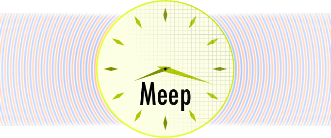

**Meep** is a free and open-source software package for [electromagnetics](https://en.wikipedia.org/wiki/Electromagnetism) simulation via the [finite-difference time-domain](https://en.wikipedia.org/wiki/Finite-difference_time-domain_method) (FDTD) method spanning a broad range of applications.

## Key Features

-   **Free and open-source software** under the [GNU GPL](https://en.wikipedia.org/wiki/GNU_General_Public_License).
-   Complete **scriptability** via [Python](https://meep.readthedocs.io/en/latest/Python_Tutorials/Basics/), [Scheme](https://meep.readthedocs.io/en/latest/Scheme_Tutorials/Basics), or [C++](https://meep.readthedocs.io/en/master/C++_Tutorial/) APIs.
-   Simulation in **1d, 2d, 3d**, and **cylindrical** coordinates.
-   Distributed memory [parallelism](https://meep.readthedocs.io/en/latest/Parallel_Meep) on any system supporting [MPI](https://en.wikipedia.org/wiki/MPI).
-   Portable to any Unix-like operating system such as [Linux](https://en.wikipedia.org/wiki/Linux), [macOS](https://en.wikipedia.org/wiki/macOS), and [FreeBSD](https://en.wikipedia.org/wiki/FreeBSD).
-   **Precompiled binary packages** of official releases via [Conda](https://meep.readthedocs.io/en/latest/Installation/#conda-packages).
-   Variety of arbitrary [material](https://meep.readthedocs.io/en/latest/Materials) types: **anisotropic** electric permittivity ε and magnetic permeability μ, along with **dispersive** ε(ω) and μ(ω) including loss/gain, **nonlinear** (Kerr & Pockels) dielectric and magnetic materials, electric/magnetic **conductivities** σ, **saturable** gain/absorption, and **gyrotropic** media (magneto-optical effects).
-   [Materials library](https://meep.readthedocs.io/en/latest/Materials/#materials-library) containing predefined broadband, complex refractive indices.
-   [Perfectly matched layer](https://meep.readthedocs.io/en/latest/Perfectly_Matched_Layer) (**PML**) absorbing boundaries as well as **Bloch-periodic** and perfect-conductor boundary conditions.
-   Exploitation of [symmetries](https://meep.readthedocs.io/en/latest/Exploiting_Symmetry) to reduce the computation size, including even/odd mirror planes and 90°/180° rotations.
-   [Subpixel smoothing](https://meep.readthedocs.io/en/latest/Subpixel_Smoothing/) for improving accuracy and shape optimization.
-   [Custom current sources](https://meep.readthedocs.io/en/latest/Python_Tutorials/Custom_Source/) with arbitrary time and spatial profile as well as a [mode launcher](https://meep.readthedocs.io/en/latest/Python_Tutorials/Eigenmode_Source/) for waveguides and planewaves, and [Gaussian beams](https://meep.readthedocs.io/en/latest/Python_User_Interface/#gaussianbeamsource).
-   [Frequency-domain solver](https://meep.readthedocs.io/en/latest/Python_User_Interface/#frequency-domain-solver) for finding the response to a [continuous-wave](https://en.wikipedia.org/wiki/Continuous_wave) (CW) source as well as a [frequency-domain eigensolver](https://meep.readthedocs.io/en/latest/Python_User_Interface/#frequency-domain-eigensolver) for finding resonant modes.
-   ε/μ and field import/export in the [HDF5](https://en.wikipedia.org/wiki/HDF5) data format.
-   [GDSII](https://meep.readthedocs.io/en/latest/Python_User_Interface/#gdsii-support) file import for planar geometries.
-   Field analyses including [discrete-time Fourier transform (DTFT)](https://meep.readthedocs.io/en/latest/Python_User_Interface/#field-computations), [Poynting flux](https://meep.readthedocs.io/en/latest/Python_Tutorials/Basics/#transmittance-spectrum-of-a-waveguide-bend), [mode decomposition](https://meep.readthedocs.io/en/latest/Python_Tutorials/Mode_Decomposition/) (for [S-parameters](https://meep.readthedocs.io/en/latest/Python_Tutorials/GDSII_Import/#s-parameters-of-a-directional-coupler)), [energy density](https://meep.readthedocs.io/en/latest/Python_User_Interface/#energy-density-spectra), [near to far transformation](https://meep.readthedocs.io/en/latest/Python_Tutorials/Near_to_Far_Field_Spectra/), [frequency extraction](https://meep.readthedocs.io/en/latest/Python_Tutorials/Basics/#modes-of-a-ring-resonator), [local density of states](https://meep.readthedocs.io/en/latest/Python_Tutorials/Local_Density_of_States/) (LDOS), [modal volume](https://meep.readthedocs.io/en/latest/Python_User_Interface/#field-computations), [scattering cross section](https://meep.readthedocs.io/en/latest/Python_Tutorials/Basics/#mie-scattering-of-a-lossless-dielectric-sphere), [Maxwell stress tensor](https://meep.readthedocs.io/en/latest/Python_Tutorials/Optical_Forces/), [absorbed power density](https://meep.readthedocs.io/en/latest/Python_Tutorials/Basics/#absorbed-power-density-map-of-a-lossy-cylinder), [arbitrary functions](https://meep.readthedocs.io/en/latest/Field_Functions/); completely programmable.
-   [Adjoint solver](https://meep.readthedocs.io/en/latest/Python_Tutorials/Adjoint_Solver) for **inverse design** and **topology optimization**.
-   [Visualization routines](https://meep.readthedocs.io/en/latest/Python_User_Interface/#data-visualization) for the simulation domain involving geometries, fields, boundary layers, sources, and monitors.

## Citing Meep

We kindly request that you cite the following paper in any published work for which you used Meep:

- A. Oskooi, D. Roundy, M. Ibanescu, P. Bermel, J.D. Joannopoulos, and S.G. Johnson, [MEEP: A flexible free-software package for electromagnetic simulations by the FDTD method](http://dx.doi.org/doi:10.1016/j.cpc.2009.11.008), Computer Physics Communications, Vol. 181, pp. 687-702 (2010) ([pdf](http://ab-initio.mit.edu/~oskooi/papers/Oskooi10.pdf)).

## Documentation

See the [manual on readthedocs](https://meep.readthedocs.io/en/latest) for the latest documentation.
