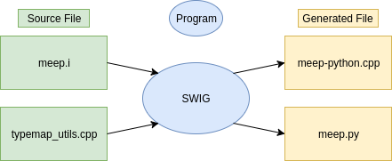

---
# C++ Developer Information
---

Meep Design
-----------

An overview of Meep's inner workings is summarized in [Computer Physics Communications, Vol. 181, pp. 687-702, 2010](http://ab-initio.mit.edu/~oskooi/papers/Oskooi10.pdf). This page is a supplement which provides a description of the source code.

[TOC]

### Data Structures and Chunks

Meep employs several data structures declared in `meep.hpp`. The principal data structure element is the **chunk**. A chunk is a contiguous rectangular portion of the computational grid. For example, when Meep runs on a parallel system, each process gets one or more disjoint chunks of the grid. There are several different types of chunks:

-   `fields` and `fields_chunks`
-   `structure` and `structure_chunks`
-   `dft` and `dft_chunks`

As an example, the `fields` class encapsulates the simulated fields over the entire grid, and one of its members is an array of `fields_chunk` variables that the grid is divided into. The `fields_chunk` variables are where the field is actually stored. Every parallel process has a nearly-identical fields variable with a nearly-identical list of chunks. Chunks on one process which have been assigned to another process do not store their fields arrays, and are just placeholders.

If a given material or field is not present in a given chunk, it need not be stored. For this reason, the PML boundary regions are separated into their own chunks, even on one processor, in order that the extra data for PML need not be stored for the whole grid.

In the future, we may implement support for different chunks with different resolution, to allow nonuniform spatial resolution.

Similarly for `structure` and `structure_chunks`, except that it is only for materials parameters such as epsilon, etc. and not for simulated fields.

`dft_chunk` stores accumulated Fourier-transformed fields corresponding to a given chunk.

### `grid_volume` and `volume`

The `volume` class declared in `meep/vec.hpp` represents a rectangular box-like region, parallel to the $XYZ$ axes, in "continuous space" &mdash; i.e. the corners can be at any points, not necessarily grid points. This is used, for example, whenever you want to specify the integral of some quantity (e.g., flux, energy) in a box-like region, and Meep interpolates from the grid as necessary to give an illusion of continuity.

The `grid_volume` class declared in `meep/vec.hpp` is a box of pixels. It stores the resolution, the number of pixels in each direction, the origin, etcetera. Given a `grid_volume`, there are functions to get the `volume` corresponding to the bounding box, etcetera. There is a `grid_volume` object associated with the whole computational grid, and with each chunk in the grid. There are various tricky aspects to the `grid_volume`. One is associated with the Yee grid: it has to know about different field components stored at different points. Another is associated with the fact that boundary conditions, not only the overall grid boundaries but also boundaries between chunks, are handled by an extra layer of "not-owned" pixels around the boundaries. So each chunk's `grid_volume` has "owned" grid points that the chunk is responsible for updating, and "not-owned" grid points that are updated using the boundary conditions. And thanks to the Yee grid which complicates everything in FDTD, unfortunately, the set of owned and not-owned coordinates is different for each field component. The `grid_volume` class keeps track of all this.

### File Organization

The core Meep C++ simulation code (all of the physics) is located in the `src/` directory, with C++
tests in the `tests/` directory.  The `libmeepgeom/` directory provides a C++ library to specify Meep
geometries in terms of a list of geometric objects (spheres, cylinders, boxes) with various
material properties (via [libctl](https://github.com/stevengj/libctl)'s geometry library), and is
also used by the Python interface.

The Scheme and Python interfaces are found in the `scheme/` and `python/` directories, respectively;
both of them use [SWIG](http://www.swig.org/) to generate wrapper code from the C++ header files,
but also have hand-written Scheme/Python code to provide a higher-level interface.  The `libpympb/`
directory contains a Python interface to MPB, which will eventually be moved to the MPB repository.

The following table briefly describes the purpose of some of the source files:

| Header File         | Description                                                                                                                                                                                                                                                                                                           |
|---------------------|-----------------------------------------------------------------------------------------------------------------------------------------------------------------------------------------------------------------------------------------------------------------------------------------------------------------------|
| meep/vec.hpp        | Declares geometry-related classes like vec, ivec, grid_volume, volume and related utility functions.                                                                                                                                                                                                                 |
| meep/mympi.hpp      | Declares functions for initializing the meep application, cleanup, and data exchange accounting for the presence or absence of MPI. These functions present a unified interface to the rest of the application.                                                                                                       |
| meep.hpp            | All public classes likes fields, fields_chunks, structure, structure_chunks, src_time, continuous_src_time, material_function, h5_file, polarizability_identifier etc.                                                                                                                                        |
| meep_internals.hpp | Hosts declarations for classes like polarizability, polarization, src_vol, and bandsdata. Also defines macros for frequently-used loop constructs like DOCMP that are internal to Meep implementation.                                                                                                               |
| bicgstab.hpp        | Declares functions related to an implementation of an iterative solver for non-symmetric linear operators based on a generalization of the stabilized biconjugate-gradient (BiCGSTAB) algorithm proposed by van der Vorst (and described in the book "Templates for the Solution of Linear Systems" by Barrett et al. |

The following table briefly describes what is in each .cpp file:

| Source File      | Description                                                                                                |
|------------------|------------------------------------------------------------------------------------------------------------|
| polarization.cpp | Implement member functions for the polarization and polarizability classes declared in meep_internals.hpp |
| bicgstab.cpp     | Implements the solver described against bicgstab.hpp (see above)                                           |

#### Functionality Organization

| Functionality                                                                                                  | Location                                                                                                                     |
|----------------------------------------------------------------------------------------------------------------|------------------------------------------------------------------------------------------------------------------------------|
| Material dispersion                                                                                            | polarization.cpp, update_from_e.cpp, and friends.                                                                          |
| Vectors, volumes etc.                                                                                          | meep/vec.hpp, vec.cpp                                                                                                        |
| Geometric objects                                                                                              | handled by [libctl](https://github.com/stevengj/libctl) functions in libctl's geom.c, called from the Scheme front-end (not handled by Meep) |
| Fields: initialization, cleanup, chunking, stepping-plan, (dis)affiliation with sources, polarizabilities etc. | fields.cpp                                                                                                                   |
| Structure: initialization, cleanup, chunking, material parameters, boundary conditions etc.                    | structure.cpp                                                                                                                |
| MPI interface                                                                                                  | meep/mympi.hpp, mympi.cpp                                                                                                    |

### Deprecated Interfaces

Beware that some of the interfaces in the source code and in the old manual are now deprecated, as they have been superseded by newer features and may be removed at some point.

In particular, you should probably avoid:

-   The `monitor_point` class. Just declare an array to store the fields you want, get them with `fields::get_field`, and analyze them with `do_harminv`. Or, to accumulate the DFT as you run, use the `dft_chunk` class via `fields::add_dft`.
-   Slice and EPS output. This has been superseded by HDF5 output, which is much more flexible and efficient.

---
# Python Developer Information

## Overview

The `meep` Python package consists of a low-level interface and a high-level interface. The low-level interface is the direct result of running [SWIG](http://www.swig.org/) on the C++ headers.

<center></center>

Next, we compile `meep-python.cpp`, rename `meep.py` to `__init__.py` and put them in a folder called `meep`. Putting all the code in `__init__.py` allows us to access the symbols directly from the `meep` namespace rather than going through an additional module like `meep.meep.vec`. Now we have a complete Python package.

<center></center>

`__init__.py` contains "proxy" classes for all public `meep` objects. They hold a `this` pointer that dispatches to the appropriate C++ functions in the `_meep.so` extension module. The interface this package exposes is basically the same as the C++ interface. That is, a simulation written in this low-level Python interface would not look much different from the same simulation written in C++. By implementing a high-level interface on top of the basic SWIG wrappers, we can abstract away many of the low details of setting up a simulation, take advantage of Python language features like keyword arguments, and gain productivity from libraries like numpy.

## Package Organization

After adding the high-level interface files, the `meep` package looks like this.
```bash
meep
├── __init__.py
├── _meep.so
├── geom.py
├── simulation.py
└── source.py
```
Fow now, the Python `MPB` interface is also included in the `meep` package. It's constructed in the same manner as the `meep` package. The low-level interface is in `meep/mpb/__init__.py` and `meep/mpb/_mpb.so`, and the high-level interface is in `solver.py`. Here is a view of the complete package.
```bash
meep
├── mpb
│   ├── __init__.py
│   ├── _mpb.so
│   ├── mpb_data.py
│   └── solver.py
├── __init__.py
├── _meep.so
├── geom.py
├── simulation.py
└── source.py
```

## Description of Files

### `meep.i`

SWIG interface file for the `meep` Python module. Includes typemaps, helper functions, and module initialization code. The typemaps mostly call other helper functions defined either in `meep.i`, or in `typemap_utils.cpp` (if the function is used in `mpb.i` too). There are also various `py_*_wrap` functions that handle calling user defined Python functions from C++. Everything in the `%pythoncode` block at the end of the file is run once when the `meep` module is first imported. See the [SWIG documenation](http://www.swig.org/Doc3.0/SWIGDocumentation.html) for more details.

### `vec.i`

SWIG interface file for `vec.hpp`. Included into `meep.i`. SWIG warnings are disabled (if found benign) in this file.

### `numpy.i`

Typemaps for `numpy` arrays (taken from the numpy [Github repository](https://github.com/numpy/numpy/blob/master/tools/swig/numpy.i)). See the [documentation](https://docs.scipy.org/doc/numpy-1.13.0/reference/swig.interface-file.html) for instructions on using these typemaps.

### `typemap_utils.cpp`

Utility functions for writing SWIG typemaps. Since this file is included into both `meep.i` and `mpb.i`, only code that is useful to both interface files should be put here (otherwise the compiler complains about unused functions). Code used only by one interface should be put in the respective `.i` file. The majority of the code in this file is for converting the Python geometric objects defined in `geom.py` to C objects. The `get_attr_*` functions are helpers for getting C versions of attributes on Python objects. The convention in the file is for functions to return `1` on success and `0` on failure so that the top level typemaps in `meep.i` can be written as:

```c++
%typemap(in) type {
    if(!py_type_to_type($input, &$1)) {
        SWIG_fail;
    }
}
```
Keeping the code within `%typemap` blocks small is valuable because it gets copied everywhere the typemap is used, which can lead to code bloat.

### `geom.py`

Pure Python implementations of the geometric objects defined in `libctl`. The user-defined list of objects (`Simulation.geometry`) gets converted to C objects when `meep.set_materials_from_geometry` is called in `Simulation._init_structure`. The function responsible for this conversion is `typemap_utils.cpp:py_list_to_gobj_list`. This file also contains classes that represent materials (`Medium`) and susceptibilities, and cartesian/reciprocal/lattice conversion functions. Note that when adding a class or function to this file, it must also be imported in the `%pythoncode` block at the end of `python/meep.i` if you want it to be directly accessible from the `meep` namespace (i.e., to get `meep.MyClass` instead of `meep.geom.MyClass`).

### `simulation.py`

Holds the `Simulation` class, which is the primary abstraction of the high-level interface. Minimally, a simulation script amounts to passing the desired keyword arguments to the `Simulation` contructor and calling the `run` method on the resulting instance. The various step functions are also included in this file. When adding extra functions or class to this file, an import statement should also be added to the `%pythoncode` block at the bottom of `python/meep.i`.

### `source.py`

Holds classes representing sources, including `GaussianSource`, `ContinuousSource`, `CustomSource`, and `EigenModeSource`. When adding extra functions or class to this file, an import statement should also be added to the `%pythoncode` block at the bottom of `python/meep.i`.

### `mpb.i`

SWIG interface file for the `meep.mpb` Python module.

### `solver.py`

Classes and functions related to the high-level Python interface to `MPB`. Additional classes or functions in this file should be accompanied by an `import` statement in the `%pythoncode` block at the bottom of `mpb.i`.

### `mpb_data.py`

Definition of `MPBData`, a Python class useful for `MPB` data analysis (documented [here](https://mpb.readthedocs.io/en/latest/Python_Data_Analysis_Tutorial). This is is a Python port of the functionality available in the [`mpb-data` command line program](https://github.com/stevengj/mpb/blob/master/utils/mpb-data.c) originally written in C.
