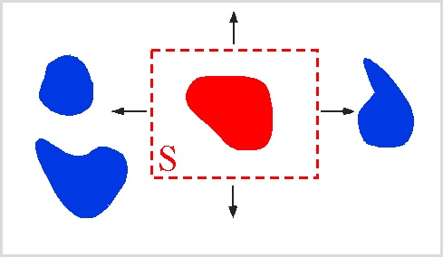
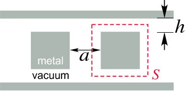
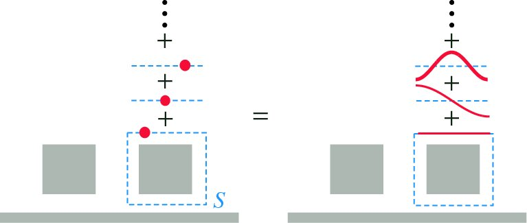
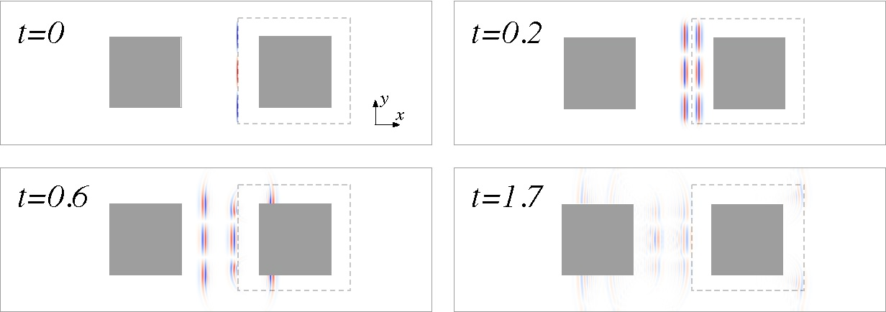
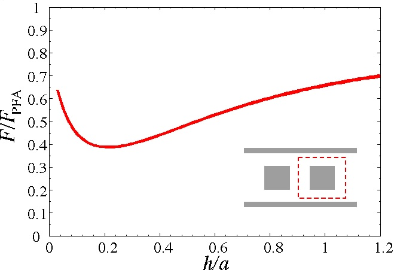
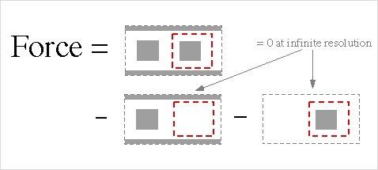
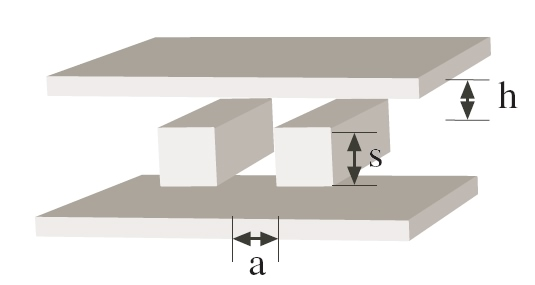
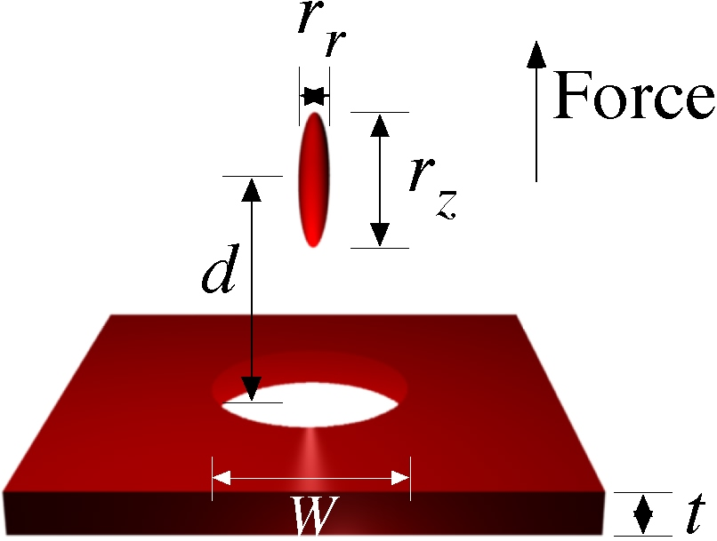
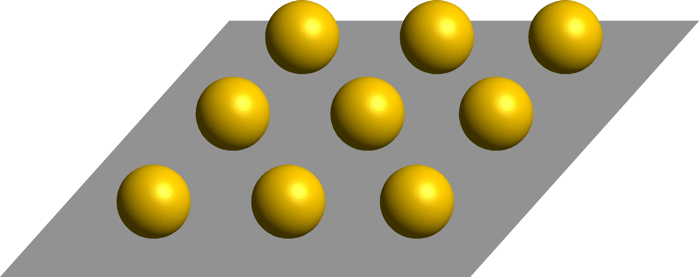

Computing Casimir forces with Meep
----------------------------------

It is possible to use the [Meep](Meep.md) time-domain simulation code in order to calculate [Casimir forces](https://en.wikipedia.org/wiki/Casimir_force) (and related quantities), a quantum-mechanical force that can arise even between neutral bodies due to [quantum vacuum](https://en.wikipedia.org/wiki/Vacuum_state) fluctuations in the electromagnetic field, or equivalently as a result of geometry dependence in the quantum [vacuum energy](https://en.wikipedia.org/wiki/Vacuum_energy). Go [here](http://jdj.mit.edu/wiki/index.php/Meep_download) to download Meep.

Calculating Casimir forces in a classical finite-difference time-domain (FDTD) Maxwell simulation like Meep is possible because of a new algorithm described in:

-   Alejandro W. Rodriguez, Alexander P. McCauley, John D. Joannopoulos, and Steven G. Johnson, [Casimir forces in the time domain: Theory](http://arxiv.org/abs/0904.0267), Phys. Rev. A, 80 012115 (April 2009).
-   Alexander P. McCauley, Alejandro W. Rodriguez, John D. Joannopoulos, and Steven G. Johnson, [Casimir forces in the time domain: Applications](http://arxiv.org/abs/0906.5170), Phys. Rev. A, 81 012119 (January 2010).

These papers describe how any time-domain code may be used to efficiently compute Casimir forces without modification of the internal code. Meep contains several optimizations of these algorithms, allowing for very rapid computation of Casimir forces (reasonably-sized two-dimensional systems can be solved in a matter of seconds).

This page will provide some tutorial examples showing how these calculations are performed for simple geometries. For a derivation of these methods, the reader is referred to the papers above, which will be referred to as Part I and Part II in this webpage.

Introduction
------------

In this section, we introduce the equations and basic considerations involved in computing the force using the method presented in Rodriguez et. al. ([1](https://journals.aps.org/pra/abstract/10.1103/PhysRevA.80.012115)). Note that we keep the details of the derivation to a minimum and instead focus on the calculational aspects of the resulting algorithm.

The general setup for a Casimir force computation is shown in the following figure:





The goal is to determine the Casimir force on one object (shown in red) due to the presence of other objects (blue).

Classically, the force on the red object due to the electromagnetic field can be computed by integrating the Maxwell stress tensor $M_{ij}$ (ref: Griffiths) over frequency and over any surface enclosing only that object as shown above.

The classical force is then:

$$F_i^{Classical} = \int_S \int_0^\infty M_{ij}(\omega,x) d\omega dS_j$$

where the Maxwell stress tensor is given by:

$$M_{ij}(\omega,x) \equiv E_i(\omega,x)E_j(\omega,x) + H_i(\omega,x)H_j(\omega,x) - \frac{1}{2}\delta_{ij}\sum_{k=1}^3 \left(E_k^2(\omega,x) + H_k^2(\omega,x) \right)$$

As has been known for several decades (reviewed [here](http://math.mit.edu/~stevenj/papers/RodriguezIb07-pra.pdf)), the the Casimir force can be obtained by a similar integral, except that the stress tensor is replaced with the expectation value of the corresponding operator in the quantum-mechanical ground state of the system:

$$F_i^{Casimir} = \int_S \int_0^\infty < M_{ij}(\omega,x) > d\omega dS_j$$

In Part I, it is shown how this formulation can be turned into an algorithm for computing Casimir forces in the time domain. The reader is referred there for details. Below we present the basic steps used in our implementation.

Implementation
--------------

The basic steps involved in computing the Casimir force on an object are:

1.  Surround the object for which the force is to be computed with a simple, closed surface $S$. It is often convenient to make $S$ a rectangle in two dimensions or a rectangular prism in three dimensions.
2.  Add a uniform, frequency-independent conductivity $\sigma$ to the dielectric response of every object (which is easily done Meep). The purpose of this is to rapidly reduces the time required for the simulations below. As discussed in Part I, adding this conductivity in the right way leaves the result for the force unchanged.
3.  Determine the Green's function along $S$. This is done by measureing the electric **E** and magnetic **H** fields on $S$ in response to a set of different current distributions on $S$ (more on the form of these currents later).
4.  Integrate these fields over the enclosing surface $S$ at each time step, and then

integrate this result, multiplied by a known function $g(-t)$, over time $t$.

The Casimir force is given by an expression of the form:

$$F_i = \sum_n \mathrm{Im} \int_0^\infty dt \, g(t) \int_S dS_j(\textbf{x}) f_n(\textbf{x}) \Gamma_{ij;n}(t,\textbf{x})$$

where the $\Gamma_{ij;n}$ are the fields in response to sources related to the functions $f_n$ (discussed in detail later), $S$ is an arbitrary closed surface enclosing the object for which we want to compute the Casimir force, $g(t)$ is a known function, and the index $n$ ranges over all of the integers.

The functions $\Gamma_{ij;n}(t,\textbf{x})$ are related to the Maxwell stress tensor introduced in the previous section. Here the frequency integration has been turned into an integration over time, which is especially suited for our purposes.

Note that the precise implementation of step (3) will greatly affect the efficiency of the method. For example, computing the fields due to each source at each point on the surface separately requires a separate Meep calculation for each source (and polarization). This corresponds to taking $f_n(\textbf{x}) = \delta(\textbf{x}-\textbf{x}_n)$ for each point $\textbf{x}_n \in S$, and the sum over $n$ becomes an integration over $S$. As described in Part II ([arXiv:0906.5170](http://arxiv.org/abs/arXiv:0906.5170)), we are free to take $f_n$ to be any basis of orthogonal functions. Picking an extended basis (e.g. cosine functions or complex exponentials $e^{ikx}$) greatly reduces the number of simulations required.

Example: two-dimensional blocks
-------------------------------

In this section we calculate the Casimir force in the two-dimensional Casimir piston configuration ([Rodriguez et. al](http://math.mit.edu/~stevenj/papers/RodriguezIb07.pdf)) shown below:





This is described in the sample file rods-plates.ctl ([2](http://ab-initio.mit.edu/~mccauley/casimir-examples/rods-plates.ctl)). The dashed red lines indicate the surface $S$. This system consists of two metal $a\times a$ squares in between metallic sidewalls. To run a simulation in which the blocks are (nondispersive) dielectrics one can simply change their materials in the definitions as in a normal Meep simulation. For dispersive dielectrics a few extra steps are needed, which is discussed in a later section.

First define the geometry, consisting of the two metal sidewalls (each 2 pixels thick) and the two blocks:

```
 (set-param! resolution 40) 
 (define a 1)
 (define-param h 0.5)
 (set! geometry
    (list (make block (center 0 (+ (/ a 2) h (/ resolution))) ;upper sidewall 
                                  (size infinity (/ 2 resolution) infinity) (material metal))
            (make block (center 0 (- (+ (/ a 2) h (/ resolution)))) ;lower sidewall
                                  (size infinity (/ 2 resolution) infinity) (material metal))
            (make block (center a 0) (size a a infinity) (material metal)) ;right block
            (make block (center (- a) 0) (size a a infinity) (material metal)))) ;left block
```


Define an air buffer on either side of the blocks and the PML thickness. Then set the computational cell size, and add in pml on the left/right sides:

```
 (define buffer 1)
 (define dpml 1)
 (set! geometry-lattice (make lattice (size (+ dpml buffer a a a buffer dpml) (+ (/ 2 resolution) h a h (/ 2 resolution)) no-size))) 
 (set! pml-layers (list (make pml (thickness dpml) (direction X))))
```


Define the source surface $S$; here we take it to be a square with edges 0.05 away from the right block on each side:

```
 (define S (volume (center a 0) (size (+ a 0.1) (+ a 0.1))))
```


As described in Part II, we add a uniform, frequency-independent D-conductivity $\sigma$ everywhere:

```
 (define Sigma 1)
```


(note that "sigma" is another built-in Meep parameter, so here we use a capital S).

As discussed in Part I, the optimal value of $\sigma$ depends on the system under consideration. In our case, $\sigma = 1$ is optimal or nearly optimal. With this choice value of `Sigma`, we can use a very short runtime `T` for the simulation:

```
 (define-param T 20)  
```


The only thing left to define is the function $g(-t)$. This is done with the Meep function `(make-casimir-g` `T` `dt` `Sigma` `ft)`:

```
 (define gt (make-casimir-g T (/ Courant resolution) Sigma Ex))
```


Here we can pass in either field type Ex or Hx. Since the E/H fields are defined for integer/half-integer units of the time step dt, we technically require a different $g(t)$ for both polarizations, and this option is allowed. However, for this example we get sufficient accuracy by using the same function for all polarizations.

### Sources

The user does not have to explicitly construct the $f_n(\textbf{x})$ source basis for Casimir calculations. This is all done inside of Meep (see below). The user only has to specify how many harmonic moments $n$ to use for the simulation. Here we briefly describe what is done inside of Meep.

The built-in source basis used in Meep for this type of computation consists of a Cosine basis. For each side of $S$ and each non-negative integer $n$, this defines a source distribution:

$$f_n(x) = \sqrt{\frac{c_n}{L}} \cos \left(\frac{n\pi x}{L}\right), ~n = 0,1,\ldots$$

where $c_n = 1$ if $n=0$ and $c_n=2$ otherwise, $L$ is the side length (if each side has a different length, then the functions $f_n(x)$ will differ for each side). An illustration of these functions for the system under consideration, compared to point sources, is shown below:





For the simulation, we must truncate the sum over $n$ to some finite upper limit `n-max`. Typically, a value of 10 is sufficient to get results to within 1%:

```
 (define-param n-max 10) 
```


To illustrate the field profiles, below we show four snapshots at different times for what we term $\Gamma^E_{yy;n=2}(\textbf{x},t)$, the $y$-component of the electric field response to a $y$-polarized current source with spatial dependence $f_2(x)$





As the fields continue to propagate, the finite conductivity `Sigma` causes the fields to decay rapidly. By $T\simeq 20$ the fields have all but vanished. Note that the user is not confined to use this Cosine basis, but that this type is already built into meep and therefore offers the greatest convenience.

### Running the Simulation

Computing the Casimir force involves running several independent Meep simulations for each set of parameters. The fact that they are independent makes the problem very easy to run in parallel, which is why we implemented the calculation as a series of independent Meep simulations. These parameters are grouped into the following lists:

```
 (define pol-list (list Ex Ey Ez Hx Hy Hz))          ;source polarizations
 (define side-list (list 0 1 2 3))                            ;each side of the square surface S
 (define n-list (if (eq? n-max 0) (list 0) (interpolate (- n-max 1) (list 0 n-max))))    ;number of terms in source sum
```


For each value of n, side number, and polarization, we run a short meep simulation. For convenience, the source construction, simulation, and field integration are all taken care of by the Scheme function `casimir-force-contrib`, defined in "/libctl/casimir.scm" (included in the Meep-1.1 release):

```
 (casimir-force-contrib force-direction integration-vol N Sigma T source-component gt)
```


Here the desired component of the Casimir force is the X direction (all others are zero by symmetry), and the source volume is S. The integer N is defined to be $N\equiv 4\times n + \mathrm{side}$.

To find the casimir force, one simply iterates over the parameter lists constructed above, each time adding the result of `casimir-force-contrib` to the total force:

```
 (define total-force 0)
 (do ((n 0 (1+ n))) ((= n (length n-list))) ;source components
     (do ((side 0 (1+ side))) ((= side (length side-list))) ;sides of S
        (do ((p 0 (1+ p))) ((= p (length pol-list))) ;field polarizations
            (let* ((curr-pol (list-ref pol-list p))
                      (N (+ (* 4 n) side)))
                    (set! total-force
                       (+ total-force
                            (casimir-force-contrib X S N Sigma T curr-pol gt)))))))
```


### Results

The result, when sampled over many values of $h$, is a force curve that varies non monotonically in $h$:





Here the force is measured relative to the value obtained by the PFA (proximity-force approximation), a simple approximation for the force used in lieu of an exact analytic expression or a numerically accurate value. As is clear from the figure, the behavior of the force deviates significantly from the PFA, indicating the need for accurate algorithms for computing the Casimir force.

Using the built-in functions above, it takes roughly 20 seconds to run simulation at resolution 40 for each value of $n$, including all sides of $S$ and all field polarizations. Typically, only $n\leq 10$ are needed to get the force to high precision, so the Casimir force for this system (for a single value of `h`) can be determined in under two minutes on a single processor.

Important Numerical Considerations
----------------------------------

Before going on to discuss more complicated simulations, we pause a moment to discuss some important practical considerations for running a simulation.

### Vacuum Subtraction

In the 2d blocks example discussed above, as long as the source surface is square an close to the right block, the force converges rapidly with resolution. However, if the user varies the source surface (for example, using a rectangular source surface or one that is not placed symmetrically around the right block), they may get a drastically different result. This is entirely a numerical artifact, as the correct Casimir force should be independent of the source surface used (as long as that surface does not intersect any objects).

This numerical artifact can be removed by a simple procedure, called vacuum subtraction. This procedure consists of running two additional simulations with certain objects deleted and subtracting the results, illustrated below:

The procedure for the double blocks case is illustrated below:





In an ideal case of infinite spatial resolution, only the first term is nonzero. However, due to discretization effects, for finite resolution they can be quite large and will depend on the source surface. The total vacuum-subtracted force, however, will still be well-behaved for finite resolution.

For example, in the blocks example previously discussed, if one were to shift the center of the soruce surface so that it doesn't align with the right block (but still doesn't overlap with any other objects), the force will get contributions from both vacuum subtraction terms.

The vacuum terms should go to zero as resolution is increased, however they may do so quite slowly. Also it is important to remember that only the total force (ie summed over all values of $n$) that should converge to zero, so several values of $n$ must be retained in order to verify this.

Although this procedure adds to the computational cost of the problem, it is very easy to implement (it is demonstrated in the rods-plates.ctl example file) and can oftentimes be essential to get a meaningful result.

### Simulation Time

As discussed in Part I, the time-convergence of a simulation depends on the size of the system. This can generally be optimized by varying the value of the conductivity $\sigma$. The convergence rate also depends on the dielectric function of the medium. This makes sense because a high-dielectric medium has a longer optical thickness than vacuum. The optimal value of $\sigma$ depends on the system, but generally decreases if the dielectric of the medium is increased (for example, for simulations where the dielectric of the medium is ethanol, the optimal value is somewhere around $\sigma \sim 0.2$).

Running a long simulation to determine temporal convergence is not a large numerical task, because the temporal convergence is largely independent of the spatial resolution and harmonic moment $n$, so one can simply run a long low resolution job.

### Boundary Effects

The Casimir force between metals can be very strong, while the force between dielectric bodies may be much weaker. It is then important to use the appropriate boundary conditions. For example, the default boundary conditions in Meep are metallic - if the boundaries are close enough, the Casimir force between the bodies and the metal walls will overwhelm their mutual their mutual forces. Usually to avoid this problem (unless the problem specifically requires the objects to be in a metal box), specifying periodic boundary conditions by calling `(set!` `k-point` `(vector3` `0` `0` `0)` works the best, even in the presence of PML.

Parallelization
---------------

If you look at the example file rods-plates.ctl ([3](http://ab-initio.mit.edu/~mccauley/casimir-examples/rods-plates.ctl)), you'll notice that the parameter lists are handled very differently than in the example given above. This is because it has been written in a way to take the most advantage of parallel computation.

Each Casimir force calculation requires many different, very short Meep simulations. For this type of computation, it is most efficient when running on a cluster to let each individual processor handle a subset of these simulations, rather than dividing up every simulation among the entire cluster (the default behavior for meep-mpi). This way the speedup is almost exactly linear in the number of processors used. All of the functions used below are defined in the file parallel.scm ([4](http://ab-initio.mit.edu/~mccauley/casimir-examples/parallel.scm)), which should be included in the header of any ctl file using them.

Our strategy (shown in rods-plates.ctl ([5](http://ab-initio.mit.edu/~mccauley/casimir-examples/rods-plates.ctl))) is as follows: each Casimir force calculation has a set of "internal" indices, each of which denotes a separate simulation. The sum of the results from all of these simulations gives the actual force. In our example (as in most examples), the internal indices are the source polarization, the list of sides for the source surface, and the harmonic moments $n$:

```
 (define pol-list (list Ex Ey Ez Hx Hy Hz)) ;source polarizations
 (define sides (list 0 1 2 3)) ;four sides of square/rectangle
 (define n-list (parallel-make-list n-min n-max 1))
```


The function `(parallel-make-list` `x-min` `x-max` `dx)` is similar to the `interpolate` function, making a list of equally spaced elements (of spacing dx) between x-min and x-max. The difference is that the spacing is fixed at dx, so the upper limit will be rounded; also if x-min and x-max are equal, it returns a list of one element.

All internal indices are combined into one list:

```
 (define Int-list (list n-list pol-list sides))
```


Similarly, the "external" parameters correspond to different physical configurations. For example, if we want to simulate over a range of sidewall spacing $h$ and block separations $d$, as in the example calculation above, we don't have to run separate simulations. Rather, we just group all of them together into Ext-list:

```
 (define-param d-min 1)
 (define-param d-max 2)
 (define-param dd 0.25)
 (define d-list (parallel-make-list d-min d-max dd))
 (define-param h-min 0.2)
 (define-param h-max 1)
 (define-param dh 0.1)
 (define h-list (parallel-make-list h-min h-max dh))
 (define Ext-list (list d-list h-list))
```


Now define several lists to be used later:

```
 (define param-info (make-params-list Ext-list Int-list))
 (define param-list (list-ref param-info 0))   ;%%% Each element contains all relevant parameters for a single simulation
 (define Next (list-ref param-info 1))
 (define Nint (list-ref param-info 2))
 (define Nsims (* Next Nint))  ;%%% Total number of simulations
 (define force-list (make-list Next 0)) ;%%% Holds the final values of the forces
```


Divide up the computation into multiple processors:

```
 (define nproc (meep-count-processors))
 (define ngroups (min Nsims nproc))
 (define mygroup (meep-divide-parallel-processes ngroups)) ;%%% Index of the current processor group
 (define my-sims (get-indices Nsims nproc mygroup))  
```


`my-sims` contains the indices of the list `param-list` that the local processor group will simulate. For each element of `my-sims`, we wish to have a routine to run the simulation and add its contribution to the list of forces `force-list`. This is done below for the procedure `run-sim`:

```
 (define (run-sim current-sim)    ;%%% current-sim is the index of the current simulation
    (let*  ((index-info (get-ie-indices current-sim Next Nint))   ;indices (i-internal, i-external) of the current force component
               (i-internal (list-ref index-info 0))
               (i-external (list-ref index-info 1))
               ;%%%% Set the current simulation parameters
               (curr-params (list-ref param-list current-sim))
               (curr-d (list-ref curr-params 0))           ;%%% Current block spacing d
               (curr-h (list-ref curr-params 1))           ;%%% Current sidewall spacing h
               (curr-n (list-ref curr-params 2))           ;%%% Current multipole index n
               (curr-pol (list-ref curr-params 3))        ;%%% Current source field polarization
               (curr-side (list-ref curr-params 4))      ;%%% Current source surface side 
              ;%%% Set other relevant geometry parameters: computational cell size, etc.
               (curr-force 0)   ;%%% Value of the force contribution
              ) ;close first paren of let*
       ;%%%% Set up the geometry and run the computation as before, reading the result into curr-force
        
       ;%%% Add curr-force to the total force list
       (list-set! force-list i-external (+ curr-force (list-ref force-list i-external)))))
```


Now call `run-sim` for every index of `my-sims`:

```
 (do ((j 0 (1+ j))) ((= j (length my-sims)))
      (run-sim (list-ref my-sims j)))
```


After the computation, the force values are stored in each local group; they must be re-summed globally by calling `sum-to-all`. However, when we do this, we must take into account that `sum-to-all` will add the force for each processor in the local group. This means that if there are four CPUs in the local group, the force contribution will be counted four times. This is undone by first dividing the force list by the number of processors in the local group:

```
 (define myprocs (meep-count-processors))
 (define (renorm x) (/ x myprocs))
 (set! force-list (map renorm force-list))
```


We can now sum up all force contributions:

```
 (meep-begin-global-communications)
 (define total-force (complex-sum-list-to-all force-list))
 (meep-end-global-communications)
```


Print out the values of the force, along with the relevant (external) simulation parameters:

```
 (define Ext-params-list (list-direct-prod Ext-list))  ;%%% Take a direct product of Ext-list, for printing
 (do ((j 0 (1+ j))) ((= j (length Ext-params-list)))
    (let* ((curr-params (list-ref Ext-params-list j))
              (curr-d (list-ref curr-params 0))
              (curr-h (list-ref curr-params 1))
              (curr-force (list-ref total-force j)))
         (print "Total force for d = "curr-d", h = "curr-h" = "curr-force"\n")))
 (sleep 2) ;%%% Sometimes this is useful to keep the printing from getting entangled with end-divide-parallel below
 (meep-end-divide-parallel)
```


Example: dispersive materials
-----------------------------

As discussed in Part I, the treatment of dispersive materials is very similar to the normal case of metals or non-dispersive dielectrics. Here we show how to add them in to the computation. We treat only the case of **lossless** dielectrics; the case of loss is more complicated, and the loss terms tend not to greatly affect the Casimir force.

A lossless dielectric material with a single Lorentzian resonance, e.g., Silicon, is defined by a resonant frequency $\omega_0$ (this is the angular frequency in radians), an oscillator strength $C$ and a high frequency dielectric $\epsilon_f$:

$\epsilon(\xi) = \epsilon_f + \frac{C \xi_0^2}{\omega_0^2 - \xi^2}$

(here we follow the notations of Parts I and II, rather than the rest of the wiki, in which $\xi$ denotes real frequency in FDTD, and $\omega$ denotes the more abstract complex frequency mapping).

The conductivity mapping $\omega^2 = \xi^2 + i \sigma \xi$ must be applied to all dispersions. Applying this to $\epsilon(\xi)$ above gives the new dispersion function:

$\epsilon (\xi) = \epsilon_f + \frac{C \xi_0^2}{\omega_0^2 - \xi^2 - i\sigma \xi}$

So the new dispersion is a Lorentzian, but with an additional loss term. This is the correct material to define in Meep.

It is easy to define a dispersive material in Meep (discussed further in [Materials in Meep](Materials_in_Meep.md), with examples in [Meep Tutorial/Material dispersion](Meep_Tutorial/Material_dispersion.md)). Here is how we go about it (further material examples are defined in materials.scm ([6](http://ab-initio.mit.edu/~mccauley/casimir-examples/materials.scm)), and rods-plates.ctl ([7](http://ab-initio.mit.edu/~mccauley/casimir-examples/rods-plates.ctl)) demonstrates their use.

```
 (define length-scale 1e-6) ;length scale - units of 1 micron
 (define w0 (* wconv 6.6e15)) ;convert angular frequency (in radians / second)
 (define eps0 11.87) ;DC dielectric
 (define epsf 1.035) ;high frequency dielectric
 (define Silicon (make medium (epsilon epsf)
                   (E-polarizations
                     (make polarizability
                       (omega (/ w0 (* 2 pi))) (sigma (- eps0 epsf)) 
                       (gamma (/ Sigma (* 2 pi)))))))
```


There are two important things to note about the definitions above. First, "sigma", the oscillator strength variable in the polarizability class, is different from "Sigma", which is our global conductivity (of course "Sigma" is not built in, so it can be renamed). Also, both w0 and Sigma are divided by a factor of $2 \pi$. This is because both the resonant frequency and dissipation passed into Meep must be specified in units of $2 \pi c/a$, whereas both `w0` and `Sigma` are given in units of $c/a$.

Now the `Silicon` that we have defined can be use in the Casimir calculations like any other material type.

Example: z-invariant geometry
-----------------------------

An example geometry which is $z$-invariant is shown below:





This example is also treated in rods-plates.ctl ([8](http://ab-initio.mit.edu/~mccauley/casimir-examples/rods-plates.ctl)). Now there is another parameter in the fields, $k_z$, the out-of-plane wavevector component of the fields. The field dependence is now of the form $\textbf{E}(x,y,z) = \textbf{E}(x,y) e^{i\pi k_z z}$. Consequently, an integral over the stress tensor will involve an integral over $k_z$, where for each $k_z$, the green's function can be determined by a two-dimensional computation. Each two-dimensional computation gives a force $\textbf{F}^{2D}(k_z)$, and the total force is expressed as an integral:

$$\textbf{F}^{3D} = \int_0^\infty dk_z F^{2D}(k_z)$$

To run this type of computation, we proceed exactly as before, except that we have an additional external index variable `k_z`. Strictly speaking, $k_z$ is an internal variable, but we've found it most efficient to output the individual $F^{2D}(k_z)$ and then pass them to a separate integration routine. This also helps in determining the appropriate upper bound and sampling rate on the $k_z$-integral:

```
 (define-param kz-min 0)
 (define-param kz-max 2) 
 (define-param dkz 0.2)
 (define kz-list (parallel-make-list kz-min kz-max dkz))
```


In almost all cases, the integrand $F^{2D}(k_z)$ is exponentially decreasing, with the rate of decrease determined by the appropriate scale of the separation between different objects in the computation.

Now inside of `run-sim`, with `curr-kz` the current value of $k_z$, we set the Bloch-periodic boundary conditions as follows:

```
 (set! k-point (vector3 0 0 (* 0.5 curr-kz)))
```


Also, there are a number of optimizations to the Meep time-stepping when the Bloch vector is parallel to the $z$-axis; these are turned on by:

```
 (set! special-kz? true)
```


(the reason for the factor of 0.5 is that the definition of the Bloch vector in Meep has an additional factor of 2 in the exponential). Other than these modifications, the computation mirrors that of a 2D computation.

### Perfect Conductors

For the case where all materials are made of perfect metallic or perfect magnetic conductors, the $k_z$-dependence of the Green's function can actually be integrated out analytically; the net effect, as discussed in Part II, is to absorb a new factor into the time function $g(t)$.

This new function $g(t)$ is computed in the function `make-casimir-g-kz`; use this value of $g(t)$ in `casimir-force-contrib`:

```
 (define gtE  (make-casimir-g-kz T (/ Courant resolution) Sigma Ex))   ;%%% g(t) for perfectly conducting materials
 (define gtH (make-casimir-g-kz T (/ Courant resolution) Sigma Hx))
```


The value of $g(t)$ in this case is given by the formula:

$$g(-t) = \frac{i}{2\pi}\left( \frac{2}{t^3} + \frac{3\sigma}{2t^2} + \frac{\sigma^2}{2t}\right)$$

Example: cylindrical symmetry
-----------------------------

For systems with cylindrical symmetry, the Casimir force computation can be reduced as in the case of $z$-invariant geometries to a sum of forces obtained from two-dimensional computations. An example is a recently-discovered system [Levin et. al.](https://journals.aps.org/prl/abstract/10.1103/PhysRevLett.105.090403) that exhibits a repulsive Casimir force between vacuum-separated dielectrics. This system is shown below:





The hole in the bottom plane, coupled with the high degree of anisotropy of the upper elliptical particle, results in a repulsive force when the particle is centered above the hole. This system is simulated in [repulsive-particle.ctl](http://ab-initio.mit.edu/~mccauley/casimir-examples/repulsive-particle.ctl). The size parameters used in the ctl file are noted on the figure above.

The harmonic expansion for systems with cylindrical symmetry is derived in Part II. The important change is that there is a new multipole index $m$, such that the field dependence of the source functions is of the form $\textbf{E}(r,\phi,z) = \textbf{E}(r\phi)e^{im\phi}$. The important code differences between cylindrical symmetry and a normal 2d computation are shown here:

```
 (set! dimensions -2)                                    ;%%% Tells Meep that we're in cylindrical coordinates
 (define pol-list (list Er Ep Ez Hr Hp Hz))  ;%%% Field polarizations for cylindrical symmetry
 (define sides (list 0 1 2))                             ;%%% The source surface is a cylinder, which has only three sides when phi = const.
 (define-param m-min 0)                           ;%%% Integer values for the exp(i m phi) field dependence
 (define-param m-max 0)
 (define m-list (parallel-make-list m-min m-max 1))
```


In cylindrical coordinates, all source surfaces and objects have size `no-size` in the $phi$-direction. Also, the source index passed to `casimir-force-contrib` is given by:

```
 (make-casimir-src-index curr-m curr-n)
```


Here the order of $m$ and $n$ are important. Otherwise the code proceeds as before.

### Stability Considerations

In general, for $m > 1$, the $e^{im\phi}$ field dependence will give rise to short wavelength excitations. The factor of $\Delta x$ that commonly appears in the Courant stability criterion must then be modified, due to the singular nature of cylindrical coordinates at the origin. The effect on a computation is that usually the Courant factor must be increased for $m \geq 2$ (independent of $n$).

Example: three-dimensional periodic systems
-------------------------------------------

Three-dimensional periodic systems are another example of systems that can be easily analyzed with Meep. In this example, we consider the Casimir force between a periodic array of dielectric spheres and a metallic plate, shown below and simulated in periodic-sphere-plate.ctl ([9](http://ab-initio.mit.edu/~mccauley/casimir-examples/periodic-sphere-plate.ctl)):





In this example, the plate can either be perfect metal, or dispersive gold (the default). Set `dispersion?` to false to get a perfect metal plate. We denote the $z$-direction to be the vector normal to the plate, and the $x$ and $y$ directions to be parallel to the plate. In this case we have two directions of Bloch periodicity, $k_x$ and $k_y$. However, unlike the previous case of $z$-invariance, here the source surface $S$ intersects the periodic bounding surface.

The effect is that, instead of being a closed surface, $S$ is now the union of two infinite planes. As we want the force per area of the unit cell, in the calculation we take $S$ to be the transverse dimensions of the unit cell. For this type of surface, there are two modifications; first, there are only two sides:

```
(define side-list (list -1 1))
```


and the surface used in the computation (which straddles the plate) will be either a plane on top (for `curr-side` `=` `1`) or below (`curr-side` `=` `-1`) the plate.

The second change is that instead of `casimir-force-contrib`, we call `casimir-force-contrib-bloch`, which is specifically designed for periodic systems:

```
 (set! curr-force (* curr-side (casimir-force-contrib-bloch Z S (vector3 curr-kx curr-ky 0) Sigma T curr-pol gt)))
```


The arguments are similar to `casimir-force-contrib`, except that now we pass in the Bloch vector (which will be set inside of the function), and instead of a side index we simply pass in $S$, which is only one side of the source surface. As the program cannot detect the orientation of the surface if there is only one side, we have to explicitly multiply by the normal vector (given by `curr-side`). Otherwise, the computation proceeds as in the above cases, with the integration over $k_x$ and $k_y$ done outside of the program.

Tricks and Pitfalls
-------------------

If you examine periodic-sphere-plate.ctl in the example above, you will notice that center of each plane of the source surface is numerically rounded to center it exactly on a gridpoint. This is one of a number of tricks (in addition to vacuum subtraction) that help to improve convergence of the result with resolution. More will be discussed below.

### Improving Temporal Convergence

As discussed in Part I, the temporal convergence of the force $F(t)$ can be accelerated by picking the right value of the global conductivity $\sigma$. $\sigma$ should be high enough to dampen out oscillations in $F(t)$, but on the other hand a high conductivity reduces the velocity of waves propagating in the medium (see Part I), slowing convergence. We've found that if the characteristic separation between two objects (e.g. the distance between parallel plates) in vacuum is $d$, then picking $\sigma ~\sim~ 0.5/d$. This is illustrated in the function `scale-sigma-T` in periodic-sphere-plate.ctl above. Both the value of $\sigma$ and the total runtime $T$ of the simulation are adjusted depending on the separation between the objects.

If the dielectric of the medium is non-zero, then for non-dispersive media the optimal value of $\sigma$ follows from group velocity considerations. For dispersive media, the convergence should be experimented with to determine the best value. Generally, as the dielectric $\epsilon$ of the medium increases, $\sigma$ should decrease.

$$coming soon: stair-casing effects, choosing the right dielectric lengthscale, PML size, etc...$$

[Category:Meep](Meep.md)
