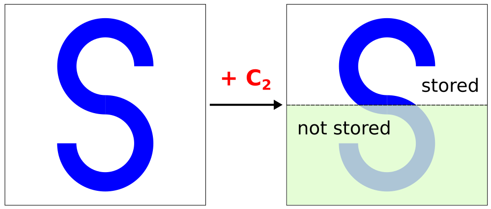
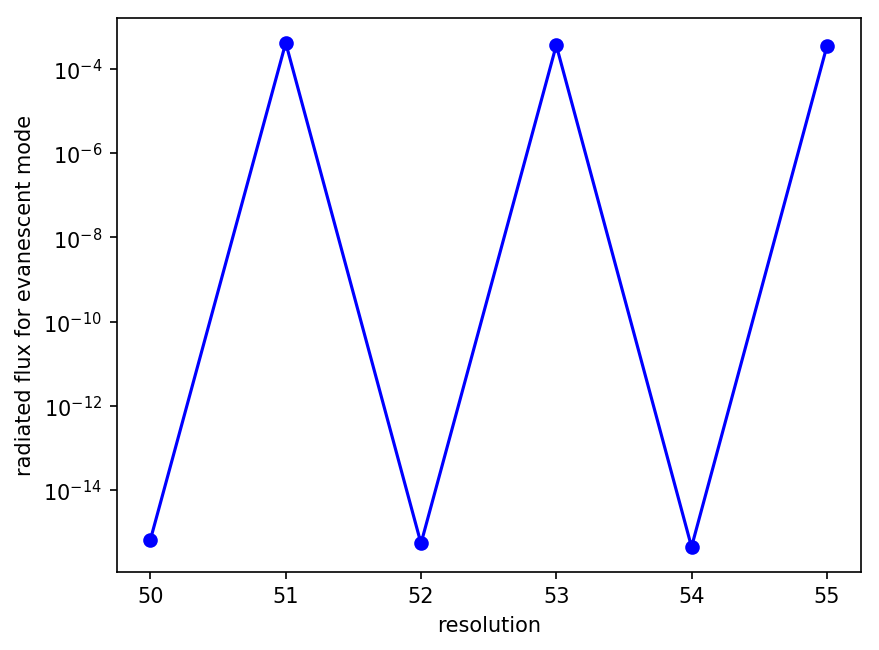

---
# Exploiting Symmetry
---

Meep allows you to take advantage of mirror and rotational symmetries in your problem to reduce the amount of computation and storage required for simulation. The use of symmetry is designed to be **transparent**: once you specify the symmetry, Meep exploits it as an internal optimization, while everything else about the simulation *appears* the same as if you didn't specify the symmetry. That is, when you output the structure/geometry or currents/fields it still outputs the entire non-symmetrized cell; you can still call `get_field_point` to obtain the fields at any point, etcetera &mdash; internally, Meep transforms everything as necessary according to the symmetries to get whatever data is needed.

An important point to understand is that, when you specify a symmetry, it must be obeyed by **both** the structure/geometry **and** by the current sources and thus the fields. In particular, the symmetry of the currents/fields will typically require you to specify *phase factors* associated with the symmetry operations &mdash; for example, a mirror plane can either be used for *even* sources/fields (phase +1) or for *odd* sources/fields (phase −1).

**Meep does not check whether the symmetry is obeyed**. If you specify a symmetry that does not preserve your structure/sources, then the results are undefined.

For the Python syntax to specify a symmetry, see [User Interface](Python_User_Interface.md#symmetry). There are also examples in [Tutorial/Basics](Python_Tutorials/Basics.md#exploiting-symmetry). For a description of how symmetries are implemented, see [Chunks and Symmetry](Chunks_and_Symmetry.md).

[TOC]

Kinds of Symmetries
-------------------

Meep supports exploiting several kinds of symmetries:

### Rotations and Reflections

-   Mirror planes through the origin, and normal to the $x$/$y$/$z$ axes.
-   180° rotational symmetry about the origin, around the $x$/$y$/$z$ axes. This is also known as a $C_2$ symmetry, in group theory. This is different from a mirror plane: e.g. as shown in the figure below, the letter "S" has $C_2$ but not mirror symmetry.
-   90° (fourfold) rotational symmetry about the origin, around the $x$/$y$/$z$ axes. This is also known as a $C_4$ symmetry.

<center>

</center>

The first two kinds of symmetry each reduce the computational cell (internally) by a factor of two, and the third by a factor of four. If your structure has multiple symmetries, you can combine them arbitrarily. For example, your cell may have two orthogonal mirror planes (e.g. one even and one odd), or it may have four-fold rotational symmetry about the $z$ axis and a mirror plane through $z=0$. Thus, in 3d you might be able to reduce your cell by at most a factor of eight, or a factor of four in 2d. This is why the interface lets you specify a **list** `symmetries` of `symmetry` objects.

There are also two other kinds of symmetry you can exploit.

### Polarizations in 2d

When you have a two-dimensional simulation with a wavevector $\mathbf{k}$ (if any) lying in the plane, then the $xy$ plane is itself a mirror plane. The consequence of this is that the fields can be chosen purely polarized: either **$H_z$ polarized** (electric field in the plane and magnetic field in the $z$ direction) or **$E_z$ polarized** (magnetic field in the plane and electric field in the $z$ direction). Meep can exploit this to save a factor of two in storage and time.

To exploit $E_z$/$H_z$ symmetry, you don't have to do anything special: if your sources are only $E_z$ polarized ($E_z$/$H_x$/$H_y$), then Meep will only propagate these fields, and similarly for $H_z$ ($H_z$/$E_x$/$E_y$).

### Cylindrical Symmetry

If your structure has cylindrical symmetry (also known as the $C_{\infty\mathrm{v}}$ group), i.e. continuous rotational symmetry around the $z$ axis, then Meep can exploit this by running the simulation in cylindrical/polar coordinates.

To do this, you must set `dimensions = mp.CYLINDRICAL` in the Python script, and then the vectors are interpreted as ($r$,$\phi$,$z$) triplets instead of ($x$,$y$,$z$).

In a cylindrical simulation, fields can be written in the form of a function of ($r$,$z$) multiplied by a function $\exp(im\phi)$ for the $\phi$ dependence, where $m$ is a user-specified parameter (related to the angular momentum of the field). If the cell includes the $r$=0 origin, then $m$ must be an integer to be single-valued at the origin. Otherwise, $m$ can be arbitrary (this is useful e.g. for bend simulations).

For examples, see [Tutorial/Cylindrical Coordinates](Python_Tutorials/Cylindrical_Coordinates.md).

### Translational Symmetry

If the structure has discrete or continuous translational symmetry in some direction, then this is handled in Meep by specifying periodic boundary conditions in that direction. Here, the currents/fields take the form of $\exp(i\mathbf{k}\cdot\mathbf{x})$ multiplied by a periodic envelope, so one specifies **Bloch-periodic** boundary conditions with a given Bloch wavevector $\mathbf{k}$.

For example, to simulate the modes of a uniform waveguide (continuous translational symmetry) in the $x$ direction, one would specify a structure with 0 cell-size (Python) or `no-size` (Scheme) in the $x$ direction and a given $k_x$ corresponding to the wavenumber of the desired mode. For discrete periodicity, see [Tutorial/Resonant Modes and Transmission in a Waveguide Cavity/Band Diagram](Python_Tutorials/Resonant_Modes_and_Transmission_in_a_Waveguide_Cavity.md#band-diagram).

Symmetry Phase Factors
----------------------

In general, it is not sufficient to simply specify the symmetry operations that preserve the structure. When applied to the fields and sources, the symmetry operations in general transform the source/field into itself multiplied by some *phase factor*.

For example, if you have a mirror plane, then the phase factor is +1 for even fields and −1 for odd fields. For a 90° rotation, values of +1, −1, +*i*, and −*i* are typical (where the latter two correspond to "circularly polarized" fields).

As a specific example, suppose the structure is even in *y*. In this case, an E<sub>y</sub> (dipole) point source at *y*=0 is *odd*. Imagine an arrow pointing in the *y* direction. If you mirror flip *y* to -*y*, then the arrow flips direction, which means that E points in the opposite direction (because E is a vector).  That is, the mirror flip of the source (and field) is the original source (and field) multiplied by -1, and hence it is odd.

The phase factors are ignored when applying the symmetry to the structure (e.g. to ε.)

Technically, the symmetry operations that preserve the structure form the [symmetry group](https://en.wikipedia.org/wiki/Symmetry_group). In particular, this is a [point group](https://en.wikipedia.org/wiki/Point_group) or, if you include translations, the [space group](https://en.wikipedia.org/wiki/Space_group) of the structure. The phase factors specify the *representation* of the group that the fields/sources transform as. See also any book on group theory in physics, e.g. [Group Theory and Its Applications in Physics](http://www.springer.com/us/book/9783540604457) by Inui, Tanabe, and Onodera.

Vectors and Pseudovectors
-------------------------

One subtlety that arises in specifying the symmetry of the system is that you have to transform the fields appropriately according to their vector nature. In particular, the *electric* fields and currents transform as vectors, while the *magnetic* fields and currents transforms as [pseudovectors](https://en.wikipedia.org/wiki/pseudovector). If you don't keep these things straight, you will be endlessly confused because otherwise it will seem that every field component has a different symmetry.

For example, suppose we have an *even* (phase=+1) mirror plane through $x=0$. Then, if we look at components of the electric field individually, $E_y$ and $E_z$ are *even* while $E_x$ is *odd*. Overall, the whole field considered as a *vector* is still even although one of its components is not.

The magnetic field is less intuitive because pseudovectors are multiplied by an additional factor of −1 under mirror flips or any [improper rotation](https://en.wikipedia.org/wiki/improper_rotation). Thus, for our even $x=0$ mirror plane, if we look at the components of the *magnetic* field individually, then $H_y$ and $H_z$ are *odd* while $H_x$ is *even*. That is, the magnetic field as a whole *looks* odd when the electric field is even, but the two really have the *same* symmetry if one realizes that they are different sorts of object (pseudovectors vs. vectors).

Mirror Symmetry and Grid Discretization
---------------------------------------

In general, the discrete grid in Meep can slightly break rotational and mirror symmetries, but the effects of this artificial symmetry breaking go to zero as resolution is increase.   However, mirror symmetries can be *exactly* preserved (up to roundoff errors) in cases where the mirror plane bisects the computational cell along directions that have an even number of pixels.   This can occasionally lead to surprising effects of small changes in resolution.

This effect can be demonstrated using a 1d line source with a sinusoidal amplitude function in a 2d cell with periodic boundaries. The line source spans the entire length $L$ of the cell in the $x$ direction and is defined using a cosine profile: $\cos \left(k_x x\right)$ where $k_x= \left(\frac{2\pi m}{L}\right)$ and $m$ is an integer. The wavevector $k_y$ of the propagating modes can be computed analytically: for a frequency of $\omega$ (in $c=1$ units), the propagating modes are the **real** solutions of $\sqrt{\omega^2n^2-k_x^2}$ where $n$ is the refractive index of the propagating medium. (This is analogous to the [diffractions orders of a binary grating](Python_Tutorials/Mode_Decomposition.md#transmittance-spectra-for-planewave-at-normal-incidence).) PMLs surround the cell in the $y$ direction in order to absorb the outgoing flux. In this example, $L=1.5$, $\omega=2\pi$, and $n=3.5$ for a total of $|m|=5$ propagating modes. This can be verified by computing the total flux radiated by the source in the $+y$ direction for the evanescent $m=6$ mode and checking that it is "zero" (i.e., close to [machine precision](https://en.wikipedia.org/wiki/Machine_epsilon)).

The simulation script is in [examples/grid_discretization.py](https://github.com/NanoComp/meep/blob/master/python/examples/grid_discretization.py).

```py
import numpy as np
import meep as mp

resolution = 50 # pixels/um

sx = 1.5
sy = 6.0
cell_size = mp.Vector3(sx,sy)

dpml = 1.0
pml_layers = [mp.PML(direction=mp.Y,
                     thickness=dpml)]

fcen = 1.0

def src_amp_func(m):
    def _src_amp_func(p):
        return np.cos(2*np.pi*m*(p.x+0.5*sx)/sx)
    return _src_amp_func

sources = [mp.Source(mp.GaussianSource(fcen,fwidth=0.2*fcen),
                     component=mp.Ez,
                     center=mp.Vector3(0,-0.5*sy+dpml),
                     size=mp.Vector3(sx,0),
                     amp_func=src_amp_func(6))]

sim = mp.Simulation(cell_size=cell_size,
                    resolution=resolution,
                    k_point=mp.Vector3(),
                    boundary_layers=pml_layers,
                    sources=sources,
                    default_material=mp.Medium(index=3.5))

flux_mon = sim.add_flux(fcen, 0, 1,
                        mp.FluxRegion(center=mp.Vector3(0,0.5*sy-dpml),size=mp.Vector3(sx)))

sim.run(until_after_sources=20)

flux = mp.get_fluxes(flux_mon)
print("flux:, {}".format(flux[0]))
```

Plotting the radiated flux as a function of the resolution (using a semi-logarithmic scale) reveals an unexpected finding.

<center>

</center>

The radiated flux of the evanescent mode varies by nearly twelve orders of magnitude when the resolution changes by just one! Also, the radiated flux is "zero" (the correct/expected result) only when the resolution is an even number. These large variations are due to the cell dimensions in the periodic $x$ direction which are displayed in the simulation output:

```
Computational cell is 1.5 x 6 x 0 with resolution 50
flux:, 6.788984186414434e-16
...
Computational cell is 1.5098 x 6 x 0 with resolution 51
flux:, 0.0004094502264147733
...
Computational cell is 1.5 x 6 x 0 with resolution 52
flux:, 5.484924186312514e-16
...
Computational cell is 1.50943 x 6 x 0 with resolution 53
flux:, 0.00035958138720120446
...
Computational cell is 1.5 x 6 x 0 with resolution 54
flux:, 4.543947667089586e-16
...
Computational cell is 1.50909 x 6 x 0 with resolution 55
flux:, 0.00033641577621399885
```

In this particular example, an even grid resolution results in a cell size in the $x$ direction of 1.5 but something slightly larger whenever the resolution is odd. When the cell size in $x$ is exactly 1.5 (even resolutions), the source does not radiate and the flux is therefore ~10<sup>-16</sup> (i.e., [round-off errors](https://en.wikipedia.org/wiki/Round-off_error)). However, when the cell size in $x$ is not exactly 1.5 (odd resolutions), the source *does* radiate a small but non-trivial amount (~10<sup>-4</sup>) which is only due to discretization errors. (The same discretization errors affect the propagating $|m| \leq 5$ modes though they are less pronounced.) To ensure physically accurate results, the resolution should be chosen such that the cell size in $x$ is 1.5.

The key thing to note from this demonstration is that discretization errors are unavoidable and can have a large impact on the accuracy of the results. This is why it's important to always check: *are the actual cell dimensions the same as the user-specified dimensions?* If not, beware that discretization errors will break the mirror symmetry of the grid and may produce unexpected results.
