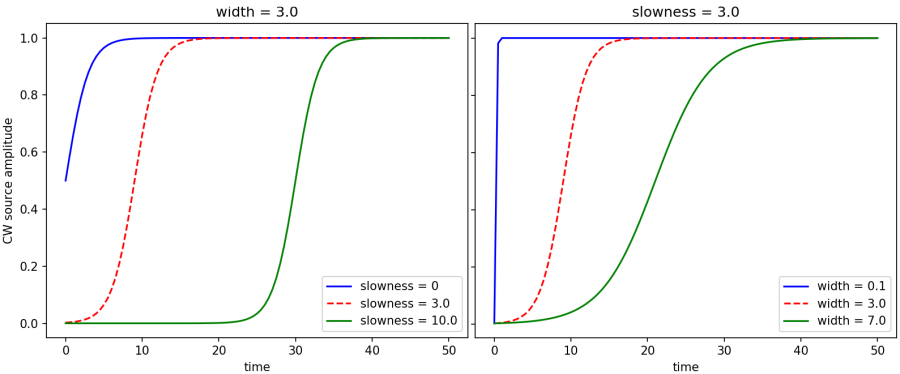
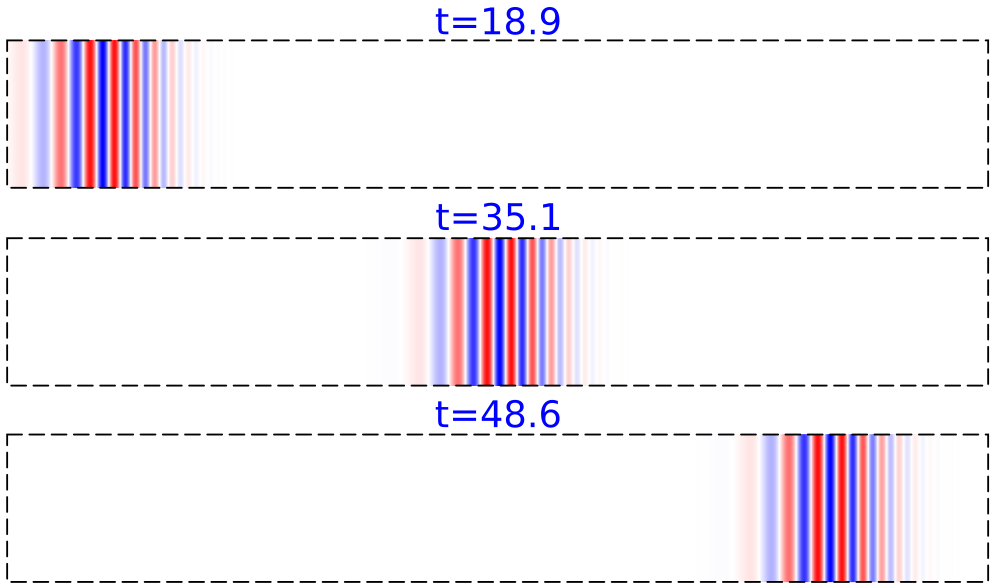
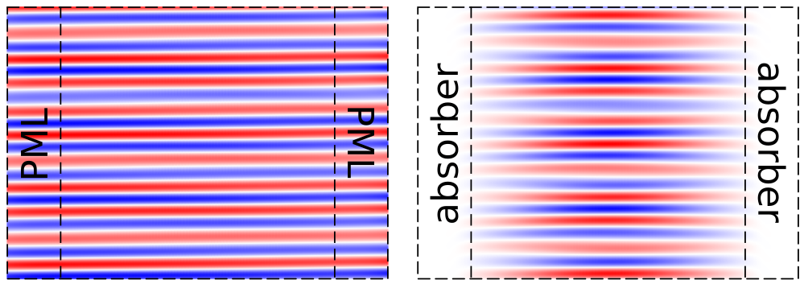

---
# FAQ
---

The following are frequently asked questions grouped into ten categories: [General](#general), [Installation](#installation), [Physics](#physics), [Sources](#usage-sources), [Fields](#usage-fields), [Materials](#usage-materials), [Structures](#usage-structures), [Subpixel Averaging](#usage-subpixel-averaging), [Performance](#usage-performance), and [Other](#usage-other).

[TOC]

General
-------

### What is Meep?

Meep is a [free and open-source](https://en.wikipedia.org/wiki/Free_and_open-source_software) software package for [electromagnetics](https://en.wikipedia.org/wiki/Electromagnetism) simulation via the [finite-difference time-domain](https://en.wikipedia.org/wiki/Finite-difference_time-domain_method) (FDTD) method spanning a broad range of applications. The name Meep is an acronym for *MIT Electromagnetic Equation Propagation*.

### Who are the developers of Meep?

Meep was originally developed as part of graduate research at MIT. The project is now being maintained by [Simpetus](http://www.simpetus.com) and the developer community on [GitHub](https://github.com/NanoComp/meep).

### Where can I ask questions regarding Meep?

There is a public [mailing list](http://ab-initio.mit.edu/cgi-bin/mailman/listinfo/meep-discuss) for users to discuss issues pertaining to setting up simulations, post-processing output, installation, etc. A useful place to start is the [list archives](https://www.mail-archive.com/meep-discuss@ab-initio.mit.edu/) which includes all postings (6000+) since 2006 spanning a variety of topics. Bug reports and new feature requests should be filed as a [GitHub issue](https://github.com/NanoComp/meep/issues).

### How can I contribute to the Meep project?

[Pull requests](https://github.com/NanoComp/meep/pulls) involving bug fixes, new features, and general improvements are welcome and can be made to the master branch on GitHub. This includes tweaks, revisions, and updates to this documentation, generated from [markdown](https://en.wikipedia.org/wiki/Markdown), which is also part of the [source repository](https://github.com/NanoComp/meep/tree/master/doc).

### Is there a technical reference for Meep?

Yes. The technical details of Meep's inner workings are described in the peer-reviewed publication [MEEP: A flexible free-software package for electromagnetic simulations by the FDTD method](http://dx.doi.org/doi:10.1016/j.cpc.2009.11.008), Computer Physics Communications, Vol. 181, pp. 687-702, 2010 ([pdf](http://ab-initio.mit.edu/~oskooi/papers/Oskooi10.pdf)). Additional information is provided in the book [Advances in FDTD Computational Electrodynamics: Photonics and Nanotechnology](https://www.amazon.com/Advances-FDTD-Computational-Electrodynamics-Nanotechnology/dp/1608071707) in Chapters 4 ("Electromagnetic Wave Source Conditions"), 5 ("Rigorous PML Validation and a Corrected Unsplit PML for Anisotropic Dispersive Media"), 6 ("Accurate FDTD Simulation of Discontinuous Materials by Subpixel Smoothing"), and 20 ("MEEP: A Flexible Free FDTD Software Package"). A [video presentation](https://www.youtube.com/watch?v=9CA949csYvM) and [slides](http://ab-initio.mit.edu/~ardavan/stuff/IEEE_Photonics_Society_SCV3.pdf) as well as a [podcast](http://www.rce-cast.com/Podcast/rce-118-meep.html) are also available.

### Where can I find a list of projects which have used Meep?

For a list of more than 2500 published works which have used Meep, see the [Google Scholar citation page](https://scholar.google.com/scholar?hl=en&q=meep+software) as well as that for the [technical reference](https://scholar.google.com/scholar?cites=17712807607104508775) and also the [subpixel smoothing reference](https://scholar.google.com/scholar?cites=410731148689673259).

### Can I access Meep in the public cloud?

Yes. Meep is available preinstalled on Ubuntu on Amazon Web Services (AWS) Elastic Compute Cloud (EC2) as a free [Amazon Machine Image (AMI)](https://aws.amazon.com/marketplace/pp/B01KHWH0AS). To access this AMI, follow these [instructions](http://www.simpetus.com/launchsims.html).

### Are professional consulting services available?

Yes. [Simpetus](http://www.simpetus.com), a company started by Meep's developers and maintainers, provides professional consulting services for photonic design and modeling including development of turn-key simulation modules as well as training and technical support for getting up and running with Meep.

Installation
------------

### Where can I install Meep?

Meep runs on any Unix-like operating system, such as Linux, macOS, and FreeBSD, from notebooks to desktops to supercomputers. [Conda packages](Installation.md#conda-packages) of the latest released version are available for Linux and macOS. There are also Conda packages of [nightly development builds](Installation.md#nightly-builds) which can be used to experiment with new features. Installing Meep from the source code requires some understanding of Unix, especially to install the various dependencies. Installation shell scripts are available for [Ubuntu 16.04 and 18.04](Build_From_Source.md#building-from-source) and [macOS Sierra](https://www.mail-archive.com/meep-discuss@ab-initio.mit.edu/msg05811.html).

### Can I install Meep on Windows machines?

Yes. For Windows 10, you can install the [Ubuntu terminal](https://www.microsoft.com/en-us/p/ubuntu/9nblggh4msv6) as an app which is based on the [Windows Subsystem for Linux](https://docs.microsoft.com/en-us/windows/wsl/about) framework and then follow the instructions for [obtaining the Conda packages](Installation.md#conda-packages) (recommended) or [building from source](Build_From_Source.md#building-from-source). Support for visualization is enabled using a browser-based [Jupyter notebook](https://jupyter.org/) which can also be installed via the Ubuntu terminal. For Windows 8 and older versions, you can use the free Unix-compatibility environment [Cygwin](http://www.cygwin.org/) following these [instructions](http://novelresearch.weebly.com/installing-meep-in-windows-8-via-cygwin.html).

### Are there precompiled binary packages for Ubuntu?

Yes. Ubuntu and Debian packages can be obtained via the package manager [APT](https://en.wikipedia.org/wiki/APT_(Debian)) as described in [Download](Download.md#precompiled-packages-for-ubuntu). However, the Meep packages for Ubuntu 16.04 ([serial](https://packages.ubuntu.com/xenial/meep) and [parallel](https://packages.ubuntu.com/xenial/meep-openmpi)) and 18.04 ([serial](https://packages.ubuntu.com/bionic/meep) and [parallel](https://packages.ubuntu.com/bionic/meep-openmpi)) are for [version 1.3](https://github.com/NanoComp/meep/releases) (September 2017) which is out of date. The Meep package for Ubuntu is in the process of being updated and will likely appear in Ubuntu 19.10 as derived from the [unstable Debian package](https://packages.debian.org/unstable/meep). In the meantime, since the [Scheme interface](Scheme_User_Interface.md) is no longer being supported and has been replaced by the [Python interface](Python_User_Interface.md), you can use the [Conda packages](Installation.md#conda-packages) which contain the official releases as well as nightly builds of the master branch of the source repository.

### Guile is installed, but configure complains that it can't find `guile`

With most Linux distributions as well as Cygwin, packages like [Guile](http://www.gnu.org/software/guile) are split into two parts: a `guile` package that just contains the libraries and executables, and a `guile-dev` or `guile-devel` package that contains the header files and other things needed to compile programs using Guile. Usually, the former is installed by default but the latter is not. You need to install both, which means that you probably need to install `guile-dev`. Similarly for any other library packages needed by Meep.

Physics
-------

### How does the current amplitude relate to the resulting field amplitude?

There is no simple formula relating the input current amplitude (**J** in Maxwell's equations) to the resulting fields (**E**) etcetera, even at the same point as the current. The exact same current will produce a different field and radiate a different total power depending upon the surrounding materials/geometry, and depending on the frequency. This is a physical consequence of the geometry's effect on the local density of states (LDOS); it can also be thought of as feedback from reflections on the source. A classic example is an antenna in front of a ground plane, which radiates very different amounts of power depending on the distance between the antenna and the plane (half wavelength vs. quarter wavelength, for example). Alternatively, if you put a current source inside a perfect electric conductor, the resulting field will be zero. Also, as the frequency of the current increases, the amplitude of the resulting field will also increase. This is due to [Rayleigh scattering](https://en.wikipedia.org/wiki/Rayleigh_scattering) which explains why the sky is blue: scattered power increases with frequency; alternatively the density of states increases as the frequency to the d-1 power in d dimensions.

For a leaky resonant mode where the fields are spatially confined and decaying away exponentially with time, the power expended by a dipole source at a given frequency and position is proportional to the ratio of the [quality factor](https://en.wikipedia.org/wiki/Q_factor) (Q) and modal volume (Vm). This is known as [Purcell enhancement](https://en.wikipedia.org/wiki/Purcell_effect) of the LDOS: the same current source in a higher Q cavity emits more power if the coupling to the mode is the same.

(On the other hand, if you were to put in a dipole source with a fixed *voltage*, instead of a fixed *current*, you would get less power out with higher Q. For an antenna, the Purcell enhancement factor Q/Vm is proportional to its [radiation resistance](https://en.wikipedia.org/wiki/Radiation_resistance) R. If you fix current I, then power I²R increases with resistance whereas if you fix voltage V then the power V²/R decreases with resistance.)

For a mathematical description, see Section 4.4 ("Currents and Fields: The Local Density of States") in [Chapter 4](http://arxiv.org/abs/arXiv:1301.5366) ("Electromagnetic Wave Source Conditions") of [Advances in FDTD Computational Electrodynamics: Photonics and Nanotechnology](https://www.amazon.com/Advances-FDTD-Computational-Electrodynamics-Nanotechnology/dp/1608071707).

If you are worried about this, then you are probably setting up your calculation in the wrong way. Especially in linear materials, the absolute magnitude of the field is useless; the only meaningful quantities are dimensionless ratios like the fractional transmittance: the transmitted power relative to the transmitted power in some reference calculation. Almost always, you want to perform two calculations, one of which is a reference, and compute the ratio of a result in one calculation to the result in the reference. For nonlinear calculations, see [Units and Nonlinearity](Units_and_Nonlinearity.md).

### How is the source current defined?

The source current in Meep is defined as a [free charge current **J** in Maxwell's equations](Introduction.md#maxwells-equations). Meep does not simulate the driving force behind this free charge current, nor does the current have to be placed in a conductor. Specifying a current means that somehow you are shaking a [charge](https://en.wikipedia.org/wiki/Electric_charge) at that point (by whatever means, Meep doesn't care) and you want to know the [resulting fields](#how-does-the-current-amplitude-relate-to-the-resulting-field-amplitude). In a linear system, multiplying J by 2 results in multiplying the fields by 2.

In the [interface](Python_User_Interface.md#source), the source currents are labeled Ex or Hy etc. according to what components of the electric/magnetic fields they correspond to.

### How do I compute the local density of states (LDOS) in a lossy material?

If you put a point source *inside* a lossy material (e.g., a [Lorentz-Drude metal](Materials.md#material-dispersion)), then the power expended by a dipole diverges as you increase the resolution. In the limit of infinite resolution, infinite power is absorbed. LDOS is not well defined for points inside of a lossy material.

However, LDOS is perfectly well defined for points *outside* of a lossy material. For example, you can choose a point outside of a lossy object and calculate the [LDOS](Python_User_Interface.md#ldos-spectra), and it will converge to a finite value as you increase the resolution. For an example, see [Tutorial/Local Density of States](../Python_Tutorials/Local_Density_of_States/).

### How do I set the imaginary part of ε?

If you only care about the imaginary part of ε in a narrow bandwidth around some frequency ω, you should set it by using the electric [conductivity](Materials.md#conductivity-and-complex). If you care about the imaginary part of ε over a broad bandwidth, then for any physical material the imaginary part will be frequency-dependent and you will have to fit the data to a [Drude-Lorentz susceptibility model](Materials.md#material-dispersion).

Meep doesn't implement a frequency-independent complex ε. Not only is this not physical, but it also leads to both exponentially decaying and exponentially growing solutions in Maxwell's equations from positive- and negative-frequency Fourier components, respectively. Thus, it cannot be simulated in the time domain.

### Why does my simulation diverge if ε &lt; 0?

Maxwell's equations have exponentially growing solutions for a frequency-independent negative ε. For any physical medium with negative ε, there must be dispersion, and you must likewise use dispersive materials in Meep to obtain negative ε at some desired frequency. The requirement of dispersion to obtain negative ε follows from the [Kramers–Kronig relations](https://en.wikipedia.org/wiki/Kramers%E2%80%93Kronig_relations), and also follows from thermodynamic considerations that the energy in the electric field must be positive. For example, see [Electrodynamics of Continuous Media](https://www.amazon.com/Electrodynamics-Continuous-Media-Second-Theoretical/dp/0750626348) by Landau, Pitaevskii, and Lifshitz. At an even more fundamental level, it can be derived from passivity constraints as shown in [Physical Review A, Vol. 90, 023847, 2014](http://arxiv.org/abs/arXiv:1405.0238).

If you solve Maxwell's equations in a homogeneous-epsilon material at some real wavevector **k**, you get a dispersion relation $\omega^2 = c^2 |\mathbf{k}|^2 / \varepsilon$. If ε is positive, there are two real solutions $\omega = \pm c |\mathbf{k}| / \sqrt{\varepsilon}$, giving oscillating solutions. If ε is negative, there are two imaginary solutions corresponding to exponentially decaying and exponentially growing solutions from any current source. These solutions can always be spatially decomposed into a superposition of real-**k** values via a spatial Fourier transform.

If you do a simulation of any kind in the time domain (not just FDTD), you pretty much can't avoid exciting both the decaying and the growing solutions. This is *not* a numerical instability, it is a real solution of the underlying equations for an unphysical material.

See [Materials](Materials.md#material-dispersion) for how to include dispersive materials which can have negative ε and loss.

If you have nondispersive negative ε *and* negative μ *everywhere*, the case of a negative-index material, then the simulation is fine, but our PML implementation doesn't currently support this situation (unless you edit the [source code](https://github.com/NanoComp/meep/blob/e3e397c485326366b0b38162493fbb297027d503/src/structure.cpp#L651) to flip the sign), and in any case such simulations are trivially [equivalent](https://math.mit.edu/~stevenj/18.369/coordinate-transform.pdf) to positive-index simulations under coordinate inversion (x,y,z) ⟶ (–x,–y,–z). However at the boundary between nondispersive negative- and positive-index materials, you will encounter instabilities: because of the way Maxwell's equations are discretized in FDTD, the ε and μ are discretized on different spatial grids, so you will get a half-pixel or so of εμ &lt; 0 at the boundary between negative and positive indices, which will cause the simulation to diverge. But of course, any physical negative-index metamaterial also involves dispersion.

Note also that, as a consequence of the above analysis, ε must go to a positive value in the ω $\to\pm\infty$ limit to get non-diverging solutions of Maxwell's equations. So the ε$_\infty$ in your [dispersion model](Materials.md#material-dispersion) must be positive.

### Why are there strange peaks in my reflectance/transmittance spectrum when modeling planar or periodic structures?

There are two possible explanations: (1) the simulation run time may be too short and your results have not sufficiently [converged](#checking-convergence), or (2) you may be using a higher-dimensional cell with multiple periods (a supercell) which introduces unwanted additional modes due to band folding. Modeling flat/planar structures typically requires a 1d cell and periodic structures a single unit cell in 2d/3d. For more details, see Section 4.6 ("Sources in Supercells") in [Chapter 4](http://arxiv.org/abs/arXiv:1301.5366) ("Electromagnetic Wave Source Conditions") of [Advances in FDTD Computational Electrodynamics: Photonics and Nanotechnology](https://www.amazon.com/Advances-FDTD-Computational-Electrodynamics-Nanotechnology/dp/1608071707). Note that a 1d cell must be along the $z$ direction with only the Ex and Hy field components permitted.

### How do I model the solar radiation spectrum?

For simulations involving [solar radiation](https://en.wikipedia.org/wiki/Sunlight#Surface_illumination), including the [air mass](https://en.wikipedia.org/wiki/Air_mass_(solar_energy)), the [reflectance/transmittance spectra](Introduction.md#transmittancereflectance-spectra) is computed as normal. Since typical solar-cell problems are linear, the reflected or transmitted power can then be obtained by simply multiplying the reflectance or transmittance by the solar spectrum.

### Are complex fields physical?

No. Unlike quantum mechanics, complex fields in classical electromagnetics are not physical. In a linear system, one can always take the real part at the end of the computation to obtain a physical result. When there are nonlinearities, the physical interpretation is much more non-obvious.

Note: specifying a complex `amplitude` for the `Source` object does not automatically yield complex fields. Unless the parameter `force_complex_fields=True` is specified, only the real part of the source is used. The complex amplitude is just a phase shift of the real sinusoidal source.

### How do I model incoherent spontaneous/thermal emission

Semiclassically, [spontaneous](https://en.wikipedia.org/wiki/Spontaneous_emission) or [thermal](https://en.wikipedia.org/wiki/Thermal_radiation) emission can be modeled simply as random dipole current sources. One direct way to express this in Meep is to use a [Monte Carlo method](https://en.wikipedia.org/wiki/Monte_Carlo_method): take an ensemble average of multiple runs involving a collection of random dipole sources. For example, to model thermal radiation in linear materials, you can use a custom source function to input white-noise sources with the appropriate noise spectrum included via postprocessing; e.g. in the [far field](https://journals.aps.org/prl/abstract/10.1103/PhysRevLett.93.213905) or [near field](http://doi.org/10.1103/PhysRevLett.107.114302). There is also a [noisy Lorentzian material](Python_User_Interface.md#noisylorentziansusceptibility-or-noisydrudesusceptibility) that can be used to model thermal fluctuations even more directly as noise in the materials themselves. As another example, incoherent emission from [excitons](https://en.wikipedia.org/wiki/Exciton) can be modeled with point dipole sources of random phase (set via the `amplitude` property of the [`Source`](Python_User_Interface.md#source)) as described in [Applied Physics Letters, 106, 041111, 2015](https://aip.scitation.org/doi/abs/10.1063/1.4907253) ([pdf](http://ab-initio.mit.edu/~oskooi/papers/Oskooi15_oled.pdf)) with associated [simulation script](http://www.simpetus.com/projects.html#meep_oled).

Usage: Sources
--------------

### How do I create an oblique planewave source?

An arbitrary-angle planewave can be generated in two different ways: (1) by setting the amplitude function [`amp_func`](Python_User_Interface.md#source) of a 1d/line source for a 2d cell or 2d/planar source for a 3d cell, or (2) via the [EigenModeSource](Python_User_Interface.md#eigenmodesource). Bloch-periodic boundary conditions via the `k_point` may also be required. Note that for a pulsed source (unlike a continuous wave), each frequency component produces a plane wave at a specific angle, with a different angle for each frequency component.

The first approach involving `amp_func` is based on the principle that just as you can create a directional antenna by a [phased array](https://en.wikipedia.org/wiki/Phased_array), you can create a directional source by setting the phase of the current appropriately. For a 1d example, see [Tutorial/Basics](Python_Tutorials/Basics.md#angular-reflectance-spectrum-of-a-planar-interface) ([Scheme version](Scheme_Tutorials/Basics.md#angular-reflectance-spectrum-of-a-planar-interface)). For 2d, see [Tutorial/Mode Decomposition](Python_Tutorials/Mode_Decomposition.md#reflectance-and-transmittance-spectra-for-planewave-at-oblique-incidence) ([Scheme version](Scheme_Tutorials/Mode_Decomposition.md#reflectance-and-transmittance-spectra-for-planewave-at-oblique-incidence)) as well as [examples/pw-source.py](https://github.com/NanoComp/meep/blob/master/python/examples/pw-source.py) ([Scheme version](https://github.com/NanoComp/meep/blob/master/scheme/examples/pw-source.ctl)).

For an example of the second approach, see [Tutorial/Eigenmode Source](Python_Tutorials/Eigenmode_Source.md#planewaves-in-homogeneous-media) ([Scheme version](Scheme_Tutorials/Eigenmode_Source.md#planewaves-in-homogeneous-media)).

### How do I create a focused beam with a Gaussian envelope?

A focused beam with a Gaussian envelope can be created using the amplitude function (`amp_func`) of the [`Source`](Python_User_Interface.md#source) object. Examples are provided for [Python](https://github.com/NanoComp/meep/blob/master/python/examples/gaussian-beam.py) and [Scheme](https://github.com/NanoComp/meep/blob/master/scheme/examples/gaussian-beam.ctl). Four snapshots of the resulting field profile generated using this script for different values of the beam width (`sigma`) and rotation angle (`tilt_angle`) are shown in the following image:

Beams in a homogeneous material do not have a fixed width in Maxwell's equations; they always spread out during propagation. The [numerical aperture (NA)](https://en.wikipedia.org/wiki/Gaussian_beam#Beam_divergence) of a Gaussian beam of width w (2*`sigma` from the example script) and vacuum wavelength λ in a medium of index n is n⋅sin(λ/(πnw)).

Note: in this example, the beam waist is at the source position (i.e., top center of the cell). If you want the beam waist to be at a position other than the position of the source, you need to adjust the *phase* of the beam accordingly. If you assume you have a Gaussian beam profile with zero phase at some plane y=y0, then you can work out the beam profile (including phase) at any other plane y=y1 by taking the Fourier transform and looking at the propagation of each planewave component, and then inverse Fourier transforming. In this way, you can work out the desired source profile at any plane y=y1 to get a Gaussian beam waist at y=y0.

### How do I create a circularly-polarized planewave source in cylindrical coordinates?

A circularly-polarized planewave in [cylindrical coordinates](Cylindrical_Coordinates.md) corresponds to E=($\hat{r}$+i$\hat{φ}$)exp(iφ). This can be created using a constant Er (radial) current source with `amplitude`=1 and a constant Ep (φ) current source with `amplitude`=0+1i as well as `m`=1.

### How do I model a moving point charge?

You can use an instantaneous [`ContinuousSource`](Python_User_Interface.md#continuoussource) with large wavelength (or nearly-zero frequency). This is analogous to a [direct current](https://en.wikipedia.org/wiki/Direct_current). You will also need to create a [run function](Python_User_Interface.md#run-functions) which contains [`change_sources`](Python_User_Interface.md#reloading-parameters) and specify the `center` property of the point source to be time dependent. As an example, the following image demonstrates [Cherenkov radiation](https://en.wikipedia.org/wiki/Cherenkov_radiation) involving a moving point charge with [superluminal phase velocity](https://en.wikipedia.org/wiki/Faster-than-light#Phase_velocities_above_c) (see [examples/cherenkov-radiation.py](https://github.com/NanoComp/meep/blob/master/python/examples/cherenkov-radiation.py)).

### Why doesn't the continuous-wave (CW) source produce an exact single-frequency response?

The [ContinuousSource](Python_User_Interface.md#continuoussource) does not produce an exact single-frequency response $\exp(-i\omega t)$ due to its [finite turn-on time](https://github.com/NanoComp/meep/blob/master/src/sources.cpp#L104-L122) which is described by a hyperbolic-tangent function. In the asymptotic limit, the resulting fields are the single-frequency response; it's just that if you Fourier transform the response over the *entire* simulation you will see a finite bandwidth due to the turn-on.

If the `width` is 0 (the default) then the source turns on sharply which creates high-frequency transient effects. Otherwise, the source turns on with a shape of (1 + tanh(t/`width` - `slowness`))/2. That is, the `width` parameter controls the width of the turn-on. The `slowness` parameter controls how far into the exponential tail of the tanh function the source turns on. The default `slowness` of 3.0 means that the source turns on at (1 + tanh(-3))/2 = 0.00247 of its maximum amplitude.  A larger value for `slowness` means that the source turns on even more gradually at the beginning (i.e., farther in the exponential tail). The effect of varying the two parameters `width` and `slowness` independently in the turn-on function is shown below.

Note: even if you have a continuous wave (CW) source at a frequency ω, the time dependence of the electric field after transients have died away won't necessarily be cos(ωt), because in general there is a phase difference between the current and the resulting fields. In general for a CW source you will eventually get fields proportional to cos(ωt-φ) for some phase φ which depends on the field component, the source position, and the surrounding geometry.

### Why does the amplitude of a point dipole source increase with resolution?

The field from a point source is singular &mdash; it blows up as you approach the source. At any finite resolution, this singularity is truncated to a finite value by the discretization but the peak field at the source location increases as you increase the resolution.

### Is a narrow-bandwidth Gaussian pulse considered the same as a continuous-wave (CW) source?

No. A narrow-bandwidth Gaussian is still a Gaussian: it goes to zero at both the beginning and end of its time profile unlike a continuous-wave (CW) source which oscillates indefinitely (but has a [finite turn-on](#why-doesnt-the-continuous-wave-cw-source-produce-an-exact-single-frequency-response)). Assuming you have linear materials, you should get the same results if you use a narrow- or broad-band pulse and look at a single frequency component of the Fourier transform via e.g. [`dft_fields`](Python_User_Interface.md#field-computations). The latter has the advantage that it requires a shorter simulation for the fields to die away due to the [Fourier Uncertainty Principle](https://en.wikipedia.org/wiki/Fourier_transform#Uncertainty_principle). Note also that an almost *zero*-bandwidth Gaussian will produce high-frequency spectral components due to its abrupt turn on and off which are poorly absorbed by PML.

### How do I create a chirped pulse?

You can use a [`CustomSource`](Python_User_Interface.md#customsource) to define an arbitrary time-profile for the [`Source`](Python_User_Interface.md#source) object. As an example, the following snapshots of the out-of-plane electric field demonstrates a [linear-chirped pulse](https://www.rp-photonics.com/chirp.html) planewave propagating from the left to the right with higher frequencies (smaller wavelengths) at the front (i.e., a down chirp). For the simulation script, see [examples/chirped_pulse.py](https://github.com/NanoComp/meep/blob/master/python/examples/chirped_pulse.py).

Usage: Fields
-------------

### Why are the fields blowing up in my simulation?

Instability in the fields is likely due to one of five causes: (1) [PML](Python_User_Interface.md#pml) overlapping dispersive materials based on a [Drude-Lorentzian susceptibility](Python_User_Interface.md#lorentziansusceptibility) in the presence of [backward-wave modes](https://journals.aps.org/pre/abstract/10.1103/PhysRevE.79.065601) (fix: replace the PML with an [Absorber](Python_User_Interface.md#absorber)), (2) the frequency of a Lorentzian susceptibility term is *too high* relative to the grid discretization (fix: increase the `resolution` and/or reduce the `Courant` factor), (3) a material with a [wavelength-independent negative real permittivity](#why-does-my-simulation-diverge-if-0) (fix: [fit the permittivity to a broadband Drude-Lorentzian susceptibility](#how-do-i-import-n-and-k-values-into-meep)), (4) a grid voxel contains *more than one* dielectric interface (fix: turn off subpixel averaging), or (5) a material with a *wavelength-independent* refractive index between 0 and 1 (fix: reduce the `Courant` factor; alternatively, [fit the permittivity to a broadband Drude-Lorentzian susceptibility](#how-do-i-import-n-and-k-values-into-meep)).

Note: when the fields blow up, the CPU *slows down* due to [floating-point exceptions in IEEE 754](https://en.wikipedia.org/wiki/IEEE_754#Exception_handling). Also, Meep automatically checks the fields at the cell origin after every timestep and [aborts the simulation if the electric energy density has diverged](https://github.com/NanoComp/meep/blob/master/src/step.cpp#L97-L98).

### How do I compute the steady-state fields?

The "steady-state" response is defined as the exp(-iωt) response field (ω=2πf is the angular frequency) from an exp(-iωt) source after all transients have died away. There are three different approaches for computing the steady-state fields: (1) use a continuous-wave (CW) source via [`ContinuousSource`](Python_User_Interface.md#continuoussource) with [smooth turn-on](#why-doesnt-the-continuous-wave-cw-source-produce-an-exact-single-frequency-response) and run for a long time (i.e., &#8811; 1/f), (2) use the [frequency-domain solver](#what-is-meeps-frequency-domain-solver-and-how-does-it-work), or (3) use a broad-bandwidth pulse (which has [short time duration](#is-a-narrow-bandwidth-gaussian-pulse-the-same-as-a-continuous-wave-cw-source)) via [`GaussianSource`](Python_User_Interface.md#gaussiansource) and compute the Fourier-transform of the fields via [`add_dft_fields`](Python_User_Interface.md#field-computations). Often, (2) and (3) require fewer timesteps to converge than (1). Note that Meep uses real fields by default and if you want complex amplitudes, you must set `force_complex_fields=True`.

### How do I compute S-parameters?

Meep contains a [mode-decomposition feature](Mode_Decomposition.md) which can be used to compute complex-valued [S-parameters](https://en.wikipedia.org/wiki/Scattering_parameters). An example is provided for a [two-port network](https://en.wikipedia.org/wiki/Two-port_network#Scattering_parameters_(S-parameters)) based on a silicon directional coupler in [Tutorial/GDSII Import](/Python_Tutorials/GDSII_Import/). Additional examples are available for a [waveguide mode converter](Python_Tutorials/Mode_Decomposition.md#reflectance-of-a-waveguide-taper) and [subwavelength grating](Python_Tutorials/Mode_Decomposition.md#phase-map-of-a-subwavelength-binary-grating).

### `Harminv` is unable to find the resonant modes of my structure

There are six possible explanations for why [`Harminv`](Python_User_Interface.md#harminv) could not find the resonant modes: (1) the run time was not long enough and the decay rate of the mode is so small that the `Harminv` data was mainly noise, (2) the `Harminv` call was not wrapped in [`after_sources`](Python_User_Interface.md#controlling-when-a-step-function-executes); if `Harminv` overlaps sources turning on and off it will get confused because the sources are not exponentially decaying fields, (3) the `Harminv` monitor is near the mode's nodal point (e.g., in a symmetry plane), (4) there are field instabilities where the fields are actually [blowing up](#why-are-the-fields-blowing-up-in-my-simulation); this may result in `Harminv` returning a negative [quality factor](https://en.wikipedia.org/wiki/Q_factor), (5) the decay rate of the mode is too fast; `Harminv` discards any modes which have a quality factor less than 50 where the leaky-mode approximation of the modes as perfectly exponentially decaying (i.e. a Lorentzian lineshape) begins to break down (and thus `Harminv` won't likely find any modes inside a [metal](Materials.md#material-dispersion)), or (6) the PML overlaps the non-radiated/evanescent field and has introduced artificial absorption effects in the local density of states (LDOS).

`Harminv` will find modes in perfect-conductor cavities (i.e. with no loss) with a quality factor that is very large and has an arbitrary sign; it has no way to tell that the decay rate is zero, it just knows it is very small.

`Harminv` becomes less effective as the frequency approaches zero, so you should specify a non-zero frequency range.

In order to resolve two closely-spaced modes, in general it is preferable to run with a narrow bandwidth source around the frequency of interest to excite/analyze as few modes as possible and/or increase the run time to improve the frequency resolution. If you want to analyze an arbitrary spectrum, just use the Fourier transform as computed by [`dft_fields`](Python_User_Interface.md#field-computations).

For a structure with two doubly-degenerate modes (e.g., a dipole-like mode or two counter-propagating modes in a ring resonator), the grid discretization will almost certainly break the degeneracy slightly. In this case, `Harminv` may find two *distinct* nearly-degenerate modes.

Note: any real-valued signal consists of both positive and negative frequency components (with complex-conjugate amplitudes) in a Fourier domain decomposition into complex exponentials. `Harminv` usually is set up to find just one sign of the frequency, but occasionally converges to a negative-frequency component as well; these are just as meaningful as the positive frequencies.

### How do I compute the effective index of an eigenmode of a lossy waveguide?

To compute the [effective index](https://www.rp-photonics.com/effective_refractive_index.html), you will need to first compute the *complex* ω (the loss in time) for a *real* β (the propagation constant) and then convert this quantity into a loss in space (*complex* β at a *real* ω) by dividing by the group velocity vg. This procedure is described in more detail below.

To obtain the loss in time, you make your computational cell a cross-section of your waveguide (i.e. 2d for a waveguide with constant cross-section), and set Bloch-periodic boundary conditions via the `k_point` input variable &mdash; this specifies your (real) β. You then treat it exactly the same as a [resonant-cavity problem](Python_Tutorials/Resonant_Modes_and_Transmission_in_a_Waveguide_Cavity.md#resonant-modes): you excite the system with a short pulse source, monitor the field at some point, and then analyze the result with [`Harminv`](Python_User_Interface.md#harminv); all of which is done if you call `run_kpoints`. This will give you the complex ω at the given β, where the imaginary part is the loss rate in time. Note: the loss in a uniform waveguide, with no absorption or disorder, is zero, even in the discretized system.

That is, you have ω(βr) = ωr+iωi where the subscripts r and i denote real and imaginary parts. Now, what you want to do is to get the complex β at the real ω which is given by: β(ωr)=βr-iωi/vg+O(ωi2). That is, to first order in the loss, the imaginary part of β (the propagation loss) at the real frequency ωr is given just by dividing ωi by the group velocity vg=dω/dβ, which you can [get from the dispersion relation in the absence of loss](#how-do-i-compute-the-group-velocity-of-a-mode). This relationship is just a consequence of the first-order Taylor expansion of the dispersion relation ω(β) in the complex plane.

This analysis is only valid if the loss is small, i.e. ωi << ωr. This should always be the case in any reasonable waveguide, where the light can travel for many wavelengths before dissipating/escaping. If you have extremely large losses so that it only propagates for a few wavelengths or less, then you would have to treat the problem differently &mdash; but in this case, the whole concept of a "waveguide mode" is not clearly defined.

### How do I compute the group velocity of a mode?

There are two possible approaches for manually computing the [group velocity](https://en.wikipedia.org/wiki/Group_velocity) ∇**k**ω: (1) compute the [dispersion relation](Python_Tutorials/Resonant_Modes_and_Transmission_in_a_Waveguide_Cavity.md#band-diagram) ω(**k**) using [`Harminv`](Python_User_Interface.md#harminv), fit it to a polynomial, and calculate its derivative using a [finite difference](https://en.wikipedia.org/wiki/Finite_difference) (i.e. [ω(**k**+Δ**k**)-ω(**k**-Δ**k**)]/(2|Δ**k**|)), or (2) excite the mode using a narrowband pulse and compute the ratio of the Poynting flux to electric-field energy density.

For eigenmodes obtained using [mode decomposition](Python_User_Interface.md#mode-decomposition), the group velocities are computed automatically along with the mode coefficients.

### How do I compute the time average of the harmonic fields?

For a linear system, you can use a [ContinuousSource](Python_User_Interface.md#continuoussource) with `force_complex_fields=True` and time-step the fields until all transients have disappeared. Once the fields have reached steady state, the instantaneous intensity |E|2/2 or [Poynting flux](https://en.wikipedia.org/wiki/Poynting_vector#Time-averaged_Poynting_vector) Re[E*xH]/2 is equivalent to the time average. If you don't use complex fields, then these are just the instantaneous values at a given time, and will oscillate. An alternative to time-stepping is the [frequency-domain solver](Python_User_Interface.md#frequency-domain-solver).

### Why are the fields not being absorbed by the PML?

The decay coefficient of the fields within any PML contains a cos(θ) factor where θ is the incidence angle (θ=0° is normal incidence). The decay therefore becomes *slower* as glancing incidence (θ=90°) is approached. This is true in the continuum limit and can be demonstrated by verifying that the reflections from the PML do *not* change with resolution. Otherwise, if the reflection decreases with increasing resolution then it may be due to transition reflections (i.e., the impedance mismatch at the PML interface) which can also be reduced by making the PML thicker instead of increasing the resolution. Transition reflections also increase as glancing incidence is approached, because at glancing incidence the phase-velocity mismatch between incident and reflected waves goes to zero as described in [Optics Express, Vol. 16, pp. 11376-92, 2008](http://www.opticsinfobase.org/abstract.cfm?URI=oe-16-15-11376). Glancing-angle fields commonly arise in simulations where one direction is periodic and the other is terminated by a PML (such as in [diffraction gratings](Python_Tutorials/Mode_Decomposition.md#diffraction-spectrum-of-a-binary-grating)), in which case you can have spurious solutions that travel *parallel* to the PML interface; a workaround is to use a thicker non-PML [absorber](Python_User_Interface.md#absorber). This is demonstrated in the figure below by the glancing-angle fields remaining in the cell after a [source planewave](Python_Tutorials/Eigenmode_Source.md#planewaves-in-homogeneous-media) at 45° has long been turned off: the PML (left inset) is unable to absorb these fields unlike the absorber (right inset).

### How do I compute the modes of a non-orthogonal (i.e., triangular) lattice?

Meep does not support non-rectangular unit cells. To model a triangular lattice, you have to use a supercell. This will cause the band structure to be [folded](#why-are-there-strange-peaks-in-my-reflectancetransmittance-spectrum-when-modeling-planar-or-periodic-structures).  However, if you take your point source and replicate it according to the underlying triangular lattice vectors, with the right phase relationship according to the Bloch wavevector, then it should excite the folded bands only with very low amplitude as reported by [`Harminv`](Python_User_Interface.md#harminv). Also, for every `Harminv` point you put in, you should analyze the fields from the periodic copies of that point (with the periodicity of the underlying lattice). Then, reject any frequency that is not detected at *all* points, with an amplitude that is related by something close to the correct $\exp(i\vec{k}\cdot\vec{r})$ phase.

In principle, the excitation of the folded bands would be exactly zero if you place your sources correctly in the supercell. However, this doesn't happen in FDTD because the finite grid spoils the symmetry slightly. It also means that the detection of folded bands will vary with resolution. For an example, see Section 4.6 ("Sources in Supercells") in [Chapter 4](http://arxiv.org/abs/arXiv:1301.5366) ("Electromagnetic Wave Source Conditions") of [Advances in FDTD Computational Electrodynamics: Photonics and Nanotechnology](https://www.amazon.com/Advances-FDTD-Computational-Electrodynamics-Nanotechnology/dp/1608071707).

For structures with a lossless (i.e., purely real) permittivity, you can also use [MPB](https://mpb.readthedocs.io/en/latest/) to compute the dispersion relation which does support a non-orthogonal lattice.

### For calculations involving Fourier-transformed fields, why should the source be a pulse rather than a continuous wave?

A continuous-wave source ([ContinuousSource](Python_User_Interface.md#continuoussource)) produces fields which are not integrable: their Fourier transform will not converge as the run time of the simulation is increased because the source never terminates. The Fourier-transformed fields are therefore arbitrarily defined by the run time. This [windowing](https://en.wikipedia.org/wiki/Window_function) does different things to the normalization and scattering runs because the spectra are different in the two cases. In contrast, a pulsed source ([GaussianSource](Python_User_Interface.md#gaussiansource)) produces fields which are [L2](https://en.wikipedia.org/wiki/Norm_(mathematics)#Euclidean_norm)-integrable: their Fourier transform is well defined and convergent as long as the run time is sufficiently large and the [fields have decayed away](#checking-convergence). Note that the amplitude of the Fourier transform grows linearly with time; the Poynting flux, which is proportional to the amplitude squared, grows quadratically.

When computing the reflectance/transmittance for linear materials, you should get the same results if you put in a narrow- or broad-band Gaussian and look at only one frequency component of the Fourier transform. The latter has the advantage that it requires a shorter simulation for the fields to decay away. Moreover, if you want the scattering properties as a function of both frequency and angle (of an incident planewave), then the short-time pulses have a further advantage: each simulation with a short pulse and fixed `k_point` yields a broad spectrum result, each frequency of which corresponds to a different angle. Then you repeat the simulation for a range of `k_point`s, and at the end you'll have a 2d dataset of reflectance/transmittance vs. both frequency and angle. For an example, see [Tutorial/Basics/Angular Reflectance Spectrum of a Planar Interface](Python_Tutorials/Basics.md#angular-reflectance-spectrum-of-a-planar-interface).

### How does `k_point` define the phase relation between adjacent unit cells?

If you set the `k_point` to any `meep.Vector3`, the structure will be periodic in **all** directions. There is a [`set_boundary`](Python_User_Interface.md#field-computations) routine that allows you to set individual boundary conditions independently, however.

A periodic structure does **not** imply periodic fields. The value of the `k_point` determines the *phase relation* between the fields and sources in adjacent periodic unit cells. In general, if you have period (`Lx`,`Ly`) and you are looking at the (`n`,`m`) unit cell it has a phase of exp(2πi * (`kx` * `Lx` * `n` + `ky` * `Ly` * `m`)). For example, if you set the `k_point` to `meep.Vector3(0,0,0)`, that means the fields/sources are periodic: the phase is unity from one cell to the next. If you set the `k_point` to `meep.Vector3(1,0,0)` it means that there is a phase difference of exp(2πi * `Lx`) between adjacent cells in the *x* direction. This is known as a [Bloch wave](https://en.wikipedia.org/wiki/Bloch_wave).

A non-zero `k_point` introduces a set of "ghost" pixels along *one* side of each direction of the cell. These additional pixels are used to store the complex Bloch phase multiplied by the field value from the opposite side of the cell boundary. As a result, the size of the cell increases by one pixel in each direction relative to the case of no `k_point`.

Note: in any cell direction where there is a [PML](Perfectly_Matched_Layer.md), the boundary conditions are mostly irrelevant. For example, if there is a PML in front of a periodic boundary, the periodicity doesn't matter because the field will have decayed almost to zero by the time it "wraps around" to the other side of the cell.

### How do I compute the integral of the energy density over a given region?

For the instantaneous fields, you can use [`electric_energy_in_box`](Python_User_Interface.md#field-computations) to compute the integral of ε|E|2/2 in some region. For the magnetic or total field energy, you can use `magnetic_energy_in_box` or `field_energy_in_box`. When computing the total field energy, you will need to first [synchronize the magnetic and electric fields](Synchronizing_the_Magnetic_and_Electric_Fields.md). To compute the integral of the energy density for a *single* field component e.g. ε|Ez|2/2, you can use the [field function](Field_Functions.md): `integrate_field_function([meep.Dielectric, meep.Ez], def f(eps,ez): return 0.5*eps*abs(ez)**2, where=meep.Volume(...))`.

For the Fourier-transformed fields, you can use [`add_energy`](Python_User_Interface.md#energy-density-spectra) to compute the energy density over a region and sum the list of values (at a fixed frequency) returned by `get_electric_energy`/`get_magnetic_energy`/`get_total_energy` multiplied by the volume of the grid voxel to obtain the integral.

### How do I compute the energy density for a dispersive material?

The energy density computed by Meep is $\frac{1}{2}(\vec{E}\cdot\vec{D}+\vec{H}\cdot\vec{B})$ via [`add_energy`](Python_User_Interface.md#energy-density-spectra) (Fourier-transformed fields) or [`electric_energy_in_box`](Python_User_Interface.md#field-computations)/`magnetic_energy_in_box`/`field_energy_in_box` (instantaneous fields). This is *not* the energy density for a dispersive medium. With dispersion and negligible absorption, the energy density is described by a "Brillouin" formula that includes an additional $\frac{dε}{dω}$ term (and $\frac{dμ}{dω}$ in magnetic media) as described in [Classical Electrodynamics](https://www.amazon.com/Classical-Electrodynamics-Third-David-Jackson/dp/047130932X) by J.D. Jackson as well as other standard textbooks.  More generally, one can define a "dynamical energy density" that captures the energy in the fields and the work done on the polarization currents; as reviewed in [Physical Review A, 90, 023847, 2014](https://journals.aps.org/pra/abstract/10.1103/PhysRevA.90.023847) ([pdf](http://math.mit.edu/~stevenj/papers/Welters14.pdf)), the dynamical energy density reduces to the Brillouin formula for negligible absorption, and is constructed so as to enforce [Poynting's theorem](https://en.wikipedia.org/wiki/Poynting%27s_theorem) for conservation of energy.

Although Meep does not currently implement a function to compute the dynamical energy density (or the limiting case of the Brillouin formula) explicitly, since this density is expressed in terms of time derivatives it could in principle be implemented by processing the fields during time-stepping. However, if you only want the total *energy* in some box, you can instead compute it via Poynting's theorem from the [total energy flux flowing into that box](#how-do-i-compute-the-absorbed-power-in-a-local-subregion-of-the-cell), and this is equivalent to integrating the dynamical energy density or its special case of the Brillouin formula.

### How do I output the angular fields in cylindrical coordinates?

Meep can only output sections of the *rz* plane in cylindrical coordinates. To obtain the angular fields, you will need to do the conversion manually using the fields in the *rz* plane: the fields at all other φ are related by a factor of exp(imφ) due to the continuous rotational symmetry.

### How does the use of symmetry affect nonlinear media?

In linear media, if you use an odd-symmetry source, the even-symmetry modes cannot be excited. If you then specify odd [symmetry](Python_User_Interface.md#symmetry) in your simulation, nothing changes. The even-symmetry modes are not disregarded, they are simply not relevant. Vice-versa for an even-symmetry source.

In nonlinear media involving e.g. $\chi^{(2)}$, it is possible for an odd-symmetry source to excite an even-symmetry mode (because the square of an odd function is an even function). In this case, imposing odd symmetry in your simulation will affect the results rather than just improve its performance.

Usage: Materials
----------------

### How do I import n and k values into Meep?

You can import any arbitrary complex permittivity profile via n and k values into Meep by fitting the wavelength- or frequency-dependent data to a sum of Drude-Lorentz polarizability terms as described in [Materials](Materials.md#material-dispersion). In general, you have to use nonlinear optimization to do the fit (e.g., to minimize the sum-of-squares errors or whatever error criterion you prefer). Enough Lorentzians should form a complete basis, so you should be able to fit any function given enough Lorentzians. A wavelength-dependent, purely-real permittivity (i.e., with no loss) which can be represented using the [Sellmeier equation](https://en.wikipedia.org/wiki/Sellmeier_equation) can be directly [transferred to the Lorentz model using a simple substitution of variables](Materials.md#sellmeier-coefficients). Note that Meep only does [subpixel averaging of the nondispersive part of ε (and μ)](#can-subpixel-averaging-be-applied-to-dispersive-materials).

### Is there a materials library?

Yes. A materials library is available containing [crystalline silicon](https://en.wikipedia.org/wiki/Crystalline_silicon) (c-Si), [amorphous silicon](https://en.wikipedia.org/wiki/Amorphous_silicon) (a-Si) including the hydrogenated form, [silicon dioxide](https://en.wikipedia.org/wiki/Silicon_dioxide) (SiO2), [indium tin oxide](https://en.wikipedia.org/wiki/Indium_tin_oxide) (ITO), [alumina](https://en.wikipedia.org/wiki/Aluminium_oxide) (Al2O3), [gallium arsenide](https://en.wikipedia.org/wiki/Gallium_arsenide) (GaAs), [gallium nitride](https://en.wikipedia.org/wiki/Gallium_nitride) (GaN), [aluminum arsenide](https://en.wikipedia.org/wiki/Aluminium_arsenide) (AlAs), [aluminum nitride](https://en.wikipedia.org/wiki/Aluminium_nitride) (AlN), [borosilicate glass](https://en.wikipedia.org/wiki/Borosilicate_glass) (BK7), [fused quartz](https://en.wikipedia.org/wiki/Fused_quartz), [silicon nitride](https://en.wikipedia.org/wiki/Silicon_nitride) (Si3N4), [germanium](https://en.wikipedia.org/wiki/Germanium) (Ge), [indium phosphide](https://en.wikipedia.org/wiki/Indium_phosphide) (InP), [lithium niobate](https://en.wikipedia.org/wiki/Lithium_niobate) (LiNbO3), as well as 11 elemental metals: [silver](https://en.wikipedia.org/wiki/Silver) (Ag), [gold](https://en.wikipedia.org/wiki/Gold) (Au), [copper](https://en.wikipedia.org/wiki/Copper) (Cu), [aluminum](https://en.wikipedia.org/wiki/Aluminium) (Al), [berylium](https://en.wikipedia.org/wiki/Beryllium) (Be), [chromium](https://en.wikipedia.org/wiki/Chromium) (Cr), [nickel](https://en.wikipedia.org/wiki/Nickel) (Ni), [palladium](https://en.wikipedia.org/wiki/Palladium) (Pd), [platinum](https://en.wikipedia.org/wiki/Platinum) (Pt), [titanium](https://en.wikipedia.org/wiki/Titanium) (Ti), and [tungsten](https://en.wikipedia.org/wiki/Tungsten) (W). Additional information is provided in [Materials](Materials.md#materials-library).

### Does Meep support gyrotropic materials?

Yes. Meep supports [gyrotropic media](Materials.md#gyrotropic-media) which involve tensor ε (or μ) with imaginary off-diagonal components and no absorption due to an [external magnetic field](https://en.wikipedia.org/wiki/Magneto-optic_effect).

### When outputting the permittivity function to a file, I don't see any dispersive materials

Only the real, frequency-independent (i.e. non dispersive) part of ε/μ is written to an HDF5 file. As an example, many of the dispersive materials in the [materials library](Materials.md#materials-library) which have a broadband, complex, refractive index will appear as ε=1 in the output file. Thus, in order to verify the material geometry during debugging using visualization tools, etc., you may have to artificially adjust the frequency-independent `epsilon` value. Alternatively, the complex ε and μ tensor can be obtained at the frequency `f` as a 3x3 Numpy array via the functions `epsilon(f)` and `mu(f)` of the [`Medium`](Python_User_Interface.md#medium) class.

### How do I model graphene or other 2d materials with single-atom thickness?

Typically, graphene and similar "2d" materials are mathematically represented as a [delta function](https://en.wikipedia.org/wiki/Dirac_delta_function) conductivity in Maxwell's equations because their thickness is negligible compared to the wavelength. In
a discretized computer model like Meep, this is approximated by a volume conductivity that is one pixel (`1/resolution`) thick *and* has an amplitude scaled by `resolution`. Such a one-pixel-thick [conductor](Materials.md#conductivity-and-complex) can be represented by e.g. a [`Block`](Python_User_Interface.md#block) with `size=meep.Vector3(x,y,1/resolution)` in a 3d cell, with the value of the conductivity explicitly multiplied by `resolution`.

### How do I model a continuously-varying permittivity?

You can use a [material function](Python_User_Interface.md#medium) to model any arbitrary, position-dependent permittivity/permeability function ε(**r**)/μ(**r**) including anisotropic, [dispersive](Materials.md#material-dispersion), and [nonlinear](Materials.md#nonlinearity) media. For an example involving a non-dispersive, anisotropic material, see [Tutorials/Mode Decomposition/Diffraction Spectrum of Liquid-Crystal Polarization Gratings](Python_Tutorials/Mode_Decomposition.md#diffraction-spectrum-of-liquid-crystal-polarization-gratings). The material function construct can also be used to specify arbitrary *shapes* (e.g., curves such as parabolas, sinusoids, etc.) within: (1) the interior boundary of a [`GeometricObject`](Python_User_Interface.md#geometricobject) (e.g., `Block`, `Sphere`, `Cylinder`, etc.), (2) the entire cell via the `material_function` parameter of the `Simulation` constructor, or (3) a combination of the two.

Usage: Structures
-----------------

### What are the different ways to define a structure?

There are four ways to define a structure: (1) the [`GeometricObject`](Python_User_Interface.md#geometricobject) (Python) or [`geometric-object`](Scheme_User_Interface.md#geometric-object) (Scheme) class used to specify a collection of predefined shapes including `Prism`, `Sphere`, `Cylinder`, `Cone`, `Block`, and `Ellipsoid`, (2) `material_function` (Python) or `material-function` (Scheme) used to define an arbitrary function: for a given position in the cell, return the ε/μ at that point, (3) import the scalar, real-valued, frequency-independent permittivity from an HDF5 file via the `epsilon_input_file` (Python) or `epsilon-input-file` (Scheme) input parameter, or (4) import planar geometries from a [GDSII file](Python_User_Interface.md#gdsii-support). Combinations of (1), (2), and (4) are allowed but not (3).

### Does Meep support importing GDSII files?

Yes. The [`get_GDSII_prisms`](Python_User_Interface.md#gdsii-support) routine is used to import [GDSII](https://en.wikipedia.org/wiki/GDSII) files. See [Tutorial/GDSII Import](Python_Tutorials/GDSII_Import.md) for an example. This feature facilitates the simulation of 2d/planar structures which are fabricated using semiconductor foundries. Also, it enables Meep's plug-and-play capability with [electronic design automation](https://en.wikipedia.org/wiki/Electronic_design_automation) (EDA) circuit-layout editors (e.g., Cadence Virtuoso Layout, Silvaco Expert, KLayout, etc.). EDA is used for the synthesis and verification of large and complex integrated circuits.

### Can Meep simulate time-varying structures?

Yes. The most general method is to re-initialize the material at every timestep by calling `field::set_materials` or `set_materials_from_geometry` in C++, or `simulation.set_materials` in Python. However, this is potentially quite slow. One alternative is a function [`field::phase_in_material`](Python_User_Interface.md#field-computations) that allows you to linearly interpolate between two precomputed structures, gradually transitioning over a given time period; a more general version of this functionality may be enabled in the future (Issue [#207](https://github.com/NanoComp/meep/issues/207)).

Usage: Subpixel Averaging
-------------------------

### Why doesn't turning off subpixel averaging work?

By default, when Meep assigns a dielectric constant ε or μ to each pixel, it uses a carefully designed average of the ε values within that pixel. This subpixel averaging generally improves the accuracy of the simulation &mdash; perhaps counter-intuitively, for geometries with discontinuous ε it is *more* accurate (i.e. closer to the exact Maxwell result for the *discontinuous* case) to do the simulation with the subpixel-averaged (*smoothed*) ε, as long as the averaging is done properly. For details, see Section 3 ("Interpolation and the illusion of continuity") of [Computer Physics Communications, Vol. 181, pp. 687-702, 2010](http://ab-initio.mit.edu/~oskooi/papers/Oskooi10.pdf).

Still, there are times when, for whatever reason, you might not want this feature. For example, if your accuracy is limited by other issues, or if you want to skip the wait at the beginning of the simulation for it do to the averaging. In this case, you can disable the subpixel averaging by setting `Simulation.eps_averaging = False` (Python) or `(set! eps-averaging? false)` (Scheme). For more details, see [Python User Interface](Python_User_Interface.md).

Even if you disable the subpixel averaging, however, when you output the dielectric function to a file and visualize it, you may notice that there are some pixels with intermediate ε values, right at the boundary between two materials. This is due to a completely different reason. Internally, Meep's simulation is performed on a [Yee grid](Yee_Lattice.md), in which every field component is stored on a slightly different grid which are offset from one another by half-pixels, and the ε values are also stored on this Yee grid. For output purposes, however, it is more user-friendly to output all fields etcetera on the same grid at the center of each pixel, so all quantities are interpolated onto this grid for output. Therefore, even though the internal ε values are indeed discontinuous when you disable subpixel averaging, the output file will still contain some "averaged" values at interfaces due to the interpolation from the Yee grid to the center-pixel grid.   For the same reason, if `k_point` is set and the boundaries are Bloch-periodic, the permittivity function of the entire cell obtained via `get_epsilon` or `output_epsilon` will show that a little of the cell from one edge "leaks" over to the other edge: these extra pixels are added to implement the boundary conditions. This is independent of PML and the way the structure is defined (i.e., using geometric objects or a material function, etc.). An example is shown in the figure below comparing `output_epsilon` for two cases involving with and without `k_point`. The discretization artifacts are highlighted.

### Why does subpixel averaging take so long?

There are at least two possible reasons due to using: (1) a `material_function` to define a [`Medium`](Python_User_Interface.md#medium) object or (2) the [C++](C++_Tutorial) interface. Unlike either the [Python](Python_User_Interface/) or [Scheme](Scheme_User_Interface/) interfaces which are based on analytically computing the averaged permittivity for boundary voxels involving at most one [`GeometricObject`](Python_User_Interface.md#geometricobject) (e.g., `Sphere`, `Prism`, `Block`, etc.), the C++ interface computes these averages from the `material_function` using [numerical quadrature](https://en.wikipedia.org/wiki/Numerical_integration) if the parameter `use_anisotropic_averaging=true` is passed to the constructor of `set_materials`. This procedure involves calling the `material_function` many times for every voxel in the [structure object](C++_Developer_Information.md#data-structures-and-chunks) which can be slow due to the [SWIG](http://www.swig.org/) callbacks, particularly because the voxel density is repeatedly doubled until a given threshold tolerance (`subpixel_tol`) or maximum iteration number (`subpixel_maxeval`) is reached. Because of this discrepancy in the subpixel averaging, the results for the C++ and Python/Scheme interfaces may be slightly different at the same resolution. You can potentially speed up subpixel averaging by increasing `subpixel_tol` or decreasing `subpixel_maxeval`. Note that the slow callbacks may still be noticeable during the grid initialization even when subpixel averaging is turned off. Just remember that if you turn off subpixel averaging, it usually means that you may need to increase the grid resolution to obtain the same accuracy. You will have to determine how much accuracy you want to trade for time. Alternatively, in the C++ interface you can use the [`meepgeom.hpp`](https://github.com/NanoComp/meep/blob/master/src/meepgeom.hpp) routines to define your geometry in terms of blocks, cylinders, etcetera similar to Python and Scheme, with semi-analytical subpixel averaging.

### Can subpixel averaging be applied to dispersive materials?

No. Meep only does subpixel averaging of the non-dispersive part of ε and μ. The dispersive part is not averaged at all. This means that any discontinuous interfaces between dispersive materials will dominate the error, and you will probably get only first-order convergence, the same as if you do no subpixel averaging at all. It is possible that the subpixel averaging may still improve the constant factor in the convergence if not the asymptotic convergence rate, if you also have a lot of interfaces between non-dispersive materials or if the dispersion is small (i.e., if ε is close to ε&#8734; over your bandwidth). On the other hand, if the dispersion is large and most of your interfaces are between large-dispersion materials, then subpixel averaging may not help at all and you might as well turn it off (which may improve [stability](#why-are-the-fields-blowing-up-in-my-simulation)). Generally, the subpixel averaging will not degrade accuracy though it will affect performance.

### Why are there artifacts in the permittivity grid when two geometric objects are touching?

Subpixel averaging affects pixels that contain **at most one** object interface. If a boundary pixel contains two object interfaces, Meep punts in this case because the analytical calculations for the material filling fraction are too messy to compute and brute-force numerical integration is too slow. Instead, subpixel averaging just uses the ε at the grid point.  Sometimes if a grid point falls exactly on the boundary there are roundoff effects on which (if any) object the point lies within; you can eliminate some such artifacts by slightly padding the object sizes (e.g. by `1e-8`) or by specifying your geometry in some other way that doesn't involve exactly coincident.

### Can subpixel averaging be applied to a user-defined material function?

Yes but its performance tends to be slow. Subpixel averaging is performed by default (`eps_averaging=True`) for [`GeometricObject`](Python_User_Interface.md#geometricobject)s (e.g. `Cylinder`, `Block`, `Prism`, etc.) where the material filling fraction and normal vector of boundary pixels, which are used to form the [effective permittivity](Subpixel_Smoothing.md#smoothed-permittivity-tensor-via-perturbation-theory), can be computed analytically. This procedure typically takes a few seconds for a 3d cell. Computing these quantities for a user-defined material function using adaptive numerical integration can be *very* slow (minutes, hours) and also less accurate than the analytic approach. As a result, simulations involving a discontinuous `material_function` may require disabling subpixel averaging (the default) and increasing the `resolution` for accurate results. For an example, see [Subpixel Smoothing/Enabling Averaging for Material Function](Subpixel_Smoothing.md#enabling-averaging-for-material-function).

Usage: Performance
----------------------------

### Checking convergence

In any computer simulation like Meep, you should check that your results are *converged* with respect to any approximation that was made. There is no simple formula that will tell you in advance exactly how much resolution (etc.) is required for a given level of accuracy; the most reliable procedure is to simply double the resolution and verify that the answers you care about don't change to your desired tolerance. Useful things to check (ideally by doubling) in this way are: **resolution**, **run time** (for Fourier spectra), **PML thickness**.

Meep's [subpixel smoothing](Subpixel_Smoothing.md) often improves the rate of convergence and makes convergence a smoother function of resolution. However, unlike the built-in geometric objects (e.g., `Sphere`, `Cylinder`, `Block`, etc.), subpixel smoothing does not occur for [dispersive materials](#can-subpixel-averaging-be-applied-to-dispersive-materials) or [user-defined material functions](#why-does-subpixel-averaging-take-so-long) ε(x).

For flux calculations involving pulsed (i.e., Gaussian) sources, it is important to run the simulation long enough to ensure that all the transient fields have sufficiently decayed away (i.e., due to absorption by the PMLs, etc). Terminating the simulation prematurely will result in the Fourier-transformed fields, which are being accumulated during the time stepping (as explained in [Introduction](Introduction.md#transmittancereflectance-spectra)), to not be fully converged. Convergence of the fields is typically achieved by lowering the `decay_by` parameter in the `stop_when_fields_decayed` [run function](Python_User_Interface.md#run-functions).  Alternatively, you can explicitly set the run time to some numeric value that you repeatedly double, instead of using the field decay.  Sometimes it is also informative to double the `cutoff` parameter of sources to increase their smoothness (reducing the amplitude of long-lived high-frequency modes).

### Should I expect linear [speedup](https://en.wikipedia.org/wiki/Speedup) from the parallel Meep?

For a given computational grid when `split_chunks_evenly=True` (the default), Meep divides the grid points roughly equally among the processors,
and each process is responsible for all computations involving its "own" grid points (computing
ε from the materials, timestepping the fields, accumulating Fourier transforms, computing far fields, etcetera).
How much speedup this parallelization translates into depends on a number of factors, especially:

* The ratio of communications to computation, and the speed of your network. During timestepping, each processor needs to communicate neighboring grid points with other processors, and if you have too few grid points per processor (or your network is too slow) then the cost of this communication could overwhelm the computational gains.
* [Load balancing](https://en.wikipedia.org/wiki/Load_balancing_(computing)): different portions of the grid may be more expensive than other portions, causing processors in the latter portions to sit idle while a few processors work on the expensive regions. For example, setting up the materials at the beginning is more expensive in regions with lots of objects or interfaces. Timestepping is more expensive in regions with Fourier-transformed flux planes. Computing far fields only uses the processors where the corresponding near fields are located.
* If you write lots of fields to files, the parallel I/O speed (which depends on your network, filesystem, etc) may dominate.

Unless the computational parallelism outweighs the extra communications overhead, the parallel program will actually be *slower* than the serial one.  This means, for example, that even if you really have two or more physical processors you won't be able to benefit from parallelization until the problem is sufficiently large. In general, you will need large simulations to benefit from lots of processors. A rule of thumb is to keep doubling the number of processors until you no longer see much speedup.

### Why are simulations involving Fourier-transformed fields slow?

The [discrete time Fourier transform](https://en.wikipedia.org/wiki/Discrete-time_Fourier_transform) (DTFT) of the fields, which is necessary for computing the [Poynting flux](Python_User_Interface.md#flux-spectra), [local density of states](Python_User_Interface.md#ldos-spectra) (LDOS), [near to far field transformation](Python_User_Interface.md#near-to-far-field-spectra), etc., is accumulated at every time step for every point in the [FluxRegion](Python_User_Interface.md#fluxregion). The DTFT computation is parallelized but only in the sense that each processor computes the DTFT fields at points in its own [chunk](Chunks_and_Symmetry.md) of the grid. If the division of the grid among processors into approximately equal-sized chunks (which is the default specified by `split_chunks_evenly=True`) allocates most of the points where the DTFT fields are computed to one processor, it is *not* going to parallelize.

To improve [load-balancing](https://en.wikipedia.org/wiki/Load_balancing_(computing)), the parallelization can be made to take the DTFT computation into account by specifying `split_chunks_evenly=False`. This option divides the grid into [chunks](Chunks_and_Symmetry.md) with nearly-equal *cost* rather than *size* such that the region in which the DTFT fields are computed is optimally partitioned among the processors.

[Synchronization](Synchronizing_the_Magnetic_and_Electric_Fields.md) of the fields (i.e., for `add_flux`, `add_energy`, `add_near2far`, etc.), which is both expensive and unnecessary, is *not* performed or required for second-order accuracy when accumulating the Fourier transforms. In the [Fourier summation](Introduction.md#transmittancereflectance-spectra), you multiply the field by exp(iωt) and add the product (multiplied by Δt) to the Fourier amplitude. The value of "t" is simply different for the E and H fields because they are staggered in time by half a timestep.

Note: a simple approach to reduce the cost of the DTFT computation is to reduce the number of frequency points. If you need high frequency resolution in a certain bandwidth, consider adding a second flux region just for that bandwidth, with as many points as you need there, and use a smaller number of frequency points over a broad bandwidth.

### Does Meep support shared-memory parallelism?

You can always run the MPI parallel Meep on a shared-memory machine, and some MPI implementations take special advantage of shared memory communications. Meep currently also provides limited support for [multithreading](https://en.wikipedia.org/wiki/Thread_(computing)#Multithreading) via OpenMP on a single, shared-memory, multi-core machine to speed up *multi-frequency* [near-to-far field](Python_User_Interface.md#near-to-far-field-spectra) calculations involving `get_farfields` or `output_farfields`.

### Why does the time-stepping rate fluctuate erratically for jobs running on a shared-memory system?

Running jobs may experience intermittent slowdown on [shared-memory](https://en.wikipedia.org/wiki/Shared_memory) systems (Issue [#882](https://github.com/NanoComp/meep/issues/882)). This may possibly be due to [cache contention](https://en.wikipedia.org/wiki/Resource_contention) with other simultaneous jobs although though the cause has yet to be determined. The slowdown can be observed via increasing values of the time-stepping rate (units of "s/step") which is shown as part of the progress output.

Usage: Other
------------

### Is there a Python interface?

Yes. An official [Python interface](Python_User_Interface.md) was released in [version 1.4](https://github.com/NanoComp/meep/releases) and replaces the [Scheme interface](Scheme_User_Interface.md) which is no longer being supported. An unofficial [Python interface](https://www.fzu.cz/~dominecf/meep/), which predates and is **incompatible** with the official version, has been developed independently by researchers at the Institute of Physics at the Czech Academy of Sciences and Ghent University, and maintained by [Filip Dominec](https://github.com/FilipDominec/python-meep-utils). Unfortunately, this interface has several shortcomings including missing support for geometric objects, lack of high-level abstractions for low-level functionality, and limited documentation. The official interface addresses all these issues.

### What is a good rule of thumb for the grid resolution?

At least 8 pixels per wavelength in the lossless dielectric material with the highest index. Resolving the [skin depth of metals](https://en.wikipedia.org/wiki/Skin_effect), which is typically tens of nanometers at optical frequencies, will require a pixel size of comparable dimensions since [subpixel averaging does not apply to dispersive materials](#can-subpixel-averaging-be-applied-to-dispersive-materials).

### What is a good rule of thumb for the PML thickness?

Around half the wavelength, typically. (Note that the boundary condition, metallic or periodic, is essentially irrelevant to the operation of the PML.) PML allows inhomogeneous materials like waveguides as long as the materials are only varying in the boundary-*parallel* directions; wave media that are inhomogeneous in the boundary-normal directions (e.g., gratings or other periodic structures, oblique waveguides, etc.) as well as unusual waveguides with backward-wave modes cause PML to break down, in which case one alternative is a thicker non-PML [absorber](Python_User_Interface.md#absorber) as described in [Perfectly Matched Layers](Perfectly_Matched_Layer.md).

### What is Meep's frequency-domain solver and how does it work?

Meep contains a [frequency-domain solver](Python_User_Interface.md#frequency-domain-solver) that directly computes the steady-state fields produced in a geometry in response to a [continuous-wave (CW) source](https://en.wikipedia.org/wiki/Continuous_wave), using an [iterative linear solver](https://en.wikipedia.org/wiki/Iterative_method) instead of time-stepping. This is possible because the FDTD timestep can be used to formulate a frequency-domain problem via an iterative linear solver. The frequency-domain response can often be determined using many fewer timesteps while exploiting the FDTD code almost without modification. For details, see Section 5.3 ("Frequency-domain solver") of [Computer Physics Communications, Vol. 181, pp. 687-702, 2010](http://ab-initio.mit.edu/~oskooi/papers/Oskooi10.pdf).

This means that all of the features from the time-domain solver (e.g., arbitrary materials, symmetries, subpixel averaging, parallelization, etc.) are also available as a frequency-domain solver. For certain problems, such as cavities (e.g., ring resonators) with long-lived resonant modes, the frequency-domain solver converges much faster than the straightforward approach of simply running a long simulation until transients have disappeared. Another benefit is that an arbitrary, complex, refractive index can be specified directly using the [electric conductivity](Materials.md#conductivity-and-complex) without having to fit the data to a sum of [Drude-Lorentz susceptibility terms](Materials.md#material-dispersion).

For examples, see [Tutorial/Frequency-Domain Solver](Python_Tutorials/Frequency_Domain_Solver.md) and [Tutorial/Mode Decomposition](Python_Tutorials/Mode_Decomposition.md#reflectance-and-transmittance-spectra-for-planewave-at-oblique-incidence).

### Why are my reflectance/transmittance values less than zero and/or greater than one?

There are five possible explanations: (1) the normalization and the scattering runs are not comparable because e.g., the sources or monitors are not in the same position within the structure, (2) the [run time is not long enough](#checking-convergence) and hence all of the flux is not being collected in either or both runs, (3) the flux is being computed at a frequency which is too far away from the center of the source bandwidth; in such cases the flux values are too small and may be dominated by rounding errors, (4) the source or monitor is positioned too close to the scatterer which [modifies the local density of states (LDOS)](#how-does-the-current-amplitude-relate-to-the-resulting-field-amplitude); for example, a source emits more power near a band edge and less power within a bandgap than the same source surrounded by many wavelengths of vacuum, or (5) in the normalization run, the monitor is positioned too close to the source and is capturing unwanted (e.g., radiating) modes.

Note: the Poynting flux is a dimensionful quantity which can be *any* value (positive or negative).

### How does Meep deal with numerical dispersion?

Numerical dispersion can be analyzed and quantified analytically for a homogeneous medium. For details, see e.g., Chapter 4 ("Numerical Dispersion and Stability") of [Computational Electrodynamics: The Finite Difference Time-Domain Method (3rd edition)](https://www.amazon.com/Computational-Electrodynamics-Finite-Difference-Time-Domain-Method/dp/1580538320). However, in practice numerical dispersion is rarely the dominant source of error in FDTD calculations which almost always involve material inhomogeneities that give rise to much larger errors. Similar to other errors associated with the finite grid resolution, numerical dispersion decreases with resolution, so you can deal with it by increasing the resolution until convergence is obtained to the desired accuracy. In particular, the errors from numerical dispersion vary *quadratically* with resolution (in the ordinary center-difference FDTD scheme). On the other hand, the errors introduced by discretization of material interfaces go *linearly* with the resolution, so they are almost always dominant. Meep can partially correct for these errors using [subpixel averaging](Subpixel_Smoothing.md).

### Should I include the 2π factor when defining the frequency or the wavevector?

No. Frequency inputs and outputs in Meep are the ordinary frequency `f`, not the angular frequency ω=2πf. Similarly, spatial wavevectors k (e.g. for Bloch-periodic boundary conditions) are specified without the 2π factor, so that the spatial dependence is exp(2πikx).
For example, if you specify a `frequency=0.3` in a source, then the time-dependence of the source is exp(-2πi0.3t), where time t is also in Meep units. Similarly, if you specify `k_point = meep.Vector3(0.4,0,0)` in the interface, then the phase factor between adjacent unit cells with period L in the x direction is exp(2πi0.4L).

### Does Meep support grids with non-uniform discretization?

No. Meep does not support non-orthogonal grids with spatially varying resolution. One possible approach, which does not require changes to the underlying code and is not yet implemented, is to use a coordinate transformation to selectively increase the resolution in a given region of the cell. This is possible using transformation optics which involves a change of materials: an arbitrary coordinate transformation can be mapped to Cartesian coordinates with transformed ε/μ. For more details, see the notes [Coordinate Transformation and Invariance in Electromagnetism](http://math.mit.edu/~stevenj/18.369/coordinate-transform.pdf) and [Variable Resolution in Meep](https://github.com/fesc3555/meep_variable_resolution) using this technique.

### How do I access the structure, fields, or sources in a subregion/slice of the cell?

You can use the routines [`get_array`](Python_User_Interface.md#array-slices), `get_dft_array`, or [`get_source`](Python_User_Interface.md#source-slices) to obtain the fields/sources and [`get_array_metadata`](Python_User_Interface.md#array-metadata) to obtain information for the geometric slice.

Visualization in 3d can be done with [Mayavi](http://docs.enthought.com/mayavi/mayavi/index.html). For an example, see [Tutorial/Basics](Python_Tutorials/Basics.md#visualizing-3d-structures).

To output the data to an HDF5 file, you can use the [`in_volume`](Python_User_Interface.md#modifying-hdf5-output) or `in_point` routines as part of your [run function](../Python_User_Interface/#run-functions). For example, to restrict the output to a line, you could use: `meep.in_volume(meep.Volume(center=meep.Vector3(0,0,0), size=meep.Vector3(10,0,0)), meep.output_dpwr)` which outputs ε|E|2 along a line of length 10 in the x direction centered at (0,0,0). You can even wrap this statement in `to_appended("line.h5", ...)` to output the intensity along the line as a function of time to a 2d HDF5 dataset. This would enable you to plot intensity vs. time and space as a 2d color image.

### How do I compute the absorbed power in a local subregion of the cell?

To compute the absorbed power anywhere in the cell, you can use [Poynting's theorem](https://en.wikipedia.org/wiki/Poynting%27s_theorem): place a *closed* surface of [`dft`](Python_User_Interface.md#flux-spectra) flux monitors surrounding the subregion and specify the `weight` parameter of each [`FluxRegion`](Python_User_Interface.md#fluxregion) accordingly (i.e., ±1) in order to capture all incoming power. For a 2d example, see [Tutorials/Radiation Pattern of an Antenna](Python_Tutorials/Near_to_Far_Field_Spectra.md#radiation-pattern-of-an-antenna). There is also a 3d example for calculating the [light-extraction efficiency of an organic light-emitting diode (OLED)](http://www.simpetus.com/projects.html#meep_oled).

### What happens if I specify an output volume that extends beyond a cell with periodic boundaries?

Any [output](Python_User_Interface.md#output-functions) or [computation](Python_User_Interface.md#field-computations) function that requires a `Volume`, such as `in_volume` or the [field integration routines](Field_Functions.md), etcetera, doesn't restrict the output volume to lie within, or even to intersect, the cell. As long as `ensure_periodicity=True` (the default), Meep will extend the data according to the periodic boundary conditions as needed.

### Is it possible to specify the boundary conditions independently?

Yes. You can use the [`set_boundary`](Python_User_Interface.md#field-computations) routine to specify different boundary conditions (`Metallic`, `Magnetic`) on different sides of the cell (`High` for positive or `Low` for negative directions). The default boundary condition is perfect electric conductor (i.e., `Metallic` or zero electric field), unless you specified a `k_point` in which case the default is Bloch-periodic. Note that PML is *not* a boundary condition. It is an artificial absorbing material placed adjacent to the boundaries. The boundary condition is essentially irrelevant to the operation of the PML.

### Can Meep model electrostatic effects?

In principle, this corresponds to the limit as the frequency goes to zero or the wavelength goes to infinity.  However, a time-domain simulation is rather inefficient for [electrostatic](https://en.wikipedia.org/wiki/Electrostatics) or magnetostatic calculation; this includes [lumped circuit models](https://en.wikipedia.org/wiki/Lumped_element_model) involving resistance, voltage, capacitance, etc. In this regime, you are usually much better off directly solving e.g. [Poisson's equation](https://en.wikipedia.org/wiki/Poisson%27s_equation#Electrostatics) to obtain the fields from a given charge distribution. There are many available Poisson solvers based on [finite](https://en.wikipedia.org/wiki/Finite_element_method) or [boundary](https://en.wikipedia.org/wiki/Boundary_element_method) element methods.  In Meep, probably the best you can do is to use a source with a very low frequency and a gradual turn-on specified by the `width` parameter of [`ContinuousSrc`](Python_User_Interface.md#continuoussource).

### Can Meep model lasing phenomena?

Yes. More specifically, Meep can be used to model saturable gain and absorption via multilevel atomic susceptibility. This feature may be used to investigate optically-pumped lasing phenomena such as [Raman lasers](https://en.wikipedia.org/wiki/Raman_laser). For details, see [Materials/Saturable Gain and Absorption](Materials.md#saturable-gain-and-absorption).

### Can Meep model Raman scattering?

Yes. There are two different possible approaches to model [stimulated Raman scattering](https://en.wikipedia.org/wiki/Raman_scattering#Stimulated_Raman_scattering_and_Raman_amplification).

The first approach in the weak-scattering (undepleted pump) approximation would be to do two linear calculations. First, you do a linear calculation with your source field to get the incident electric field at the location of the Raman material. Then you multiply the field by the Raman susceptibility to get a polarization (i.e., the induced dipole moment) at the scattered (Stokes or anti-Stokes) frequency. Using this polarization as a source at the new frequency, you can do a second linear calculation to compute the Raman-scattered field. This is called a first [Born approximation](https://en.wikipedia.org/wiki/Born_approximation) or alternatively a "volume-current method".

The second approach is based on a full nonlinear simulation of the Raman process. This involves modeling the populations of the atomic vibrational states corresponding to the Raman bands using [saturable gain and absorption](Materials.md#saturable-gain-and-absorption).

### Does Meep support adjoint-based optimization?

Yes. Meep contains an [adjoint solver](Python_Tutorials/AdjointSolver.md) which can be used for sensitivity analysis and automated design optimization.
