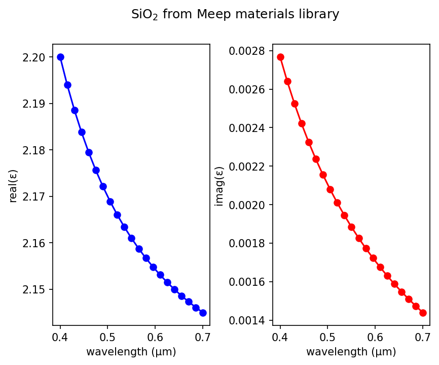

---
# Materials
---

The material structure in Maxwell's equations is determined by the relative permittivity $\varepsilon(\mathbf{r})$ and permeability $\mu(\mathbf{r})$.

However, $\varepsilon$ is not only a function of position. In general, it also depends on frequency (material dispersion) and on the electric field $\mathbf{E}$ itself (nonlinearity) or an applied magnetic field $\mathbf{H}$ (gyrotropy). It may also depend on the orientation of the field (anisotropy). Material dispersion, in turn, is generally associated with absorption loss in the material, or possibly gain. All of these effects can be simulated in Meep, with certain restrictions. Similarly for the relative permeability $\mu(\mathbf{r})$, for which dispersion, nonlinearity, and anisotropy are all supported as well.

In this section, we describe the form of the equations and material properties that Meep can simulate. The actual user interface where these properties are specified in the simulation is described in [Python Interface](Python_User_Interface.md).

[TOC]

Material Dispersion
-------------------

Physically, material dispersion arises because the polarization of the material does not respond instantaneously to an applied field $\vec{E}$, and this is essentially the way that it is implemented in FDTD. In particular, $\mathbf{D} = \varepsilon\mathbf{E}$ is expanded to:

$$\mathbf{D} = \varepsilon_\infty \mathbf{E} + \mathbf{P}$$

where $\varepsilon_\infty$, which [must be positive](FAQ.md#why-does-my-simulation-diverge-if-0), is the *instantaneous* dielectric function (the infinite-frequency response) and **P** is the remaining frequency-dependent *polarization* density in the material. **P**, in turn, has its own time-evolution equation, and the exact form of this equation determines the frequency-dependence $\varepsilon(\omega)$.

**Note:** Meep's definition of $\omega$ uses a sign convention $\exp(-i\omega t)$ for the time dependence; $\varepsilon$ formulas in engineering papers that use the opposite sign convention for $\omega$ will have a sign flip in all the imaginary terms below. If you are using parameters from the literature, you should use **positive** values of $\gamma$ and $\omega$ as-is for loss; don't be confused by the difference in $\omega$ sign convention and flip the sign of the parameters.

Meep supports a Lorentzian susceptibility profile which consists of a sum of harmonic resonances plus a term for the frequency-independent electric conductivity:

<center>

$$\varepsilon(\omega,\mathbf{x}) = \left( 1 + \frac{i \cdot \sigma_D(\mathbf{x})}{\omega}  \right) \left[ \varepsilon_\infty(\mathbf{x})  + \sum_n \frac{\sigma_n(\mathbf{x}) \cdot \omega_n^2 }{\omega_n^2 - \omega^2 - i\omega\gamma_n} \right] ,$$

$= \left( 1 + \frac{i \cdot \sigma_D(\mathbf{x})}{2\pi f}  \right) \left[ \varepsilon_\infty(\mathbf{x})  + \sum_n \frac{\sigma_n(\mathbf{x}) \cdot f_n^2 }{f_n^2 - f^2 - if\gamma_n/2\pi} \right] ,$

</center>

where $\sigma_D$ is the electric conductivity, $\omega_n$ and $\gamma_n$ are user-specified constants. Actually, the numbers that one specifies are $f_n = \omega_n/2\pi$ and $\gamma_n/2\pi$. The $\sigma_n(\mathbf{x})$ is a user-specified function of position giving the strength of the $n$-th resonance. The $\sigma$ parameters can be anisotropic (real-symmetric) tensors, while the frequency-independent term $\varepsilon_\infty$ can be an arbitrary real-symmetric tensor as well. This corresponds to evolving $\mathbf{P}$ via the equations:

$$\mathbf{P} = \sum_n \mathbf{P}_n$$

$$\frac{d^2\mathbf{P}_n}{dt^2} + \gamma_n \frac{d\mathbf{P}_n}{dt} +  \omega_n^2 \mathbf{P}_n = \sigma_n(\mathbf{x}) \omega_n^2 \mathbf{E}$$

That is, we must store and evolve a set of auxiliary fields $\mathbf{P}_n$ along with the electric field in order to keep track of the polarization $\mathbf{P}$. Essentially any $\varepsilon(\omega)$ could be modeled by including enough of these polarization fields &mdash; Meep allows you to specify any number of these, limited only by computer memory and time which increases with the number of polarization terms you require.

Note that the conductivity $\sigma_D$ corresponds to an imaginary part of $\varepsilon$ given by $i \varepsilon_\infty \sigma_D / \omega$. This does not include the harmonic-resonance terms. When you specify frequency in Meep units, however, you are specifying $f$ without the $2\pi$, so the imaginary part of $\varepsilon$ is $i \varepsilon_\infty \sigma_D / 2\pi f$.

Meep also supports polarizations of the [Drude](https://en.wikipedia.org/wiki/Drude_model) form, typically used for metals:

$$\frac{d^2\mathbf{P}_n}{dt^2} + \gamma_n \frac{d\mathbf{P}_n}{dt} = \sigma_n(\mathbf{x}) \omega_n^2 \mathbf{E}$$

which corresponds to a term of the following form in $\varepsilon$'s $\Sigma_n$ summation:

$$\frac{i \sigma_n(\mathbf{x}) \cdot \omega_n^2 }{\omega (\gamma_n - i\omega)}$$

which is equivalent to the Lorentzian model except that the $\omega_n^2$ term has been omitted from the denominator, and asymptotes to a conductivity $\sigma_n \omega_n^2 / \gamma_n$ as $\omega\to 0$. In this case, $\omega_n^2$ is just a dimensional scale factor and has no interpretation as a resonance frequency.

### How do I import n and k values into Meep?

You can import into Meep any arbitrary complex permittivity profile via $n$ and $k$ values obtained via e.g. [ellipsometry](https://en.wikipedia.org/wiki/Ellipsometry) by fitting the wavelength- or frequency-dependent data to a sum of Lorentzian polarizability terms. In general, you have to use nonlinear optimization to perform the fit (e.g., to minimize the sum-of-squares errors or whatever error criterion you prefer). Enough Lorentzians should form a complete basis, so you should be able to fit any function given enough Lorentzians. Unfortunately, the fitting process requires some trial and error to specify the number of fitting parameters and their initial values. For a demonstration, see this [script](https://github.com/NanoComp/meep/blob/master/python/examples/eps_fit_lorentzian.py).

A wavelength-dependent, purely-real permittivity (i.e., with no loss) which can be represented using the [Sellmeier equation](https://en.wikipedia.org/wiki/Sellmeier_equation) can be directly [transferred to the Lorentz model using a simple substitution of variables](#sellmeier-coefficients).

Note: Meep only does [subpixel averaging of the nondispersive part of $\varepsilon$ (and $\mu$)](Subpixel_Smoothing.md#what-about-dispersive-materials).

### Sellmeier Coefficients

For a wavelength-dependent, purely-real permittivity (i.e., with no loss) which can be represented via the [Sellmeier equation](https://en.wikipedia.org/wiki/Sellmeier_equation):

$$\varepsilon(\lambda) = 1 + \sum_n \frac{B_n \lambda^2}{\lambda^2 - C_n}$$

where $\lambda$ is the vacuum wavelength, each term containing two coefficients ($B_n$ and $C_n$) can be directly transferred to a Lorentzian polarization field using a simple substitution of variables: $\omega_n=1/\sqrt{C_n}$, $\gamma_n=0$, and $\sigma_n=B_n$. Several examples of importing Sellmeier coefficients from published fitting data including [germanium](https://github.com/NanoComp/meep/blob/master/python/materials.py#L884-L901) (Ge) and [gallium nitride](https://github.com/NanoComp/meep/blob/master/python/materials.py#L1162-L1188) (GaN) are provided in the [Materials Library](#materials-library).

Numerical Stability
-------------------

In some cases, you may need to reduce the `Courant` parameter $S$ of the simulation, which relates the size of the time step to the spatial discretization: $c\Delta t = S\Delta x$. By default, $S = 0.5$  but in general you must have $S < n_\textrm{min}/\sqrt{\textrm{# dimensions}}$, where $n_\textrm{min}$ is the minimum refractive index (usually 1), so if your refractive indices are ever <1 you may need a smaller $S$.

If a Lorentzian resonance at ω$_n$ is specified at too high a frequency relative to the time discretization $\Delta t$, the simulation becomes unstable. Essentially, the problem is that $\mathbf{P}_n$ oscillates too fast compared with the time discretization for the discretization to work properly. If this happens, there are three workarounds: (1) increase the resolution which increases the resolution in both space and time, (2) decrease the Courant factor which decreases $\Delta t$ compared to $\Delta x$, or (3) use a different model function for your dielectric response.

Roughly speaking, the $\mathbf{P}_n$ equation becomes unstable for $\omega_n \Delta t / 2 > 1$. Note that, in Meep frequency units, you specify $f_n = \omega_n/2\pi$, so this quantity should be less than $1/\pi \Delta t$.

Finally, overlapping dispersive materials with perfectly matched layer (PML) absorbing boundaries may produce instabilities. A workaround is to replace the PML with an absorber.

Loss and Gain
-------------

If $\gamma$ above is nonzero, then the dielectric function $\varepsilon(\omega)$ becomes *complex*, where the imaginary part is associated with absorption loss in the material if it is positive, or gain if it is negative. Alternatively, a dissipation loss or gain may be added by a positive or negative conductivity, respectively — this is often convenient if you only care about the imaginary part of $\varepsilon$ in a narrow bandwidth, and is described in detail in the next section.

If you look at Maxwell's equations, then $d\mathbf{P}/dt$ plays exactly the same role as a current $\mathbf{J}$. Just as $\mathbf{J} \cdot \mathbf{E}$ is the rate of change of mechanical energy (the power expended by the electric field on moving the currents), therefore, the rate at which energy is lost to absorption is given by:

<center>

absorption rate $\sim \frac{d\mathbf{P}}{dt} \cdot \mathbf{E}$

</center>

Meep can keep track of this energy for the Lorentzian polarizability terms but not for the conductivity terms. For gain, this gives the amount of energy expended in amplifying the field.

Conductivity and Complex ε
--------------------------

Often, you only care about the absorption loss in a narrow bandwidth, where you just want to set the imaginary part of $\varepsilon$ (or $\mu$) to some known experimental value, in the same way that you often just care about setting a dispersionless real $\varepsilon$ that is the correct value in your bandwidth of interest.

One approach to this problem would be allowing you to specify a constant, frequency-independent, imaginary part of $\varepsilon$, but this has the disadvantage of requiring the simulation to employ complex fields which double the memory and time requirements, and also tends to be numerically unstable. Instead, the approach in Meep is for you to set the conductivity $\sigma_D$ (or $\sigma_B$ for an imaginary part of $\mu$), chosen so that $\mathrm{Im}\, \varepsilon = \varepsilon_\infty \sigma_D / \omega$ is the correct value at your frequency $\omega$ of interest. Note that, in Meep, you specify $f = \omega/2\pi$ instead of $\omega$ for the frequency, however, so you need to include the factor of $2\pi$ when computing the corresponding imaginary part of $\varepsilon$. Conductivities can be implemented with purely real fields, so they are not nearly as expensive as implementing a frequency-independent complex $\varepsilon$ or $\mu$.

For example, suppose you want to simulate a medium with $\varepsilon = 3.4 + 0.101i$ at a frequency 0.42 (in your Meep units), and you only care about the material in a narrow bandwidth around this frequency (i.e. you don't need to simulate the full experimental frequency-dependent permittivity). Then, in Meep, you could use `meep.Medium(epsilon=3.4, D_conductivity=2*math.pi*0.42*0.101/3.4)` in Python or `(make medium (epsilon 3.4) (D-conductivity (* 2 pi 0.42 0.101 (/ 3.4))))` in Scheme; i.e. $\varepsilon_\infty = \mathrm{Re}[\varepsilon] = 3.4$ and $\sigma_D = \omega \, \mathrm{Im}[\varepsilon] / \varepsilon_\infty = (2\pi \, 0.42) \, 0.101 / 3.4$.

You can also use the $\sigma_D$ feature to model the [attenuation coefficient](https://en.wikipedia.org/wiki/Attenuation_coefficient) $\alpha$ (units of e.g. dB/cm) obtained from experimental measurements (i.e., ellipsometry). This involves first [converting $\alpha$ into a complex refractive index](https://en.wikipedia.org/wiki/Mathematical_descriptions_of_opacity#Complex_refractive_index) (which is then converted into a complex permittivity) with imaginary part given by $\lambda_0\alpha/(4\pi)$ where $\lambda_0$ is the vacuum wavelength.

**Note**: the "conductivity" in Meep is slightly different from the conductivity you might find in a textbook, because for computational convenience it appears as $\sigma_D \mathbf{D}$ in our Maxwell equations rather than the more-conventional $\sigma \mathbf{E}$; this just means that our definition is different from the usual electric conductivity by a factor of $\varepsilon$. Also, just as Meep uses the dimensionless relative permittivity for $\varepsilon$, it uses nondimensionalized units of 1/$a$ (where $a$ is your unit of distance) for the conductivities $\sigma_{D,B}$. If you have the electric conductivity $\sigma$ in SI units of S/m (S is siemens) and want to convert to $\sigma_D$ in Meep units, you can simply use the formula: $\sigma_D = (a/c) \sigma / (\varepsilon_r \varepsilon_0)$ where $a$ is your unit of distance in *meters*, $c$ is the vacuum speed of light in m/s, $\varepsilon_0$ is the SI vacuum permittivity, and $\varepsilon_r$ is the real relative permittivity. The quantity $a/c$ in this equation is the conversion factor for frequency in SI units (s$^{-1}$ or Hz) to frequency in Meep units ($c/a$).

Nonlinearity
------------

In general, $\varepsilon$ can be changed anisotropically by the $\mathbf{E}$ field itself, with:

$$\Delta\varepsilon_{ij} = \sum_{k} \chi_{ijk}^{(2)} E_k + \sum_{k\ell} \chi_{ijk\ell}^{(3)} E_k E_\ell + \cdots$$

where the *ij* is the index of the change in the 3$\times$3 ε tensor and the $\chi$ terms are the nonlinear susceptibilities. The $\chi^{(2)}$ sum is the [Pockels effect](https://en.wikipedia.org/wiki/Pockels_effect) and the $\chi^{(3)}$ sum is the [Kerr effect](https://en.wikipedia.org/wiki/Kerr_effect). If the above expansion is frequency-independent, then the nonlinearity is *instantaneous*; more generally, $\Delta\varepsilon$ would depend on some average of the fields at previous times.

Meep supports instantaneous, isotropic Pockels and Kerr nonlinearities, corresponding to a frequency-independent $\chi_{ijk}^{(2)} = \chi^{(2)} \cdot \delta_{ij} \delta_{jk}$ and $\chi_{ijk\ell}^{(3)} = \chi^{(3)} \cdot \delta_{ij} \delta_{k\ell}$, respectively. Thus,

$$\mathbf{D} = \left( \varepsilon_\infty(\mathbf{x}) + \chi^{(2)}(\mathbf{x})\cdot \mathrm{diag}(\mathbf{E}) + \chi^{(3)}(\mathbf{x}) \cdot |\mathbf{E}|^2 \right) \mathbf{E} + \mathbf{P}$$

Here, "diag($\mathbf{E}$)" indicates the diagonal 3$\times$3 matrix with the components of $\mathbf{E}$ along the diagonal.

Normally, for nonlinear systems you will want to use real fields $\mathbf{E}$. This is the default. However, Meep uses complex fields if you have Bloch-periodic boundary conditions with a non-zero Bloch wavevector **k**, or in cylindrical coordinates with $m \neq 0$. In the C++ interface, real fields must be explicitly specified.

For complex fields in nonlinear systems, the physical interpretation of the above equations is unclear because one cannot simply obtain the physical solution by taking the real part any more. In particular, Meep simply *defines* the meaning of the nonlinearity for complex fields as follows: the real and imaginary parts of the fields do not interact nonlinearly. That is, the above equation should be taken to hold for the real and imaginary parts (of $\mathbf{E}$ and $\mathbf{D}$) separately: e.g., $|\mathbf{E}^2|$ is the squared magnitude of the *real* part of $\mathbf{E}$ for when computing the real part of $\mathbf{D}$, and conversely for the imaginary part.

For a discussion of how to relate $\chi^{(3)}$ in Meep to experimental Kerr coefficients, see [Units and Nonlinearity](Units_and_Nonlinearity.md).

Magnetic Permeability μ
-----------------------

All of the above features that are supported for the electric permittivity $\varepsilon$ are also supported for the magnetic permeability $\mu$. That is, Meep supports $\mu$ with dispersion from magnetic conductivity and Lorentzian resonances, as well as magnetic $\chi^{(2)}$ and $\chi^{(3)}$ nonlinearities. The description of these is exactly the same as above, so we won't repeat it here &mdash; just take the above descriptions and replace $\varepsilon$, $\mathbf{E}$, $\mathbf{D}$, and $\sigma_D$ by $\mu$, $\mathbf{H}$, $\mathbf{B}$, and $\sigma_B$, respectively.

Saturable Gain and Absorption
-----------------------------

For some problems, simply adding gain or loss using a [conductivity term](Materials.md#conductivity-and-complex-ε) does not correctly model the desired system and will lead to unphysical results. For example, attempting to model a laser by adding gain through a conductivity term will yield a diverging electric field, as the conductivity-based gain cannot saturate, and will continue to amplify arbitrarily strong electric fields within the laser cavity. Instead, such systems must be modeled using a *saturable* gain medium, in which the available gain is reduced for stronger electric fields, which prohibits the electric field from diverging in this manner.

Meep supports saturable gain and absorbing media through the use of a set of auxiliary equations which model both the polarization and inversion of the saturable medium. Meep's implementation of these auxiliary equations is described in [arXiv:2007.09329](https://arxiv.org/abs/2007.09329), in which the polarization is treated using the oscillator model and the inversion is modeled as a set of rate equations for the population densities of the atomic levels of the saturable medium. The oscillator model for saturable media is a second-order differential equation for the polarization that is slightly different from the [Drude-Lorentz susceptibility](Materials.md#material-dispersion):

$$\frac{d^2\mathbf{P}_n}{dt^2} + \gamma_n \frac{d\mathbf{P}_n}{dt} + \left(\omega_n^2 + \left(\frac{\gamma_n}{2} \right)^2 \right) \mathbf{P}_n = -\Delta N(\mathbf{x},t) \bar{\sigma}_n \mathbf{E}(\mathbf{x},t)$$

where $\Delta N(\mathbf{x},t) = N_{\textrm{upper}}(\mathbf{x},t) - N_{\textrm{lower}}(\mathbf{x},t)$ is the inversion of the two atomic energy levels which comprise the $n$th lasing transition, $\omega_n$ is the central frequency of the atomic transition, $\gamma_n$ is the full width half-maximum of the width of the transition, and $\bar{\sigma}_n$ (a tensor) is the coupling strength between the electric field and the nonlinear polarization of the $n$th transition. Note that this polarization equation is only modeling the nonlinear, saturable portion of the polarization. The atomic level population densities, $N_i(\mathbf{x},t)$, each satisfy a rate equation of the form:

$$\frac{\partial N_i}{\partial t} = - \sum_j \Gamma_{ij} N_i + \sum_j \Gamma_{ji} N_j + \left[ \pm \frac{1}{\omega_n \hbar} \mathbf{E}(\mathbf{x},t) \cdot \left( \frac{\partial \mathbf{P}}{\partial t} + \frac{\gamma_n}{2} \mathbf{P} \right) \right]$$

where $\Gamma_{ij}$ is the non-radiative decay or pumping rate from level $i$ to level $j$. The final term in brackets is only included if level $i$ is either the upper or lower level of the $n$th transition, where the upper/lower atomic levels are denoted by $+$/$-$.

In Meep, one can specify an arbitrary number of atomic levels with any number of lasing transitions between them, enabling one to realize common two- and four-level saturable media, as well as entire manifolds of levels and transitions found in realistic models of saturable media. When assigning the necessary transition frequencies, $\omega_n$, and widths, $\gamma_n$, of the atomic transition in Meep, these are specified in units of 2π$c$/$a$. However, the pumping and decay rates, $\Gamma_{ij}$, are instead specified in units of $c/a$. Finally, as part of initializing a saturable medium, the total atomic density, $N_0$, must be specified, and Meep will ensure that $\sum_i N_i = N_0$.

In principle, there are a few different ways to alter the effective strength of the gain or absorption experienced by the electric field. For example, to increase the gain of a two-level medium, one could increase the density of the gain medium, $N_0$ (assuming $\Gamma_{12} > \Gamma_{21}$), further increase $\Gamma_{12}$, or increase the relevant components of the coupling strength tensor, $\bar{\sigma}_n$. In practice though, there are two considerations to keep in mind. First, for atomic and molecular gain media, the medium density, coupling strength, and non-radiative decay rates are all fixed by the intrinsic properties of the gain medium -- physically what can be changed is the pumping rate. However, this can occasionally be an inconvenient parameter to tune because it also effects the relaxation rate of the gain medium (see discussion about $\Gamma_\parallel$ below), which can change the stability of the system, see [Applied Physics Letters, Vol. 117, Num. 051102 (2020)](https://aip.scitation.org/doi/abs/10.1063/5.0019353?journalCode=apl). Second, Meep will not automatically check to ensure that the non-radiative decay times, $1/\Gamma_{ij}$, are larger than the timestep, $\Delta t$. If the non-radiative decay times are too short, this will lead to unphysical behavior and can result in diverging fields. As such, we would generally recommend tuning the effective gain or loss by changing $N_0$.

### Frequency Domain Susceptibility in Steady-State Regime

It is possible to use saturable non-linear media to effectively implement linear gain and loss in a simulation, and treat it as a frequency-dependent linear susceptibility.

If the saturable medium only has two atomic levels (i.e. only a single non-linear polarization field) and the system is operated in the steady-state regime with only a single frequency component of the electric field, one can write the susceptibility of the non-linear saturable medium as
$$ \chi_{1}(\mathbf{x}, \omega) = \frac{\sigma_1}{2 \omega_1} \left( \frac{ \Delta N(\mathbf{x})}{\omega - \omega_1 + i \gamma_1/2}\right) \left( \frac{1}{1 + \frac{4 \sigma_1}{\omega_1 \hbar \Gamma_{\parallel} \gamma_1} \left( \frac{\gamma_1^2}{\gamma_1^2 + 4(\omega - \omega_1)^2} \right) |\mathbf{E}(\mathbf{x},\omega)|^2} \right) $$
For this two-level gain medium, $\Gamma_\parallel = \Gamma_{12} + \Gamma_{21}$, and we are assuming that the coupling matrix is proportional to the identity matrix, $\bar{\sigma}_1 = \sigma_1 \bar{I}$. Thus, if
$$ \frac{4 \sigma_1}{\omega_1 \hbar \Gamma_{\parallel} \gamma_1} \left( \frac{\gamma_1^2}{\gamma_1^2 + 4(\omega - \omega_1)^2} \right) |\mathbf{E}(\mathbf{x},\omega)|^2 \ll 1 $$
the non-linear saturation of the gain medium can be ignored, and the effectively linear susceptibility is
$$ \chi_{1}(\mathbf{x}, \omega) \approx \frac{\sigma_1}{2 \omega_1} \left( \frac{ \Delta N(\mathbf{x})}{\omega - \omega_1 + i \gamma_1/2}\right) $$
and thus offers an independent route to realizing linear gain and loss rather than making the material [conductive](Materials.md#conductivity-and-complex-ε).

However, there are some important considerations to keep in mind when trying to use a non-linear saturable medium to approximate a linear susceptibility. First, saturable media can be a [chaotic system](https://en.wikipedia.org/wiki/Chaos_theory), so one must check that the system is actually reaching a steady-state regime with only a single frequency component. Saturable non-linear media excited with more than one initial frequency can generate additional "beat" frequencies, so a sufficiently narrow spectral source must be used. Second, there can be relaxation oscillations between the electric field and the saturable medium, so even with a narrow source, one must wait for this transient to decay. Finally, keep in mind that even if your initial fields are calibrated to satisfy the above inequality to treat the medium as linear, one must still be operating below the lasing threshold, as if the system is above the lasing threshold, the fields will eventually grow to the point where the non-linear saturation is important.

Analytically, what this means is that the resonances that are present in the system must still be below the real axis in the complex plane, i.e. possess non-zero decay rates. If any added gain is sufficiently strong to move these resonances to the real axis (i.e. have a decay rate equal to zero), that is the definition of the laser threshold, and the non-linear medium is guaranteed to saturate.

### Verification of the Oscillator Model Equations

Although Meep is using an oscillator model equation for the atomic polarization and level populations, instead of the Bloch equations, Meep retains the two terms usually approximated to zero when deriving the oscillator model equations from the Bloch equations, and so these equations are exactly equivalent to the Bloch equations. For more details, see [arXiv:2007.09329](https://arxiv.org/abs/2007.09329) and Section 6.4.1 of [Nonlinear Optics (third edition)](https://www.amazon.com/Nonlinear-Optics-Third-Robert-Boyd/dp/0123694701) by R. W. Boyd. To verify this equivalence between the different equations for modeling the polarization, as well as confirm that saturable media have been properly implemented in Meep, we compare the results of Meep with an independent FDTD solver using the Bloch equations and the frequency domain steady-state ab initio laser theory (SALT), in a 1d, one-sided, Fabry-Perot cavity containing a two-level gain medium that exhibits steady-state, multi-mode lasing. The cavity has a length of $a = 1$, a background index of $n = 1.5$, an atomic transition frequency of $\omega_n = 40/(2\pi)$, with width $\gamma_n = 8/(2\pi)$, the decay rate from level $2$ to $1$ is $\Gamma_{21} = 0.005$, the pumping rate from $1$ to $2$ is $\Gamma_{12} = 0.0051$, and the total atomic density, $N_0$, of the system was varied to produce different amounts of gain. These plots are given in terms of the equilibrium inversion, $D_0$, which is the inversion of the saturable gain medium in the absence of an electric field, i.e. the value of $\Delta N$ when $\mathbf{E} = 0$. There is agreement among the three methods close to the initial as well as past the third lasing threshold as shown in the following two figures.

<center>

</center>
<center>

</center>

For the two-level atomic gain model used in this example, $D_0$ can be calculated as:

$$ D_0 = \frac{\Gamma_{12} - \Gamma_{21}}{\Gamma_{12} + \Gamma_{21}} N_0 $$

Similar relationships can be found for systems with more than two atomic levels in [Optics Express, Vol. 20, pp. 474-88 (2012)](https://www.osapublishing.org/oe/abstract.cfm?URI=oe-20-1-474).
</details>

### Natural Units for Saturable Media

A conversion chart for different choices of parameter nomenclature for the saturable medium.
	
There is no standard convention in the literature on lasers and saturable gain media for defining the various constants in the equations above. The following are the relationships among these constants for the three different groups of work discussed in this section:

$$ \omega_n \; (\textrm{Meep}) = \omega_{ba} \; (\textrm{Boyd}) = \omega_a \; (\textrm{SALT}) $$
$$ \gamma_n \; (\textrm{Meep}) = \frac{2}{T_2} \; (\textrm{Boyd}) = 2\gamma_\perp \; (\textrm{SALT}) $$
$$ \sigma_n \; (\textrm{Meep}) = \frac{2 \omega_{ba} |\mu_{ba}|^2}{\hbar} \; (\textrm{Boyd}) = \frac{2 \omega_a |\theta|^2}{\hbar} \; (\textrm{SALT}) $$

The relationship among Meep and SALT units are:

$$ D_0 \; (\textrm{SALT}) = \frac{|\theta|^2}{\hbar (\gamma_n/2)} D_0 \; (\textrm{Meep}) $$
$$ \mathbf{E} \; (\textrm{SALT}) = \frac{2 |\theta|}{\hbar \sqrt{(\gamma_n/2) \Gamma_\parallel}} \mathbf{E} \; (\textrm{Meep}) $$

For more details on applying SALT to atomic media with an arbitrary number of levels, see [Optics Express, Vol. 23, pp. 6455-77 (2015)](https://www.osapublishing.org/oe/abstract.cfm?uri=oe-23-5-6455).

An additional discussion of the natural units for saturable media is given in [arXiv:2007.09329](https://arxiv.org/abs/2007.09329).
</details>

Gyrotropic Media
----------------

(**Experimental feature**) Meep supports gyrotropic media, which break optical reciprocity and give rise to magneto-optical phenomena such as the [Faraday effect](https://en.wikipedia.org/wiki/Faraday_effect). Such materials are used in devices like [Faraday rotators](https://en.wikipedia.org/wiki/Faraday_rotator). For a demonstration, see [Tutorial/Gyrotropic Media](Python_Tutorials/Gyrotropic_Media.md).

In a gyrotropic medium, the polarization vector undergoes precession around a preferred direction. In the frequency domain, this corresponds to the presence of skew-symmetric off-diagonal components in the $\varepsilon$ tensor (for a gyroelectric medium) or the μ tensor (for a gyromagnetic medium). Two different gyrotropy models are supported:

### Gyrotropic Drude-Lorentz Model

The first gyrotropy model is a [Drude-Lorentz](Materials.md#material-dispersion) model with an additional precession, which is intended to describe gyroelectric materials. The polarization equation is

$$\frac{d^2\mathbf{P}_n}{dt^2} + \gamma_n \frac{d\mathbf{P}_n}{dt} - \frac{d\mathbf{P}_n}{dt} \times \mathbf{b}_n + \omega_n^2 \mathbf{P}_n = \sigma_n(\mathbf{x}) \omega_n^2 \mathbf{E}$$

(Optionally, the polarization may be of Drude form, in which case the $\omega_n^2 \mathbf{P}_n$ term on the left is omitted.) The third term on the left side, which breaks time-reversal symmetry, is responsible for the gyrotropy; it typically describes the deflection of electrons flowing within the material by a static external magnetic field. In the $\gamma_n = \omega_n = 0$ limit, the equation of motion reduces to a precession around the "bias vector" $\mathbf{b}_n$:

$$\frac{d\mathbf{P}_n}{dt} = \mathbf{P}_n \times \mathbf{b}_n$$

Hence, the magnitude of the bias vector is the angular frequency of the gyrotropic precession induced by the external field.

### Gyrotropic Saturated Dipole (Linearized Landau-Lifshitz-Gilbert) Model

The second gyrotropy model is a linearized [Landau-Lifshitz-Gilbert equation](https://en.wikipedia.org/wiki/Landau%E2%80%93Lifshitz%E2%80%93Gilbert_equation), suitable for modeling gyromagnetic materials such as ferrites. Its polarization equation of motion is

$$\frac{d\mathbf{P}_n}{dt} = \mathbf{b}_n \times \left( - \sigma_n \mathbf{E} + \omega_n \mathbf{P}_n + \alpha_n \frac{d\mathbf{P}_n}{dt} \right) - \gamma_n \mathbf{P}_n$$

Note: although the above equation is written in terms of electric susceptibilities, this model is typically used for magnetic susceptibilities. Meep places no restriction on the field type that either gyrotropy model can be applied to. As usual, electric and magnetic susceptibilities can be swapped by substituting ε with μ, $\mathbf{E}$ with $\mathbf{H}$, etc.

The Landau-Lifshitz-Gilbert equation describes the precessional motion of a saturated point magnetic dipole in a magnetic field. In the above equation, the variable $\mathbf{P}_n$ represents the linearized deviation of the polarization from its static equilibrium value (assumed to be much larger and aligned parallel to $\mathbf{b}_n$). Note that this equation of motion is completely different from the [Drude-Lorentz equation](Materials.md#material-dispersion), though the constants σ$_n$, ω$_n$, and γ$_n$ play analogous roles (σ$_n$ couples the polarization to the driving field, ω$_n$ is the angular frequency of precession, and γ$_n$ is a damping factor).

In this model, $\mathbf{b}_n$ is taken to be a unit vector (i.e., its magnitude is ignored).

### Frequency Domain Susceptibility Tensors

Suppose $\mathbf{b} = b \hat{z}$, and let all fields have harmonic time-dependence $\exp(-i\omega t)$. Then $\mathbf{P}_n$ is related to the applied field $\mathbf{E}$ by

$$\mathbf{P}_n =  \begin{bmatrix}\chi_\perp & -i\eta & 0 \\ i\eta & \chi_\perp & 0 \\ 0 & 0 & \chi_\parallel \end{bmatrix} \mathbf{E}$$

For the [gyrotropic Lorentzian model](Materials.md#gyrotropic-drude-lorentz-model), the components of the susceptibility tensor are

$$\chi_\perp = \frac{\omega_n^2 \Delta_n \sigma_n}{\Delta_n^2 - \omega^2 b^2},\;\;\; \chi_\parallel = \frac{\omega_n^2 \sigma_n}{\Delta_n}, \;\;\; \eta = \frac{\omega_n^2 \omega b \sigma_n}{\Delta_n^2 - \omega^2 b^2}, \;\;\;\Delta_n \equiv \omega_n^2 - \omega^2 - i\omega\gamma_n$$

And for the [gyrotropic saturated dipole (linearized Landau-Lifshitz-Gilbert) model](Materials.md#gyrotropic-saturated-dipole-linearized-landau-lifshitz-gilbert-model),

$$\chi_\perp = \frac{\sigma_n (\omega_n - i \omega \alpha_n)}{(\omega_n - i \omega \alpha_n)^2 - (\omega + i \gamma_n)^2}, \;\;\; \chi_\parallel = 0, \;\;\;  \eta = \frac{\sigma_n (\omega + i \gamma)}{(\omega_n - i \omega \alpha_n)^2 - (\omega + i \gamma_n)^2}$$

Materials Library
-----------------

A materials library is available for [Python](https://github.com/NanoComp/meep/tree/master/python/materials.py) and [Scheme](https://github.com/NanoComp/meep/tree/master/scheme/materials.scm) containing [crystalline silicon](https://en.wikipedia.org/wiki/Crystalline_silicon) (c-Si), [amorphous silicon](https://en.wikipedia.org/wiki/Amorphous_silicon) (a-Si) including the hydrogenated form, [silicon dioxide](https://en.wikipedia.org/wiki/Silicon_dioxide) (SiO<sub>2</sub>), [indium tin oxide](https://en.wikipedia.org/wiki/Indium_tin_oxide) (ITO), [alumina](https://en.wikipedia.org/wiki/Aluminium_oxide) (Al<sub>2</sub>O<sub>3</sub>), [gallium arsenide](https://en.wikipedia.org/wiki/Gallium_arsenide) (GaAs), [aluminum arsenide](https://en.wikipedia.org/wiki/Aluminium_arsenide) (AlAs), [aluminum nitride](https://en.wikipedia.org/wiki/Aluminium_nitride) (AlN), [borosilicate glass](https://en.wikipedia.org/wiki/Borosilicate_glass) (BK7), [fused quartz](https://en.wikipedia.org/wiki/Fused_quartz), [silicon nitride](https://en.wikipedia.org/wiki/Silicon_nitride) (Si<sub>3</sub>N<sub>4</sub>), [germanium](https://en.wikipedia.org/wiki/Germanium) (Ge), [indium phosphide](https://en.wikipedia.org/wiki/Indium_phosphide) (InP), [gallium nitride](https://en.wikipedia.org/wiki/Gallium_nitride) (GaN), [cadmium telluride](https://en.wikipedia.org/wiki/Cadmium_telluride) (CdTe), [lithium niobate](https://en.wikipedia.org/wiki/Lithium_niobate) (LiNbO<sub>3</sub>), [barium borate](https://en.wikipedia.org/wiki/Barium_borate) (BaB<sub>2</sub>O<sub>4</sub>), [calcium tungstate](https://en.wikipedia.org/wiki/Scheelite) (CaWO<sub>4</sub>), [calcium carbonate](https://en.wikipedia.org/wiki/Calcium_carbonate) (CaCO<sub>3</sub>), [yttrium oxide](https://en.wikipedia.org/wiki/Yttrium(III)_oxide) (Y<sub>2</sub>O<sub>3</sub>), [yttrium aluminum garnet](https://en.wikipedia.org/wiki/Yttrium_aluminium_garnet) (YAG), [poly(methyl methacrylate)](https://en.wikipedia.org/wiki/Poly(methyl_methacrylate)) (PMMA), [polycarbonate](https://en.wikipedia.org/wiki/Polycarbonate), [polystyrene](https://en.wikipedia.org/wiki/Polystyrene), [cellulose](https://en.wikipedia.org/wiki/Cellulose), as well as 11 elemental metals: [silver](https://en.wikipedia.org/wiki/Silver) (Ag), [gold](https://en.wikipedia.org/wiki/Gold) (Au), [copper](https://en.wikipedia.org/wiki/Copper) (Cu), [aluminum](https://en.wikipedia.org/wiki/Aluminium) (Al), [berylium](https://en.wikipedia.org/wiki/Beryllium) (Be), [chromium](https://en.wikipedia.org/wiki/Chromium) (Cr), [nickel](https://en.wikipedia.org/wiki/Nickel) (Ni), [palladium](https://en.wikipedia.org/wiki/Palladium) (Pd), [platinum](https://en.wikipedia.org/wiki/Platinum) (Pt), [titanium](https://en.wikipedia.org/wiki/Titanium) (Ti), and [tungsten](https://en.wikipedia.org/wiki/Tungsten) (W).

Experimental values of the complex refractive index are fit to a [Drude-Lorentz susceptibility model](#material-dispersion) over various wavelength ranges. For example, the fit for crystalline silicon is based on [Progress in Photovoltaics, Vol. 3, pp. 189-92 (1995)](https://onlinelibrary.wiley.com/doi/full/10.1002/pip.4670030303) for the wavelength range of 0.4-1.0 µm as described in [J. Optical Society of America A, Vol. 28, pp. 770-77 (2011)](https://www.osapublishing.org/josaa/abstract.cfm?uri=josaa-28-5-770). The fit for the elemental metals is over the range of 0.2-12.4 μm and is described in [Applied Optics, Vol. 37, pp. 5271-83 (1998)](https://www.osapublishing.org/ao/abstract.cfm?uri=ao-37-22-5271).

Fitting parameters for all materials are defined for a unit distance of 1 µm. For simulations which use a different value for the unit distance, the predefined variable `um_scale` (Python) or `um-scale` (Scheme) must be scaled by *multiplying* by whatever the unit distance is, in units of µm. For example, if the unit distance is 100 nm, this would require adding the line `um_scale = 0.1*um_scale` after the line where [`um_scale` is defined](https://github.com/NanoComp/meep/blob/master/python/materials.py#L7). This change must be made directly to the materials library file.

As an example, to import aluminum from the library into a Python script requires adding the following lines:

```python
from meep.materials import Al
```
Then, the material can be simply used as `geometry = [meep.Cylinder(material=Al, ...]`.

You can inspect the frequency range over which the permittivity profile for aluminum is defined and also inspect the value of its permittivity tensor at a wavelength of 1.55 µm using the `epsilon(frequency)` function of the `Medium` class:

```py
> Al.valid_freq_range
FreqRange(min=0.08065817067268914, max=4.839334107626791)
> Al.epsilon(1/1.55)
array([[-232.66329725+47.08102623j,  0.         +0.j        ,  0.         +0.j        ],
       [ 0.         +0.j        , -232.66329725+47.08102623j,  0.         +0.j        ],
       [ 0.         +0.j        ,  0.         +0.j       ,  -232.66329725+47.08102623j]])
```

In Scheme, the materials library is already included when Meep is run, so you can use it without any initialization:

```scm
(set! geometry (list (make cylinder (material Al) ...)))
```

As a final example, we plot the complex refractive index of SiO$_2$ from the materials library over the visible wavelength range of 400 nm to 700 nm.

```py
from meep.materials import SiO2
import numpy as np
import matplotlib.pyplot as plt

wvl_min = 0.4 # units of μm
wvl_max = 0.7 # units of μm
nwvls = 21
wvls = np.linspace(wvl_min, wvl_max, nwvls)

SiO2_epsilon = np.array([SiO2.epsilon(1/w)[0][0] for w in wvls])

plt.subplot(1,2,1)
plt.plot(wvls,np.real(SiO2_epsilon),'bo-')
plt.xlabel('wavelength (μm)')
plt.ylabel('real(ε)')

plt.subplot(1,2,2)
plt.plot(wvls,np.imag(SiO2_epsilon),'ro-')
plt.xlabel('wavelength (μm)')
plt.ylabel('imag(ε)')

plt.suptitle('SiO$_2$ from Meep materials library')
plt.subplots_adjust(wspace=0.4)
plt.show()
```

<center>

</center>

**Note:** for narrowband calculations, some of the Lorentzian susceptibility terms may be unnecessary and will contribute to consuming more computational resources than are required (due to the additional storage and time stepping of the polarization fields). Computational efficiency can be improved (without significantly affecting accuracy) by removing from the material definitions those Lorentzian susceptibility terms which are far outside the spectral region of interest. In addition, when using the materials library the Courant parameter may need to be reduced to achieve meaningful results, see [Numerical Stability](Materials.md#numerical-stability).
