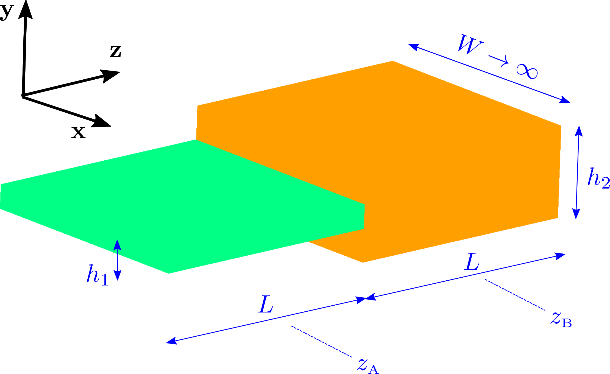

# Eigenmode decomposition of arbitrary field configurations

*Eigenmode decomposition* exploits MEEP's interconnectivity
with the [MPB][MPB] mode solver to represent an arbitrary
time-harmonic field configuration as a superposition of 
the normal harmonic modes of your structure.

## Theoretical background

Consider a waveguide structure of infinite extent in the $z$
direction with constant cross section in the transverse
$[\vec\rho=(x,y)]$ directions. Then for any given
angular frequency $\omega$ we may solve Maxwell's
equations to obtain the *normal modes* of the
structure---an infinite set of vector-valued
functions of the transverse coordinates
$\{\mathbf{E}^\pm_n(\vec{\rho}), \mathbf{H}^\pm_n(\vec{\rho})\}$,
with associated propagation constants $\{\beta_n\}$,
that furnish a complete expansion basis for
time-harmonic electromagnetic fields at frequency $\omega$.
That is, given any arbitrary frequency-$\omega$ field
configuration of the form
$$ \mathbf{E}(\mathbf{x},t) = \mathbf{E}(\mathbf{x}) e^{-i\omega t} $$
$$ \mathbf{H}(\mathbf{x},t) = \mathbf{H}(\mathbf{x}) e^{-i\omega t} $$
we have the *exact* expansions
$$
   \mathbf{E}(\mathbf{x}) = 
   \mathbf{E}(\vec{\rho},z) =
   \sum_{n} \left\{   \alpha^+_n \mathbf E^+_n(\vec \rho)e^{+i\beta_n z}
                    + \alpha^-_n \mathbf E^-_n(\vec \rho)e^{-i\beta_n z}
            \right\}
    \qquad (1a)
$$
$$
   \mathbf{H}(\mathbf{x}) = 
   \mathbf{H}(\vec{\rho},z) =
   \sum_{n} \left\{   \alpha^+_n \mathbf H^+_n(\vec \rho)e^{+i\beta_n z}
                    + \alpha^-_n \mathbf H^-_n(\vec \rho)e^{-i\beta_n z}
            \right\}
    \qquad (1b)
$$
where the expansion coefficients $\{\alpha^{\pm}_n\}$
may be extracted from knowledge of the time-harmonic
fields $\mathbf{E},\mathbf{H}$ on any cross-sectional
surface $S$ transverse to the waveguide.

The idea of mode expansion in MEEP is to compute
the $\{\alpha_n^\pm\}$ coefficients above for any
*arbitrary* time-harmonic field distribution 
resulting from a MEEP calculation. In calculations
of this sort,

--the $\{\mathbf{E},\mathbf{H}\}$ fields on the RHS
    of equations (1a,b) above will be frequency-domain
    fields stored in a `dft_flux` object in a MEEP
    run, where you will have arranges this `dft_flux` object
    to live on a cross-sectional surface $S$ transverse
    to the waveguide;

--the $\{\mathbf{E}^\pm_n,\mathbf{H}^\pm_n\}$ eigenmodes
    and $\{\beta_n\}$ propagation constants are computed
    automatically under the hood by MPB as normal modes 
    of an infinitely extended waveguide with the same 
    cross-sectional material distribution that your structure
    has on the transverse slice $S$, and

--the $\alpha_n^\pm$ coefficients for as many bands 
   as you like are computed by calling `get_eigenmode_coefficients(),`
   as discussed below.

## C++ function prototype

The basic routine here is

```c++
std::vector<cdouble> 
 fields::get_eigenmode_coefficients(dft_flux *flux,
                                    direction d,
                                    const volume &where,
                                    std::vector<int> bands,
                                    kpoint_func k_func=0,
                                    void *user_data=0);
```
where

+ `flux` is a `dft_flux` object pre-populated with frequency-domain field data resulting from a time-domain MEEP calculation you have run to tabulate fields on a cross-sectional slice perpendicular to your waveguide

+ `d` is the direction of power flow in the waveguide

+ `where` is a `volume` describing the cross-sectional surface $S$

+ `bands` is an array of integers that you populate with the indices of the modes for which you want expansion coefficients

+ `user_func` is an *optional* function you supply to provide initial estimates of the wavevector of a mode with given
frequency and band index; its prototype is

```c++
 vec (*kpoint_func)(void user_data, double freq, int band);
```

and it should return a `vec` giving your best guess for the 
wavevector of the `band`th mode at frequency `freq`.

The return value of `get_mode_coefficients` is an array
of type `cdouble` (short for `std::complex<double>`),
of length `num_freqs * num_bands`, where `num_freqs`
is the number of frequencies stored in your `flux` object
(equal to `flux->Nfreq`) and `num_bands` is the length
of your `bands` input array. 
The expansion coefficient for the mode with frequency `nf`
and band index `nb` is stored in the `nb*num_freqs + nf`
slot of this array.


## First example: Junction of planar waveguides

As a simple first problem, we'll consider
a 2D problem involving an impedance mismatch
between two planar waveguides, as shown in 
this figure:



In this case the geometry is invariant in the $x$
direction and the waveguides are simply planar
slabs, of finite thickness in the $y$ direction,
with the flow of power in the $z$ direction.
The waveguide in region $z<0$ has thickness $h_1$,
while that for $z>0$ has thickness $h_2\le h_1$; we place
a source inside the smaller waveguide and observe the
imperfect channeling of power flow into the large
waveguide due to the ``impedance'' mismatch at 
$z=0$.

The code for this problem is in `libmeepgeom/WaveguideJunction.cpp.`
This code offers a command-line option `--ratio` that sets the
ratio $h_2/h_1$ of the waveguide thicknesses; the default
value is `--ratio 2` (bigger slab is 2$\times$ thickness
of smaller slab), while for `--ratio 1` the two waveguides
are in fact identical and there should be no power
reflected at $z=0$.

## Second example: Junction of cylindrical waveguides

Next we consider a geometry similar to the one we 
just studied, but now involving a junction of *cylindrical*
waveguides.


Now the waveguides are confining in both $x$ and $y$
directions, with radii $R_1$ for $z<0$ and $R_2$ for $z>0$.

The code for this problem is in `libmeepgeom/fiber-junction.cpp;`
as before, it excites the structure using a single eigenmode of the
smaller waveguide and observes how the single-mode field
in the smaller waveguide goes over to a multi-mode field
in the larger waveguide.
Again the code offers a command-line option `--ratio` that sets the
ratio $R_2/R_1$ of the waveguide radii; the default is `--ratio 2`, 
while for `--ratio 1` we expect perfect transmission of power
<<<<<<< HEAD
$z=0$.
 
## Under the hood: How mode expansion works

The theoretical basis of the mode-expansion algorithm
is the orthogonality relation satisfied by the normal
modes 
$$ \left\langle \mathbf{E}_m^{\sigma} \right|
   \left.       \mathbf{H}^\tau_n     \right\rangle
   =C_{m}\delta_{mn}\delta_{\sigma\tau} 
   \qquad \Big( \{\sigma,\tau\}\in\{+,-\}\Big)
$$
where the inner product involves an integration over
transverse coordinates:
$$ \left\langle \mathbf{f} \right| \left. \mathbf{g} \right\rangle 
   \equiv
   \int_{S} 
    \Big[ \mathbf{f}^*(\vec \rho) \times \mathbf{g}(\vec \rho)\Big]
    \cdot \hat{\mathbf{n}} \, dA
$$
where $S$ is any surface transverse to the direction of propagation
and $\hat{\mathbf{n}}$ is the unit normal vector to $S$ (i.e.
just $\hat{\mathbf{z}}$ in the case considered above).
across $z=0$.

[MPB]:	   https://mpb.readthedocs.io/en/latest/
[DFTFlux]: https://meep.readthedocs.io/en/latest/Scheme_User_Interface/#Flux_spectra.md
