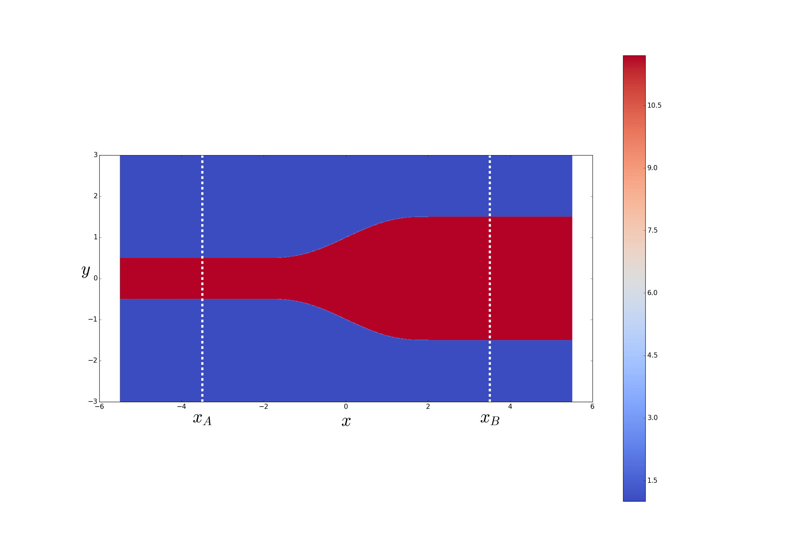
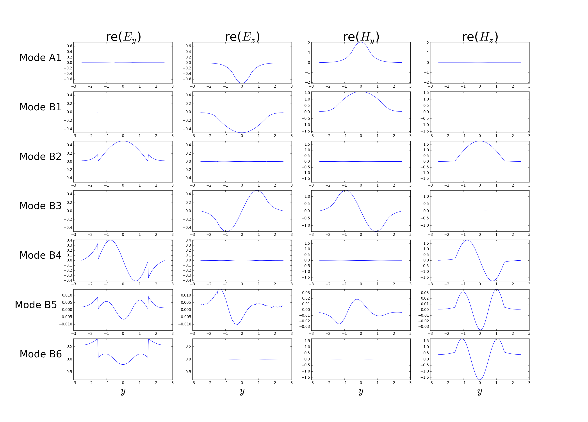
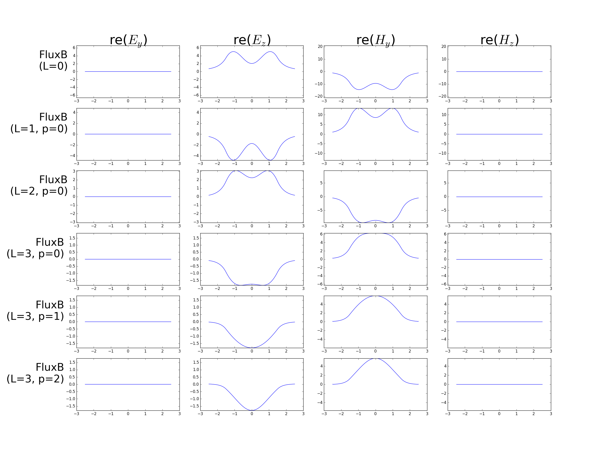

# Eigenmode decomposition of arbitrary field configurations

*Eigenmode decomposition* exploits Meep's interconnectivity
with the [MPB][MPB] mode solver to express an arbitrary
time-harmonic field configuration as a superposition of
the normal harmonic modes of your structure.

[TOC]

## Theoretical background[^1]

Consider a waveguide structure of infinite extent in the $x$
direction with constant cross section in the transverse
$[\vec\rho=(y,z)]$ directions. For any given
angular frequency $\omega$ we may solve the time-harmonic
Maxwell equations to obtain the *normal modes* of the
structure---an infinite set of vector-valued
functions of the transverse coordinates
$\{\mathbf{E}^\pm_n(\vec{\rho}), \mathbf{H}^\pm_n(\vec{\rho})\}$,
with associated propagation constants $\{\beta_n\}$,
that furnish a complete expansion basis for
time-harmonic electromagnetic fields at frequency $\omega$.
That is, given any arbitrary frequency-$\omega$ field
configuration of the form
$$ \mathbf{E}(\mathbf{r},t) = \mathbf{E}(\mathbf{r}) e^{-i\omega t} $$
$$ \mathbf{H}(\mathbf{r},t) = \mathbf{H}(\mathbf{r}) e^{-i\omega t} $$
we have the *exact* expansions
<a name="EigenmodeExpansions"></a>
$$
   \mathbf{E}(\mathbf{r}) = 
   \mathbf{E}(x,\vec{\rho}) =
   \sum_{n} \left\{   \alpha^+_n \mathbf E^+_n(\vec \rho)e^{+i\beta_n x}
                    + \alpha^-_n \mathbf E^-_n(\vec \rho)e^{-i\beta_n x}
            \right\}
    \tag{1}
$$
$$
   \mathbf{H}(\mathbf{r}) = 
   \mathbf{H}(x,\vec{\rho}) =
   \sum_{n} \left\{   \alpha^+_n \mathbf H^+_n(\vec \rho)e^{+i\beta_n x}
                    + \alpha^-_n \mathbf H^-_n(\vec \rho)e^{-i\beta_n x}
            \right\}
    \tag{2}
$$
where (as discussed further [below](ModeExpansion.md#UnderTheHood))
the expansion coefficients $\{\alpha^{\pm}_n\}$
may be extracted from knowledge of the time-harmonic
fields $\mathbf{E},\mathbf{H}$ on any cross-sectional
surface $S$ transverse to the waveguide.

The idea of mode expansion in Meep is to compute
the $\{\alpha_n^\pm\}$ coefficients above for any
*arbitrary* time-harmonic field distribution 
resulting from a Meep calculation. In calculations
of this sort,

+  the $\{\mathbf{E},\mathbf{H}\}$ fields on the RHS
    of equations (1a,b) above will be frequency-domain
    fields stored in a `dft_flux` object in a Meep
    run, where you will have arranged this `dft_flux` object
    to live on a cross-sectional surface $S$ transverse
    to the waveguide;

-  the $\{\mathbf{E}^\pm_n,\mathbf{H}^\pm_n\}$ eigenmodes
    and $\{\beta_n\}$ propagation constants are computed
    automatically under the hood by [MPB][MPB] as normal modes 
    of an infinitely extended waveguide with the same 
    cross-sectional material distribution that your structure
    has on the transverse slice $S$, and

-  the $\alpha_n^\pm$ coefficients for as many bands 
   as you like are computed by calling `get_eigenmode_coefficients(),`
   as discussed below.

## Main function prototype

The highest-level interface to the mode-expansion implementation
in Meep is the libmeep function `meep::fields::get_eigenmode_coefficients,`
callable from C++ or python. This routine makes use
of several [lower-level libmeep functions](ModeExpansion.md#OtherRoutines)
that you may also find useful; 
these are documented 
[below](ModeExpansion.md#OtherRoutines)
and their use is illustrated in the tutorial that follows.

The C++ prototype for the top-level routine is 

```c++
std::vector<cdouble>
 fields::get_eigenmode_coefficients(dft_flux *flux,
                                    direction d,
                                    const volume &where,
                                    std::vector<int> bands,
                                    kpoint_func k_func=0,
                                    void *user_data=0);
```
where

+ `flux` is a `dft_flux` object pre-populated with frequency-domain field data resulting from a time-domain Meep calculation you have run to tabulate fields on a cross-sectional slice perpendicular to your waveguide

+ `d` is the direction of power flow in the waveguide

+ `where` is a `volume` describing the cross-sectional surface $S$

+ `bands` is an array of integers that you populate with the indices of the modes for which you want expansion coefficients

+ `user_func` is an *optional* function you supply to provide initial estimates of the wavevector of a mode with given
frequency and band index; its prototype is

```c++
 vec (*kpoint_func)(void user_data, double freq, int band);
```

which returns a `vec` giving your best guess for the
wavevector of the `band`th mode at frequency `freq`.

The return value of `get_mode_coefficients` is an array
of type `cdouble` (short for `std::complex<double>`),
of length `2 * num_freqs * num_bands`, where `num_freqs`
is the number of frequencies stored in your `flux` object
(equal to `flux->Nfreq`) and `num_bands` is the length
of your `bands` input array.
The expansion coefficients $\{\alpha^+,\alpha^-\}$
for the mode with frequency `nf` and band index `nb` 
are stored sequentially starting at slot
`2*nb*num_freqs + nf` of this array:

````c++
 std::vector<cdouble> coeffs=f.get_eigenmode_coefficient(...)
 fields::get_eigenmode_coefficients(dft_flux *flux,
                                    direction d,
                                    const volume &where,
                                    std::vector<int> bands,
                                    kpoint_func k_func=0,
                                    void *user_data=0);

 int num_bands = bands.size();
 int num_freqs = Flux->Nfreq;
 for(int nb=0; nb<num_bands; nb++)
  for(int nf=0; nf<num_freqs++; nf++)
   { 
     // get coefficients of forward- and backward-traveling
     // waves in eigenmode bands[nb] at frequency #nf
     cdouble AlphaPlus  = coeffs[2*nb*num_freqs + nf + 0];
     cdouble AlphaMinus = coeffs[2*nb*num_freqs + nf + 1];
     ...
````

## Sample application: tapering between waveguides

As a demonstration of mode expansion, we'll consider
the problem of *tapering* between waveguides of
different sizes. More specifically, we'll suppose
we have incoming power, carried by a single
mode (typically the fundamental mode) of a first waveguide
(waveguide A)
that we wish to route into a single mode (typically the
same mode) of a second, larger, waveguide (waveguide B),
losing as little power as possible to reflections or
inter-mode scattering in the process.
Simply jamming the ends of the two waveguides together
will result in significant losses due to the abrupt "impedance" mismatch
at the interface, so instead we will consider gradually
morphing ("tapering") the waveguide cross section
from that of waveguide A to that of waveguide B
over a finite length *L*---with a taper profile
of smoothness index $p$---and study the
dependence of the mode-to-mode power transfer on $L$ and $p$.

The calculations described below are implemented by a
python code called [`wvg-taper.py`](ModeExpansionFiles/wvg-taper.py),
which we will dissect as we proceed through the example.
A C++ version of the same calculation is
[`wvg-taper.cpp`](ModeExpansionFiles/wvg-taper.cpp).

### First calculation: 2D geometry

As a first example of relatively modest computational
cost, we'll consider a 2D ($z$-invariant) problem
in which the smaller and larger waveguides are simply
finite-thickness slabs of dielectric material suspended
in vacuum.
More specifically, power travels in the *x* direction
with the fields confined by the dielectric
in the *y* direction; the smaller and larger
waveguides have thicknesses $w_A$ and $w_B\ge w_A$ and are
connected by a taper region of length $L$, so the
slab thickness as a function of $x$ reads
<a name="Equation1"></a>
$$ w(x) =
   \begin{cases} 
     w_A,    \qquad &x < -\frac{L}{2} \\[5pt]
     T_p(x), \qquad &x \in \left[ -\frac{L}{2}, +\frac{L}{2}\right] \\[5pt]
     w_B,    \qquad &x > +\frac{L}{2} \\
   \end{cases}
   \tag{3}
$$
where the taper function $T_p(x)$ is a $C^{p}$ function,
i.e. $p$ is the index of its first discontinuous derivative.
For the cases $p=\{0,1,2\}$, the taper functions are
$$ T_p(x)=\begin{cases}
   w_0 + \Delta \left(\frac{x}{L}\right), \qquad &p=0 \\[5pt]
   w_0 + \Delta \Big[ \frac{3}{2}\left(\frac{x}{L}\right)
                       -2\left(\frac{x}{L}\right)^3
                 \Big],\qquad&p=1,\\[5pt]
   w_0 + \Delta \Big[ \frac{15}{8}\left(\frac{x}{L}\right)
                       -5\left(\frac{x}{L}\right)^3
                       +6\left(\frac{x}{L}\right)^5
                 \Big],\qquad&p=2
   \end{cases}
$$
where
$$ w_0\equiv \frac{w_A+w_B}{2}, \qquad \Delta = w_B - w_A$$
are the average and difference of the smaller and larger waveguide
thicknesses.

Here are pictures of the $p=0,1,2$ taper geometries for the case of a
taper of length $L=4$ between waveguides of thickness $w_A=1$
and $w_B=3$. (See below for the python code that produces these
plots.)

<p align="center"> <b><i>p</i>=0 Taper</b></p>


<p align="center"> <b><i>p</i>=1 Taper</b> </p>


<p align="center"> <b><i>p</i>=2 Taper</b> </p>



In these figures, the dashed lines at $x=x_{A,B}$
indicate the locations of cross-sectional planes
that we will use in our calculation:
the plane at $x=x_A$ is where we will place an
eigenmode source in our Meep calculation to describe 
incoming power entering from the smaller waveguide,
while the plane at $x=x_B$ is where we will
tabulate the Fourier-domain fields in our Meep
calculation and determine their overlaps with 
the eigenmodes of the larger waveguide to 
compute mode-expansion coefficients.

### User-defined material function

Because the material geometries we will be studying here
are too complicated to be described as assemblies of
the [usual geometric primitives like blocks and cylinders](Python_User_Interface.md#GeometricObject),
we will instead write our own [user-defined material function](Python_User_Interface.md#material_function), which inputs the coordinates of a point in space
and fills in a [medium structure](Python_User_Interface.md#medium) 
for the material properties at that point.
Actually, since the material geometry in this case involves a
spatially-varying but otherwise simple (isotropic, linear, lossless)
dielectric function, we can get away with the slightly simpler
[user-defined epsilon function](Python_User_Interface.md#epsilon_function),
for which we need only furnish a function of position that
returns a scalar relative permittivity. This is implemented
by the `my_eps_func()` routine in `wvg-taper.py;` note that
it invokes a subroutine `w_func` that evaluates [equation (3) above](ModeExpansion.md#Equation1) 
to compute the $x$-dependent waveguide width $w(x)$.

```python
##################################################
# x-dependent width of waveguide
##################################################
def w_func(x, L, p, wA, wB):
  if L==0:
    return wA if x<0 else wB
  x0=x/L
  if (x0 < -0.5):
    return wA;
  elif (x0 > +0.5):
    return wB;
  elif p==2:
    return 0.5*(wA+wB) + (wB-wA)*x0*(15.0 + x0*x0*(-40.0 + x0*x0*48.0))/8.0;
  elif p==1:
    return 0.5*(wA+wB) + (wB-wA)*x0*(1.5 - 2.0*x0*x0);
  else: # default t p==0, simple linear taper
    return 0.5*(wA+wB) + (wB-wA)*x0;

##################################################
# user-defined function for position-dependent material properties
##################################################
def my_eps_func(loc, L, p, wA, wB, eps_out, eps_in):

    if ( abs(loc.y) > 0.5*w_func(loc.x, L, p, wA, wB) ):
     return eps_out;    # outside waveguide
    else:
     return eps_in;     # inside waveguide
```

We can pass `my_eps_func` as the value of the
`epsilon_func` keyword argument to the
[`Simulation` class constructor](Python_User_Interface.md#SimulationClass);
however, because this expects a function of just a single
argument (the spatial point), we use a `lambda` construction
to package the remaining arguments, i.e. something like

```python
eps_func = lambda loc: my_eps_func(loc, L, p, wA, wB,
                                   eps_ambient, eps_waveguide)
                                          
sim=mp.Simulation( cell_size=mp.Vector3(2*LX, 2*LY),
                   resolution=resolution,
                   boundary_layers=[mp.PML(DPML)],
                   epsilon_func = eps_func
                 )
```

The [`wvg-taper.py`](ModeExpansionFiles/wvg-taper.py) code defines
a class called `wvg-taper` that accepts keyword arguments for
various geometric parameters and instantiates a `Simulation` object
as in the code snippet above. For example, here's how we
made the pictures of the structures shown above:
a couple of examples involving waveguides and tapers of
various geometries:

```python
>>> execfile("wvg-taper.py");
>>> wt=wvg_taper(wA=1, wB=3, L=4, p=0); wt.plot_eps();
>>> wt=wvg_taper(wA=1, wB=3, L=4, p=1); wt.plot_eps();
>>> wt=wvg_taper(wA=1, wB=3, L=4, p=2); wt.plot_eps();
```
The `plot_eps()` class method that produces these plots
just calls [`Simulation.get_array`](Python_User_Interface.md)
to get a `numpy` array of &epsilon; values at the grid 
points, then plots it using the `imshow` routine in
matplotlib:

```python
    def plot_eps(self):

     eps=self.sim.get_array(center    = mp.Vector3(0,0),
                            size      = self.sim.cell_size,
                            component = mp.Dielectric)
     plt.figure()
     plt.imshow(eps.transpose())
     plt.show(block=False)
```
 
### Visualizing eigenmode profiles

Next, before doing any timestepping let's calculate
and plot the field profiles of some waveguide modes,
for both the smaller and larger waveguides.
This calculation is done by the `plot_modes`
function in the `wvg_taper` class; you can look
at the [full Python code](ModeExpansionFiles/wvg-taper.py)
to see how it's done in full detail, but
here is a synopsys:

+ For the lowest-frequency ($n=1$) eigenmode of the
    smaller waveguide, and for the first several
    eigenmodes of the larger waveguide, we call the `meep::fields::get_eigenmode`
    routine in libmeep.
    This routine inputs a frequency (`fcen`), an integer (`nb`), and a
    `meep::volume` specifying a cross-sectional slice through our
    geometry, then invokes [MPB][MPB] to determine the `nb`th
    eigenmode at frequency `fcen` for an *infinitely extended*
    waveguide with constant cross section matching that of 
    our slice. For example, to compute the $n=1$ eigenmode
    for an infinite waveguide whose cross section matches
    that of our structure at $x=x_A$, we say

````python
nb    = 1; # want first eigenmode
vA    = mp.volume( mp.vec(xA, -YP), mp.vec(xA,+YP) ) # cross section at x_A
modeA = f.get_eigenmode(fcen, mp.X, vA, vA, nb, k0, True, 0, 0.0, 1.0e-4)
````

The return value of `get_eigenmode` is a data structure
containing information on the computed eigenmode; for 
example, to get the group velocity or propagation vector
of the mode you could say

````python
vgrp     = get_group_velocity(modeA);
k_vector = get_k(modeA)
````

Alternatively, you can call the `meep::fields::output_mode_fields`
routine to export the $\mathbf{E}$ and $\mathbf{H}$
components of the eigenmode (at grid points lying in the cross-sectional
plane) to an HDF5 file, i.e. 

````python
f.output_mode_fields(modeA, fluxA, vA, "modeA");
````

where `fluxA` is a [`meep::dft_flux`][DFTFlux] structure
created for the cross section described by `vA`. This will
create a file called `modeA.h5` containing values of 
field components at grid points in `vA`.

+ Having computed eigenmodes with `get_eigenmode` and written their
    field profiles to HDF5 files with `output_mode_fields`, we 
    can read the data back in for postprocessing, such as (for example)
    plotting eigenmode field profiles. This is done by the `plot_fields`
    routine in [`wvg-taper.py`](ModeExpansionFiles/wvg-taper.py);
    the basic flow looks something like this:

````python

    # open HDF5 file
    file = h5py.File("modeA.h5", 'r')

    # read array of Ey values on grid points
    ey = file["ey" + suffix + ".r"][()] + 1j*file["ey" + suffix + ".i"][()];

    # plot real part
    plt.plot(np.real(Ey))
````

The `plot_modes` routine in `wvg-taper.py` repeats this process for the
lowest mode $x_A$ (`ModeA1`) and the first several modes at $x_B$
(`ModeB1...B6`) and plots the results:

<a name="ModeProfiles"></a>


  
### Adding an eigenmode source and timestepping

The next step is to add an *eigenmode source* inside the
smaller waveguide---that is, a collection of Meep point
sources, lying on the cross-sectional surface at $x_A$,
whose radiated fields reproduce the fields of a 
given waveguide eigenmode at a given frequency:


````python
sources = [ mp.EigenModeSource(src=mp.GaussianSource(fcen, fwidth=df),
                               center=mp.Vector3(xA,0.0),
                               size=mp.Vector3(0.0,LY),
                               eig_band=band_num
                              )
          ] 
self.sim=mp.Simulation( cell_size=mp.Vector3(LX, LY),
                        resolution=resolution,
                        boundary_layers=[mp.PML(DPML)],
                        force_complex_fields=True,
                        epsilon_func = eps_func,
                        sources=sources
                      )
````

Next, we timestep to accumulate Fourier-domain fields
on a cross-sectional plane within the larger waveguide.
This is done by the `get_flux()` method in
[`wvg_taper.py](ModeExpansionFiles/wvg_taper.py).

The timestepping continues until the instantaneous 
Poynting flux through the flux plane at $x_B$ 
has decayed to 0.1% of its maximum value.
When the timestepping is finished, the Fourier-domain
fields on the plane at $x_B$ are stored
in a [`dft_flux`](DFTFlux) object called `fluxB.`
and we can call `meep::fields::output_flux_fields`
to export the fields to an HDF5 file, similar to
`output_mode_fields` which we used above:

````python
f.output_flux_fields(fluxB, vB, 'fluxB')
````

This produces a file called `fluxB.h5`. One slight
difference from `output_mode_fields` is that `dft_flux`
objects typically store field data for multiple
frequencies, so the field-component datasets
in the `HDF5` file have names like `ey_0.r`, `ey_1.i`.

### Visualizing DFT fields

Having written Fourier-transform fields to HDF5
files, we can read in the data and plot, as we
did previously for mode profiles. In the `wvg_taper.py`
code this is again handled by the `plot_fields`
routine.
Here are the results of this process for
a few different values of the taper length $L$ and 
smoothness index $p$:



Take-home messages:

+ For $L=0$ (no taper, i.e. abrupt junction) the fields
    at $x_B$ look nothing like the fields of the lowest
    eigenmode for the larger structure (second row
    of [this plot](ModeExpansion.md#ModeProfiles));
    clearly there is significant contamination from 
    higher modes.
+ As we increase the taper length and the smoothness index
    the fields at $x_B$ more and more closely resemble the 
    lowest eigenmode fields, indicating that the taper is 
    working to transfer power adiabatically from lowest mode
    to lowest mode.

### Making movies

The `get_flux()` routine in the 
[`wvg_taper.py`](ModeExpansionFiles/wvg_taper.py)
supports a keyword parameter
`frame_interval` which, if nonzero, defines an
interval (in meep time) at which images of the
instantaneous Poynting flux over the entire geometry
are to be written to `.h5` files. 
The default is `frame_interval=0`, in which case 
these images will not be written.

If you specify (say) `frame_interval=1`
to `get_flux()` for a geometry with (say) taper
length $L=1.2$ and smoothness index $p=1$, you
will get approximately 100 files with names like
````bash
 L1.2_p1_f1.png
 L1.2_p1_f2.png
 L1.2_p1_f3.png
 ...
 L1.2_p1_f105.png
 ...
````

To assemble all these frame files into a movie 
using [FFMPEG](https://www.ffmpeg.org/), go like this:

````bash
 # ffmpeg -i 'L1.2_p1_f%d.png' L1.2_p1.mpg
````

(Note that the string `%d` in the input filename
is a wildcard that will match all integer values; it needs
to be in single quotes to protect it from shell expansion.)

Here are the movies for the various cases considered above:

<p align="center">
<table align="center" border="1" cellpadding="1">
 <tr> <th><i>Taper</i></th>
      <th><i>Movie</i></th>
 </tr>
 <tr> <td><i>L</i>=0</td>
      <td> <a href="../ModeExpansionFiles/L0_p0.mpg">
           
           </a>
      </td>
 </tr>
 <tr> 
      <td><i>L=1, p=0</i></td>
      <td> <a href="../ModeExpansionFiles/L1_p0.mpg">
           
           </a>
      </td>
 </tr>
 <tr> 
      <td><i>L=2, p=0</i></td>
      <td> <a href="../ModeExpansionFiles/L2_p0.mpg">
           
           </a>
      </td>
 </tr>
 <tr> 
      <td><i>L=3, p=0</i></td>
      <td> <a href="../ModeExpansionFiles/L3_p0.mpg">
           
           </a>
      </td>
 </tr>
 <tr> 
      <td><i>L=3, p=1</i></td>
      <td> <a href="../ModeExpansionFiles/L3_p1.mpg">
           
           </a>
      </td>
 </tr>
 <tr>
      <td><i>L=3, p=2</i></td>
      <td> <a href="../ModeExpansionFiles/L3_p2.mpg">
           
           </a>
      </td>
 </tr>
</table>
</p>


### Extracting mode-expansion coefficients

Finally, we call `get_mode_coefficients` to compute
the inner product of the Meep DFT fields in the larger waveguide 
with each of a user-specified list of eigenmodes of the larger 
waveguide to compute the fraction of the power carried by
each mode.

### Intra-modal scattering losses vs. taper length and smoothness

Repeating this calculation for many taper lengths $L$ and 
smoothness indices $p=0,1$ yields the following plots
showing the rate of decay of inter-mode scattering losses
as the taper length $L\to\infty.$


<a name="OtherRoutines"></a>
## Related computational routines

Besides `get_eigenmode_coefficients,` there are a few
computational routines in `libmeep` that you may find useful
for problems like those considered above.

### Routine for computing MPB eigenmodes (in `mpb.cpp`)
````
  void *fields::get_eigenmode(double &omega,
                              direction d, const volume &where,
                              const volume &eig_vol,
                              int band_num,
                              const vec &kpoint, bool match_frequency,
                              int parity,
                              double resolution,
                              double eigensolver_tol);
````

Calls MPB to compute the `band_num`th eigenmode at frequency `omega`
for the portion of your geometry lying in `where` (typically
a cross-sectional slice of a waveguide). `kpoint` is an initial
starting guess for what the propagation vector of the waveguide
mode will be.

### Routines for working with MPB eigenmodes (in `mpb.cpp`)

The return value of `get_eigenmode` is an opaque pointer to
a data structure storing information about the computed eigenmode,
which may be passed to the following routines:

````
// get a single component of the eigenmode field at a given point in space
std::complex<double> eigenmode_amplitude(const vec &p, void *vedata, component c);

// get the group velocity of the eigenmode 
double get_group_velocity(void *vedata);

// free all memory associated with the eigenmode
void destroy_eigenmode_data(void *vedata);
````

### Routines for exporting frequency-domain fields (in `dft.cpp`)

````
  void output_flux_fields(dft_flux *flux, const volume where,
                          const char *HDF5FileName);

  void output_mode_fields(void *mode_data, dft_flux *flux,
                          const volume where, 
                          const char *HDF5FileName);
````

`output_flux_fields` exports the components of the (frequency-domain) fields
stored in `flux` to an HDF5 file with the given file name. `where` is the
`volume` passed to the `flux` constructor. In general, `flux` will store
data for fields at multiple frequencies, each of which will

`output_mode_fields` is similar, but instead exports the components of the eigenmode
described by `mode_data` (which should be the return value of a call to `get_eigenmode`).

<a name="OverlapRoutines"></a>
### Routines for computing overlap integrals (in `dft.cpp`)
````
  std::complex<double> get_mode_flux_overlap(void *mode_data, 
                                             dft_flux *flux, 
                                             int num_freq, 
                                             const volume where);

  std::complex<double> get_mode_mode_overlap(void *mode1_data,
                                             void *mode2_data,
                                             dft_flux *flux,
                                             const volume where);
````

`get_mode_flux_overlap` computes the overlap integral
(defined by [equation (*) above](#OverlapEquation))
between the eigenmode described by `mode_data`
and the fields stored in `flux` (for the `num_freq`th stored
frequency, where `num_freq` ranges from 0 to `flux->Nfreq-1`.)
`mode_data` should be the return value of a previous call to 
`get_eigenmode.`

`get_mode_mode_overlap` is similar, but computes the overlap
integral between two eigenmodes. (`mode1_data` and `mode2_data` may be
identical, in which case you get the inner product of the 
mode with itself; by the normalization convention used in MPB,
this should equal the group velocity of the mode.)

<a name="UnderTheHood"></a>
## Under the hood: How mode expansion works

The theoretical basis of the mode-expansion algorithm
is the orthogonality relation satisfied by the normal
modes:
$$ \left\langle \mathbf{E}_m^{\sigma} \right|
   \left.       \mathbf{H}^\tau_n     \right\rangle
   =C_{m}\delta_{mn}\delta_{\sigma\tau} 
   \qquad \Big( \{\sigma,\tau\}\in\{+,-\}\Big)
   \tag{4}
$$
where the inner product involves an integration over
transverse coordinates:
<a name="OverlapEquation"></a>
$$ \left\langle \mathbf{f} \right| \left. \mathbf{g} \right\rangle 
   \equiv
   \int_{S}
    \Big[ \mathbf{f}^*(\vec \rho) \times \mathbf{g}(\vec \rho)\Big]
    \cdot \hat{\mathbf{n}} \, dA
  \tag{5}
$$
where $S$ is any surface transverse to the direction of propagation
and $\hat{\mathbf{n}}$ is the unit normal vector to $S$ (i.e.
just $\hat{\mathbf{z}}$ in the case considered above).
The normalization constant $C_{m}$ is a matter of convention,
but in [MPB][MPB] it is taken to be the group velocity of the
mode, $v_m$, times the area $A_S$ of the cross-sectional surface $S$:
$$ C_m = v_m A_S. \tag{6} $$

Now consider a Meep calculation in which we have accumulated
frequency-domain $\mathbf E^{\text{meep}}$ and $\mathbf H^{\text{meep}}$ 
fields on a `dft-flux`
object located on a cross-sectional surface $S$. Invoking the
eigenmode expansion [(1)](ModeExpansion.md#EigenmodeExpansions)
and choosing (without loss of generality) the origin 
of the $x$ axis to be the position of the cross-sectional plane,
the tangential components of the frequency-domain Meep fields
take the form
$$ \mathbf E^{\text{meep}}_\parallel
   = \sum_{n} (\alpha_n^+ + \alpha_n^-)\mathbf{E}_{n\parallel}^+,
   \tag{7}
$$
$$ \mathbf H^{\text{meep}}_\parallel
   = \sum_{n} (\alpha_n^+ - \alpha_n^-)\mathbf{H}_{n\parallel}^+,
   \tag{8}
$$
where we used the well-known relations between the tangential
components of the forward-traveling and backward-traveling field
modes: 
$$ \mathbf{E}^+_{n\parallel} =+\mathbf{E}^-_{n\parallel},
   \qquad
   \mathbf{H}^+_{n\parallel} =-\mathbf{H}^-_{n\parallel}.
$$
Taking the inner product (5) of both sides of equations (7) and (8)
with the $\mathbf{H}$ and $\mathbf{E}$ fields of each eigenmode
and using equations (4) and (6), we find
$$ \left\langle \mathbf{H}_m
   \right|\left. \mathbf{E}^{\text{meep}} \right\rangle
   =+(\alpha_n^+ + \alpha_n^-) v_m A_S
$$
$$ \left\langle \mathbf{E}_m
   \right|\left. \mathbf{H}^{\text{meep}} \right\rangle
   =-(\alpha_n^+ - \alpha_n^+) v_m A_S
$$
Thus, by evaluating the integrals on the LHS of these equations---numerically,
using the MPB-computed eigenmode fields $\{\mathbf{E}, \mathbf{H}\}_m$
and the Meep-computed fields $\{\mathbf{E}, \mathbf{H}\}^{\text{meep}}\}$
as tabulated on the computational grid---and combining the results 
appropriately, we can extract the coefficients $\{\alpha^\pm_m\}$
in the expansion (1). This calculation is carried out by the
routine [`meep::fields::get_mode_flux_overlap`](ModeExpansion.md#OverlapRoutines).
(Although simple in principle, the implementation is complicated by
the fact that, in multi-processor calculations, the Meep fields
needed to evaluate the integrals are generally not all present 
on any one processor, but are instead distributed over multiple
processors, requiring some interprocess communication to evaluate
the full integral.)

The Poynting flux carried by the Meep fields (7,8) may be expressed
in the form
$$ S_x = \frac{1}{2}\text{Re }
         \left\langle \mathbf{E}^{\text{meep}}\right|
         \left.       \mathbf{H}^{\text{meep}}\right\rangle
       = \frac{1}{2}\sum_n \left\{ |\alpha_n^+|^2 - |\alpha_n^-|^2) \right\} v_n A_S
$$
and thus the fractional power carried by any one (forward- or backward-traveling)
eigenmode is given by
$$ \text{fractional power carried by }\pm\text{-traveling mode }n=
   \frac{|\alpha_n^\pm|^2 v_n A_S}{2S_x}
$$

[^1]:
    The theory of waveguide modes is covered in many references;
    one that we have found useful is [Snyder and Love, *Optical Waveguide Theory* (Springer, 1983)](http://www.springer.com/us/book/9780412099502).
    
 
[MPB]:	   https://mpb.readthedocs.io/en/latest/
[DFTFlux]: https://meep.readthedocs.io/en/latest/Scheme_User_Interface/#Flux_spectra.md
