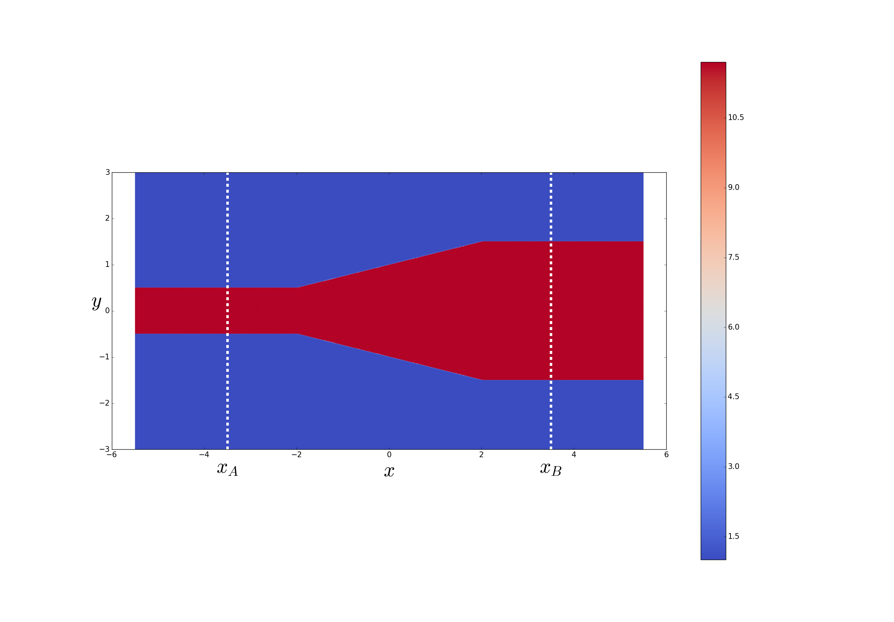
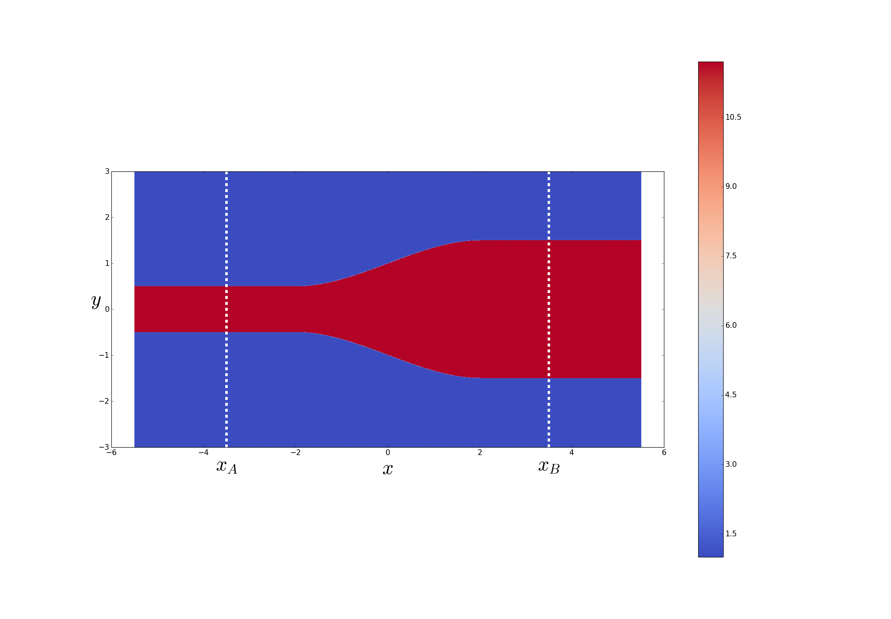
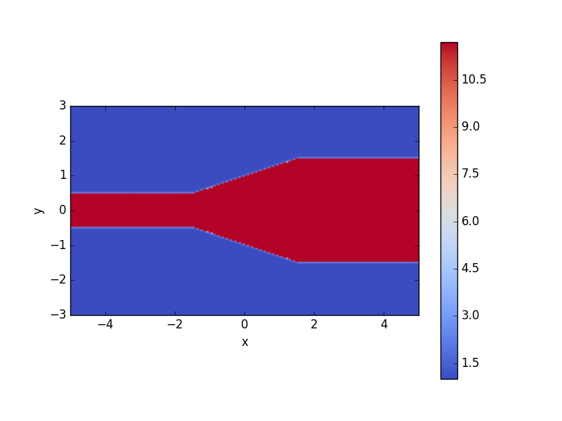
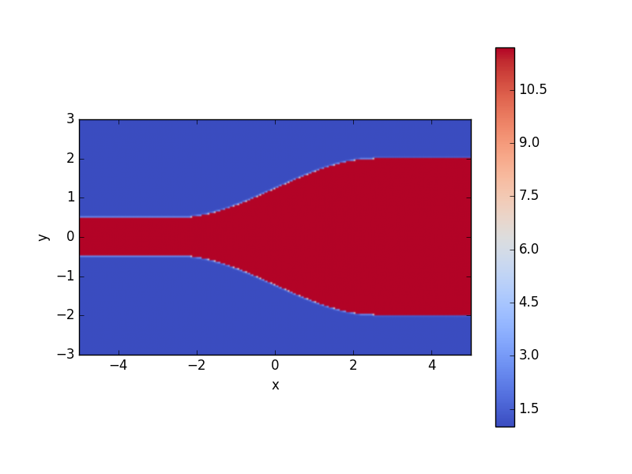
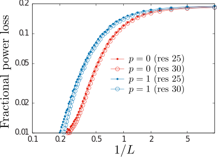

# Eigenmode decomposition of arbitrary field configurations

*Eigenmode decomposition* exploits MEEP's interconnectivity
with the [MPB][MPB] mode solver to express an arbitrary
time-harmonic field configuration as a superposition of
the normal harmonic modes of your structure.

[TOC]

## Theoretical background

Consider a waveguide structure of infinite extent in the $x$
direction with constant cross section in the transverse
$[\vec\rho=(y,z)]$ directions. For any given
angular frequency $\omega$ we may solve the time-harmonic
Maxwell equations to obtain the *normal modes* of the
structure---an infinite set of vector-valued
functions of the transverse coordinates
$\{\mathbf{E}^\pm_n(\vec{\rho}), \mathbf{H}^\pm_n(\vec{\rho})\}$,
with associated propagation constants $\{\beta_n\}$,
that furnish a complete expansion basis for
time-harmonic electromagnetic fields at frequency $\omega$.
That is, given any arbitrary frequency-$\omega$ field
configuration of the form
$$ \mathbf{E}(\mathbf{r},t) = \mathbf{E}(\mathbf{r}) e^{-i\omega t} $$
$$ \mathbf{H}(\mathbf{r},t) = \mathbf{H}(\mathbf{r}) e^{-i\omega t} $$
we have the *exact* expansions
$$
   \mathbf{E}(\mathbf{r}) = 
   \mathbf{E}(x,\vec{\rho}) =
   \sum_{n} \left\{   \alpha^+_n \mathbf E^+_n(\vec \rho)e^{+i\beta_n x}
                    + \alpha^-_n \mathbf E^-_n(\vec \rho)e^{-i\beta_n x}
            \right\}
    \qquad (1\textbf{a})
$$
$$
   \mathbf{H}(\mathbf{r}) = 
   \mathbf{H}(x,\vec{\rho}) =
   \sum_{n} \left\{   \alpha^+_n \mathbf H^+_n(\vec \rho)e^{+i\beta_n x}
                    + \alpha^-_n \mathbf H^-_n(\vec \rho)e^{-i\beta_n x}
            \right\}
    \qquad (1\textbf{b})
$$
where (as discussed further [below](ModeExpansion.md#UnderTheHood))
the expansion coefficients $\{\alpha^{\pm}_n\}$
may be extracted from knowledge of the time-harmonic
fields $\mathbf{E},\mathbf{H}$ on any cross-sectional
surface $S$ transverse to the waveguide.

The idea of mode expansion in MEEP is to compute
the $\{\alpha_n^\pm\}$ coefficients above for any
*arbitrary* time-harmonic field distribution 
resulting from a MEEP calculation. In calculations
of this sort,

+  the $\{\mathbf{E},\mathbf{H}\}$ fields on the RHS
    of equations (1a,b) above will be frequency-domain
    fields stored in a `dft_flux` object in a MEEP
    run, where you will have arranged this `dft_flux` object
    to live on a cross-sectional surface $S$ transverse
    to the waveguide;

-  the $\{\mathbf{E}^\pm_n,\mathbf{H}^\pm_n\}$ eigenmodes
    and $\{\beta_n\}$ propagation constants are computed
    automatically under the hood by [MPB][MPB] as normal modes 
    of an infinitely extended waveguide with the same 
    cross-sectional material distribution that your structure
    has on the transverse slice $S$, and

-  the $\alpha_n^\pm$ coefficients for as many bands 
   as you like are computed by calling `get_eigenmode_coefficients(),`
   as discussed below.

## C++ function prototype

The basic routine here is

```c++
std::vector<cdouble>
 fields::get_eigenmode_coefficients(dft_flux *flux,
                                    direction d,
                                    const volume &where,
                                    std::vector<int> bands,
                                    kpoint_func k_func=0,
                                    void *user_data=0);
```
where

+ `flux` is a `dft_flux` object pre-populated with frequency-domain field data resulting from a time-domain MEEP calculation you have run to tabulate fields on a cross-sectional slice perpendicular to your waveguide

+ `d` is the direction of power flow in the waveguide

+ `where` is a `volume` describing the cross-sectional surface $S$

+ `bands` is an array of integers that you populate with the indices of the modes for which you want expansion coefficients

+ `user_func` is an *optional* function you supply to provide initial estimates of the wavevector of a mode with given
frequency and band index; its prototype is

```c++
 vec (*kpoint_func)(void user_data, double freq, int band);
```

which returns a `vec` giving your best guess for the
wavevector of the `band`th mode at frequency `freq`.

The return value of `get_mode_coefficients` is an array
of type `cdouble` (short for `std::complex<double>`),
of length `num_freqs * num_bands`, where `num_freqs`
is the number of frequencies stored in your `flux` object
(equal to `flux->Nfreq`) and `num_bands` is the length
of your `bands` input array. 
The expansion coefficient for the mode with frequency `nf`
and band index `nb` is stored in the `nb*num_freqs + nf`
slot of this array.

## Sample application: tapering between waveguides

As a demonstration of mode expansion, we'll consider
the problem of *tapering* between waveguides of
different sizes. More specifically, we'll suppose
we have incoming power, carried by a single
mode (typically the fundamental mode) of a first waveguide
(waveguide A)
that we wish to route into a single mode (typically the
same mode) of a second, larger, waveguide (waveguide B),
losing as little power as possible to reflections or
inter-mode scattering in the process.
Simply jamming the ends of the two waveguides together
will result in significant losses due to the abrupt "impedance" mismatch
at the interface, so instead we will consider gradually
morphing ("tapering") the waveguide cross section
from that of waveguide A to that of waveguide B
over a finite length *L*---with a taper profile
of smoothness index $p$---and study the
dependence of the mode-to-mode power transfer on $L$ and $p$.

The calculations described below are implemented by a
python code called [`wvg-taper.py`](ModeExpansionFiles/wvg-taper.py),
which we will dissect as we proceed through the example.
A C++ version of the same calculation is
[`wvg-taper.cpp`](ModeExpansionFiles/wvg-taper.cpp).

### First calculation: 2D geometry

As a first example of relatively modest computational
cost, we'll consider a 2D ($z$-invariant) problem
in which the smaller and larger waveguides are simply
finite-thickness slabs of dielectric material suspended
in vacuum.
More specifically, power travels in the *x* direction
with the fields confined by the dielectric
in the *y* direction; the smaller and larger
waveguides have thicknesses $h_A$ and $h_B\ge h_A$ and are
connected by a taper region of length $L$, so the
slab thickness as a function of $x$ reads
<a name="Equation1"></a>
$$ h(x) =
   \begin{cases} 
     h_A,    \qquad &x < -\frac{L}{2} \\[5pt]
     T_p(x), \qquad &x \in \left[ -\frac{L}{2}, +\frac{L}{2}\right] \\[5pt]
     h_B,    \qquad &x > +\frac{L}{2} \\
   \end{cases}
   \tag{1}
$$
where the taper function $T_p(x)$ is a $C^{p}$ function,
i.e. $p$ is the index of its first discontinuous derivative.
For the cases $p=0$ (simple linear taper) and $p=1$,
the taper functions are
$$ T_p(x)=\begin{cases}
   h_0 + \Delta \left(\frac{x}{L}\right), \qquad &p=0 \\[5pt]
   h_0 + \Delta \Big[ \frac{3}{2}\left(\frac{x}{L}\right)
                       -2\left(\frac{x}{L}\right)^3
                 \Big],\qquad&p=1
   \end{cases}
$$
where
$$ h_0\equiv \frac{h_A+h_B}{2}, \qquad \Delta = h_B - h_A$$
are the average and difference of the smaller and larger waveguide
thicknesses.

Here are cartoons of the $p=0$ and $p=1$ taper geometries:

<p align="center"> <b><i>p</i>=0 Taper</b></p>



<p align="center"> <b><i>p</i>=1 Taper</b> </p>



### Defining material functions

Because the material geometries we will be studying here
are too complicated to be described as assemblies of
the [usual geometric primitives like blocks and cylinders](Python_User_Interface.md#GeometricObject),
we will instead write our own [user-defined material function](Python_User_Interface.md#material_function), which inputs the coordinates of a point in space
and fills in a [medium structure](Python_User_Interface.md#medium) 
for the material properties at that point.
Actually, since the material geometry in this case involves a
spatially-varying but otherwise simple (isotropic, linear, lossless)
dielectric function, we can get away with the slightly simpler
[user-defined epsilon function](Python_User_Interface.md#epsilon_function),
for which we need only furnish a function of position that
returns a scalar relative permittivity. This is implemented
by the `my_eps_func()` routine in `wvg-taper.py;` note that
it invokes a subroutine `h_func` that evaluates [equation (1) above](ModeExpansion.md#Equation1) to compute the $x$-dependent waveguide width $h(x)$.

```python
##################################################
# x-dependent width of waveguide
##################################################
def h_func(x, L, p, hA, hB):
  x0=x/L
  if (x0 < -0.5):
    return hA;
  if (x0 > +0.5):
    return hB;
  if (p==0):
    return 0.5*(hA+hB) + (hB-hA)*x0;
  else: # if (p==1):
    return 0.5*(hA+hB) + (hB-hA)*x0*(1.5 - 2.0*x0*x0);

##################################################
# user-defined function for position-dependent material properties
##################################################
def my_eps_func(loc, L, p, hA, hB, eps_out, eps_in):

    if ( abs(loc.y) > 0.5*h_func(loc.x, L, p, hA, hB) ):
     return eps_out;    # outside waveguide
    else:
     return eps_in;     # inside waveguide
```

We can pass `my_eps_func` as the value of the
`epsilon_func` keyword argument to the
[`Simulation` class constructor](Python_User_Interface.md#SimulationClass);
however, because this expects a function of just a single
argument (the spatial point), we use a `lambda` construction
to package the remaining arguments, i.e. something like

```python
eps_func = lambda loc: my_eps_func(loc, L, p, hA, hB,
                                   eps_ambient, eps_waveguide)
                                          
sim=mp.Simulation( cell_size=mp.Vector3(2*LX, 2*LY),
                   resolution=resolution,
                   boundary_layers=[mp.PML(DPML)],
                   epsilon_func = eps_func
                 )
```

The [`wvg-taper.py`](ModeExpansionFiles/wvg-taper.py) code defines
a class called `wvg-taper` that accepts keyword arguments for
various geometric parameters and instantiates a `Simulation` object
as in the code snippet above. For example, here are
a couple of examples involving waveguides and tapers of
various geometries:

```python
>>> execfile("wvg-taper.py");
>>> wt=wvg_taper(hA=1, hB=3, L=3, p=0);
Initializing structure...
...
time for set_epsilon = 0.242381 s
>>> wt.plot_eps();
```




```python
>>> wt=wvg_taper(hA=1, hB=4, L=5, p=1);
Initializing structure...
...
time for set_epsilon = 0.242381 s
>>> wt.plot_eps();
```



Incidentally, the `plot_eps()` class method that produces these plots
just calls [`Simulation.get_array`](Python_User_Interface.md)
to get a `numpy` array of &epsilon; values at the grid 
points, then plots it using the `imshow` routine in
matplotlib:

```python
    def plot_eps(self):

     eps=self.sim.get_array(center    = mp.Vector3(0,0),
                            size      = self.sim.cell_size,
                            component = mp.Dielectric)
     plt.figure()
     plt.imshow(eps.transpose())
     plt.show(block=False)
```
 
### Visualizing eigenmode profiles

Next, before doing any timestepping let's take
a look at the field profiles of some waveguide modes,
for both the smaller and larger waveguides.
For this purpose we'll use the `get_eigenmode()`
routine to solve for individual eigenmodes, then
call `output_mode_fields()` to write the eigenmode field
patterns to HDF5 files, after which we can make plots
in matplotlib. This is done in the `plot_modes`
method of the `wvg_taper` class:

**Insert python code and mode diagrams here**

### Adding an eigenmode source and timestepping

The next step is to add an eigenmode source inside the
smaller waveguide (i.e. a collection of MEEP point sources
on a cross-sectional surface whose radiated fields
reproduce the fields of a waveguide eigenmode carrying
power in the positive X direction), then
timestep to accumulate Fourier-domain fields
on a cross-sectional plane within the larger waveguide.
This entire procedure is carried out by the `get_flux()`
method in the `wvg_taper` class, which accepts some
optional arguments to fine-tune the source configuration
you want.

````python
    ##################################################
    # add an eigenmode-source excitation for the #band_numth mode
    # of the smaller waveguide, then timestep to accumulate DFT
    # flux in the larger waveguide.
    # if frame_interval>0, a movie is created showing
    # the fields on the xy plane with one frame
    # every frame_interval time units (in meep time)
    ##################################################
    def get_flux(self, fcen=0.15, df=0.075, nfreq=1, band_num=1,
                 frame_interval=0):
       
       #--------------------------------------------------
       # add eigenmode source at midpoint of smaller waveguide
       #--------------------------------------------------
       f=self.sim.fields;
       res=1.0*self.sim.resolution;
       LX=0.5*self.sim.cell_size.x;
       LY=0.5*self.sim.cell_size.y;
       xA=-0.5*LX;
       xB=+0.5*LX;
       vA=mp.volume( mp.vec(xA, -LY), mp.vec(xA,+LY) )
       vB=mp.volume( mp.vec(xB, -LY), mp.vec(xB,+LY) )
       vC=mp.volume( mp.vec(-LX, -LY), mp.vec(LX,LY) )
       src=mp.GaussianSource(fcen, fwidth=df);
       kpoint=mp.vec(0.426302,0);
       parity=0;
       match_frequency=True;
       tol=1.0e-4;
       amp=1.0;
       f.add_eigenmode_source(mp.Dielectric, src, mp.X, vA, vA, 
                              band_num, kpoint, match_frequency,
                              parity, res, tol, amp);

       #--------------------------------------------------
       # add DFT flux region at midpoint of larger waveguide
       #--------------------------------------------------
       fluxB=f.add_dft_flux_plane(vB, fcen-0.5*df, fcen+0.5*df, nfreq);

       #--------------------------------------------------
       # for DFT flux region for moviemaking if requested
       #--------------------------------------------------
       fluxC=0
       if frame_interval>0:
         fluxC=f.add_dft_flux_plane(vC, fcen-0.5*df, fcen+0.5*df, nfreq);

       #--------------------------------------------------
       # timestep until Poynting flux through larger waveguide has 
       # decayed to 0.1% its max value
       #--------------------------------------------------
       pvInterval=1.0; # check PV decay every 1.0 meep time units
       nextPVTime=f.round_time() + pvInterval;
       nextFrameTime=f.round_time();
       MaxPV=0.0;
       Stop=False;
       while Stop==False:

         f.step();

         # check for poynting-flux decay at regular intervals
         FieldsDecayed=False;
         if f.round_time() > nextPVTime:
             nextPVTime += pvInterval;
             ThisPV=f.flux_in_box(mp.X,vB)
             if (ThisPV > MaxPV):
                MaxPV = ThisPV;
             elif (ThisPV < 0.001*MaxPV):
                FieldsDecayed=True;

         # output movie frames at regular intervals if requested
         # TODO implement me

         SourcesFinished = f.round_time() > f.last_source_time();
         Stop = (SourcesFinished and FieldsDecayed);
         
       print("finished timestepping at {}".format(f.round_time()))
       return fluxB
````

The return value of `get_flux()` is a `flux` object
that may be postprocessed to yield visualization
files and/or extract eigenmode expansion coefficients.

### Visualizing DFT fields

### Extracting mode-expansion coefficients

Finally, we call `get_mode_coefficients` to compute
the inner product of the MEEP DFT fields in the larger waveguide 
with each of a user-specified list of eigenmodes of the larger 
waveguide to compute the fraction of the power carried by
each mode.

**Insert python code here**

### Intra-modal scattering losses vs. taper length and smoothness

Repeating this calculation for many taper lengths $L$ and 
smoothness indices $p=0,1$ yields the following plots
showing the rate of decay of inter-mode scattering losses
as the taper length $L\to\infty.$



## Second calculation: Silicon-on-insulator strip waveguide (3D geometry)

Next we consider a setup similar to the one we 
just studied, but now involving a 3D geometry---a taper
between *strip waveguides* defined by patterned silicon
strips atop an oxide layer. The geometry is almost identical
to that considered in [this MPB calculation](http://www.simpetuscloud.com/projects.html#mpb_waveguide),
but with the distinction that the width $w$ of the silicon strip
is no longer constant, but varies from a smaller to a larger 
width via a length-$L$ taper just as in the 2D calculation we considered
above.

**FINISH THIS SECTION**

<a name="UnderTheHood"></a>
## Under the hood: How mode expansion works

The theoretical basis of the mode-expansion algorithm
is the orthogonality relation satisfied by the normal
modes:
$$ \left\langle \mathbf{E}_m^{\sigma} \right|
   \left.       \mathbf{H}^\tau_n     \right\rangle
   =C_{m}\delta_{mn}\delta_{\sigma\tau} 
   \qquad \Big( \{\sigma,\tau\}\in\{+,-\}\Big)
$$
where the inner product involves an integration over
transverse coordinates:
<a name="OverlapEquation"></a>
$$ \left\langle \mathbf{f} \right| \left. \mathbf{g} \right\rangle 
   \equiv
   \int_{S} 
    \Big[ \mathbf{f}^*(\vec \rho) \times \mathbf{g}(\vec \rho)\Big]
    \cdot \hat{\mathbf{n}} \, dA
  \qquad (*)
$$
where $S$ is any surface transverse to the direction of propagation
and $\hat{\mathbf{n}}$ is the unit normal vector to $S$ (i.e.
just $\hat{\mathbf{z}}$ in the case considered above).

**FINISH THIS SECTION**

<a name="Other routines"></a>
## Related computational routines

Besides `get_eigenmode_coefficients,` there are a few
computational routines in `libmeep` that you may find useful
for problems like those considered above.

### Routine for computing MPB eigenmodes (in `mpb.cpp`)
````
  void *fields::get_eigenmode(double &omega,
                              direction d, const volume &where,
                              const volume &eig_vol,
                              int band_num,
                              const vec &kpoint, bool match_frequency,
                              int parity,
                              double resolution,
                              double eigensolver_tol);
````

Calls MPB to compute the `band_num`th eigenmode at frequency `omega`
for the portion of your geometry lying in `where` (typically
a cross-sectional slice of a waveguide). `kpoint` is an initial
starting guess for what the propagation vector of the waveguide
mode will be.

### Routines for working with MPB eigenmodes (in `mpb.cpp`)

The return value of `get_eigenmode` is an opaque pointer to
a data structure storing information about the computed eigenmode,
which may be passed to the following routines:

````
// get a single component of the eigenmode field at a given point in space
std::complex<double> eigenmode_amplitude(const vec &p, void *vedata, component c);

// get the group velocity of the eigenmode 
double get_group_velocity(void *vedata);

// free all memory associated with the eigenmode
void destroy_eigenmode_data(void *vedata);
````

### Routines for exporting frequency-domain fields (in `dft.cpp`)

````
  void output_flux_fields(dft_flux *flux, const volume where,
                          const char *HDF5FileName);

  void output_mode_fields(void *mode_data, dft_flux *flux,
                          const volume where, 
                          const char *HDF5FileName);
````

`output_flux_fields` exports the components of the (frequency-domain) fields
stored in `flux` to an HDF5 file with the given file name. `where` is the
`volume` passed to the `flux` constructor. In general, `flux` will store
data for fields at multiple frequencies, each of which will

`output_mode_fields` is similar, but instead exports the components of the eigenmode
described by `mode_data` (which should be the return value of a call to `get_eigenmode`).

### Routines for computing overlap integrals (in `dft.cpp`)

````
  std::complex<double> get_mode_flux_overlap(void *mode_data, 
                                             dft_flux *flux, 
                                             int num_freq, 
                                             const volume where);

  std::complex<double> get_mode_mode_overlap(void *mode1_data,
                                             void *mode2_data,
                                             dft_flux *flux,
                                             const volume where);
````

`get_mode_flux_overlap` computes the overlap integral
(defined by [equation (*) above](#OverlapEquation))
between the eigenmode described by `mode_data`
and the fields stored in `flux` (for the `num_freq`th stored
frequency, where `num_freq` ranges from 0 to `flux->Nfreq-1`.)
`mode_data` should be the return value of a previous call to 
`get_eigenmode.`

`get_mode_mode_overlap` is similar, but computes the overlap
integral between two eigenmodes. (`mode1_data` and `mode2_data` may be
identical, in which case you get the inner product of the 
mode with itself; by the normalization convention used in MPB,
this should equal the group velocity of the mode.)

[MPB]:	   https://mpb.readthedocs.io/en/latest/
[DFTFlux]: https://meep.readthedocs.io/en/latest/Scheme_User_Interface/#Flux_spectra.md
