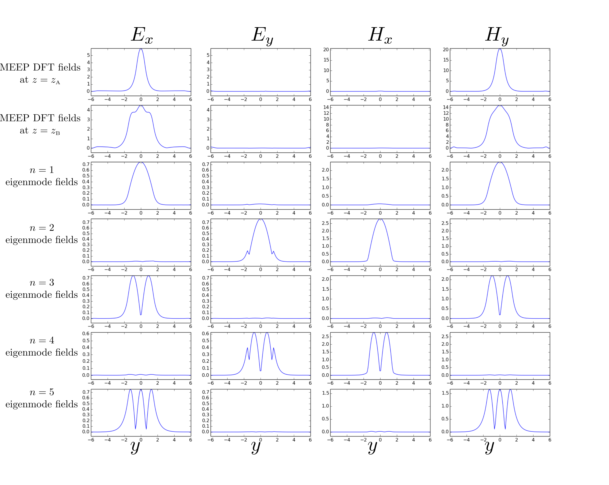
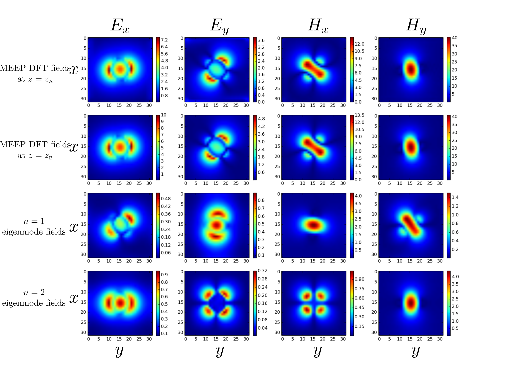

# Eigenmode decomposition of arbitrary field configurations

*Eigenmode decomposition* exploits MEEP's interconnectivity
with the [MPB][MPB] mode solver to represent an arbitrary
time-harmonic field configuration as a superposition of 
the normal harmonic modes of your structure.

## Theoretical background

Consider a waveguide structure of infinite extent in the $z$
direction with constant cross section in the transverse
$[\vec\rho=(x,y)]$ directions. For any given
angular frequency $\omega$ we may solve the time-harmonic
Maxwell equations to obtain the *normal modes* of the
structure---an infinite set of vector-valued
functions of the transverse coordinates
$\{\mathbf{E}^\pm_n(\vec{\rho}), \mathbf{H}^\pm_n(\vec{\rho})\}$,
with associated propagation constants $\{\beta_n\}$,
that furnish a complete expansion basis for
time-harmonic electromagnetic fields at frequency $\omega$.
That is, given any arbitrary frequency-$\omega$ field
configuration of the form
$$ \mathbf{E}(\mathbf{x},t) = \mathbf{E}(\mathbf{x}) e^{-i\omega t} $$
$$ \mathbf{H}(\mathbf{x},t) = \mathbf{H}(\mathbf{x}) e^{-i\omega t} $$
we have the *exact* expansions
$$
   \mathbf{E}(\mathbf{x}) = 
   \mathbf{E}(\vec{\rho},z) =
   \sum_{n} \left\{   \alpha^+_n \mathbf E^+_n(\vec \rho)e^{+i\beta_n z}
                    + \alpha^-_n \mathbf E^-_n(\vec \rho)e^{-i\beta_n z}
            \right\}
    \qquad (1\textbf{a})
$$
$$
   \mathbf{H}(\mathbf{x}) = 
   \mathbf{H}(\vec{\rho},z) =
   \sum_{n} \left\{   \alpha^+_n \mathbf H^+_n(\vec \rho)e^{+i\beta_n z}
                    + \alpha^-_n \mathbf H^-_n(\vec \rho)e^{-i\beta_n z}
            \right\}
    \qquad (1\textbf{b})
$$
where (as discussed further [below](ModeExpansion.md#UnderTheHood))
the expansion coefficients $\{\alpha^{\pm}_n\}$
may be extracted from knowledge of the time-harmonic
fields $\mathbf{E},\mathbf{H}$ on any cross-sectional
surface $S$ transverse to the waveguide.

The idea of mode expansion in MEEP is to compute
the $\{\alpha_n^\pm\}$ coefficients above for any
*arbitrary* time-harmonic field distribution 
resulting from a MEEP calculation. In calculations
of this sort,

+   the $\{\mathbf{E},\mathbf{H}\}$ fields on the RHS
    of equations (1a,b) above will be frequency-domain
    fields stored in a `dft_flux` object in a MEEP
    run, where you will have arranged this `dft_flux` object
    to live on a cross-sectional surface $S$ transverse
    to the waveguide;

+   the $\{\mathbf{E}^\pm_n,\mathbf{H}^\pm_n\}$ eigenmodes
    and $\{\beta_n\}$ propagation constants are computed
    automatically under the hood by MPB as normal modes 
    of an infinitely extended waveguide with the same 
    cross-sectional material distribution that your structure
    has on the transverse slice $S$, and

+   the $\alpha_n^\pm$ coefficients for as many bands 
    as you like are computed by calling `get_eigenmode_coefficients(),`
    as discussed below.

## C++ function prototype

The basic routine here is

```c++
std::vector<cdouble>
 fields::get_eigenmode_coefficients(dft_flux *flux,
                                    direction d,
                                    const volume &where,
                                    std::vector<int> bands,
                                    kpoint_func k_func=0,
                                    void *user_data=0);
```
where

+ `flux` is a `dft_flux` object pre-populated with frequency-domain field data resulting from a time-domain MEEP calculation you have run to tabulate fields on a cross-sectional slice perpendicular to your waveguide

+ `d` is the direction of power flow in the waveguide

+ `where` is a `volume` describing the cross-sectional surface $S$

+ `bands` is an array of integers that you populate with the indices of the modes for which you want expansion coefficients

+ `user_func` is an *optional* function you supply to provide initial estimates of the wavevector of a mode with given frequency and band index; if nonzero, it should be a function pointer to a function of prototype

```
 vec (*kpoint_func)(void user_data, double freq, int band);
```

which returns a `vec` giving your best guess for the
wavevector of the `band`th mode at frequency `freq`. 

The return value of `get_mode_coefficients` is an array
of type `cdouble` (short for `std::complex<double>`),
of length `2*num_freqs * num_bands`, where `num_freqs`
is the number of frequencies stored in your `flux` object
(equal to `flux->Nfreq`) and `num_bands` is the length
of your `bands` input array. 
The expansion coefficients $\alpha_n^\pm$
for the mode with frequency `nf`
and band index `nb` are stored sequentially
in this array starting at index `2*nb*num_freq+2*nf;`

````c++
  meep::fields f; 
  ...
  std::vector<cdouble> coeffs = f.get_eigenmode_coefficients(...) 
  ...

  // extract coefficients for mode #nb, frequency #nf
  cdouble alphaPlus  = coeffs[ 2*nb*num_freqs + 2*nf + 0];
  cdouble alphaMinus = coeffs[ 2*nb*num_freqs + 2*nf + 1];
````

## First example: Junction of planar waveguides

As a simple first problem, we'll consider
a 2D problem involving an impedance mismatch
between two planar waveguides, as cartooned in
this figure:


In this case the geometry is invariant in the $x$
direction and the waveguides are simply planar
slabs, of finite thickness in the $y$ direction,
with the flow of power in the $z$ direction.
The waveguide in region $z<0$ has thickness $h_1$,
while that for $z>0$ has thickness $h_2\le h_1$; we place
a source inside the smaller waveguide and observe the
imperfect channeling of power flow into the large
waveguide due to the ``impedance'' mismatch at
$z=0$. 

More specifically, in our meep calculation we will place
an [eigenmode source](Python_User_Interface.md#EigenmodeSource)
on a cross-sectional
plane at $z=z_{A}$ to simulate an incoming wave arriving 
in one of the natural guided modes of the smaller waveguide,
then ask for the frequency-domain fields
on a cross-sectional plane at $z=z_{B}$
by placing a [flux region](Python_User_Interface.md#FluxRegions) there.

The code for this problem is [`libmeepgeom/planar-junction.cpp`](planar-junction.cpp),
packaged with the MEEP source distribution.
$z=0$.
This code offers (among other options) a command-line option `--ratio`
that sets the ratio $h_2/h_1$ of the waveguide thicknesses; the default
value is `--ratio 2` (bigger slab is 2$\times$ thickness
of smaller slab), while for `--ratio 1` the two waveguides
are in fact identical and there should be no power
reflected at $z=0$.

### Warmup sanity check: Constant-cross-section waveguide 

As a warmup, let's first ask what happens for `--ratio 1,`
i.e. when the waveguide for $z>0$ is identical to that
for $z<0$, so we expect no power reflection.$
We'll do a MEEP simulation with sources placed at $z=z_{A}$
to reproduce the lowest $(n=1)$ eigenmode of the smaller
waveguide, then look at the Fourier-transformed
fields at $z=z_{B}$.

#### Fourier-domain results

The following plot shows **(a)** the (frequency-domain,
i.e. Fourier-transformed) tangential fields
at $z=z_{A}$ (top), **(b)** the tangential fields 
at $z=z_{B}$ (second from top), and then **(c)** the
tangential-field distributions of the first 5
eigenmodes (lower 4 rows).
[(Click here for larger image.)](modeExpansionFiles/pj1fields.png)


As expected, the mode profiles at $z=z_A$ and $z=z_B$
are identical to each other and look like the $n=1$ eigenmode
fields.

Note: These images were produced by [this julia script](modeExpansionFiles/pj.jl)
after running `planar-junction`
with the command-line options `--ratio 1 --plot-flux --plot-modes;`
this makes use of the `output_flux_fields()` and `output_mode_fields()`
to write flux and mode data to HDF5 files
[see below for more details](#OtherRoutines).

#### Time-domain results

To get another look at what's going on,
here's a [movie](modeExpansionFiles/r1hz.mp4)
showing the time evolution of the $H_z$ component
of the $H$ field, imaged on a portion of the $yz$ plane.

<video width="800" height="600" controls>
  <source src="modeExpansionFiles/r1hz.mp4" type="video/mp4">
   Your browser does not support the video tag.
</video>

Note: These images were produced by [this julia script](modeExpansionFiles/makeMovie.jl)

#### Mode-expansion coefficients

Here are the mode-expansion coefficients for the first 8
modes as computed by `get_eigenmode_coefficients().`

<span>
<p align="center">
<table border="1"> 
<tr> <th> Mode </th> <th> |&alpha;| </th> <th> re, im &alpha; </th> <th> % total</th> </tr>
<tr><td>1</td><td>2.590+02 </td> <td> {-2.266+02,+1.255+02}</td> <td>(9.999e-01 %)</td> </tr>
<tr><td>2</td><td>1.022</td> <td>{+3.163-01,-9.726-01}</td> <td> (3.947e-03 %)</td> </tr>
<tr><td>3</td><td>2.180-01 </td> <td>{-1.984-01,-9.029-02}</td> <td> (8.416e-04 %)</td> </tr>
<tr><td>4</td><td>2.281-01 </td> <td>{-2.176-01,-6.844-02}</td> <td> (8.805e-04 %)</td> </tr>
<tr><td>5</td><td>6.353-02 </td> <td>{-5.726-02,+2.750-02}</td> <td> (2.452e-04 %)</td> </tr>
<tr><td>6</td><td>1.390-01 </td> <td>{+2.478-02,+1.367-01}</td> <td> (5.364e-04 %)</td> </tr>
<tr><td>7</td><td>4.064-01 </td> <td>{-7.381-02,-3.997-01}</td> <td> (1.568e-03 %)</td> </tr>
<tr> <td>8</td> <td>5.117-02 </td> <td>{-1.142-02,+4.988-02}</td> <td> (1.97e-04 %)</td> </tr>
</table>
</span>

Notice that mode 1 accounts for 99.99% of the power carried by the MEEP DFT fields.

### Non-constant cross-section

Next let's do the run again with `--ratio 3`, so that the 
waveguide for $z>0$ is 3x larger than the incoming waveguide.

#### Fourier-domain results

This yields the following version of the above plot
[(click here for larger image)](modeExpansionFiles/pj3fields.png):



Now the fields at $z_B$ do not agree with the fields
at $z_A$, nor are they simply a scaled version
of the $n=1$ eigenmode; instead, they are linear combination
of several eigenmodes, with coefficients that can be 
computed by calling `get_eigenmode_coefficients().`

#### Time-domain results

[Here's the version of the movie shown above](modeExpansionFiles/r3hz.mp4)
for the case of `--ratio=3`:

<video width="800" height="600" controls>
  <source src="modeExpansionFiles/r3hz.mp4" type="video/mp4">
   Your browser does not support the video tag.
</video>

#### Mode-expansion coefficients

And here are the results of mode expansion for this case.

<span>
<p align="center">
<table border="1">
<tr>
 <th> Mode </th>
 <th> |&alpha;| </th>
 <th> re, im &alpha; </th>
 <th> % total</th>
</tr>
<tr><td>0</td><td> 2.344e+02 </td><td>{-3.529e+01,-2.317e+02}</td><td> (8.969e-01 %)</td></tr>
<tr><td>1</td><td> 7.671e-01 </td><td>{-3.302e-01,-6.923e-01}</td><td> (2.935e-03 %)</td></tr>
<tr><td>2</td><td> 8.809e-01 </td><td>{+8.686e-01,-1.464e-01}</td><td> (3.370e-03 %)</td></tr>
<tr><td>3</td><td> 8.794e-01 </td><td>{-1.092e-01,-8.725e-01}</td><td> (3.365e-03 %)</td></tr>
<tr><td>4</td><td> 1.155e+02 </td><td>{-1.550e+01,+1.144e+02}</td><td> (4.420e-01 %)</td></tr>
<tr><td>5</td><td> 2.623e-01 </td><td>{-1.719e-01,+1.980e-01}</td><td> (1.003e-03 %)</td></tr>
<tr><td>6</td><td> 1.013e+00 </td><td>{-6.806e-01,+7.496e-01}</td><td> (3.874e-03 %)</td></tr>
<tr><td>7</td><td> 1.940e+00 </td><td>{-1.890e+00,+4.358e-01}</td><td> (7.423e-03 %)</td></tr>
</table>
</span>

Now mode 1 accounts for only 89.69% of the power carried by the MEEP DFT fields,
with mode 5 now accounting for a significant share.

## Second example: Junction of cylindrical fibers

Next we consider a geometry similar to the one we
just studied, but now involving a junction of *cylindrical*
waveguides. This is similar to what we considered above,
but now with the waveguide having finite extent
in both transverse directions, as depicted in the following
cartoon:


The code for this problem is [`libmeepgeom/fiber-junction.cpp`](fiber-junction.cpp),
packaged with the MEEP source distribution.

Again the code offers a command-line option `--ratio` that sets the
ratio $R_2/R_1$ of the waveguide radii; for `--ratio 1` we expect
perfect transmission of power.

In addition, this code offers command-line options `--taper-length`
and `--taper-power` that you may use to establish a finite-length
*taper* between the incoming and outgoing waveguides with
power-law scaling determined by `--taper-power` (the default is 
`--taper-power 1` for a linear taper, while `--taper-power 2` 
gives a quadratic taper, etc.).

The default is `--taper-length 0,` in which case the smaller and 
larger waveguides are butt-coupled as in the 2D example above.

Here are examples of the material geometry obtained
for various values of the parameters: 

+`--taper-length 0`


+`--taper-length 6 --taper-power 1`


+`--taper-length 6 --taper-power 2`


Here's a 3D view of the previous case, produced using
[this Julia script](modeExpansionFiles/PlotEps.jl):


#### Fourier-domain results

Here's the version of the above Fourier-domain plots for 
`--ratio 1,`
showing the Fourier-transformed MEEP fields at $z=z_A$ and $z=z_B$
together with the first few eigenmodes of the waveguide.
[(Click here for larger image.)](modeExpansionFiles/fj1fields.png)



Here's the version of the above Fourier-domain plots for 
`--ratio 3.`
[(Click here for larger image.)](modeExpansionFiles/fj3fields.png)


These images were produced by [this julia script](fj.jl)
using HDF5 files produced by the `libmeep` routines
`output_flux_fields()` and `output_mode_fields()`;
[see below for more details](#OtherRoutines).

## Finite-length taper between cylindrical waveguides

## Under the hood: How mode expansion works

The theoretical basis of the mode-expansion algorithm
is the orthogonality relation satisfied by the normal
modes 
$$ \left\langle \mathbf{E}_m^{\sigma} \right|
   \left.       \mathbf{H}^\tau_n     \right\rangle
   =C_{m}\delta_{mn}\delta_{\sigma\tau} 
   \qquad \Big( \{\sigma,\tau\}\in\{+,-\}\Big)
$$
where the inner product involves an integration over
transverse coordinates:
$$ \left\langle \mathbf{f} \right| \left. \mathbf{g} \right\rangle 
   \equiv
   \int_{S} 
    \Big[ \mathbf{f}^*(\vec \rho) \times \mathbf{g}(\vec \rho)\Big]
    \cdot \hat{\mathbf{n}} \, dA
$$
where $S$ is any surface transverse to the direction of propagation
and $\hat{\mathbf{n}}$ is the unit normal vector to $S$ (i.e.
just $\hat{\mathbf{z}}$ in the case considered above).

To use these results to extract the $\alpha_n^\pm$ coefficients
from equation (1), we first invoke the following relations
between the tangential portions of the forward- and backward-traveling
eigenmode fields:
$$ \mathbf{E}^+_{n\parallel} = \mathbf{E}^-_{n\parallel},
   \qquad
   \mathbf{H}^+_{n\parallel} = -\mathbf{H}^-_{n\parallel}
$$

**COMPLETE THIS SECTION**

<a name="OtherRoutines"></a>
## Related computational routines

Besides `get_eigenmode_coefficients,` there are a few
computational routines in `libmeep` that you may find useful
for problems like those considered above.

### Routine for working with MPB eigenmodes (in `mpb.cpp`)
````
  void *fields::get_eigenmode(double &omega,
                              direction d, const volume &where,
                              const volume &eig_vol,
                              int band_num,
                              const vec &kpoint, bool match_frequency,
                              int parity,
                              double resolution,
                              double eigensolver_tol);
````

Calls MPB to compute the `band_num`th eigenmode at frequency `omega`
for the portion of your geometry lying in `where` (typically
a cross-sectional slice of a waveguide). `kpoint` is an initial
starting guess for what the propagation vector of the waveguide
mode will be.

The return value of `get_eigenmode` is an opaque pointer to
a data structure storing information about the computed eigenmode,
which may be passed to the following routines:

````
// get a single component of the eigenmode field at a given point in space
std::complex<double> eigenmode_amplitude(void *vedata, const vec &p, component c);

// get the group velocity of the eigenmode 
double get_group_velocity(void *vedata);

// get the wavevector of the eigenmode
vec get_k(void *vedata);

// free all memory associated with the eigenmode
void destroy_eigenmode_data(void *vedata);
````

### Routines for exporting frequency-domain fields (in `dft.cpp`)

````
  void output_flux_fields(dft_flux *flux, const volume where,
                          const char *HDF5FileName);

  void output_mode_fields(void *mode_data, dft_flux *flux,
                          const volume where, 
                          const char *HDF5FileName);
````

`output_flux_fields` exports the components of the (frequency-domain) fields
stored in `flux` to an HDF5 file with the given file name. `where` is the
`volume` passed to the `flux` constructor. In general, `flux` will store
data for fields at multiple frequencies, each of which will

`output_mode_fields` is similar, but instead exports the components of the eigenmode
described by `mode_data` (which should be the return value of a call to `get_eigenmode`).

### Routines for computing overlap integrals (in `dft.cpp`)

````
  void get_mode_flux_overlap(void *mode_data, dft_flux *flux, int num_freq,
                             const volume where, cdouble integrals[2]);

  void get_mode_mode_overlap(void *mode1_data, void *mode2_data,
                             dft_flux *flux, const volume where,
                             cdouble integrals[2]);
````

`get_mode_flux_overlap` computes the overlap integrals
(defined by [equation (*) above](#OverlapEquation))
between the eigenmode described by `mode_data`
and the fields stored in `flux` (for the `num_freq`th stored
frequency, where `num_freq` ranges from 0 to `flux->Nfreq-1`.)
`mode_data` should be the return value of a previous call to 
`get_eigenmode.`

`get_mode_mode_overlap` is similar, but computes the overlap
integrals between two eigenmodes. (`mode1_data` and `mode2_data` may be
identical, in which case you get the inner product of the 
mode with itself; by the normalization convention used in MPB,
this should equal the group velocity of the mode.)

In both cases, on return the `integrals` vector contains the
two overlap integrals:
$$ \texttt{integrals[0]} 
    = \int_{S}
    \Big[ \mathbf{E}_1^* \times \mathbf{H}_2\Big]
    \cdot \hat{\mathbf{n}} \, dA
$$
$$ \texttt{integrals[1]} 
    = \int_{S}
    \Big[ \mathbf{H}_1^* \times \mathbf{E}_2\Big]
    \cdot \hat{\mathbf{n}} \, dA
$$

[MPB]:	   https://mpb.readthedocs.io/en/latest/
[DFTFlux]: https://meep.readthedocs.io/en/latest/Scheme_User_Interface/#Flux_spectra.md
