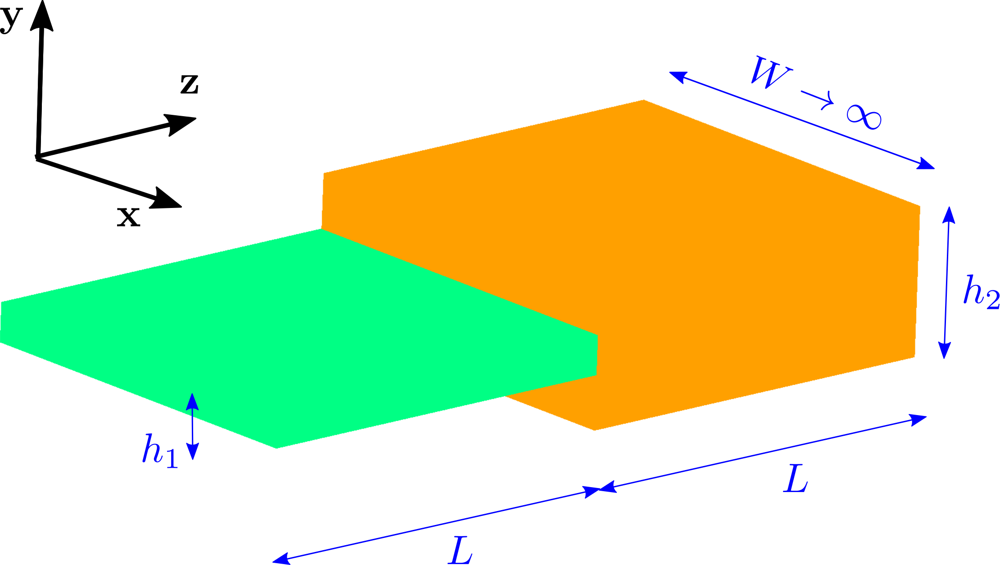

# Eigenmode decomposition of arbitrary field configurations

The ``
Here we will take advantage of MEEP's interconnectivity
with our [MPB][MPB] eigenmode solver to express an arbitrary
electromagnetic field configuration as a superposition of
eigenmodes.

## Theoretical background

Consider a waveguide in which electromagnetic power
flows in the $z$ direction in a material structure
that is confining in the tranverse directions
$\boldsymbol{\rho}=(x,y)$.

**insert equations here**

## C++ function prototype

The basic routine here is

```c++
std::vec<cdouble> fields::get_mode_coefficients(dft_flux flux,
                                                direction d,
                                                const volume where,
                                                std::vec<int> bands,
                                                kpoint_func user_func=0,
                                                void *user_data=0);
```
where

+ `flux` is a `dft_flux` object pre-populated with frequency-domain field data from a time-domain MEEP calculation you have run

+ `d` is the direction of power flow in the waveguide

+ `where` is a `volume` corresponding to the cross-sectional area $\Gamma$ over which we integrate in equation (1) above to extract mode-expansion coefficients

+ `bands` is an array of integers that you populate with the indices of the modes for which you want expansion coefficients

+ `user_func` is an *optional* function you supply to provide
initial estimates of the wavevector of a mode with given
frequency and band index; its prototype is

```
 vec (*kpoint_func)(void user_data, double freq, int band);
```

and it should return a `vec` giving your best guess for the 
wavevector of the `band`th mode at frequency `freq`.

The return value of `get_mode_coefficients` is an array
of type `cdouble` (short for `std::complex<double>`),
of the same length as your `bands` input array, giving
the values of the mode-expansion coefficients $c_n$ in 
equation (1) above.


## First example: Junction of planar waveguides

As a simple first problem, we'll consider
a 2D problem involving an impedance mismatch
between two planar waveguides, as shown in 
this figure:



In this case the geometry is invariant in the $x$
direction and the waveguides are simply planar
slabs, of finite thickness in the $y$ direction,
with the flow of power in the $z$ direction.
The waveguide in region $z<0$ has thickness $h_1$,
while that for $z>0$ has thickness $h_2\le h_1$; we place
a source inside the smaller waveguide and observe the
imperfect channeling of power flow into the large
waveguide due to the ``impedance'' mismatch at 
$z=0$.

The code for this problem is in `libmeepgeom/WaveguideJunction.cpp.`
This code offers a command-line option `--ratio` that sets the
ratio $h_2/h_1$ of the waveguide thicknesses; the default
value is `--ratio 2` (bigger slab is twice as thick as)

## Second example: Junction of cylindrical waveguides

[MPB]:	   https://mpb.readthedocs.io/en/latest/
[DFTFlux]: https://meep.readthedocs.io/en/latest/Scheme_User_Interface/#Flux_spectra.md
