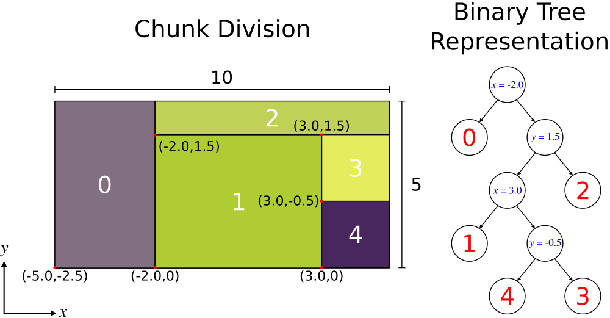
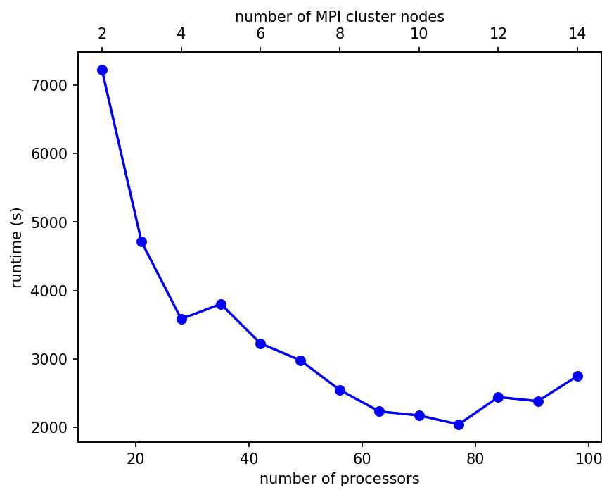
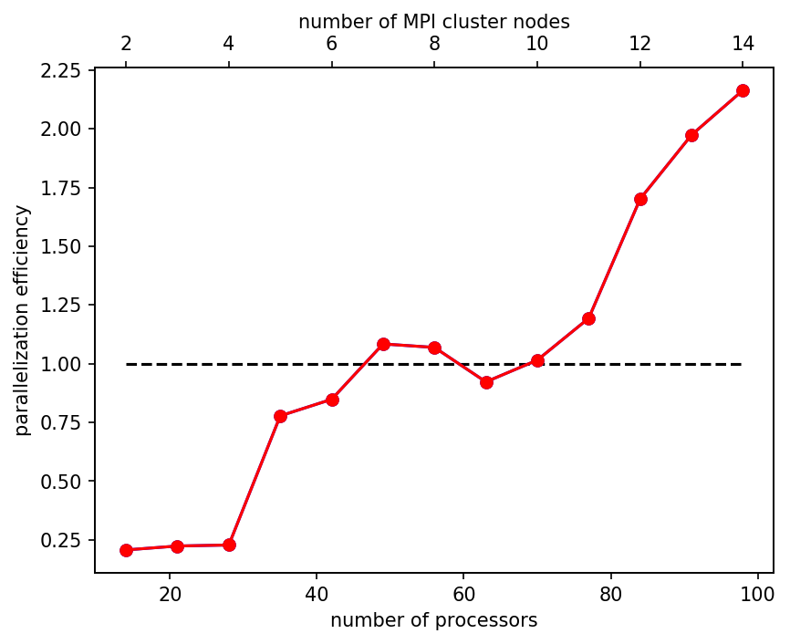
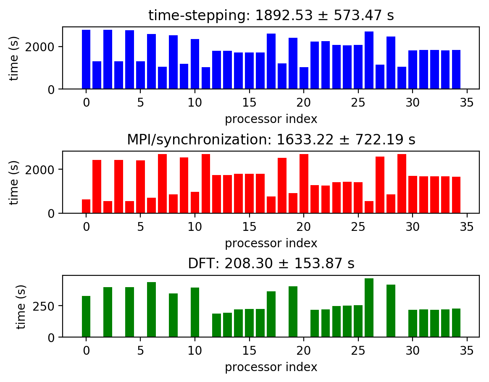
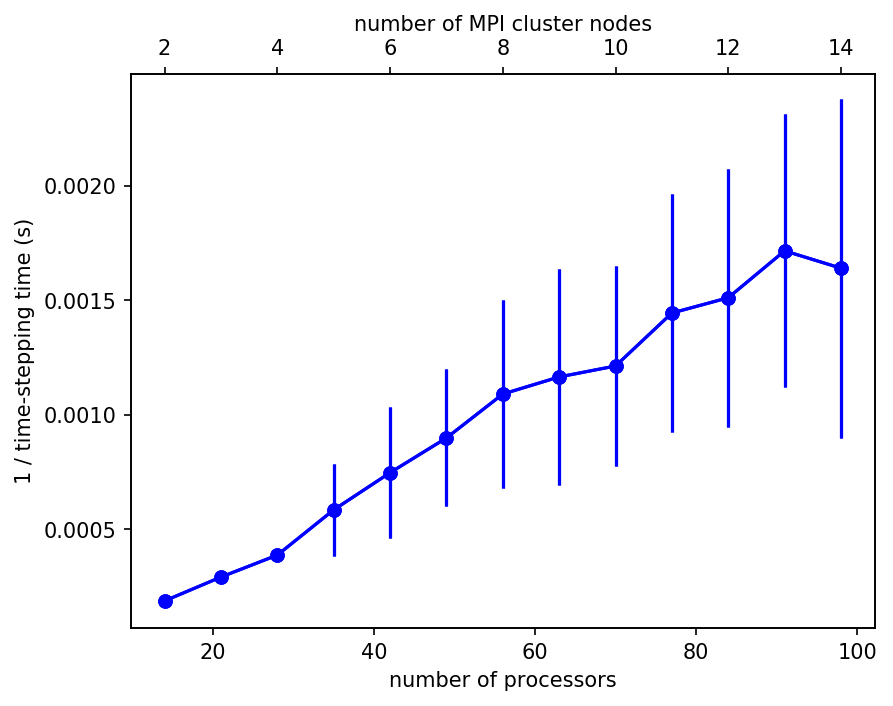
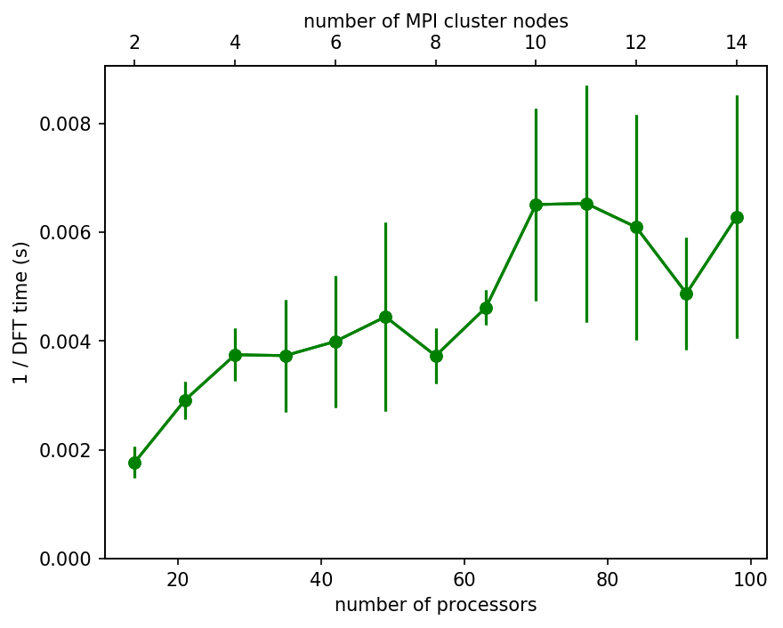

---
# Parallel Meep
---

Meep supports [distributed-memory](https://en.wikipedia.org/wiki/Distributed_memory) parallelism via [MPI](https://en.wikipedia.org/wiki/Message_Passing_Interface). This allows it to scale up from single multi-core machines to multi-node [clusters](https://en.wikipedia.org/wiki/Computer_cluster) and [supercomputers](https://en.wikipedia.org/wiki/Supercomputer), and to work on large problems that may not fit into the memory of one machine. Meep simulations can use hundreds of processors, if necessary. Of course, your problem must be sufficiently large in order to [benefit from many processors](FAQ.md#should-i-expect-linear-speedup-from-the-parallel-meep). (Note that it is *not* possible to run a parallel simulation from within a notebook environment.)  Note also that you should not generally use more MPI processes than you have [physical](https://en.wikipedia.org/wiki/Hyper-threading) cores.

[TOC]

Installing Parallel Meep
------------------------

To build from source the parallel version of Meep, you must have a version of MPI installed on your system. For an overview, see [Build From Source/MPI](Build_From_Source.md#mpi).

We also strongly recommend installing the [HDF5 package](Build_From_Source.md#hdf5) with **parallel** I/O support if you are going to run with more than a few cores/processors. When building from source, HDF5 needs to be configured with the flag `--enable-parallel`. You may also have to set the `CC` environment variable to `mpicc`.

If you don't install HDF5 with parallel I/O support, you can still do I/O from MPI &mdash; Meep has some hacks to let it write HDF5 files using serial I/O from multiple processes, one at a time. However, this does not scale very well to many processors. Some MPI implementations have been observed to freeze under the strain of trying to write from many processes at once.

Then you just configure Meep with the flag `--with-mpi`. If you run the resulting Python or Scheme script, it runs on a single process; to run with multiple cores/processors you should use `mpirun` as described in the next section. Because you can run the parallel Meep in a single process using this approach (i.e., `mpirun -np 1 python foo.py` or just `python foo.py`, `mpirun -np 1 meep foo.ctl` or just `meep foo.ctl`), there is no need to separately compile and install the serial version of Meep.

Using Parallel Meep
-------------------

The parallel version of Meep is designed to operate completely transparently: you use the **same** Python or Scheme script as for the serial version; the output is the same but it is just faster. In Python, the output of each process that is not the master (rank 0) is sent to [`devnull`](https://en.wikipedia.org/wiki/Null_device), and in Scheme, the special `print` function only prints output from the master process.

In order to run MPI programs, you typically have to use a command like `mpirun` with an argument to indicate how many processes you want to use. Consult your MPI documentation. For example, with many popular MPI implementations, to run with 4 processes you would use something like:

**Python**
```sh
mpirun -np 4 python foo.py > foo.out
```

**Scheme**
```sh
mpirun -np 4 meep foo.ctl > foo.out
```

There is one important requirement: every MPI process must be able to read the `foo.py`/`foo.ctl` input file or whatever your script file is called. On most systems, this is no problem, but if for some reason your MPI processes don't all have access to the local filesystem then you may need to make copies of your input file or something. This requirement also applies to HDF5 files used for input (i.e., via `epsilon_input_file`) or output (i.e., `output_epsilon()`, `output_efield()`, etc.). Any disruptions to the network or disk failures on individual machines which affect the [network file system](https://en.wikipedia.org/wiki/Network_File_System) may cause Meep to freeze/hang.

For a potential improvement in [load balancing](FAQ.md#should-i-expect-linear-speedup-from-the-parallel-meep), you can try setting [`split_chunks_evenly=False`](Python_User_Interface.md#the-simulation-class) in the `Simulation` constructor. For a technical description of the load balancing features in Meep as well as some performance metrics, see [arXiv:2003.04287](https://arxiv.org/abs/2003.04287).

In general, you cannot run Meep interactively on multiple processors.

**Warning:** when running a parallel PyMeep job, the failure of any one MPI process may cause the simulation to deadlock and not abort. This is due to a [behavior of `mpi4py`](https://mpi4py.readthedocs.io/en/stable/mpi4py.run.html). To avoid having to manually kill all the remaining processes, a simple solution is to load the `mpi4py` module (for versions 3.0+) on the `mpirun` command line:
```sh
mpirun -np 4 python -m mpi4py foo.py
```

### Different Forms of Parallelization

Parallel Meep works by taking your simulation and dividing the cell among the MPI processes. This is the only way of parallelizing a single simulation and enables simulating very large problems.

However, there is an alternative strategy for parallelization. If you have many smaller simulations that you want to run, say for many different values of some parameter, then you can just run these as separate jobs. Such parallelization is known as [embarrassingly parallel](https://en.wikipedia.org/wiki/Embarrassingly_parallel) because no communication is required. Additionally, Meep provides explicit support for this mode of operation even when using a *single* MPI job via the `meep.divide_parallel_processes(N)` routine which divides `N` MPI processes into `N` equal subgroups and returns the index `n` (`0`,...,`N-1`) of the current group which can be used to decide which simulation to run. That is, you have one script, and the script only creates *one* `Simulation` object — depending on the value of `n` that it receives, it will create a different `Simulation` object (i.e., using different parameters). For each subgroup, Meep acts as though it were running a separate self-contained parallel simulation: the fields from a given subgroup communicate only with each other using MPI, and each subgroup has its own master process with rank 0 which can be checked using `meep.am_master()`.    The overall master process of the entire run is the one for which `meep.am_really_master()` returns `True`; this is the only process that can generally perform I/O.  There is an auxiliary routine `meep.merge_subgroup_data(data)` which takes a NumPy array `data` from every process (which is identical across each subgroup) and then returns an array which is just the concatenated `data` from each subgroup. For an example, see [python/tests/divide_mpi_processes.py](https://github.com/NanoComp/meep/tree/master/python/tests/divide_mpi_processes.py) in the source repository.  You can also communicate between subgroups in other ways, e.g. by using low-level `mpi4py` functions.

The `divide_parallel_processes` feature can be useful for large supercomputers which typically restrict the total number of jobs that can be executed but do not restrict the size of each job, or for large-scale optimization where many separate simulations are coupled by an optimization algorithm. Note that when using this feature using the [Python interface](Python_User_Interface.md), only the output of the subgroup belonging to the master process of the entire simulation is shown in the standard output. (In C++, the master process from *every* subgroup prints to standard output.)

Meep also supports [thread-level parallelism](https://en.wikipedia.org/wiki/Task_parallelism) (i.e., multi-threading) on a single, shared-memory, multi-core machine for multi-frequency [near-to-far field](Python_User_Interface.md#near-to-far-field-spectra) computations. Meep does not currently use thread-level parallelism for the time stepping although this feature may be added in the future (see [Issue \#228](https://github.com/NanoComp/meep/issues/228)). 

### Optimization Studies of Parallel Simulations

When running Meep simulations as part of an optimization study (e.g., via the [adjoint solver](Python_Tutorials/AdjointSolver.md)), in order to keep all processes synchronized *every* process runs the same optimization algorithm on the same optimization variables. The overhead of duplicating the computational cost of the optimization algorithm and storage of the design variables across all processes is negligible compared to those of the Meep simulation.

For comparison, consider the scenario where the optimization runs on just a single master process. That would mean that during each iteration of the optimization after the Meep simulation has computed the objective function (and its gradient), only the master process uses this information to update the optimization parameters (i.e., the design region). The master process would then need to send the updated design region to the other processes so that they could all begin the next Meep simulation. As a result, additional bookkeeping is required to synchronize the processes.

Note: for optimization studies involving *random* initial conditions, the seed of the random number generator must be specified otherwise each process will have a different initial condition which will cause a crash. For example, if you are initializing the design variables with `numpy.random.rand`, then you should call `numpy.random.seed(...)` to set the same `numpy.random` seed on every process.

### User-Specified Cell Partition

An alternative to having Meep automatically partition the cell at runtime into chunks based on the number of MPI processes is to manually specify the cell partition via the `chunk_layout` parameter of the `Simulation` constructor as a [`BinaryPartition`](Python_User_Interface.md#binarypartition) class object. This is based on representing an arbitrary cell partition as a binary tree for which the nodes define "cuts" at a given point (e.g., -4.5, 6.3) along a given cell direction and the leaves define a unique integer-valued chunk ID (equivalent to the rank of the MPI process for that chunk).

As a demonstration, an example of a 2d cell partition along with its binary-tree representation is shown below. The 10×5 cell in $xy$ coordinates with origin at the lower-left boundary is partitioned into five chunks numbered one through five. Note that for any given cell partition, its binary-tree representation is unique.

<center>

</center>

This binary tree can be described as a list of lists where each list entry is `[ (split_dir,split_pos), left, right ]` for which `split_dir` and `split_pos` define the splitting direction and position, and `left` and `right` are the left and right branches which can be either another list defining a new node or a chunk ID. There are two items to note when converting the binary tree shown above into a `BinaryPartition` class object: (1) by default, Meep defines the cell origin to be at the geometric center of the cell (i.e., at location (5.0,2.5) in the coordinate system of the figure) and thus all splitting coordinates must be shifted accordingly, and (2) MPI ranks must be defined in the range [0,`num_chunks`-1] which requires that all chunk IDs be shifted down by one. Based on these specifications, the cell partition from above can be set up as follows:

```py
import meep as mp
import matplotlib.pyplot as plt

chunk_layout = mp.BinaryPartition(data=[ (mp.X,-2.0), 0, [ (mp.Y,1.5),
                                         [ (mp.X,3.0), 1, [ (mp.Y,-0.5), 4, 3 ] ], 2 ] ])

cell_size = mp.Vector3(10.0,5.0,0)

sim = mp.Simulation(cell_size=cell_size,
                    resolution=10,
                    chunk_layout=chunk_layout)

sim.visualize_chunks()
plt.savefig('chunk_layout.png',dpi=150,bbox_inches='tight')
```
This example can be run using two different approaches: (1) with the number of MPI processes exactly equivalent to the number of user-specified chunks (i.e., `mpirun -np 5 python chunk_layout_example.py`) or (2) using *any* number of MPI processes and letting Meep automatically distribute the MPI ranks among the five chunks by additionally specifying `num_chunks=5` in the `Simulation` constructor.

For improved performance, it is important to order the chunks such that adjacent chunks are numbered consecutively. This is equivalent to assigning MPI ranks in [depth-first order](https://en.wikipedia.org/wiki/Depth-first_search) which ensures that adjacent chunks on the same MPI node communicate using shared memory rather than the network (which tends to be slower).

Technical Details
-----------------

When you run Meep under MPI, the following is a brief description of what is happening behind the scenes. For the most part, you shouldn't need to know this stuff. Just use the same Python/Scheme script file exactly as you would for a uniprocessor simulation.

First, every MPI process executes the Python/Scheme file in parallel. The processes communicate however, to only perform one simulation in sync with one another. In particular, the cell is divided into "chunks", one per process, to roughly equally divide the work and the memory. For additional details, see [Chunks and Symmetry](Chunks_and_Symmetry.md) as well as Section 2.2 ("Grid chunks and owned points") of [Computer Physics Communications, Vol. 181, pp. 687-702, 2010](http://ab-initio.mit.edu/~oskooi/papers/Oskooi10.pdf).

When you time-step via Python's `meep.Simulation.run(until=...)` or Scheme's `run-until`, etc., the chunks are time-stepped in parallel, communicating the values of the pixels on their boundaries with one another. In general, any Meep function that performs some collective operation over the whole cell or a large portion thereof is parallelized, including: time-stepping, HDF5 I/O, accumulation of flux spectra, and field integration via `integrate_field_function` (Python) or `integrate-field-function` (Scheme), although the *results* are communicated to all processes.

Computations that only involve isolated points, such as `get_field_point` (Python) or `get-field-point` (Scheme), or `Harminv` (Python) or `harminv` (Scheme) analyses, are performed by all processes redundantly. In the case of `get_field_point` or `get-field-point`, Meep figures out which process "knows" the field at the given field, and then sends the field value from that process to all other processes. This is harmless because such computations are rarely performance bottlenecks.

Although all processes execute the Python/Scheme file in parallel, print statements are ignored for all process but one (process \#0). In this way, you only get one copy of the output.

Sometimes you only want an operation to take place on one process. A common use case is showing a `matplotlib` plot with `plt.show()`, or saving a file with `plt.savefig()`. In cases where you need to distinguish different MPI processes in your Python/Scheme file, you can use the following functions:

**`meep.am_master()`**,
**`(meep-am-master)`**
—
Returns true if the current process is the master process (rank 0).

This can be useful for calling external I/O or visualization routines, e.g. Matplotlib plotting functions, that you only want to execute on the master process.   Note that the Scheme `(print)` or Python `print` functions are *already* set up so that by default their output is suppressed on non-master processes.

**Warning**: Most Meep functions operating on the simulation (e.g. fields or structure) are "collective" operations that must be called from all processes in the same sequence — if you call them from only one process via `am_master` (or `my_rank`) checks, then they will [deadlock](https://en.wikipedia.org/wiki/Deadlock).  Code inside an `am_master` check should generally only call non-Meep library functions.

**`meep.count_processors()`**,
**`(meep-count-processors)`**
—
Returns the number of processes that Meep is using in parallel.

**`meep.my_rank()`**,
**`(meep-my-rank)`**
—
Returns the index of the process running the current file, from zero to `meep.count_processors()`-1.

**`meep.all_wait()`**,
**`(meep-all-wait)`**
—
Blocks until all processes execute this statement (MPI_Barrier).

For large multicore jobs with I/O, it may be necessary to have `(meep-all-wait)` as the last line in the Scheme file to ensure that all processors terminate at the same point in the execution. Otherwise, one processor may finish and abruptly terminate the other processors.

Runtime Scaling on MPI Clusters
-------------------------------

The following are benchmarking results of the total runtime vs. number of processors for a 3d [OLED](http://www.simpetus.com/projects.html#meep_oled) simulation involving [Lorentzian susceptibility](Python_User_Interface.md#lorentziansusceptibility), [Absorber](Python_User_Interface.md#absorber), 1d [PML](Python_User_Interface.md#pml), and [DFT flux monitors](Python_User_Interface.md#flux-spectra) for [MPICH](https://www.mpich.org/) clusters of [n1-standard-16](https://cloud.google.com/compute/docs/machine-types#n1_machine_type) instances (8 single-threaded cores) on the [Google Cloud Platform](https://cloud.google.com/) (GCP). One slot on each node is reserved for kernel tasks leaving 7 slots per node. The software stack includes Ubuntu 16.04, the Meep [nightly build Conda package](Installation.md#nightly-builds), [elasticluster](https://elasticluster.readthedocs.io/en/latest/) for the cluster management, and [grid engine](https://en.wikipedia.org/wiki/Oracle_Grid_Engine) for the job scheduler. In order to reduce [cache contention](https://en.wikipedia.org/wiki/Resource_contention), process affinity is used via the `mpirun` option `-bind-to core`. Meep's simulation domain is split into equal-sized [chunks](Chunks_and_Symmetry.md#chunks-and-symmetry) (`split_chunks_evenly=True`). There are 13 clusters ranging in size from 2 to 14 nodes (14 to 98 processors).

As shown in the first figure below, the runtime reaches a minimum at 77 processors. The second figure shows the scaling of the ratio of the mean time spent on communication (MPI/synchronization) to the computation (time stepping and DFTs). (Timing metrics were obtained using [`Simulation.mean_time_spent_on`](Python_User_Interface.md#simulation-time).) This ratio is a measure of the parallelization efficiency. The crossover point when the parallelization efficiency becomes larger than one — the regime in which the simulation is constrained by the network bandwidth rather than the CPU clock speed — corresponds well to the minimum runtime of the first figure.

<center>

</center>

<center>

</center>

These results are not continuous because as the number of processors changes slightly (e.g., from 42 to 49), the chunk divisions can change by a lot (i.e., it can switch from splitting some chunk along the $x$ axis to along the $y$ axis) which significantly affects the runtime performance.

For a given cluster, we can also analyze the time spent by each processor on time-stepping, MPI/synchronization, and DFT. This is shown in the next figure for the case of a cluster with 35 processors (5 nodes). Because the simulation is not properly load balanced due to the equal-sized chunks, there is a large variation in the timings for different processors particularly for the DFT where there are several idle processors (i.e., chunks which do not contain any DFT pixels).

<center>

</center>

Based on these results, we plot the average of the *inverse* of the timings (proportional to the number of cycles per second; a "rate" quantity which can demonstrate linear scaling) for the time-stepping and DFT over the full range of cluster sizes. The time-stepping results demonstrate (approximately) linear scaling.  The size of the error bars increases with the number of cluster nodes mainly due to pronounced variations in the network bandwidth; the N1 instances do *not* support colocation via a [compact placement policy](https://cloud.google.com/solutions/best-practices-for-using-mpi-on-compute-engine). The DFT results (which excludes those processors without any DFT pixels) seem to be oscillating around a constant. This is not surprising because the processor(s) which takes the longest time to update its DFT pixels sets an upper bound on how fast the DFT calculation for all processors can proceed. It is the presence of this unique upper bound for each cluster which is revealed by the scaling plot.

See also [FAQ/Should I expect linear speedup from the parallel Meep](FAQ.md#should-i-expect-linear-speedup-from-the-parallel-meep)?

<center>

</center>

<center>

</center>
