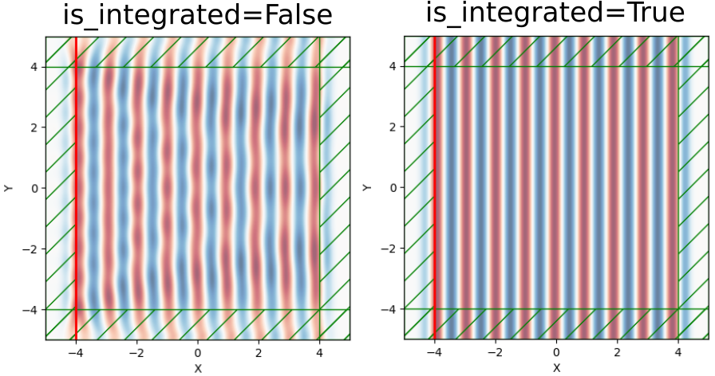
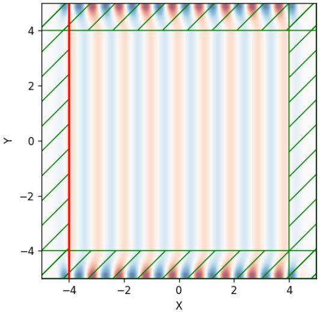

---
# Perfectly Matched Layer
---

The [perfectly matched layer](https://en.wikipedia.org/wiki/Perfectly_matched_layer) (**PML**) approach to implementing absorbing boundary conditions in FDTD simulation was originally proposed in [J. Computational Physics, Vol. 114, pp. 185-200 (1994)](http://dx.doi.org/10.1006/jcph.1994.1159). The approach involves surrounding the computational cell with a medium that in theory absorbs without any reflection electromagnetic waves at *all* frequencies and angles of incidence. The original PML formulation involved "splitting" Maxwell's equations into two sets of equations in the absorbing layers, appropriately defined. These split-field equations produce wave attenuation but are unphysical. It was later shown in [IEEE Transactions on Antennas and Propagation, Vol. 43, pp. 1460-3 (1995)](https://ieeexplore.ieee.org/abstract/document/477075) that a similar reflectionless absorbing medium can be constructed as a lossy anisotropic dielectric and magnetic material with "matched" impedance and electrical and magnetic conductivities. This is known as the uniaxial PML (UPML).

The finite-difference implementation of PML requires the conductivities to be turned on *gradually* over a distance of a few grid points to avoid numerical reflections from the discontinuity. It is also important when using PMLs to make the computational cell sufficiently large so as not to overlap the PML with [evanescent fields](https://en.wikipedia.org/wiki/Evanescent_field) from resonant-cavity or waveguide modes (otherwise, the PML could induce artificial losses in such modes). As a rule of thumb, a PML thickness comparable to half the largest wavelength in the simulation usually works well. The PML thickness should be repeatedly doubled until the simulation results are [sufficiently converged](FAQ.md#checking-convergence).

For a more detailed discussion of PMLs in Meep, see Chapter 5 ("Rigorous PML Validation and a Corrected Unsplit PML for Anisotropic Dispersive Media") of the book [Advances in FDTD Computational Electrodynamics: Photonics and Nanotechnology](https://www.amazon.com/Advances-FDTD-Computational-Electrodynamics-Nanotechnology/dp/1608071707). In particular, there are two useful references:

-   [Notes on Perfectly Matched Layers](https://arxiv.org/abs/2108.05348) (arXiv:2108.05348) by S. G. Johnson: a general introduction to PML concepts
-   [J. Computational Physics, Vol. 230, pp. 2369-77 (2011)](http://math.mit.edu/~stevenj/papers/OskooiJo11.pdf): a description of the precise PML formulation that is used in Meep, which is slightly different from many PML formulations described elsewhere in order to properly handle arbitrary anisotropy. This paper also describes a general strategy to validate PML.

[TOC]

Breakdown of PML in Inhomogeneous Media
---------------------------------------

As shown in the figure below, there are two important cases involving *inhomogeneous* media where the fundamental coordinate stretching idea behind PML breaks down giving rise to reflection artifacts. The workaround is to replace the PML with an adiabatic [absorber](Python_User_Interface.md#absorber). Additionally, if you operate near a low-group velocity band edge in a periodic media, you may need to make the PML/absorber very thick (overlapping many periods) to be effective. For more details on why PML breaks down in these cases, see [Optics Express, Vol. 16, pp. 11376-92 (2008)](http://www.opticsinfobase.org/abstract.cfm?URI=oe-16-15-11376). Also, [Physical Review E, Vol. 79, 065601 (2011)](http://math.mit.edu/~stevenj/papers/LohOs09.pdf) describes a separate case where PML fails involving backward-wave modes which may occur at metal-dielectric interfaces (i.e., [surface-plasmon polaritons](https://en.wikipedia.org/wiki/Surface_plasmon_polariton)).

<center>

</center>

Planewave Sources Extending into PML
------------------------------------

For sources extending into the PML, such as planewaves which must span the entire width of the cell with Bloch-periodic boundary conditions (see e.g. [Tutorial/Basics/Mie Scattering of a Lossless Dielectric Sphere](Python_Tutorials/Basics.md#mie-scattering-of-a-lossless-dielectric-sphere)), the `is_integrated` parameter of the `Source` object must be set to `True` in order to generate planar wavefronts. This is demonstrated in the following example for an $E_z$-polarized planewave propagating in the $x$ direction in a 2d cell surrounded by PML. A side-by-side comparison of the $E_z$ field profile indicates that the wavefronts are not planar for `is_integrated=False` (the default).

(`is_integrated=True` is required for technical reasons having to do with how current sources are implemented in Meep; you need a very particular source in the PML in order to correspond mathematically to an infinitely long source current that produces a planewave.  In contrast, if the current source did *not* extend into the PML, it would correspond to simulating a *finite*-length current source in an infinite domain, which does *not* produce a planewave.)

```py
import meep as mp
import matplotlib.pyplot as plt

pml_layers = [mp.PML(thickness=1)]
cell_size = mp.Vector3(10,10)

sources = [mp.Source(mp.ContinuousSource(1,is_integrated=True),
                     center=mp.Vector3(-4),
                     size=mp.Vector3(y=10),
                     component=mp.Ez)]

sim = mp.Simulation(resolution=20,
                    cell_size=cell_size,
                    boundary_layers=pml_layers,
                    sources=sources,
                    k_point=mp.Vector3())

sim.run(until=30)

sim.plot2D(fields=mp.Ez)
plt.show()
```

<center>

</center>

For an $E_y$-polarized source and `is_integrated=True`, the wavefronts are planar only in the non-PML region as shown below. This is because the $E_y$ fields in the $y$-PML are being rescaled by a Jacobian matrix. (The key thing to remember is that the fields in the PML region are not "physical," but are carefully designed artificial quantities in order to eliminate boundary reflections; you should generally extract physical data only from the interior of the computational cell (outside the PML).)

<center>

</center>

In the future, `is_integrated=True` will be set automatically for sources extending into the PML ([#1049](https://github.com/NanoComp/meep/issues/1049)).

What is a Good Rule of Thumb for the PML thickness?
---------------------------------------------------

Around half the wavelength, typically. (Note that the boundary condition, metallic or periodic, is essentially irrelevant to the operation of the PML.) PML allows inhomogeneous materials like waveguides as long as the materials are only varying in the boundary-*parallel* directions; wave media that are inhomogeneous in the boundary-normal directions (e.g., gratings or other periodic structures, oblique waveguides, etc.) as well as unusual waveguides with backward-wave modes cause PML to break down, in which case one alternative is a thicker non-PML [absorber](Python_User_Interface.md#absorber).
