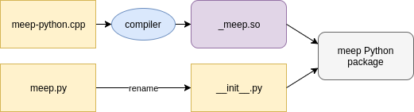

---
# Python Developer Information
---

## Overview

The `meep` Python package consists of a low-level interface and a high-level interface. The low-level interface is the direct result of running [SWIG](http://www.swig.org/) on the C++ headers.

<center></center>

Next, we compile `meep-python.cxx`, rename `meep.py` to `__init__.py` and put them in a folder called `meep`. Putting all the code in `__init__.py` allows us to access the symbols directly from the `meep` namespace rather than going through an additional module like `meep.meep.vec`. Now we have a complete Python package.

<center></center>

`__init__.py` contains "proxy" classes for all public `meep` objects. They hold a `this` pointer that dispatches to the appropriate C++ functions in the `_meep.so` extension module. The interface this package exposes is basically the same as the C++ interface. That is, a simulation written in this low-level Python interface would not look much different from the same simulation written in C++. By implementing a high-level interface on top of the basic SWIG wrappers, we can abstract away many of the low details of setting up a simulation, take advantage of Python language features like keyword arguments, and gain productivity from libraries like NumPy.

## Package Organization

After adding the high-level interface files, the `meep` package looks like this.
```bash
meep
├── __init__.py
├── _meep.so
├── geom.py
├── simulation.py
└── source.py
```
The Python MPB interface is also included in the `meep` package. It's constructed in the same manner as the `meep` package. The low-level interface is in `meep/mpb/__init__.py` and `meep/mpb/_mpb.so`, and the high-level interface is in `solver.py`. Here is a view of the complete package.
```bash
meep
├── mpb
│   ├── __init__.py
│   ├── _mpb.so
│   ├── mpb_data.py
│   └── solver.py
├── __init__.py
├── _meep.so
├── geom.py
├── simulation.py
└── source.py
```

## Description of Files

### `meep.i`

SWIG interface file for the `meep` Python module. Includes typemaps, helper functions, and module initialization code. The typemaps mostly call other helper functions defined either in `meep.i`, or in `typemap_utils.cpp` (if the function is used in `mpb.i` too). There are also various `py_*_wrap` functions that handle calling user defined Python functions from C++. Everything in the `%pythoncode` block at the end of the file is run once when the `meep` module is first imported. See the [SWIG documenation](http://www.swig.org/Doc3.0/SWIGDocumentation.html) for more details.

### `vec.i`

SWIG interface file for `vec.hpp`. Included into `meep.i`. SWIG warnings are disabled (if found benign) in this file.

### `numpy.i`

Typemaps for `numpy` arrays (taken from the NumPy [Github repository](https://github.com/numpy/numpy/blob/master/tools/swig/numpy.i)). See the [documentation](https://docs.scipy.org/doc/numpy-1.13.0/reference/swig.interface-file.html) for instructions on using these typemaps.

### `typemap_utils.cpp`

Utility functions for writing SWIG typemaps. Since this file is included into both `meep.i` and `mpb.i`, only code that is useful to both interface files should be put here (otherwise the compiler complains about unused functions). Code used only by one interface should be put in the respective `.i` file. The majority of the code in this file is for converting the Python geometric objects defined in `geom.py` to C objects. The `get_attr_*` functions are helpers for getting C versions of attributes on Python objects. The convention in the file is for functions to return `1` on success and `0` on failure so that the top level typemaps in `meep.i` can be written as:

```c++
%typemap(in) type {
    if(!py_type_to_type($input, &$1)) {
        SWIG_fail;
    }
}
```
Keeping the code within `%typemap` blocks small is valuable because it gets copied everywhere the typemap is used, which can lead to code bloat.

### `geom.py`

Pure Python implementations of the geometric objects defined in `libctl`. The user-defined list of objects (`Simulation.geometry`) gets converted to C objects when `meep.set_materials_from_geometry` is called in `Simulation._init_structure`. The function responsible for this conversion is `typemap_utils.cpp:py_list_to_gobj_list`. This file also contains classes that represent materials (`Medium`) and susceptibilities, and cartesian/reciprocal/lattice conversion functions. Note that when adding a class or function to this file, it must also be imported in the `%pythoncode` block at the end of `python/meep.i` if you want it to be directly accessible from the `meep` namespace (i.e., to get `meep.MyClass` instead of `meep.geom.MyClass`).

### `simulation.py`

Holds the `Simulation` class, which is the primary abstraction of the high-level interface. Minimally, a simulation script amounts to passing the desired keyword arguments to the `Simulation` contructor and calling the `run` method on the resulting instance. The various step functions are also included in this file. When adding extra functions or class to this file, an import statement should also be added to the `%pythoncode` block at the bottom of `python/meep.i`.

### `source.py`

Holds classes representing sources, including `GaussianSource`, `ContinuousSource`, `CustomSource`, and `EigenModeSource`. When adding extra functions or class to this file, an import statement should also be added to the `%pythoncode` block at the bottom of `python/meep.i`.

### `mpb.i`

SWIG interface file for the `meep.mpb` Python module.

### `solver.py`

Classes and functions related to the high-level Python interface to `MPB`. Additional classes or functions in this file should be accompanied by an `import` statement in the `%pythoncode` block at the bottom of `mpb.i`.

### `mpb_data.py`

Definition of `MPBData`, a Python class useful for `MPB` data analysis (documented [here](https://mpb.readthedocs.io/en/latest/Python_Data_Analysis_Tutorial)). This is is a Python port of the functionality available in the [`mpb-data` command line program](https://github.com/NanoComp/mpb/blob/master/utils/mpb-data.c) originally written in C.

## Testing

The tests for the Python interface are located in `python/tests`. To run the whole test suite, run `make check` in the `python` build tree. During development it is more convenient to run individual tests. This can be accomplished by running `python <path_to_test>/test.py MyTestCase.test_method`. See the [Python unittest framework documentation](https://docs.python.org/3/library/unittest.html) for more info. If you're using an out-of-tree build (recommended), the development process will look something like this:
```bash
cd meep/build/python
export PYTHONPATH=`pwd`

# After making changes, rebuild the Python package
make
# Run test
python ../../python/tests/my_test.py MyNewTest.test_my_feature
```
