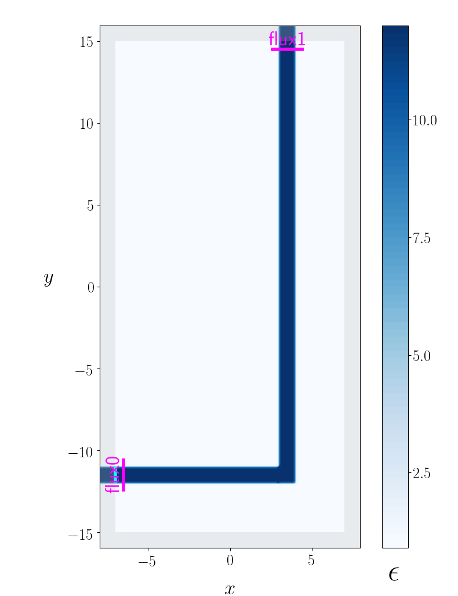

# MEEP adjoint module quickstart

## `tl;dr`: I already know all about adjoint optimizers, just show me an example.

This is the `CrossRouter.py` example included in the 
`python/examples/adjoint_optimization` subdirectory of your MEEP installation:

[Full automated optimization of a cross-router device](https://homerreid.github.io/meep-adjoint-documentation/AdjointSolver/ExampleGallery/#full-automated-optimization-of-a-cross-router-device)

## What does this module do?

At the lowest level, it implements an adjoint method for computing
the derivatives of an objective function with respect to the permittivity
at each spatial point in a subregion. This amounts to just a MEEP timestepping
calculation with a special type of source distribution and a certain
type of postprocessing applied to the results; it is implemented entirely
in high-level python code and doesn't require tweaks to the `libmeep`
core library.

At a higher level, the module implements functionality for wrapping
a numerical optimizer around the gradient computation to allow
users to execute automated design automation with a minimum of 
effort.

## How do I use it?

1. You write a python script implementing a subclass of
   the `OptimizationProblem` virtual base class defined by `meep.adjoint.`
   Your subclass must provide overrides for the virtual
   class methods `init_problem` and `create_sim`.

2. Then you execute your python scripts with command-line options
   specifying various calculations to perform, which range
   in complexity from **(a)** evaluating an objective function and its
   gradient for a single design (a *single-point calculation*)
   to **(b)** full iterative optimization in which the design is
   repeatedly evaluated and tweaked automatically based on the 
   gradient computation.

## What is this `init_problem` method that my subclass must override?

It inputs an `args` structure containing the parsed values of
command-line options, performs any necessary internal initialization,
and returns a 5-tuple 
```py3 
   fstr, objective_regions, design_region, extra_regions, basis
```
describing your optimization problem, where

+ `fstr` is a string specifying your objective function
+ `objective_regions` is a list of regions over which to compute
   frequency-domain (DFT) fields needed to evaluate the quantities
   on which your objective function depends
+ `extra_regions` is a list of additional regions over which to compute
   DFT fields for post-processing or visualization; it will often be
   just the empty list
+ `design_region` is a region encompassing the variable-permittivity
   region of your geometry
+ `basis` is a specification of the set of basis functions used to 
    expand the permittivity. This is a subclass of the `Basis` base class
   defined by `meep.adjoint`; you may implement your own arbitrary
   basis, or use one of several predefined bases provided by `meep.adjoint.`

## How can I add my own problem-specific command-line options, or specify problem-specific values for [built-in options?](https://homerreid.github.io/meep-adjoint-documentation/AdjointSolver/ReferenceManual#4-built-in-command-line-options)

By overriding the `add_args` method of `OptimizationProblem.` See the examples
in the `python/examples/adjoint_optimization` subdirectory of your MEEP installation.

## Show me some examples of `fstr` strings defining objective functions.

+ Maximize power flux through the first DFT flux region in your `objective_regions` list:

```py3
   fstr = 'S_0'
```	

+ Minimize the difference between the power fluxes through the DFT flux regions labeled 'north' and 'south':

```py3
   fstr = '-(S_north - S_south)^2'
```	

+ Maximize the squared magnitude of the eigenmode coefficient for the forward-traveling component
  of eigenmode 3 at the 'east' flux region:

```py3
   fstr = 'Abs2(P3_east)^2'
```	

## What do I return as the `basis` field in the 5-tuple returned by `init_problem`?

For most purposes, the simplest answer is to use the build-in `FiniteElementBasis`
class, which describes a localized basis of functions over a rectangular
domain with a variable resolution, i.e.

```py3
  basis=FiniteElementBasis(design_region_width, design_region_height, density=3)
```

Here `density` specifies the number of finite-element subdivisions
per unit length.

## What is this `create_sim` method that my subclass must override?

In inputs a vector `beta_vector` of basis expansion coefficients and returns
a pymeep `simulation` describing your geometry with the corresponding
spatially-varying permittivity in the design region. The simplest way
to do this is simply to include in your `geometry` list an object
whose spatial extent coincides with the `design_region` returned
by your `init_problem` and whose `epsilon_func` is an instance
of the `ParameterizedDielectric` class defined by `meep.adjoint`.
See the examples in the `python/examples/adjoint_optimization`
subdirectory of your MEEP installation.

## Aside from overriding `init_problem` and `create_sim`, is there any other code to include in my python script?

If you want to be able to run your script as an executable from the shell, copy and paste the 
following boilerplate code verbatim into bottom of your script:

```py3
######################################################################
# if executed as a script, we look at our own filename to figure out
# the name of the class above, create an instance of this class called
# op, and call its run() method.
######################################################################
if __name__ == '__main__':
    op=globals()[__file__.split('/')[-1].split('.')[0]]()
    op.run()
```


## Once I have written my python script subclassing `OptimizationProblem`, how do I run calculations on it?

Assuming your python script is called `MyOptimizationProblem.py`:

### Plot the geometry, with all options set to default values

```bash
 % python MyOptimizationProblem.py
```

### Plot the geometry with a given functional form for the initial design permittivity

```bash
 % python MyOptimizationProblem.py --eps_design '1.0+5.0*(1.0+sin(x)*cos(2.0*y))'
```

### Compute the objective function at the initial design point:

```bash
 % python MyOptimizationProblem.py --eval_objective
```

### Compute the objective function and gradient at the initial design point

```bash
 % python MyOptimizationProblem.py --eval_objective
```

### Run full iterative optimization

```bash
 % python MyOptimizationProblem.py --optimize
```

## What other command-line options are available?

The full list is documented [here.](https://homerreid.github.io/meep-adjoint-documentation/AdjointSolver/ReferenceManual#4-built-in-command-line-options)

## Does the `meep.adjoint` module offer any general functionality that is useful for general (non-adjoint) MEEP calculations?

### `ParallelDesignTester`

The standalone module `meep.adjoint.ParallelDesignTester` offers an extremely
painless way to parallelize a large number of runs of a python script with
different command-line options. Thus, supose you want to run
a script named `MyScript.py` with 100 different sets of command-line options,
i.e. you want to achieve the effect of running the following sequence
of shell commands:

```bash
   % python MyScript.py '--x 1.0 --name x1'
   % python MyScript.py '--x 2.0 --name x1'
   % ...
   % python MyScript.py '--x 100.0 --name x100'
```

The following script will launch a pool of N servers
and run N of your jobs at a time, yielding a painless N-fold speedup:

```
from meep.adjoint import ParallelDesignTester

cmdlines=[
'--x 0 1.0 --name x1',
'--x 0 2.0 --name x2',
...
'--x 0 100.0 --name x100']

ParallelDesignTester(MyScript,cmdlines).launch()
```

The number N of server processes launched is chosen by default
to be 1/2 the number of CPU cores on your machine, but may
be set to e.g. 4 by saying `launch(nproc=4)`.

### Visualization module

The `meep.adjoint.visualization` module is an attempt at
providing simple standardized routines for visualization of
MEEP simulations.

#### Visualizing simulation geometries

Call `visualize_sim()` after initializing a `simulation`
(just before timestepping) to get a visual depiction of 
the geometry, PML layers, source regions, and DFT regions.
 
```py3
from meep.adjoint import visualize_sim

sim=mp.simulation(...)

# code to add DFT cells goes here

visualize_sim(sim)
```

#### Visualizing simulation results: Frequency-domain fields

Call the *same* routine `visualize_sim()` after timestepping
to get a visual depiction of DFT fields superposed over the geometry
 
```py3
sim.run(...)
visualize_sim(sim)
```

This routine is designed for quick-and-easy visualization of 
**any MEEP geometry** without the need to configure a bunch 
of customization options. For example, here's what it does
before and after timestepping on the 
[`bend-flux` example](https://github.com/NanoComp/meep/blob/master/python/examples/bend-flux.py):

+ **Before timestepping:**



+ **After timestepping:**


See the [Adjoint solver documentation](https://homerreid.github.io/meep-adjoint-documentation)
for many more examples of pre- and post-timestepping visualizations generated
by `meep.adjoint.Visualization.`

Note: Although `visualize_sim` is designed to do something useful on any
geometry with no command-line options, it also offers copious
options for customizing the visualization; see the 
[`meep.adjoint.Visualization` documentation](https://homerreid.github.io/meep-adjoint-documentation/Visualization)
for more details.

#### Real-time visualization of time-domain fields

`meep.adjoint.Visualization` also offers functionality for easy
*real-time* visualization of time-domain fields. More specifically,
the module provides a new [step function](https://meep.readthedocs.io/en/latest/Scheme_User_Interface/#run-and-step-functions)
named `AFEClient` that intermittently updates a plot of time-domain field-components while
a simulation is ongoing. (More specifically, `AFEClient` is a *class* implemented by
`meep.adjoint` that accepts initialization options and may then subsequently be called
as a step function via its `__call__` method; behind the scenes, it implements
the client side of a client-server visualization protocol in which the heavy lifting
of the visualization is done by a separate process to offload that computational
burden from the MEEP timestepping process. See the `AFE_Client` and `AFE_Server`
functions in the `Visualization.py` file in the `meep.adjoint` implementation.)

For example, to update a plot of the *z*-component of the electric field
every 2 timesteps (in MEEP time), you could go like this:

```py3
   step_funcs = [ AFEClient(sim, ['Ez'], interval=2) ]
   sim.fun(*stepfuncs, until=200)
```

Here are movies of what this produces for the
[holey waveguide](Overview#the-holey-waveguide) geometry,
showing an incident eigenmode field propagating across a waveguide
with and without a hole in it.

+ Without hole: [Ez2WithoutHole.h264](http://127.0.0.1:8000/AdjointSolver/images/Ez2WithoutHole.h264)

+ With hole: [Ez2WithHole.h264](http://127.0.0.1:8000/AdjointSolver/images/Ez2WithHole.h264)
