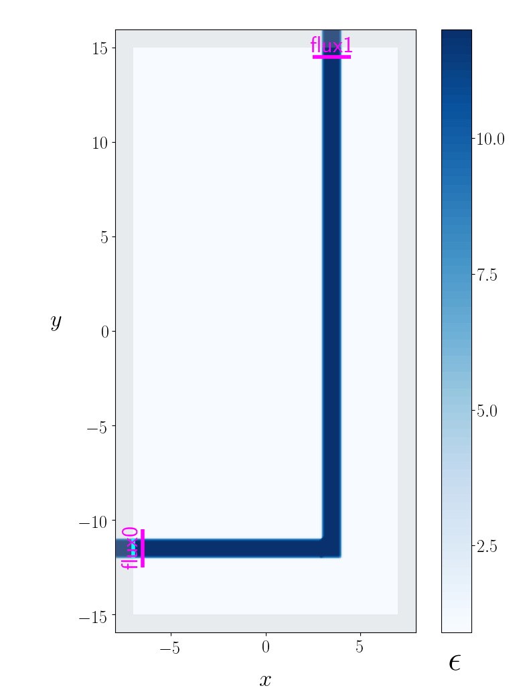
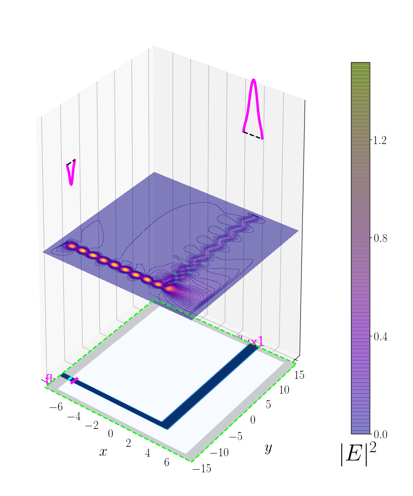

---
# Adjoint Solver
---

Meep contains an adjoint solver for efficiently computing the gradient of an objective function with respect to the permittivity on a discrete spatial grid in a subregion of the cell. Regardless of the number of degrees of freedom for the grid points, just **two** separate timestepping runs are required. The first run is the "forward" calculation to compute the objective function. The second run is the "adjoint" calculation which involves a special type of source distribution and postprocessing applied to the results. This module is implemented entirely in Python and does not involve modifications to the C++ [`libmeep`](../Chunks_and_Symmetry.md) core library. At a higher level, the module implements functionality for wrapping a numerical optimizer around the gradient computation to enable automated design optimization.

The procedure for using the adjoint solver is described below. To skip to a demonstration, see the example for a [cross router](https://homerreid.github.io/meep-adjoint-documentation/AdjointSolver/ExampleGallery/#full-automated-optimization-of-a-cross-router-device); the script is in [`examples/adjoint_optimization/CrossRouter.py`](https://github.com/NanoComp/meep/tree/master/python/examples/adjoint_optimization/CrossRouter.py).

[TOC]

Setting Up the Adjoint Calculation
----------------------------------

There are two components to setting up an adjoint calculation in Meep:

1. Implement a subclass of the `OptimizationProblem` virtual base class defined by `meep.adjoint`. This subclass must provide overrides for the virtual class methods `init_problem` and `create_sim`.

2. Execute the Python script with command-line options specifying which of various calculations to perform ranging in complexity from **(a)** evaluating an objective function and its gradient for a single design to **(b)** iterative optimization in which the design is repeatedly evaluated and tweaked automatically based on the gradient computation.

The `init_problem` method inputs an `args` structure containing the parsed values of command-line options, performs any necessary internal initialization, and returns a five-tuple describing the optimization problem:

+ `fstr`: string specifying your objective function
+ `objective_regions`: list of regions over which to compute frequency-domain (DFT) fields needed to evaluate the quantities on which your objective function depends
+ `extra_regions`: list of additional regions over which to compute DFT fields for post-processing or visualization (this is often empty)
+ `design_region`: variable-permittivity region of your geometry
+ `basis`: set of basis functions used to expand the permittivity. This is a subclass of the `Basis` base class defined by `meep.adjoint`; you may implement your own arbitrary basis, or use one of several predefined bases provided by `meep.adjoint`.

To add your own command-line options or specify values for the [available options](https://homerreid.github.io/meep-adjoint-documentation/AdjointSolver/ReferenceManual#4-built-in-command-line-options), you need to override the `add_args` method of `OptimizationProblem.` For a demonstration, refer to the examples in [`python/examples/adjoint_optimization`](https://github.com/NanoComp/meep/tree/master/python/examples/adjoint_optimization).

The following are three examples of `fstr` strings for defining objective functions.

+ Maximize the Poynting flux in the first DFT flux region of your `objective_regions` list:

```py
fstr = 'S_0'
```	

+ Minimize the difference between the Poynting flux in the DFT flux regions labeled 'north' and 'south':

```py
fstr = '-(S_north - S_south)^2'
```	

+ Maximize the squared magnitude of the [eigenmode coefficient](Mode_Decomposition.md) (i.e., the Poynting flux) for the forward-traveling component of eigenmode 3 at the 'east' flux region:

```py
fstr = 'Abs2(P3_east)^2'
```	

The `basis` field should be the predefined `FiniteElementBasis` class which describes a localized basis of functions over a rectangular domain with variable resolution:

```py
basis=FiniteElementBasis(design_region_width, design_region_height, density=3)
```

The parameter `density` specifies the number of finite-element subdivisions per unit length.

The `create_sim` method is a subclass that must be overridden. The input is a vector `beta_vector` of basis expansion coefficients and returns a `Simulation` object describing your geometry with the corresponding spatially-varying permittivity in the design region. The simplest way to do this is to include in your `geometry` list an object whose spatial extent coincides with the `design_region` returned by your `init_problem` and whose `epsilon_func` is an instance of the `ParameterizedDielectric` class defined by `meep.adjoint`. See the examples in [`python/examples/adjoint_optimization`](https://github.com/NanoComp/meep/tree/master/python/examples/adjoint_optimization).

Running the Adjoint Calculation
-------------------------------

If you want to be able to run your script as an executable from the shell, copy and paste the following boilerplate code verbatim into bottom of your script:

```py
######################################################################
# if executed as a script, we look at our own filename to figure out
# the name of the class above, create an instance of this class called
# op, and call its run() method.
######################################################################
if __name__ == '__main__':
    op=globals()[__file__.split('/')[-1].split('.')[0]]()
    op.run()
```

Once the Python script with subclass `OptimizationProblem` has been created, it can be executed with a number of command-line options. The following are several examples.

+ plot the geometry with all options set to default values:

```bash
% python MyOptimizationProblem.py
```

+ plot the geometry with a given functional form for the initial design permittivity:

```bash
% python MyOptimizationProblem.py --eps_design '1.0+5.0*(1.0+sin(x)*cos(2.0*y))'
```

+ compute the objective function at the initial design point:

```bash
% python MyOptimizationProblem.py --eval_objective
```

+ compute the objective function and gradient at the initial design point:

```bash
% python MyOptimizationProblem.py --eval_objective
```

+ run the full iterative optimization:

```bash
% python MyOptimizationProblem.py --optimize
```

The full list of command-line options is documented [here](https://homerreid.github.io/meep-adjoint-documentation/AdjointSolver/ReferenceManual#4-built-in-command-line-options).

### Running Jobs in Parallel

Aside from the adjoint solver, the `meep.adjoint` module provides functionality for [embarrassingly parallel](https://en.wikipedia.org/wiki/Embarrassingly_parallel) workloads. The standalone module `meep.adjoint.ParallelDesignTester` offers a simple way to parallelize a large number of runs of a Python script with different command-line options. Thus, suppose you want to run the script `MyScript.py` with 100 different sets of command-line options, i.e. you want to achieve the effect of running the following sequence of shell commands:

```bash
% python MyScript.py '--x 1.0 --name x1'
% python MyScript.py '--x 2.0 --name x1'
% ...
% ...
% ...
% python MyScript.py '--x 100.0 --name x100'
```

The following script will launch a pool of N processes running N jobs thereby yielding an N-fold speedup:

```
from meep.adjoint import ParallelDesignTester

cmdlines=[
'--x 0 1.0 --name x1',
'--x 0 2.0 --name x2',
...
...
...
'--x 0 100.0 --name x100']

ParallelDesignTester(MyScript,cmdlines).launch()
```

The default number N of server processes launched is half the number of CPU cores on your machine, but may be set to e.g. 4 via `launch(nproc=4)`.

Additionally, the `meep.adjoint.Visualization` module provides routines for visualization. For example, the function `visualize_sim()` when called after initializing the `Simulation` object and just before timestepping displays the geometry, PML layers, source regions, and DFT regions.
 
```py
from meep.adjoint import visualize_sim

sim=mp.Simulation(...)

# code to add DFT cells goes here

visualize_sim(sim)
```

Visualizing Simulation Results: Frequency-Domain Fields
-------------------------------------------------------

You can call `visualize_sim()` after timestepping to visualize the DFT fields superimposed over the geometry:
 
```py
sim.run(...)
visualize_sim(sim)
```

This routine is designed for quick-and-easy visualization of the geometry without the need to configure a bunch of customization options. For example, the following is its output before and after timestepping for [Tutorial/Basics/A 90° Bend](Basics.md#a-90-bend).

**Before Timestepping:**



**After Timestepping:**



See the [adjoint-solver documentation](https://homerreid.github.io/meep-adjoint-documentation/AdjointSolver/Overview/) for more examples of pre- and post-timestepping visualizations generated by `meep.adjoint.Visualization.`

Note: Although `visualize_sim` is designed to do something useful on any geometry with no command-line options, it also offers numerous options for customizing the visualization. For details, refer to the [documentation](https://homerreid.github.io/meep-adjoint-documentation/Visualization).

Real-Time Visualization of Time-Domain Fields
---------------------------------------------

The visualization module also provides functionality for real-time visualization of the time-domain fields. For example, the module provides a [step function](../Python_User_Interface.md#run-and-step-functions) `AFEClient` which intermittently updates a plot of the field profile during time stepping. More specifically, `AFEClient` is a class defined in `meep.adjoint` that accepts initialization options and may then subsequently be called as a step function via its `__call__` method. Behind the scenes, it implements the client side of a client-server visualization protocol in which the heavy lifting of the visualization is done by a separate process to offload its computational burden from the Meep timestepping process. See the `AFE_Client` and `AFE_Server` functions [`python/adjoint/Visualization.py`](https://github.com/NanoComp/meep/blob/master/python/adjoint/Visualization.py).

For example, to update a plot of E<sub>z</sub> every two timesteps involves:

```py
step_funcs = [ AFEClient(sim, ['Ez'], interval=2) ]
sim.fun(*stepfuncs, until=200)
```

The following are two animations of the fields in the [holey waveguide](https://homerreid.github.io/meep-adjoint-documentation/AdjointSolver/Overview/#the-holey-waveguide) showing an incident eigenmode propagating across a waveguide with and without a hole in it.

+ without hole: [Ez2WithoutHole.h264](https://github.com/NanoComp/meep/blob/master/doc/docs/images/Ez2WithoutHoleMovie.h264)

+ with hole: [Ez2WithHole.h264](https://github.com/NanoComp/meep/blob/master/doc/docs/images/Ez2WithHoleMovie.h264)
