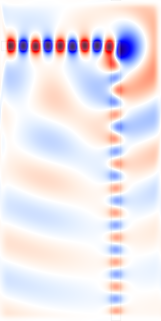
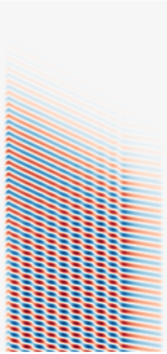

---
# Python Tutorial
---

We'll go through several examples using the Python interface that demonstrate the process of computing fields, transmittance/reflectance spectra, and resonant modes. The examples are 1d or 2d calculations, simply because they are quicker than 3d and they illustrate most of the essential features. For more advanced functionality involving 3d computations with a focus on technology applications, see the [Simpetus projects page](http://www.simpetus.com/projects.html).

[TOC]

The Meep Library
----------------

Meep simulations are Python scripts which involve specifying the device geometry, materials, current sources, monitor fields, and everything else necessary to set up a calculation. A Python script provides the flexibility to customize the simulation for practically any application particularly those involving parameter sweeps and optimization. Python libraries such as [NumPy](http://www.numpy.org/), [SciPy](https://www.scipy.org/), and [Matplotlib](https://matplotlib.org/) can be used to augment the simulation functionality and will also be demonstrated. Much of the functionality of the low-level C++ interface has been abstracted in Python which means that you don't need to be an experienced programmer to set up simulations. Reasonable defaults are available where necessary.

Executing Meep simulations is normally done at the Unix command line as follows:

```sh
 unix% python foo.py >& foo.out
```

which reads the Python script `foo.py` and executes it, saving the output to the file `foo.out`. If you want to set up simulations in interactive mode where you can type commands and see the results immediately, you will need to use either [IPython](http://ipython.org/) via a shell terminal or a [Jupyter notebook](https://jupyter.org/) via a browser. If you use one of these approaches, you can paste in the commands from the tutorial as you follow along and see what they do.

Fields in a Waveguide
---------------------

For our first example, let's examine the field pattern excited by a localized [CW](https://en.wikipedia.org/wiki/Continuous_wave) source in a waveguide &mdash; first straight, then bent. The waveguide will have frequency-independent ε=12 and width 1 μm. The unit length in this example is 1 μm. See also [Units](../Introduction.md#units-in-meep).

### A Straight Waveguide

The simulation script is in [examples/straight-waveguide.py](https://github.com/NanoComp/meep/blob/master/python/examples/straight-waveguide.py).

The first thing to do always is to load the Meep library:

```py
import meep as mp
```

We can begin specifying each of the simulation objects starting with the computational cell. We're going to put a source at one end and watch the fields propagate down the waveguide in the *x* direction, so let's use a cell of length 16 μm in the *x* direction to give it some distance to propagate. In the *y* direction, we just need enough room so that the boundaries do not affect the waveguide mode; let's give it a size of 8 μm.

```py
cell = mp.Vector3(16,8,0)
```
The `Vector3` object stores the size of the cell in each of the three coordinate directions. This is a 2d cell in *x* and *y* where the *z* direction has size 0.

Next we add the waveguide. Most commonly, the device structure is specified by a set of [`GeometricObject`s](../Python_User_Interface.md#geometricobject) stored in the `geometry` object.

```py
geometry = [mp.Block(mp.Vector3(mp.inf,1,mp.inf),
                     center=mp.Vector3(),
                     material=mp.Medium(epsilon=12))]
```

The waveguide is specified by a `Block` (parallelepiped) of size $\infty \times 1 \times \infty$, with $ε=12$, centered at (0,0) which is the center of the cell. By default, any place where there are no objects there is air ($ε=1$), although this can be changed by setting the `default_material` variable. The resulting structure is shown below.

<center></center>

We have the structure and need to specify the current sources using the `sources` object. The simplest thing is to add a single point source $J_z$:

```py
sources = [mp.Source(mp.ContinuousSource(frequency=0.15),
                     component=mp.Ez,
                     center=mp.Vector3(-7,0))]
```

We gave the source a frequency of 0.15, and specified a [`ContinuousSource`](../Python_User_Interface.md#continuoussource) which is just a fixed-frequency sinusoid $\exp(-i \omega t)$ that by default is turned on at $t=0$. Recall that, in [Meep units](../Introduction.md#units-in-meep), frequency is specified in units of 2πc, which is equivalent to the inverse of the vacuum wavelength. Thus, 0.15 corresponds to a vacuum wavelength of about 1/0.15=6.67 μm, or a wavelength of about 2 μm in the ε=12 material &mdash; thus, our waveguide is half a wavelength wide, which should hopefully make it single mode. In fact, the cutoff for single-mode behavior in this waveguide is analytically solvable, and corresponds to a frequency of 1/2√11 or roughly 0.15076. Note also that to specify a J<sub>z</sub>, we specify a component `Ez` (e.g., if we wanted a magnetic current, we would specify `Hx`, `Hy`, or `Hz`). The current is located at (-7,0), which is 1 μm to the right of the left edge of the cell &mdash; we always want to leave a little space between sources and the cell boundaries, to keep the boundary conditions from interfering with them.

As for boundary conditions, we want to add absorbing boundaries around our cell. Absorbing boundaries in Meep are handled by [perfectly matched layers](../Perfectly_Matched_Layer.md) (PML) &mdash;  which aren't really a boundary condition at all, but rather a fictitious absorbing material added around the edges of the cell. To add an absorbing layer of thickness 1 μm around all sides of the cell, we do:

```py
pml_layers = [mp.PML(1.0)]
```

`pml_layers` is a set of [`PML`](../Python_User_Interface.md#pml) objects &mdash; you may have more than one `PML` object if you want PML layers only on certain sides of the cell, e.g. `mp.PML(thickness=1.0,direction=mp.X,side=mp.high)` specifies a PML layer on only the $+x$ side. An important point: **the PML layer is *inside* the cell**, overlapping whatever objects you have there. So, in this case our PML overlaps our waveguide, which is what we want so that it will properly absorb waveguide modes. The finite thickness of the PML is important to reduce numerical reflections. For more information, see [Perfectly Matched Layer](../Perfectly_Matched_Layer.md).

Meep will discretize this structure in space and time, and that is specified by a single variable, `resolution`, that gives the number of pixels per distance unit. We'll set this resolution to 10 pixels/μm, which corresponds to around 67 pixels/wavelength, or around 20 pixels/wavelength in the high-index material. In general, at least 8 pixels/wavelength in the highest dielectric is a good idea. This will give us a 160×80 cell.

```py
resolution = 10
```

The final object to specify is [`Simulation`](../Python_User_Interface.md#the-simulation-class) which is based on all the previously defined objects.

```py
sim = mp.Simulation(cell_size=cell,
    	            boundary_layers=pml_layers,
                    geometry=geometry,
                    sources=sources,
                    resolution=resolution)
```

We are ready to run the simulation. We time step the fields until a time of 200:

```py
sim.run(until=200)
```

It should finish in less than a second. We can analyze and visualize the fields with the NumPy and Matplotlib libraries:

```py
import numpy as np
import matplotlib.pyplot as plt
```

We will first create an image of the dielectric function ε. This involves obtaining a slice of the data using the [`get_array`](../Python_User_Interface.md#array-slices) routine which outputs to a NumPy array and then display the results.

```py
eps_data = sim.get_array(center=mp.Vector3(), size=cell, component=mp.Dielectric)
plt.figure()
plt.imshow(eps_data.transpose(), interpolation='spline36', cmap='binary')
plt.axis('off')
plt.show()
```

Next, we create an image of the scalar electric field E<sub>z</sub> by overlaying the dielectric function. We use the "RdBu" [colormap](https://matplotlib.org/examples/color/colormaps_reference.html) which goes from dark red (negative) to white (zero) to dark blue (positive).

```py
ez_data = sim.get_array(center=mp.Vector3(), size=cell, component=mp.Ez)
plt.figure()
plt.imshow(eps_data.transpose(), interpolation='spline36', cmap='binary')
plt.imshow(ez_data.transpose(), interpolation='spline36', cmap='RdBu', alpha=0.9)
plt.axis('off')
plt.show()
```

<center></center>

We see that the the source has excited the waveguide mode but has also excited radiating fields propagating away from the waveguide. At the boundaries, the field quickly goes to zero due to the PML.

### A 90° Bend

We'll start a new simulation where we look at the fields propagating through a waveguide bend, and we'll do a couple of other things differently as well. The simulation script is in [examples/bent-waveguide.py](https://github.com/NanoComp/meep/blob/master/python/examples/bent-waveguide.py). As usual, the first thing to do is to load the Meep library:

```py
import meep as mp
```

Then let's set up the bent waveguide in a slightly larger cell:

```py
cell = mp.Vector3(16,16,0)
geometry = [mp.Block(mp.Vector3(12,1,mp.inf),
                     center=mp.Vector3(-2.5,-3.5),
                     material=mp.Medium(epsilon=12)),
            mp.Block(mp.Vector3(1,12,mp.inf),
                     center=mp.Vector3(3.5,2),
                     material=mp.Medium(epsilon=12))]
pml_layers = [mp.PML(1.0)]
resolution = 10
```

Note that we have *two* blocks, both off-center to produce the bent waveguide structure pictured below. As illustrated in the figure, the origin (0,0) of the coordinate system is at the center of the cell, with positive $y$ being downwards, and thus the block of size 12$\times$1 is centered at (-2,-3.5). Also shown in green is the source plane at $x=-7$ which is shifted to $y=-3.5$ so that it is still inside the waveguide.

<center></center>

There are a couple of items to note. First, a point source does not couple very efficiently to the waveguide mode, so we'll expand this into a line source, centered at (-7,-3.5), with the same width as the waveguide by adding a `size` property to the source. This is shown in green in the figure above. An [eigenmode source](../Python_User_Interface.md#eigenmodesource) can also be used which is described in [Tutorial/Optical Forces](Optical_Forces.md). Second, instead of turning the source on suddenly at t=0 which excites many other frequencies because of the discontinuity, we will ramp it on slowly. Meep uses a hyperbolic tangent (tanh) turn-on function over a time proportional to the `width` of 20 time units which is a little over three periods. Finally, just for variety, we'll specify the vacuum wavelength instead of the frequency; again, we'll use a wavelength such that the waveguide is half a wavelength wide.

```py
sources = [mp.Source(mp.ContinuousSource(wavelength=2*(11**0.5), width=20),
                     component=mp.Ez,
                     center=mp.Vector3(-7,-3.5),
                     size=mp.Vector3(0,1))]
```

Finally, we'll run the simulation. The first set of arguments to the `run` routine specify fields to output or other kinds of analyses at each time step.

```py
sim = mp.Simulation(cell_size=cell,
                    boundary_layers=pml_layers,
                    geometry=geometry,
                    sources=sources,
                    resolution=resolution)

sim.run(mp.at_beginning(mp.output_epsilon),
        mp.to_appended("ez", mp.at_every(0.6, mp.output_efield_z)),
        until=200)
```

We are outputting the dielectric function ε but have wrapped its output function which would otherwise run at every time step in `at_beginning`, which does just what it says. There are [several other such functions](../Python_User_Interface.md#run-and-step-functions) to modify the output behavior &mdash; and you can, of course, write your own, and in fact you can do any computation or output you want at any time during the time evolution and even modify the simulation while it is running.

Instead of running `output_efield_z` only at the end of the simulation, however, we run it at every 0.6 time units (about 10 times per period) via `mp.at_every(0.6, mp.output_efield_z)`. By itself, this would output a separate file for every different output time, but instead we'll use another feature to output to a *single* 3d HDF5 file, where the third dimension is time. `"ez"` determines the name of the output file, which will be called `ez.h5` if you are running interactively or will be prefixed with the name of the file name for a Python file (e.g. `tutorial-ez.h5` for `tutorial.py`). If we run `h5ls` on this file (a standard utility, included with HDF5, that lists the contents of the HDF5 file), we get:

```sh
unix% h5ls ez.h5
ez                       Dataset {160, 160, 333/Inf}
```

That is, the file contains a single dataset `ez` that is a 160x160x333 array, where the last dimension is time. This is rather a large file, 66MB; later, we'll see ways to reduce this size if we only want images. We have a number of choices of how to output the fields. To output a single time slice, we can use the same `h5topng` command, but with an additional `-t` option to specify the time index: e.g. `h5topng -t 332` will output the last time slice, similar to before. Instead, let's create an animation of the fields as a function of time. First, we have to create images for *all* of the time slices:

```sh
unix% h5topng -t 0:332 -R -Zc dkbluered -a yarg -A eps-000000.00.h5 ez.h5
```

This is similar to the command before with two new options: `-t 0:332` outputs images for *all* time indices from 0 to 332, i.e. all of the times, and the the `-R` flag tells h5topng to use a consistent color scale for every image (instead of scaling each image independently). Then, we have to convert these images into an animation in some format. For this, we'll use the free [ImageMagick](https://en.wikipedia.org/wiki/ImageMagick) `convert` program and there are other tools that work as well.

```sh
unix% convert ez.t*.png ez.gif
```

We are using an animated GIF format for the output. This results in the following animation:

<center></center>

It is clear that the transmission around the bend is rather low for this frequency and structure &mdash; both large reflection and large radiation loss are clearly visible. Moreover, since we are operating just barely below the cutoff for single-mode behavior, we are able to excite a second *leaky* mode after the waveguide bend, whose second-order mode pattern (superimposed with the fundamental mode) is apparent in the animation. Below, we show a field snapshot from a simulation with a larger cell along the $y$ direction, in which you can see that the second-order leaky mode decays away, leaving us with the fundamental mode propagating downward.

<center></center>

Instead of doing an animation, another interesting possibility is to make an image from a $x \times t$ slice. To get the $y=-3.5$ slice, which gives us an image of the fields in the first waveguide branch as a function of time, we can use `get_array` in a step function to collect a slice for each time step:

```python
vals = []

def get_slice(sim):
    vals.append(sim.get_array(center=mp.Vector3(0,-3.5), mp.Vector3(16,0), component=mp.Ez))

sim.run(mp.at_beginning(mp.output_epsilon),
        mp.at_every(0.6, get_slice),
        until=200)

import matplotlib.pyplot as plt

plt.figure()
plt.imshow(vals, interpolation='spline36', cmap='RdBu')
plt.axis('off')
plt.show()
```

<center></center>

#### Output Tips and Tricks

Above, we outputted the full 2d data slice at every 0.6 time units, resulting in a 69MB file. This is not large but you can imagine how big the output file would get if we were doing a 3d simulation, or even a larger 2d simulation &mdash; one can easily generate gigabytes of files, which is not only wasteful but is also slow. Instead, it is possible to output more efficiently if you know what you want to look at.

To create the movie above, all we really need are the *images* corresponding to each time. Images can be stored much more efficiently than raw arrays of numbers &mdash; to exploit this fact, Meep allows you to output PNG images instead of HDF5 files. In particular, instead of `output_efield_z` as above, we can use `mp.output_png(mp.Ez, "-Zc dkbluered")`, where Ez is the component to output and the `"-Zc` `dkbluered"` are options for `h5topng` of [h5utils](https://github.com/NanoComp/h5utils/blob/master/README.md) which is the program that is actually used to create the image files. That is:

```py
sim.run(mp.at_every(0.6 , mp.output_png(mp.Ez, "-Zc dkbluered")), until=200)        
```

will output a PNG file file every 0.6 time units, which can then be combined with `convert` as above to create a movie. The movie will be similar to the one before, but not identical because of how the color scale is determined. Before, we used the `-R` option to make h5topng use a uniform color scale for all images, based on the minimum/maximum field values over <i>all</i> time steps. That is not possible because we output an image before knowing the field values at future time steps. Thus, what `output_png` does is to set its color scale based on the minimum/maximum field values from all *past* times &mdash; therefore, the color scale will slowly "ramp up" as the source turns on.

The above command outputs zillions of PNG files, and it is somewhat annoying to have them clutter up our working directory. Instead, we can add the following command before `run`:

```py
sim.use_output_directory()
```

This will put *all* of the output files (.h5, .png, etcetera) into a newly-created subdirectory, called by default `filename-out/` if our Python script is `filename.py`.

What if we want to output an $x \times t$ slice, as above? To do this, we only really wanted the values at $y=-3.5$, and therefore we can exploit another powerful output feature &mdash; Meep allows us to output only **a subset of the computational cell**. This is done using the `in_volume` function, which like `at_every` and `to_appended` is another function that modifies the behavior of other output functions. In particular, we can do:

```
sim.run(mp.in_volume(mp.Volume(mp.Vector3(0,-3.5), size=mp.Vector3(16,0)), mp.to_appended("ez-slice", mp.output_efield_z)), until=200)        
```

The first argument to `in_volume` is a volume which applies to all of the nested output functions. Note that `to_appended`, `at_every`, and `in_volume` are cumulative regardless of what order you put them in. This creates the output file `ez-slice.h5` which contains a dataset of size 162x330 corresponding to the desired $x \times t$ slice.

Transmittance Spectrum of a Waveguide Bend
---------------------------------------------

We have computed the field patterns for light propagating around a waveguide bend. While this can be visually informative, the results are not quantitatively satisfying. We'd like to know exactly how much power makes it around the bend ([transmittance](https://en.wikipedia.org/wiki/Transmittance)), how much is reflected ([reflectance](https://en.wikipedia.org/wiki/Reflectance)), and how much is radiated away (scattered loss). How can we do this?

The basic principles are described in [Introduction](../Introduction.md#transmittancereflectance-spectra). The computation involves keeping track of the fields and their Fourier transform in a certain region, and from this computing the flux of electromagnetic energy as a function of ω. Moreover, we'll get an entire spectrum of the transmittance in a single run, by Fourier-transforming the response to a short pulse. However, in order to normalize the transmitted flux by the incident power to obtain the transmittance, we'll have to do *two* runs, one with and one without the bend (i.e., a straight waveguide).

The simulation script is in [examples/bend-flux.py](https://github.com/NanoComp/meep/blob/master/python/examples/bend-flux.py).

```py
import meep as mp
import numpy as np
import matplotlib.pyplot as plt

resolution = 10 # pixels/um

sx = 16  # size of cell in X direction
sy = 32  # size of cell in Y direction
cell = mp.Vector3(sx,sy,0)

dpml = 1.0
pml_layers = [mp.PML(dpml)]
```

We'll also define a couple of parameters to set the width of the waveguide and the "padding" between it and the edge of the cell:

```py
pad = 4  # padding distance between waveguide and cell edge
w = 1    # width of waveguide
```

In order to define the waveguide positions, we will have to use arithmetic to define the horizontal and vertical waveguide centers as:

```py
wvg_xcen =  0.5*(sx-w-2*pad)  # x center of horiz. wvg
wvg_ycen = -0.5*(sy-w-2*pad)  # y center of vert. wvg
```

We proceed to define the geometry. We have to do two simulations with different geometries: the bend, and also a straight waveguide for normalization. We will first set up the straight waveguide.

```py
geometry = [mp.Block(size=mp.Vector3(mp.inf,w,mp.inf),
                     center=mp.Vector3(0,wvg_ycen,0),
                     material=mp.Medium(epsilon=12))]
```

The source is a `GaussianSource` instead of a `ContinuousSrc`, parameterized by a center frequency and a frequency width (the width of the Gaussian spectrum).

```py
fcen = 0.15  # pulse center frequency
df = 0.1     # pulse width (in frequency)
sources = [mp.Source(mp.GaussianSource(fcen,fwidth=df),
                     component=mp.Ez,
                     center=mp.Vector3(-0.5*sx+dpml,wvg_ycen,0),
                     size=mp.Vector3(0,w,0))]
```

Notice how we're using our parameters like `wvg_ycen` and `w`: if we change the dimensions, everything will shift automatically.

Finally, we have to specify where we want Meep to compute the flux spectra, and at what frequencies. This must be done *after* specifying the `Simulation` object which contains the geometry, sources, resolution, etcetera, because all of the field parameters are initialized when flux planes are created. As described in [Introduction](../Introduction.md#transmittancereflectance-spectra), the flux is the integral of the Poynting vector over the specified [`FluxRegion`](../Python_User_Interface.md#fluxregion). It only integrates one component of the Poynting vector and the `direction` property specifies which component. In this example, since the `FluxRegion` is a line, the `direction` is its normal by default which therefore does not need to be explicitly defined.

```py
sim = mp.Simulation(cell_size=cell,
                    boundary_layers=pml_layers,
                    geometry=geometry,
                    sources=sources,
                    resolution=resolution)

nfreq = 100  # number of frequencies at which to compute flux

# reflected flux
refl_fr = mp.FluxRegion(center=mp.Vector3(-0.5*sx+dpml+0.5,wvg_ycen,0), size=mp.Vector3(0,2*w,0))                            
refl = sim.add_flux(fcen, df, nfreq, refl_fr)

# transmitted flux
tran_fr = mp.FluxRegion(center=mp.Vector3(0.5*sx-dpml,wvg_ycen,0), size=mp.Vector3(0,2*w,0))
tran = sim.add_flux(fcen, df, nfreq, tran_fr)
```

We compute the fluxes through a line segment twice the width of the waveguide, located at the beginning or end of the waveguide. Note that the flux lines are separated by length `dpml` from the boundary of the cell, so that they do not lie within the absorbing PML regions. Again, there are two cases: the transmitted flux is either computed at the right or the bottom of the cell, depending on whether the waveguide is straight or bent.

The fluxes will be computed for `nfreq=100` frequencies centered on `fcen`, from `fcen-df/2` to `fcen+df/2`. That is, we only compute fluxes for frequencies within our pulse bandwidth. This is important because, far outside the pulse bandwidth, the spectral power is so low that numerical errors make the computed fluxes useless.

As described in [Introduction](../Introduction.md#transmittancereflectance-spectra), computing the reflection spectra requires some care because we need to separate the incident and reflected fields. We do this by first saving the Fourier-transformed fields from the normalization run. And then, before we start the second run, we load these fields, *negated*. The latter subtracts the Fourier-transformed incident fields from the Fourier transforms of the scattered fields. Logically, we might subtract these after the run, but it turns out to be more convenient to subtract the incident fields first and then accumulate the Fourier transform. All of this is accomplished with two commands which use the raw simulation data: `get_flux_data` and `load_minus_flux_data`. We run the first simulation as follows:

```py    
pt = mp.Vector3(0.5*sx-dpml-0.5,wvg_ycen)

sim.run(until_after_sources=mp.stop_when_fields_decayed(50,mp.Ez,pt,1e-3))

# for normalization run, save flux fields data for reflection plane
straight_refl_data = sim.get_flux_data(refl)
```

We need to keep running after the source has turned off because we must give the pulse time to propagate completely across the cell. Moreover, the time required is a bit tricky to predict when you have complex structures, because there might be resonant phenomena that allow the source to bounce around for a long time. Therefore, it is convenient to specify the run time in a different way: instead of using a fixed time, we require that |E<sub>z</sub>|<sup>2</sup> at the end of the waveguide must have decayed by a given amount (1/1000) from its peak value.

The `stop_when_fields_decayed` routine takes four arguments: `dT`, `component`, `pt`, and `decay_by`. What it does is, after the sources have turned off, it keeps running for an additional `dT` time units every time the given |component|<sup>2</sup> at the given point has not decayed by at least `decay_by` from its peak value for all times within the previous `dT`. In this case, `dT=50`, the component is E<sub>z</sub>, the point is at the center of the flux plane at the end of the waveguide, and `decay_by=0.001`. So, it keeps running for an additional 50 time units until the square amplitude has decayed by 1/1000 from its peak. This should be sufficient to ensure that the Fourier transforms have converged.

Finally, we save the incident flux using `get_fluxes` which will be used later to compute the reflectance and the transmittance:

```py
# save incident power for transmission plane
straight_tran_flux = mp.get_fluxes(tran)
```

We need to run the second simulation which involves the waveguide bend. We reset the structure and fields using `reset_meep()` and redefine the `geometry`, `Simulation`, and flux objects. At the end of the simulation, we save the reflected and transmitted fluxes.

```py
sim.reset_meep()
    
geometry = [mp.Block(mp.Vector3(sx-pad,w,mp.inf), center=mp.Vector3(-0.5*pad,wvg_ycen), material=mp.Medium(epsilon=12)),
            mp.Block(mp.Vector3(w,sy-pad,mp.inf), center=mp.Vector3(wvg_xcen,0.5*pad), material=mp.Medium(epsilon=12))]

sim = mp.Simulation(cell_size=cell,
                    boundary_layers=pml_layers,
                    geometry=geometry,
                    sources=sources,
                    resolution=resolution)

# reflected flux
refl = sim.add_flux(fcen, df, nfreq, refl_fr)

tran_fr = mp.FluxRegion(center=mp.Vector3(wvg_xcen,0.5*sy-dpml-0.5,0), size=mp.Vector3(2*w,0,0))
tran = sim.add_flux(fcen, df, nfreq, tran_fr)
    
# for normal run, load negated fields to subtract incident from refl. fields
sim.load_minus_flux_data(refl, straight_refl_data)

pt = mp.Vector3(wvg_xcen,0.5*sy-dpml-0.5)

sim.run(until_after_sources=mp.stop_when_fields_decayed(50, mp.Ez, pt, 1e-3))

bend_refl_flux = mp.get_fluxes(refl)
bend_tran_flux = mp.get_fluxes(tran)

flux_freqs = mp.get_flux_freqs(refl)
```

With the flux data, we are ready to compute and plot the reflectance and transmittance. The reflectance is the reflected flux divided by the incident flux. We also have to multiply by -1 because all fluxes in Meep are computed in the positive-coordinate direction by default, and we want the flux in the $-x$ direction. The transmittance is the transmitted flux divided by the incident flux. Finally, the scattered loss is simply $1-transmittance-reflectance$. The results are plotted in the accompanying figure.
 
```py
wl = []
Rs = []
Ts = []
for i in range(nfreq):
    wl = np.append(wl, 1/flux_freqs[i])
    Rs = np.append(Rs,-bend_refl_flux[i]/straight_tran_flux[i])
    Ts = np.append(Ts,bend_tran_flux[i]/straight_tran_flux[i])    

if mp.am_master():
    plt.figure()
    plt.plot(wl,Rs,'bo-',label='reflectance')
    plt.plot(wl,Ts,'ro-',label='transmittance')
    plt.plot(wl,1-Rs-Ts,'go-',label='loss')
    plt.axis([5.0, 10.0, 0, 1])
    plt.xlabel("wavelength (μm)")
    plt.legend(loc="upper right")
    plt.show()
```

<center></center>

We should also check whether our data is converged. We can do this by increasing the resolution and cell size and seeing by how much the numbers change. In this case, we'll try doubling the cell size:

```py
sx=32
sy=64
```

Again, we must run both simulations in order to get the normalization right. The results are included in the plot above as dotted lines &mdash; you can see that the numbers have changed slightly for transmittance and loss, probably stemming from interference between light radiated directly from the source and light propagating around the waveguide.

Angular Reflectance Spectrum of a Planar Interface
--------------------------------------------------

We turn to a similar but slightly different example for which there exists an analytic solution via the [Fresnel equations](https://en.wikipedia.org/wiki/Fresnel_equations): computing the broadband reflectance spectrum of a planar air-dielectric interface for an incident planewave over a range of angles. Similar to the previous example, we will need to run two simulations: (1) an empty cell with air/vacuum (n=1) everywhere to obtain the incident flux, and (2) with the dielectric (n=3.5) interface to obtain the reflected flux. For each angle of the incident planewave, a separate simulation is necessary.

A 1d cell must be used since a higher-dimensional cell will introduce [artificial modes due to band folding](../FAQ.md#why-are-there-strange-peaks-in-my-reflectancetransmittance-spectrum-when-modeling-planar-or-periodic-structures). We will use a Gaussian source spanning visible wavelengths of 0.4 to 0.8 μm. Unlike a [continuous-wave](../Python_User_Interface.md#continuoussource) (CW) source, a pulsed source turns off. This enables a termination condition of when there are no fields remaining in the cell (due to absorption by the PMLs) via the [run function](../Python_User_Interface.md#run-functions) `stop_when_fields_decayed`, similar to the previous example.

Creating an oblique planewave source typically requires specifying two parameters: (1) for periodic structures, the Bloch-periodic wavevector $\vec{k}$ via `k_point`, and (2) the source amplitude function `amp_func` for setting the $e^{i\vec{k} \cdot \vec{r}}$ spatial dependence ($\vec{r}$ is the position vector). Since we have a 1d cell and the source is at a single point, it is not necessary to specify the source amplitude (see this [2d example](https://github.com/NanoComp/meep/blob/master/python/examples/pw-source.py) for how this is done). The magnitude of the Bloch-periodic wavevector is specified according to the dispersion relation formula for a planewave in homogeneous media with index n: $\omega=c|\vec{k}|/n$. As the source in this example is incident from air, $|\vec{k}|$ is simply equal to the frequency ω (the minimum frequency of the pulse which excludes the 2π factor). Note that a fixed wavevector only applies to a single frequency. Any broadband source is therefore incident at a specified angle for only a *single* frequency. This is described in more detail in Section 4.5 ("Efficient Frequency-Angle Coverage") in [Chapter 4](https://arxiv.org/abs/1301.5366) ("Electromagnetic Wave Source Conditions") of the book [Advances in FDTD Computational Electrodynamics: Photonics and Nanotechnology](https://www.amazon.com/Advances-FDTD-Computational-Electrodynamics-Nanotechnology/dp/1608071707).

In this example, the plane of incidence which contains $\vec{k}$ and the surface normal vector is $xz$. The source angle θ is defined in degrees in the counterclockwise (CCW) direction around the $y$ axis with 0 degrees along the +$z$ axis. In Meep, a 1d cell is defined along the $z$ direction. When $\vec{k}$ is not set, only the E<sub>x</sub> and H<sub>y</sub> field components are permitted. A non-zero $\vec{k}$ results in a 3d simulation where all field components are allowed and are complex (the fields are real, by default). A current source with E<sub>x</sub> polarization lies in the plane of incidence and corresponds to the convention of $\mathcal{P}$-polarization. In order to model the $\mathcal{S}$-polarization, we must use an E<sub>y</sub> source. This example involves just the $\mathcal{P}$-polarization.

The simulation script is [examples/refl-angular.py](https://github.com/NanoComp/meep/blob/master/python/examples/refl-angular.py)

```py
import meep as mp
import argparse
import math

def main(args):

    resolution = args.res

    dpml = 1.0              # PML thickness
    sz = 10                 # size of cell (without PMLs)
    sz = 10 + 2*dpml
    cell_size = mp.Vector3(0,0,sz)
    pml_layers = [mp.PML(dpml)]

    wvl_min = 0.4           # min wavelength
    wvl_max = 0.8           # max wavelength
    fmin = 1/wvl_max        # min frequency
    fmax = 1/wvl_min        # max frequency
    fcen = 0.5*(fmin+fmax)  # center frequency
    df = fmax-fmin          # frequency width
    nfreq = 50              # number of frequency bins
    
    # rotation angle (in degrees) of source: CCW around Y axis, 0 degrees along +Z axis
    theta_r = math.radians(args.theta)

    # plane of incidence is xz
    k = mp.Vector3(math.sin(theta_r),0,math.cos(theta_r)).scale(fmin)

    # if normal incidence, force number of dimensions to be 1
    if theta_r == 0:
        dimensions = 1
    else:
        dimensions = 3
    
    sources = [mp.Source(mp.GaussianSource(fcen,fwidth=df), component=mp.Ex, center=mp.Vector3(0,0,-0.5*sz+dpml))]

    sim = mp.Simulation(cell_size=cell_size,
                        boundary_layers=pml_layers,
                        sources=sources,
                        k_point=k,
                        dimensions=dimensions,
                        resolution=resolution)

    refl_fr = mp.FluxRegion(center=mp.Vector3(0,0,-0.25*sz))
    refl = sim.add_flux(fcen, df, nfreq, refl_fr)
    
    sim.run(until_after_sources=mp.stop_when_fields_decayed(50, mp.Ex, mp.Vector3(0,0,-0.5*sz+dpml), 1e-9))

    empty_flux = mp.get_fluxes(refl)
    empty_data = sim.get_flux_data(refl)
    sim.reset_meep()

    # add a block with n=3.5 for the air-dielectric interface
    geometry = [mp.Block(mp.Vector3(mp.inf,mp.inf,0.5*sz), center=mp.Vector3(0,0,0.25*sz), material=mp.Medium(index=3.5))]

    sim = mp.Simulation(cell_size=cell_size,
                        geometry=geometry,
                        boundary_layers=pml_layers,
                        sources=sources,
                        k_point=k,
                        dimensions=dimensions,
                        resolution=resolution)

    refl = sim.add_flux(fcen, df, nfreq, refl_fr)
    sim.load_minus_flux_data(refl, empty_data)

    sim.run(until_after_sources=mp.stop_when_fields_decayed(50, mp.Ex, mp.Vector3(0,0,-0.5*sz+dpml), 1e-9))

    refl_flux = mp.get_fluxes(refl)
    freqs = mp.get_flux_freqs(refl)
    
    for i in range(nfreq):
        print("refl:, {}, {}, {}, {}".format(k.x,1/freqs[i],math.degrees(math.asin(k.x/freqs[i])),-refl_flux[i]/empty_flux[i]))
    
if __name__ == '__main__':
    parser = argparse.ArgumentParser()
    parser.add_argument('-res', type=int, default=200, help='resolution (default: 200 pixels/um)')
    parser.add_argument('-theta', type=float, default=0, help='angle of incident planewave (default: 0 degrees)')
    args = parser.parse_args()
    main(args)
```

The simulation script above computes and prints to standard output the reflectance at each frequency. Also included in the output is the wavevector component $k_x$ and the corresponding angle for the ($k_x$, ω) pair. For those frequencies not equal to the minimum frequency of the source, this is *not* the same as the specified angle of the incident planewave, but rather sin<sup>-1</sup>(k<sub>x</sub>/ω).

Note that there are two argument parameters which can be passed to the script at runtime: the resolution of the grid and the angle of the incident planewave. The following Bash shell script runs the simulation for the wavelength range of 0$^\circ$ to 80$^\circ$ in increments of 5$^\circ$. For each run, the script pipes the output to one file and extracts the reflectance data to a different file.

```sh
#!/bin/bash

for i in `seq 0 5 80`; do
    python -u refl-angular.py -theta $i |tee -a flux_t${i}.out;
    grep refl: flux_t${i}.out |cut -d , -f2- > flux_t${i}.dat;
done
```

Two-dimensional plots of the angular reflectance spectrum based on the simulated data and the analytic [Fresnel equations](https://en.wikipedia.org/wiki/Fresnel_equations) are generated using the Python script below. The plots are shown in the accompanying figure with four insets. The top left inset shows the simulated and analytic reflectance spectra at a wavelength of 0.6 μm. The top right inset shows the simulated reflectance spectrum as a function of the source wavelength λ and Bloch-periodic wavevector $k_x$: $R(\lambda, k_x)$. The lower left inset is a transformation of $R(\lambda, k_x)$ into $R(\lambda, \theta)$. Note how the range of angles depends on the wavelength. For a particular angle, the reflectance is a constant for all wavelengths due to the dispersionless dielectric. The lower right inset is the analytic reflectance spectrum computed using the Fresnel equations. There is agreement between the simulated and analytic results. The [Brewster's angle](https://en.wikipedia.org/wiki/Brewster%27s_angle), where the transmittance is 1 and the reflectance is 0, is tan<sup>-1</sup>(3.5/1)=74.1°. This is also verified by the simulated results.

In order to generate results for the missing portion of the reflectance spectrum (i.e., the white region), we will need to rerun the simulations for different wavelength spectra.

```py
import matplotlib.pyplot as plt
import numpy as np
import numpy.matlib
import math

theta_in = np.arange(0,85,5)
kxs = np.empty((50,theta_in.size))
thetas = np.empty((50,theta_in.size))
Rmeep = np.empty((50,theta_in.size))

for j in range(theta_in.size):
  f = np.genfromtxt("flux_t{}.dat".format(theta_in[j]), delimiter=",")
  kxs[:,j] = f[:,0]
  thetas[:,j] = f[:,2]
  Rmeep[:,j] = f[:,3]

wvl = f[:,1]
# create a 2d matrix for the wavelength by repeating the column vector for each angle
wvls = np.matlib.repmat(np.reshape(wvl, (wvl.size,1)),1,theta_in.size)

plt.figure()
plt.pcolormesh(kxs, wvls, Rmeep, cmap='hot', shading='gouraud', vmin=0, vmax=Rmeep.max())
plt.axis([kxs[0,0], kxs[0,-1], wvl[-1], wvl[0]])
plt.yticks([t for t in np.arange(0.4,0.9,0.1)])
plt.xlabel("Bloch-periodic wavevector ($k_x/2π$)")
plt.ylabel("wavelength (μm)")
plt.title("reflectance (meep)")
cbar = plt.colorbar()
cbar.set_ticks([t for t in np.arange(0,0.4,0.1)])
cbar.set_ticklabels(["{:.1f}".format(t) for t in np.arange(0,0.4,0.1)])
plt.show()

plt.figure()
plt.pcolormesh(thetas, wvls, Rmeep, cmap='hot', shading='gouraud', vmin=0, vmax=Rmeep.max())
plt.axis([thetas.min(), thetas.max(), wvl[-1], wvl[0]])
plt.xticks([t for t in range(0,100,20)])
plt.yticks([t for t in np.arange(0.4,0.9,0.1)])
plt.xlabel("angle of incident planewave (degrees)")
plt.ylabel("wavelength (μm)")
plt.title("reflectance (meep)")
cbar = plt.colorbar()
cbar.set_ticks([t for t in np.arange(0,0.4,0.1)])
cbar.set_ticklabels(["{:.1f}".format(t) for t in np.arange(0,0.4,0.1)])
plt.show()

n1=1
n2=3.5

# compute angle of refracted planewave in medium n2
# for incident planewave in medium n1 at angle theta_in
theta_out = lambda theta_in: math.asin(n1*math.sin(theta_in)/n2)

# compute Fresnel reflectance for P-polarization in medium n2
# for incident planewave in medium n1 at angle theta_in
Rfresnel = lambda theta_in: math.fabs((n1*math.cos(theta_out(theta_in))-n2*math.cos(theta_in))/(n1*math.cos(theta_out(theta_in))+n2*math.cos(theta_in)))**2

Ranalytic = np.empty((50, theta_in.size))
for m in range(wvl.size):
    for n in range(theta_in.size):
        Ranalytic[m,n] = Rfresnel(math.radians(thetas[m,n]))

plt.figure()
plt.pcolormesh(thetas, wvls, Ranalytic, cmap='hot', shading='gouraud', vmin=0, vmax=Ranalytic.max())
plt.axis([thetas.min(), thetas.max(), wvl[-1], wvl[0]])
plt.xticks([t for t in range(0,100,20)])
plt.yticks([t for t in np.arange(0.4,0.9,0.1)])
plt.xlabel("angle of incident planewave (degrees)")
plt.ylabel("wavelength (μm)")
plt.title("reflectance (analytic)")
cbar = plt.colorbar()
cbar.set_ticks([t for t in np.arange(0,0.4,0.1)])
cbar.set_ticklabels(["{:.1f}".format(t) for t in np.arange(0,0.4,0.1)])
plt.show()
```

<center></center>

Modes of a Ring Resonator
-------------------------

As described in [Introduction](../Introduction.md#resonant-modes), another common task for FDTD simulation is to find the resonant modes &mdash; frequencies and decay rates &mdash; of some cavity structure. You might want to read that again to recall the basic simulation strategy. We will show how this works for a ring resonator, which is simply a waveguide bent into a circle. This script can be also found in [examples/ring.py](https://github.com/NanoComp/meep/blob/master/python/examples/ring.py). In fact, since this structure has cylindrical symmetry, we can simulate it much more efficiently by using cylindrical coordinates, but for illustration here we'll just use an ordinary 2d simulation.

As before, we'll define some parameters to describe the geometry, so that we can easily change the structure:

```py
n = 3.4                 # index of waveguide
w = 1                   # width of waveguide
r = 1                   # inner radius of ring
pad = 4                 # padding between waveguide and edge of PML
dpml = 2                # thickness of PML
sxy = 2*(r+w+pad+dpml)  # cell size
```

How do we make a circular waveguide? So far, we've only seen `Block` objects, but Meep also lets you specify cylinders, spheres, ellipsoids, and cones, as well as user-specified dielectric functions. In this case, we'll use two `Cylinder` objects, one inside the other:

```py
c1 = mp.Cylinder(radius=r+w, material=mp.Medium(index=n))
c2 = mp.Cylinder(radius=r)
```

Later objects in the `geometry` object take precedence over or rather lie "on top of" earlier objects, so the second `air` (ε=1) cylinder cuts a circular hole out of the larger cylinder, leaving a ring of width w.

We don't know the frequency of the mode(s) ahead of time, so we'll just hit the structure with a broad Gaussian pulse to excite all of the E<sub>z</sub>-polarized modes in a chosen bandwidth:

```py
fcen = 0.15              # pulse center frequency
df = 0.1                 # pulse frequency width
src = mp.Source(mp.GaussianSource(fcen, fwidth=df), mp.Ez, mp.Vector3(r+0.1))
```

Finally, we are ready to run the simulation. The basic idea is to run until the sources are finished, and then to run for some additional period of time. In that additional period, we'll perform some signal processing on the fields at some point with [Harminv](https://github.com/NanoComp/harminv/blob/master/README.md) to identify the frequencies and decay rates of the modes that were excited:

```py
sim = mp.Simulation(cell_size=mp.Vector3(sxy, sxy),
                    geometry=[c1, c2],
                    sources=[src],
                    resolution=10,                    
                    boundary_layers=[mp.PML(dpml)])

sim.run(mp.at_beginning(mp.output_epsilon),
        mp.after_sources(mp.Harminv(mp.Ez, mp.Vector3(r+0.1), fcen, df)),
        until_after_sources=300)
```

The signal processing is performed by the `Harminv` routine, which takes four arguments: the field component E<sub>z</sub> and position ($r$+0.1,0) to analyze, and a frequency range given by a center frequency and bandwidth (same as the source pulse). Note that we wrap `Harminv` in `after_sources(...)`, since we only want to analyze the frequencies in the source-free system (the presence of a source will distort the analysis). At the end of the run, `Harminv` prints a series of lines (beginning with `harminv0:`) listing the frequencies it found:

```
harminv0:, frequency, imag. freq., Q, |amp|, amplitude, error
harminv0:, 0.118101575043663, -7.31885828253851e-4, 80.683059081382, 0.00341388964904578, -0.00305022905294175-0.00153321402956404i, 1.02581433904604e-5
harminv0:, 0.147162555528154, -2.32636643253225e-4, 316.29272471914, 0.0286457663908165, 0.0193127882016469-0.0211564681361413i, 7.32532621851082e-7
harminv0:, 0.175246750722663, -5.22349801171605e-5, 1677.48461212767, 0.00721133215656089, -8.12770506086109e-4-0.00716538314235085i, 1.82066436470489e-7
```

There are six, comma-delimited columns in addition to the label. These results are also stored in `Harminv.modes`. The meaning of these columns is as follows. `Harminv` analyzes the fields $f(t)$ at the given point, and expresses this as a sum of modes in the specified bandwidth:

$$f(t) = \sum_n a_n e^{-i \omega_n t}$$

for complex amplitudes $a_n$ and complex frequencies ω$_n$. The six columns relate to these quantities. The first column is the *real* part of ω$_n$, expressed in our usual 2πc units, and the second column is the *imaginary* part &mdash; a negative imaginary part corresponds to an exponential decay. This decay rate, for a cavity, is more often expressed as a dimensionless "lifetime" $Q$, defined by:

$$Q = \frac{\mathrm{Re}\,\omega}{-2 \mathrm{Im}\,\omega}.$$

$Q$ is the number of optical periods for the energy to decay by $\exp(-2\pi)$, and 1/$Q$ is the fractional bandwidth at half-maximum of the resonance peak in Fourier domain. This $Q$ is the third column of the output. The fourth and fifth columns are the absolute value $|a_n|$ and complex amplitudes $a_n$. The last column is a crude measure of the error in the frequency (both real and imaginary). If the error is much larger than the imaginary part, for example, then you can't trust the $Q$ to be accurate. Note: this error is only the *uncertainty in the signal processing*, and tells you nothing about the errors from finite resolution, finite cell size, and so on.

An interesting question is how long should we run the simulation, after the sources are turned off, in order to analyze the frequencies. With traditional Fourier analysis, the time would be proportional to the frequency resolution required, but with `Harminv` the time is much shorter. For example, there are three modes. The last has a $Q$ of 1677, which means that the mode decays for about 2000 periods or about 2000/0.175 = 10<sup>4</sup> time units. We have only analyzed it for about 300 time units, however, and the estimated uncertainty in the frequency is 10<sup>-7</sup> (with an actual error of about 10<sup>-6</sup>, from below). In general, you need to increase the run time to get more accuracy, and to find very high $Q$ values, but not by much. In some cases, modes with $Q$ of around 10<sup>9</sup> can be found with only 200 periods.

In this case, we found three modes in the specified bandwidth, at frequencies of 0.118, 0.147, and 0.175, with corresponding $Q$ values of 81, 316, and 1677. As was shown by [Marcatilli in 1969](https://ieeexplore.ieee.org/document/6769758/), the $Q$ of a ring resonator increases *exponentially* with the product of ω and ring radius. Suppose that we want to actually see the field patterns of these modes. No problem: we just re-run the simulation with a *narrow*-band source around each mode and output the field at the end.

In particular, to output the field at the end we might add an `at_end(mp.output_efield_z)` argument to our `run_after_sources` routine, but this is problematic: we might be unlucky and output at a time when the E<sub>z</sub> field is almost zero (i.e. when all of the energy is in the magnetic field), in which case the picture will be deceptive. Instead, at the end of the run we'll output 20 field snapshots over a whole period 1/`fcen` by appending the command:

```py
sim.run(mp.at_every(1/fcen/20, mp.output_efield_z), until=1/fcen)
```

We can get our modes just by changing two parameters and re-running:

```py
fcen=0.118
df=0.01
```

After each one of these commands, we'll convert the fields into PNG images and thence into an animated GIF (as with the bend movie, above), via:

```sh
unix% h5topng -RZc dkbluered -C ring-eps-000000.00.h5 ring-ez-*.h5
unix% convert ring-ez-*.png ring-ez-0.118.gif
```

The resulting animations for (from left to right) 0.118, 0.147, and 0.175, are below, in which you can clearly see the radiating fields that produce the losses:

<center>


</center>

Each of these modes is, of course, doubly-degenerate according to the representations of the $C_{\infty\mathrm{v}}$ symmetry group. The other mode is simply a slight rotation of this mode to make it *odd* through the $x$ axis, whereas we excited only the *even* modes due to our source symmetry. Equivalently, one can form clockwise and counter-clockwise propagating modes by taking linear combinations of the even/odd modes, corresponding to an angular $\phi$ dependence $e^{\pm i m\phi}$ for m=3, 4, and 5 in this case.

You may have noticed, by the way, that when you run with the narrow-bandwidth source, `Harminv` gives you slightly different frequency and $Q$ estimates, with a much smaller error estimate &mdash; this is not too strange, since by exciting a single mode you generate a cleaner signal that can be analyzed more accurately. For example, the narrow-bandwidth source for the ω=0.175 mode gives:

```
harminv0:, 0.175247426698716, -5.20844416909221e-5, 1682.33949533974, 0.185515412838043, 0.127625313330642-0.13463932485617i, 7.35320734698267e-12
```

which differs by about 10<sup>-6</sup> from the earlier estimate; the difference in $Q$ is, of course, larger because a small absolute error in ω gives a larger relative error in the small imaginary frequency.

### Exploiting Symmetry

In this case, because we have a mirror symmetry plane (the $x$ axis) that preserves both the structure and the sources, we can exploit this mirror symmetry to speed up the computation. See also [Exploiting Symmetry](../Exploiting_Symmetry.md). In particular, everything about the script is the same except that we specify an additional object for the `Simulation` class:

```py
symmetries=[mp.Mirror(mp.Y)]
```

This tells Meep to exploit a mirror-symmetry plane through the origin perpendicular to the $y$ direction. Meep does not check whether your system really has this symmetry &mdash; you should only specify symmetries that really preserve your structure and your sources.

Everything else about your simulation is the same: you can still get the fields at any point, the output file still covers the whole ring, and the harminv outputs are exactly the same. Internally, however, Meep is only doing computations with half of the structure, and the simulation is around twice as fast.

In general, the symmetry of the sources may require some phase. For example, if our source was in the $y$ direction instead of the $z$ direction, then the source would be *odd* under mirror flips through the $x$ axis. We would specify this by `mp.Mirror(mp.Y, phase=-1)`. See [User Interface](../Python_User_Interface.md#symmetry) for more symmetry possibilities.

In this case, we actually have a lot more symmetry that we could potentially exploit, if we are willing to restrict the symmetry of our source/fields to a particular angular momentum (i.e. angular dependence $e^{im\phi}$). See also [Tutorial/Ring Resonator in Cylindrical Coordinates](Ring_Resonator_in_Cylindrical_Coordinates.md) for how to solve for modes of this cylindrical geometry much more efficiently.

Visualizing 3d Structures
-------------------------

The previous examples were based on a 1d or 2d cell in which the structure and fields can be visualized using the plotting routines in Matplotlib. In order to visualize 3d structures, you can use [Mayavi](https://docs.enthought.com/mayavi/mayavi/). The following example involves a hexagonal [prism](../Python_User_Interface.md#prism) with index 3.5 perforated by a [conical](../Python_User_Interface.md#cone) hole. There are no other simulation parameters specified. The permittivity data is visualized using an isosurface plot via the [contour3d](http://docs.enthought.com/mayavi/mayavi/auto/mlab_helper_functions.html#mayavi.mlab.contour3d) module. A snapshot of this plot is shown below. For visualization of the vector fields in 3d, you can use the [quiver3d](http://docs.enthought.com/mayavi/mayavi/auto/mlab_helper_functions.html#mayavi.mlab.quiver3d) module.

```py
import meep as mp
import numpy as np
import math

cell_size = mp.Vector3(2,2,2)

# A hexagon is defined as a prism with six vertices centered on the origin
vertices = [mp.Vector3(-1,0),
            mp.Vector3(-0.5,math.sqrt(3)/2),
            mp.Vector3(0.5,math.sqrt(3)/2),
            mp.Vector3(1,0),
            mp.Vector3(0.5,-math.sqrt(3)/2),
            mp.Vector3(-0.5,-math.sqrt(3)/2)]

geometry = [mp.Prism(vertices, height=1.0, material=mp.Medium(index=3.5)),
            mp.Cone(radius=1.0, radius2=0.1, height=2.0, material=mp.air)]

sim = mp.Simulation(resolution=50,
                    cell_size=cell_size,
                    geometry=geometry)

sim.init_sim()

eps_data = sim.get_epsilon()

from mayavi import mlab
s = mlab.contour3d(eps_data, colormap="YlGnBu")
mlab.show()
```

<center>

</center>

Alternatively, the permittivity can be visualized from outside of Python. This involves writing the permittivity data to an HDF5 file using [output_epsilon](../Python_User_Interface.md#output-functions). The HDF5 data is then converted to [VTK](https://en.wikipedia.org/wiki/VTK) via [h5tovtk](https://github.com/NanoComp/h5utils/blob/master/doc/h5tovtk-man.md) of the [h5utils](https://github.com/NanoComp/h5utils) package. VTK data can be visualized using Mayavi or Paraview.