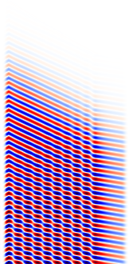

---
# Python Tutorial
---

In this page, we'll go through a couple of simple examples using the Python interface that illustrate the process of computing fields, transmission/reflection spectra, and resonant modes. All of the examples here are 2d calculations, simply because they are quicker than 3d and they illustrate most of the essential features. For more advanced functionality involving 3d computations, see the [Simpetus projects page](http://simpetus.com/projects.html).

[TOC]

The Meep Python Library
-----------------------

Meep simulations are Python scripts which involve specifying the device geometry, materials, current sources, monitor fields, and everything else necessary to set up a calculation. A Python script provides the flexibility to customize the simulation for practically any application particularly those involving parameter sweeps and optimization. Python libraries such as [NumPy](http://www.numpy.org/), [SciPy](https://www.scipy.org/), and [matplotlib](https://matplotlib.org/) can be used to augment the simulation functionality which will also be demonstrated. Much of the low-level functionality of the Python interface has been abstracted which means that you don't need to be an experienced programmer to set up simulations. Reasonable defaults are available.

Executing Meep programs is normally done at the Unix command line as follows:

```sh
 unix% python foo.py >& foo.out
```

which reads the Python script `foo.py` and executes it, saving the output to the file `foo.out`. If you want to set up simulations in interactive mode where you can type commands and see the results immediately, you will need to use either [IPython](http://ipython.org/) via a shell terminal or a [Jupyter notebook](https://jupyter.org/) via a web browser. If you use one of these approaches now, you can paste in the commands from the tutorial as you follow it and see what they do.

Fields in a Waveguide
---------------------

For our first example, let's examine the field pattern excited by a localized CW source in a waveguide &mdash; first straight, then bent. Our waveguide will have non-dispersive $\varepsilon=12$ and width 1 &#956;m. Our unit length in this example is 1 &#956;m. See also [Units](../Introduction.md#units-in-meep).

### A Straight Waveguide

The first thing to do in any script is to load the Meep library module:

```py
import meep as mp
```

Now we can begin specifying each of the simulation objects starting with the computational cell. We're going to put a source at one end and watch the fields propagate down the waveguide in the *x* direction, so let's use a cell of length 16 &#956;m in the *x* direction to give it some distance to propagate. In the *y* direction, we just need enough room so that the boundaries do not affect the waveguide mode; let's give it a size of 8 &#956;m.

```py
cell = mp.Vector3(16, 8, 0)
```
The `Vector3` object stores the size of the computational cell in each of the three coordinate directions. This is a 2d computational cell in *x* and *y* where the *z* direction has size 0.

Next we add the waveguide. Most commonly, the device structure is specified by a set of geometric objects stored in the `geometry` object. Here, we do:

```py
geometry = [mp.Block(mp.Vector3(1e20, 1, 1e20),
                     center=mp.Vector3(0, 0),
                     material=mp.Medium(epsilon=12))]
```

The waveguide is specified by a `Block` (parallelepiped) of size $\infty \times 1 \times \infty$, with $\varepsilon=12$, centered at (0,0) which is the center of the computational cell. By default, any place where there are no objects there is air ($\varepsilon=1$), although this can be changed by setting the `default_material` variable. The resulting structure is shown below.

<center></center>

Now that we have the structure, we need to specify the current sources using the `sources` object. The simplest thing is to add a single point source $J_z$:

```py
sources = [mp.Source(mp.ContinuousSource(frequency=0.15),
                     component=mp.Ez,
                     center=mp.Vector3(-7,0))]
```

Here, we gave the source a frequency of 0.15, and specified a `ContinuousSrc` which is just a fixed-frequency sinusoid $\exp(-i\omega t)$ that by default is turned on at $t=0$. Recall that, in [Meep units](../Introduction.md#units-in-meep), frequency is specified in units of $2\pi c$, which is equivalent to the inverse of vacuum wavelength. Thus, 0.15 corresponds to a vacuum wavelength of about $1/0.15=6.67$ &#956;m, or a wavelength of about 2 in the $\varepsilon=12$ material &mdash; thus, our waveguide is half a wavelength wide, which should hopefully make it single mode. In fact, the cutoff for single-mode behavior in this waveguide is analytically solvable, and corresponds to a frequency of 1/2√11 or roughly 0.15076. Note also that to specify a $J_z$, we specify a component `Ez` (e.g., if we wanted a magnetic current, we would specify `Hx`, `Hy`, or `Hz`). The current is located at $(-7,0)$, which is 1 &#956;m to the right of the left edge of the cell—we always want to leave a little space between sources and the cell boundaries, to keep the boundary conditions from interfering with them.

Speaking of boundary conditions, we want to add absorbing boundaries around our cell. Absorbing boundaries in Meep are handled by [perfectly matched layers](../Perfectly_Matched_Layer.md) (PML)— which aren't really a boundary condition at all, but rather a fictitious absorbing material added around the edges of the cell. To add an absorbing layer of thickness 1 around all sides of the cell, we do:

```py
pml_layers = [mp.PML(1.0)]
```

`pml_layers` is a set of `pml` objects &mdash; you may have more than one `pml` object if you want PML layers only on certain sides of the cell, e.g. `mp.PML(thickness=1.0,direction=mp.X,side=mp.high)` specifies a PML layer on only the $+x$ side. An important point: **the PML layer is *inside* the cell**, overlapping whatever objects you have there. So, in this case our PML overlaps our waveguide, which is what we want so that it will properly absorb waveguide modes. The finite thickness of the PML is important to reduce numerical reflections; see [Perfectly Matched Layer](../Perfectly_Matched_Layer.md) for more information.

Meep will discretize this structure in space and time, and that is specified by a single variable, `resolution`, that gives the number of pixels per distance unit. We'll set this resolution to 10, which corresponds to around 67 pixels/wavelength, or around 20 pixels/wavelength in the high-dielectric material. In general, at least 8 pixels/wavelength in the highest dielectric is a good idea. This will give us a $160\times80$ cell.

```py
resolution = 10
```

The final object to specify is `Simulation` which is based on all the previously defined objects.

```py
sim = mp.Simulation(cell_size=cell,
    	            boundary_layers=pml_layers,
                    geometry=geometry,
                    sources=sources,
                    resolution=resolution)
```

Now, we are ready to run the simulation! The first set of arguments to the `run` routine specify fields to output or other kinds of analyses at each time step. The last argument is the time to run for:

```py
sim.run(mp.at_beginning(mp.output_epsilon),
        mp.at_end(mp.output_efield_z),
        until=200)
```

Here, we are outputting the dielectric function $\varepsilon$ and the electric-field component $E_z$, but have wrapped the output functions which would otherwise run at *every* time step in `at_beginning` and `at_end`, which do just what they say. There are several other such functions to modify the output behavior &mdash; and you can, of course, write your own, and in fact you can do any computation or output you want at any time during the time evolution and even modify the simulation while it is running.

It should finish in a couple of seconds. If you are running interactively, the two output files will be called `eps-000000.00.h5` and `ez-000200.00.h5` (notice that the filenames include the time at which they were output). If we were running a `tutorial.py` file, then the outputs will be `tutorial-eps-000000.00.h5` and `tutorial-ez-000200.00.h5`. In any case, we can now analyze and visualize these [HDF5](https://en.wikipedia.org/wiki/HDF5) files with Python's [h5py](http://www.h5py.org/), [NumPy](http://www.numpy.org/), and [matplotlib](https://matplotlib.org/) libraries:

```py
import h5py
import numpy as np
import matplotlib.pyplot as plt
```

We will first create an image of the dielectric function $\varepsilon$. This involves reading in the data from the output file, assigning the values to a NumPy array (necessary to transpose the image for output), and displaying the results.

```py
eps_h5file = h5py.File('eps-000000.00.h5','r')
eps_data = np.array(eps_h5file['eps'])
plt.figure(dpi=100);
plt.imshow(eps_data.transpose(), interpolation='spline36', cmap='binary');
plt.axis('off');
plt.show()
```

Next we create an image of the scalar electric field $E_z$ by overlaying the dielectric function. We use the "seismic" [colormap](https://matplotlib.org/examples/color/colormaps_reference.html) which goes from dark blue (negative) to white (zero) to dark red (positive).

```py
ez_h5file = h5py.File('ez-000200.00.h5','r')
ez_data = np.array(ez_h5file['ez'])
plt.figure(dpi=100);
plt.imshow(eps_data.transpose(), interpolation='spline36', cmap='binary');
plt.imshow(ez_data.transpose(), interpolation='spline36', cmap='seismic', alpha=0.9);
plt.axis('off');
plt.show()
```

<center></center>

Here, we see that the the source has excited the waveguide mode but has also excited radiating fields propagating away from the waveguide. At the boundaries, the field quickly goes to zero due to the PML.

### A 90° Bend

Now, we'll start a new simulation where we look at the fields in propagating through a waveguide bend, and we'll do a couple of other things differently as well. As usual, the first thing to do is to load the Meep library:

```py
import meep as mp
```

Then let's set up the bent waveguide in a slightly larger computational cell via:

```py
cell = mp.Vector3(16, 16, 0)
geometry = [mp.Block(mp.Vector3(12, 1, 1e20),
                     center=mp.Vector3(-2.5, -3.5),
                     material=mp.Medium(epsilon=12)),
            mp.Block(mp.Vector3(1, 12, 1e20),
                     center=mp.Vector3(3.5, 2),
                     material=mp.Medium(epsilon=12))]
pml_layers = [mp.PML(1.0)]
resolution = 10
```

Note that we now have *two* blocks, both off-center to produce the bent waveguide structure pictured below. As illustrated in the figure, the origin $(0,0)$ of the coordinate system is at the center of the computational cell, with positive $y$ being downwards in the image generated with `h5py`, and thus the block of size 12$\times$1 is centered at $(-2,-3.5)$. Also shown in green is the source plane at $x=-7$.

<center></center>

We also need to shift our source to $y=-3.5$ so that it is still inside the waveguide. While we're at it, we'll make a couple of other changes. First, a point source does not couple very efficiently to the waveguide mode, so we'll expand this into a line source with the same width as the waveguide by adding a `size` property to the source. Meep also has an eigenmode source feature which can be used here and is covered in [Tutorial/Optical Forces](../Scheme_Tutorials/Optical_Forces.md). Second, instead of turning the source on suddenly at $t=0$ which excites many other frequencies because of the discontinuity, we will ramp it on slowly (technically, Meep uses a $\tanh$ turn-on function) over a time proportional to the `width` of 20 time units which is a little over three periods. Finally, just for variety, we'll specify the vacuum `wavelength` instead of the `frequency`; again, we'll use a wavelength such that the waveguide is half a wavelength wide.

```py
sources = [mp.Source(mp.ContinuousSource(wavelength=2*(11**0.5), width=20),
                     component=mp.Ez,
                     center=mp.Vector3(-7,-3.5),
                     size=mp.Vector3(0,1))]
```

Finally, we'll run the simulation. Instead of running `output_efield_z` only at the *end* of the simulation, however, we'll run it at every 0.6 time units (about 10 times per period) via `mp.at_every(0.6, mp.output_efield_z)`. By itself, this would output a separate file for every different output time, but instead we'll use another feature to output to a *single* 3d HDF5 file, where the third dimension is *time*:

```py
sim = mp.Simulation(cell_size=cell,
                    boundary_layers=pml_layers,
                    geometry=geometry,
                    sources=sources,
                    resolution=resolution)

sim.run(mp.at_beginning(mp.output_epsilon),
        mp.to_appended("ez", mp.at_every(0.6, mp.output_efield_z)),
        until=200)
```

Here, `"ez"` determines the name of the output file, which will be called `ez.h5` if you are running interactively or will be prefixed with the name of the file name for a Python file (e.g. `tutorial-ez.h5` for `tutorial.py`). If we run `h5ls` on this file (a standard utility, included with HDF5, that lists the contents of the HDF5 file), we get:

```sh
unix% h5ls ez.h5 
ez                       Dataset {161, 161, 330/Inf}
```

That is, the file contains a 162×162×330 array, where the last dimension is time. This is rather a large file, 69MB; later, we'll see ways to reduce this size if we only want images. Now, we have a number of choices of how to output the fields. To output a single time slice, we can use the same `h5topng` command as before, but with an additional `-t` option to specify the time index: e.g. `h5topng -t 229` will output the last time slice, similar to before. Instead, let's create an animation of the fields as a function of time. First, we have to create images for *all* of the time slices:

```sh
unix% h5topng -t 0:329 -R -Zc dkbluered -a yarg -A eps-000000.00.h5 ez.h5
```

This is similar to the command before with two new options: `-t 0:329` outputs images for *all* time indices from 0 to 329, i.e. all of the times, and the the `-R` flag tells h5topng to use a consistent color scale for every image (instead of scaling each image independently). Then, we have to convert these images into an animation in some format. For this, we'll use the free [ImageMagick](https://en.wikipedia.org/wiki/ImageMagick) `convert` program (although there is other software that will do the trick as well).

```sh
unix% convert ez.t*.png ez.gif
```
Here, we are using an animated GIF format for the output. This results in the following animation:

<center></center>

It is clear that the transmission around the bend is rather low for this frequency and structure &mdash; both large reflection and large radiation loss are clearly visible. Moreover, since we are operating just barely below the cutoff for single-mode behavior, we are able to excite a second *leaky* mode after the waveguide bend, whose second-order mode pattern (superimposed with the fundamental mode) is apparent in the animation. Below, we show a field snapshot from a simulation with a larger cell along the $y$ direction, in which you can see that the second-order leaky mode decays away, leaving us with the fundamental mode propagating downward.

<center></center>

Instead of doing an animation, another interesting possibility is to make an image from a $x \times t$ slice. Here is the $y=-3.5$ slice, which gives us an image of the fields in the first waveguide branch as a function of time.

```sh
unix% h5topng -0y -35 -Zc dkbluered ez.h5
```
Here, the `-0y -35` specifies the $y=-3.5$ slice, where we have multiplied by 10 (our resolution) to get the pixel coordinate.

<center></center>

#### Output Tips and Tricks

Above, we outputted the full 2d data slice at every 0.6 time units, resulting in a 69MB file. This is not too bad but you can imagine how big the output file would get if we were doing a 3d simulation, or even a larger 2d simulation &mdash; one can easily generate gigabytes of files, which is not only wasteful but is also slow. Instead, it is possible to output more efficiently if you know what you want to look at.

To create the movie above, all we really need are the *images* corresponding to each time. Images can be stored much more efficiently than raw arrays of numbers &mdash; to exploit this fact, Meep allows you to output PNG images instead of HDF5 files. In particular, instead of `output-efield-z` as above, we can use `mp.output_png(mp.Ez, "-Zc dkbluered")`, where Ez is the component to output and the `"-Zc` `dkbluered"` are options for `h5topng` of [h5utils](https://github.com/stevengj/h5utils/blob/master/README.md) which is the program that is actually used to create the image files. That is:

```py
sim.run(mp.at_every(0.6 , mp.output_png(mp.Ez, "-Zc dkbluered")), until=200)        
```

will output a PNG file file every 0.6 time units, which can then be combined with `convert` as above to create a movie. The movie will be similar to the one before, but not identical because of how the color scale is determined. Before, we used the `-R` option to make h5topng use a uniform color scale for all images, based on the minimum/maximum field values over <i>all</i> time steps. That is not possible, here, because we output an image before knowing the field values at future time steps. Thus, what `output_png` does is to set its color scale based on the minimum/maximum field values from all *past* times &mdash; therefore, the color scale will slowly "ramp up" as the source turns on.

The above command outputs zillions of `.png` files, and it is somewhat annoying to have them clutter up our working directory. Instead, we can add the following command to `run`:

```py
mp.use_output_directory()
```

This will put *all* of the output files (`.h5`, `.png`, etcetera) into a newly-created subdirectory, called by default `filename-out/` if our Python script is `filename.py`.

What if we want to output an $x \times t$ slice, as above? To do this, we only really wanted the values at $y=-3.5$, and therefore we can exploit another powerful output feature &mdash; Meep allows us to output only **a subset of the computational cell**. This is done using the `in_volume` function, which like `at_every` and `to_appended` is another function that modifies the behavior of other output functions. In particular, we can do:

```
sim.run(mp.in_volume(mp.Volume(mp.Vector3(0,-3.5), size=mp.Vector3(16,0)), mp.to_appended("ez-slice", mp.output_efield_z)), until=200)        
```

The first argument to `in_volume` is a volume which applies to all of the nested output functions. Note that `to_appended`, `at_every`, and `in_volume` are cumulative regardless of what order you put them in. This creates the output file `ez-slice.h5` which contains a dataset of size 162×330 corresponding to the desired $x \times t$ slice.

Transmission Spectrum around a Waveguide Bend
---------------------------------------------

Above, we computed the field patterns for light propagating around a waveguide bend. While this is pretty, the results are not quantitatively satisfying. We'd like to know exactly how much power makes it around the bend, how much is reflected, and how much is radiated away. How can we do this?

The basic principles were described in the [Introduction](../Introduction.md#transmissionreflection-spectra); please re-read that section if you have forgotten. Basically, we'll tell Meep to keep track of the fields and their Fourier transforms in a certain region, and from this compute the flux of electromagnetic energy as a function of $\omega$. Moreover, we'll get an entire spectrum of the transmission in a single run, by Fourier-transforming the response to a short pulse. However, in order to normalize the transmission to get transmission as a fraction of incident power, we'll have to do *two* runs, one with and one without a bend. This Python script will be more complicated than before, so you'll definitely want it as a separate file rather than typing it interactively. See the `bend-flux.py` file included with Meep in its `python/examples/` directory.

```py
import meep as mp

def main(args):

sx = 16  # size of cell in X direction
sy = 32  # size of cell in Y direction
cell = mp.Vector3(sx, sy, 0)
```

We'll also define a couple of parameters to set the width of the waveguide and the "padding" between it and the edge of the computational cell:

```py
pad = 4  # padding distance between waveguide and cell edge
w = 1    # width of waveguide
```

In order to define the waveguide positions, etcetera, we will now have to use arithmetic to define the vertical and horizontal waveguide centers as:

```py
wvg_xcen =  0.5 * (sx - w - (2 * pad))  # x center of horiz. wvg
wvg_ycen = -0.5 * (sy - w - (2 * pad))  # y center of vert. wvg
```

Now, we have to define the geometry. This time, however, we really want *two* geometries: the bend, and also a straight waveguide for normalization. We could do this with two separate Python scripts, but that is annoying. Instead, we'll define a runtime parameter `-n` or `--no_bend` for the straight waveguide and no parameters for the bent waveguide.

```py
if args.no_bend:
        geometry = [mp.Block(mp.Vector3(1e20, w, 1e20), center=mp.Vector3(0, wvg_ycen),
                             material=mp.Medium(epsilon=12))]
else:
        geometry = [mp.Block(mp.Vector3(sx - pad, w, 1e20), center=mp.Vector3(-0.5 * pad, wvg_ycen),
                             material=mp.Medium(epsilon=12)),
                    mp.Block(mp.Vector3(w, sy - pad, 1e20), center=mp.Vector3(wvg_xcen, 0.5 * pad),
                             material=mp.Medium(epsilon=12))]
```

Thus, if `-n` is set we make a single block for a straight waveguide, and otherwise we make two blocks for a bent waveguide.

The source is now a `GaussianSource` instead of a `ContinuousSrc`, parameterized by a center frequency and a frequency width (the width of the Gaussian spectrum).

```py
fcen = 0.15  # pulse center frequency
df = 0.1     # pulse width (in frequency)

sources = [mp.Source(mp.GaussianSource(fcen, fwidth=df), component=mp.Ez,
                     center=mp.Vector3(-0.5 * sx + 1, wvg_ycen), size=mp.Vector3(0, w))]
```

Notice how we're using our parameters like `wvg_ycen` and `w`: if we change the dimensions, everything will now shift automatically. The boundary conditions and resolution are set as before.

```py
pml_layers = [mp.PML(1.0)]
resolution = 10
```

Finally, we have to specify where we want Meep to compute the flux spectra, and at what frequencies. This must be done *after* specifying the `Simulation` object which contains the geometry, sources, resolution, etcetera, because all of the field parameters are initialized when flux planes are created.

```py
sim = mp.Simulation(cell_size=cell,
                    boundary_layers=pml_layers,
                    geometry=geometry,
                    sources=sources,
                    resolution=resolution)

nfreq = 100  # number of frequencies at which to compute flux

if no_bend:
        trans_fr = mp.FluxRegion(center=mp.Vector3(0.5 * sx - 1.5, wvg_ycen), size=mp.Vector3(0, w * 2))
else:
        trans_fr = mp.FluxRegion(center=mp.Vector3(wvg_xcen, 0.5 * sy - 1.5), size=mp.Vector3(w * 2, 0))

trans = sim.add_flux(fcen, df, nfreq, trans_fr)

refl_fr = mp.FluxRegion(center=mp.Vector3((-0.5 * sx) + 1.5, wvg_ycen), size=mp.Vector3(0, w * 2))
                            
# reflected flux
refl = sim.add_flux(fcen, df, nfreq, refl_fr)
```

We compute the fluxes through a line segment twice the width of the waveguide, located at the beginning or end of the waveguide. Note that the flux lines are separated by 1 from the boundary of the cell, so that they do not lie within the absorbing PML regions. Again, there are two cases: the transmitted flux is either computed at the right or the bottom of the computational cell, depending on whether the waveguide is straight or bent.

Here, the fluxes will be computed for `nfreq=100` frequencies centered on `fcen`, from `fcen-df/2` to `fcen+df/2`. That is, we only compute fluxes for frequencies within our pulse bandwidth. This is important because, to far outside the pulse bandwidth, the spectral power is so low that numerical errors make the computed fluxes useless.

Now, as described in the [Introduction](../Introduction.md#transmissionreflection-spectra), computing reflection spectra is a bit tricky because we need to separate the incident and reflected fields. We do this by saving the Fourier-transformed fields from the normalization run via the runtime parameter `-n` or `--no_bend`, and loading them, *negated*, *before* the other runs. The latter subtracts the Fourier-transformed incident fields from the Fourier transforms of the scattered fields; logically, we might subtract these *after* the run, but it turns out to be more convenient to subtract the incident fields first and then accumulate the Fourier transform. All of this is accomplished with two commands, `save_flux` (after the normalization run) and `load_minus_flux` (before the other runs). We can call them as follows:

```py
# for normal run, load negated fields to subtract incident from refl. fields
if not args.no_bend:
        sim.load_minus_flux('refl-flux', refl)

if args.no_bend:
        pt = mp.Vector3((sx / 2) - 1.5, wvg_ycen)
else:
        pt = mp.Vector3(wvg_xcen, (sy / 2) - 1.5)

sim.run(mp.at_beginning(mp.output_epsilon),
        until_after_sources=mp.stop_when_fields_decayed(50, mp.Ez, pt, 1e-3))

if args.no_bend:
        sim.save_flux('refl-flux', refl)
```

This uses a file called `refl-flux.h5`, or actually `bend-flux-refl-flux.h5` (the Python script name is used as a prefix) to store/load the Fourier-transformed fields in the flux planes. We need to keep running after the source has turned off because we must give the pulse time to propagate completely across the cell. Moreover, the time required is a bit tricky to predict when you have complex structures, because there might be resonant phenomena that allow the source to bounce around for a long time. Therefore, it is convenient to specify the run time in a different way: instead of using a fixed time, we require that the $|E_z|^2$ at the end of the waveguide must have decayed by a given amount (e.g. 1/1000) from its peak value.


The `stop_when_fields_decayed` routine takes four arguments: `dT`, `component`, `pt`, and `decay-by`. What it does is, after the sources have turned off, it keeps running for an additional `dT` time units every time the given |component|<sup>2</sup> at the given point has not decayed by at least `decay-by` from its peak value for all times within the previous `dT`. In this case, `dT=50`, the component is $E_z$, the point is at the center of the flux plane at the end of the waveguide, and `decay-by=0.001`. So, it keeps running for an additional 50 time units until the square amplitude has decayed by 1/1000 from its peak: this should be sufficient to ensure that the Fourier transforms have converged.

Finally, we have to output the flux values:

```py
sim.display_fluxes(trans, refl)
```

This prints a series of outputs like:

```
flux1:, 0.1, 7.91772317108475e-7, -3.16449591437196e-7
flux1:, 0.101010101010101, 1.18410865137737e-6, -4.85527604203706e-7
flux1:, 0.102020202020202, 1.77218779386503e-6, -7.37944901819701e-7
flux1:, 0.103030303030303, 2.63090852112034e-6, -1.11118350510327e-6
flux1:, ...
```


This is comma-delimited data, which can easily be imported a plotting program (e.g. Octave/Matlab): the first column is the frequency, the second is the transmitted power, and the third is the reflected power.

Now, we need to run the simulation *twice*, once with `-n` and once without:

```sh
unix% python bend-flux.py -n | tee bend0.out
unix% python bend-flux.py |tee bend.out
```

The `tee` command is a useful Unix command that saves the output to a file *and* displays it on the screen, so that we can see what is going on as it runs. Then, we should pull out the `flux1` lines into a separate file to import them into our plotting program:

```sh
unix% grep flux1: bend0.out > bend0.dat
unix% grep flux1: bend.out > bend.dat
```

Now, we import them to Matlab (using its `dlmread` command), and plot the results:

<center></center>

What are we plotting here? The transmission is the transmitted flux (second column of `bend.dat`) *divided by* the incident flux (second column of `bend0.dat`), to give us the *fraction* of power transmitted. The reflection is the reflected flux (third column of `bend.dat`) *divided by* the incident flux (second column of `bend0.dat`); we also have to multiply by $-1$ because all fluxes in Meep are computed in the positive-coordinate direction by default, and we want the flux in the $-x$ direction. Finally, the loss is simply 1 - transmission - reflection.

We should also check whether our data is converged, by increasing the resolution and cell size and seeing by how much the numbers change. In this case, we'll just try doubling the cell size:

```py
sx=32
sy=64
```

Again, we must run *both* simulations in order to get the normalization right. The results are included in the plot above as dotted lines—you can see that the numbers have changed slightly for transmission and loss, probably stemming from interference between light radiated directly from the source and light propagating around the waveguide. To be really confident, we should probably run the simulation again with an even bigger cell, but we'll call it enough for this tutorial.

Modes of a Ring Resonator
-------------------------

As described in the [Introduction](../Introduction.md#resonant-modes), another common task for FDTD simulation is to find the resonant modes &mdash; frequencies and decay rates &mdash; of some electromagnetic cavity structure. You might want to read that introduction again to recall the basic computational strategy. Here, we will show how this works for perhaps the simplest example of a dielectric cavity: a ring resonator, which is simply a waveguide bent into a circle. This can be also found in the `python/examples/ring.py` file included with Meep. In fact, since this structure has cylindrical symmetry, we can simulate it *much* more efficiently by using cylindrical coordinates, but for illustration here we'll just use an ordinary 2d simulation.

As before, we'll define some parameters to describe the geometry, so that we can easily change the structure:

```py
n = 3.4   # index of waveguide
w = 1     # width of waveguide
r = 1     # inner radius of ring
pad = 4   # padding between waveguide and edge of PML
dpml = 2  # thickness of PML
sxy = 2 * (r + w + pad + dpml)  # cell size
```

How do we make a circular waveguide? So far, we've only seen `Block` objects, but Meep also lets you specify cylinders, spheres, ellipsoids, and cones, as well as user-specified dielectric functions. In this case, we'll use *two* `Cylinder` objects, one inside the other:

```py
c1 = mp.Cylinder(radius=r + w, material=mp.Medium(index=n))
c2 = mp.Cylinder(radius=r)
```

Later objects in the `geometry` object take precedence over or rather lie "on top of" earlier objects, so the second `air` ($\varepsilon$=1) cylinder cuts a circular hole out of the larger cylinder, leaving a ring of width `w`.

Now, we don't know the frequency of the mode(s) ahead of time, so we'll just hit the structure with a broad Gaussian pulse to excite all of the $E_z$-polarized modes in a chosen bandwidth:

```py
fcen = 0.15  # pulse center frequency
df = 0.1     # pulse width (in frequency)
src = mp.Source(mp.GaussianSource(fcen, fwidth=df), mp.Ez, mp.Vector3(r + 0.1))
```

Finally, we are ready to run the simulation. The basic idea is to run until the sources are finished, and then to run for some additional period of time. In that additional period, we'll perform some signal-processing on the fields at some point with [harminv](https://github.com/stevengj/harminv/blob/master/README.md) to identify the frequencies and decay rates of the modes that were excited:

```py
sim = mp.Simulation(cell_size=mp.Vector3(sxy, sxy),
                    geometry=[c1, c2],
                    sources=[src],
                    resolution=10,                    
                    boundary_layers=[mp.PML(dpml)])

sim.run(mp.at_beginning(mp.output_epsilon),
        mp.after_sources(mp.Harminv(mp.Ez, mp.Vector3(r + 0.1), fcen, df)),
        until_after_sources=300)
```

The signal-processing is performed by the `Harminv` routine, which takes four arguments: the field component $E_z$ and position $(r+0.1,0)$ to analyze, and a frequency range given by a center frequency and bandwidth (same as the source pulse). Note that we wrap `Harminv` in `after-sources(...)`, since we only want to analyze the frequencies in the source-free system (the presence of a source will distort the analysis). At the end of the run, `Harminv` prints a series of lines (beginning with `harminv0:`, to make it easy to `grep` for) listing the frequencies it found:

```
harminv0:, frequency, imag. freq., Q, |amp|, amplitude, error
harminv0:, 0.118101575043663, -7.31885828253851e-4, 80.683059081382, 0.00341388964904578, -0.00305022905294175-0.00153321402956404i, 1.02581433904604e-5
harminv0:, 0.147162555528154, -2.32636643253225e-4, 316.29272471914, 0.0286457663908165, 0.0193127882016469-0.0211564681361413i, 7.32532621851082e-7
harminv0:, 0.175246750722663, -5.22349801171605e-5, 1677.48461212767, 0.00721133215656089, -8.12770506086109e-4-0.00716538314235085i, 1.82066436470489e-7
```

There are six columns in addition to the label, comma-delimited for easy import into other programs. The meaning of these columns is as follows. `Harminv` analyzes the fields $f(t)$ at the given point, and expresses this as a sum of modes in the specified bandwidth:

$$f(t) = \sum_n a_n e^{-i\omega_n t}$$ for complex amplitudes $a_n$ and complex frequencies $\omega_n$. The six columns relate to these quantities. The first column is the *real* part of $\omega_n$, expressed in our usual $2\pi c$ units, and the second column is the *imaginary* part &mdash; a *negative* imaginary part corresponds to an exponential decay. This decay rate, for a cavity, is more often expressed as a dimensionless "lifetime" $Q$, defined by:

$$Q = \frac{\mathrm{Re}\,\omega}{-2 \mathrm{Im}\,\omega}.$$

$Q$ is the number of optical periods for the energy to decay by $\exp(-2\pi)$, and $1/Q$ is the fractional bandwidth at half-maximum of the resonance peak in Fourier domain. This $Q$ is the third column of the output. The fourth and fifth columns are the absolute value $|a_n|$ and complex amplitudes $a_n$. The last column is a crude measure of the error in the frequency (both real and imaginary). If the error is much larger than the imaginary part, for example, then you can't trust the $Q$ to be accurate. Note: *this error is only the uncertainty in the signal processing*, and tells you nothing about the errors from finite resolution, finite cell size, and so on!

An interesting question is how long should we run the simulation, after the sources are turned off, in order to analyze the frequencies. With traditional Fourier analysis, the time would be proportional to the frequency resolution required, but with `Harminv` the time is much shorter. Here, for example, there are three modes. The last has a $Q$ of 1677, which means that the mode decays for about 2000 periods or about 2000/0.175 = 10<sup>4</sup> time units. We have only analyzed it for about 300 time units, however, and the estimated uncertainty in the frequency is $10^{-7}$ (with an actual error of about $10^{-6}$, from below)! In general, you need to increase the run time to get more accuracy, and to find very high $Q$ values, but not by much &mdash; in our own work, we have successfully found $Q=10^9$ modes by analyzing only 200 periods.

In this case, we found three modes in the specified bandwith, at frequencies of 0.118, 0.147, and 0.175, with corresponding $Q$ values of 81, 316, and 1677. (As was shown by Marcatilli in 1969, the $Q$ of a ring resonator increases *exponentially* with the product of $\omega$ and ring radius.) Now, suppose that we want to actually see the field patterns of these modes. No problem: we just re-run the simulation with a *narrow*-band source around each mode and output the field at the end.

In particular, to output the field at the end we might add an `at_end(mp.output-efield_z)` argument to our `run_after_sources` routine, but this is problematic: we might be unlucky and output at a time when the $E_z$ field is almost zero (i.e. when all of the energy is in the magnetic field), in which case the picture will be deceptive. Instead, at the end of the run we'll output 20 field snapshots over a whole period 1/`fcen` by appending the command:

```py
sim.run(mp.at_every((1 / fcen / 20), mp.output_efield_z), until=(1 / fcen))
```

Now, we can get our modes just by changing two parameters and re-running:

```py
fcen=0.118
df=0.01
```

After each one of these commands, we'll convert the fields into PNG images and thence into an animated GIF (as with the bend movie, above), via:

```sh
unix% h5topng -RZc dkbluered -C ring-eps-000000.00.h5 ring-ez-*.h5
unix% convert ring-ez-*.png ring-ez-0.118.gif
```

The resulting animations for (from left to right) 0.118, 0.147, and 0.175, are below, in which you can clearly see the radiating fields that produce the losses:

<center>


</center>

Each of these modes is, of course, doubly-degenerate according to the representations of the $C_{\infty\mathrm{v}}$ symmetry group. The other mode is simply a slight rotation of this mode to make it *odd* through the $x$ axis, whereas we excited only the *even* modes due to our source symmetry. Equivalently, one can form clockwise and counter-clockwise propagating modes by taking linear combinations of the even/odd modes, corresponding to an angular $\phi$ dependence $e^{\pm i m\phi}$ for $m$ = 3, 4, and 5 in this case.

You may have noticed, by the way, that when you run with the narrow-bandwidth source, `Harminv` gives you slightly different frequency and $Q$ estimates, with a much smaller error estimate &mdash; this is not too strange, since by exciting a single mode you generate a cleaner signal that can be analyzed more accurately. For example, the narrow-bandwidth source for the $\omega=0.175$ mode gives:

```
harminv0:, 0.175247426698716, -5.20844416909221e-5, 1682.33949533974, 0.185515412838043, 0.127625313330642-0.13463932485617i, 7.35320734698267e-12
```

which differs by about 0.000001 ($10^{-6}$) from the earlier estimate; the difference in $Q$ is, of course, larger because a small absolute error in $\omega$ gives a larger relative error in the small imaginary frequency.

### Exploiting Symmetry

In this case, because we have a mirror symmetry plane (the $x$ axis) that preserves *both* the structure *and* the sources, we can *exploit this mirror symmetry to speed up the computation*. See also [Exploiting Symmetry](../Exploiting_Symmetry.md). In particular, everything about the script is the same except that we add a single line to the `run` specification:

```py
symmetries=[mp.Mirror(mp.Y)]
```

This tells Meep to exploit a mirror-symmetry plane through the origin perpendicular to the $y$ direction. Meep does *not check* whether your system really has this symmetry &mdash; you should only specify symmetries that really preserve your structure and your sources.

Everything else about your simulation is the same: you can still get the fields at any point, the output file still covers the whole ring, and the harminv outputs are exactly the same. Internally, however, Meep is only doing computations with half of the structure, and the simulation is around twice as fast ([YMMV](https://en.wikipedia.org/wiki/YMMV)).

In general, the symmetry of the sources may require some phase. For example, if our source was in the $y$ direction instead of the $z$ direction, then the source would be *odd* under mirror flips through the $x$ axis. We would specify this by `mp.Mirror(mp.Y, phase=-1)`. See the User Interface for more symmetry possibilities.

In this case, we actually have a lot more symmetry that we could potentially exploit, if we are willing to restrict the symmetry of our source/fields to a particular angular momentum (i.e. angular dependence $e^{im\phi}$). See also [Ring Resonator in Cylindrical Coordinates](Ring_Resonator_in_Cylindrical_Coordinates.md) for how to solve for modes of this cylindrical geometry much more efficiently.
