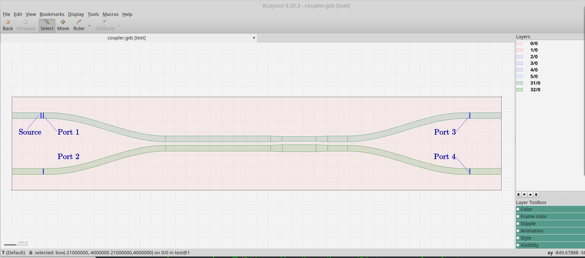
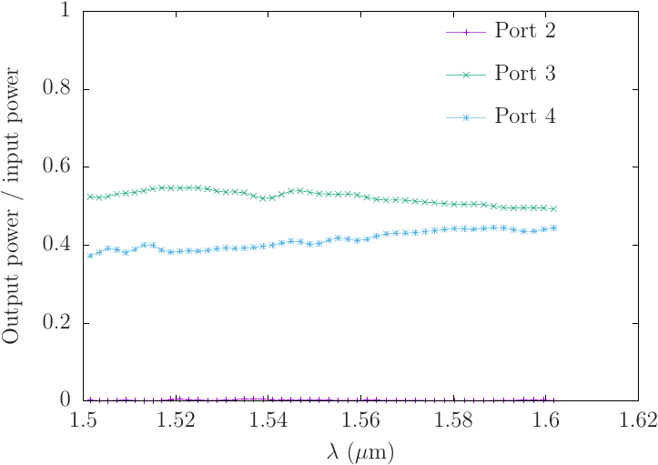

---
# Bidirectional coupler
---

In this example we study a bidirectional coupler designed to split
light arriving from an incoming waveguide into two beams of
roughly equal flux departing through two outgoing waveguides.

This example is modeled on the 3 dB coupler example included
in the extremely useful open-source
[SiEPIC](https://github.com/lukasc-ubc/SiEPIC_EBeam_PDK)
PDK and library for silicon photonics.

---
## GDSII file
---

The geometry we will study is described by the GDSII file
[`coupler.gds`](coupler.gds), which is a modified version of the file
[`3dB_coupler_TM.gds`](https://github.com/lukasc-ubc/SiEPIC_EBeam_PDK/blob/master/Documentation/Splitter_BDC%20(Broadband%20Directional%20Coupler)/TM_3dB_BDC_splitter/GDS/3dB_coupler_TM.gds)
included in the SiEPIC distribution.



More specifically, we
used the excellent open-source GDSII editing tool [KLayout](https://www.klayout.de/)
to make the following changes:

+ We translated the geometry so that it is centered at the origin of the XY plane.

+ We dragged each of the four vertical edges at the extreme left and right of the geometry
outward to define straight waveguide sections for the incoming and outgoing ports.

+ Whereas the original file defined the entire coupler to exist on a single
GDSII layer (layer 31), here we put the lower branch of the coupler on a
separate layer (layer 32). This makes it easy to vary the separation between
the branches in the python script that drives our calculation (see below).

+ We defined 4 *port* regions, each defined on a different GDSII layer and consisting
of a single GDSII polygon (actually just a zero-thickness *path*)
spanning the width of a waveguide section. These will be used to specify
[`volume`s](https://meep.readthedocs.io/en/latest/Python_User_Interface/#volume)
for defining 
[flux regions](https://meep.readthedocs.io/en/latest/Python_User_Interface/#fluxregion),
over which we will ask meep to measure power flux,
or [mode monitors](https://meep.readthedocs.io/en/latest/Python_Tutorials/Mode_Decomposition)
over which to measure eigenmode-expansion coefficients. 
Similarly, on a separate layer we include a region defining an
[eigenmode source](`https://meep.readthedocs.io/en/latest/Python_User_Interface/#eigenmodesource)
describing power entering the coupler at Port 1.

The last step is not strictly necessary, since we could just define regions
for sources and flux/mode-monitors by hand by explicitly specifying coordinates
in our meep script. But it's convenient to have the specification of these
regions defined in the same GDSII geometry as the actual structure.

---
## Python script
---

A full python script for studying the performance of the coupler
is [`coupler.py`](coupler.py). Each run of this script computes
the power outflow from each port (assuming unit power input
to port 1), over a range of frequencies, for a single value
of the branch-branch separation. The script may be run by saying e.g.

```bash
 % mpirun -np 12 python coupler.py [--gdsIIFile coupler.gds] [--separation 0.3] [--res 21] [--3D]
```

where the options are

+ `--gdsIIFile` specifies the GDSII file (`coupler.gds` by default)

+ `--separation` defines the minimum separation distance between the coupler branches; the default is 0.3 &um;

+ `--res` sets the meep resolution

+ `--3D` specifies a 3D calculation in which the waveguides are 220-nm-thick
   silicon on an oxide layer. If this flag is absent (the default),
   the calculation is 2D, describing silicon waveguides of infinite
   thickness in the *z* direction.

Here's a sample run:
```bash
 % mpirun -np 12 python coupler.py --separation 0.1
```

This produces the file `coupler2D.s0.1.r21.0.out`:



Here's the full python script:

```python
import os
import unittest
import numpy as np
import meep as mp
import argparse

##################################################
# global variables
##################################################

# hard-coded info about the GDSII file
gdsII_file         = 'coupler.gds'
CELL_LAYER         = 0
PORT1_LAYER        = 1
PORT2_LAYER        = 2
PORT3_LAYER        = 3
PORT4_LAYER        = 4
SOURCE_LAYER       = 5
UPPER_BRANCH_LAYER = 31
LOWER_BRANCH_LAYER = 32

file_separation    = 0.3   # separation between coupler branches in GDSII file
separation         = 0.3   # user's requested separation

oxide_thickness    = 1.0   # thicknesses in Z-direction (only for 3D calculation)
silicon_thickness  = 0.22
air_thickness      = 0.78

eps_oxide          = 2.25
eps_silicon        = 12  

# other computational parameters
dpml=1
resolution=21
three_d  = False;

# frequency range
lmin      = 1.50
lcen      = 1.55
lmax      = 1.60

fmin      = 1.0/lmax
fcen      = 1.0/lcen
fmax      = 1.0/lmin
df_source = fmax-fmin
mode_num  = 1

df_flux  = df_source
nfreq    = 50

##################################################
# utility routine to extract center and size of a
# meep volume (as opposed to a pymeep Volume).
# there is surely a more natural way to do this...
##################################################
def get_center_and_size(v):
    rmin=v.get_min_corner()
    rmax=v.get_max_corner()
    v3rmin = mp.Vector3(rmin.x(), rmin.y(), rmin.z())
    v3rmax = mp.Vector3(rmax.x(), rmax.y(), rmax.z())
    if v.dim<mp.D3:
      v3rmin.z=v3rmax.z=0
    if v.dim<mp.D2:
      v3rmin.y=v3rmax.y=0
    center=0.5*(v3rmin+v3rmax)
    size=(v3rmax-v3rmin)
    return (center,size)

##################################################
# script entry point #############################
##################################################

# parse command-line arguments
parser = argparse.ArgumentParser()
parser.set_defaults(three_d=False)
parser.add_argument('--gdsIIfile',  type=str,       default='coupler.gds',      help='.gds file')
parser.add_argument('--res',        type=float,     default=20,                 help='resolution')
parser.add_argument('--separation', type=float,     default=separation,         help='separation')
parser.add_argument('--3D',         dest='three_d', action='store_true',        help='3D calculation')
args        = parser.parse_args()
resolution  = args.res
separation  = args.separation
gdsII_file  = args.gdsIIfile
three_d     = args.three_d;

cell_thickness = dpml + oxide_thickness + silicon_thickness + air_thickness + dpml
cell_zmax =  0.5*cell_thickness if three_d else 0.0
cell_zmin = -0.5*cell_thickness if three_d else 0.0
si_zmin   = 0.0
si_zmax   = silicon_thickness if three_d else 0.0
print "cell_zmax={}".format(cell_zmax)
print "cell_zmin={}".format(cell_zmin)
print "si_zmin={}".format(si_zmin)
print "si_zmax={}".format(si_zmax)

# read cell size, volumes for source region and flux monitors,
# and coupler geometry from GDSII file
silicon=mp.Medium(epsilon=eps_silicon)
upper_branch = mp.get_GDSII_prisms(silicon, gdsII_file, UPPER_BRANCH_LAYER, si_zmin, si_zmax)
lower_branch = mp.get_GDSII_prisms(silicon, gdsII_file, LOWER_BRANCH_LAYER, si_zmin, si_zmax)

(dummy,cell_size)     = get_center_and_size(mp.get_GDSII_volume(gdsII_file,CELL_LAYER, cell_zmin, cell_zmax))
(p1_center,p1_size)   = get_center_and_size(mp.get_GDSII_volume(gdsII_file,PORT1_LAYER, si_zmin, si_zmax))
(p2_center,p2_size)   = get_center_and_size(mp.get_GDSII_volume(gdsII_file,PORT2_LAYER, si_zmin, si_zmax))
(p3_center,p3_size)   = get_center_and_size(mp.get_GDSII_volume(gdsII_file,PORT3_LAYER, si_zmin, si_zmax))
(p4_center,p4_size)   = get_center_and_size(mp.get_GDSII_volume(gdsII_file,PORT4_LAYER, si_zmin, si_zmax))
(src_center,src_size) = get_center_and_size(mp.get_GDSII_volume(gdsII_file,SOURCE_LAYER, si_zmin, si_zmax))

# displace upper and lower branches of coupler (and source, flux regions)
# symmetrically to achieve requested minimum separation
if separation!=file_separation:
    delta_y     = 0.5*(separation-file_separation)
    delta       = mp.Vector3(0, delta_y, 0)
    p1_center  += delta;
    p2_center  -= delta;
    p3_center  += delta;
    p4_center  -= delta;
    src_center += delta;
    cell_size  += 2.0*delta;
    for np in range(0,len(lower_branch)):
        lower_branch[np].center -= delta;
        for nv in range(0,len(lower_branch[np].vertices)):
            lower_branch[np].vertices[nv] -= delta
    for np in range(0,len(upper_branch)):
        upper_branch[np].center += delta;
        for nv in range(0,len(upper_branch[np].vertices)):
            upper_branch[np].vertices[nv] += delta

geometry = upper_branch + lower_branch
if three_d:
    oxide          = mp.Medium(epsilon=eps_oxide)
    oxide_center   = mp.Vector3(0,0,-0.5*oxide_thickness)
    oxide_size     = mp.Vector3(cell_size.x, cell_size.y, oxide_thickness)
    print oxide_size
    oxide_layer    = [mp.Block(material=oxide, center=oxide_center, size=oxide_size)]
    geometry       = geometry + oxide_layer

sources = [mp.EigenModeSource( src=mp.GaussianSource(fcen, fwidth=df_source),
                               size=src_size, center=src_center,
                               eig_band=mode_num
                             )
          ]

sim = mp.Simulation(resolution=resolution, cell_size=cell_size,
                    boundary_layers=[mp.PML(dpml)], sources=sources,
                    geometry=geometry
                   )

sim.init_sim()
mp.output_epsilon(sim)

p1_region = mp.FluxRegion(center=p1_center, size=p1_size)
flux1     = sim.add_flux(fcen, df_flux, nfreq, p1_region)

p2_region = mp.FluxRegion(center=p2_center, size=p2_size)
flux2     = sim.add_flux(fcen, df_flux, nfreq, p2_region)

p3_region = mp.FluxRegion(center=p3_center, size=p3_size)
flux3     = sim.add_flux(fcen, df_flux, nfreq, p3_region)

p4_region = mp.FluxRegion(center=p4_center, size=p4_size)
flux4     = sim.add_flux(fcen, df_flux, nfreq, p4_region)

sim.run(until_after_sources=mp.stop_when_fields_decayed(25, mp.Ez, p3_center, 1e-8))

p1_flux = mp.get_fluxes(flux1)
p2_flux = mp.get_fluxes(flux2)
p3_flux = mp.get_fluxes(flux3)
p4_flux = mp.get_fluxes(flux4)

if mp.am_master():
  dimstr = "3D" if three_d else "2D"
  filename = "coupler" + dimstr + ".s{}.r{}.out".format(separation,resolution)
  outfile = open(filename, 'w')
  freqs = mp.get_flux_freqs(flux1)
  for nf in range(0,nfreq):
      outfile.write('%e %e %e %e %e\n' % (freqs[nf],p1_flux[nf],p2_flux[nf],p3_flux[nf],p4_flux[nf]))

  outfile.close()
```
