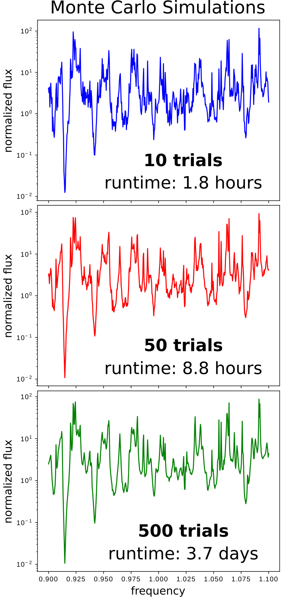

---
# Custom Source
---

This tutorial demonstrates using a custom source to define a source with an arbitrary time profile.

[TOC]

Stochastic Dipole Emission in Light Emitting Diodes
---------------------------------------------------

In addition to the two source time profiles of a [continuous wave](../Python_User_Interface.md#continuoussource) (CW) and finite-bandwidth [pulse](../Python_User_Interface.md#gaussiansource), Meep supports a [custom source](../Python_User_Interface.md#customsource) for defining an arbitrary time profile. This feature can be used to model spatially incoherent random (i.e., [white noise](https://en.wikipedia.org/wiki/White_noise)) dipole emission in a [light-emitting diode](https://en.wikipedia.org/wiki/Light-emitting_diode) (LED) as well as spontaneously recombining excitonic emission in an [organic light-emitting diode](https://en.wikipedia.org/wiki/OLED) (OLED). 

This tutorial example involves computing the radiated [flux](../Introduction.md#transmittancereflectance-spectra) of a 2d LED-like periodic structure with a thin (1d) light-emitting layer. A schematic of the unit cell geometry and simulation layout is shown below. A silver (Ag) back reflector is used to direct (nearly) all the flux upwards into the $+y$ direction. PML is used to terminate the air region at the top of the cell. (Note: PML is not necessary at the bottom of the cell as long as the Ag layer thickness is larger than its [skin depth](https://en.wikipedia.org/wiki/Skin_effect) of ~0.5 µm so that the bottom boundary condition does not affect the results.) The emitting layer has a wavelength-independent refractive index of 3.45.

<center>

</center>

There are two different methods for computing the radiated flux from $N$ dipoles based on the type of emitter: (1) random or (2) deterministic. In the first method (brute force), each emitter is a white-noise dipole source via `CustomSource`: every timestep for every dipole is an independent random number. A single iteration involves all $N$ dipoles. The results are averaged over multiple iterations via [Monte-Carlo sampling](https://en.wikipedia.org/wiki/Monte_Carlo_method). The second method involves a sequence of $N$ separate iterations each with a single deterministic dipole (i.e., pulsed time profile) at different positions in the emitting layer. Because dipoles at different positions are uncorrelated, the radiated flux is simply the average of all the individual iterations. The two approaches produce identical results but (1) is more computationally expensive than (2) because it requires a much large number of ensembles/iterations ($≫  N$) to attain low noise variance.

*Note regarding normalization*. When comparing the results from the two methods, it is necessary to scale the flux spectrum from method 2 in post processing due to the Gaussian pulse profile. However, it is convenient to nondimensionalize the results for both methods by dividing the flux spectrum for the textured surface with that from a flat surface. This way, the results can be compared directly without any tricky scaling.

(A similar approach can be used to compute the near-field heat transfer between two grey bodies at thermal equilibrium.)

The simulation script is in [examples/stochastic_emitter.py](https://github.com/NanoComp/meep/blob/master/python/examples/stochastic_emitter.py).

```py
import meep as mp
from meep.materials import Ag
import numpy as np

import argparse
parser = argparse.ArgumentParser()
parser.add_argument('-res', type=int, default=50, help='resolution (pixels/um)')
parser.add_argument('-nr', type=int, default=20, help='number of random trials (method 1)')
parser.add_argument('-nd', type=int, default=10, help='number of dipoles')
parser.add_argument('-nf', type=int, default=500, help='number of frequencies')
parser.add_argument('-run_time', type=float, default=1000, help='runtime after Gaussian source has turned off (method 2)')
parser.add_argument('-textured', action='store_true', default=False, help='flat (default) or textured surface')
parser.add_argument('-method', type=int, choices=[1,2], default=1, help='type of method: (1) random dipoles with nr trials or (2) single dipole with 1 run per dipole')
args = parser.parse_args()

resolution = args.res

dpml = 1.0
dair = 1.0
hrod = 0.7
wrod = 0.5
dglass = 5.0
dAg = 0.5

sx = 1.1
sy = dpml+dair+hrod+dglass+dAg

cell_size = mp.Vector3(sx,sy)

pml_layers = [mp.PML(direction=mp.Y,
                     thickness=dpml,
                     side=mp.High)]

fcen = 1.0
df = 0.2
nfreq = args.nf
ndipole = args.nd

ntrial = args.nr

run_time = 2*nfreq/df if args.method == 1 else args.run_time

geometry = [mp.Block(material=mp.Medium(index=3.45),
                     center=mp.Vector3(0,0.5*sy-dpml-dair-hrod-0.5*dglass),
                     size=mp.Vector3(mp.inf,dglass,mp.inf)),
            mp.Block(material=Ag,
                     center=mp.Vector3(0,-0.5*sy+0.5*dAg),
                     size=mp.Vector3(mp.inf,dAg,mp.inf))]

if args.textured:
    geometry.append(mp.Block(material=mp.Medium(index=3.45),
                             center=mp.Vector3(0,0.5*sy-dpml-dair-0.5*hrod),
                             size=mp.Vector3(wrod,hrod,mp.inf)))

def compute_flux_method1():
    sources = []
    for n in range(ndipole):
        sources.append(mp.Source(mp.CustomSource(src_func=lambda t: np.random.randn()),
                                 component=mp.Ez,
                                 center=mp.Vector3(sx*(-0.5+n/ndipole),-0.5*sy+dAg+0.5*dglass)))

    sim = mp.Simulation(cell_size=cell_size,
                        resolution=resolution,
                        k_point=mp.Vector3(),
                        boundary_layers=pml_layers,
                        geometry=geometry,
                        sources=sources)

    flux_mon = sim.add_flux(fcen,
                            df,
                            nfreq,
                            mp.FluxRegion(center=mp.Vector3(0,0.5*sy-dpml),size=mp.Vector3(sx)))

    sim.run(until=run_time)

    flux = mp.get_fluxes(flux_mon)
    freqs = mp.get_flux_freqs(flux_mon)

    return freqs, flux

def compute_flux_method2(n):
    sources = [mp.Source(mp.GaussianSource(fcen,fwidth=df),
                         component=mp.Ez,
                         center=mp.Vector3(sx*(-0.5+n/ndipole),-0.5*sy+dAg+0.5*dglass))]

    sim = mp.Simulation(cell_size=cell_size,
                        resolution=resolution,
                        k_point=mp.Vector3(),
                        boundary_layers=pml_layers,
                        geometry=geometry,
                        sources=sources)

    flux_mon = sim.add_flux(fcen,
                            df,
                            nfreq,
                            mp.FluxRegion(center=mp.Vector3(0,0.5*sy-dpml),size=mp.Vector3(sx)))

    sim.run(until_after_sources=run_time)

    flux = mp.get_fluxes(flux_mon)
    freqs = mp.get_flux_freqs(flux_mon)

    return freqs, flux


if args.method == 1:
    fluxes = np.zeros((nfreq,ntrial))
    for m in range(ntrial):
        freqs, fluxes[:,m] = compute_flux_method1()
else:
    fluxes = np.zeros((nfreq,ndipole))
    for n in range(ndipole):
        freqs, fluxes[:,n] = compute_flux_method2(n)


if mp.am_master():
    with open('method{}_{}_res{}_nfreq{}_ndipole{}.npz'.format(args.method,"textured" if args.textured else "flat",resolution,nfreq,ndipole),'wb') as f:
        np.savez(f,freqs=freqs,fluxes=fluxes)
```

There are three items to note in this script. (1) The frequency discretization of the flux spectrum must be sufficiently fine to resolve noisy features (`nfreq = 500` by default). (2) The runtime must be long enough for the DFT spectrum to resolve these oscillations. For method 1, the runtime is ~1/frequency resolution due to the Fourier Uncertainty Principle (`run_time = 2*nfreq/df`). Method 2 requires a [convergence check](../FAQ.md#checking-convergence) in which the runtime is repeatedly doubled. (3) The material properties for Ag are imported from the [materials library](../Materials.md#materials-library).

Results for Method 1 are shown in the following three figures. As the number of random trials/iterations is increased, the noisy variance is gradually reduced.

<center>

</center>

The next figure shows a comparison of the results for Methods 1 and 2. The results show good agreement. The Method 1 results required almost three days to obtain whereas the Method 2 results were obtained in less than five minutes.

<center>

</center>