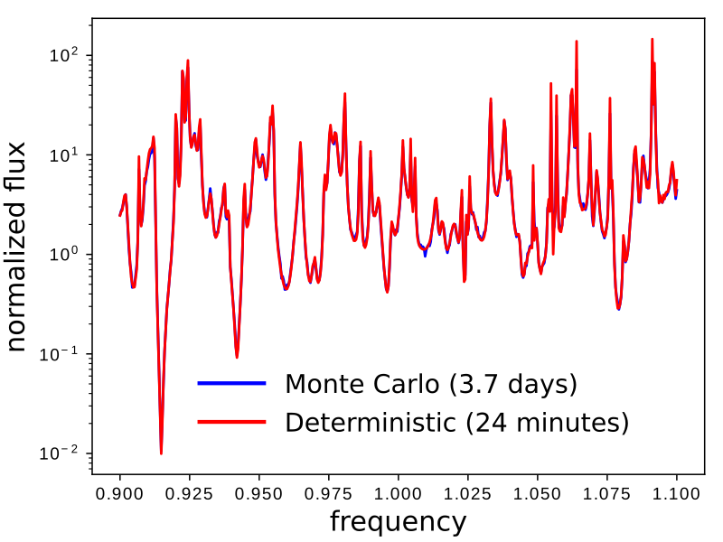
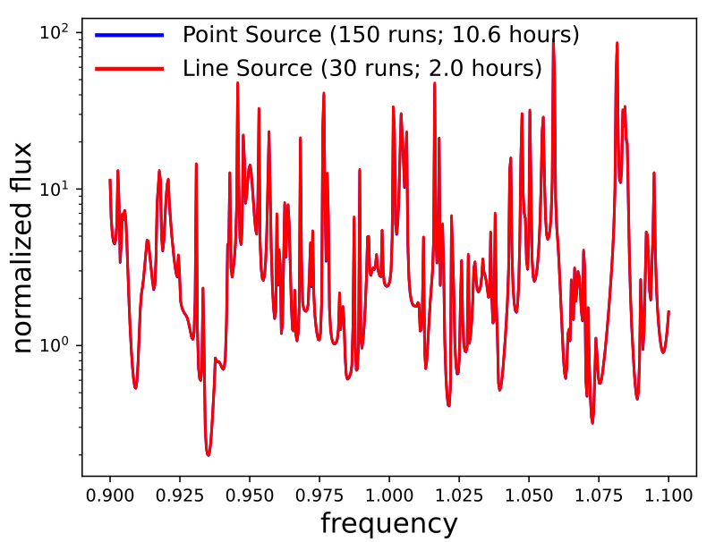

---
# Custom Source
---

This tutorial demonstrates using a custom source to define a source with an arbitrary time profile.

[TOC]

Stochastic Dipole Emission in Light Emitting Diodes
---------------------------------------------------

In addition to the two source time profiles of a [continuous wave](../Python_User_Interface.md#continuoussource) (CW) and finite-bandwidth [pulse](../Python_User_Interface.md#gaussiansource), Meep supports a [custom source](../Python_User_Interface.md#customsource) for defining an arbitrary time profile. This feature can be used to model **spatially incoherent** random (i.e., [white noise](https://en.wikipedia.org/wiki/White_noise)) dipole emission in a [light-emitting diode](https://en.wikipedia.org/wiki/Light-emitting_diode) (LED), spontaneously recombining excitonic emission in an [organic light-emitting diode](https://en.wikipedia.org/wiki/OLED) (OLED), as well as near-field heat transfer.   Such incoherent emission processes are very different from *coherent* emission by a single collection of sources with a fixed phase relation, and more complicated modeling techniques are required.

This tutorial example involves computing the radiated [flux](../Introduction.md#transmittancereflectance-spectra) from $N=10$ dipole emitters of a 2d LED-like periodic structure with a thin (1d) light-emitting layer. A schematic of the unit cell geometry and simulation layout is shown below. A silver (Ag) back reflector is used to direct nearly all the flux upwards into the $+y$ direction. PML is used to terminate the air region at the top of the cell. (Note: PML is not necessary at the bottom of the cell due to the Ag layer which is effectively a lossless mirror with [skin depth](https://en.wikipedia.org/wiki/Skin_effect) of a few nanometers at a wavelength of 1 μm.) The emitting layer is placed within a lossless dielectric substrate with wavelength-independent refractive index of 3.45.

<center>

</center>

One can take two different approaches to computing the radiated flux based on the type of emitter: (1) random or (2) deterministic. In Method 1 (brute-force Monte Carlo), each emitter is a white-noise dipole: every timestep for every dipole is an independent random number. A single run involves all $N$ dipoles which are modeled using a `CustomSource`. The stochastic results for the radiated flux are averaged over multiple trials/iterations via [Monte Carlo sampling](https://en.wikipedia.org/wiki/Monte_Carlo_method). Method 2 exploits the property of [linear time-invariance](https://en.wikipedia.org/wiki/Linear_time-invariant_system) of the materials/geometry and involves a sequence of $N$ separate runs each with a single deterministic dipole (i.e., pulse time profile, `GaussianSource`) at different positions in the emitting layer. Because dipoles at different positions are uncorrelated, the radiated flux from the ensemble is simply the average of all the individual iterations. The two approaches converge towards identical results, but Method 1 is more computationally expensive than Method 2 due to the much larger number of trials/iterations ($\gg  N$) required to attain low noise variance.   (Even more sophisticated deterministic methods exist to reduce the number of separate simulations, especially at high resolutions; for example, replacing the point-dipole sources with a [rapidly converging set of smooth basis functions](https://journals.aps.org/pra/abstract/10.1103/PhysRevA.81.012119) as demonstrated below, or fancier methods that exploit [trace-estimation methods](http://doi.org/10.1103/PhysRevB.92.134202) and/or transform volumetric sources to [surface sources](http://doi.org/10.1103/PhysRevB.88.054305).)

*Note regarding normalization:* To directly compare the results for the radiated flux from the two methods, one might scale the spectrum from Method 2 in post processing to correct for the difference in spectrum between a Gaussian pulse and white noise. However, it is usually more convenient to *nondimensionalize* the results (for both methods) by dividing the flux spectrum for the textured surface with a reference spectrum computed by the *same method*, for example emission from a flat surface or in a homogeneous medium. This way, the details of the source spectra cancel automatically, and the nondimensionalized results can be compared as-is without any tricky scaling calculations.  This kind of nondimensionalized comparison is useful to determine the *emission enhancement* (or suppression) of one structure relative to another as well as the *light-extraction efficiency* (the ratio of the radiated flux to the total flux emitted by the dipoles).  In order to compute the *absolute* (not relative) light emission by a particular structure, using either Method 1 or Method 2, one would need to rescale the output ([thanks to linearity](http://doi.org/10.1103/PhysRevLett.107.114302)) to convert the input spectrum (from white noise or Gaussian) to the actual emission spectrum (e.g. determined from the gain spectrum of a light-emitting diode).

The simulation script is in [examples/stochastic_emitter.py](https://github.com/NanoComp/meep/blob/master/python/examples/stochastic_emitter.py). The notebook is [examples/stochastic_emitter.ipynb](https://nbviewer.jupyter.org/github/NanoComp/meep/blob/master/python/examples/stochastic_emitter.ipynb).

```py
import meep as mp
from meep.materials import Ag
import numpy as np

import argparse
parser = argparse.ArgumentParser()
parser.add_argument('-res', type=int, default=50, help='resolution (pixels/um)')
parser.add_argument('-nr', type=int, default=20, help='number of random trials (method 1)')
parser.add_argument('-nd', type=int, default=10, help='number of dipoles')
parser.add_argument('-nf', type=int, default=500, help='number of frequencies')
parser.add_argument('-textured', action='store_true', default=False, help='flat (default) or textured surface')
parser.add_argument('-method', type=int, choices=[1,2], default=1, help='type of method: (1) random dipoles with nr trials or (2) single dipole with 1 run per dipole')
args = parser.parse_args()

resolution = args.res

dpml = 1.0
dair = 1.0
hrod = 0.7
wrod = 0.5
dsub = 5.0
dAg = 0.5

sx = 1.1
sy = dpml+dair+hrod+dsub+dAg

cell_size = mp.Vector3(sx,sy)

pml_layers = [mp.PML(direction=mp.Y,
                     thickness=dpml,
                     side=mp.High)]

fcen = 1.0
df = 0.2
nfreq = args.nf
ndipole = args.nd
ntrial = args.nr
run_time = 2*nfreq/df

geometry = [mp.Block(material=mp.Medium(index=3.45),
                     center=mp.Vector3(0,0.5*sy-dpml-dair-hrod-0.5*dsub),
                     size=mp.Vector3(mp.inf,dsub,mp.inf)),
            mp.Block(material=Ag,
                     center=mp.Vector3(0,-0.5*sy+0.5*dAg),
                     size=mp.Vector3(mp.inf,dAg,mp.inf))]

if args.textured:
    geometry.append(mp.Block(material=mp.Medium(index=3.45),
                             center=mp.Vector3(0,0.5*sy-dpml-dair-0.5*hrod),
                             size=mp.Vector3(wrod,hrod,mp.inf)))

def compute_flux(m=1,n=0):
    if m == 1:
        sources = []
        for n in range(ndipole):
            sources.append(mp.Source(mp.CustomSource(src_func=lambda t: np.random.randn()),
                                     component=mp.Ez,
                                     center=mp.Vector3(sx*(-0.5+n/ndipole),-0.5*sy+dAg+0.5*dsub)))
    else:
        sources = [mp.Source(mp.GaussianSource(fcen,fwidth=df),
                             component=mp.Ez,
                             center=mp.Vector3(sx*(-0.5+n/ndipole),-0.5*sy+dAg+0.5*dsub))]

    sim = mp.Simulation(cell_size=cell_size,
                        resolution=resolution,
                        k_point=mp.Vector3(),
                        boundary_layers=pml_layers,
                        geometry=geometry,
                        sources=sources)

    flux_mon = sim.add_flux(fcen,
                            df,
                            nfreq,
                            mp.FluxRegion(center=mp.Vector3(0,0.5*sy-dpml),size=mp.Vector3(sx)))

    sim.run(until=run_time)

    flux = mp.get_fluxes(flux_mon)
    freqs = mp.get_flux_freqs(flux_mon)

    return freqs, flux


if args.method == 1:
    fluxes = np.zeros((nfreq,ntrial))
    for t in range(ntrial):
        freqs, fluxes[:,t] = compute_flux(m=1)
else:
    fluxes = np.zeros((nfreq,ndipole))
    for d in range(ndipole):
        freqs, fluxes[:,d] = compute_flux(m=2,n=d)


if mp.am_master():
    with open('method{}_{}_res{}_nfreq{}_ndipole{}.npz'.format(args.method,"textured" if args.textured else "flat",resolution,nfreq,ndipole),'wb') as f:
        np.savez(f,freqs=freqs,fluxes=fluxes)
```

There are five items to note in this script. (1) The frequency discretization of the flux spectrum must be sufficiently fine to resolve noisy features. In this example, the frequency range is 0.9 to 1.1 with spacing of 0.0004. (2) The runtime must be long enough for the DFT spectrum to resolve these oscillations. Due to the Fourier Uncertainty Principle, the runtime should be at least ~1/frequency resolution. Here, we found that a larger runtime of 2/frequency resolution was sufficient to [converge](../FAQ.md#checking-convergence) to the desired accuracy.  Technically, what we are doing is [spectral density estimation](https://en.wikipedia.org/wiki/Spectral_density_estimation) of the [periodogram](https://en.wikipedia.org/wiki/Periodogram) by an ensemble average with a [rectangular window](https://en.wikipedia.org/wiki/Window_function#Rectangular_window), but many variations on this general idea exist.  (3) The material properties for Ag are imported from the [materials library](../Materials.md#materials-library). (4) At the end of the run, the flux spectra from all iterations are saved to a file using NumPy's [uncompressed `.npz` format](https://numpy.org/doc/stable/reference/generated/numpy.lib.format.html#module-numpy.lib.format). This data is used to plot the results in post processing. (5) For Method 1, independent random numbers can be used for the white-noise dipole emitters in the trial runs for the two cases of a flat and textured surface, since all that matters is that they average to the same power spectrum.

Results for Methods 1 and 2 for the two cases of a flat and textured surface are generated using the following shell script:
```sh
#!/bin/bash

# Method 1: flat surface
python stochastic_emitter.py -method 1 -res 50 -nf 500 -nd 10 -nr 500

# Method 1: textured surface
python stochastic_emitter.py -method 1 -res 50 -nf 500 -nd 10 -nr 500 -textured

# Method 2: flat surface
python stochastic_emitter.py -method 2 -res 50 -nf 500 -nd 10

# Method 2: textured surface
python stochastic_emitter.py -method 2 -res 50 -nf 500 -nd 10 -textured
```

Afterwards, the four NumPy files produced by each run are used to plot the normalized flux for each method.
```py
import numpy as np
import matplotlib.pyplot as plt

method1_f0 = np.load('method1_flat_res50_nfreq500_ndipole10.npz')
method1_f1 = np.load('method1_textured_res50_nfreq500_ndipole10.npz')

method1_freqs = method1_f0['freqs']
method1_f0_mean = np.mean(method1_f0['fluxes'],axis=1)
method1_f1_mean = np.mean(method1_f1['fluxes'],axis=1)

method2_f0 = np.load('method2_flat_res50_nfreq500_ndipole10.npz')
method2_f1 = np.load('method2_textured_res50_nfreq500_ndipole10.npz')

method2_freqs = method2_f0['freqs']
method2_f0_mean = np.mean(method2_f0['fluxes'],axis=1)
method2_f1_mean = np.mean(method2_f1['fluxes'],axis=1)

plt.semilogy(method1_freqs,method1_f1_mean/method1_f0_mean,'b-',label='Method 1')
plt.semilogy(method2_freqs,method2_f1_mean/method2_f0_mean,'r-',label='Method 2')
plt.xlabel('frequency')
plt.ylabel('normalized flux')
plt.legend()
plt.show()
```

Results for Method 1 for three different numbers of trials/iterations (10, 50, and 500) are shown in the following three figures. Each trial/iteration involves two runs: one each for the flat and textured surface. As the number of trials/iterations is increased, the "noisiness" in the plot is gradually reduced. However, the total runtime increases significantly.

<center>

</center>

The next figure shows a comparison of the normalized radiated flux for Method 1 (500 trials) and 2 (20 runs; 10 runs each for the flat and textured surface). The results show good agreement over the entire bandwidth spectrum. The Method 1 results (labeled "Monte Carlo") required almost *four days* of compute time using an Intel Xeon processor with two single-threaded cores at 3.8 GHz whereas the Method 2 results (labeled "Deterministic") were obtained in 24 minutes. In general, deterministic approaches tend to be more efficient than brute-force Monte Carlo.

<center>

</center>

One situation in which you may need to perform brute-force Monte Carlo simulations is that of nonlinear or time-varying media, because the equivalence between random and deterministic simulations above relied on linearity and time-invariance.   However, in such media one also cannot directly employ white-noise sources, but you must instead input the noise with the correct spectrum for your desired emission process.   For example, to [model thermal emission in a nonlinear medium](http://doi.org/10.1103/PhysRevB.91.115406) one must have a noise spectrum consistent with the [fluctuation-dissipation theorem](https://en.wikipedia.org/wiki/Fluctuation-dissipation_theorem), which can be achieved using the `NoisyLorentzianSusceptibility` feature in Meep.

For cases involving a large number $N$ of spatially incoherent dipole emitters, a more computationally efficient approach than $N$ single-dipole simulations (Method 2) is $M$ separate simulations involving a *line* source with a different set of basis functions (Method 3). $M$ is typically independent of the resolution and $\ll N$. (For Method 2, the number of point dipoles $N$ comprising the same line source increases with resolution.) The mathematical details of Method 3 are described in [Physical Review A, vol. 80, 012119, (2010)](https://journals.aps.org/pra/abstract/10.1103/PhysRevA.81.012119). The source amplitude function of the $m$th run in the ensemble is defined by a cosine Fourier series:

$$f_m(x) = \sqrt{\frac{c_m}{L}} \cos \left(\frac{m\pi x}{L}\right), ~m = 0,1,\ldots, M-1$$

where $c_m = 1$ if $m=0$ and $c_m=2$ otherwise, $L$ is the length of the line source.

As a demonstration of Method 3 and to compare with Method 2, a similar 2d LED-like periodic structure with a 1d light-emitting layer is used. (The geometric parameters are slightly different than the first example comparing Method 1 and 2 in order to produce a different flux spectrum.) As before, results for the radiated flux of the textured surface are normalized using the flat surface so that the two methods can be directly compared without any additional post processing.

The simulation script is in [examples/stochastic_emitter_line.py](https://github.com/NanoComp/meep/blob/master/python/examples/stochastic_emitter_line.py).

```py
import meep as mp
from meep.materials import Ag
import numpy as np

import argparse
parser = argparse.ArgumentParser()
parser.add_argument('-res', type=int, default=50, help='resolution (pixels/um)')
parser.add_argument('-nf', type=int, default=500, help='number of frequencies')
parser.add_argument('-nsrc', type=int, default=15, help='number of line sources with cosine Fourier series amplitude function (method 3)')
parser.add_argument('-textured', action='store_true', default=False, help='flat (default) or textured surface')
parser.add_argument('-method', type=int, choices=[2,3], default=2,
                    help='type of method: (2) single dipole with 1 run per dipole or (3) line source with cosine Fourier series amplitude function')
args = parser.parse_args()

resolution = args.res

dpml = 1.0
dair = 0.9
hrod = 0.6
wrod = 0.8
dsub = 5.4
dAg = 0.4

sx = 1.5
sy = dpml+dair+hrod+dsub+dAg

cell_size = mp.Vector3(sx,sy)

pml_layers = [mp.PML(direction=mp.Y,
                     thickness=dpml,
                     side=mp.High)]

fcen = 1.0
df = 0.2
nfreq = args.nf
nsrc = args.nsrc
ndipole = int(sx*resolution)
run_time = 2*nfreq/df

geometry = [mp.Block(material=mp.Medium(index=3.45),
                     center=mp.Vector3(0,0.5*sy-dpml-dair-hrod-0.5*dsub),
                     size=mp.Vector3(mp.inf,dsub,mp.inf)),
            mp.Block(material=Ag,
                     center=mp.Vector3(0,-0.5*sy+0.5*dAg),
                     size=mp.Vector3(mp.inf,dAg,mp.inf))]

if args.textured:
    geometry.append(mp.Block(material=mp.Medium(index=3.45),
                             center=mp.Vector3(0,0.5*sy-dpml-dair-0.5*hrod),
                             size=mp.Vector3(wrod,hrod,mp.inf)))

def src_amp_func(n):
    def _src_amp_func(p):
        if n == 0:
            return 1/np.sqrt(sx)
        else:
            return np.sqrt(2/sx) * np.cos(n*np.pi*(p.x+0.5*sx)/sx)
    return _src_amp_func

def compute_flux(m,n):
    if m == 2:
        sources = [mp.Source(mp.GaussianSource(fcen,fwidth=df),
                             component=mp.Ez,
                             center=mp.Vector3(sx*(-0.5+n/ndipole),-0.5*sy+dAg+0.5*dsub))]
    else:
        sources = [mp.Source(mp.GaussianSource(fcen,fwidth=df),
                             component=mp.Ez,
                             center=mp.Vector3(0,-0.5*sy+dAg+0.5*dsub),
                             size=mp.Vector3(sx,0),
                             amp_func=src_amp_func(n))]

    sim = mp.Simulation(cell_size=cell_size,
                        resolution=resolution,
                        k_point=mp.Vector3(),
                        boundary_layers=pml_layers,
                        geometry=geometry,
                        sources=sources)

    flux_mon = sim.add_flux(fcen, df, nfreq,
                            mp.FluxRegion(center=mp.Vector3(0,0.5*sy-dpml),size=mp.Vector3(sx)))

    sim.run(until=run_time)

    flux = mp.get_fluxes(flux_mon)
    freqs = mp.get_flux_freqs(flux_mon)

    return freqs, flux


if args.method == 2:
    fluxes = np.zeros((nfreq,ndipole))
    for d in range(ndipole):
        freqs, fluxes[:,d] = compute_flux(2,d)
else:
    fluxes = np.zeros((nfreq,nsrc))
    for d in range(nsrc):
        freqs, fluxes[:,d] = compute_flux(3,d)


if mp.am_master():
    with open('method{}_{}_res{}_nfreq{}_{}{}.npz'.format(args.method,
                                                          "textured" if args.textured else "flat",
                                                          resolution,
                                                          nfreq,
                                                          "ndipole" if args.method == 2 else "nsrc",
                                                          ndipole if args.method == 2 else nsrc),'wb') as f:
        np.savez(f,freqs=freqs,fluxes=fluxes)
```

There are three items to note in this script. (1) The line source spans the entire length of the cell in the $x$ direction (i.e., $L$ is `sx`). (2) The number of point dipoles in Method 2 is `sx*resolution`, one per pixel. (3) The source amplitude function in Method 3 is specified by the `amp_func` property of the [`Source`](../Python_User_Interface.md#source) object. In the case of a Fourier cosine series as conventionally written, $\cos (m\pi x)/L$ is defined over the interval $x=[0,L]$ such that $x=0$ corresponds to the *edge* of the source, not the center. Since the source region in this example is defined in $[-L/2,+L/2]$, the amplitude function must shift its $x$ coordinate argument by $+L/2$ or `0.5*sx`.

Method 3 requires a convergence check in which $M$ (`nsrc` in the script) is repeatedly doubled until the change in the results are within a desired tolerance of e.g., < 1%. For this example, $M=15$ was found to be sufficient. Note that because a line source with a cosine amplitude function in *homogeneous* media is analogous to generating a planewave at a discrete angle, at each frequency $\omega$ there exists a cutoff $M$ beyond which there are *no* propagating planewaves. The cutoff $M$ can be computed analytically using the grating equation: $\sqrt{\omega^2n^2 - \left(k_x+\frac{M\pi}{L}\right)^2} = 0$, where $n$ is the refractive index of the source medium and $k_x$ is the Bloch-periodic wavevector in the $x$ direction. In this example, $\omega=2\pi$ (pulse center frequency), $L=1.5$, $k_x=0$, and $n=3.45$ for which the largest propagating $M$ is 10. For $M > 10$ the cosine source produces evanescent *waves in the material*, but these waves scatter into other Fourier components (including propagating waves) once they hit the grating. Thus, the source still produces propagating waves, but the amplitude of the propagating waves (and hence the contribution to the power) decreases exponentially for $M > 10$ as the coupling between the source and the grating decreases. This effect is demonstrated in the figure below which is a semilog plot of the $L_2$ norm of the error in the normalized flux of the cosine source relative to the "correct" result computed using 75 point dipoles (Method 2) as a function of the number of terms in the cosine source. The error decreases exponentially for $M > 10$  until $M=12$, at which point it becomes limited by discretization error (both the point-dipole and cosine-source methods have discretization errors at finite resolution, but are discretized slightly differently); as resolution is increased, this minimum difference will go to zero. Note that this analysis is only applicable to periodic structures where the line source extends the entire width of the cell with periodic boundary conditions. A finite length source in a non-periodic cell has no such cutoff and thus will typically require a large number of cosine terms for convergence.

<center>

</center>

Results for Methods 2 and 3 for the two cases of a flat and textured surface are generated using the following shell script:
```sh
#!/bin/bash

# Method 2: flat surface
python stochastic_emitter_line.py -method 2 -res 50 -nf 500

# Method 2: textured surface
python stochastic_emitter_line.py -method 2 -res 50 -nf 500 -textured

# Method 3: flat surface
python stochastic_emitter_line.py -method 3 -res 50 -nf 500 -nsrc 15

# Method 3: textured surface
python stochastic_emitter_line.py -method 3 -res 50 -nf 500 -nsrc 15 -textured
```

Afterwards, the four NumPy files produced by each run are used to plot the normalized flux for each method.
```py
import numpy as np
import matplotlib.pyplot as plt

method2_f0 = np.load('method2_flat_res50_nfreq500_ndipole75.npz')
method2_f1 = np.load('method2_textured_res50_nfreq500_ndipole75.npz')

method2_freqs = method2_f0['freqs']
method2_f0_mean = np.mean(method2_f0['fluxes'],axis=1)
method2_f1_mean = np.mean(method2_f1['fluxes'],axis=1)

method3_f0 = np.load('method3_flat_res50_nfreq500_nsrc15.npz')
method3_f1 = np.load('method3_textured_res50_nfreq500_nsrc15.npz')

method3_freqs = method3_f0['freqs']
method3_f0_mean = np.mean(method3_f0['fluxes'],axis=1)
method3_f1_mean = np.mean(method3_f1['fluxes'],axis=1)

plt.semilogy(method2_freqs,method2_f1_mean/method2_f0_mean,'b-',label='Method 2')
plt.semilogy(method3_freqs,method3_f1_mean/method3_f0_mean,'r-',label='Method 3')
plt.xlabel('frequency')
plt.ylabel('normalized flux')
plt.legend()
plt.show()
```

Results for Method 2 and 3 are shown in the following figure. The agreement is good but there is a significant difference in the runtime. Method 2 (labeled "Point Source") involves $N=75$ simulations each for the flat and textured surface for a total of 150 runs which required 10.6 hours. Method 3 (labeled "Line Source") involves $M=15$ simulations for the flat/textured surface for a total of 30 runs which required just 2.0 hours.

<center>

</center>

*Note regarding convergence properties of Method 2:* In this demonstration, the number of point dipoles used in Method 2 is one per pixel. However, because this example is a unit-cell calculation involving *periodic* boundaries, the number of point dipoles (equivalent to the number of simulations) that are actually necessary to obtain results with sufficient accuracy can be significantly reduced. For smooth periodic functions, it is well known that a [trapezoidal rule](https://en.wikipedia.org/wiki/Trapezoidal_rule) converges quite fast — generally even faster than the cosine-series expansion (used in Method 3) and comparable to a cosine+sine Fourier series (not shown). See these [tutorial notes](http://math.mit.edu/~stevenj/trap-iap-2011.pdf) for the mathematical details. In this example, placing one dipole at every fifth pixel for a total of 15 rather than 75 simulations produces nearly equivalent results for the flux spectrum. More generally, an alternative approach for Method 2 would be to sample a set of dipole points and repeatedly double the sampling density until it converges — and in periodic cases, this could have similar or even better efficiency than the cosine-sine series approach if the right density of points is used. Sampling every grid point is usually not necessary. However, this approach to Method 2 has two major limitations: (1) it probably won't converge as quickly for *non-periodic* cases (where a trapezoidal rule becomes much less accurate, unlike Method 3), and (2) repeatedly doubling the number of sampling points might overshoot the minimum number of points by more than if the number of cosine-series terms in Method 3 is increased by one at a time, especially if one is not shooting for extremely high accuracies.

*Note regarding polarization:* The previous demonstrations involved a single-polarization source. For random polarizations, three separate simulations (for $\mathcal{J}_x$, $\mathcal{J}_y$, and $\mathcal{J}_z$) are required regardless of the type of source: point (Method 2) or line (Method 3). Since the different polarizations are uncorrelated, the results (i.e., the flux spectrum) from each set of single-polarization simulations (which, in general, will have different convergence properties) are then summed in post processing. If the emitters involve *anisotropic* polarizability then the polarizations are correlated. However, in this case choosing the polarizations to correspond to the three principal axes will again make them uncorrelated.

Method 3 can be extended to 3d using a planar source layer ($L_x \times L_y$) involving the *product* of two cosine series:

$$f_{m,n}(x,y) = \sqrt{\frac{c_m c_n}{L_x L_y}} \cos \left(\frac{m\pi x}{L_x}\right) \cos \left(\frac{n\pi y}{L_y}\right), ~m = 0,1,\ldots, M-1; n = 0,1,\ldots, N-1 $$

where $c_m = c_n = 1$ if $m=n=0$ and $c_m = c_n = 2$ otherwise, $L_x$ and $L_y$ are the lengths of the planar source in the $x$ and $y$ directions. This requires two nested loops to sum over $m$ and $n$ separately. For example, if $M=N=10$, there are a total of 100 simulations. A 3d emission volume would require the product of 3 cosine series leading to e.g. 1000 simulations if there are 10 different sources in each dimension.

The previous examples involved emission in the *normal* direction. To investigate emission in *all* directions for a periodic surface requires integrating over $k_x$ and $k_y$ (the Bloch wavevectors of the unit cell; specified using `k_point`). Each ($k_x,k_y$) corresponds to a different emission direction. However, if you have designed your periodic emitter to emit mostly vertically (via a resonance at $k_x=k_y=0$), then the emission drops off rapidly at other $k$ points. Thus, you can probably estimate the angular width of the resonance by sampling only a few $k$ points near (0,0).
