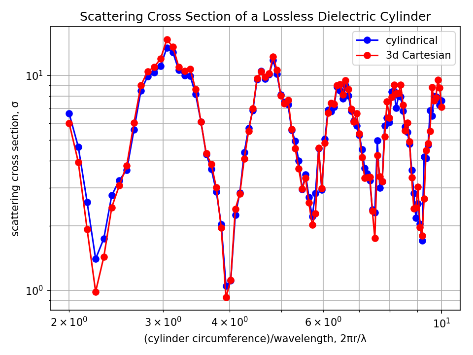
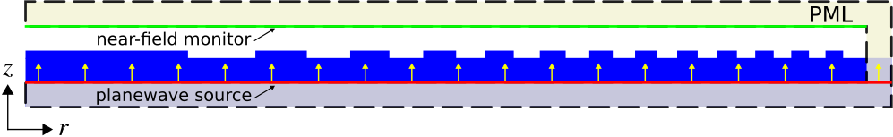
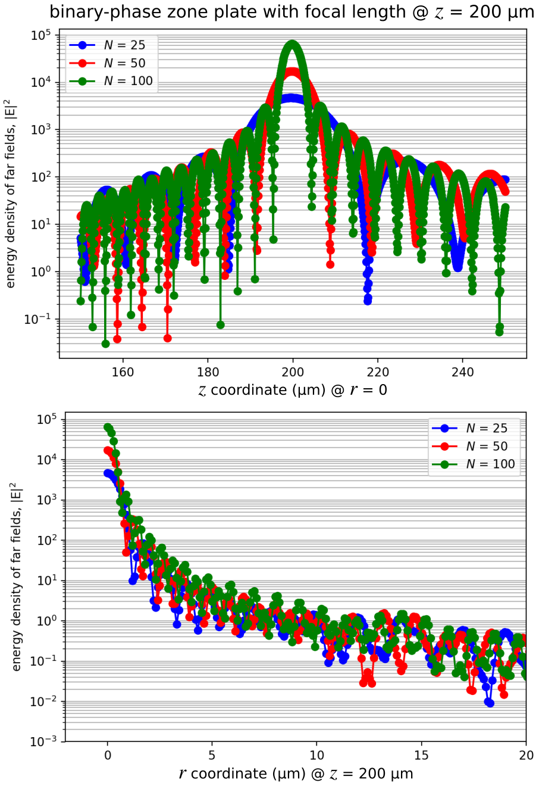

---
# Cylindrical Coordinates
---

Meep supports the simulation of Maxwell's equations in [cylindrical coordinates](https://en.wikipedia.org/wiki/Cylindrical_coordinate_system) for structures that have [continuous rotational symmetry around the *z* axis](../Exploiting_Symmetry.md#cylindrical-symmetry). This reduces problems in 3d to 2d, and 2d to 1d, if there is sufficient symmetry.

[TOC]

Modes of a Ring Resonator
-------------------------

In [Tutorial/Basics/Modes of a Ring Resonator](Basics.md#modes-of-a-ring-resonator), the modes of a ring resonator were computed by performing a 2d simulation. This example involves simulating the *same* structure while [exploiting](../Exploiting_Symmetry.md) the fact that the system has *continuous* rotational symmetry, by performing the simulation in cylindrical coordinates. The simulation script is in [examples/ring-cyl.py](https://github.com/NanoComp/meep/blob/master/python/examples/ring-cyl.py).

As always, the starting point is to import the `meep` and other library modules:

```py
import meep as mp
import argparse

def main(args):
```

The parameters of the problem are defined with exactly the same values as in the 2d simulation:

```py
n = 3.4     # index of waveguide
w = 1       # width of waveguide
r = 1       # inner radius of ring
pad = 4     # padding between waveguide and edge of PML
dpml = 2    # thickness of PML
```

The dimensions and size of the computational cell are defined:

```py
sr = r + w + pad + dpml         # radial size (cell is from 0 to sr)
dimensions = mp.CYLINDRICAL
cell = mp.Vector3(sr, 0, 0)
```

The key thing is to set the `dimensions` parameter to `CYLINDRICAL`. This means that all vectors represent ($r$,$\phi$,$z$) coordinates instead of ($x$,$y$,$z$). The computational cell in the $r$ direction is of size `sr = r + w + pad + dpml`, and runs from `0` to `sr` (by default) rather than from `-sr/2` to `sr/2` as it would for any other dimension. Note that the $z$ size is 0 because it is in 2d. The $\phi$ size is also 0, corresponding to the continuous rotational symmetry. A finite $\phi$ size might correspond to discrete rotational symmetry, but this is not currently supported.

In particular, in systems with continuous rotational symmetry, by an analogue of Bloch's theorem, the angular dependence of the fields can always be chosen in the form $\exp(i m \phi)$ for some integer $m$. Meep uses this fact to treat the angular dependence analytically, with $m$ given by the input variable `m` which is set to a command-line argument that is 3 by default.

```py
m = args.m
```

This is essentially a 1d calculation where Meep must discretize the $r$ direction only. For this reason, it will be much faster than the previous 2d calculation.

The geometry is now specified by a single `Block` object &mdash; remember that this is a block in cylindrical coordinates, so that it really specifies an annular ring:

```py
geometry = [mp.Block(center=mp.Vector3(r + (w / 2)),
                     size=mp.Vector3(w, 1e20, 1e20),
                     material=mp.Medium(index=n))]

pml_layers = [mp.PML(dpml)]
resolution = 10
```

PMLs are on "all" sides. The $z$ direction has no thickness and therefore it is automatically periodic with no PML. PML is also omitted from the boundary at $r$=0 which is handled by the analytical reflection symmetry.

The remaining inputs are almost exactly the same as in the previous 2d simulation. A single Gaussian point source is added in the $z$ direction to excite $E_z$-polarized modes, with some center frequency and width:

```py
fcen = args.fcen  # pulse center frequency
df = args.df      # pulse width (in frequency)
sources = [mp.Source(src=mp.GaussianSource(fcen, fwidth=df),
                     component=mp.Ez,
                     center=mp.Vector3(r + 0.1))]
```

Note that this isn't really a point source, however, because of the cylindrical symmetry &mdash; it is really a ring source with $\phi$ dependence $\exp(i m \phi)$. Finally, as before, the fields are timestepped until the source has turned off, plus 200 additional time units during which [Harminv](../Python_User_Interface.md#harminv) is used to analyze the $E_z$ field at a given point to extract the frequencies and decay rates of the modes.

```py
sim = mp.Simulation(cell_size=cell,
                    geometry=geometry,
                    boundary_layers=pml_layers,
                    resolution=resolution,
                    sources=sources,
                    dimensions=dimensions,
                    m=m)

sim.run(mp.after_sources(mp.Harminv(mp.Ez, mp.Vector3(r + 0.1), fcen, df)),
        until_after_sources=200)
```

At the very end, one period of the fields is output to create an animation. A single field output would be a 1d dataset along the $r$ direction, so to make things more interesting `to_appended` is used to append these datasets to a single HDF5 file to obtain an $r \times t$ 2d dataset. Also `in_volume` is used to specify a larger output volume than just the computational cell: in particular, the output is from `-sr` to `sr` in the $r$ direction, where the $-r$ field values are automatically inferred from the reflection symmetry.

```py
sim.run(mp.in_volume(mp.Volume(center=mp.Vector3(), size=mp.Vector3(2 * sr)),
                     mp.at_beginning(mp.output_epsilon),
                     mp.to_appended("ez", mp.at_every(1 / fcen / 20, mp.output_efield_z))),
        until=1 / fcen)
```

The last component of the script involves defining the three command-line arguments and their default values:

```py
if __name__ == '__main__':
   parser = argparse.ArgumentParser()
   parser.add_argument('-fcen', type=float, default=0.15, help='pulse center frequency')
   parser.add_argument('-df', type=float, default=0.1, help='pulse frequency width')
   parser.add_argument('-m', type=int, default=3, help='phi (angular) dependence of the fields given by exp(i m phi)')
   args = parser.parse_args()
   main(args)
```

The simulation is ready to be run. Recall that, in the 2d calculation, three modes were obtained in this frequency range: (1) $\omega$=0.11785 with $Q$=77 and an $m$=3 field pattern, (2) $\omega$=0.14687 with $Q$=351 and an $m$=4 field pattern, and (3) $\omega$=0.17501 with $Q$=1630 and an $m$=5 field pattern. To verify the correctness of this script, the *same* modes should be obtained with some differences due to the finite resolution, except now *three* calculations are necessary, a separate one for each value of $m$. It will still be much faster than the 2d simulation because these simulations are 1d.

In particular, the three calculations are:

```sh
unix% python ring-cyl.py -m 3 | grep harminv
unix% python ring-cyl.py -m 4 | grep harminv
unix% python ring-cyl.py -m 5 | grep harminv
```

giving the combined output:

```
harminv0:, frequency, imag. freq., Q, |amp|, amplitude, error
harminv0:, 0.11835455441250631, -0.0006907792691647415, 85.66741917111612, 0.02570190626349302, (-0.02402703883357199-0.00912630212448642j), (5.286949731053267e-10+0j)
harminv0:, 0.1475578747705309, -0.0001938438860632441, 380.61008208014414, 0.19361245519715206, (0.1447225471614173+0.12861246887677943j), (5.889273063545974e-11+0j)
harminv0:, 0.1759448592380757, -4.900590034953583e-05, 1795.1395442502285, 0.0452479314013276, (-0.014395016792255884-0.042897072017212545j), (1.6343462235932872e-10+0j)
```

This is indeed very close to the 2d simulations: the frequencies are within 1% of the previous values. The $Q$ values (lifetimes) differ by a larger amount although they are still reasonably close.

Which is more accurate, the 2d or the cylindrical simulation? This question can be answered by increasing the resolution in both cases and seeing what they converge towards. In particular, let's focus on the $m$=4 mode. In the cylindrical case, if the resolution is doubled to 20, the mode is $\omega$=0.14748 and $Q$=384. In the 2d case, if the resolution is doubled to 20 the mode is $\omega$=0.14733 and $Q$=321. It looks like the frequencies are clearly converging together and that the cylindrical simulation is more accurate (as you might expect since it describes the $\phi$ direction analytically). But the $Q$ values seem to be getting *farther* apart &mdash; what's going on?

The problem is twofold. First, there is some signal-processing error in determining $Q$ in the 2d case, as indicated by the "error" column of the `harminv` output which is only 4e-7 for the 2d simulation vs. 6e-11 for the cylindrical case. This error can be reduced by running with a narrower bandwidth source, which excites just one mode and gives a cleaner signal, or by analyzing over a longer time than 200. Doing the former, we find that the 2d value of $Q$ at a resolution of 20 should really be $Q$=343. Second, [PML](../Perfectly_Matched_Layer.md) absorbing layers are really designed to absorb planewaves incident on flat interfaces, but here we have a *cylindrical* PML layer. Because of this, there are larger numerical reflections from the PML in the cylindrical simulation, which we can rectify by pushing the PML out to a larger radius (i.e. using a larger value of `pad`) and/or increasing the PML thickness (increasing `dpml`) so that it turns on more adiabatically. In the cylindrical simulation for `resolution = 20`, if the PML thickness is increased to `dpml = 16`, the $Q$ is 343, which is in much better agreement with the 2d calculation and if the PML thickness is increased to `dpml = 32` the $Q$ is the same 343, so it seems to be converged.

This illustrates the general principle that you need to [check several parameters to ensure that results are converged in time-domain simulations](../FAQ.md#checking-convergence): the resolution, the run time, the PML thickness, etcetera.

Finally, the field images are obtained. Since one mode per `m` is being excited here anyway, according to `harminv`, there is no real need for a narrow-band source. This will be used anyway just to remind you of the general procedure, however, e.g. for the $\omega$=0.118, $m$=3 mode:

```sh
unix% python ring-cyl.py -m 3 -fcen 0.118 -df 0.01
unix% h5topng -S 2 -Zc dkbluered -C ring-cyl-eps-001200.00.h5 ring-cyl-ez.h5
```

Note that, because of the `to_appended` command, the `ring-cyl-ez.h5` file is a 160$\times$18 dataset corresponding to an $r \times t$ slice. Repeating this for all three modes results in the images:

<center>
$E_z$ for $\omega$=0.118 $m$=3 mode:


$E_z$ for $\omega$=0.148 $m$=4 mode:


$E_z$ for $\omega$=0.176 $m$=5 mode:

</center>

Because only the $\phi$=0 slice is used, the visual distinction between $m$ values is much less than with the 2d simulation. What is apparent is that, as the frequency increases, the mode becomes more localized in the waveguide and the radiating field (seen in the $r \times t$ slice as curved waves extending outward) becomes less, as expected.

Sensitivity Analysis via Perturbation Theory
--------------------------------------------

For a given mode of the ring resonator, it is often useful to know how sensitive the resonant frequency $\omega$ is to small changes in the ring radius $r$ by computing its derivative $\partial\omega/\partial r$. The gradient is also a useful quantity for shape optimization because it can be paired with fast iterative methods such as [BFGS](https://en.wikipedia.org/wiki/Broyden%E2%80%93Fletcher%E2%80%93Goldfarb%E2%80%93Shanno_algorithm) to find local optima. The "brute-force" approach for computing the gradient is via a finite-difference approximation requiring *two* simulations of the (1) unperturbed [$\omega(r)$] and (2) perturbed [$\omega(r+\Delta r)$] structures. Since each simulation is potentially costly, an alternative approach based on semi analytics is to use [perturbation theory](https://en.wikipedia.org/wiki/Perturbation_theory) to obtain the gradient from the fields of the unperturbed structure. This involves a single simulation and is often more computationally efficient than the brute-force approach although some care is required to set up the calculation properly.  (More generally, [adjoint methods](https://math.mit.edu/~stevenj/18.336/adjoint.pdf) can be used to compute any number of derivatives with a single additional simulation.)

[Pertubation theory for Maxwell equations involving high index-contrast dielectric interfaces](http://math.mit.edu/~stevenj/papers/KottkeFa08.pdf) is reviewed in Chapter 2 of [Photonics Crystals: Molding the Flow of Light, 2nd Edition (2008)](http://ab-initio.mit.edu/book/). The formula (equation 30 on p.19) for the frequency shift $\Delta \omega$ resulting from the displacement of a block of $\varepsilon_1$-material towards $\varepsilon_2$-material by a distance $\Delta h$ (perpendicular to the boundary) is:

<center>

$$ \Delta\omega = -\frac{\omega}{2} \frac{ \iint d^2 \vec{r} \big[ (\varepsilon_1 - \varepsilon_2) |\vec{E}_{\parallel}(\vec{r})|^2 - \big(\frac{1}{\varepsilon_1} - \frac{1}{\varepsilon_2}\big)|\varepsilon\vec{E}_{\perp}|^2\big] \Delta h}{\int d^3\vec{r} \varepsilon(\vec{r})|\vec{E}(\vec{r})|^2} + O(\Delta h^2) $$

</center>

In this expression, $\vec{E}_{\parallel}(\vec{r})$ is the component of $\vec{E}$ that is parallel to the surface, and $\varepsilon\vec{E}_{\perp}$ is the component of $\varepsilon\vec{E}$ that is perpendicular to the surface. These two components are guaranteed to be continuous across an interface between two isotropic dielectric materials. In this demonstration, $\partial\omega/\partial r$ is computed using this formula and the results are validated by comparing with the finite-difference approximation: $[\omega(r+\Delta r)-\omega(r)]/\Delta r$.

There are three parts to the calculation: (1) find the resonant frequency of the unperturbed geometry using a broadband Gaussian source, (2) find the resonant mode profile of the unperturbed geometry using a narrowband source and from these fields compute the gradient via the perturbation-theory formula, and (3) find the resonant frequency of the perturbed geometry and from this compute the gradient using the finite-difference approximation. The perturbation is applied only to the inner and outer ring radii. The ring width is constant. There are two types of modes which are computed in separate simulations using different source polarizations: parallel ($E_z$) and perpendicular ($H_z$) to the interface.

The simulation script is in [examples/perturbation_theory.py](https://github.com/NanoComp/meep/blob/master/python/examples/perturbation_theory.py). The notebook is [examples/perturbation_theory.ipynb](https://nbviewer.jupyter.org/github/NanoComp/meep/blob/master/python/examples/perturbation_theory.ipynb).

```py
import meep as mp
import numpy as np
import argparse


def main(args):
    if args.perpendicular:
        src_cmpt = mp.Hz
        fcen = 0.21         # pulse center frequency
    else:
        src_cmpt = mp.Ez
        fcen = 0.17         # pulse center frequency

    n = 3.4                 # index of waveguide
    w = 1                   # ring width
    r = 1                   # inner radius of ring
    pad = 4                 # padding between waveguide and edge of PML
    dpml = 2                # thickness of PML
    m = 5                   # angular dependence

    pml_layers = [mp.PML(dpml)]

    sr = r + w + pad + dpml        # radial size (cell is from 0 to sr)
    dimensions = mp.CYLINDRICAL    # coordinate system is (r,phi,z) instead of (x,y,z)
    cell = mp.Vector3(sr)

    geometry = [mp.Block(center=mp.Vector3(r + (w / 2)),
                         size=mp.Vector3(w, mp.inf, mp.inf),
                         material=mp.Medium(index=n))]

    # find resonant frequency of unperturbed geometry using broadband source

    df = 0.2*fcen           # pulse width (in frequency)

    sources = [mp.Source(mp.GaussianSource(fcen,fwidth=df),
                         component=src_cmpt,
                         center=mp.Vector3(r+0.1))]

    sim = mp.Simulation(cell_size=cell,
                        geometry=geometry,
                        boundary_layers=pml_layers,
                        resolution=args.res,
                        sources=sources,
                        dimensions=dimensions,
                        m=m)

    h = mp.Harminv(src_cmpt, mp.Vector3(r+0.1), fcen, df)
    sim.run(mp.after_sources(h),
            until_after_sources=100)

    frq_unperturbed = h.modes[0].freq

    sim.reset_meep()

    # unperturbed geometry with narrowband source centered at resonant frequency

    fcen = frq_unperturbed
    df = 0.05*fcen

    sources = [mp.Source(mp.GaussianSource(fcen,fwidth=df),
                         component=src_cmpt,
                         center=mp.Vector3(r+0.1))]

    sim = mp.Simulation(cell_size=cell,
                        geometry=geometry,
                        boundary_layers=pml_layers,
                        resolution=args.res,
                        sources=sources,
                        dimensions=dimensions,
                        m=m)

    sim.run(until_after_sources=100)

    deps = 1 - n**2
    deps_inv = 1 - 1/n**2

    if args.perpendicular:
        para_integral = deps*2*np.pi*(r*abs(sim.get_field_point(mp.Ep, mp.Vector3(r)))**2 - (r+w)*abs(sim.get_field_point(mp.Ep, mp.Vector3(r+w)))**2)
        perp_integral = deps_inv*2*np.pi*(-r*abs(sim.get_field_point(mp.Dr, mp.Vector3(r)))**2 + (r+w)*abs(sim.get_field_point(mp.Dr, mp.Vector3(r+w)))**2)
        numerator_integral = para_integral + perp_integral
    else:
        numerator_integral = deps*2*np.pi*(r*abs(sim.get_field_point(mp.Ez, mp.Vector3(r)))**2 - (r+w)*abs(sim.get_field_point(mp.Ez, mp.Vector3(r+w)))**2)

    denominator_integral = sim.electric_energy_in_box(center=mp.Vector3(0.5*sr), size=mp.Vector3(sr))
    perturb_theory_dw_dR = -frq_unperturbed * numerator_integral / (4 * denominator_integral)

    sim.reset_meep()

    # perturbed geometry with narrowband source

    dr = 0.01

    sources = [mp.Source(mp.GaussianSource(fcen,fwidth=df),
                         component=src_cmpt,
                         center=mp.Vector3(r + dr + 0.1))]

    geometry = [mp.Block(center=mp.Vector3(r + dr + (w / 2)),
                         size=mp.Vector3(w, mp.inf, mp.inf),
                         material=mp.Medium(index=n))]

    sim = mp.Simulation(cell_size=cell,
                        geometry=geometry,
                        boundary_layers=pml_layers,
                        resolution=args.res,
                        sources=sources,
                        dimensions=dimensions,
                        m=m)

    h = mp.Harminv(src_cmpt, mp.Vector3(r+dr+0.1), fcen, df)
    sim.run(mp.after_sources(h),
            until_after_sources=100)

    frq_perturbed = h.modes[0].freq

    finite_diff_dw_dR = (frq_perturbed - frq_unperturbed) / dr

    print("dwdR:, {} (pert. theory), {} (finite diff.)".format(perturb_theory_dw_dR,finite_diff_dw_dR))

if __name__ == '__main__':
    parser = argparse.ArgumentParser()
    parser.add_argument('-perpendicular', action='store_true', help='use perpendicular field source (default: parallel field source)')
    parser.add_argument('-res', type=int, default=100, help='resolution (default: 100 pixels/um)')
    args = parser.parse_args()
    main(args)
```

There are three things to note. First, there is a built-in function `electric_energy_in_box` which calculates the integral of $\vec{E}\cdot\vec{D}/2 = \varepsilon|E|^2/2$. This is exactly the integral in the denominator, divided by 2. In cylindrical coordinates $(r,\phi,z)$, the integrand is [multiplied](https://en.wikipedia.org/wiki/Cylindrical_coordinate_system#Line_and_volume_elements) by the circumference $2\pi r$, or equivalently the integral is over an annular volume. Second, for the case involving the $H_z$ source, both parallel ($E_{\parallel}=E_{\phi}$) and perpendicular ($\varepsilon E_{\perp}=D_r$) fields are present which must be included in the numerator as separate terms. Field values anywhere in the grid obtained with `get_field_point` are [automatically interpolated](../Introduction.md#the-illusion-of-continuity); i.e., no additional post-processing is necessary. Third, when comparing the perturbation-theory result to the finite-difference approximation, there are *two* convergence parameters: the resolution and $\Delta r$. In principle, to demonstrate agreement with perturbation theory, the limit of the resolution should be taken to infinity and *then* the limit of $\Delta r$ to 0. In practice, this can be obtained by doubling the resolution at a given $\Delta r$ until it is sufficiently converged, then halving $\Delta r$ and repeating.

For an $E_z$ source (parallel to the interface) and `resolution = 100` the results are:
```
dwdR:, -0.08544696397218979 (pert. theory), -0.08521249090736038 (finite diff.)
```

Doubling the resolution to 200, the results are:
```
dwdR:, -0.08544607322081005 (pert. theory), -0.08521153501551137 (finite diff.)
```

Both results have converged to at least five digits. The relative error at resolution 200 is 0.3%. The mode has a $\omega$ of 0.175 and $Q$ of 1800.

For an $H_z$ source (perpendicular to the interface) and `resolution = 100` the results are:
```
dwdR:, -0.0805038571770864 (pert. theory), -0.07980873307536773 (finite diff.)
```
Doubling the resolution to 200, the results are:
```
dwdR:, -0.08020283464036788 (pert. theory), -0.07980880151594316 (finite diff.)
```
Both results have converged to at least three digits. The relative error at resolution 200 is 0.5%. The error is larger in this case due to the presence of the [discontinuous fields at the dielectric interface](../Subpixel_Smoothing.md). The mode has a $\omega$ of 0.208 and $Q$ of 1200.

Finally, as reference, the same calculation can be set up in Cartesian coordinates as a 2d simulation. The simulation script is in [examples/perturbation_theory_2d.py](https://github.com/NanoComp/meep/blob/master/python/examples/perturbation_theory_2d.py). There is one major difference in the 2d calculation: the mode produced by a point source in 2d is actually the $\cos(m\phi)$ mode, *not* $\exp(im\phi)$, or equivalently it is the superposition of the $\pm m$ modes. This means that computing the numerator integral does not involve just multiplying the field at a single point on the surface by $2\pi r$ &mdash; rather, it is the integral of $\cos^2(m\phi)$ which gives a factor of 1/2. (For non-circular shapes in 2d, the surface integral must be computed numerically.) The results are comparable to the cylindrical coordinate case (a 1d calculation) but the 2d simulation is much slower and less accurate at the same grid resolution.

Scattering Cross Section of a Finite Dielectric Cylinder
--------------------------------------------------------

As an alternative to the "ring" sources of the previous examples, it is also possible to launch planewaves in cylindrical coordinates. This is demonstrated in this example which involves computing the scattering cross section of a finite-height dielectric cylinder. The results for the 2d simulation involving the cylindrical ($r$,$z$) cell are validated by comparing to the same simulation in 3d Cartesian ($x$,$y$,$z$) coordinates which tends to be much slower and less accurate at the same grid resolution.

The calculation of the scattering cross section is described in [Tutorial/Basics/Mie Scattering of a Lossless Dielectric Sphere](Basics.md#mie-scattering-of-a-lossless-dielectric-sphere) which is modified for this example. A linearly-polarized ($x$) planewave is normally incident on a $z$-oriented cylinder which is enclosed by a DFT flux box. Expressed in cylindrical coordinates, an $x$-polarized planewave propagating in the $z$ direction is the sum of two circularly-polarized planewaves of opposite chirality:

<center>
$$ \hat{E}_x = \frac{1}{2} \left[e^{i\phi}(\hat{E}_\rho + i\hat{E}_\phi) + e^{-i\phi}(\hat{E}_\rho - i\hat{E}_\phi)\right] $$
</center>

(Note: a $y$-polarized planewave involves subtracting rather than adding the two terms above.)

In practice, this involves performing *two* separate simulations for $m=\pm 1$. The scattered power from each simulation is then simply summed since the cross term in the total Poynting flux cancels for the different $m$ values when integrated over the $\phi$ direction. However, in the case of a material with isotropic permittivity, only one of the two simulations is necessary: the scattered power is the same for $m=\pm 1$ due to the mirror symmetry of the structure. A chiral material based on an anisotropic permittivity with principle axes not aligned with the coordinates axes breaks the mirror symmetry and thus would require two separate simulations. (Note that a linearly-polarized planewave is *not* $m=0$, which corresponds to a field pattern that is *invariant* under rotations similar to [TE<sub>01</sub>/TM<sub>01</sub> modes](https://en.wikipedia.org/wiki/Transverse_mode). A linear polarization is the superposition of left and right circularly-polarized waves ($m=\pm 1$) and is *not* rotationally invariant; it flips sign if it is rotated by 180°.)

The simulation script is in [examples/cylinder_cross_section.py](https://github.com/NanoComp/meep/blob/master/python/examples/cylinder_cross_section.py). The notebook is [examples/cylinder_cross_section.ipynb](https://nbviewer.jupyter.org/github/NanoComp/meep/blob/master/python/examples/cylinder_cross_section.ipynb).

```py
import meep as mp
import numpy as np
import matplotlib.pyplot as plt

r = 0.7  # radius of cylinder
h = 2.3  # height of cylinder

wvl_min = 2*np.pi*r/10
wvl_max = 2*np.pi*r/2

frq_min = 1/wvl_max
frq_max = 1/wvl_min
frq_cen = 0.5*(frq_min+frq_max)
dfrq = frq_max-frq_min
nfrq = 100

## at least 8 pixels per smallest wavelength, i.e. np.floor(8/wvl_min)
resolution = 25

dpml = 0.5*wvl_max
dair = 1.0*wvl_max

pml_layers = [mp.PML(thickness=dpml)]

sr = r+dair+dpml
sz = dpml+dair+h+dair+dpml
cell_size = mp.Vector3(sr,0,sz)

sources = [mp.Source(mp.GaussianSource(frq_cen,fwidth=dfrq,is_integrated=True),
                     component=mp.Er,
                     center=mp.Vector3(0.5*sr,0,-0.5*sz+dpml),
                     size=mp.Vector3(sr)),
           mp.Source(mp.GaussianSource(frq_cen,fwidth=dfrq,is_integrated=True),
                     component=mp.Ep,
                     center=mp.Vector3(0.5*sr,0,-0.5*sz+dpml),
                     size=mp.Vector3(sr),
                     amplitude=-1j)]

sim = mp.Simulation(cell_size=cell_size,
                    boundary_layers=pml_layers,
                    resolution=resolution,
                    sources=sources,
                    dimensions=mp.CYLINDRICAL,
                    m=-1)

box_z1 = sim.add_flux(frq_cen, dfrq, nfrq, mp.FluxRegion(center=mp.Vector3(0.5*r,0,-0.5*h),size=mp.Vector3(r)))
box_z2 = sim.add_flux(frq_cen, dfrq, nfrq, mp.FluxRegion(center=mp.Vector3(0.5*r,0,+0.5*h),size=mp.Vector3(r)))
box_r = sim.add_flux(frq_cen, dfrq, nfrq, mp.FluxRegion(center=mp.Vector3(r),size=mp.Vector3(z=h)))

sim.run(until_after_sources=10)

freqs = mp.get_flux_freqs(box_z1)
box_z1_data = sim.get_flux_data(box_z1)
box_z2_data = sim.get_flux_data(box_z2)
box_r_data = sim.get_flux_data(box_r)

box_z1_flux0 = mp.get_fluxes(box_z1)

sim.reset_meep()

n_cyl = 2.0
geometry = [mp.Block(material=mp.Medium(index=n_cyl),
                     center=mp.Vector3(0.5*r),
                     size=mp.Vector3(r,0,h))]

sim = mp.Simulation(cell_size=cell_size,
                    geometry=geometry,
                    boundary_layers=pml_layers,
                    resolution=resolution,
                    sources=sources,
                    dimensions=mp.CYLINDRICAL,
                    m=-1)

box_z1 = sim.add_flux(frq_cen, dfrq, nfrq, mp.FluxRegion(center=mp.Vector3(0.5*r,0,-0.5*h),size=mp.Vector3(r)))
box_z2 = sim.add_flux(frq_cen, dfrq, nfrq, mp.FluxRegion(center=mp.Vector3(0.5*r,0,+0.5*h),size=mp.Vector3(r)))
box_r  = sim.add_flux(frq_cen, dfrq, nfrq, mp.FluxRegion(center=mp.Vector3(r),size=mp.Vector3(z=h)))

sim.load_minus_flux_data(box_z1, box_z1_data)
sim.load_minus_flux_data(box_z2, box_z2_data)
sim.load_minus_flux_data(box_r, box_r_data)

sim.run(until_after_sources=100)

box_z1_flux = mp.get_fluxes(box_z1)
box_z2_flux = mp.get_fluxes(box_z2)
box_r_flux = mp.get_fluxes(box_r)

scatt_flux = np.asarray(box_z1_flux)-np.asarray(box_z2_flux)-np.asarray(box_r_flux)
intensity = np.asarray(box_z1_flux0)/(np.pi*r**2)
scatt_cross_section = np.divide(-scatt_flux,intensity)

if mp.am_master():
    plt.figure(dpi=150)
    plt.loglog(2*np.pi*r*np.asarray(freqs),scatt_cross_section,'bo-')
    plt.grid(True,which="both",ls="-")
    plt.xlabel('(cylinder circumference)/wavelength, 2πr/λ')
    plt.ylabel('scattering cross section, σ')
    plt.title('Scattering Cross Section of a Lossless Dielectric Cylinder')
    plt.tight_layout()
    plt.savefig("cylinder_cross_section.png")
```

Note that the "closed" DFT flux box is comprised of just three flux objects: two along $z$ and one in the radial $r$ direction. The function `get_fluxes` which computes the integral of the Poynting vector does so over the annular volume in cylindrical coordinates. There is no need for additional post-processing of the flux values.

As shown below, the results for the scattering cross section computed using cylindrical coordinates agree well with the 3d Cartesian simulation. However, there is a large discrepancy in performance: for a single Intel Xeon 4.2GHz processor, the runtime of the cylindrical simulation is nearly 90 times shorter than the 3d simulation.

<center>

</center>

Focusing Properties of a Binary-Phase Zone Plate
------------------------------------------------

It is also possible to compute a [near-to-far field transformation](../Python_User_Interface.md#near-to-far-field-spectra) in cylindrical coordinates. This is demonstrated in this example for a binary-phase [zone plate](https://en.wikipedia.org/wiki/Zone_plate) which is a rotationally-symmetric diffractive lens used to focus a normally-incident planewave to a single spot.

Using [scalar theory](http://zoneplate.lbl.gov/theory), the radius of the $n$<sup>th</sup> zone can be computed as:

<center>
$$ r_n^2 = n\lambda (f+\frac{n\lambda}{4})$$
</center>

where $n$ is the zone index (1,2,3,...,$N$), $f$ is the focal length, and $\lambda$ is the operating wavelength. The main design variable is the number of zones $N$. The design specifications of the zone plate are similar to the binary-phase grating in [Tutorial/Mode Decomposition/Diffraction Spectrum of a Binary Grating](Mode_Decomposition.md#diffraction-spectrum-of-a-binary-grating) with refractive index of 1.5 (glass), $\lambda$ of 0.5 μm, and height of 0.5 μm. The focusing property of the zone plate is verified by the concentration of the electric-field energy density at the focal length of 0.2 mm (which lies *outside* the cell). The planewave is incident from within a glass substrate and spans the entire length of the cell in the radial direction. The cell is surrounded on all sides by PML. A schematic of the simulation geometry for a design with 25 zones and flat-surface termination is shown below. The near-field monitor is positioned at the edge of the PML and captures the scattered fields in *all* directions.

<center>

</center>

The simulation script is in [examples/zone_plate.py](https://github.com/NanoComp/meep/blob/master/python/examples/zone_plate.py). The notebook is [examples/zone_plate.ipynb](https://nbviewer.jupyter.org/github/NanoComp/meep/blob/master/python/examples/zone_plate.ipynb).

```py
import meep as mp
import numpy as np
import math
import matplotlib.pyplot as plt

resolution = 25             # pixels/μm

dpml = 1.0                  # PML thickness
dsub = 2.0                  # substrate thickness
dpad = 2.0                  # padding betweeen zone plate and PML
zh = 0.5                    # zone-plate height
zN = 25                     # number of zones (odd zones: π phase shift, even zones: none)
focal_length = 200          # focal length of zone plate
spot_length = 100           # far-field line length
ff_res = 10                 # far-field resolution

pml_layers = [mp.PML(thickness=dpml)]

wvl_cen = 0.5
frq_cen = 1/wvl_cen
dfrq = 0.2*frq_cen

## radii of zones
## ref: eq. 7 of http://zoneplate.lbl.gov/theory
r = [math.sqrt(n*wvl_cen*(focal_length+n*wvl_cen/4)) for n in range(1,zN+1)]

sr = r[-1]+dpad+dpml
sz = dpml+dsub+zh+dpad+dpml
cell_size = mp.Vector3(sr,0,sz)

sources = [mp.Source(mp.GaussianSource(frq_cen,fwidth=dfrq,is_integrated=True),
                     component=mp.Er,
                     center=mp.Vector3(0.5*sr,0,-0.5*sz+dpml),
                     size=mp.Vector3(sr)),
           mp.Source(mp.GaussianSource(frq_cen,fwidth=dfrq,is_integrated=True),
                     component=mp.Ep,
                     center=mp.Vector3(0.5*sr,0,-0.5*sz+dpml),
                     size=mp.Vector3(sr),
                     amplitude=-1j)]

glass = mp.Medium(index=1.5)

geometry = [mp.Block(material=glass,
                     size=mp.Vector3(sr,0,dpml+dsub),
                     center=mp.Vector3(0.5*sr,0,-0.5*sz+0.5*(dpml+dsub)))]

for n in range(zN-1,-1,-1):
    geometry.append(mp.Block(material=glass if n % 2 == 0 else mp.vacuum,
                             size=mp.Vector3(r[n],0,zh),
                             center=mp.Vector3(0.5*r[n],0,-0.5*sz+dpml+dsub+0.5*zh)))

sim = mp.Simulation(cell_size=cell_size,
                    boundary_layers=pml_layers,
                    resolution=resolution,
                    sources=sources,
                    geometry=geometry,
                    dimensions=mp.CYLINDRICAL,
                    m=-1)

## near-field monitor
n2f_obj = sim.add_near2far(frq_cen,
                           0,
                           1,
                           mp.Near2FarRegion(center=mp.Vector3(0.5*(sr-dpml),0,0.5*sz-dpml),
                                             size=mp.Vector3(sr-dpml)),
                           mp.Near2FarRegion(center=mp.Vector3(sr-dpml,0,0.5*sz-dpml-0.5*(dsub+zh+dpad)),
                                             size=mp.Vector3(z=dsub+zh+dpad)))

sim.plot2D()
if mp.am_master():
    plt.savefig("zone_plate_epsilon.png",bbox_inches='tight',dpi=150)

sim.run(until_after_sources=100)

ff_r = sim.get_farfields(n2f_obj,
                         ff_res,
                         center=mp.Vector3(0.5*(sr-dpml),0,-0.5*sz+dpml+dsub+zh+focal_length),
                         size=mp.Vector3(sr-dpml))

ff_z = sim.get_farfields(n2f_obj,
                         ff_res,
                         center=mp.Vector3(z=-0.5*sz+dpml+dsub+zh+focal_length),
                         size=mp.Vector3(z=spot_length))

E2_r = np.absolute(ff_r['Ex'])**2+np.absolute(ff_r['Ey'])**2+np.absolute(ff_r['Ez'])**2
E2_z = np.absolute(ff_z['Ex'])**2+np.absolute(ff_z['Ey'])**2+np.absolute(ff_z['Ez'])**2

if mp.am_master():
    plt.figure(dpi=200)
    plt.subplot(1,2,1)
    plt.semilogy(np.linspace(0,sr-dpml,len(E2_r)),E2_r,'bo-')
    plt.xlim(-2,20)
    plt.xticks([t for t in np.arange(0,25,5)])
    plt.grid(True,axis="y",which="both",ls="-")
    plt.xlabel(r'$r$ coordinate (μm)')
    plt.ylabel(r'energy density of far fields, |E|$^2$')
    plt.subplot(1,2,2)
    plt.semilogy(np.linspace(focal_length-0.5*spot_length,focal_length+0.5*spot_length,len(E2_z)),E2_z,'bo-')
    plt.grid(True,axis="y",which="both",ls="-")
    plt.xlabel(r'$z$ coordinate (μm)')
    plt.ylabel(r'energy density of far fields, |E|$^2$')
    plt.suptitle(r"Binary-Phase Zone Plate with Focal Length $z$ = {} μm".format(focal_length))
    plt.tight_layout()
    plt.savefig("zone_plate_farfields.png")
```

Note that the volume specified in `get_farfields` via `center` and `size` is in cylindrical coordinates. These points must therefore lie in the $\phi = 0$ ($rz = xz$) plane. The fields $E$ and $H$ returned by `get_farfields` can be thought of as either cylindrical ($r$,$\phi$,$z$) or Cartesian ($x$,$y$,$z$) coordinates since these are the same in the $\phi = 0$ plane (i.e., $E_r=E_x$ and $E_\phi=E_y$). Also, `get_farfields` tends to gradually *slow down* as the far-field point gets closer to the near-field monitor. This performance degradation is unavoidable and is due to the larger number of $\phi$ integration points required for accurate convergence of the integral involving the Green's function which diverges as the evaluation point approaches the source point.

Shown below is the far-field energy-density profile around the focal length for both the *r* and *z* coordinate directions for three lens designs with $N$ of 25, 50, and 100. The focus becomes sharper with increasing $N$ due to the enhanced constructive interference of the diffracted beam. As the number of zones $N$ increases, the size of the focal spot (full width at half maximum) at $z = 200$ μm decreases as $1/\sqrt{N}$ (see eq. 17 of the [reference](http://zoneplate.lbl.gov/theory)). This means that doubling the resolution (halving the spot width) requires quadrupling the number of zones.

<center>

</center>
