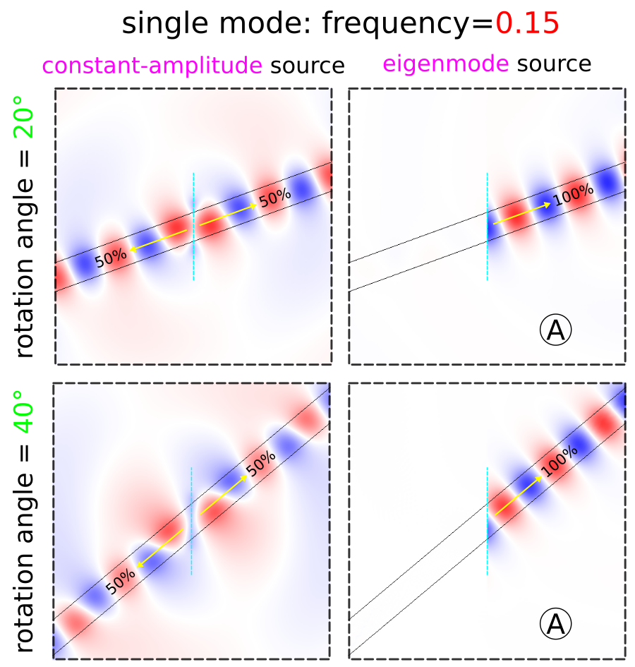

---
# Eigenmode Source
---

This example demonstrates using the [`EigenModeSource`](../Python_User_Interface.md#eigenmodesource) to couple exclusively into a single waveguide mode. The structure, shown in the schematic below, is a 2d dielectric waveguide with ε=12 and out-of-plane electric field E<sub>z</sub>. The dispersion relation ω(k) for modes with *even* mirror symmetry in the y-direction is computed using [MPB](https://mpb.readthedocs.io) and also shown in the schematic as blue lines. Using this waveguide configuration, we will investigate two cases: (1) frequency of 0.15 (normalized) which is single mode, and (2) frequency of 0.35 which is multi mode. We will use the eigenmode source feature to excite just a single mode with unidirectional propagation in each case (labeled **A** and **B** in the dispersion relation) and compare the results to using a constant-amplitude source. Results will also be presented for a rotated waveguide axis.

<center>

</center>

The simulation script is in [examples/oblique-source.py](https://github.com/NanoComp/meep/blob/master/python/examples/oblique-source.py).

For the single-mode case of `fsrc=0.15`, a constant-amplitude current source excites both the waveguide mode and radiating fields (which lie within the light cone) in both directions. This is shown in the main inset of the figure above. The `EigenModeSource`, which excites the labeled **A** by setting `kx=0.4` and `bnum=1`, excites only the right-going waveguide mode. There are four key parameters to `EigenModeSource`: `direction`, `eig_kpoint`, `eig_band`, and `eig_parity`. Note that `EigenModeSource` is a line segment centered at the origin extending the length of the entire cell. The parameter `rot_angle` specifies the rotation angle of the waveguide axis and is initially 0. This enables `eig_parity` to include `EVEN_Y` and the cell to include a mirror symmetry plane in the y direction.

For the multi-mode case of `fsrc=0.35`, a constant-amplitude current source excites a superposition of both waveguide modes in addition to the radiating field. The `EigenModeSource` can excites only a given right-going mode: **A** (`kx=0.4`, `bnum=2`) or **B** (`kx=1.2`, `bnum=1`).

```py
import meep as mp
import numpy as np

resolution = 50 # pixels/μm

cell_size = mp.Vector3(14,14,0)
    
pml_layers = [mp.PML(thickness=2)]

rot_angle = np.radians(0)  # rotation angle (in degrees) of waveguide, CCW around z-axis

geometry = [mp.Block(center=mp.Vector3(),
                     size=mp.Vector3(mp.inf,1,mp.inf),
                     e1=mp.Vector3(1,0,0).rotate(mp.Vector3(0,0,1), rot_angle),
                     e2=mp.Vector3(0,1,0).rotate(mp.Vector3(0,0,1), rot_angle),
                     material=mp.Medium(epsilon=12))]

fsrc = 0.15 # frequency of eigenmode or continuous-wave (CW) source
kx = 0.4    # initial guess for wavevector in x-direction of eigenmode
bnum = 1    # band index of eigenmode

eig_src = True

if eig_src:
    sources = [mp.EigenModeSource(src=mp.ContinuousSource(fsrc),
                                  center=mp.Vector3(),
                                  size=mp.Vector3(y=14),
                                  direction=mp.AUTOMATIC if rot_angle == 0 else mp.NO_DIRECTION,
                                  eig_kpoint=mp.Vector3(kx,0,0).rotate(mp.Vector3(0,0,1), rot_angle),
                                  eig_band=bnum,
                                  eig_parity=mp.EVEN_Y+mp.ODD_Z if rot_angle == 0 else mp.ODD_Z,
                                  eig_match_freq=True)]
else:
    sources = [mp.Source(src=mp.ContinuousSource(fsrc),
                         center=mp.Vector3(),
                         size=mp.Vector3(y=2),
                         component=mp.Ez)]

sim = mp.Simulation(cell_size=cell_size,
                    resolution=resolution,
                    boundary_layers=pml_layers,
                    sources=sources,
                    geometry=geometry,
                    symmetries=[mp.Mirror(mp.Y)] if rot_angle == 0 else [])

sim.run(until=100)

nonpml_vol = mp.Volume(center=mp.Vector3(), size=mp.Vector3(10,10,0))
eps_data = sim.get_array(vol=nonpml_vol, component=mp.Dielectric)
ez_data = sim.get_array(vol=nonpml_vol, component=mp.Ez)

import matplotlib.pyplot as plt

plt.figure()
plt.imshow(np.flipud(np.transpose(eps_data)), interpolation='spline36', cmap='binary')
plt.imshow(np.flipud(np.transpose(ez_data)), interpolation='spline36', cmap='RdBu', alpha=0.9)
plt.axis('off')
plt.show()
```

There are numerical dispersion artifacts due to the FDTD spatial and temporal discretizations which create negligible backwards (leftward-propagating) wave artifacts by eigenmode current source, carrying approximately 10<sup>-5</sup> of the power of the desired rightward-propagating mode.

We can also demonstrate the eigenmode source for a rotated waveguide axis for both the single- and multi-mode case. The results are shown in the two figures below. There is one subtlety: for mode **A** in the multi-mode case, the `bnum` parameter be set to 3 rather than 2. This is because non-zero rotation angles break the symmetry in the y direction and therefore preclude the use of `EVEN_Y` in `eig_parity`. Without any parity specified for the y direction, the second band corresponds to odd modes which is why we must select the third band which contains even modes.

<center>

</center>

<center>

</center>
