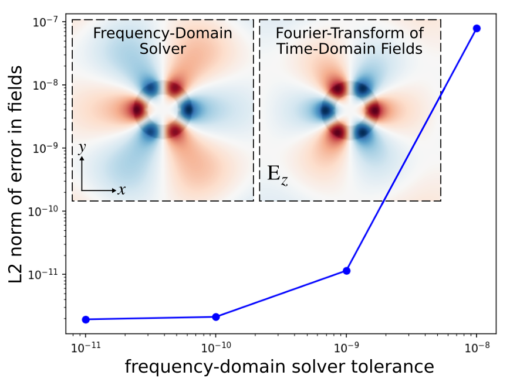

---
# Frequency Domain Solver
---

This tutorial demonstrates Meep's [frequency-domain solver](../Python_User_Interface.md#frequency-domain-solver) which is used to compute the fields produced in response to a [continuous-wave (CW) source](https://en.wikipedia.org/wiki/Continuous_wave). For a description of its inner workings, see Section 5.3 ("Frequency-domain solver") of [Computer Physics Communications, Vol. 181, pp. 687-702, 2010](http://ab-initio.mit.edu/~oskooi/papers/Oskooi10.pdf). This example involves using the frequency-domain solver to compute the fields of a ring resonator which is described in [Tutorial/Basics](Basics.md#modes-of-a-ring-resonator). First, we will verify that the error in the fields decreases monotonically with decreasing tolerance of the iterative solver. And then, we will demonstrate qualitative agreement with the frequency-domain fields computed using a different method: [Fourier transforming](https://en.wikipedia.org/wiki/Discrete_Fourier_transform) the time-domain fields in response to a narrowband Gaussian-pulse source.

Usage of the frequency-domain solver involves only two changes to the [original simulation](https://github.com/NanoComp/meep/blob/master/python/examples/ring.py): (1) replace the pulse source with a [continuous source](../Python_User_Interface.md#continuoussource), and (2) turn on complex fields since real fields are used by default. Everything else remains unchanged.

Since the frequency-domain solver uses an [iterative method](https://en.wikipedia.org/wiki/Iterative_method), there are a couple of things we can do to improve its convergence properties: (1) use a non-zero smoothing width for the CW source (default is 0) to reduce the high-frequency oscillations produced by its abrupt turn on which have slow group velocities and are absorbed poorly by [PML](../Perfectly_Matched_Layer.md), and (2) increase the $L$ parameter of the [BiCGSTAB-L](https://en.wikipedia.org/wiki/Biconjugate_gradient_stabilized_method) iterative solver from the default of 2 to 10.

We compute the fundamental mode at five different solver tolerances chosen on a logarithmic scale. We will then plot the L2 norm of the error in the fields as a function of the tolerance.

The simulation script is in [examples/solve-cw.py](https://github.com/NanoComp/meep/blob/master/python/examples/solve-cw.py). The notebook is [examples/solve-cw.ipynb](https://nbviewer.jupyter.org/github/NanoComp/meep/blob/master/python/examples/solve-cw.ipynb).

```py
import meep as mp
import numpy as np
from numpy import linalg as LA
import matplotlib.pyplot as plt

n = 3.4
w = 1
r = 1
pad = 4
dpml = 2

sxy = 2*(r+w+pad+dpml)
cell_size = mp.Vector3(sxy,sxy)

pml_layers = [mp.PML(dpml)]

nonpml_vol = mp.Volume(mp.Vector3(), size=mp.Vector3(sxy-2*dpml,sxy-2*dpml))

geometry = [mp.Cylinder(radius=r+w, material=mp.Medium(index=n)),
            mp.Cylinder(radius=r)]

fcen = 0.118
df = 0.08

src = [mp.Source(mp.ContinuousSource(fcen,fwidth=df),
                 component=mp.Ez,
                 center=mp.Vector3(r+0.1)),
       mp.Source(mp.ContinuousSource(fcen,fwidth=df),
                 component=mp.Ez,
                 center=mp.Vector3(-(r+0.1)),
                 amplitude=-1)]

symmetries = [mp.Mirror(mp.X,phase=-1),
              mp.Mirror(mp.Y,phase=+1)]

sim = mp.Simulation(cell_size=cell_size,
                    geometry=geometry,
                    sources=src,
                    resolution=10,
                    force_complex_fields=True,
                    symmetries=symmetries,
                    boundary_layers=pml_layers)

num_tols = 5
tols = np.power(10, np.arange(-8.0,-8.0-num_tols,-1.0))
ez_dat = np.zeros((122,122,num_tols), dtype=np.complex_)

for i in range(num_tols):
    sim.init_sim()
    sim.solve_cw(tols[i], 10000, 10)
    ez_dat[:,:,i] = sim.get_array(vol=nonpml_vol, component=mp.Ez)

err_dat = np.zeros(num_tols-1)
for i in range(num_tols-1):
    err_dat[i] = LA.norm(ez_dat[:,:,i]-ez_dat[:,:,num_tols-1])

plt.figure(dpi=150)
plt.loglog(tols[:num_tols-1], err_dat, 'bo-');
plt.xlabel("frequency-domain solver tolerance");
plt.ylabel("L2 norm of error in fields");
plt.show()

eps_data = sim.get_array(vol=nonpml_vol, component=mp.Dielectric)
ez_data = np.real(ez_dat[:,:,num_tols-1])

plt.figure()
plt.imshow(eps_data.transpose(), interpolation='spline36', cmap='binary')
plt.imshow(ez_data.transpose(), interpolation='spline36', cmap='RdBu', alpha=0.9)
plt.axis('off')
plt.show()

if np.all(np.diff(err_dat) < 0):
    print("PASSED solve_cw test: error in the fields is decreasing with increasing resolution")
else:
    print("FAILED solve_cw test: error in the fields is NOT decreasing with increasing resolution")
```

The results are shown in the figure below. The error in the fields decreases monotonically with decreasing tolerance of the frequency-domain solver. The error is converging to an asymptotic limit of `1e-12` which is set by the lowest tolerance.

<center>

</center>

As a further validation of the frequency-domain solver, we will compare its fields with those computed using time-stepping. This involves taking the Fourier transform of E<sub>z</sub> via the `add_dft_fields` routine. After the time stepping, the frequency-domain fields are accessed using [`get_dft_array`](../Python_User_Interface.md#array-slices).

```py
sim.reset_meep()

src = [mp.Source(mp.GaussianSource(fcen,fwidth=df),
                 component=mp.Ez,
                 center=mp.Vector3(r+0.1)),
       mp.Source(mp.GaussianSource(fcen,fwidth=df),
                 component=mp.Ez,
                 center=mp.Vector3(-(r+0.1)),
                 amplitude=-1)]

sim = mp.Simulation(cell_size=mp.Vector3(sxy,sxy),
                    geometry=geometry,
                    sources=src,
                    resolution=10,
                    symmetries=symmetries,
                    boundary_layers=pml_layers)

dft_obj = sim.add_dft_fields([mp.Ez], fcen, fcen, 1, where=nonpml_vol)

sim.run(until_after_sources=100)

eps_data = sim.get_array(vol=nonpml_vol, component=mp.Dielectric)
ez_data = np.real(sim.get_dft_array(dft_obj, mp.Ez, 0))

plt.figure()
plt.imshow(eps_data.transpose(), interpolation='spline36', cmap='binary')
plt.imshow(ez_data.transpose(), interpolation='spline36', cmap='RdBu', alpha=0.9)
plt.axis('off')
plt.show()
```

The left inset of the figure above shows the real part of the scalar E<sub>z</sub> field, computed using the frequency-domain solver with a tolerance of `1e-12`, superimposed on the ring-resonator geometry. Note the three-fold mirror symmetry of the field pattern (fundamental mode) and faint presence of the point source. The right inset is for the Fourier-transformed fields of the time-domain calculation. There is a phase difference in the field profiles which are otherwise qualitatively similar.
