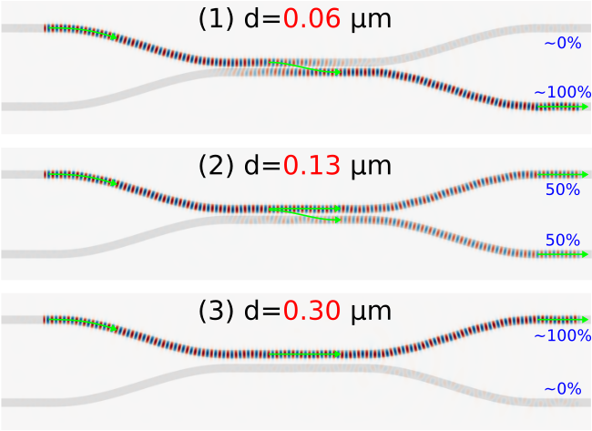
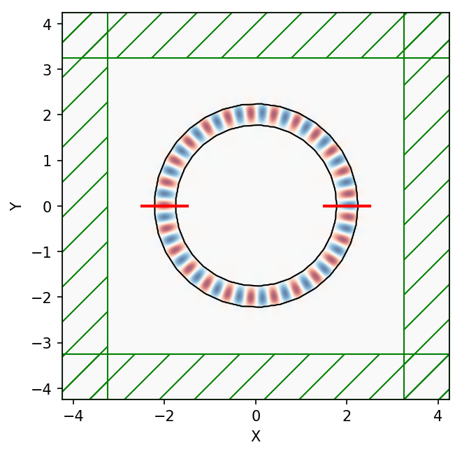

---
# GDSII Import
---

This tutorial demonstrates how to set up a simulation based on importing a [GDSII](https://en.wikipedia.org/wiki/GDSII) file. There are two examples: (1) computing the [S-parameters](https://en.wikipedia.org/wiki/Scattering_parameters) of a [four-port network](https://en.wikipedia.org/wiki/Two-port_network#Scattering_parameters_(S-parameters)) using a silicon directional coupler and (2) finding the modes of a ring resonator. These two component devices are used in [photonic integrated circuits](https://en.wikipedia.org/wiki/Photonic_integrated_circuit) to split/combine and filter an input signal. For more information on directional couplers and ring resonators, see Section 4.1 of [Silicon Photonics Design](https://www.amazon.com/Silicon-Photonics-Design-Devices-Systems/dp/1107085454) by Chrostowski and Hochberg.

[TOC]

S-Parameters of a Directional Coupler
-------------------------------------

The directional coupler as well as the source and mode monitor geometries are described by the GDSII file [`examples/coupler.gds`](https://github.com/NanoComp/meep/blob/master/python/examples/coupler.gds). A snapshot of this file viewed using [KLayout](https://www.klayout.de/) is shown below. The figure labels have been added in post processing. The design consists of two identical [strip waveguides](http://www.simpetus.com/projects.html#mpb_waveguide) which are positioned close together via an adiabatic taper such that their modes couple evanescently. There is a source (labelled "Source") and four mode monitors (labelled "Port 1", "Port 2", etc.). The input pulse from Port 1 is split in two and exits through Ports 3 and 4. The design objective is to find the separation distance which maximizes the outgoing power in Port 4 at a wavelength of 1.55 μm. More generally, though not included in this example, it is possible to have two additional degrees of freedom: (1) the length of the straight waveguide section where the two waveguides are coupled and (2) the length of the tapered section (the taper profile is described by a hyperbolic tangent (tanh) function).

<center>

</center>

The GDSII file is adapted from the [SiEPIC EBeam PDK](https://github.com/lukasc-ubc/SiEPIC_EBeam_PDK) with four major modifications:

+ the computational cell is centered at the origin of the $xy$ plane and defined on layer 0

+ the source and four mode monitors are defined on layers 1-5

+ the lower and upper branches of the coupler are defined on layers 31 and 32

+ the straight waveguide sections are perfectly linear

Note that rather than being specified as part of the GDSII file, the volume regions of the source and flux monitors could have been specified in the simulation script.

The simulation script is in [examples/coupler.py](https://github.com/NanoComp/meep/blob/master/python/examples/coupler.py). The notebook is [examples/coupler.ipynb](https://nbviewer.jupyter.org/github/NanoComp/meep/blob/master/python/examples/coupler.ipynb).

```python
import meep as mp
import argparse

gdsII_file = 'coupler.gds'
CELL_LAYER = 0
PORT1_LAYER = 1
PORT2_LAYER = 2
PORT3_LAYER = 3
PORT4_LAYER = 4
SOURCE_LAYER = 5
UPPER_BRANCH_LAYER = 31
LOWER_BRANCH_LAYER = 32
default_d = 0.3

t_oxide = 1.0
t_Si = 0.22
t_air = 0.78

dpml = 1
cell_thickness = dpml+t_oxide+t_Si+t_air+dpml

oxide = mp.Medium(epsilon=2.25)
silicon = mp.Medium(epsilon=12)

fcen = 1/1.55
df = 0.2*fcen

def main(args):
    cell_zmax = 0.5*cell_thickness if args.three_d else 0
    cell_zmin = -0.5*cell_thickness if args.three_d else 0
    si_zmax = 0.5*t_Si if args.three_d else 10
    si_zmin = -0.5*t_Si if args.three_d else -10

    # read cell size, volumes for source region and flux monitors,
    # and coupler geometry from GDSII file
    upper_branch = mp.get_GDSII_prisms(silicon, gdsII_file, UPPER_BRANCH_LAYER, si_zmin, si_zmax)
    lower_branch = mp.get_GDSII_prisms(silicon, gdsII_file, LOWER_BRANCH_LAYER, si_zmin, si_zmax)

    cell = mp.GDSII_vol(gdsII_file, CELL_LAYER, cell_zmin, cell_zmax)
    p1 = mp.GDSII_vol(gdsII_file, PORT1_LAYER, si_zmin, si_zmax)
    p2 = mp.GDSII_vol(gdsII_file, PORT2_LAYER, si_zmin, si_zmax)
    p3 = mp.GDSII_vol(gdsII_file, PORT3_LAYER, si_zmin, si_zmax)
    p4 = mp.GDSII_vol(gdsII_file, PORT4_LAYER, si_zmin, si_zmax)
    src_vol = mp.GDSII_vol(gdsII_file, SOURCE_LAYER, si_zmin, si_zmax)

    # displace upper and lower branches of coupler (as well as source and flux regions)
    if args.d != default_d:
        delta_y = 0.5*(args.d-default_d)
        delta = mp.Vector3(y=delta_y)
        p1.center += delta
        p2.center -= delta
        p3.center += delta
        p4.center -= delta
        src_vol.center += delta
        cell.size += 2*delta
        for np in range(len(lower_branch)):
            lower_branch[np].center -= delta
            for nv in range(len(lower_branch[np].vertices)):
                lower_branch[np].vertices[nv] -= delta
        for np in range(len(upper_branch)):
            upper_branch[np].center += delta
            for nv in range(len(upper_branch[np].vertices)):
                upper_branch[np].vertices[nv] += delta

    geometry = upper_branch+lower_branch

    if args.three_d:
        oxide_center = mp.Vector3(z=-0.5*t_oxide)
        oxide_size = mp.Vector3(cell.size.x,cell.size.y,t_oxide)
        oxide_layer = [mp.Block(material=oxide, center=oxide_center, size=oxide_size)]
        geometry = geometry+oxide_layer

    sources = [mp.EigenModeSource(src=mp.GaussianSource(fcen,fwidth=df),
                                  volume=src_vol,
                                  eig_parity=mp.NO_PARITY if args.three_d else mp.EVEN_Y+mp.ODD_Z)]

    sim = mp.Simulation(resolution=args.res,
                        cell_size=cell.size,
                        boundary_layers=[mp.PML(dpml)],
                        sources=sources,
                        geometry=geometry)

    mode1 = sim.add_mode_monitor(fcen, 0, 1, mp.ModeRegion(volume=p1))
    mode2 = sim.add_mode_monitor(fcen, 0, 1, mp.ModeRegion(volume=p2))
    mode3 = sim.add_mode_monitor(fcen, 0, 1, mp.ModeRegion(volume=p3))
    mode4 = sim.add_mode_monitor(fcen, 0, 1, mp.ModeRegion(volume=p4))

    sim.run(until_after_sources=100)

    # S parameters
    p1_coeff = sim.get_eigenmode_coefficients(mode1, [1], eig_parity=mp.NO_PARITY if args.three_d else mp.EVEN_Y+mp.ODD_Z).alpha[0,0,0]
    p2_coeff = sim.get_eigenmode_coefficients(mode2, [1], eig_parity=mp.NO_PARITY if args.three_d else mp.EVEN_Y+mp.ODD_Z).alpha[0,0,1]
    p3_coeff = sim.get_eigenmode_coefficients(mode3, [1], eig_parity=mp.NO_PARITY if args.three_d else mp.EVEN_Y+mp.ODD_Z).alpha[0,0,0]
    p4_coeff = sim.get_eigenmode_coefficients(mode4, [1], eig_parity=mp.NO_PARITY if args.three_d else mp.EVEN_Y+mp.ODD_Z).alpha[0,0,0]

    # transmittance
    p2_trans = abs(p2_coeff)**2/abs(p1_coeff)**2
    p3_trans = abs(p3_coeff)**2/abs(p1_coeff)**2
    p4_trans = abs(p4_coeff)**2/abs(p1_coeff)**2

    print("trans:, {:.2f}, {:.6f}, {:.6f}, {:.6f}".format(args.d,p2_trans,p3_trans,p4_trans))

if __name__ == '__main__':
    parser = argparse.ArgumentParser()
    parser.add_argument('-res', type=int, default=50, help='resolution (default: 50 pixels/um)')
    parser.add_argument('-d', type=float, default=0.1, help='branch separation (default: 0.1 um)')
    parser.add_argument('--three_d', action='store_true', default=False, help='3d calculation? (default: False)')
    args = parser.parse_args()
    main(args)
```

For a given waveguide separation distance ($d$), the simulation computes the transmittance of Ports 2, 3, and 4. The transmittance is the square of the [S-parameter](https://en.wikipedia.org/wiki/Scattering_parameters) which itself is equivalent to the [mode coefficient](Mode_Decomposition.md). There is an additional mode monitor at Port 1 to compute the input power from the adjacent eigenmode source; this is used for normalization when computing the transmittance. The eight layers of the GDSII file are each converted to a `Simulation` object: the upper and lower branches of the coupler are defined as a collection of [`Prism`](../Python_User_Interface.md#prism)s, the rectilinear regions of the source and flux monitor as a [`Volume`](../Python_User_Interface.md#volume) and [`FluxRegion`](../Python_User_Interface.md#fluxregion). The size of the cell in the $y$ direction is dependent on $d$. The default dimensionality is 2d. (Note that for a 2d cell the `Prism` objects returned by `get_GDSII_prisms` must have a finite height. The finite height of `Volume` objects returned by `GDSII_vol` are ignored in 2d.) An optional input parameter (`three_d`) converts the geometry to 3d by extruding the coupler geometry in the $z$ direction and adding an oxide layer beneath similar to a [silicon on insulator](https://en.wikipedia.org/wiki/Silicon_on_insulator) (SOI) substrate. A schematic of the coupler design in 3d generated using MayaVi is shown below.

<center>

</center>

The coupler properties are computed for a range of separation distances from 0.02 to 0.30 μm with increments of 0.02 μm from the shell command line:

```
for d in `seq 0.02 0.02 0.30`; do
    mpirun -np 2 python coupler.py -d ${d} |tee -a directional_coupler.out;
done

grep trans: directional_coupler.out |cut -d , -f2- > directional_coupler.dat;
```

The transmittance results converted into [insertion loss](https://en.wikipedia.org/wiki/Insertion_loss) for Ports 3 and 4 are shown in the figure below. (There is essentially no flux into Port 2 and thus $|S_{21}|^2$ is not shown in the figure.) When the two waveguide branches are sufficiently separated ($d$ > 0.2 μm), practically all of the input power remains in the top branch and is transferred to Port 3. A small amount of the input power is lost due to scattering into radiative modes within the light cone in the tapered sections where the translational symmetry of the waveguide is broken. This is why the power in Port 3 never reaches exactly 100%. For separation distances of less than approximately 0.2 μm, evanescent coupling of the modes from the top to the lower branch begins to transfer some of the input power to Port 4. For $d$ of 0.13 μm, the input signal is split evenly into Ports 3 and 4. For $d$ of 0.06 μm, the input power is transferred completely to Port 4. Finally, for $d$ of less than 0.06 μm, the evanescent coupling becomes rapidly ineffective and the signal again remains mostly in Port 3.

<center>

</center>

These quantitative results can also be verified qualitatively using the field profiles shown below for $d$ of 0.06, 0.13, and 0.30 μm. To generate these images, the pulse source is replaced with a [continuous wave](../Python_User_Interface.md#continuoussource) (CW) and the fields are time stepped for a sufficiently long run time until they have reached steady state. The [array slicing](../Python_User_Interface.md#array-slices) routines `get_epsilon` and `get_efield_z` are then used to obtain the dielectric and field data over the entire cell.

```py
sources = [mp.EigenModeSource(src=mp.ContinuousSource(fcen,fwidth=df),
                              volume=src_vol,
                              eig_parity=mp.EVEN_Y+mp.ODD_Z)]

sim = mp.Simulation(resolution=res,
                    cell_size=cell.size,
                    boundary_layers=[mp.PML(dpml)],
                    sources=sources,
                    geometry=geometry)

sim.run(until=400)  # arbitrary long run time to ensure that fields have reached steady state

eps_data = sim.get_epsilon()
ez_data = np.real(sim.get_efield_z())

import matplotlib.pyplot as plt

plt.figure()
plt.plot2D(fields=mp.Ez,
           plot_sources_flag=False,
           plot_monitors_flag=False,
           plot_boundaries_flag=False)
plt.axis('off')
plt.show()
```

<center>

</center>

The field profiles confirm that for $d$ of 0.06 μm (Figure 1), the input signal in Port 1 of the top branch is almost completely transferred to Port 4 of the bottom branch. For $d$ of 0.13 μm (Figure 2), the input signal is split evenly between the two branches. Finally, for $d$ of 0.30 μm (Figure 3), there is no longer any evanescent coupling and the signal remains completely in the top branch. The waveguide regions with no fields in Ports 3 and 4 are PML.

### When computing the reflection coefficient |S<sub>11</sub>|<sup>2</sup>, is it necessary to perform a separate normalization run to obtain the incident fields?

No (generally). In the single-run calculation of the reflection coefficent $|S_{11}|^2$ which is based on the back-scattered fields in Port 1 (due to the finite taper/bend length which breaks translational symmetry) given the forward-propagating fields of an eigenmode source also in Port 1, slight discretization errors in the eigenmode-coefficient extraction (as described in paragraph 3 of Section 4.2.2 of this [book chapter](https://arxiv.org/abs/1301.5366)) will result in a "noise floor" below which the reflection cannot be measured in this way. This "noise floor" only applies at a fixed resolution — as the resolution is increased, the discretization error in the mode-coefficient calculation goes away, and $|S_{11}|^2$ should approach the "true" reflection from the taper/bend. This is demonstrated in the figure below which shows a plot of the $S_{11}$ and $S_{21}$ reflectance versus resolution. (In these types of calculations, it is important that the source and mode monitor in the same port be separated by *at least several pixels* in order to avoid any overlap due to the grid discretization.)

<center>

</center>

In the limit of infinite resolution, the discretization error is removed and the reflectance for $S_{11}$ and $S_{21}$ converge to their "true" values of ~10<sup>-6</sup> and ~10<sup>-8</sup>, respectively. (Note that the back-scattered fields in Port 2 are two orders of magnitude smaller than those in Port 1 because the input fields in the upper branch of the directional coupler must cross into the lower branch to reach Port 2.) In this example, $|S_{21}|^2$ requires a resolution of at least ~150 to minimize discretization errors. The discretization errors due to the eigenmode-coefficient extraction can be greatly reduced by using a separate normalization run to compute the incident fields for just a straight waveguide (i.e., no taper/bend) which are then subtracted from the Fourier-transformed fields in Port 1 and 2 of the directional coupler. This procedure is similar to those involving [flux calculations](Basics.md#transmittance-spectrum-of-a-waveguide-bend). (Alternatively, for single-mode waveguides, the mode-coefficient calculation can be replaced entirely with just computing the Poynting flux in the ports. This approach is more accurate at lower resolutions.) For practical applications, however, reflectance values less than 40 dB (e.g., for telecom multi-path interference tolerances) are often considered negligible. On the other hand, there may be theoretical investigations where trying to resolve such small reflections could be important. (As reflections approach 10<sup>-15</sup>, the limits of floating-point precision will eventually limit accuracy even for the normalization approach.)

### Importing a GDS Layer using a Tuple

In the directional coupler example above, individual layers of the GDS file were imported by specifying a single number in the `get_GDSII_prisms` routine (i.e., 1, 2, 31, 32, etc.). However, there are certain GDS files in which the layers are referenced using a 2-tuple (e.g., (37,4)). Since `get_GDSII_prisms` which is based on [`libGDSII`](https://github.com/HomerReid/libGDSII) does not support this feature, you will need to use [`gdspy`](https://gdspy.readthedocs.io/) as demonstrated in the following example.

```py
import meep as mp
import gdspy

# load the GDS file
gds = gdspy.GdsLibrary(infile=gds_file)

# define cell size and center
box = gds.top_level()[0].get_bounding_box()
cell_center = 0.5*mp.Vector3(box[1][0] + box[0][0],box[1][1] + box[0][1])

# define the geometry using all the polygons from layer (37,4)
polygons = gds.top_level()[0].get_polygons(True)[37,4]

design_geometry = []
for pg in polygons:
  vertices = []
  for vt in pg:
    # define vertices relative to center of cell
    vertices.append(mp.Vector3(vt[0],vt[1])-cell_center)
  design_geometry.append(mp.Prism(vertices=vertices,
                                  height=0.5,
                                  axis=mp.Vector3(0,0,+1),
                                  material=mp.Medium(index=3.5)))
  design_geometry.append(mp.Prism(vertices=vertices,
                                  height=0.5,
                                  axis=mp.Vector3(0,0,-1),
                                  material=mp.Medium(index=3.5)))
```

Note that for each polygon in the GDS layer, there are *two* `Prism` objects: one extending in the $+z$ direction and the other in $-z$ with a combined height of 1.0 μm.

Modes of a Ring Resonator
-------------------------

The next example is similar to [Tutorial/Basics/Modes of a Ring Resonator](../Python_Tutorials/Basics.md#modes-of-a-ring-resonator) and consists of two parts: (1) creating the ring resonator geometry using [gdspy](https://gdspy.readthedocs.io/en/stable/) and (2) finding its modes using [Harminv](../Python_User_Interface.md#harminv). The cell, geometry, source, and monitor are defined on separate layers within the same GDSII file.

The simulation script is in [examples/ring_gds.py](https://github.com/NanoComp/meep/blob/master/python/examples/ring_gds.py).

```py
import numpy as np
import gdspy
from matplotlib import pyplot as plt
import importlib
import meep as mp

# core and cladding materials
Si   = mp.Medium(index=3.4)
SiO2 = mp.Medium(index=1.4)

# layer numbers for GDS file
RING_LAYER       = 0
SOURCE0_LAYER    = 1
SOURCE1_LAYER    = 2
MONITOR_LAYER    = 3
SIMULATION_LAYER = 4

resolution = 50         # pixels/μm
dpml       = 1          # thickness of PML
zmin       = 0          # minimum z value of simulation domain (0 for 2D)
zmax       = 0          # maximum z value of simulation domain (0 for 2D)

def create_ring_gds(radius,width):
    # Reload the library each time to prevent gds library name clashes
    importlib.reload(gdspy)

    ringCell = gdspy.Cell("ring_resonator_r{}_w{}".format(radius,width))

    # Draw the ring
    ringCell.add(gdspy.Round((0,0),
                             inner_radius=radius-width/2,
                             radius=radius+width/2,
                             layer=RING_LAYER))

    # Draw the first source
    ringCell.add(gdspy.Rectangle((radius-width,0),
                                 (radius+width,0),
                                 SOURCE0_LAYER))

    # Draw the second source
    ringCell.add(gdspy.Rectangle((-radius-width,0),
                                 (-radius+width,0),
                                 SOURCE1_LAYER))

    # Draw the monitor location
    ringCell.add(gdspy.Rectangle((radius-width/2,0),
                                 (radius+width/2,0),
                                 MONITOR_LAYER))

    # Draw the simulation domain
    pad = 2  # padding between waveguide and edge of PML
    ringCell.add(gdspy.Rectangle((-radius-width/2-pad,-radius-width/2-pad),
                                 (radius+width/2+pad,radius+width/2+pad),
                                 SIMULATION_LAYER))

    filename = "ring_r{}_w{}.gds".format(radius,width)
    gdspy.write_gds(filename, unit=1.0e-6, precision=1.0e-9)

    return filename

def find_modes(filename,wvl=1.55,bw=0.05):
    # Read in the ring structure
    geometry = mp.get_GDSII_prisms(Si,filename,RING_LAYER,-100,100)

    cell = mp.GDSII_vol(filename,SIMULATION_LAYER,zmin,zmax)

    src_vol0 = mp.GDSII_vol(filename,SOURCE0_LAYER,zmin,zmax)
    src_vol1 = mp.GDSII_vol(filename,SOURCE1_LAYER,zmin,zmax)

    mon_vol = mp.GDSII_vol(filename,MONITOR_LAYER,zmin,zmax)

    fcen = 1/wvl
    df = bw*fcen

    src = [mp.Source(mp.GaussianSource(fcen, fwidth=df),
                     component=mp.Hz,
                     volume=src_vol0),
           mp.Source(mp.GaussianSource(fcen, fwidth=df),
                     component=mp.Hz,
                     volume=src_vol1,
                     amplitude=-1)]

    sim = mp.Simulation(cell_size=cell.size,
                        geometry=geometry,
                        sources=src,
                        resolution=resolution,
                        boundary_layers=[mp.PML(dpml)],
                        default_material=SiO2)

    h = mp.Harminv(mp.Hz,mon_vol.center,fcen,df)

    sim.run(mp.after_sources(h),
            until_after_sources=100)

    plt.figure()
    sim.plot2D(fields=mp.Hz,
               eps_parameters={'contour':True})
    plt.savefig('ring_resonator_Hz.png',bbox_inches='tight',dpi=150)

    wvl = np.array([1/m.freq for m in h.modes])
    Q = np.array([m.Q for m in h.modes])

    sim.reset_meep()

    return wvl, Q


if __name__ == '__main__':
    filename = create_ring_gds(2.0,0.5)
    wvls, Qs = find_modes(filename,1.55,0.05)
    for w, Q in zip(wvls,Qs):
        print("mode: {}, {}".format(w,Q))
```

Note the absence of `symmetries` even though, in principle, the ring geometry and the two line sources satisfy two mirror symmetry planes through the $x$ (even) and $y$ (odd) axes. This omission is due to the fact that the ring geometry created using gdspy and imported from the GDSII file is actually a [`Prism`](../Python_User_Interface.md#prism) consisting of a discrete number of vertices (rather than two overlapping `Cylinder`s as in [Tutorial/Basics/Modes of a Ring Resonator](../Python_Tutorials/Basics.md#modes-of-a-ring-resonator)). Discretization artifacts of the ring geometry slightly break its mirror symmetry. (Attempting to use `symmetries` in this case yields unpredictable results.)

For this ring geometry, Harminv finds a mode with wavelength 1.5490604 μm and $Q$ of 124691.308. The $H_z$ field profile is shown below. As expected, due to the large $Q$ the mode is tightly confined to the ring and exhibits little radiative loss.

<center>

</center>
