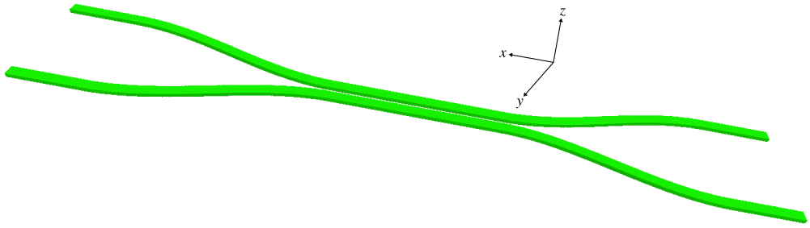

---
# GDSII Import
---

This tutorial demonstrates how to set up a simulation based on importing a [GDSII](https://en.wikipedia.org/wiki/GDSII) file. The example involves computing the [scattering parameters](https://en.wikipedia.org/wiki/Scattering_parameters) of a [two-port network](https://en.wikipedia.org/wiki/Two-port_network#Scattering_parameters_(S-parameters)) using a silicon directional coupler. These component devices are used in [photonic integrated circuits](https://en.wikipedia.org/wiki/Photonic_integrated_circuit) to split or combine an input signal. For more information on directional couplers, see Section 4.1 of [Silicon Photonics Design](https://www.amazon.com/Silicon-Photonics-Design-Devices-Systems/dp/1107085454) by Chrostowski and Hochberg.

[TOC]

---
## Silicon Directional Coupler as GDSII File
---

The directional coupler geometry we will investigate is described by the GDSII file [examples/coupler.gds](https://github.com/NanoComp/meep/blob/master/python/examples/coupler.gds). A snapshot of this file viewed using [KLayout](https://www.klayout.de/) is shown below. The figure labels have been added in post processing. The design consists of two identical strip waveguides which are positioned close together via an adiabatic taper such that their modes couple evanescently. An input pulse from Port 1 is split in two and exits through Ports 3 and 4. The design objective is to find the separation distance which maximizes power in Port 4 at a wavelength of 1.55 μm. More generally, though not included in this example, it is possible to have two additional degrees of freedom: (1) the length of the straight waveguide section where the two waveguides are coupled and (2) the length of the tapered section (the taper profile is described by a hyperbolic tangent (tanh) function).

<center>

</center>

The GDSII file is adapted from the [SiEPIC EBeam PDK](https://github.com/lukasc-ubc/SiEPIC_EBeam_PDK) with four major modifications:

+ the computational cell is centered at the origin of the *xy* plane and defined on layer 0

+ the eigenmode source and monitors are defined on layers 1-5

+ the lower and upper branches of the coupler are defined on layers 31 and 32

+ the straight waveguide sections are perfectly linear

Note that rather than being specified as part of the GDSII file, the volume regions of the source and flux monitors could have been specified in the simulation script.

---
## Simulation Script
---

The simulation script is in [examples/coupler.py](https://github.com/NanoComp/meep/blob/master/python/examples/coupler.py).

```python
import meep as mp
import argparse

gdsII_file = 'coupler.gds'
CELL_LAYER = 0
PORT1_LAYER = 1
PORT2_LAYER = 2
PORT3_LAYER = 3
PORT4_LAYER = 4
SOURCE_LAYER = 5
UPPER_BRANCH_LAYER = 31
LOWER_BRANCH_LAYER = 32
default_d = 0.3

t_oxide = 1.0
t_Si = 0.22
t_air = 0.78

dpml = 1
cell_thickness = dpml+t_oxide+t_Si+t_air+dpml
si_zmin = 0

oxide = mp.Medium(epsilon=2.25)
silicon=mp.Medium(epsilon=12)

lcen = 1.55
fcen = 1/lcen
df = 0.2*fcen

def main(args):
    cell_zmax = 0.5*cell_thickness if args.three_d else 0
    cell_zmin = -0.5*cell_thickness if args.three_d else 0
    si_zmax = t_Si if args.three_d else 0

    # read cell size, volumes for source region and flux monitors,
    # and coupler geometry from GDSII file
    upper_branch = mp.get_GDSII_prisms(silicon, gdsII_file, UPPER_BRANCH_LAYER, si_zmin, si_zmax)
    lower_branch = mp.get_GDSII_prisms(silicon, gdsII_file, LOWER_BRANCH_LAYER, si_zmin, si_zmax)

    cell = mp.GDSII_vol(gdsII_file, CELL_LAYER, cell_zmin, cell_zmax)
    p1 = mp.GDSII_vol(gdsII_file, PORT1_LAYER, si_zmin, si_zmax)
    p2 = mp.GDSII_vol(gdsII_file, PORT2_LAYER, si_zmin, si_zmax)
    p3 = mp.GDSII_vol(gdsII_file, PORT3_LAYER, si_zmin, si_zmax)
    p4 = mp.GDSII_vol(gdsII_file, PORT4_LAYER, si_zmin, si_zmax)
    src_vol = mp.GDSII_vol(gdsII_file, SOURCE_LAYER, si_zmin, si_zmax)

    # displace upper and lower branches of coupler (as well as source and flux regions)
    if args.d != default_d:
        delta_y = 0.5*(args.d-default_d)
        delta = mp.Vector3(y=delta_y)
        p1.center += delta
        p2.center -= delta
        p3.center += delta
        p4.center -= delta
        src_vol.center += delta
        cell.size += 2*delta
        for np in range(len(lower_branch)):
            lower_branch[np].center -= delta
            for nv in range(len(lower_branch[np].vertices)):
                lower_branch[np].vertices[nv] -= delta
        for np in range(len(upper_branch)):
            upper_branch[np].center += delta
            for nv in range(len(upper_branch[np].vertices)):
                upper_branch[np].vertices[nv] += delta

    geometry = upper_branch+lower_branch

    if args.three_d:
        oxide_center = mp.Vector3(z=-0.5*t_oxide)
        oxide_size = mp.Vector3(cell.size.x,cell.size.y,t_oxide)
        oxide_layer = [mp.Block(material=oxide, center=oxide_center, size=oxide_size)]
        geometry = geometry+oxide_layer

    sources = [mp.EigenModeSource(src=mp.GaussianSource(fcen,fwidth=df),
                                  size=src_vol.size,
                                  center=src_vol.center,
                                  eig_band=1,
                                  eig_parity=mp.NO_PARITY if args.three_d else mp.EVEN_Y+mp.ODD_Z,
                                  eig_match_freq=True)]

    sim = mp.Simulation(resolution=args.res,
                        cell_size=cell.size,
                        boundary_layers=[mp.PML(dpml)],
                        sources=sources,
                        geometry=geometry)

    mode1 = sim.add_mode_monitor(fcen, 0, 1, mp.ModeRegion(volume=p1))
    mode2 = sim.add_mode_monitor(fcen, 0, 1, mp.ModeRegion(volume=p2))
    mode3 = sim.add_mode_monitor(fcen, 0, 1, mp.ModeRegion(volume=p3))
    mode4 = sim.add_mode_monitor(fcen, 0, 1, mp.ModeRegion(volume=p4))

    sim.run(until_after_sources=100)

    # S parameters
    p1_coeff = sim.get_eigenmode_coefficients(mode1, [1], eig_parity=mp.NO_PARITY if args.three_d else mp.EVEN_Y+mp.ODD_Z).alpha[0,0,0]
    p2_coeff = sim.get_eigenmode_coefficients(mode2, [1], eig_parity=mp.NO_PARITY if args.three_d else mp.EVEN_Y+mp.ODD_Z).alpha[0,0,1]
    p3_coeff = sim.get_eigenmode_coefficients(mode3, [1], eig_parity=mp.NO_PARITY if args.three_d else mp.EVEN_Y+mp.ODD_Z).alpha[0,0,0]
    p4_coeff = sim.get_eigenmode_coefficients(mode4, [1], eig_parity=mp.NO_PARITY if args.three_d else mp.EVEN_Y+mp.ODD_Z).alpha[0,0,0]

    # transmittance
    p2_trans = abs(p2_coeff)**2/abs(p1_coeff)**2
    p3_trans = abs(p3_coeff)**2/abs(p1_coeff)**2
    p4_trans = abs(p4_coeff)**2/abs(p1_coeff)**2

    print("trans:, {:.2f}, {:.6f}, {:.6f}, {:.6f}".format(args.d,p2_trans,p3_trans,p4_trans))

if __name__ == '__main__':
    parser = argparse.ArgumentParser()
    parser.add_argument('-res', type=int, default=50, help='resolution (default: 50 pixels/um)')
    parser.add_argument('-d', type=float, default=0.1, help='branch separation (default: 0.1 um)')
    parser.add_argument('--three_d', action='store_true', default=False, help='3d calculation? (default: False)')
    args = parser.parse_args()
    main(args)
```

For a given waveguide separation distance (`d`), the simulation computes the transmittance of Ports 2, 3, and 4. The transmittance is the square of the [scattering (S) parameter](https://en.wikipedia.org/wiki/Scattering_parameters) which is just the [mode coefficient](Mode_Decomposition.md). There is an additional mode monitor at Port 1 to compute the input power from the adjacent eigenmode source; this is used for normalization when computing the transmittance. The eight layers of the GDSII file are each converted to a `Simulation` object: the upper and lower branches of the coupler are defined as a collection of [`Prism`](../Python_User_Interface.md#prism)s, the rectilinear regions of the source and flux monitor as a [`Volume`](../Python_User_Interface.md#volume) and [`FluxRegion`](../Python_User_Interface.md#fluxregion). The size of the cell in the $y$ direction is dependent on `d`. The default dimensionality is 2d. An optional input parameter (`three_d`) converts the geometry to 3d by extruding the coupler geometry in the *z* direction and adding an oxide layer beneath similar to a [silicon on insulator](https://en.wikipedia.org/wiki/Silicon_on_insulator) (SOI) substrate. A schematic of the coupler design in 3d generated using MayaVi is shown below.

<center>

</center>

The coupler properties are computed for a range of separation distances from 0.02 μm to 0.30 μm with increments of 0.02 μm from the shell command line:

```
for d in `seq 0.02 0.02 0.30`; do
    mpirun -np 2 python coupler.py -d ${d} |tee -a directional_coupler.out;
done

grep trans: directional_coupler.out |cut -d , -f2- > directional_coupler.dat;
```

---
## Plotting Results and Visualizing Field Profiles
---

The transmittance results are plotted in the figure below. When the two waveguide branches are sufficiently separated (`d` > 0.2 μm), practically all of the input power remains in the top branch and is transferred to Port 3. A small amount of the input power is lost due to scattering into radiative modes within the light cone in the tapered sections where the translational symmetry of the waveguide is broken. This is why the power in Port 3 never reaches exactly 100%. For separation distances of less than approximately 0.2 μm, evanescent coupling of the modes from the top to the lower branch begins to transfer some of the input power to Port 4. For `d` of 0.13 μm, the input signal is split evenly into Ports 3 and 4. For `d` of 0.06 μm, the input power is transferred completely to Port 4. Finally, for `d` of less than 0.06 μm, the evanescent coupling becomes rapidly ineffective and the signal again remains mostly in Port 3. Note that there is never any power in Port 2 given its location relative to the input from Port 1.

<center>

</center>

These quantitative results can also be verified qualitatively using the field profiles shown below for `d` of 0.06, 0.13, and 0.30 μm. To generate these images, the pulse source is replaced with a [continuous wave](../Python_User_Interface.md#continuoussource) (CW) and the fields are time stepped for a sufficiently long run time until they have reached steady state. The [array slicing](../Python_User_Interface.md#array-slices) routines `get_epsilon` and `get_efield_z` are then used to obtain the dielectric and field data over the entire cell.

```py
sources = [mp.EigenModeSource(src=mp.ContinuousSource(fcen,fwidth=df),
                              size=src_vol.size,
                              center=src_vol.center,
                              eig_band=1,
                              eig_parity=mp.EVEN_Y+mp.ODD_Z,
                              eig_match_freq=True)]

sim = mp.Simulation(resolution=res,
                    cell_size=cell.size,
                    boundary_layers=[mp.PML(dpml)],
                    sources=sources,
                    geometry=geometry)

sim.run(until=400)  # arbitrary long run time to ensure that fields have reached steady state

eps_data = sim.get_epsilon()
ez_data = np.real(sim.get_efield_z())

import matplotlib.pyplot as plt

plt.figure(dpi=150)
plt.imshow(np.transpose(eps_data), interpolation='spline36', cmap='binary')
plt.imshow(np.flipud(np.transpose(ez_data)), interpolation='spline36', cmap='RdBu', alpha=0.9)
plt.axis('off')
plt.show()
```

<center>

</center>

The field profiles confirm that for `d` of 0.06 μm (Figure 1), the input signal in Port 1 of the top branch is almost completely transferred to Port 4 of the bottom branch. For `d` of 0.13 μm (Figure 2), the input signal is split exactly in two between the two branches. Finally, for `d` of 0.30 μm (Figure 3), there is no longer any evanescent coupling and the signal remains completely in the top branch. The waveguide regions with no fields in Ports 3 and 4 are PML.