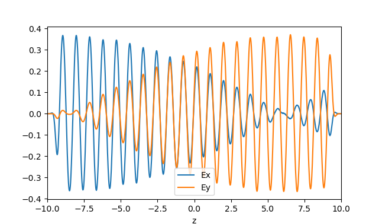
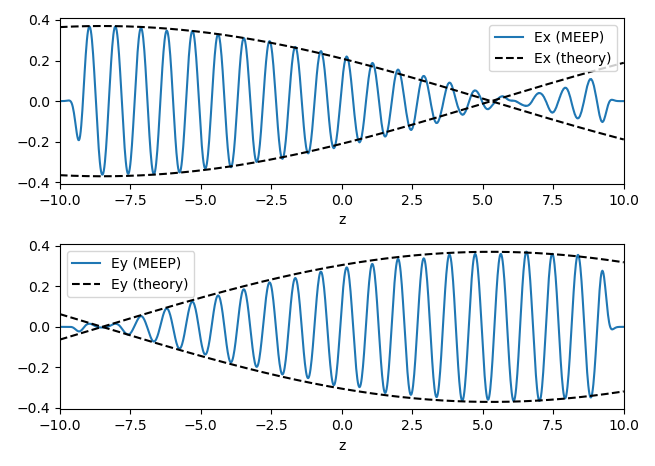

---
# Gyrotropic media
---

In this example, we will perform simulations with gyrotropic media. See [Materials](../Materials.md#gyrotropic-media) for more information on how gyrotropy is supported.

### Faraday Rotation

Consider a uniform gyroelectric medium with bias vector $\mathbf{b} = b \hat{z}$. In the frequency domain, the *x* and *y* components of the dielectric function are

$$\epsilon = \begin{bmatrix}\epsilon_\perp & -i\eta \\ i\eta & \epsilon_\perp \end{bmatrix}$$

In the [gyrotropic Lorentzian model](../Materials.md#gyrotropic-media), the tensor components are

$$\epsilon_\perp = \epsilon_\infty + \frac{\omega_n^2 \Delta_n}{\Delta_n^2 - \omega^2 b^2}\,\sigma_n(\mathbf{x}),\;\;\; \eta = \frac{\omega_n^2 \omega b}{\Delta_n^2 - \omega^2 b^2}\,\sigma_n(\mathbf{x}), \;\;\;\Delta_n \equiv \omega_n^2 - \omega^2 - i\omega\gamma_n$$

The skew-symmetric off-diagonal components in ε give rise to [Faraday rotation](https://en.wikipedia.org/wiki/Faraday_effect): when a plane wave linearly polarized along *x* is launched along the gyrotropy axis *z*, the polarization vector will precess around the gyrotropy axis as the wave propagates. This is the principle behind [Faraday rotators](https://en.wikipedia.org/wiki/Faraday_rotator), devices that act as one-way valves for light.

A plane wave undergoing Faraday rotation can be described by the complex ansatz

$$\begin{bmatrix}E_x \\ E_y\end{bmatrix} = E_0 \begin{bmatrix}\cos(\kappa_c z) \\ \sin(\kappa_c z)\end{bmatrix} e^{i(kz-\omega t)}$$

where $\kappa_c$ is the Faraday rotation (in radians) per unit of propagation distance. Substituting this into the frequency domain Maxwell's equations, with the above dielectric tensor, yields

$$|\kappa_c| = \omega \sqrt{\frac{\mu}{2} \, \left(\epsilon_\perp - \sqrt{\epsilon_\perp^2 - \eta^2}\right)}$$

We model this phenomenon in the simulation script [faraday-rotation.py](https://github.com/NanoComp/meep/blob/master/python/examples/faraday-rotation.py). First, we define a gyroelectric material:

```import meep as mp

## Define a gyroelectric medium
f0 = 1.0
gamma = 1e-6
epsn = 1.5
b0 = 0.15
sn = 0.1

susc = [mp.GyrotropicLorentzianSusceptibility(frequency=f0, gamma=gamma, sigma=sigma,
                                              bias=mp.Vector3(0, 0, b0))]
mat = mp.Medium(epsilon=epsn, mu=1, E_susceptibilities=susc)
```

The `GyrotropicLorentzianSusceptibility` object has a `bias` argument that takes a `Vector3` specifying the gyrotropy vector. In this case, the vector points along *z*, and its magnitude (which specifies the precession frequency) is determined by the variable `b0`. The other arguments play the same role as in an ordinary (non-gyrotropic) [Lorentzian susceptibility](Material_Dispersion.md).

Next, we set up and run the Meep simulation.

```tmax = 100
L = 20.0
cell = mp.Vector3(0, 0, L)
fsrc, src_z = 0.8, -8.5
pml_layers = [mp.PML(thickness=1.0, direction=mp.Z)]

sources = [mp.Source(mp.ContinuousSource(frequency=fsrc),
                     component=mp.Ex, center=mp.Vector3(0, 0, src_z))]

sim = mp.Simulation(cell_size=cell, geometry=[], sources=sources,
                    k_point=mp.Vector3(),   # Periodic boundary conditions
                    boundary_layers=pml_layers,
                    default_material=mat, resolution=50)
sim.run(until=tmax)
```

The simulation cell is one pixel wide in the *x* and *y* directions, with periodic boundary conditions. PMLs are placed in the *z* direction. A `ContinuousSource` emits a wave whose electric field is initially polarized along *x*. We then plot the *x* and *y* components of the electric field versus *z*:

```import numpy as np
import matplotlib.pyplot as plt

ex_data = sim.get_array(center=mp.Vector3(), size=mp.Vector3(0, 0, L), component=mp.Ex)
ey_data = sim.get_array(center=mp.Vector3(), size=mp.Vector3(0, 0, L), component=mp.Ey)

z = np.linspace(-L/2, L/2, len(ex_data))
plt.figure(1)
plt.plot(z, ex_data, label='Ex')
plt.plot(z, ey_data, label='Ey')
plt.xlim(-L/2, L/2)
plt.xlabel('z')
plt.legend()
plt.show()
```

<center>

</center>

We see that the wave indeed rotates in the *x*-*y* plane as it travels. This can be compared quantitatively to the above ansatz for a wave undergoing Faraday rotation, using the material parameters to calculate the rotation rate $\kappa_c$:

```dfsq = (f0**2 - 1j*fsrc*gamma - fsrc**2)
eperp = epsn + sn * f0**2 * dfsq / (dfsq**2 - (fsrc*b0)**2)
eta = sn * f0**2 * fsrc * b0 / (dfsq**2 - (fsrc*b0)**2)

k_gyro = 2*np.pi*fsrc * np.sqrt(0.5*(eperp - np.sqrt(eperp**2 - eta**2)))
Ex_theory = 0.37 * np.cos(k_gyro * (z - src_z)).real
Ey_theory = 0.37 * np.sin(k_gyro * (z - src_z)).real

plt.figure(2)
plt.subplot(2,1,1)
plt.plot(z, ex_data, label='Ex (MEEP)')
plt.plot(z, Ex_theory, 'k--')
plt.plot(z, -Ex_theory, 'k--', label='Ex envelope (theory)')
plt.xlim(-L/2, L/2); plt.xlabel('z')
plt.legend(loc='lower right')

plt.subplot(2,1,2)
plt.plot(z, ey_data, label='Ey (MEEP)')
plt.plot(z, Ey_theory, 'k--')
plt.plot(z, -Ey_theory, 'k--', label='Ey envelope (theory)')
plt.xlim(-L/2, L/2); plt.xlabel('z')
plt.legend(loc='lower right')
plt.tight_layout()
plt.show()
```

The results are in excellent agreement:

<center>

</center>
