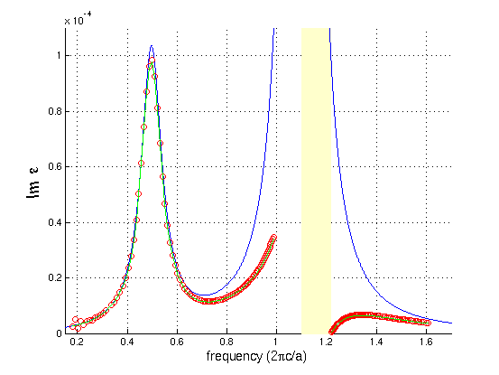

---
# Gyrotropic media
---

In this example, we will perform simulations with a gyrotropic medium. See [Materials](../Materials.md#gyrotropic-media) for more information on how gyrotropy is supported.

[TOC]

## Electromagnetic wave propagation in a ferrite

### Material properties

Ferrites are ceramic materials exhibiting strong gyromagnetic resonances, commonly used in microwave engineering to construct isolators (one-way valves) and circulators. In the presence of a biasing magnetic field $\mathbf{H} = H_0 \hat{\mathbf{z}}$, the permeability tensor of a ferrite material has the form

$$\mu = \begin{bmatrix} \mu_\perp & -i \kappa & 0 \\ i\kappa & \mu_\perp & 0 \\ 0 & 0 & 1\end{bmatrix}$$

where

$$\mu_\perp = 1 + \frac{\omega_m (\omega_0 - i\omega\alpha)}{(\omega_0 - i \omega \alpha)^2 - (\omega + i \gamma)^2}, \;\;\; \kappa = \frac{\omega_m (\omega + i\gamma)}{(\omega_0 - i \omega \alpha)^2 - (\omega + i \gamma)^2}$$

This permeability can be derived from the [Landau-Lifshitz-Gilbert equation](https://en.wikipedia.org/wiki/Landau%E2%80%93Lifshitz%E2%80%93Gilbert_equation) describing a magnetic dipole in a magnetic field. The Larmor precession frequency is $\omega_0 = \gamma H_0$ where $\gamma$ is the gyromagnetic ratio of the electron. The Larmor precession frequency at saturation field is $\omega_m = \gamma M_s$ where $M_s$ is the saturation magnetization. This precisely matches the permeability tensor derived from [Meep's gyrotropy model](../Materials.md#gyrotropic-media), with the identification $\omega_0 \leftrightarrow \omega_n$ and $\omega_m \leftrightarrow \sigma_n$.

In Meep units, we will take $\omega_0/2\pi = 1$ and $\omega_m/2\pi = 1.2$, with $\alpha/2\pi = \gamma/2\pi = 10^{-3}$ and $\epsilon = 15$. The diagonal and off-diagonal components of the permeability tensor are plotted below:

<center>

</center>

### Dispersion relation

Consider a uniform ferrite medium with bias field in the *z* direction. The gyrotropy acts upon the *x* and *y* components of the magnetic field, so we focus on TM plane waves that have wavevector $\mathbf{k}$ and magnetic fields in the *x*-*y* plane, and electric fields parallel to *z*. From Maxwell's equations, we derive the dispersion relation

$$\omega^2 = \epsilon^{-1} \left[\mu^{-1}\right]_{\perp} |\mathbf{k}|^2$$

where $[\mu^{-1}\right]_{\perp} = [\mu^{-1}\right]_{xx} = [\mu^{-1}\right]_{yy}$.


### FIXME

From the dispersion relation ω(k), we will compute the numerical ε(ω) via the formula:

$$\varepsilon(\omega) = \left( \frac{ck}{\omega} \right) ^2$$

We will then compare this with the analytical ε(ω) that we specified. The simulation script is in [material-dispersion.py](https://github.com/NanoComp/meep/blob/master/python/examples/material-dispersion.py).

Since this is a uniform medium, our computational cell can actually be of *zero* size (i.e. one pixel), where we will use Bloch-periodic boundary conditions to specify the wavevector *k*.

```py
cell = mp.Vector3()
resolution = 20
```

We will then fill all space with an artificial dispersive material:

```py
susceptibilities = [mp.LorentzianSusceptibility(frequency=1.1, gamma=1e-5, sigma=0.5),
                    mp.LorentzianSusceptibility(frequency=0.5, gamma=0.1, sigma=2e-5)]

default_material = mp.Medium(epsilon=2.25, E_susceptibilities=susceptibilities)
```

corresponding to the dielectric function:

$$\varepsilon(\omega) = \varepsilon(2\pi f) = 2.25 + \frac{1.1^2 \cdot 0.5}{1.1^2 - f^2 -if \cdot 10^{-5}/2\pi} + \frac{0.5^2 \cdot 2\cdot 10^{-5}}{0.5^2 - f^2 -if \cdot 0.1 / 2\pi}$$

The real and imaginary parts of this dielectric function ε(ω) are plotted below:


We can see that the f=1.1 resonance causes a large change in both the real and imaginary parts of ε around that frequency. In fact, there is a range of frequencies from 1.1 to 1.2161 where ε is *negative*. In this range, no propagating modes exist &mdash; it is actually a kind of electromagnetic band gap associated with polariton resonances in a material. For more information on the physics of such materials, see e.g. Chapter 14 of [Introduction to Solid State Physics](http://www.wiley.com/WileyCDA/WileyTitle/productCd-EHEP000803.html) by C. Kittel.

On the other hand, the f=0.5 resonance, because the `sigma` numerator is so small, causes very little change in the real part of ε. Nevertheless, it generates a clear peak in the *imaginary* part of ε, corresponding to a resonant absorption peak.

Now, we'll set up the rest of the simulation. We'll specify a broadband $E_z$-polarized Gaussian source, create a list of *k* wavevectors that we want to compute ω(k) over, and compute the associated frequencies by using the `k_points` function:

```py
fcen = 1.0
df = 2.0

sources = [mp.Source(mp.GaussianSource(fcen, fwidth=df), component=mp.Ez, center=mp.Vector3())]

kmin = 0.3
kmax = 2.2
k_interp = 99

kpts = mp.interpolate(k_interp, [mp.Vector3(kmin), mp.Vector3(kmax)])

sim = mp.Simulation(cell_size=cell, geometry=[], sources=sources, default_material=default_material, resolution=resolution)

all_freqs = sim.run_k_points(200, kpts)  # a list of lists of frequencies
```

The `run_k_points` function returns a *list of lists* of frequencies &mdash; one list of complex frequencies for each *k* point &mdash; which we store in the `all_freqs` variable. Finally, we want to loop over this list and print out the corresponding ε via the ratio (ck/ω)$^2$ as described above. To do this, we will use Python's `zip` function which combines multiple lists into one:

```py
for fs, kx in zip(all_freqs, [v.x for v in kpts]):
    for f in fs:
            print("eps:, {.6f}, {.6f}, {.6f}".format(f.real, f.imag, (kx / f)**2))
```

Alternatively we could just read all of the frequencies into Python or Octave/Matlab and compute the ratios there. After running the program with

```sh
unix% python -u material-dispersion.py | tee material-dispersion.out
```

we can then `grep` for the frequencies and the computed dielectric function, and plot it. First, let's plot the dispersion relation ω(k) for the real part of ω:

<center>

</center>

The red circles are the computed points from Meep, whereas the blue line is the analytical band diagram from the specified ε(ω). As you can see, we get *two* bands at each *k*, separated by a polaritonic gap (shaded yellow). This dispersion relation can be thought of as the interaction (anti-crossing) between the light line of the ambient ε=2.25 material (dashed black line) and the horizontal line corresponding to the phonon resonance.

Similarly, the computed and analytical real parts of the dielectric function are given by:

<center>

</center>

which shows excellent agreement between the analytical (blue line) and numerical (red circles) calculations. The imaginary part, however, is more subtle:

<center>

</center>

The blue line is the analytical calculation from above and the red circles are the numerical value from Meep &mdash; why is the agreement so poor? There is nothing wrong with Meep, and this is *not* a numerical error. The problem is simply that we are comparing apples and oranges.

The blue line is the analytical calculation of ε(ω) for a *real* frequency ω which corresponds to solutions with a *complex* wavevector *k*, whereas Meep is computing ε at a *complex* ω for a *real* wavevector *k*. So, the correct comparison is to plug Meep's *complex* ω into the analytical formula for ε(ω), which results in the green lines on the graph that fall almost on top of the red circles.

Why did our comparison of the *real* part of ε look so good, then? The reason is that ε(ω) at real and complex values of ω are closely related by the analytic properties of ε. In particular, because ε is an analytic function on the real-ω axis, adding a *small* imaginary part to ω as we are doing here does not change ε by much. The losses are small for all of the computed *k* points. The change was only significant for the imaginary ε because the imaginary ε was small to begin with.
