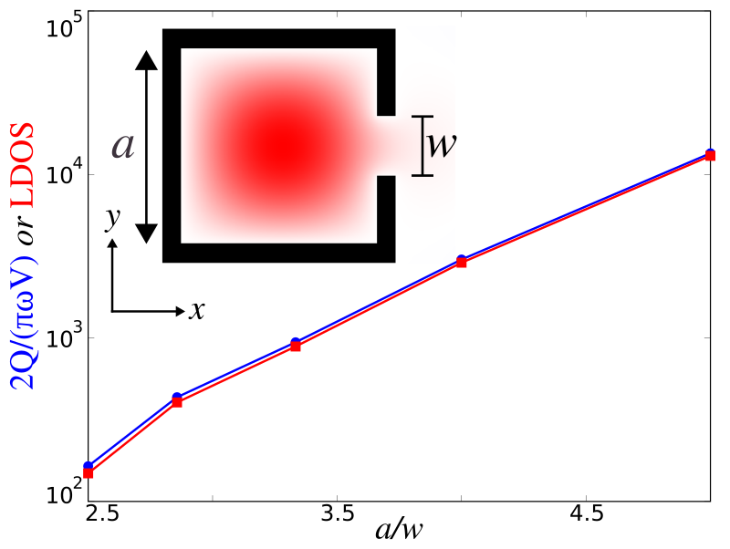

---
# Local Density of States
---

In this example, we will demonstrate the local density of states (LDOS) feature by investigating the Purcell enhancement phenomena in a metallic cavity. See [examples/metal-cavity-ldos.py](https://github.com/NanoComp/meep/blob/master/python/examples/metal-cavity-ldos.py). The LDOS, in general, has many important uses for understanding classical dipole sources, but also in many physical phenomena that can be understood semiclassically in terms of dipole currents &mdash; for example, the spontaneous emission rate of atoms (key to fluorescence and lasing phenomena) is proportional to the LDOS. The LDOS is equivalent to the power radiated by a unit dipole, $P=\frac{1}{2}\operatorname{Re}[\mathbf{E}^*\cdot\mathbf{J}]$, which, alternatively, is really just a measure of how much the harmonic modes of a system overlap with the source point. Also, the LDOS is proportional to the radiation resistance of a dipole antenna. It is a useful quantity in electromagnetism due to the fact that the <i>same</i> current radiates a <i>different</i> amount of power depending on the surrounding geometry. Analytically, the per-polarization LDOS is exactly proportional to the power radiated by an $\ell$-oriented point-dipole current, $p(t)$, at a given position in space. For a more mathematical treatment of the theory behind the LDOS, see Section 4.4 ("Currents and Fields: The Local Density of States") in [Chapter 4](http://arxiv.org/abs/arXiv:1301.5366) ("Electromagnetic Wave Source Conditions") of the book [Advances in FDTD Computational Electrodynamics: Photonics and Nanotechnology](https://www.amazon.com/Advances-FDTD-Computational-Electrodynamics-Nanotechnology/dp/1608071707), but for now we simply give the result:

$$\operatorname{LDOS}_{\ell}(\vec{x}_0,\omega)=-\frac{2}{\pi}\varepsilon(\vec{x}_0)\frac{\operatorname{Re}[\hat{E}_{\ell}(\vec{x}_0,\omega)\hat{p}(\omega)^*]}{|\hat{p}(\omega)|^2}$$

where the $|\hat{p}(\omega)|^2$ normalization is necessary for obtaining the power exerted by a unit-amplitude dipole assuming linear materials. In FDTD, computing the LDOS is straightforward: excite a point dipole source and accumulate the Fourier transforms of the field at a given point in space to obtain the entire LDOS spectrum in a single calculation. This is implemented in the `dft_ldos` feature which is the subject of this tutorial.

A lossless localized mode yields a δ-function spike in the LDOS, whereas a <i>lossy</i>, arising from either small absorption or radiation, localized mode &mdash; a resonant cavity mode &mdash; leads to a Lorentzian peak. The large enhancement in the LDOS at the resonant peak is known as a [Purcell effect](https://en.wikipedia.org/wiki/Purcell_effect), named after Purcell's proposal for enhancing spontaneous emission of an atom in a cavity. This is analogous to a microwave antenna resonating in a metal box. In this case, the resonant mode's contribution to the LDOS at $\omega^{(n)}$ can be shown to be:

$$\operatorname{resonant\ LDOS} \approx \frac{2}{\pi\omega^{(n)}} \frac{Q^{(n)}}{V^{(n)}}$$

where $Q^{(n)}=\omega^{(n)}/2\gamma^{(n)}$ is the dimensionless quality factor and $V^{(n)}$ is the modal volume. This represents another way to compute the LDOS. In this tutorial, we will verify this expression by comparing it to the earlier one.

We consider the simple example of a 2d perfect-metal $a$x$a$ cavity of finite thickness 0.1$a$, with a small notch of width $w$ on one side that allows the modes to escape. The nice thing about this example is that in the absence of the notch, the lowest-frequency $E_z$-polarized mode is known analytically to be $E_z^{(1)}=\frac{4}{a^2}\sin(\pi x/a)\sin(\pi \gamma/a)$, with a frequency $\omega^{(1)}=\sqrt{2}\pi c/a$ and modal volume $V^{(1)}=a^2/4$. The notch slightly perturbs this solution, but more importantly the opening allows the confined mode to radiate out into the surrounding air, yielding a finite $Q$. For $w \ll a$, this radiative escape occurs via an evanescent (sub-cutoff) mode of the channel waveguide formed by the notch, and it follows from inspection of the evanescent decay rate $\sqrt{(\pi/\omega)^2-(\omega^{(1)})^2}/c$ that the lifetime scales asymptotically as $Q^{(1)} \sim e^{\#/\omega}$ for some coefficient \#.

We will validate both this prediction and the LDOS calculations above by computing the LDOS at the center of the cavity, the point of peak $|\vec{E}|$, in two ways. First, we compute the LDOS directly from the power radiated by a dipole, Fourier-transforming the result of a pulse using the `dft_ldos` command. Second, we compute the cavity mode and its lifetime $Q$ using `Harminv` and then compute the LDOS by the Purcell formula shown above. The latter technique is much more efficient for high Q (small $w$), since one must run the simulation for a very long time to directly accumulate the Fourier transform of a slowly-decaying mode. The two calculations, we will demonstrate, agree to within discretization error, verifying the LDOS analysis above, and $Q/V$ is asymptotically linear on a semilog scale versus $1/w$ as predicted.

First, we define the necessary modules:

```py
from __future__ import division

import math
import meep as mp
import argparse

def main(args):
```

We'll begin by setting up the 2d simulation with the metal cavity and PML absorbing boundary layers:

```py
resolution = 200
sxy = 2
dpml = 1
sxy = sxy + 2 * dpml
cell = mp.Vector3(sxy, sxy, 0)

pml_layers = [mp.PML(dpml)]
a = 1
t = 0.1
geometry = [mp.Block(mp.Vector3(a + 2 * t, a + 2 * t, 1e20), material=mp.Medium(epsilon=-1e20)),
            mp.Block(mp.Vector3(a, a, 1e20), material=mp.Medium(epsilon=1.0))]
```

Next we'll create a notch opening in the cavity so that the field can radiate away:

```py
w = args.w
if w > 0:
   geometry.append(mp.Block(center=mp.Vector3(a / 2), size=mp.Vector3(2 * t, w, 1e20),
                           material=mp.Medium(epsilon=1.0)))
```

We can now set up the $E_z$-polarized source in the middle of the cavity where we will also compute the LDOS as they are co-located. We know the mode frequency of the closed cavity analytically. Of course, the frequency will shift with the size of the notch which necessitates a Gaussian pulse. Also note that in Meep, frequency is specified in units of 2π.

```py
fcen = math.sqrt(0.5) / a
df = 0.2
sources = [mp.Source(src=mp.GaussianSource(fcen, fwidth=df), component=mp.Ez,
                     center=mp.Vector3())]
```

As both the structure and sources have a mirror symmetry in the $y$ direction, we can exploit this to halve the size of the computational cell:

```py
symmetries = [mp.Mirror(mp.Y)]
```

In the first part of the calculation, we compute the Purcell enhancement. This requires the mode frequency and quality factor:

```py
Th = args.Th

sim = mp.Simulation(cell_size=cell,
                    geometry=geometry,
                    boundary_layers=pml_layers,
                    sources=sources,
                    symmetries=symmetries,
                    resolution=resolution)

h = mp.Harminv(mp.Ez, mp.Vector3(), fcen, df)
       sim.run(mp.after_sources(h), until_after_sources=Th)

m = h.modes[0]
f = m.freq
Q = m.Q
Vmode = 0.25 * a * a
print("ldos0:, {}".format(Q / Vmode / (2 * math.pi * f * math.pi * 0.5)))
```

Next, we rerun the same simulation and compute the LDOS using Meep's `dft_ldos` feature at the mode frequency:

```py
sim.reset_meep()
T = 2 * Q * (1 / f)
sim.run(mp.dft_ldos(f, 0, 1), until_after_sources=T)
```

Finally, we define the parameters:
```py
if __name__ == '__main__':
    parser = argparse.ArgumentParser()
    parser.add_argument('-Th', type=float, default=500, help='additional time after source has turned off to accumulate Harminv data')
    parser.add_argument('-w', type=float, default=0, help='width of cavity opening')
    args = parser.parse_args()
    main(args)
```

We need to run for a sufficiently long time to ensure that the Fourier-transformed fields have converged. A suitable time interval is, due to the Fourier Uncertainty Principle, just one period of the decay which we can determine using the $Q$ we calculated previously. The smaller the notch size becomes and the higher the corresponding $Q$ of the mode, the longer the simulation has to run. This is why the former calculation is much more efficient for slowly-decaying modes.

We run several simulations spanning a number of different notch sizes and plot the result in the following figure which shows good agreement between the two methods.

<center>

</center>
