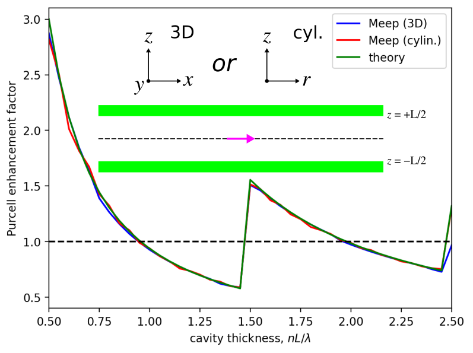

---
# Local Density of States
---

In this example, we will demonstrate the local [density of states](https://en.wikipedia.org/wiki/Density_of_states) (LDOS) feature by investigating the Purcell enhancement phenomena in two different metallic cavities. The LDOS, in general, has many important uses for understanding classical dipole sources, but also in many physical phenomena that can be understood semiclassically in terms of dipole currents &mdash; for example, the [spontaneous emission](https://en.wikipedia.org/wiki/Spontaneous_emission) rate of atoms (key to fluorescence and lasing phenomena) is proportional to the LDOS.

The LDOS is equivalent to the power radiated by a unit dipole, $P=\frac{1}{2}\operatorname{Re}[\mathbf{E}^*\cdot\mathbf{J}]$, which, alternatively, is really just a measure of how much the harmonic modes of a system overlap with the source point. Also, the LDOS is proportional to the [radiation resistance](https://en.wikipedia.org/wiki/Radiation_resistance) of a dipole antenna. It is a useful quantity in electromagnetism due to the fact that the *same* current radiates a *different* amount of power depending on the surrounding geometry. Analytically, the per-polarization LDOS is exactly proportional to the power radiated by an $\ell$-oriented point-dipole current, $p(t)$, at a given position in space. For a more mathematical treatment of the theory behind the LDOS, see Section 4.4 ("Currents and Fields: The Local Density of States") in [Chapter 4](http://arxiv.org/abs/arXiv:1301.5366) ("Electromagnetic Wave Source Conditions") of the book [Advances in FDTD Computational Electrodynamics: Photonics and Nanotechnology](https://www.amazon.com/Advances-FDTD-Computational-Electrodynamics-Nanotechnology/dp/1608071707), but for now we simply give the result:

$$\operatorname{LDOS}_{\ell}(\vec{x}_0,\omega)=-\frac{2}{\pi}\varepsilon(\vec{x}_0)\frac{\operatorname{Re}[\hat{E}_{\ell}(\vec{x}_0,\omega)\hat{p}(\omega)^*]}{|\hat{p}(\omega)|^2}$$

where the $|\hat{p}(\omega)|^2$ normalization is necessary for obtaining the power exerted by a unit-amplitude dipole assuming linear materials. In FDTD, computing the LDOS is straightforward: excite a point dipole source and accumulate the Fourier transforms of the field at a given point in space to obtain the entire LDOS spectrum in a single calculation. This is implemented in the `dft_ldos` feature which is the subject of this tutorial.


Planar Cavity with Lossless Metallic Walls
------------------------------------------

The spontaneous-emission rate of a point-dipole emitter in a planar cavity bounded by a lossless metallic mirror can be tuned using the thickness of the cavity. A schematic of the cavity is shown in the figure inset below. In this example, the 3D cavity consists of two mirrors separated in the *z* direction by a distance $L$. The cavity consists of a homogeneous dielectric with $n$=2.4. The dipole wavelength ($\lambda$) is 1.0 μm with horizontal polarization along the *x* axis. The Purcell enhancement factor, a dimensionless quantity defined relative to the bulk medium, can be computed analytically in terms of the cavity thickness in units of the medium wavelength ($nL/\lambda$) for this system using equation (7) of [IEEE J. Quantum Electronics, Vol. 34, pp. 71-76 (1998)](https://ieeexplore.ieee.org/abstract/document/655009). We will validate the simulated results using the analytic theory.

An important feature of this cavity system are the lossless metal sidewalls. These mirrors are perfectly reflective at all angles and enable the Purcell enhancement factor to be tuned over a wide range of ~0.5 to 3.0. There are other types of lossless mirrors with reflectivity of +1 (0 phase shift) rather than -1 (π phase shift) as in this example based on e.g., a multilayer stack in which the index of the cavity is *larger* than the index of the first mirror layer. These mirrors tend to have a strong angular dependence of the reflectivity and thus generally a smaller range of variation for the Purcell enhancement. In this demonstration, the cavity thickness is swept over a range of 0.5 to 2.5. Below a thickness of 0.5 there are no guided modes and thus the Purcell enhancement factor is zero.

Two types of simulations are necessary for computing the Purcell enhancement factor: (1) bulk medium and (2) cavity. The `dft_ldos` featured is used to compute the LDOS in each case at a single wavelength. The Purcell enhancement factor is computed as the ratio of the LDOS measured in (2) to that from (1). Each simulation uses three mirror symmetries to reduce the size of the 3D computation by a factor of eight. The cavity is infinitely extended in the *xy* plane and thus the cell is terminated using PMLs in these two directions. Because Meep uses a default boundary condition of a perfect electric conductor, there is no need to explicitly define the boundaries in the *z* direction. The fields are timestepped until they have decayed away sufficiently due to absorption by the PMLS at the location of the pulsed source.

As shown in the plot below, the results from Meep agree well with the analytic theory.

<center>

</center>

The simulation script is [examples/planar_cavity_ldos.py](https://github.com/NanoComp/meep/blob/master/python/examples/planar_cavity_ldos.py).

```py
import meep as mp
import numpy as np
import matplotlib
matplotlib.use('agg')
import matplotlib.pyplot as plt


resolution = 50  # pixels/μm
dpml = 0.5       # thickness of PML
L = 6.0          # length of non-PML region
n = 2.4          # refractive index of surrounding medium
wvl = 1.0        # wavelength (in vacuum)

fcen = 1/wvl
sources = [mp.Source(src=mp.GaussianSource(fcen,fwidth=0.2*fcen),
                     component=mp.Ex,
                     center=mp.Vector3())]

symmetries = [mp.Mirror(direction=mp.X,phase=-1),
              mp.Mirror(direction=mp.Y),
              mp.Mirror(direction=mp.Z)]


def bulk_ldos():
    s = L+2*dpml
    cell_size = mp.Vector3(s,s,s)

    pml_layers = [mp.PML(dpml)]

    sim = mp.Simulation(resolution=resolution,
                        cell_size=cell_size,
                        boundary_layers=pml_layers,
                        sources=sources,
                        symmetries=symmetries,
                        default_material=mp.Medium(index=n))

    sim.run(mp.dft_ldos(fcen,0,1),
            until_after_sources=mp.stop_when_fields_decayed(20,
                                                            mp.Ex,
                                                            mp.Vector3(),
                                                            1e-6))

    return sim.ldos_data[0]


def cavity_ldos(sz):
    sxy = L+2*dpml
    cell_size = mp.Vector3(sxy,sxy,sz)

    boundary_layers = [mp.PML(dpml,direction=mp.X),
                       mp.PML(dpml,direction=mp.Y)]

    sim = mp.Simulation(resolution=resolution,
                        cell_size=cell_size,
                        boundary_layers=boundary_layers,
                        sources=sources,
                        symmetries=symmetries,
                        default_material=mp.Medium(index=n))

    sim.run(mp.dft_ldos(fcen,0,1),
            until_after_sources=mp.stop_when_fields_decayed(20,
                                                            mp.Ex,
                                                            mp.Vector3(),
                                                            1e-6))

    return sim.ldos_data[0]


if __name__ == '__main__':
    ldos_bulk = bulk_ldos()
    print("ldos_bulk:, {:.6f}".format(ldos_bulk))

    # units of wavelength in medium
    cavity_thickness = np.arange(0.50,2.55,0.05)

    gap = cavity_thickness*wvl/n

    ldos_cavity = np.zeros(len(cavity_thickness))
    for idx,g in enumerate(gap):
        ldos_cavity[idx] = cavity_ldos(g)
        print("ldos_cavity:, {:.3f}, {:.6f}".format(g,ldos_cavity[idx]))

    # Purcell enhancement factor (relative to bulk medium)
    pe_meep = ldos_cavity/ldos_bulk

    # equation 7 of reference
    pe_theory = (3*np.fix(cavity_thickness+0.5)/(4*cavity_thickness) +
                 (4*np.power(np.fix(cavity_thickness+0.5),3) -
                  np.fix(cavity_thickness+0.5)) /
                 (16*np.power(cavity_thickness,3)))

    if mp.am_master():
        plt.plot(cavity_thickness,pe_meep,'b-',label='Meep')
        plt.plot(cavity_thickness,pe_theory,'r-',label='theory')
        plt.plot(cavity_thickness,np.ones(len(cavity_thickness)),'k--')
        plt.xlabel('cavity thickness')
        plt.ylabel('Purcell enhancement factor (relative to bulk)')
        plt.axis([0.5,2.5,0.4,3.1])
        plt.legend()
        plt.savefig('planar_cavity_purcell_factor_vs_thickness',
                    bbox_inches='tight')
```

Square Box with a Small Opening
-------------------------------

We consider the simple example of a 2D perfect-metal $a$x$a$ cavity of finite thickness 0.1$a$, with a small notch of width $w$ on one side that allows the modes to escape. The nice thing about this example is that in the absence of the notch, the lowest-frequency $E_z$-polarized mode is known analytically to be $E_z^{(1)}=\frac{4}{a^2}\sin(\pi x/a)\sin(\pi \gamma/a)$, with a frequency $\omega^{(1)}=\sqrt{2}\pi c/a$ and modal volume $V^{(1)}=a^2/4$. The notch slightly perturbs this solution, but more importantly the opening allows the confined mode to radiate out into the surrounding air, yielding a finite $Q$. For $w \ll a$, this radiative escape occurs via an evanescent (sub-cutoff) mode of the channel waveguide formed by the notch, and it follows from inspection of the evanescent decay rate $\sqrt{(\pi/\omega)^2-(\omega^{(1)})^2}/c$ that the lifetime scales asymptotically as $Q^{(1)} \sim e^{\#/\omega}$ for some coefficient \#.

We will validate both this prediction and the expression for the LDOS shown above by computing the LDOS at the center of the cavity, the point of peak $|\vec{E}|$, in two ways. First, we compute the LDOS directly from the power radiated by a dipole, Fourier-transforming the result of a pulse using the `dft_ldos` command. Second, we compute the cavity mode and its lifetime $Q$ using Harminv and then compute the LDOS by the Purcell formula shown above. The latter technique is much more efficient for high Q (small $w$), since one must run the simulation for a very long time to directly accumulate the Fourier transform of a slowly-decaying mode. The two calculations, we will demonstrate, agree to within discretization error, verifying the LDOS analysis above, and $Q/V$ is asymptotically linear on a semilog scale versus $1/w$ as predicted.

A lossless localized mode yields a $\delta$-function spike in the LDOS, whereas a <i>lossy</i>, arising from either small absorption or radiation, localized mode &mdash; a resonant cavity mode &mdash; leads to a Lorentzian peak. The large enhancement in the LDOS at the resonant peak is known as a [Purcell effect](https://en.wikipedia.org/wiki/Purcell_effect), named after Purcell's proposal for enhancing spontaneous emission of an atom in a cavity. This is analogous to a microwave antenna resonating in a metal box. In this case, the resonant mode's contribution to the LDOS at $\omega^{(n)}$ can be shown to be:

$$\operatorname{resonant\ LDOS} \approx \frac{2}{\pi\omega^{(n)}} \frac{Q^{(n)}}{V^{(n)}}$$

where $Q^{(n)}=\omega^{(n)}/2\gamma^{(n)}$ is the dimensionless [quality factor](https://en.wikipedia.org/wiki/Q_factor) and $V^{(n)}$ is the modal volume. This represents another way to compute the LDOS. In this tutorial, we will verify this expression by comparing it to the earlier one.

The simulation script is [examples/metal-cavity-ldos.py](https://github.com/NanoComp/meep/blob/master/python/examples/metal-cavity-ldos.py). The notebook is [examples/metal-cavity-ldos.ipynb](https://nbviewer.jupyter.org/github/NanoComp/meep/blob/master/python/examples/metal-cavity-ldos.ipynb).

```py
import math
import meep as mp
import numpy as np
import matplotlib.pyplot as plt

def metal_cavity(w):
    resolution = 50
    sxy = 2
    dpml = 1
    sxy = sxy+2*dpml
    cell = mp.Vector3(sxy,sxy)

    pml_layers = [mp.PML(dpml)]
    a = 1
    t = 0.1
    geometry = [mp.Block(mp.Vector3(a+2*t,a+2*t,mp.inf), material=mp.metal),
                mp.Block(mp.Vector3(a,a,mp.inf), material=mp.air)]

    geometry.append(mp.Block(center=mp.Vector3(a/2),
                             size=mp.Vector3(2*t,w,mp.inf),
                             material=mp.air))

    fcen = math.sqrt(0.5)/a
    df = 0.2
    sources = [mp.Source(src=mp.GaussianSource(fcen,fwidth=df),
                         component=mp.Ez,
                         center=mp.Vector3())]

    symmetries = [mp.Mirror(mp.Y)]

    sim = mp.Simulation(cell_size=cell,
                        geometry=geometry,
                        boundary_layers=pml_layers,
                        sources=sources,
                        symmetries=symmetries,
                        resolution=resolution)

    h = mp.Harminv(mp.Ez, mp.Vector3(), fcen, df)
    sim.run(mp.after_sources(h), until_after_sources=500)

    m = h.modes[0]
    f = m.freq
    Q = m.Q
    Vmode = 0.25*a*a
    ldos_1 = Q / Vmode / (2 * math.pi * f * math.pi * 0.5)

    sim.reset_meep()

    T = 2*Q*(1/f)
    sim.run(mp.dft_ldos(f,0,1), until_after_sources=T)
    ldos_2 = sim.ldos_data[0]

    return ldos_1, ldos_2
```

We need to run for a sufficiently long time to ensure that the Fourier-transformed fields have converged. A suitable time interval is, due to the Fourier Uncertainty Principle, just one period of the decay which we can determine using the $Q$ we calculated previously. The smaller the notch size becomes and the higher the corresponding $Q$ of the mode, the longer the simulation has to run. This is why the former calculation is much more efficient for slowly-decaying modes.

We run several simulations spanning a number of different notch sizes and plot the result in the following figure which shows good agreement between the two methods.

```py
ws = np.arange(0.2,0.5,0.1)
ldos_1 = np.zeros(len(ws))
ldos_2 = np.zeros(len(ws))

for j in range(len(ws)):
    ldos_1[j], ldos_2[j] = metal_cavity(ws[j])
    print("ldos:, {}, {}".format(ldos_1[j],ldos_2[2]))
```

```py
plt.figure(dpi=150)
plt.semilogy(1/ws,ldos_1,'bo-',label="2Q/(πωV)")
plt.semilogy(1/ws,ldos_2,'rs-',label="LDOS")
plt.xlabel('a/w')
plt.ylabel('2Q/(πωW) or LDOS')
plt.show()
```

<center>

</center>
