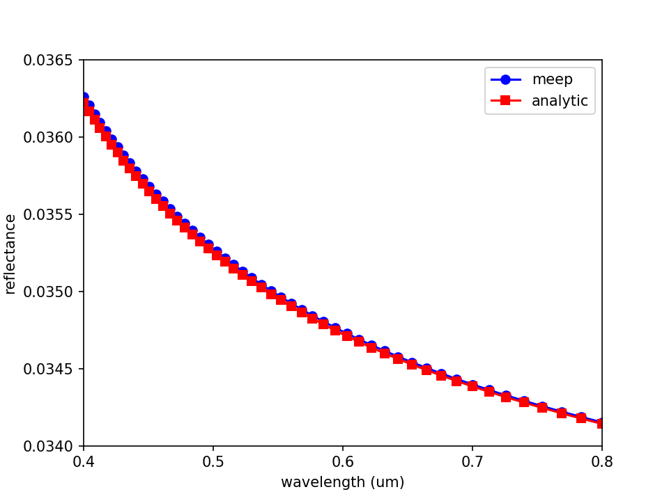
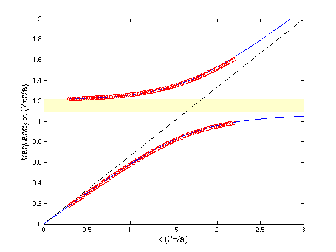

---
# Material Dispersion
---

In these two examples, we will perform simulations with a **frequency-dependent dielectric** ε(ω), corresponding to **material dispersion**. See [Materials](../Materials/#material-dispersion) for more information on how material dispersion is supported.

[TOC]

### Reflectance Spectrum of Air-Silica Interface

We will compute the broadband [reflectance](https://en.wikipedia.org/wiki/Reflectance) spectrum at normal incidence for a planar interface of vacuum/air and [fused quartz](https://en.wikipedia.org/wiki/Fused_quartz). As a validation, we will compare the simulated result with the analytic reflectance computed using the [Fresnel equations](https://en.wikipedia.org/wiki/Fresnel_equations). This is similar to an example in [Tutorial/Basics](Basics/#angular-reflectance-spectrum-of-a-planar-interface) which involved computing the broadband reflectance spectrum over a range of angles.

The wavelength-dependent, lossless permittivity of fused quartz, measured experimentally at 20$^\circ$, can be approximated by the [Sellmeier equation](https://en.wikipedia.org/wiki/Sellmeier_equation):

$$\varepsilon(\lambda) = 1 + \frac{0.6961663\lambda^2}{\lambda^2-0.0684043^2} + \frac{0.4079426\lambda^2}{\lambda^2-0.1162414^2} + \frac{0.8974794\lambda^2}{\lambda^2-9.896161^2}$$

The wavelength λ is in units of microns. This equation is valid from 0.21 to 6.7 μm. The Sellmeier form for the permittivity of fused quartz can be imported into Meep as a [Lorentzian susceptibility](Materials/#material-dispersion) via a slight reorganization to convert the wavelength dependence into frequency. This is implemented in the [materials library](https://github.com/stevengj/meep/blob/master/python/examples/materials_library.py#L165-L181).

The simulation involves a 1d cell. A planewave current source with a pulsed profile spanning visible wavelengths of 0.4 to 0.8 μm is normally incident on the fused quartz from air. The reflectance is computed using the convention of two separate runs: (1) an empty cell to obtain the incident power, and (2) with the fused quartz to obtain the reflected power. The details of this type of calculation are described in [Tutorial/Basics](Basics/#transmittance-spectrum-of-a-waveguide-bend). The grid resolution, and by direct extension the time resolution via the [Courant condition](https://en.wikipedia.org/wiki/Courant%E2%80%93Friedrichs%E2%80%93Lewy_condition), must be made sufficiently fine to obtain agreement with the analytic results and to ensure [numerical stability](Materials/#numerical-stability). Coarse resolutions may lead to field instabilities.

The simulation script is below and in [refl-quartz.py](https://github.com/stevengj/meep/blob/master/python/examples/refl-quartz.py).

```py
import meep as mp

import sys
sys.path.insert(0, '/path/to/materials_library/')
from materials_library import *

resolution = 200  # pixels/μm

dpml = 1.0
sz = 10 + 2*dpml
cell_size = mp.Vector3(0,0,sz)
pml_layers = [ mp.PML(dpml) ]

wvl_min = 0.4
wvl_max = 0.8
fmin = 1/wvl_max
fmax = 1/wvl_min
fcen = 0.5*(fmax+fmin)
df = fmax-fmin
nfreq = 50
        
sources = [ mp.Source(mp.GaussianSource(fcen,fwidth=df), component=mp.Ex, center=mp.Vector3(0,0,-0.5*sz+dpml)) ]

sim = mp.Simulation(cell_size=cell_size,
                    boundary_layers=pml_layers,
                    sources=sources,
                    dimensions=1,
                    resolution=resolution)

refl_fr = mp.FluxRegion(center=mp.Vector3(0,0,-0.25*sz))
refl = sim.add_flux(fcen, df, nfreq, refl_fr)

sim.run(until_after_sources=mp.stop_when_fields_decayed(50, mp.Ex, mp.Vector3(), 1e-9))

empty_flux = mp.get_fluxes(refl)
empty_data = sim.get_flux_data(refl)
sim.reset_meep()
    
geometry = [ mp.Block(mp.Vector3(mp.inf,mp.inf,0.5*sz), center=mp.Vector3(0,0,0.25*sz), material=fused_quartz) ]

sim = mp.Simulation(cell_size=cell_size,
                    boundary_layers=pml_layers,
                    geometry=geometry,
                    sources=sources,
                    dimensions=1,
                    resolution=resolution)

refl = sim.add_flux(fcen, df, nfreq, refl_fr)
sim.load_minus_flux_data(refl, empty_data)
    
sim.run(until_after_sources=mp.stop_when_fields_decayed(50, mp.Ex, mp.Vector3(), 1e-9))

refl_flux = mp.get_fluxes(refl)
freqs = mp.get_flux_freqs(refl)

for i in range(0,nfreq):
    print("refl:, {}, {}".format(1/freqs[i],-refl_flux[i]/empty_flux[i]))
```

The following Bash shell script runs the two simulations, pipes the output to a file, and extracts the flux data into a separate file.

```sh
#!/bin/bash

python refl-quartz.py |tee flux.out
grep refl: flux.out |cut -d , -f2- > flux.dat
```

A plot of the reflectance spectrum based on the simulated data and the analytic Fresnel equations is generated using the Python script below. The plot is shown in the accompanying figure. There is agreement between the simulated and analytic results. Note that the reflectance spectra is plotted as a function of wavelength, not frequency from which the Meep data is obtained. Thus, the data points are not equally spaced: the spacing is smaller at low wavelengths (high frequencies) than at high wavelengths (low frequencies).

```py
import numpy as np
import matplotlib.pyplot as plt
import math

f = np.genfromtxt("flux.dat", delimiter=",")

wvls = f[:,0]
R_meep = f[:,1]

eps_quartz = lambda l: 1+0.6961663*math.pow(l,2)/(pow(l,2)-pow(0.0684043,2))+0.4079426*pow(l,2)/(pow(l,2)-pow(0.1162414,2))+0.8974794*pow(l,2)/(pow(l,2)-pow(9.896161,2))
R_fresnel = lambda l: math.pow(math.fabs(1-math.sqrt(eps_quartz(l)))/(1+math.sqrt(eps_quartz(l))),2)
R_analytic = [ R_fresnel(i) for i in wvls ]

plt.plot(wvls,R_meep,'bo-',label='meep')
plt.plot(wvls,R_analytic,'rs-',label='analytic')
plt.xlabel("wavelength (μm)")
plt.ylabel("reflectance")
plt.axis([0.4, 0.8, 0.0340, 0.0365])
plt.xticks([t for t in np.arange(0.4,0.9,0.1)])
plt.legend(loc='upper right')
plt.show()
```

<center>

</center>

### Permittivity Function of an Artificial Dispersive Material

We will model a *uniform medium* of an artificial dispersive material. From the dispersion relation ω(k), we will compute the numerical ε(ω) via the formula:

$$\varepsilon(\omega) = \left( \frac{ck}{\omega} \right) ^2$$

We will then compare this with the analytical ε(ω) that we specified. The simulation script is in [material-dispersion.py](https://github.com/stevengj/meep/blob/master/python/examples/material-dispersion.py).

Since this is a uniform medium, our computational cell can actually be of *zero* size (i.e. one pixel), where we will use Bloch-periodic boundary conditions to specify the wavevector *k*.

```py
cell = mp.Vector3()
resolution = 20
```

We will then fill all space with an artificial dispersive material:

```py
susceptibilities = [mp.LorentzianSusceptibility(frequency=1.1, gamma=1e-5, sigma=0.5),
                    mp.LorentzianSusceptibility(frequency=0.5, gamma=0.1, sigma=2e-5)]

default_material = mp.Medium(epsilon=2.25, E_susceptibilities=susceptibilities)
```

corresponding to the dielectric function:

$$\varepsilon(\omega) = \varepsilon(2\pi f) = 2.25 + \frac{1.1^2 \cdot 0.5}{1.1^2 - f^2 -if \cdot 10^{-5}/2\pi} + \frac{0.5^2 \cdot 2\cdot 10^{-5}}{0.5^2 - f^2 -if \cdot 0.1 / 2\pi}$$

The real and imaginary parts of this dielectric function ε(ω) are plotted below:

<center>

</center>

We can see that the f=1.1 resonance causes a large change in both the real and imaginary parts of ε around that frequency. In fact, there is a range of frequencies from 1.1 to 1.2161 where ε is *negative*. In this range, no propagating modes exist &mdash; it is actually a kind of electromagnetic band gap associated with polariton resonances in a material. For more information on the physics of such materials, see e.g. Chapter 14 of [Introduction to Solid State Physics](http://www.wiley.com/WileyCDA/WileyTitle/productCd-EHEP000803.html) by C. Kittel.

On the other hand, the f=0.5 resonance, because the `sigma` numerator is so small, causes very little change in the real part of ε. Nevertheless, it generates a clear peak in the *imaginary* part of ε, corresponding to a resonant absorption peak.

Now, we'll set up the rest of the simulation. We'll specify a broadband $E_z$-polarized Gaussian source, create a list of *k* wavevectors that we want to compute ω(k) over, and compute the associated frequencies by using the `k_points` function:

```py
fcen = 1.0
df = 2.0

sources = [mp.Source(mp.GaussianSource(fcen, fwidth=df), component=mp.Ez, center=mp.Vector3())]

kmin = 0.3
kmax = 2.2
k_interp = 99

kpts = mp.interpolate(k_interp, [mp.Vector3(kmin), mp.Vector3(kmax)])

sim = mp.Simulation(cell_size=cell, geometry=[], sources=sources, default_material=default_material, resolution=resolution)

all_freqs = sim.run(kpts, k_points=200)  # a list of lists of frequencies
```

The `k_points` function returns a *list of lists* of frequencies &mdash; one list of complex frequencies for each *k* point &mdash; which we store in the `all_freqs` variable. Finally, we want to loop over this list and print out the corresponding ε via the ratio (ck/ω)$^2$ as described above. To do this, we will use Python's `zip` function which combines multiple lists into one:

```py
for fs, kx in zip(all_freqs, [v.x for v in kpts]):
    for f in fs:
            print("eps:, {.6f}, {.6f}, {.6f}".format(f.real, f.imag, (kx / f)**2))
```

Alternatively we could just read all of the frequencies into Python or Octave/Matlab and compute the ratios there. After running the program with

```sh
unix% python material-dispersion.py | tee material-dispersion.out
```

we can then `grep` for the frequencies and the computed dielectric function, and plot it. First, let's plot the dispersion relation ω(k) for the real part of ω:

<center>

</center>

The red circles are the computed points from Meep, whereas the blue line is the analytical band diagram from the specified ε(ω). As you can see, we get *two* bands at each *k*, separated by a polaritonic gap (shaded yellow). This dispersion relation can be thought of as the interaction (anti-crossing) between the light line of the ambient ε=2.25 material (dashed black line) and the horizontal line corresponding to the phonon resonance.

Similarly, the computed and analytical real parts of the dielectric function are given by:

<center>

</center>

which shows excellent agreement between the analytical (blue line) and numerical (red circles) calculations. The imaginary part, however, is more subtle:

<center>

</center>

The blue line is the analytical calculation from above and the red circles are the numerical value from Meep &mdash; why is the agreement so poor? There is nothing wrong with Meep, and this is *not* a numerical error. The problem is simply that we are comparing apples and oranges.

The blue line is the analytical calculation of ε(ω) for a *real* frequency ω which corresponds to solutions with a *complex* wavevector *k*, whereas Meep is computing ε at a *complex* ω for a *real* wavevector *k*. So, the correct comparison is to plug Meep's *complex* ω into the analytical formula for ε(ω), which results in the green lines on the graph that fall almost on top of the red circles.

Why did our comparison of the *real* part of ε look so good, then? The reason is that ε(ω) at real and complex values of ω are closely related by the analytic properties of ε. In particular, because ε is an analytic function on the real-ω axis, adding a *small* imaginary part to ω as we are doing here does not change ε by much. The losses are small for all of the computed *k* points. The change was only significant for the imaginary ε because the imaginary ε was small to begin with.