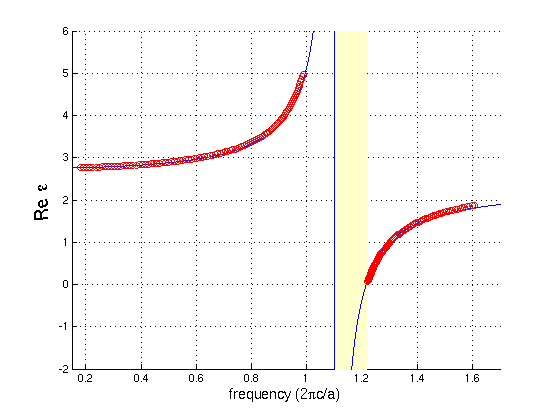

---
# Material Dispersion
---

In this example, we will perform a simulation with a **frequency-dependent dielectric** $\varepsilon(\omega)$, corresponding to **material dispersion**. See [Materials](../Materials/#material-dispersion) for more information on how material dispersion is supported. In particular, we will model a *uniform medium* of the dispersive material. See also [material-dispersion.py](https://github.com/stevengj/meep/blob/master/python/examples/material-dispersion.py). From the dispersion relation $\omega(k)$, we will compute the numerical $\varepsilon(\omega)$ via the formula:

$$\varepsilon(\omega) = \left( \frac{ck}{\omega} \right) ^2$$

We will then compare this with the analytical $\varepsilon(\omega)$ that we specified.

Since this is a uniform medium, our computational cell can actually be of *zero* size (i.e. one pixel), where we will use Bloch-periodic boundary conditions to specify the wavevector *k*.

```py
cell = mp.Vector3()
resolution = 20
```

We will then fill all space with a dispersive material:

```py
susceptibilities = [mp.LorentzianSusceptibility(frequency=1.1, gamma=1e-5, sigma=0.5),
                    mp.LorentzianSusceptibility(frequency=0.5, gamma=0.1, sigma=2e-5)]

default_material = mp.Medium(epsilon=2.25, E_susceptibilities=susceptibilities)
```

corresponding to the dielectric function:

$$\varepsilon(\omega) = \varepsilon(2\pi f) = 2.25 + \frac{1.1^2 \cdot 0.5}{1.1^2 - f^2 -if \cdot 10^{-5}/2\pi} + \frac{0.5^2 \cdot 2\cdot 10^{-5}}{0.5^2 - f^2 -if \cdot 0.1 / 2\pi}$$

The real and imaginary parts of this dielectric function $\varepsilon(\omega)$ are plotted below:

<center>

</center>

We can see that the f=1.1 resonance causes a large change in both the real and imaginary parts of $\varepsilon$ around that frequency. In fact, there is a range of frequencies from 1.1 to 1.2161 where $\varepsilon$ is *negative*. In this range, no propagating modes exist &mdash; it is actually a kind of electromagnetic band gap associated with polariton resonances in a material. For more information on the physics of such materials, see e.g. Chapter 14 of [Introduction to Solid State Physics](http://www.wiley.com/WileyCDA/WileyTitle/productCd-EHEP000803.html) by C. Kittel.

On the other hand, the f=0.5 resonance, because the `sigma` numerator is so small, causes very little change in the real part of $\varepsilon$. Nevertheless, it generates a clear peak in the *imaginary* part of $\varepsilon$, corresponding to a resonant absorption peak.

Now, we'll set up the rest of the simulation. We'll specify a broadband $E_z$-polarized Gaussian source, create a list of *k* wavevectors that we want to compute $\omega(k)$ over, and compute the associated frequencies by using the `k_points` function:

```py
fcen = 1.0
df = 2.0

sources = [mp.Source(mp.GaussianSource(fcen, fwidth=df), component=mp.Ez, center=mp.Vector3())]

kmin = 0.3
kmax = 2.2
k_interp = 99

kpts = mp.interpolate(k_interp, [mp.Vector3(kmin), mp.Vector3(kmax)])

sim = mp.Simulation(cell_size=cell, geometry=[], sources=sources, default_material=default_material, resolution=resolution)

all_freqs = sim.run(kpts, k_points=200)  # a list of lists of frequencies
```

The `k_points` function returns a *list of lists* of frequencies &mdash; one list of complex frequencies for each *k* point &mdash; which we store in the `all_freqs` variable. Finally, we want to loop over this list and print out the corresponding $\varepsilon$ via the ratio $(ck/\omega)^2$ as described above. To do this, we will use Python's `zip` function which combines multiple lists into one:

```py
for fs, kx in zip(all_freqs, [v.x for v in kpts]):
    for f in fs:
            print("eps:, {.6f}, {.6f}, {.6f}".format(f.real, f.imag, (kx / f)**2))
```

Alternatively we could just read all of the frequencies into Octave/Matlab or a spreadsheet and compute the ratios there. After running the program with

```sh
unix% python material-dispersion.py | tee material-dispersion.out
```

we can then `grep` for the frequencies and the computed dielectric function, and plot it. First, let's plot the dispersion relation $\omega(k)$ for the real part of $\omega$:

<center>

</center>

The red circles are the computed points from Meep, whereas the blue line is the analytical band diagram from the specified $\varepsilon(\omega)$. As you can see, we get *two* bands at each *k*, separated by a polaritonic gap (shaded yellow). This dispersion relation can be thought of as the interaction (anti-crossing) between the light line of the ambient $\varepsilon$=2.25 material (dashed black line) and the horizontal line corresponding to the phonon resonance.

Similarly, the computed and analytical real parts of the dielectric function are given by:

<center>

</center>

which shows excellent agreement between the analytical (blue line) and numerical (red circles) calculations. The imaginary part, however, is more subtle:

<center>

</center>

The blue line is the analytical calculation from above and the red circles are the numerical value from Meep &mdash; why is the agreement so poor? There is nothing wrong with Meep, and this is *not* a numerical error. The problem is simply that we are comparing apples and oranges.

The blue line is the analytical calculation of $\varepsilon(\omega)$ for a *real* frequency $\omega$ which corresponds to solutions with a *complex* wavevector *k*, whereas Meep is computing $\varepsilon$ at a *complex* $\omega$ for a *real* wavevector *k*. So, the correct comparison is to plug Meep's *complex* $\omega$ into the analytical formula for $\varepsilon(\omega)$, which results in the green lines on the graph that fall almost on top of the red circles.

Why did our comparison of the *real* part of $\varepsilon$ look so good, then? The reason is that $\varepsilon(\omega)$ at real and complex values of $\omega$ are closely related by the analytic properties of $\varepsilon$. In particular, because $\varepsilon$ is an analytic function on the real-$\omega$ axis, adding a *small* imaginary part to $\omega$ as we are doing here does not change $\varepsilon$ by much. The losses are small for all of the computed *k* points. The change was only significant for the imaginary $\varepsilon$ because the imaginary $\varepsilon$ was small to begin with.