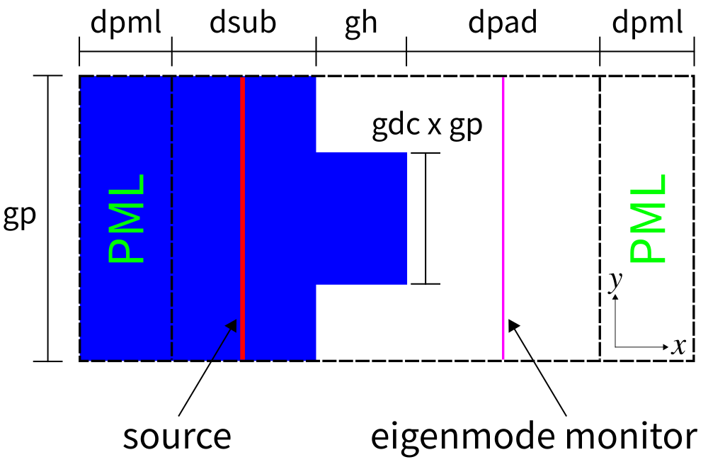
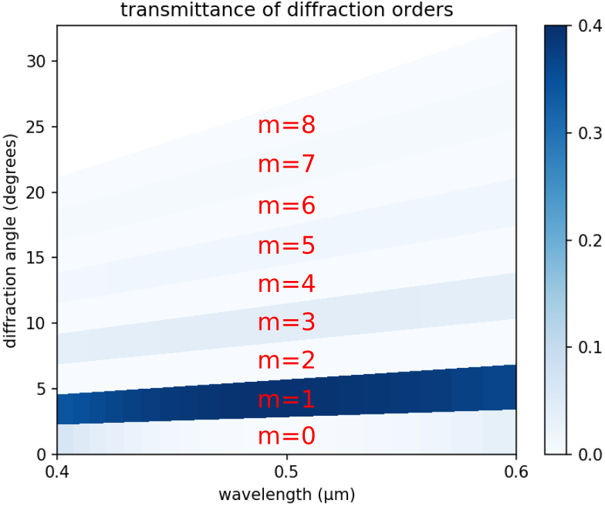

---
# Mode Decomposition
---

This tutorial demonstrates the mode-decomposition feature which is used to decompose a given mode profile into a superposition of harmonic basis modes. There are examples for two different cases: (1) guided modes in dielectric media and (2) planewaves in homogeneous ε/μ media.

[TOC]

Reflectance of a Waveguide Taper
--------------------------------

This example involves computing the reflectance &mdash; the fraction of the reflected power to the incident power &mdash; of the fundamental mode of a linear waveguide taper. The structure and the simulation geometry are shown in the schematic below. We will verify that the scaling of the reflectance with the taper length is quadratic, consistent with analytical results from [Optics Express, Vol. 16, pp. 11376-92, 2008](http://www.opticsinfobase.org/abstract.cfm?URI=oe-16-15-11376).

<center>

</center>

The structure, which can be viewed as a [two-port network](https://en.wikipedia.org/wiki/Two-port_network), consists of a single-mode waveguide of width 1 μm (`w1`) coupled to a second waveguide of width 2 μm (`w2`) via a linearly-sloped taper (length `Lt`). The structure is homogeneous with ε=12 in vacuum. PML absorbing boundaries surround the computational cell. An eigenmode source with E<sub>z</sub> polarization is used to launch the fundamental mode at a wavelength of 6.67 μm. There is an eigenmode-expansion monitor placed at the midpoint of the first waveguide. This is a line monitor which extends beyond the waveguide in order to capture the entire mode profile including its evanescent tails. The Fourier-transformed fields along this line monitor are used to compute the basis coefficients of the harmonic modes which are computed separately via the eigenmode solver MPB. The technical details are described in [Mode Decomposition](../Mode_Decomposition). The squared magnitude of the mode coefficient is equivalent to the power in the given eigenmode. We could have also placed a line monitor in the second waveguide to compute the transmittance. The ratio of the complex mode coefficients can be used to compute the [S parameters](https://en.wikipedia.org/wiki/Scattering_parameters).

Note that even though the structure has mirror symmetry in the $y$ direction, we cannot exploit this feature to reduce the computation size by a factor of two as symmetries are not yet supported for the mode-decomposition feature. For comparison, another approach for computing the reflectance involves the `dft_flux` which is demonstrated in [Tutorial/Basics](Basics/#angular-reflectance-spectrum-of-a-planar-interface).

At the end of the simulation, the squared magnitude of the mode coefficients for the forward- and backward-propagating fundamental mode along with the taper length are displayed. The simulation script is shown below and in [mode-decomposition.py](https://github.com/stevengj/meep/blob/master/python/examples/mode-decomposition.py).

```py
import meep as mp
import math
import argparse

def main(args):

    resolution = args.res

    w1 = 1            # width of waveguide 1
    w2 = 2            # width of waveguide 2
    Lw = 10           # length of waveguide 1 and 2
    Lt = args.Lt      # taper length

    Si = mp.Medium(epsilon=12.0)
    
    dair = 3.0
    dpml = 5.0
    
    sx = dpml+Lw+Lt+Lw+dpml
    sy = dpml+dair+w2+dair+dpml
    cell_size = mp.Vector3(sx,sy,0)

    prism_x = sx + 1
    half_w1 = 0.5 * w1
    half_w2 = 0.5 * w2
    half_Lt = 0.5 * Lt

    if Lt > 0:
        vertices = [mp.Vector3(-prism_x, half_w1),
                    mp.Vector3(-half_Lt, half_w1),
                    mp.Vector3(half_Lt, half_w2),
                    mp.Vector3(prism_x, half_w2),
                    mp.Vector3(prism_x, -half_w2),
                    mp.Vector3(half_Lt, -half_w2),
                    mp.Vector3(-half_Lt, -half_w1),
                    mp.Vector3(-prism_x, -half_w1)]
    else:
        vertices = [mp.Vector3(-prism_x, half_w1),
                    mp.Vector3(prism_x, half_w1),
                    mp.Vector3(prism_x, -half_w1),
                    mp.Vector3(-prism_x, -half_w1)]

    geometry = [mp.Prism(vertices, height=mp.inf, material=Si)]

    boundary_layers = [ mp.PML(dpml) ]

    # mode wavelength
    lcen = 6.67

    # mode frequency
    fcen = 1/lcen
    
    sources = [ mp.EigenModeSource(src=mp.GaussianSource(fcen, fwidth=0.2*fcen),
                                   component=mp.Ez,
                                   size=mp.Vector3(0,sy-2*dpml,0),
                                   center=mp.Vector3(-0.5*sx+dpml+0.2*Lw,0,0),
                                   eig_match_freq=True,
                                   eig_parity=mp.ODD_Z+mp.EVEN_Y) ]
    
    sim = mp.Simulation(resolution=resolution,
                        cell_size=cell_size,
                        boundary_layers=boundary_layers,
                        geometry=geometry,
                        sources=sources)

    xm = -0.5*sx+dpml+0.5*Lw  # x-coordinate of monitor
    mode_monitor = sim.add_eigenmode(fcen, 0, 1, mp.FluxRegion(center=mp.Vector3(xm,0), size=mp.Vector3(0,sy-2*dpml)))
    
    sim.run(until_after_sources=mp.stop_when_fields_decayed(50, mp.Ez, mp.Vector3(xm,0,0), 1e-9))

    coeffs, vgrp, kpoints = sim.get_eigenmode_coefficients(mode_monitor, [1])    
    
    print("mode:, {}, {:.8f}, {:.8f}".format(Lt,abs(coeffs[0,0,0])**2,abs(coeffs[0,0,1])**2))
    
if __name__ == '__main__':
    parser = argparse.ArgumentParser()
    parser.add_argument('-Lt', type=float, default=3.0, help='taper length (default: 3.0)')
    parser.add_argument('-res', type=int, default=50, help='resolution (default: 50)')
    args = parser.parse_args()
    main(args)
```

To investigate the scaling, we compute the reflectance for a range of taper lengths on a logarithmic scale: 1, 2, 4, 8, 16, 32, and 64 μm. A quadratic scaling of the reflectance with the taper length will appear as a straight line on a log-log plot. In order to obtain the incident power, we need a separate simulation with no waveguide taper and involving just the first waveguide. This is done by using a taper length of 0. We will use a parallel simulation with two processors to speed up the calculation. The bash script is shown below.

```sh
#!/bin/bash

mpirun -np 2 python -u mode-decomposition.py -Lt 0 |tee taper_data.out;

for i in `seq 0 6`; do
    mpirun -np 2 python -u mode-decomposition.py -Lt $((2**${i})) |tee -a taper_data.out;
done

grep mode: taper_data.out |cut -d , -f2- > taper_data.dat
```

The results are plotted using the Python script below. The plot is shown in the accompanying figure. For reference, a quadratic scaling is shown in black. Consistent with analytical results, the reflectance of the linear waveguide taper decreases quadratically with the taper length.

```py
import numpy as np
import matplotlib.pyplot as plt

f = np.genfromtxt("taper_data.dat", delimiter=",")
Lt = f[1:,0]
Rmeep = f[1:,2]/f[0,1]

plt.figure(dpi=150)
plt.loglog(Lt,Rmeep,'bo-',label='meep')
plt.loglog(Lt,0.01/Lt**2,'k-',label=r'quadratic reference (1/Lt$^2$)')
plt.legend(loc='upper right')
plt.xlabel('taper length Lt (μm)')
plt.ylabel('reflectance')
plt.show()
```

<center>

</center>

Diffraction Spectrum of a Binary Grating
----------------------------------------

The mode-decomposition feature can also be applied to planewaves in homogeneous media with scalar permittivity/permeability (i.e., no anisotropy). This will be demonstrated in this example to compute the diffraction spectrum of a binary phase [grating](https://en.wikipedia.org/wiki/Diffraction_grating). The unit cell geometry of the grating is shown in the schematic below. The grating is periodic in the $y$ direction with periodicity `gp` and has a rectangular profile of height `gh` and duty cycle `gdc`. The grating parameters are `gh`=0.5 μm, `gdc`=0.5, and `gp`=10 μm. There is a semi-infinite substrate of thickness `dsub` adjacent to the grating. The substrate and grating are glass with a constant refractive index of 1.5. The surrounding is air/vacuum. Perfectly matched layers (PML) of thickness `dpml` are used in the $\pm x$ boundaries. A pulsed planewave with E<sub>z</sub> polarization spanning wavelengths of 0.4 to 0.6 μm is normally incident on the grating from the glass substrate. The eigenmode monitor is placed in the air region. We will use mode decomposition to compute the transmittance &mdash; the ratio of the power in the $+x$ direction of the diffracted mode relative to that of the incident planewave &mdash; for the first ten diffraction orders. Two simulations are required: (1) an empty cell to obtain the incident power of the source, and (2) the grating structure to obtain the diffraction orders. At the end of the simulation, the wavelength, angle, and transmittance for each diffraction order are displayed.

The simulation script is shown below and in [binary_grating.py](https://github.com/stevengj/meep/blob/master/python/examples/binary_grating.py).

<center>

</center>

```py
import meep as mp
import math

resolution = 40        # pixels/μm

dsub = 3.0             # substrate thickness
dair = 3.0             # air padding between grating and pml
gp = 10.0              # grating period
gh = 0.5               # grating height
gdc = 0.5              # grating duty cycle

dpml = 1.0             # PML thickness
sx = dpml+dsub+gh+dair+dpml
sy = gp

cell_size = mp.Vector3(sx,sy,0)
pml_layers = [ mp.PML(thickness=dpml,direction=mp.X) ]

wvl_min = 0.4           # min wavelength
wvl_max = 0.6           # max wavelength
fmin = 1/wvl_max        # min frequency
fmax = 1/wvl_min        # max frequency
fcen = 0.5*(fmin+fmax)  # center frequency
df = fmax-fmin          # frequency width

src_pos = -0.5*sx+dpml+0.5*dsub
sources = [ mp.Source(mp.GaussianSource(fcen, fwidth=df), component=mp.Ez, center=mp.Vector3(src_pos,0,0), size=mp.Vector3(0,sy,0)) ]

k_point = mp.Vector3(0,0,0)

sim = mp.Simulation(resolution=resolution,
                    cell_size=cell_size,
                    boundary_layers=pml_layers,
                    k_point=k_point,
                    sources=sources)

nfreq = 21
xm = 0.5*sx-dpml
eig_mon = sim.add_eigenmode(fcen, df, nfreq, mp.FluxRegion(center=mp.Vector3(xm,0,0), size=mp.Vector3(0,sy,0)))

sim.run(until_after_sources=mp.stop_when_fields_decayed(50, mp.Ez, mp.Vector3(xm,0), 1e-9))

alpha0 = sim.get_eigenmode_coefficients(eig_mon, [1], eig_parity=mp.ODD_Z+mp.EVEN_Y)

sim.reset_meep()

nglass = 1.5
glass = mp.Medium(index=nglass)

geometry = [ mp.Block(material=glass, size=mp.Vector3(dpml+dsub,mp.inf,mp.inf), center=mp.Vector3(-0.5*sx+0.5*(dpml+dsub),0,0)),
             mp.Block(material=glass, size=mp.Vector3(gh,gdc*gp,mp.inf), center=mp.Vector3(-0.5*sx+dpml+dsub+0.5*gh,0,0)) ]

sim = mp.Simulation(resolution=resolution,
                    cell_size=cell_size,
                    boundary_layers=pml_layers,
                    geometry=geometry,
                    k_point=k_point,
                    sources=sources)

eig_mon = sim.add_eigenmode(fcen, df, nfreq, mp.FluxRegion(center=mp.Vector3(xm,0,0), size=mp.Vector3(0,sy,0)))

sim.run(until_after_sources=mp.stop_when_fields_decayed(50, mp.Ez, mp.Vector3(xm,0), 1e-9))

freqs = mp.get_eigenmode_freqs(eig_mon)

kx = lambda m,freq: math.sqrt(freq**2 - (m/10)**2)
theta_out = lambda m,freq: math.acos(kx(m,freq)/freq)

nmode = 10
for nm in range(nmode):
  alpha = sim.get_eigenmode_coefficients(eig_mon, [nm+1], eig_parity=mp.ODD_Z+mp.EVEN_Y)
  for nf in range(nfreq):
      mode_wvl = 1/freqs[nf]
      mode_angle = math.degrees(theta_out(nm,freqs[nf]))
      mode_tran = abs(alpha[0,nf,0])**2/abs(alpha0[0,nf,0])**2
      print("grating{}:, {:.5f}, {:.2f}, {:.8f}".format(nm,mode_wvl,mode_angle,mode_tran))
```

Note the use of the keyword parameter argument `eig_parity=mp.ODD_Z+mp.EVEN_Y` in the call to `get_eigenmode_coefficients`. This is important for specifying non-degenerate modes in MPB since the `k_point` is (0,0,0). `ODD_Z` is for modes with E<sub>z</sub> polarzation. `EVEN_Y` is necessary since each diffraction order m (an integer) with |m|>0 and a given k<sub>x</sub> consists of two modes: one going in the +y direction and the other in the -y direction. `EVEN_Y` forces MPB to compute only the +k<sub>y</sub> + -k<sub>y</sub> (cosine) mode. For `ODD_Y`, MPB will compute the sine mode but this will have zero power because the source is even. If the $y$ parity is left out, MPB will return a random superposition of the two modes. Specifying the `eig_parity` parameter this way ensures that the ordering of the modes corresponds to only the non-degenerate diffraction orders.

The simulation is run and the results piped to a file (the grating data is extracted to a separate file for plotting) using the following shell script:

```sh
#!/bin/bash

python -u binary_grating.py |tee grating.out
grep grating grating.out |cut -d , -f2- > grating.dat
```

The diffraction spectrum is plotted using the following script and shown in the figure below.

```py

import matplotlib.pyplot as plt
import numpy as np

d = np.genfromtxt("grating.dat",delimiter=",")

nmode = 10
nfreq = 21

thetas = np.empty((nmode,nfreq))
wvls = np.empty((nmode,nfreq))
tran = np.empty((nmode,nfreq))

for j in range(nfreq):
    tran[:,j] = d[j::nfreq,2]
    thetas[:,j] = d[j::nfreq,1]
    wvls[:,j] = d[j,0]

plt.figure(dpi=150)
plt.pcolormesh(wvls, thetas, tran, cmap='Blues', shading='flat', vmin=0, vmax=tran.max())
plt.axis([wvls.min(), wvls.max(), thetas.min(), thetas.max()])
plt.xlabel("wavelength (μm)")
plt.ylabel("diffraction angle (degrees)")
plt.xticks([t for t in np.arange(0.4,0.7,0.1)])
plt.yticks([t for t in range(0,35,5)])
cbar = plt.colorbar()
cbar.set_ticks([t for t in np.arange(0,0.6,0.1)])
cbar.set_ticklabels(["{:.1f}".format(t) for t in np.arange(0,0.6,0.1)])
plt.show()
```

Each diffraction order corresponds to a single angle. In the figure below, this angle is represented by the *lower* boundary of each labeled region. For example, the m=0 order has a diffraction angle of 0 degrees at all wavelengths. The representation of the diffraction orders as finite angular regions is an artifact of matplotlib's [pcolormesh](https://matplotlib.org/api/_as_gen/matplotlib.pyplot.pcolormesh.html) routine. Note that only the non-negative diffraction orders are shown as these are equivalent to the negative orders due to the symmetry of the source and the structure.

The transmittance of each diffraction order should ideally be a constant. The slight wavelength dependence shown in the figure is a numerical artifact which can be mitigated by (1) increasing the resolution or (2) time-stepping for a longer duration to ensure that the fields have sufficiently decayed away.

The diffraction orders/modes are a finite set of propagating planewaves. The wavevector k<sub>x</sub> of these modes can be computed analytically: for a frequency of ω (in c=1 units), these propagating modes are the *real* solutions of sqrt(ω²n² - (k<sub>y</sub>+2πm/Λ)²) where m is the diffraction order (an integer) and Λ is the periodicity of the grating. In this example, n=1, k<sub>y</sub>=0, and Λ=10 μm. Thus, as an example, at a wavelength of 0.5 μm there are 20 diffraction orders. The wavevector k<sub>x</sub> is used to compute the angle of the diffraction order as cos<sup>-1</sup>(k<sub>x</sub>/ω). Evanescent modes, those with an *imaginary* k<sub>x</sub>, exist but carry no power. Note that currently Meep does not compute the number of propagating modes for you. If the mode number passed to `get_eigenmode_coefficients` is larger than the number of propagating modes at a given frequency/wavelength, MPB's Newton solver will fail to converge and will return zero for the mode coefficient. It is therefore a good idea to know beforehand the number of propagating modes.

<center>

</center>

In the limit where the grating periodicity is much larger than the wavelength and the size of the diffracting element (i.e., more than 10 times), as it is in this example, the [diffraction efficiency](https://en.wikipedia.org/wiki/Diffraction_efficiency) can be computed analytically using scalar theory. This is described in the OpenCourseWare [Optics course](https://ocw.mit.edu/courses/mechanical-engineering/2-71-optics-spring-2009/) in the Lecture 16 (Gratings: Amplitude and Phase, Sinusoidal and Binary) [notes](https://ocw.mit.edu/courses/mechanical-engineering/2-71-optics-spring-2009/video-lectures/lecture-16-gratings-amplitude-and-phase-sinusoidal-and-binary/MIT2_71S09_lec16.pdf) and [video](https://www.youtube.com/watch?v=JmWguqCZRxk). For a review of scalar diffraction theory, see Chapter 3 ("Analysis of Two-Dimensional Signals and Systems") of [Introduction to Fourier Optics (fourth edition)](https://www.amazon.com/Introduction-Fourier-Optics-Joseph-Goodman-ebook/dp/B076TBP48F) by J.W. Goodman. From the scalar theory, the diffraction efficiency of the binary grating is (2/(mπ))<sup>2</sup> when the phase difference between the propagating distance in the glass relative to the same distance in air is π. The phase differerence/contrast is equivalent to (2π/λ)(n-1)s where λ is the wavelength, n is the refractive index of the grating, and s is the propagation distance in the grating (`gh` in the simulation script). A special feature of the binary grating is that the diffraction efficiency is 0 for all *even* orders. This is verified by the diffraction spectrum shown above.

We can compare the simulation with the analytic results via the ratios of the transmittances and diffraction efficiencies of the odd orders at a wavelength of 0.5 μm (for which the scalar theory is valid). We consider three sets of orders: 1 and 3, 3 and 5, and 5 and 7. From the scalar theory, the ratio of the diffraction efficiency multiplied by the cosine angle of these orders are 9.0916, 2.8364, and 2.0259. From Meep, the ratio of the transmittance for these orders are 9.0537, 2.8323, and 2.0776. This corresponds to relative errors of approximately 0.42%, 0.14%, and 2.55%. 
