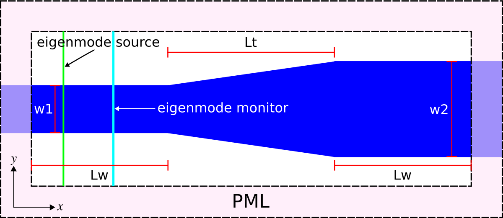
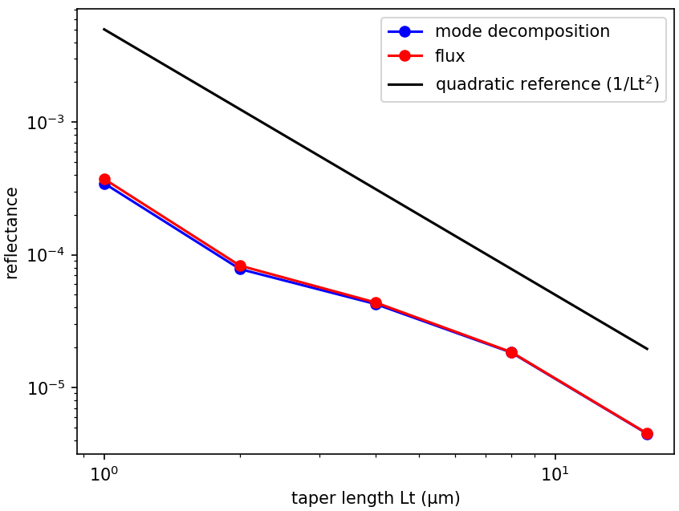

---
# Mode Decomposition
---

Reflectance of a Waveguide Taper
--------------------------------

This tutorial demonstrates the mode-decomposition feature which is used to decompose a given mode profile into a superposition of harmonic basis modes. The example involves computing the reflectance &mdash; the fraction of the reflected power to the incident power &mdash; of the fundamental mode of a linear waveguide taper as shown in the schematic below. We will verify that the scaling of the reflectance with the taper length is quadratic, consistent with analytical results from [Optics Express, Vol. 16, pp. 11376-92, 2008](http://www.opticsinfobase.org/abstract.cfm?URI=oe-16-15-11376).

<center>

</center>

The structure, which can be viewed as a [two-port network](https://en.wikipedia.org/wiki/Two-port_network), consists of a single-mode waveguide of width 1 μm (`w1`) coupled to a second waveguide of width 2 μm (`w2`) via a linearly-sloped taper (length `Lt`). The structure is homogeneous with ε=12 in vacuum. PML absorbing boundaries surround the computational cell. An eigenmode source with E$_z$ polarization is used to launch the fundamental mode at a wavelength of 6.67 μm. There is an eigenmode-expansion monitor placed at the midpoint of the first waveguide. This is a line monitor which extends beyond the waveguide in order to capture the entire mode profile including its evanescent tails. The Fourier-transformed fields along this line monitor are used to compute the basis coefficients of the harmonic modes which are computed separately via the eigenmode solver MPB. The technical details are described in [Mode Decomposition](../Mode_Decomposition). The squared magnitude of the mode coefficient is equivalent to the power in the given eigenmode. We could have also placed a line monitor in the second waveguide to compute the transmittance. The ratio of the complex mode coefficients can be used to compute the [S parameters](https://en.wikipedia.org/wiki/Scattering_parameters).

Note that even though the structure has mirror symmetry in the $y$ direction, we cannot exploit this feature to reduce the computation size by a factor of two as symmetries are not yet supported for the mode-decomposition feature. For comparison, another approach for computing the reflectance involves the `dft_flux` which is demonstrated in [Tutorial/Basics](Python_Tutorials/Basics/#angular-reflectance-spectrum-of-a-planar-interface).

At the end of the simulation, the squared magnitude of the mode coefficients for the forward- and backward-propagating fundamental mode along with the taper length are displayed. The simulation script is shown below and in [mode-decomposition.py](https://github.com/stevengj/meep/blob/master/python/examples/mode-decomposition.py).

```py
import meep as mp
import math
import argparse

def main(args):

    resolution = args.res

    w1 = 1            # width of waveguide 1
    w2 = 2            # width of waveguide 2
    Lw = 10           # length of waveguide 1 and 2
    Lt = args.Lt      # taper length

    Si = mp.Medium(epsilon=12.0)
    
    dair = 3.0
    dpml = 5.0
    
    sx = dpml+Lw+Lt+Lw+dpml
    sy = dpml+dair+w2+dair+dpml
    cell_size = mp.Vector3(sx,sy,0)

    geometry = [ mp.Block(material=Si, center=mp.Vector3(0,0,0), size=mp.Vector3(mp.inf,w1,mp.inf)) ]

    if Lt > 0:
        geometry.append(mp.Block(material=Si, center=mp.Vector3(0.5*sx-0.5*(Lt+Lw+dpml),0,0), size=mp.Vector3(Lt+Lw+dpml,w2,mp.inf)))
    
        hh = w2
        ww = 2*Lt
    
        # taper angle (CCW, relative to +X axis)
        rot_theta = math.atan(0.5*(w2-w1)/Lt)
    
        pvec = mp.Vector3(-0.5*sx+dpml+Lw,0.5*w1,0)
        cvec = mp.Vector3(-0.5*sx+dpml+Lw+0.5*ww,0.5*hh+0.5*w1,0)
        rvec = cvec-pvec
        rrvec = rvec.rotate(mp.Vector3(0,0,1), rot_theta)

        geometry.append(mp.Block(material=mp.air, center=pvec+rrvec, size=mp.Vector3(ww,hh,mp.inf),
                                 e1=mp.Vector3(1,0,0).rotate(mp.Vector3(0,0,1),rot_theta),
                                 e2=mp.Vector3(0,1,0).rotate(mp.Vector3(0,0,1),rot_theta),
                                 e3=mp.Vector3(0,0,1)))

        pvec = mp.Vector3(-0.5*sx+dpml+Lw,-0.5*w1,0)
        cvec = mp.Vector3(-0.5*sx+dpml+Lw+0.5*ww,-(0.5*hh+0.5*w1),0)
        rvec = cvec-pvec
        rrvec = rvec.rotate(mp.Vector3(0,0,1),-rot_theta)

        geometry.append(mp.Block(material=mp.air, center=pvec+rrvec, size=mp.Vector3(ww,hh,mp.inf),
                                 e1=mp.Vector3(1,0,0).rotate(mp.Vector3(0,0,1),-rot_theta),
                                 e2=mp.Vector3(0,1,0).rotate(mp.Vector3(0,0,1),-rot_theta),
                                 e3=mp.Vector3(0,0,1)))
        
    boundary_layers = [ mp.PML(dpml) ]

    # mode wavelength
    lcen = 6.67

    # mode frequency
    fcen = 1/lcen
    
    sources = [ mp.EigenModeSource(src=mp.GaussianSource(fcen, fwidth=0.2*fcen),
                                   component=mp.Ez,
                                   size=mp.Vector3(0,sy-2*dpml,0),
                                   center=mp.Vector3(-0.5*sx+dpml+0.2*Lw,0,0),
                                   eig_match_freq=True,
                                   eig_parity=mp.ODD_Z+mp.EVEN_Y) ]
    
    sim = mp.Simulation(resolution=resolution,
                        cell_size=cell_size,
                        boundary_layers=boundary_layers,
                        geometry=geometry,
                        sources=sources)

    xm = -0.5*sx+dpml+0.5*Lw  # x-coordinate of monitor
    mode_monitor = sim.add_eigenmode(fcen, 0, 1, mp.FluxRegion(center=mp.Vector3(xm,0), size=mp.Vector3(0,sy-2*dpml)))
    
    sim.run(until_after_sources=mp.stop_when_fields_decayed(50, mp.Ez, mp.Vector3(xm,0,0), 1e-9))

    coeffs = sim.get_eigenmode_coefficients(mode_monitor, [1])    
    
    print("mode:, {}, {:.8f}, {:.8f}".format(Lt,abs(coeffs[0,0,0])**2,abs(coeffs[0,0,1])**2))
    
if __name__ == '__main__':
    parser = argparse.ArgumentParser()
    parser.add_argument('-Lt', type=float, default=3.0, help='taper length (default: 3.0)')
    parser.add_argument('-res', type=int, default=50, help='resolution (default: 50)')
    args = parser.parse_args()
    main(args)
```

To investigate the scaling, we compute the reflectance for a range of taper lengths on a logarithmic scale: 1, 2, 4, 8, 16, 32, and 64 μm. A quadratic scaling of the reflectance with the taper length will appear as a straight line on a log-log plot. In order to obtain the incident power, we need a separate simulation with no waveguide taper and involving just the first waveguide. This is done by using a taper length of 0. We will use a parallel simulation with two processors to speed up the calculation. The bash script is shown below.

```sh
#!/bin/bash

mpirun -np 2 python mode-decomposition.py -Lt 0 |tee taper_data.out;

for i in `seq 0 6`; do
    mpirun -np 2 python mode-decomposition.py -Lt $((2**${i})) |tee -a taper_data.out;
done

grep mode: taper_data.out |cut -d , -f2- > taper_data.dat
```

The results are plotted using the Python script below. The plot is shown in the accompanying figure. For reference, a quadratic scaling is shown in black. Consistent with analytical results, the reflectance of the linear waveguide taper decreases quadratically with the taper length.

```py
import numpy as np
import matplotlib.pyplot as plt

f = np.genfromtxt("taper_data.dat", delimiter=",")
Lt = f[1:,0]
Rmeep = f[1:,2]/f[0,1]

plt.figure(dpi=150)
plt.loglog(Lt,Rmeep,'bo-',label='meep')
plt.loglog(Lt,0.01/Lt**2,'k-',label=r'quadratic reference (1/Lt$^2$)')
plt.legend(loc='upper right')
plt.xlabel('taper length Lt (μm)')
plt.ylabel('reflectance')
plt.show()
```

<center>

</center>
