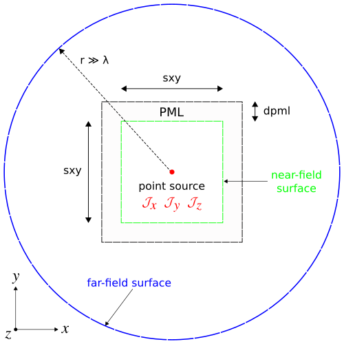
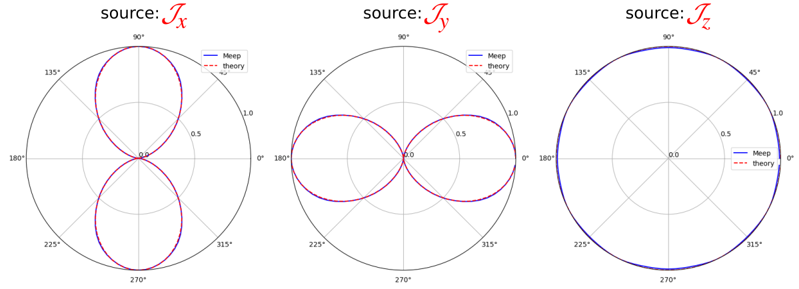
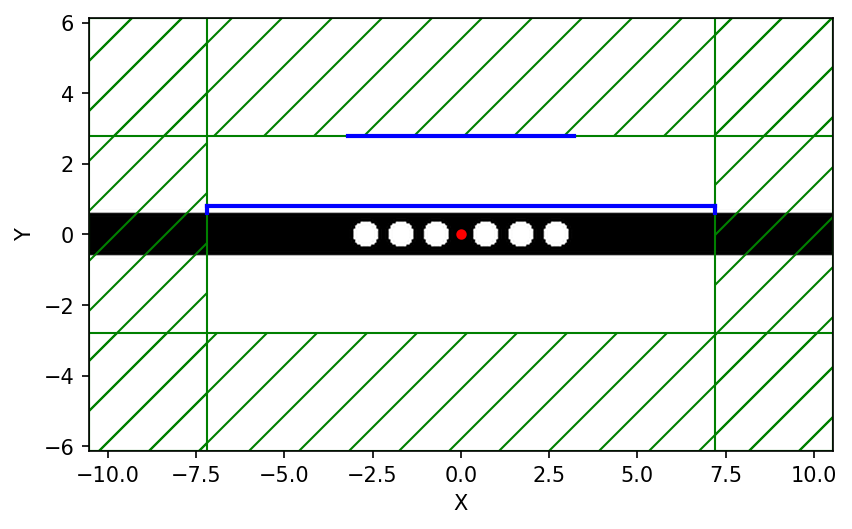

---
# Near to Far Field Spectra
---

We demonstrate Meep's near-to-far-field transformation feature using two examples. This feature uses the fields from a "near" bounding surface <i>inside</i> the computational cell to compute the resulting "far" fields <i>outside</i> the computational cell via an analytical transformation. Note that this only works if the "near" surface and the "far" region lie in a single, homogeneous, non-periodic 2d or 3d medium. The analytical transformation is based on the principle of equivalence which is described in Section 4.2.1 in [Chapter 4](http://arxiv.org/abs/arXiv:1301.5366) ("Electromagnetic Wave Source Conditions") of the book [Advances in FDTD Computational Electrodynamics: Photonics and Nanotechnology](https://www.amazon.com/Advances-FDTD-Computational-Electrodynamics-Nanotechnology/dp/1608071707). Given the Fourier-transformed tangential fields on the "near" surface, Meep computes equivalent currents and convolves them with the analytical Green's functions in order to compute the fields at any desired point in the "far" region. The use of the Fourier-transformed fields for this operation is similar to that for the flux and force spectra: we specify a set of desired frequencies, Meep accumulates the Fourier transforms, and then Meep computes the fields at each frequency for the desired far-field points.

There are three steps to using the near-to-far-field feature. First, we need to define the "near" surface(s) as a set of surfaces capturing all outgoing radiation in the desired direction(s). Second, we run the simulation, typically with a pulsed source, to allow Meep to accumulate the Fourier transforms on the near surface(s). Third, we have Meep compute the far fields at any desired points with the option to save the far fields from a grid of points to an HDF5 file.

[TOC]

### Radiation Pattern of an Antenna

In this example, we use the near-to-far-field transformation feature to compute the [radiation pattern](https://en.wikipedia.org/wiki/Radiation_pattern) of an antenna. This involves an electric-current point source as the emitter in vacuum. We will compute the radiation pattern for different polarizations of the input source. The source is placed in the middle of the 2d computational cell which is surrounded by perfectly-matched layers (PMLs). The near-field surface, used to compute the far fields as described above, is along the inner boundary of the PML. The far fields are computed at several equally-spaced points along the circumference of a circle having a radius many times the source wavelength and thus lying outside of the computational cell. The simulation geometry is shown in the schematic below.

<center>

</center>

We use the `get_farfield` routine to compute the far fields by looping over a set of points along the circumference of the circle. The simulation script is in [examples/antenna-radiation.py](https://github.com/stevengj/meep/blob/master/python/examples/antenna-radiation.py).

```py
import meep as mp
import math

resolution = 50
sxy = 4
dpml = 1
cell = mp.Vector3(sxy+2*dpml,sxy+2*dpml,0)

pml_layers = mp.PML(dpml)

fcen = 1.0
df = 0.4
src_cmpt = mp.Ez

sources = mp.Source(src=mp.GaussianSource(fcen,fwidth=df), center=mp.Vector3(), component=src_cmpt)

if src_cmpt == mp.Ex:
    symmetries = [mp.Mirror(mp.Y)]
elif src_cmpt == mp.Ey:
    symmetries = [mp.Mirror(mp.X)]
elif src_cmpt == mp.Ez:
    symmetries = [mp.Mirror(mp.X), mp.Mirror(mp.Y)]

sim = mp.Simulation(cell_size=cell,
                    resolution=resolution,
                    sources=[sources],
                    symmetries=symmetries,
                    boundary_layers=[pml_layers])

nearfield = sim.add_near2far(fcen, 0, 1,
                             mp.Near2FarRegion(mp.Vector3(0,  0.5*sxy), size=mp.Vector3(sxy)),
                             mp.Near2FarRegion(mp.Vector3(0, -0.5*sxy), size=mp.Vector3(sxy), weight=-1.0),
                             mp.Near2FarRegion(mp.Vector3( 0.5*sxy), size=mp.Vector3(0,sxy)),
                             mp.Near2FarRegion(mp.Vector3(-0.5*sxy), size=mp.Vector3(0,sxy), weight=-1.0))

sim.run(until_after_sources=mp.stop_when_fields_decayed(50, src_cmpt, mp.Vector3(), 1e-8))

r = 1000*(1/fcen)  # 1000 wavelengths out from the source
npts = 100         # number of points in [0,2*pi) range of angles

for n in range(npts):
    ff = sim.get_farfield(nearfield, mp.Vector3(r*math.cos(2*math.pi*(n/npts)),
                                                r*math.sin(2*math.pi*(n/npts))))
    print("farfield: {}, {}, ".format(n,2*math.pi*n/npts), end='')
    print(", ".join([str(f).strip('()').replace('j', 'i') for f in ff]))
```

We compute the far fields at a single frequency corresponding to a wavelength of 1 μm (`fcen`) for three different polarizations of the point source by running three separate times and setting the `src_cmpt` parameter to E$_x$, E$_y$, and E$_z$. The output consists of eight columns containing the far-field points' index (integer), angle (radians), followed by the six field components (E$_x$, E$_y$, E$_z$, H$_x$, H$_y$, H$_z$). Note that the far fields computed analytically using `near2far` are always complex even though the near fields are real as in this example. From the far fields at each point $\mathbf{r}$, we can compute the in-plane flux: $\sqrt{P_x^2+P_y^2}$, where P$_x$ and P$_y$ are the components of the Poynting vector $\mathbf{P}=(P_x,P_y,P_z)=\mathrm{Re}\, \mathbf{E}(\mathbf{r})^*\times\mathbf{H}(\mathbf{r})$.

We plot the in-plane flux normalized by its maximum value over the entire interval to obtain a range of values between 0 and 1. These are shown in the linearly-scaled, polar-coordinate plots below. As expected, the J$_x$ and J$_y$ sources produce dipole radiation patterns while J$_z$ has a monopole pattern. These plots were generated using this [Jupyter notebook](http://ab-initio.mit.edu/~oskooi/wiki_data/farfield_radiation_pattern.ipynb) and [output file](http://ab-initio.mit.edu/~oskooi/wiki_data/source_Jy_farfields.dat).

<center>

</center>

### Far-Field Intensity of a Cavity

For this demonstration, we will compute the far-field spectra of a resonant cavity mode in a holey waveguide; a structure we had explored in [Tutorial/Resonant Modes and Transmission in a Waveguide Cavity](Resonant_Modes_and_Transmission_in_a_Waveguide_Cavity.md). See [cavity-farfield.py](https://github.com/stevengj/meep/blob/master/python/examples/cavity-farfield.py). The structure is shown at the bottom of the left image below.



To do this, we simply remove the last portion of [holey-wvg-cavity.py](https://github.com/stevengj/meep/blob/master/python/examples/holey-wvg-cavity.py), beginning right after the line:

```py
sim.symmetries.append(mp.Mirror(mp.Y, phase=-1))
sim.symmetries.append(mp.Mirror(mp.X, phase=-1))
```

and insert the following lines:

```py
d1 = 0.2

sim = mp.Simulation(cell_size=cell,
                    geometry=geometry,
                    sources=[sources],
                    symmetries=symmetries,
                    boundary_layers=[pml_layers],
                    resolution=resolution)

nearfield = sim.add_near2far(
    fcen, 0, 1,
    mp.Near2FarRegion(mp.Vector3(0, 0.5 * w + d1), size=mp.Vector3(2 * dpml - sx)),
    mp.Near2FarRegion(mp.Vector3(-0.5 * sx + dpml, 0.5 * w + 0.5 * d1), size=mp.Vector3(0, d1), weight=-1.0),
    mp.Near2FarRegion(mp.Vector3(0.5 * sx - dpml, 0.5 * w + 0.5 * d1), size=mp.Vector3(0, d1))
)
```

We are creating a "near" bounding surface, consisting of three separate regions surrounding the cavity, that captures <i>all</i> outgoing waves in the top-half of the computational cell. Note that the *x*-normal surface on the left has a `weight` of -1 corresponding to the direction of the *outward normal* vector relative to the *x* direction so that the far-field spectra is correctly computed from the outgoing fields, similar to the flux and force features. The parameter `d1` is the distance between the edge of the waveguide and the bounding surface, as shown in the schematic above, and we will demonstrate that changing this parameter does not change the far-field spectra which we compute at a single frequency corresponding to the cavity mode.

We then time step the fields until, at a random point, they have sufficiently decayed away as the computational cell is surrounded by PMLs, and output the far-field spectra over a rectangular area that lies <i>outside</i> of the computational cell:

```py
sim.run(until_after_sources=mp.stop_when_fields_decayed(50, mp.Hz, mp.Vector3(0.12, -0.37), 1e-8))

d2 = 20
h = 4

sim.output_farfields(nearfield, "spectra-{}-{}-{}".format(d1, d2, h),
                     mp.Volume(mp.Vector3(0, (0.5 * w) + d2 + (0.5 * h)), size=mp.Vector3(sx - 2 * dpml, h)),
                     resolution)
```

The first item to note is that the far-field region is located <i>outside</i> of the computational cell, although in principle it can be located anywhere. The second is that the far-field spectra can be interpolated onto a spatial grid that has any given resolution but in this example we used the same resolution as the simulation. Note that the simulation itself used purely real fields but the output, given its analytical nature, contains complex fields. Finally, given that the far-field spectra is derived from the Fourier-transformed fields which includes an arbitrary constant factor, we should expect an overall scale and phase difference in the results obtained using the near-to-far-field feature with those from a corresponding simulation involving the full computational volume. The key point is that the results will be qualitatively but not quantitatively identical. The data will be written out to an HDF5 file having a filename prefix with the values of the three main parameters. This file will includes the far-field spectra for all six field components, including real and imaginary parts.

We run the above modified control file and in post-processing create an image of the real and imaginary parts of H$_z$ over the far-field region which is shown in insets (a) above. For comparison, we compute the steady-state fields using a larger computational cell that contains within it the far-field region. This involves a continuous source and complex fields. Results are shown in figure (b) above. The difference in the relative phases among any two points within each of the two field spectra is zero, which can be confirmed numerically. Also, as would be expected, it can be shown that increasing `d1` does not change the far-field spectra as long as the results are sufficiently converged. This indicates that discretization effects are irrelevant.

In general, it is tricky to interpret the overall scale and phase of the far fields, because it is related to the scaling of the Fourier transforms of the near fields. It is simplest to use the `near2far` feature in situations where the overall scaling is irrelevant, e.g. when you are computing a ratio of fields in two simulations, or a fraction of the far field in some region, etcetera.