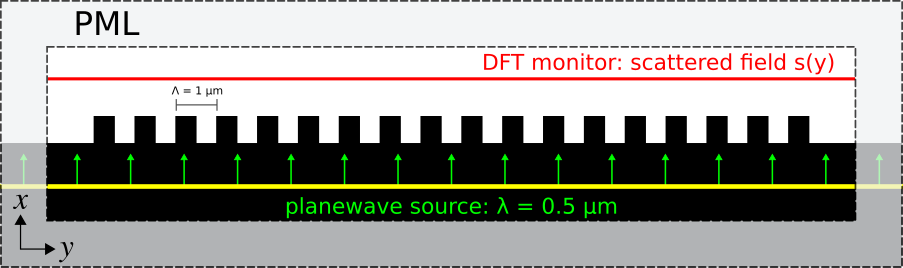
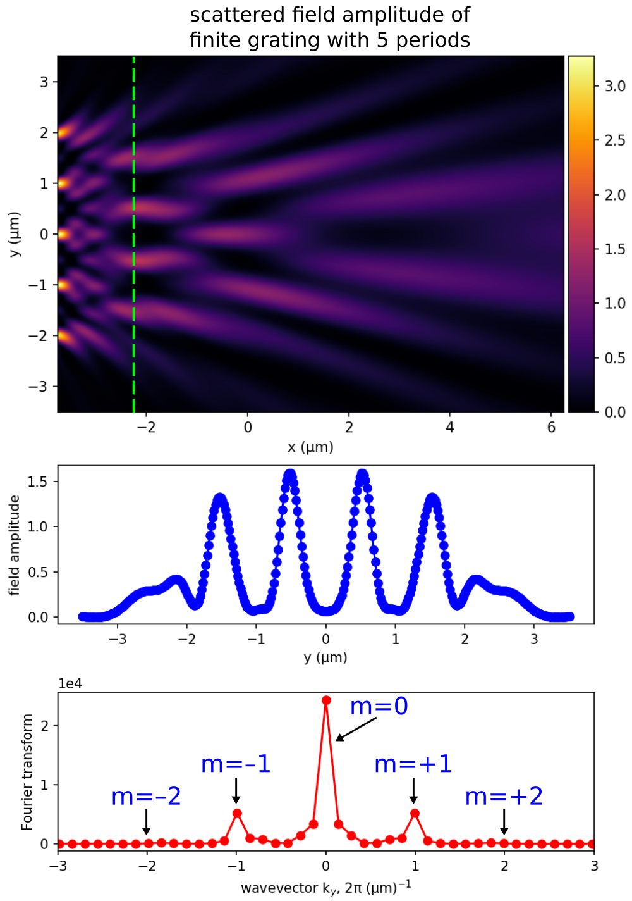
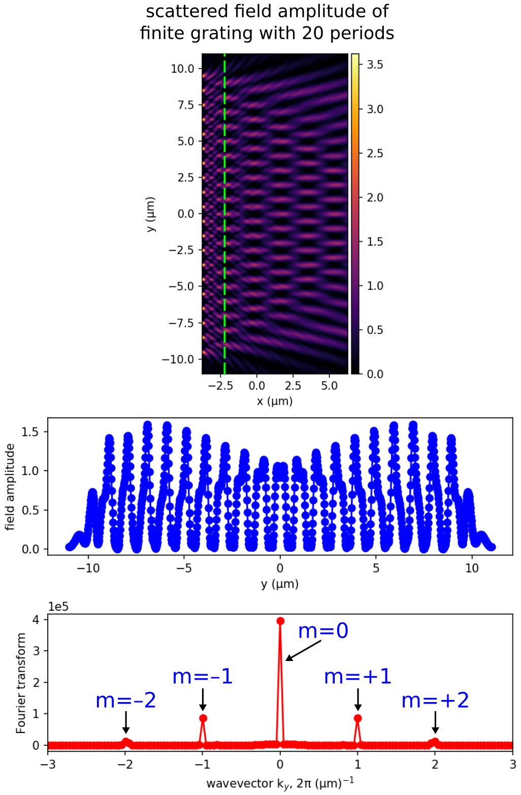
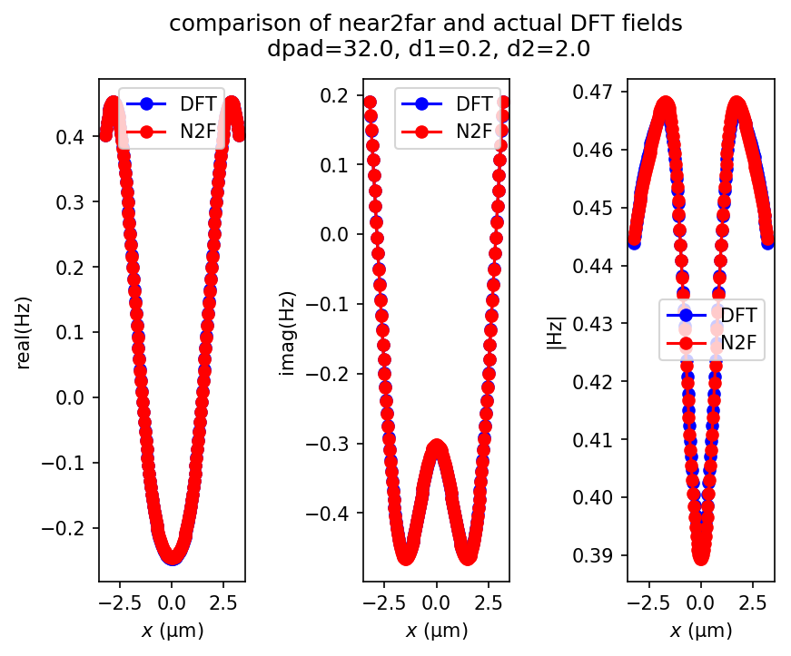
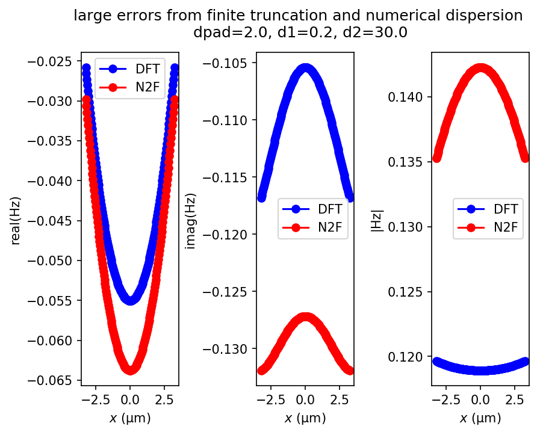

---
# Near to Far Field Spectra
---

The [near-to-far field transformation](../Python_User_Interface.md#near-to-far-field-spectra) feature is demonstrated using four different examples. There are three steps involved in this type of calculation. First, the "near" surface(s) is defined as a set of surfaces capturing *all* outgoing radiation in the desired direction(s). Second, the simulation is run using a pulsed source (or alternatively, a CW source via the [frequency-domain solver](../Python_User_Interface.md#frequency-domain-solver)) to allow Meep to accumulate the DFT fields on the near surface(s). Third, Meep computes the far fields at any desired points with the option to save the far fields to an HDF5 file.

[TOC]

Radiation Pattern of an Antenna
-------------------------------

In this example, we compute the [radiation pattern](https://en.wikipedia.org/wiki/Radiation_pattern) of an antenna. This involves an electric-current point dipole emitter in vacuum. The source is placed at the center of a 2d cell surrounded by PML. The near fields are obtained on a bounding box defined along the edges of the non-PML region. The far fields are computed in two ways from *closed* surfaces: (1) sides of a square and (2) circumference of a circle, having a length/radius many times larger than the source wavelength and lying beyond the cell. From both the near and far fields, we will also compute the total outgoing Poynting flux and demonstrate that they are equivalent. Results will be shown for three orthogonal polarizations of the input source.

The simulation geometry is shown in the following schematic.

<center>

</center>

In the first part of the simulation, we define the cell and source as well as the near field and flux regions. Since we are using a pulsed source (with center wavelength of 1 μm), the fields are timestepped until they have sufficiently decayed away.

The simulation script is in [examples/antenna-radiation.py](https://github.com/NanoComp/meep/blob/master/python/examples/antenna-radiation.py). The notebook is [examples/antenna-radiation.ipynb](https://nbviewer.jupyter.org/github/NanoComp/meep/blob/master/python/examples/antenna-radiation.ipynb).

```py
import meep as mp
import math
import numpy as np
import matplotlib.pyplot as plt

resolution = 50  # pixels/um

sxy = 4
dpml = 1
cell = mp.Vector3(sxy+2*dpml,sxy+2*dpml)

pml_layers = [mp.PML(dpml)]

fcen = 1.0
df = 0.4
src_cmpt = mp.Ez
sources = [mp.Source(src=mp.GaussianSource(fcen,fwidth=df),
                     center=mp.Vector3(),
                     component=src_cmpt)]

if src_cmpt == mp.Ex:
    symmetries = [mp.Mirror(mp.X,phase=-1),
                  mp.Mirror(mp.Y,phase=+1)]
elif src_cmpt == mp.Ey:
    symmetries = [mp.Mirror(mp.X,phase=+1),
                  mp.Mirror(mp.Y,phase=-1)]
elif src_cmpt == mp.Ez:
    symmetries = [mp.Mirror(mp.X,phase=+1),
                  mp.Mirror(mp.Y,phase=+1)]

sim = mp.Simulation(cell_size=cell,
                    resolution=resolution,
                    sources=sources,
                    symmetries=symmetries,
                    boundary_layers=pml_layers)

nearfield_box = sim.add_near2far(fcen, 0, 1,
                                 mp.Near2FarRegion(center=mp.Vector3(0,+0.5*sxy), size=mp.Vector3(sxy,0), weight=+1),
                                 mp.Near2FarRegion(center=mp.Vector3(0,-0.5*sxy), size=mp.Vector3(sxy,0), weight=-1),
                                 mp.Near2FarRegion(center=mp.Vector3(+0.5*sxy,0), size=mp.Vector3(0,sxy), weight=+1),
                                 mp.Near2FarRegion(center=mp.Vector3(-0.5*sxy,0), size=mp.Vector3(0,sxy), weight=-1))

flux_box = sim.add_flux(fcen, 0, 1,
                        mp.FluxRegion(center=mp.Vector3(0,+0.5*sxy), size=mp.Vector3(sxy,0), weight=+1),
                        mp.FluxRegion(center=mp.Vector3(0,-0.5*sxy), size=mp.Vector3(sxy,0), weight=-1),
                        mp.FluxRegion(center=mp.Vector3(+0.5*sxy,0), size=mp.Vector3(0,sxy), weight=+1),
                        mp.FluxRegion(center=mp.Vector3(-0.5*sxy,0), size=mp.Vector3(0,sxy), weight=-1))

sim.run(until_after_sources=mp.stop_when_fields_decayed(50, src_cmpt, mp.Vector3(), 1e-8))
```

After the time stepping, the flux of the near fields is computed using `get_fluxes`:

```py
near_flux = mp.get_fluxes(flux_box)[0]
```

In the first of two cases, the flux of the far fields is computed using the `flux` routine for a square box of side length 2 mm which is 2000 times larger than the source wavelength. This requires computing the outgoing flux on each of the four sides of the box separately and summing the values. The resolution of the far fields is chosen arbitrarily as 1 point/μm. This means there are 2x10<sup>6</sup> points per side length.

```py
r = 1000/fcen      # half side length of far-field square box OR radius of far-field circle
res_ff = 1         # resolution of far fields (points/μm)
far_flux_box = (nearfield_box.flux(mp.Y, mp.Volume(center=mp.Vector3(y=r), size=mp.Vector3(2*r)), res_ff)[0]
               - nearfield_box.flux(mp.Y, mp.Volume(center=mp.Vector3(y=-r), size=mp.Vector3(2*r)), res_ff)[0]
               + nearfield_box.flux(mp.X, mp.Volume(center=mp.Vector3(r), size=mp.Vector3(y=2*r)), res_ff)[0]
               - nearfield_box.flux(mp.X, mp.Volume(center=mp.Vector3(-r), size=mp.Vector3(y=2*r)), res_ff)[0])
```

For the second of two cases, we use the `get_farfield` routine to compute the far fields by looping over a set of 100 equally-spaced points along the circumference of a circle with radius of 1 mm. The six far field components ($E_x$, $E_y$, $E_z$, $H_x$, $H_y$, $H_z$) are stored as separate arrays of complex numbers. From the far fields at each point $\mathbf{r}$, we compute the outgoing or radial flux: $\sqrt{P_x^2+P_y^2}$, where $P_x$ and $P_y$ are the components of the Poynting vector $\mathbf{P}(\mathbf{r})=(P_x,P_y,P_z)=\mathrm{Re}\, \mathbf{E}(\mathbf{r})^*\times\mathbf{H}(\mathbf{r})$. Note that $P_z$ is always 0 since this is a 2d simulation. The total flux is computed and the three flux values are displayed.

```py
npts = 100         # number of points in [0,2*pi) range of angles
angles = 2*math.pi/npts*np.arange(npts)

E = np.zeros((npts,3),dtype=np.complex128)
H = np.zeros((npts,3),dtype=np.complex128)
for n in range(npts):
    ff = sim.get_farfield(nearfield_box,
                          mp.Vector3(r*math.cos(angles[n]),
                                     r*math.sin(angles[n])))
    E[n,:] = [np.conj(ff[j]) for j in range(3)]
    H[n,:] = [ff[j+3] for j in range(3)]

Px = np.real(E[:,1]*H[:,2]-E[:,2]*H[:,1])
Py = np.real(E[:,2]*H[:,0]-E[:,0]*H[:,2])
Pr = np.sqrt(np.square(Px)+np.square(Py))

far_flux_circle = np.sum(Pr)*2*np.pi*r/len(Pr)

print("flux:, {:.6f}, {:.6f}, {:.6f}".format(near_flux,far_flux_box,far_flux_circle))
```

By [Poynting's theorem](https://en.wikipedia.org/wiki/Poynting%27s_theorem), the total outgoing flux obtained by integrating around a *closed* surface should be the same whether it is calculated from the near or far fields (unless there are sources or absorbers in between). The flux of the near fields for the $J_z$ source is 2.456196 and that for the far fields is 2.458030 (box) and 2.457249 (circle). The ratio of near- to far-field (circle) flux is 0.999571. Similarly, for the $J_x$ source, the values are 1.227786 (near-field), 1.227651 (far-field box), and 1.227260 (far-field circle). The ratio of near- to far-field (circle) flux is 1.000429. The slight differences in the flux values are due to discretization effects and will decrease as the resolution is increased.

Finally, we plot the radial flux normalized by its maximum value over the entire interval to obtain a range of values between 0 and 1. These are shown below in the linearly-scaled, polar-coordinate plots. The three figures are obtained using separate runs involving a `src_cmpt` of $E_x$, $E_y$, and $E_z$. As expected, the $J_x$ and $J_y$ sources produce [dipole](https://en.wikipedia.org/wiki/Electric_dipole_moment) radiation patterns while $J_z$ has a monopole pattern.

```py
ax = plt.subplot(111, projection='polar')
ax.plot(angles,Pr/max(Pr),'b-')
ax.set_rmax(1)
ax.set_rticks([0,0.5,1])
ax.grid(True)
ax.set_rlabel_position(22)
plt.show()
```

<center>

</center>

Focusing Properties of a Metasurface Lens
-----------------------------------------

This example demonstrates how to compute the far-field profile at the focal length of a metasurface lens. The lens design, which is also part of the tutorial, is based on a supercell of binary-grating unit cells. For a review of the binary-grating geometry as well as a demonstration of computing its phasemap, see [Tutorial/Mode Decomposition/Phase Map of a Subwavelength Binary Grating](Mode_Decomposition.md#phase-map-of-a-subwavelength-binary-grating). The far-field calculation of the lens contains two separate components: (1) compute the phasemap of the unit cell as a function of a single geometric parameter, the duty cycle (also referred to as the filling fraction), while keeping its height and periodicity fixed (1.8 μm and 0.3 μm, respectively), and (2) form the supercell lens by tuning the local phase of each of a variable number of unit cells according to the quadratic formula for planar wavefront focusing. The operating wavelength is 0.5 μm and the focal length is 0.2 mm. The input source is an $E_z$-polarized planewave at normal incidence.

The simulation script is in [examples/metasurface_lens.py](https://github.com/NanoComp/meep/blob/master/python/examples/metasurface_lens.py). The notebook is [examples/metasurface_lens.ipynb](https://nbviewer.jupyter.org/github/NanoComp/meep/blob/master/python/examples/metasurface_lens.ipynb).

The key to the script is the function `grating` with three geometric input arguments (periodicity, height, and list of duty cycles) which performs the two main tasks: (1) for a unit cell, it computes the phase (as well as the transmittance) and then translates this value from the range of [-π,π] of [Mode Decomposition](../Mode_Decomposition.md) to [-2π,0] in order to be consistent with the analytic formula for the local phase and (2) for a supercell, it computes the far-field intensity profile around the focal length of the lens.

```py
import meep as mp
import numpy as np
import matplotlib.pyplot as plt


resolution = 50         # pixels/μm

dpml = 1.0              # PML thickness
dsub = 2.0              # substrate thickness
dpad = 2.0              # padding between grating and PML

lcen = 0.5              # center wavelength
fcen = 1/lcen           # center frequency
df = 0.2*fcen           # frequency width

focal_length = 200      # focal length of metalens
spot_length = 100       # far field line length
ff_res = 10             # far field resolution (points/μm)

k_point = mp.Vector3(0,0,0)

glass = mp.Medium(index=1.5)

pml_layers = [mp.PML(thickness=dpml,direction=mp.X)]

symmetries=[mp.Mirror(mp.Y)]

def grating(gp,gh,gdc_list):
  sx = dpml+dsub+gh+dpad+dpml
  src_pt = mp.Vector3(-0.5*sx+dpml+0.5*dsub)
  mon_pt = mp.Vector3(0.5*sx-dpml-0.5*dpad)
  geometry = [mp.Block(material=glass,
                       size=mp.Vector3(dpml+dsub,mp.inf,mp.inf),
                       center=mp.Vector3(-0.5*sx+0.5*(dpml+dsub)))]

  num_cells = len(gdc_list)
  if num_cells == 1:
    sy = gp
    cell_size = mp.Vector3(sx,sy,0)

    sources = [mp.Source(mp.GaussianSource(fcen, fwidth=df),
                         component=mp.Ez,
                         center=src_pt,
                         size=mp.Vector3(y=sy))]

    sim = mp.Simulation(resolution=resolution,
                        cell_size=cell_size,
                        boundary_layers=pml_layers,
                        k_point=k_point,
                        default_material=glass,
                        sources=sources,
                        symmetries=symmetries)

    flux_obj = sim.add_flux(fcen, 0, 1, mp.FluxRegion(center=mon_pt, size=mp.Vector3(y=sy)))

    sim.run(until_after_sources=50)

    input_flux = mp.get_fluxes(flux_obj)

    sim.reset_meep()

    geometry.append(mp.Block(material=glass, size=mp.Vector3(gh,gdc_list[0]*gp,mp.inf), center=mp.Vector3(-0.5*sx+dpml+dsub+0.5*gh)))

    sim = mp.Simulation(resolution=resolution,
                        cell_size=cell_size,
                        boundary_layers=pml_layers,
                        geometry=geometry,
                        k_point=k_point,
                        sources=sources,
                        symmetries=symmetries)

    flux_obj = sim.add_flux(fcen, 0, 1, mp.FluxRegion(center=mon_pt, size=mp.Vector3(y=sy)))

    sim.run(until_after_sources=200)

    freqs = mp.get_eigenmode_freqs(flux_obj)
    res = sim.get_eigenmode_coefficients(flux_obj, [1], eig_parity=mp.ODD_Z+mp.EVEN_Y)
    coeffs = res.alpha

    mode_tran = abs(coeffs[0,0,0])**2/input_flux[0]
    mode_phase = np.angle(coeffs[0,0,0])
    if mode_phase > 0:
      mode_phase -= 2*np.pi

    return mode_tran, mode_phase

  else:
    sy = num_cells*gp
    cell_size = mp.Vector3(sx,sy,0)

    sources = [mp.Source(mp.GaussianSource(fcen, fwidth=df),
                         component=mp.Ez,
                         center=src_pt,
                         size=mp.Vector3(y=sy))]

    for j in range(num_cells):
      geometry.append(mp.Block(material=glass,
                               size=mp.Vector3(gh,gdc_list[j]*gp,mp.inf),
                               center=mp.Vector3(-0.5*sx+dpml+dsub+0.5*gh,-0.5*sy+(j+0.5)*gp)))

    sim = mp.Simulation(resolution=resolution,
                        cell_size=cell_size,
                        boundary_layers=pml_layers,
                        geometry=geometry,
                        k_point=k_point,
                        sources=sources,
                        symmetries=symmetries)

    n2f_obj = sim.add_near2far(fcen, 0, 1, mp.Near2FarRegion(center=mon_pt, size=mp.Vector3(y=sy)))

    sim.run(until_after_sources=500)

    return abs(sim.get_farfields(n2f_obj, ff_res, center=mp.Vector3(-0.5*sx+dpml+dsub+gh+focal_length), size=mp.Vector3(spot_length))['Ez'])**2
```

In the first of two parts of the calculation, a phasemap of the binary-grating unit cell is generated based on varying the duty cycle from 0.1 to 0.9.

```py
gp = 0.3                       # grating periodicity
gh = 1.8                       # grating height
gdc = np.linspace(0.1,0.9,30)  # grating duty cycle

mode_tran = np.empty((gdc.size))
mode_phase = np.empty((gdc.size))
for n in range(gdc.size):
  mode_tran[n], mode_phase[n] = grating(gp,gh,[gdc[n]])

plt.figure(dpi=200)
plt.subplot(1,2,1)
plt.plot(gdc, mode_tran, 'bo-')
plt.xlim(gdc[0],gdc[-1])
plt.xticks([t for t in np.linspace(0.1,0.9,5)])
plt.xlabel("grating duty cycle")
plt.ylim(0.96,1.00)
plt.yticks([t for t in np.linspace(0.96,1.00,5)])
plt.title("transmittance")

plt.subplot(1,2,2)
plt.plot(gdc, mode_phase, 'rs-')
plt.grid(True)
plt.xlim(gdc[0],gdc[-1])
plt.xticks([t for t in np.linspace(0.1,0.9,5)])
plt.xlabel("grating duty cycle")
plt.ylim(-2*np.pi,0)
plt.yticks([t for t in np.linspace(-6,0,7)])
plt.title("phase (radians)")

plt.tight_layout(pad=0.5)
plt.show()
```

The phasemap is shown below. The left figure shows the transmittance which is nearly unity for all values of the duty cycle; the Fresnel transmittance is 0.96 for the glass-air interface. This is expected since the periodicity is subwavelength. The right figure shows the phase. There is a subregion in the middle of the plot spanning the duty-cycle range of roughly 0.16 to 0.65 in which the phase varies continuously over the full range of -2π to 0. This structural regime is used to design the supercell lens.

<center>

</center>

In the second part of the calculation, the far-field energy-density profile of three supercell lens designs, comprised of 201, 401, and 801 unit cells, are computed using the quadratic formula for the local phase. Initially, this involves fitting the unit-cell phase data to a finer duty-cycle grid in order to enhance the local-phase interpolation of the supercell. This is important since as the number of unit cells in the lens increases, the local phase via the duty cycle varies more gradually from unit cell to unit cell. However, if the duty cycle becomes too gradual (i.e., less than a tenth of the pixel dimensions), the `resolution` may also need to be increased in order to improve the accuracy of [subpixel smoothing](../Subpixel_Smoothing.md).

```py
gdc_new = np.linspace(0.16,0.65,500)
mode_phase_interp = np.interp(gdc_new, gdc, mode_phase)
print("phase-range:, {:.6f}".format(mode_phase_interp.max()-mode_phase_interp.min()))

phase_tol = 1e-2
num_cells = [100,200,400]
ff_nc = np.empty((spot_length*ff_res,len(num_cells)))

for k in range(len(num_cells)):
  gdc_list = []
  for j in range(-num_cells[k],num_cells[k]+1):
    phase_local = 2*np.pi/lcen * (focal_length-((j*gp)**2 + focal_length**2)**0.5)  # local phase at the center of the j'th unit cell
    phase_mod = phase_local % (-2*np.pi)                                            # restrict phase to [-2*pi,0]
    if phase_mod > mode_phase_interp.max():
      phase_mod = mode_phase_interp.max()
    if phase_mod < mode_phase_interp.min():
      phase_mod = mode_phase_interp.min()
    idx = np.transpose(np.nonzero(np.logical_and(mode_phase_interp > phase_mod-phase_tol, mode_phase_interp < phase_mod+phase_tol)))
    gdc_list.append(gdc_new[idx[0][0]])

  ff_nc[:,k] = grating(gp,gh,gdc_list)

x = np.linspace(focal_length-0.5*spot_length,focal_length+0.5*spot_length,ff_res*spot_length)
plt.figure(dpi=200)
plt.semilogy(x,abs(ff_nc[:,0])**2,'bo-',label='num_cells = {}'.format(2*num_cells[0]+1))
plt.semilogy(x,abs(ff_nc[:,1])**2,'ro-',label='num_cells = {}'.format(2*num_cells[1]+1))
plt.semilogy(x,abs(ff_nc[:,2])**2,'go-',label='num_cells = {}'.format(2*num_cells[2]+1))
plt.xlabel('x coordinate (μm)')
plt.ylabel(r'energy density of far-field electric fields, |E$_z$|$^2$')
plt.title('focusing properties of a binary-grating metasurface lens')
plt.legend(loc='upper right')
plt.tight_layout()
plt.show()
```

Shown below is the supercell lens design involving 201 unit cells. Note that even though periodic boundaries are used in the supercell calculation (via the `k_point`), the choice of cell boundaries in the *y* (or longitudinal) direction is *irrelevant* given the finite length of the lens. For example, PMLs could also have been used (at the expense of a larger cell). Although [`add_near2far`](../Python_User_Interface.md#near-to-far-field-spectra) does support periodic boundaries (via the `nperiods` parameter), it is not necessary for this particular example.

<center>

</center>

The far-field energy-density profile is shown below for the three lens designs. As the number of unit cells increases, the focal spot becomes sharper and sharper. This is expected since the longer the focal length, the bigger the lens required to demonstrate focusing (which means more unit cells). In this example, the largest lens design contains 801 unit cells which corresponds to 0.24 mm or 1.2X the focal length.

<center>

</center>

Diffraction Spectrum of a Finite Binary Grating
-----------------------------------------------

In this example, we compute the diffraction spectrum of a binary phase [grating](https://en.wikipedia.org/wiki/Diffraction_grating) with finite length. To compute the diffraction spectrum of the infinite periodic structure requires [mode decomposition](../Mode_Decomposition.md); for a demonstration, see [Tutorial/Mode Decomposition/Diffraction Spectrum of a Binary Grating](Mode_Decomposition.md#diffraction-spectrum-of-a-binary-grating) which also describes the grating geometry used in this example (i.e., periodicity of 10 μm, height of 0.5 μm, duty cycle of 0.5, and index 1.5 in air). Note that an infinite periodic structure actually has *no* spatial separation of the diffracted orders; they are all present at every far-field point. The focus of this tutorial is to demonstrate `add_near2far`'s support for periodic boundaries.

The simulation script is in [examples/binary_grating_n2f.py](https://github.com/NanoComp/meep/blob/master/python/examples/binary_grating_n2f.py). The notebook is [examples/binary_grating_n2f.ipynb](https://nbviewer.jupyter.org/github/NanoComp/meep/blob/master/python/examples/binary_grating_n2f.ipynb).

The simulation involves computing the scattered near fields of a finite-length grating for an $E_z$-polarized, pulsed planewave source spanning wavelengths of 0.4-0.6 μm at normal incidence. The far fields are then computed for 500 points along a line parallel to the grating axis positioned 100 m away (i.e., $\gg 2D^2/\lambda$, the [Fraunhofer distance](https://en.wikipedia.org/wiki/Fraunhofer_distance); $D=N\Lambda$ where $N$ is the number of unit cells and $\Lambda$ is the grating periodicity, $\lambda$ is the source wavelength) in the upper half plane of the symmetric finite structure with length corresponding to a 20° cone. The diffraction spectra is computed as the ratio of the energy density of the far fields from two separate runs: (1) an empty cell to obtain the fields from just the incident planewave and (2) a binary-grating unit cell to obtain the scattered fields.

Modeling a finite grating requires specifying the `nperiods` parameter of `add_near2far` which sums `2*nperiods+1` Bloch-periodic copies of the near fields. However, because of the way in which the edges of the structure are handled, this approach is only an approximation for a finite periodic surface. We will verify that the error from this approximation is $\mathcal{O}$(1/`nperiods`) by comparing its result with that of a true finite periodic structure involving multiple periods in a supercell arrangement terminated with a flat surface extending into PML. (There are infinitely many ways to terminate a finite periodic structure, of course, and different choices will have slightly different errors compared to the periodic approximation.)

```py
import meep as mp
import math
import numpy as np
from numpy import linalg as LA
import matplotlib.pyplot as plt

resolution = 25        # pixels/μm

dpml = 1.0             # PML thickness
dsub = 3.0             # substrate thickness
dpad = 3.0             # padding between grating and PML
gp = 10.0              # grating period
gh = 0.5               # grating height
gdc = 0.5              # grating duty cycle

nperiods = 10          # number of unit cells in finite periodic grating

ff_distance = 1e8      # far-field distance from near-field monitor
ff_angle = 20          # far-field cone angle
ff_npts = 500          # number of far-field points

ff_length = ff_distance*math.tan(math.radians(ff_angle))
ff_res = ff_npts/ff_length

sx = dpml+dsub+gh+dpad+dpml
cell_size = mp.Vector3(sx)

pml_layers = [mp.PML(thickness=dpml,direction=mp.X)]

symmetries = [mp.Mirror(mp.Y)]

wvl_min = 0.4           # min wavelength
wvl_max = 0.6           # max wavelength
fmin = 1/wvl_max        # min frequency
fmax = 1/wvl_min        # max frequency
fcen = 0.5*(fmin+fmax)  # center frequency
df = fmax-fmin          # frequency width

src_pt = mp.Vector3(-0.5*sx+dpml+0.5*dsub)
sources = [mp.Source(mp.GaussianSource(fcen, fwidth=df), component=mp.Ez, center=src_pt)]

k_point = mp.Vector3()

glass = mp.Medium(index=1.5)

sim = mp.Simulation(resolution=resolution,
                    cell_size=cell_size,
                    boundary_layers=pml_layers,
                    k_point=k_point,
                    default_material=glass,
                    sources=sources)

nfreq = 21
n2f_pt = mp.Vector3(0.5*sx-dpml-0.5*dpad)
n2f_obj = sim.add_near2far(fcen, df, nfreq, mp.Near2FarRegion(center=n2f_pt))

sim.run(until_after_sources=mp.stop_when_fields_decayed(50, mp.Ez, n2f_pt, 1e-9))

ff_source = sim.get_farfields(n2f_obj, ff_res, center=mp.Vector3(ff_distance,0.5*ff_length), size=mp.Vector3(y=ff_length))

sim.reset_meep()

### unit cell with periodic boundaries

sy = gp
cell_size = mp.Vector3(sx,sy)

sources = [mp.Source(mp.GaussianSource(fcen, fwidth=df), component=mp.Ez, center=src_pt, size=mp.Vector3(y=sy))]

geometry = [mp.Block(material=glass, size=mp.Vector3(dpml+dsub,mp.inf,mp.inf), center=mp.Vector3(-0.5*sx+0.5*(dpml+dsub))),
            mp.Block(material=glass, size=mp.Vector3(gh,gdc*gp,mp.inf), center=mp.Vector3(-0.5*sx+dpml+dsub+0.5*gh))]

sim = mp.Simulation(resolution=resolution,
                    split_chunks_evenly=True,
                    cell_size=cell_size,
                    boundary_layers=pml_layers,
                    geometry=geometry,
                    k_point=k_point,
                    sources=sources,
                    symmetries=symmetries)

n2f_obj = sim.add_near2far(fcen, df, nfreq, mp.Near2FarRegion(center=n2f_pt, size=mp.Vector3(y=sy)), nperiods=nperiods)

sim.run(until_after_sources=mp.stop_when_fields_decayed(50, mp.Ez, n2f_pt, 1e-9))

ff_unitcell = sim.get_farfields(n2f_obj, ff_res, center=mp.Vector3(ff_distance,0.5*ff_length), size=mp.Vector3(y=ff_length))

sim.reset_meep()

### finite periodic grating with flat surface termination extending into PML

num_cells = 2*nperiods+1
sy = dpml+num_cells*gp+dpml
cell_size = mp.Vector3(sx,sy)

pml_layers = [mp.PML(thickness=dpml)]

sources = [mp.Source(mp.GaussianSource(fcen, fwidth=df, is_integrated=True),
                     component=mp.Ez,
                     center=src_pt,
                     size=mp.Vector3(y=sy))]

geometry = [mp.Block(material=glass, size=mp.Vector3(dpml+dsub,mp.inf,mp.inf), center=mp.Vector3(-0.5*sx+0.5*(dpml+dsub)))]

for j in range(num_cells):
    geometry.append(mp.Block(material=glass,
                             size=mp.Vector3(gh,gdc*gp,mp.inf),
                             center=mp.Vector3(-0.5*sx+dpml+dsub+0.5*gh,-0.5*sy+dpml+(j+0.5)*gp)))

sim = mp.Simulation(resolution=resolution,
                    split_chunks_evenly=True,
                    cell_size=cell_size,
                    boundary_layers=pml_layers,
                    geometry=geometry,
                    k_point=k_point,
                    sources=sources,
                    symmetries=symmetries)

n2f_obj = sim.add_near2far(fcen, df, nfreq, mp.Near2FarRegion(center=n2f_pt, size=mp.Vector3(y=sy-2*dpml)))

sim.run(until_after_sources=mp.stop_when_fields_decayed(50, mp.Ez, n2f_pt, 1e-9))

ff_supercell = sim.get_farfields(n2f_obj, ff_res, center=mp.Vector3(ff_distance,0.5*ff_length), size=mp.Vector3(y=ff_length))

norm_err = LA.norm(ff_unitcell['Ez']-ff_supercell['Ez'])/nperiods
print("error:, {}, {}".format(nperiods,norm_err))
```

A plot of (a) the diffraction/far-field spectra and (b) its cross section at a fixed wavelength of 0.5 μm, is generated using the commands below and shown in the accompanying figure for two cases: (1) `nperiods = 1` (no tiling; default) and (2) `nperiods = 10` (21 copies). Note that because the evenly-spaced points on the line used to compute the far fields are mapped to angles in the plot, the angular data is *not* evenly spaced. A similar non-uniformity occurs when transforming the far-field data from the frequency to wavelength domain.

```py
freqs = mp.get_near2far_freqs(n2f_obj)
wvl = np.divide(1,freqs)
ff_lengths = np.linspace(0,ff_length,ff_npts)
angles = [math.degrees(math.atan(f)) for f in ff_lengths/ff_distance]

wvl_slice = 0.5
idx_slice = np.where(np.asarray(freqs) == 1/wvl_slice)[0][0]

rel_enh = np.absolute(ff_unitcell['Ez'])**2/np.absolute(ff_source['Ez'])**2

plt.figure(dpi=150)

plt.subplot(1,2,1)
plt.pcolormesh(wvl,angles,rel_enh,cmap='Blues',shading='flat')
plt.axis([wvl_min,wvl_max,0,ff_angle])
plt.xlabel("wavelength (μm)")
plt.ylabel("angle (degrees)")
plt.grid(linewidth=0.5,linestyle='--')
plt.xticks([t for t in np.arange(wvl_min,wvl_max+0.1,0.1)])
plt.yticks([t for t in range(0,ff_angle+1,10)])
plt.title("far-field spectra")

plt.subplot(1,2,2)
plt.plot(angles,rel_enh[:,idx_slice],'bo-')
plt.xlim(0,ff_angle)
plt.ylim(0)
plt.xticks([t for t in range(0,ff_angle+1,10)])
plt.xlabel("angle (degrees)")
plt.ylabel("relative enhancement")
plt.grid(axis='x',linewidth=0.5,linestyle='--')
plt.title("f.-f. spectra @  λ = {:.1} μm".format(wvl_slice))

plt.tight_layout(pad=0.5)
plt.show()
```

<center>

</center>

For the case of `nperiods = 1`, three diffraction orders are present in the far-field spectra as broad peaks with finite angular width (a fourth peak/order is also visible). When `nperiods = 10`, the diffraction orders become sharp, narrow peaks. The three diffraction orders are labeled in the right inset of the bottom figure as m=1, 3, and 5 corresponding to angles 2.9°, 8.6°, and 14.5° which, along with the diffraction efficiency, can be computed analytically using scalar theory as described in [Tutorial/Mode Decomposition/Diffraction Spectrum of a Binary Grating](Mode_Decomposition.md#diffraction-spectrum-of-a-binary-grating). As an additional validation of the simulation results, the ratio of any two diffraction peaks $p_a/p_b$ ($a,b = 1,3,5,...$) is consistent with that of its diffraction efficiencies: $b^2/a^2$.

We verify that the error in `add_near2far` &mdash; defined as the $L_2$-norm of the difference of the two far-field datasets from the unit- and super-cell calculations normalized by `nperiods` &mdash; is $\mathcal{O}$(1/`nperiods`) by comparing results for three values of `nperiods`: 5, 10, and 20. The error values, which are displayed in the output in the line prefixed by `error:`, are: `0.0001195599054639075`, `5.981324591508146e-05`, and `2.989829913961854e-05`. The pairwise ratios of these errors is nearly 2 as expected (i.e., doubling `nperiods` results in halving the error).

For a single process, the far-field calculation in both runs takes roughly the same amount of time. The wall-clock time is indicated by the `getting farfields` category of the `Field time usage` statistics displayed as part of the output after time stepping is complete. Time-stepping a supercell, however, which for `nperiods=20` is more than 41 times larger than the unit cell (because of the PML termination) results in a total wall-clock time that is more than 40% larger. The slowdown is also due to the requirement of computing 41 times as many Fourier-transformed near fields. Thus, in the case of the unit-cell simulation, the reduced accuracy is a tradeoff for shorter runtime and less storage. In this example which involves multiple output wavelengths, the time for the far-field calculation can be reduced further on a single, shared-memory, multi-core machine via [multithreading](https://en.wikipedia.org/wiki/Thread_(computing)#Multithreading) by compiling Meep with OpenMP and specifying the environment variable `OMP_NUM_THREADS` to be an integer greater than one prior to execution.

Finally, we can validate the results for the diffraction spectra of a finite grating via a different approach than computing the far fields: as the (spatial) Fourier transform of the scattered fields. This involves two simulations &mdash; one with the grating and the other with just a flat surface &mdash; and subtracting the Fourier-transformed fields at a given frequency $\omega$ from the two runs to obtain the scattered fields $s(y)$. The Fourier transform of the scattered fields is then computed in post processing: $a(k_y) = \int s(y)\exp(ik_y y)dy$, where $|a(k_y)|^2$ is the amplitude of the corresponding Fourier component. For a grating with periodicity $\Lambda$, we should expect to see peaks in the diffraction spectra at $k_y=2\pi m/\Lambda$ for $m=0, \pm 1, \pm 2, ...$ The total number of diffraction orders is determined by the wavelength as described in [Tutorial/Mode Decomposition/Transmittance Spectra for Planewave at Normal Incidence](Mode_Decomposition.md#transmittance-spectra-for-planewave-at-normal-incidence).

The simulation setup is shown in the schematic below. The binary grating has $\Lambda = 1$ μm at a wavelength of 0.5 μm via a normally-incident planewave pulse (which must [extend into the PML region in order to span the entire width of the cell](../Perfectly_Matched_Layer.md#planewave-sources-extending-into-pml)). The grating structure is terminated with a flat-surface padding in order to give the scattered field space to decay at the edge of the cell.

<center>

</center>

The simulation script is in [examples/finite_grating.py](https://github.com/NanoComp/meep/blob/master/python/examples/finite_grating.py). The notebook is [examples/finite_grating.ipynb](https://nbviewer.jupyter.org/github/NanoComp/meep/blob/master/python/examples/finite_grating.ipynb).

```py
import meep as mp
import numpy as np
import math
import matplotlib.pyplot as plt

# True:  plot the scattered fields in the air region adjacent to the grating
# False: plot the diffraction spectra based on a 1d cross section of the scattered fields
field_profile = True

resolution = 50         # pixels/μm

dpml = 1.0              # PML thickness
dsub = 2.0              # substrate thickness
dpad = 1.0              # flat-surface padding
gp = 1.0                # grating periodicity
gh = 0.5                # grating height
gdc = 0.5               # grating duty cycle
num_cells = 5           # number of grating unit cells

# air region thickness adjacent to grating
dair = 10 if field_profile else dpad

wvl = 0.5               # center wavelength
fcen = 1/wvl            # center frequency

k_point = mp.Vector3()

glass = mp.Medium(index=1.5)

pml_layers = [mp.PML(thickness=dpml)]

symmetries=[mp.Mirror(mp.Y)]

sx = dpml+dsub+gh+dair+dpml
sy = dpml+dpad+num_cells*gp+dpad+dpml
cell_size = mp.Vector3(sx,sy)

src_pt = mp.Vector3(-0.5*sx+dpml+0.5*dsub)
sources = [mp.Source(mp.GaussianSource(fcen,fwidth=0.2*fcen,is_integrated=True),
                     component=mp.Ez,
                     center=src_pt,
                     size=mp.Vector3(y=sy))]

geometry = [mp.Block(material=glass,
                     size=mp.Vector3(dpml+dsub,mp.inf,mp.inf),
                     center=mp.Vector3(-0.5*sx+0.5*(dpml+dsub)))]

sim = mp.Simulation(resolution=resolution,
                    cell_size=cell_size,
                    boundary_layers=pml_layers,
                    geometry=geometry,
                    k_point=k_point,
                    sources=sources,
                    symmetries=symmetries)

mon_pt = mp.Vector3(0.5*sx-dpml-0.5*dair)
near_fields = sim.add_dft_fields([mp.Ez], fcen, 0, 1, center=mon_pt, size=mp.Vector3(dair if field_profile else 0,sy-2*dpml))

sim.run(until_after_sources=100)

flat_dft = sim.get_dft_array(near_fields, mp.Ez, 0)

sim.reset_meep()

for j in range(num_cells):
  geometry.append(mp.Block(material=glass,
                           size=mp.Vector3(gh,gdc*gp,mp.inf),
                           center=mp.Vector3(-0.5*sx+dpml+dsub+0.5*gh,-0.5*sy+dpml+dpad+(j+0.5)*gp)))

sim = mp.Simulation(resolution=resolution,
                    cell_size=cell_size,
                    boundary_layers=pml_layers,
                    geometry=geometry,
                    k_point=k_point,
                    sources=sources,
                    symmetries=symmetries)

near_fields = sim.add_dft_fields([mp.Ez], fcen, 0, 1, center=mon_pt, size=mp.Vector3(dair if field_profile else 0,sy-2*dpml))

sim.run(until_after_sources=100)

grating_dft = sim.get_dft_array(near_fields, mp.Ez, 0)

scattered_field = grating_dft-flat_dft
scattered_amplitude = np.abs(scattered_field)**2

[x,y,z,w] = sim.get_array_metadata(dft_cell=near_fields)

if field_profile:
  if mp.am_master():
    plt.figure(dpi=150)
    plt.pcolormesh(x,y,np.rot90(scattered_amplitude),cmap='inferno',shading='gouraud',vmin=0,vmax=scattered_amplitude.max())
    plt.gca().set_aspect('equal')
    plt.xlabel('x (μm)')
    plt.ylabel('y (μm)')

    # ensure that the height of the colobar matches that of the plot
    from mpl_toolkits.axes_grid1 import make_axes_locatable
    divider = make_axes_locatable(plt.gca())
    cax = divider.append_axes("right", size="5%", pad=0.05)
    plt.colorbar(cax=cax)
    plt.tight_layout()
    plt.show()
else:
  ky = np.fft.fftshift(np.fft.fftfreq(len(scattered_field), 1/resolution))
  FT_scattered_field = np.fft.fftshift(np.fft.fft(scattered_field))
  if mp.am_master():
    plt.figure(dpi=150)
    plt.subplots_adjust(hspace=0.3)

    plt.subplot(2,1,1)
    plt.plot(y,scattered_amplitude,'bo-')
    plt.xlabel("y (μm)")
    plt.ylabel("field amplitude")

    plt.subplot(2,1,2)
    plt.plot(ky,np.abs(FT_scattered_field)**2,'ro-')
    plt.gca().ticklabel_format(axis='y',style='sci',scilimits=(0,0))
    plt.xlabel(r'wavevector k$_y$, 2π (μm)$^{-1}$')
    plt.ylabel("Fourier transform")
    plt.gca().set_xlim([-3, 3])

    plt.tight_layout(pad=1.0)
    plt.show()
```

Results are shown for two finite gratings with 5 and 20 periods.

<center>

</center>

<center>

</center>

The scattered field amplitude profile (the top figure in each of the two sets of results) shows that the fields decay to zero away from the grating (which is positioned at the left edge of the figure in the region indicated by the bright spots). The middle figure is the field amplitude along a 1d slice above the grating (marked by the dotted green line in the top figure). Note the decaying fields at the edges due to the flat-surface termination. The bottom figure is the Fourier transform of the fields from the 1d slice. As expected, there are only three diffraction orders present at $k_y = 2\pi m/\Lambda$ for $m = 0, \pm 1, \pm 2$. These peaks are becoming sharper as the number of grating periods increases.

The sharpness of the peaks directly corresponds to how [collimated](https://en.wikipedia.org/wiki/Collimated_beam) the diffracted beams are, and in the limit of infinitely many periods the resulting $\delta$-function peaks correspond to diffracted planewaves. (The squared amplitude of each peak is proportional to the power in the corresponding diffraction order.) One can also obtain the collimation of the beams more directly by using Meep's `near2far` feature to compute the far-field diffracted waves — this approach is more straightforward, but potentially much more expensive than looking at the Fourier transform of the near field, because one may need a large number of far-field points to resolve the full diffracted beams. In general, [there is a tradeoff in computational science](https://icerm.brown.edu/video_archive/?play=1626) between doing direct "numerical experiments" that are conceptually straightforward but often expensive, versus more indirect and tricky calculations that don't directly correspond to laboratory experiments but which can sometimes be vastly more efficient at extracting physical information.

In 3d, the procedure is very similar, but a little more effort is required to disentangle the two polarizations relative to the plane of incidence [the $(z,\mathbf{k})$ plane for each Fourier component $\mathbf{k}$]. For propagation in the $z$ direction, you would Fourier transform both $E_x$ and $E_y$ of the scattered field as a function of $\mathbf{k}=(k_x, k_y)$. For each $\mathbf{k}$, you decompose the corresponding $\mathbf{E}=(E_x, E_y)$ into the amplitude parallel to $\mathbf{k}$ [which gives the $\mathcal{P}$ polarization amplitude if you multiply by $\sec(\theta)$, where $\sin(\theta)=|\mathbf{k}|/(n\omega/c)$, $n$ is the refractive index of the ambient medium, and $\omega$ is the angular frequency; $\theta$ is the outgoing angle, where $\theta=0$ is normal] and perpendicular to $\mathbf{k}$ [which equals the $\mathcal{S}$ polarization amplitude].  Then square these amplitudes to get something proportional to power as above.  (Note that this analysis is the same even if the incident wave is at an oblique angle, although the **k** locations of the diffraction peaks will change.) Simulating large finite gratings is usually unnecessary since the accuracy improvements are negligible. For example, a 3d simulation of a finite grating with e.g. 100 periods by 100 periods which is computationally expensive would only provide a tiny correction of ~1% (on par with fabrication errors) compared to the infinite structure involving a single unit cell. A finite grating with a small number of periods (e.g., 5 or 10) exhibits weak diffractive effects and is therefore not considered a diffractive grating.

Truncation Errors from a Non-Closed Near-Field Surface
------------------------------------------------------

For this demonstration, we will compute the far-field spectra of a resonant cavity mode in a holey waveguide (a structure introduced in [Tutorial/Resonant Modes and Transmission in a Waveguide Cavity](Resonant_Modes_and_Transmission_in_a_Waveguide_Cavity.md)) and demonstrate that these fields are *exactly* equivalent to the actual DFT fields at the same location. A schematic of the simulation setup generated using [`plot2D`](../Python_User_Interface.md#data-visualization) is shown below.


The script is in [examples/cavity-farfield.py](https://github.com/NanoComp/meep/blob/master/python/examples/cavity-farfield.py). The notebook is [examples/cavity-farfield.ipynb](https://nbviewer.jupyter.org/github/NanoComp/meep/blob/master/python/examples/cavity-farfield.ipynb).

```py
import meep as mp
import numpy as np
import matplotlib
matplotlib.use('agg')
import matplotlib.pyplot as plt


resolution = 20                    # pixels/μm

fcen = 0.25                        # pulse center frequency
df = 0.2                           # pulse width (in frequency)

eps = 13                           # dielectric constant of waveguide
w = 1.2                            # width of waveguide
r = 0.36                           # radius of holes
d = 1.4                            # defect spacing (ordinary spacing = 1)
N = 3                              # number of holes on either side of defect

dpad = 32                          # padding between last hole and PML edge
dpml = 0.5/(fcen-0.5*df)           # PML thickness (> half the largest wavelength)
sx = 2*(dpad+dpml+N) + d - 1       # size of cell in x direction

d1 = 0.2                           # y-distance from waveguide edge to near2far surface
d2 = 2.0                           # y-distance from near2far surface to far-field line
sy = w + 2*(d1+d2+dpml)            # size of cell in y direction (perpendicular to wvg.)

cell = mp.Vector3(sx,sy,0)

geometry = [mp.Block(center=mp.Vector3(),
                     size=mp.Vector3(mp.inf, w, mp.inf),
                     material=mp.Medium(epsilon=eps))]

for i in range(N):
    geometry.append(mp.Cylinder(r, center=mp.Vector3(d / 2 + i)))
    geometry.append(mp.Cylinder(r, center=mp.Vector3(d / -2 - i)))

pml_layers = [mp.PML(dpml)]

sources = [mp.Source(src=mp.GaussianSource(fcen, fwidth=df),
                     component=mp.Hz,
                     center=mp.Vector3())]

symmetries = [mp.Mirror(mp.X, phase=-1),
              mp.Mirror(mp.Y, phase=-1)]

sim = mp.Simulation(cell_size=cell,
                    geometry=geometry,
                    sources=sources,
                    symmetries=symmetries,
                    boundary_layers=pml_layers,
                    resolution=resolution)

nearfield = sim.add_near2far(
    fcen, 0, 1,
    mp.Near2FarRegion(mp.Vector3(0, 0.5*w + d1),
                      size=mp.Vector3(sx - 2*dpml)),
    mp.Near2FarRegion(mp.Vector3(-0.5*sx + dpml, 0.5*w + 0.5*d1),
                      size=mp.Vector3(0, d1),
                      weight=-1.0),
    mp.Near2FarRegion(mp.Vector3(0.5*sx - dpml, 0.5*w + 0.5*d1),
                      size=mp.Vector3(0, d1)),
)

mon = sim.add_dft_fields(
    [mp.Hz],
    fcen,
    0,
    1,
    center=mp.Vector3(0, 0.5*w + d1 + d2),
    size=mp.Vector3(sx - 2*(dpad+dpml), 0)
)

sim.run(until_after_sources=mp.stop_when_dft_decayed())

sim.plot2D()
if mp.am_master():
    plt.savefig(f'cavity_farfield_plot2D_dpad{dpad}_{d1}_{d2}.png',bbox_inches='tight',dpi=150)

Hz_mon = sim.get_dft_array(mon, mp.Hz, 0)

(x,y,z,w) = sim.get_array_metadata(dft_cell=mon)

ff = []
for xc in x:
    ff_pt = sim.get_farfield(nearfield, mp.Vector3(xc,y[0]))
    ff.append(ff_pt[5])
ff = np.array(ff)

if mp.am_master():
    plt.figure()
    plt.subplot(1,3,1)
    plt.plot(x,np.real(Hz_mon),'bo-',label='DFT')
    plt.plot(x,np.real(ff),'ro-',label='N2F')
    plt.legend()
    plt.xlabel('$x$ (μm)')
    plt.ylabel('real(Hz)')

    plt.subplot(1,3,2)
    plt.plot(x,np.imag(Hz_mon),'bo-',label='DFT')
    plt.plot(x,np.imag(ff),'ro-',label='N2F')
    plt.legend()
    plt.xlabel('$x$ (μm)')
    plt.ylabel('imag(Hz)')

    plt.subplot(1,3,3)
    plt.plot(x,np.abs(Hz_mon),'bo-',label='DFT')
    plt.plot(x,np.abs(ff),'ro-',label='N2F')
    plt.legend()
    plt.xlabel('$x$ (μm)')
    plt.ylabel('|Hz|')

    plt.suptitle(f'comparison of near2far and actual DFT fields\n dpad={dpad}, d1={d1}, d2={d2}')
    plt.subplots_adjust(wspace=0.6)
    plt.savefig(f'test_Hz_dft_vs_n2f_res{resolution}_dpad{dpad}_d1{d1}_d2{d2}.png',
                bbox_inches='tight',
                dpi=150)
```

Because of the adjoining waveguides, the total structure is actually infinitely extended in the $x$ direction. It is therefore not possible in a finite simulation to define a *closed* near-field surface for capturing all outgoing waves in the top-half of the cell because (currently) the near-field surface cannot be extended into the PML.   The only workaround is to make the computational cell and hence the near-field surface sufficiently wide so that the truncation effect is negligible, ideally also fine-tuning the distance between the near-field surface and the waveguide mode as discussed below.

A non-closed near-field surface introduces two types of errors from the truncation:

- If an *infinite* near-field surface is positioned adjacent to the guided mode, the equivalent currents on that surface do not radiate any fields simply because the guided mode is under the light cone. However, if the near-field surface is truncated to a finite length, the equivalent currents *do* radiate from the edges. This windowing/truncation is equivalent to "smearing out" guided modes in Fourier space (convolving with a sinc function) so that the currents have radiative Fourier components inside light cone.
- If the finite/truncated near-field surface is moved farther away from the waveguide along the $y$ direction (`d1` parameter in the script), then the spurious radiation from the guided mode decreases exponentially fast. However, if the surface is moved too far away (i.e., `d1` $\gg \lambda$), then it will fail to capture more and more of the radiation from the cavity mode and this will make the results less accurate.

A closed near-field surface will still disagree with a brute-force far-field calculation at a finite resolution, because of discretization errors (the near-to-far transform uses the analytical Green's function of the exact Maxwell equations, not the discretized Green's function), although these errors decrease with spatial resolution.  The biggest of these discretization effects is numerical dispersion (described in Chapter 4 of Taflove and Hagness, 2005), in which the phase velocity is slightly different between the exact and discretized equations. In consequence, a brute-force far-field calculation has phase errors that grow with the propagation distance (the `d2` parameter in the script).

In this example, to demonstrate agreement between the far fields and DFT fields, there are two requirements: (1) the cell size in the $x$ direction via `dpad` needs to be sufficiently large in order to minimize the impact of the spurious radiation from the edge of the near-field surface and (2) the far-field region needs to be sufficiently close to the near-field surface to minimize discrepancies caused by numerical dispersion.



When these two conditions are not met as in the example below involving a small `dpad` and large `d2`, the error from the finite truncation and numerical dispersion can be large and therefore result in a significant mismatch between the far fields computed using the near-to-far field transformation versus the actual DFT fields at the same location.

