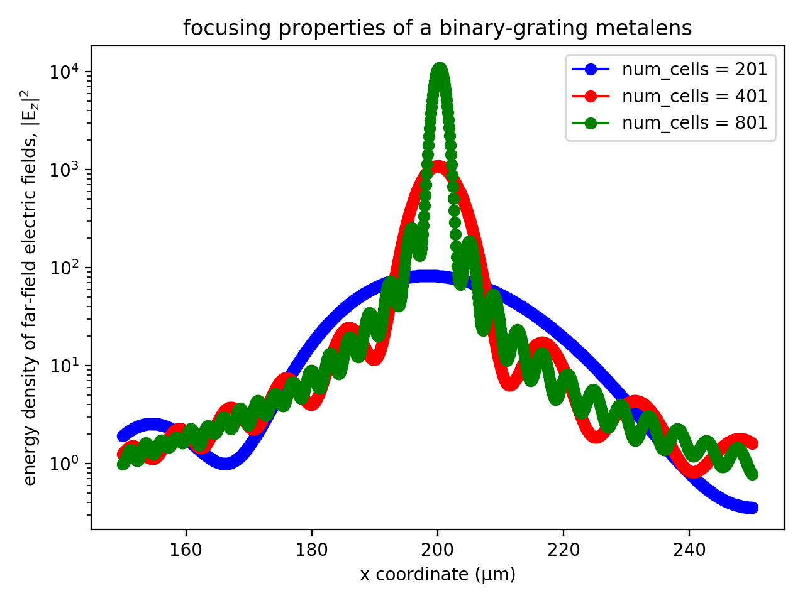

---
# Near to Far Field Spectra
---

We demonstrate Meep's [near-to-far field transformation](../Python_User_Interface.md#near-to-far-field-spectra) feature using two examples. There are three steps involved in this type of calculation. First, we need to define the "near" surface(s) as a set of surfaces capturing *all* outgoing radiation in the desired direction(s). Second, we run the simulation using a pulsed source (or alternatively, a CW source via the [frequency-domain solver](../Python_User_Interface.md#frequency-domain-solver)) to allow Meep to accumulate the Fourier transforms on the near surface(s). Third, we have Meep compute the far fields at any desired points with the option to save the far fields to an HDF5 file.

[TOC]

Radiation Pattern of an Antenna
-------------------------------

In this example, we compute the [radiation pattern](https://en.wikipedia.org/wiki/Radiation_pattern) of an antenna. This involves an electric-current point dipole source as the emitter in vacuum. The source is placed at the center of a 2d square cell surrounded by PML. The near fields are obtained on a bounding box defined along the edges of the non-PML region. The far fields are computed in two ways: along the (1) sides of a square box and (2) circumference of a circle, having a length/radius many times larger than the source wavelength and lying beyond the cell. From both the near and far fields, we will also compute the total outgoing Poynting flux and demonstrate that they are equivalent. Results will be shown for three orthogonal polarizations of the input source.

The simulation geometry is shown in the following schematic.

<center>

</center>

In the first part of the simulation, we define the cell and sources as well as the near field and flux regions. Since we are using a pulsed source (with center wavelength of 1 μm), the fields are timestepped until they have sufficiently decayed away.

The simulation script is in [examples/antenna-radiation.py](https://github.com/NanoComp/meep/blob/master/python/examples/antenna-radiation.py). The notebook is [examples/antenna-radiation.ipynb](https://nbviewer.jupyter.org/github/NanoComp/meep/blob/master/python/examples/antenna-radiation.ipynb)

```py
import meep as mp
import math
import numpy as np
import matplotlib.pyplot as plt

resolution = 50  # pixels/um

sxy = 4
dpml = 1
cell = mp.Vector3(sxy+2*dpml,sxy+2*dpml,0)

pml_layers = [mp.PML(dpml)]

fcen = 1.0
df = 0.4
src_cmpt = mp.Ez
sources = [mp.Source(src=mp.GaussianSource(fcen,fwidth=df),
                     center=mp.Vector3(),
                     component=src_cmpt)]

if src_cmpt == mp.Ex:
    symmetries = [mp.Mirror(mp.X,phase=-1),
                  mp.Mirror(mp.Y,phase=+1)]
elif src_cmpt == mp.Ey:
    symmetries = [mp.Mirror(mp.X,phase=+1),
                  mp.Mirror(mp.Y,phase=-1)]
elif src_cmpt == mp.Ez:
    symmetries = [mp.Mirror(mp.X,phase=+1),
                  mp.Mirror(mp.Y,phase=+1)]

sim = mp.Simulation(cell_size=cell,
                    resolution=resolution,
                    sources=sources,
                    symmetries=symmetries,
                    boundary_layers=pml_layers)

nearfield_box = sim.add_near2far(fcen, 0, 1,
                                 mp.Near2FarRegion(mp.Vector3(y=0.5*sxy), size=mp.Vector3(sxy)),
                                 mp.Near2FarRegion(mp.Vector3(y=-0.5*sxy), size=mp.Vector3(sxy), weight=-1),
                                 mp.Near2FarRegion(mp.Vector3(0.5*sxy), size=mp.Vector3(y=sxy)),
                                 mp.Near2FarRegion(mp.Vector3(-0.5*sxy), size=mp.Vector3(y=sxy), weight=-1))

flux_box = sim.add_flux(fcen, 0, 1,
                        mp.FluxRegion(mp.Vector3(y=0.5*sxy), size=mp.Vector3(sxy)),
                        mp.FluxRegion(mp.Vector3(y=-0.5*sxy), size=mp.Vector3(sxy), weight=-1),
                        mp.FluxRegion(mp.Vector3(0.5*sxy), size=mp.Vector3(y=sxy)),
                        mp.FluxRegion(mp.Vector3(-0.5*sxy), size=mp.Vector3(y=sxy), weight=-1))

sim.run(until_after_sources=mp.stop_when_fields_decayed(50, src_cmpt, mp.Vector3(), 1e-8))
```

After the time stepping, the flux of the near fields is computed using `get_fluxes`:

```py
near_flux = mp.get_fluxes(flux_box)[0]
```

In the first of two cases, the flux of the far fields is computed using the `flux` routine for a square box of side length 2 mm which is 2000 times larger than the source wavelength. This requires computing the outgoing flux on each of the four sides of the box separately and summing the values. The resolution of the far fields is chosen arbitrarily as 1 point/μm. This means there are 2x10<sup>6</sup> points per side length.

```py
r = 1000/fcen      # half side length of far-field square box OR radius of far-field circle
res_ff = 1         # resolution of far fields (points/μm)
far_flux_box = (nearfield_box.flux(mp.Y, mp.Volume(center=mp.Vector3(y=r), size=mp.Vector3(2*r)), res_ff)[0]
               - nearfield_box.flux(mp.Y, mp.Volume(center=mp.Vector3(y=-r), size=mp.Vector3(2*r)), res_ff)[0]
               + nearfield_box.flux(mp.X, mp.Volume(center=mp.Vector3(r), size=mp.Vector3(y=2*r)), res_ff)[0]
               - nearfield_box.flux(mp.X, mp.Volume(center=mp.Vector3(-r), size=mp.Vector3(y=2*r)), res_ff)[0])
```

For the second of two cases, we use the `get_farfield` routine to compute the far fields by looping over a set of 100 equally-spaced points along the circumference of a circle with radius of 1 mm. The six far field components (E$_x$, E$_y$, E$_z$, H$_x$, H$_y$, H$_z$) are stored as separate arrays of complex numbers. From the far fields at each point $\mathbf{r}$, we compute the outgoing or radial flux: $\sqrt{P_x^2+P_y^2}$, where P$_x$ and P$_y$ are the components of the Poynting vector $\mathbf{P}(\mathbf{r})=(P_x,P_y,P_z)=\mathrm{Re}\, \mathbf{E}(\mathbf{r})^*\times\mathbf{H}(\mathbf{r})$. Note that $P_z$ is always 0 since this is a 2d simulation. The total flux is computed and the three flux values are displayed.

```py
npts = 100         # number of points in [0,2*pi) range of angles
angles = 2*math.pi/npts*np.arange(npts)

E = np.zeros((npts,3),dtype=np.complex128)
H = np.zeros((npts,3),dtype=np.complex128)
for n in range(npts):
    ff = sim.get_farfield(nearfield_box,
                          mp.Vector3(r*math.cos(angles[n]),
                                     r*math.sin(angles[n])))
    E[n,:] = [np.conj(ff[j]) for j in range(3)]
    H[n,:] = [ff[j+3] for j in range(3)]

Px = np.real(np.multiply(E[:,1],H[:,2])-np.multiply(E[:,2],H[:,1]))
Py = np.real(np.multiply(E[:,2],H[:,0])-np.multiply(E[:,0],H[:,2]))
Pr = np.sqrt(np.square(Px)+np.square(Py))

far_flux_circle = np.sum(Pr)*2*np.pi*r/len(Pr)

print("flux:, {:.6f}, {:.6f}, {:.6f}".format(near_flux,far_flux_box,far_flux_circle))
```

By [Poynting's theorem](https://en.wikipedia.org/wiki/Poynting%27s_theorem), the total outgoing flux obtained by integrating around a *closed* surface should be the same whether it is calculated from the near or far fields (unless there are sources or absorbers in between). The flux of the near fields for the J$_z$ source is 2.456196 and that for the far fields is 2.458030 (box) and 2.457249 (circle). The ratio of near- to far-field (circle) flux is 0.999571. Similarly, for the J$_x$ source, the values are 1.227786 (near-field), 1.227651 (far-field box), and 1.227260 (far-field circle). The ratio of near- to far-field (circle) flux is 1.000429. The slight differences in the flux values are due to discretization effects and will decrease as the resolution is increased.

Finally, we plot the radial flux normalized by its maximum value over the entire interval to obtain a range of values between 0 and 1. These are shown below in the linearly-scaled, polar-coordinate plots. The three figures are obtained using separate runs involving a `src_cmpt` of E$_x$, E$_y$, and E$_z$. As expected, the J$_x$ and J$_y$ sources produce [dipole](https://en.wikipedia.org/wiki/Electric_dipole_moment) radiation patterns while J$_z$ has a monopole pattern.

```py
ax = plt.subplot(111, projection='polar')
ax.plot(angles,Pr/max(Pr),'b-')
ax.set_rmax(1)
ax.set_rticks([0,0.5,1])
ax.grid(True)
ax.set_rlabel_position(22)
plt.show()
```

<center>

</center>

Focusing Properties of a Metasurface Lens
-----------------------------------------

This example demonstrates how to compute the far-field profile at the focal length of a metasurface lens. The lens design, which is also part of the tutorial, is based on a supercell of binary-grating unit cells. For a review of the binary-grating geometry as well as a demonstration of computing its phasemap, see [Tutorial/Mode Decomposition](Mode_Decomposition.md#phase-map-of-a-subwavelength-binary-grating). The far-field calculation of the lens contains two separate components: (1) compute the phasemap of the unit cell as a function of a single geometric parameter, the duty cycle, while keeping its height and periodicity fixed (1.8 and 0.3 μm), and (2) form the supercell lens by tuning the local phase of each of a variable number of unit cells according to the quadratic formula for planar wavefront focusing. The design wavelength is 0.5 μm and the focal length is 0.2 mm. The input source is an E<sub>z</sub>-polarized planewave at normal incidence.

The simulation script is in [examples/metasurface_lens.py](https://github.com/NanoComp/meep/blob/master/python/examples/metasurface_lens.py). The notebook is [examples/metasurface_lens.ipynb](https://nbviewer.jupyter.org/github/NanoComp/meep/blob/master/python/examples/metasurface_lens.ipynb)

The key to the script is the function `grating` with three geometric input arguments (periodicity, height, and list of duty cycles) which performs the two main tasks: (1) for a unit cell, it computes the phase (as well as the transmittance) and then translates this value from the range of [-π,π] of [Mode Decomposition](../Mode_Decomposition.md) to [-2π,0] in order to be consistent with the analytic formula for the local phase and (2) for a supercell, it computes the far-field intensity profile around the focal length of the lens.

```py
import meep as mp
import numpy as np
import matplotlib.pyplot as plt

resolution = 50         # pixels/μm

dpml = 1.0              # PML thickness
dsub = 2.0              # substrate thickness
dpad = 2.0              # padding between grating and PML

lcen = 0.5              # center wavelength
fcen = 1/lcen           # center frequency
df = 0.2*fcen           # frequency width

focal_length = 200      # focal length of metalens
spot_length = 100       # far field line length
ff_res = 10             # far field resolution (points/μm)

k_point = mp.Vector3(0,0,0)

glass = mp.Medium(index=1.5)

pml_layers = [mp.PML(thickness=dpml,direction=mp.X)]

symmetries=[mp.Mirror(mp.Y)]

def grating(gp,gh,gdc_list):
  sx = dpml+dsub+gh+dpad+dpml
  src_pt = mp.Vector3(-0.5*sx+dpml+0.5*dsub)
  mon_pt = mp.Vector3(0.5*sx-dpml-0.5*dpad)
  geometry = [mp.Block(material=glass,
                       size=mp.Vector3(dpml+dsub,mp.inf,mp.inf),
                       center=mp.Vector3(-0.5*sx+0.5*(dpml+dsub)))]

  num_cells = len(gdc_list)
  if num_cells == 1:
    sy = gp
    cell_size = mp.Vector3(sx,sy,0)

    sources = [mp.Source(mp.GaussianSource(fcen, fwidth=df),
                         component=mp.Ez,
                         center=src_pt,
                         size=mp.Vector3(y=sy))]

    sim = mp.Simulation(resolution=resolution,
                        cell_size=cell_size,
                        boundary_layers=pml_layers,
                        k_point=k_point,
                        default_material=glass,
                        sources=sources,
                        symmetries=symmetries)

    flux_obj = sim.add_flux(fcen, 0, 1, mp.FluxRegion(center=mon_pt, size=mp.Vector3(y=sy)))

    sim.run(until_after_sources=50)

    input_flux = mp.get_fluxes(flux_obj)

    sim.reset_meep()

    geometry.append(mp.Block(material=glass, size=mp.Vector3(gh,gdc_list[0]*gp,mp.inf), center=mp.Vector3(-0.5*sx+dpml+dsub+0.5*gh)))

    sim = mp.Simulation(resolution=resolution,
                        cell_size=cell_size,
                        boundary_layers=pml_layers,
                        geometry=geometry,
                        k_point=k_point,
                        sources=sources,
                        symmetries=symmetries)

    flux_obj = sim.add_flux(fcen, 0, 1, mp.FluxRegion(center=mon_pt, size=mp.Vector3(y=sy)))

    sim.run(until_after_sources=200)

    freqs = mp.get_eigenmode_freqs(flux_obj)
    res = sim.get_eigenmode_coefficients(flux_obj, [1], eig_parity=mp.ODD_Z+mp.EVEN_Y)
    coeffs = res.alpha

    mode_tran = abs(coeffs[0,0,0])**2/input_flux[0]
    mode_phase = np.angle(coeffs[0,0,0])
    if mode_phase > 0:
      mode_phase -= 2*np.pi

    return mode_tran, mode_phase

  else:
    sy = num_cells*gp
    cell_size = mp.Vector3(sx,sy,0)

    sources = [mp.Source(mp.GaussianSource(fcen, fwidth=df),
                         component=mp.Ez,
                         center=src_pt,
                         size=mp.Vector3(y=sy))]

    for j in range(num_cells):
      geometry.append(mp.Block(material=glass,
                               size=mp.Vector3(gh,gdc_list[j]*gp,mp.inf),
                               center=mp.Vector3(-0.5*sx+dpml+dsub+0.5*gh,-0.5*sy+(j+0.5)*gp)))

    sim = mp.Simulation(resolution=resolution,
                        cell_size=cell_size,
                        boundary_layers=pml_layers,
                        geometry=geometry,
                        k_point=k_point,
                        sources=sources,
                        symmetries=symmetries)

    n2f_obj = sim.add_near2far(fcen, 0, 1, mp.Near2FarRegion(center=mon_pt, size=mp.Vector3(y=sy)))

    sim.run(until_after_sources=500)

    return abs(sim.get_farfields(n2f_obj, ff_res, center=mp.Vector3(focal_length), size=mp.Vector3(spot_length))['Ez'])**2
```

In the first of two parts of the calculation, a phasemap of the binary-grating unit cell is generated based on varying the duty cycle from 0.1 to 0.9.

```py
gp = 0.3                       # grating periodicity
gh = 1.8                       # grating height
gdc = np.linspace(0.1,0.9,30)  # grating duty cycle

mode_tran = np.empty((gdc.size))
mode_phase = np.empty((gdc.size))
for n in range(gdc.size):
  mode_tran[n], mode_phase[n] = grating(gp,gh,[gdc[n]])

plt.figure(dpi=200)
plt.subplot(1,2,1)
plt.plot(gdc, mode_tran, 'bo-')
plt.xlim(gdc[0],gdc[-1])
plt.xticks([t for t in np.linspace(0.1,0.9,5)])
plt.xlabel("grating duty cycle")
plt.ylim(0.96,1.00)
plt.yticks([t for t in np.linspace(0.96,1.00,5)])
plt.title("transmittance")

plt.subplot(1,2,2)
plt.plot(gdc, mode_phase, 'rs-')
plt.grid(True)
plt.xlim(gdc[0],gdc[-1])
plt.xticks([t for t in np.linspace(0.1,0.9,5)])
plt.xlabel("grating duty cycle")
plt.ylim(-2*np.pi,0)
plt.yticks([t for t in np.linspace(-6,0,7)])
plt.title("phase (radians)")

plt.tight_layout(pad=0.5)
plt.show()
```

The phasemap is shown below. The left figure shows the transmittance which is nearly unity for all values of the duty cycle. This is expected since the periodicity is subwavelength. The right figure shows the phase. There is a subregion in the middle of the plot spanning the duty-cycle range of roughly 0.16 to 0.65 in which the phase varies continuously over the full range of -2π to 0. This structural regime is used to design the supercell lens.

<center>

</center>

In the second part of the calculation, the far-field energy-density profile of three supercell lens designs, comprised of 201, 401, and 801 unit cells, are computed using the quadratic formula for the local phase. Initially, this involves fitting the unit-cell phase data to a finer duty-cycle grid in order to enhance the local-phase interpolation of the supercell. This is important since as the number of unit cells in the lens increases, the local phase via the duty cycle varies more gradually from unit cell to unit cell. However, if the duty cycle becomes too gradual (i.e., less than a tenth of the pixel dimensions), the `resolution` may also need to be increased in order to improve the accuracy of [subpixel smoothing](../Subpixel_Smoothing.md).

```py
gdc_new = np.linspace(0.16,0.65,500)
mode_phase_interp = np.interp(gdc_new, gdc, mode_phase)
print("phase-range:, {:.6f}".format(mode_phase_interp.max()-mode_phase_interp.min()))

phase_tol = 1e-2
num_cells = [100,200,400]
ff_nc = np.empty((spot_length*ff_res,len(num_cells)))

for k in range(len(num_cells)):
  gdc_list = []
  for j in range(-num_cells[k],num_cells[k]+1):
    phase_local = 2*np.pi/lcen * (focal_length-((j*gp)**2 + focal_length**2)**0.5)  # local phase at the center of the j'th unit cell
    phase_mod = phase_local % (-2*np.pi)                                            # restrict phase to [-2*pi,0]
    if phase_mod > mode_phase_interp.max():
      phase_mod = mode_phase_interp.max()
    if phase_mod < mode_phase_interp.min():
      phase_mod = mode_phase_interp.min()
    idx = np.transpose(np.nonzero(np.logical_and(mode_phase_interp > phase_mod-phase_tol, mode_phase_interp < phase_mod+phase_tol)))
    gdc_list.append(gdc_new[idx[0][0]])

  ff_nc[:,k] = grating(gp,gh,gdc_list)

x = np.linspace(focal_length-0.5*spot_length,focal_length+0.5*spot_length,ff_res*spot_length)
plt.figure(dpi=200)
plt.semilogy(x,abs(ff_nc[:,0])**2,'bo-',label='num_cells = {}'.format(2*num_cells[0]+1))
plt.semilogy(x,abs(ff_nc[:,1])**2,'ro-',label='num_cells = {}'.format(2*num_cells[1]+1))
plt.semilogy(x,abs(ff_nc[:,2])**2,'go-',label='num_cells = {}'.format(2*num_cells[2]+1))
plt.xlabel('x coordinate (μm)')
plt.ylabel(r'energy density of far-field electric fields, |E$_z$|$^2$')
plt.title('focusing properties of a binary-grating metasurface lens')
plt.legend(loc='upper right')
plt.tight_layout()
plt.show()
```

Shown below is the supercell lens design involving 201 unit cells. Note that even though periodic boundaries are used in the supercell calculation (via the `k_point`), the choice of cell boundaries in the *y* (or longitudinal) direction is *irrelevant* given the finite length of the lens. For example, PMLs could also have been used (at the expense of a larger cell). Although [`add_near2far`](../Python_User_Interface.md#near-to-far-field-spectra) does support periodic boundaries (via the `nperiods` parameter), it is not necessary for this particular example.

<center>

</center>

The far-field energy-density profile is shown below for the three lens designs. As the number of unit cells increases, the focal spot becomes sharper and sharper. This is expected since the longer the focal length, the bigger the lens required to demonstrate focusing (which means more unit cells). In this example, the largest lens design contains 801 unit cells which corresponds to 0.24 mm or 1.2X the focal length.

<center>

</center>

Diffraction Spectrum of a Binary Grating
----------------------------------------

In this example, we compute the diffraction spectrum of a binary phase [grating](https://en.wikipedia.org/wiki/Diffraction_grating). (In general, diffraction spectra can be computed much more efficiently using [mode decomposition](../Mode_Decomposition.md); for a demonstration, see [Tutorials/Mode Decomposition/Diffraction Spectrum of a Binary Grating](Mode_Decomposition.md#diffraction-spectrum-of-a-binary-grating) which also describes the grating geometry and simulation parameters.) The focus of this tutorial is mainly to demonstrate `add_near2far`'s support for periodic boundaries.

The simulation script is in [examples/binary_grating_n2f.py](https://github.com/NanoComp/meep/blob/master/python/examples/binary_grating_n2f.py). The notebook is [examples/binary_grating_n2f.ipynb](https://nbviewer.jupyter.org/github/NanoComp/meep/blob/master/python/examples/binary_grating_n2f.ipynb)

The simulation involves computing the scattered near fields of the binary grating for an E<sub>z</sub>-polarized, pulsed planewave source at normal incidence. The far fields are then computed for 500 points along a vertical line positioned 100 m away with length corresponding to a 20° cone. Following standard procedure, two separate runs are performed: (1) an empty cell to obtain the fields from just the incident planewave and (2) a binary-grating unit cell to obtain the scattered fields. The diffraction spectra is computed as the ratio of the energy density of the far fields from the two runs.

```py
import meep as mp
import math
import numpy as np
import matplotlib.pyplot as plt

resolution = 40        # pixels/μm

dpml = 1.0             # PML thickness
dsub = 3.0             # substrate thickness
dpad = 3.0             # padding between grating and PML
gp = 10.0              # grating period
gh = 0.5               # grating height
gdc = 0.5              # grating duty cycle

sx = dpml+dsub+gh+dpad+dpml
cell_size = mp.Vector3(sx)

pml_layers = [mp.PML(thickness=dpml,direction=mp.X)]

wvl_min = 0.4           # min wavelength
wvl_max = 0.6           # max wavelength
fmin = 1/wvl_max        # min frequency
fmax = 1/wvl_min        # max frequency
fcen = 0.5*(fmin+fmax)  # center frequency
df = fmax-fmin          # frequency width

src_pt = mp.Vector3(-0.5*sx+dpml+0.5*dsub)
sources = [mp.Source(mp.GaussianSource(fcen, fwidth=df), component=mp.Ez, center=src_pt)]

k_point = mp.Vector3()

glass = mp.Medium(index=1.5)

sim = mp.Simulation(resolution=resolution,
                    cell_size=cell_size,
                    boundary_layers=pml_layers,
                    k_point=k_point,
                    default_material=glass,
                    sources=sources)

nfreq = 21
n2f_pt = mp.Vector3(0.5*sx-dpml-0.5*dpad)
n2f_obj = sim.add_near2far(fcen, df, nfreq, mp.Near2FarRegion(center=n2f_pt))

sim.run(until_after_sources=mp.stop_when_fields_decayed(50, mp.Ez, n2f_pt, 1e-9))

ff_distance = 1e8    # far-field distance from near fields
ff_angle = 20        # far-field cone angle
ff_npts = 500        # number of far-field points

ff_length = ff_distance*math.tan(math.radians(ff_angle))
ff_res = ff_npts/ff_length

ff_source = np.absolute(sim.get_farfields(n2f_obj, ff_res, center=mp.Vector3(ff_distance,0.5*ff_length), size=mp.Vector3(y=ff_length))['Ez'][0])**2

sim.reset_meep()

sy = gp
cell_size = mp.Vector3(sx,sy)
symmetries = [mp.Mirror(mp.Y)]

sources = [mp.Source(mp.GaussianSource(fcen, fwidth=df), component=mp.Ez, center=src_pt, size=mp.Vector3(y=sy))]

geometry = [mp.Block(material=glass, size=mp.Vector3(dpml+dsub,mp.inf,mp.inf), center=mp.Vector3(-0.5*sx+0.5*(dpml+dsub))),
            mp.Block(material=glass, size=mp.Vector3(gh,gdc*gp,mp.inf), center=mp.Vector3(-0.5*sx+dpml+dsub+0.5*gh))]

sim = mp.Simulation(resolution=resolution,
                    cell_size=cell_size,
                    boundary_layers=pml_layers,
                    geometry=geometry,
                    k_point=k_point,
                    sources=sources,
                    symmetries=symmetries)

nperiods = 10
n2f_obj = sim.add_near2far(fcen, df, nfreq, mp.Near2FarRegion(center=n2f_pt, size=mp.Vector3(y=sy)), nperiods=nperiods)

sim.run(until_after_sources=mp.stop_when_fields_decayed(50, mp.Ez, n2f_pt, 1e-9))

ff_grating = np.absolute(sim.get_farfields(n2f_obj, ff_res, center=mp.Vector3(ff_distance,0.5*ff_length), size=mp.Vector3(y=ff_length))['Ez'][0])**2

freqs = mp.get_near2far_freqs(n2f_obj)
tran = ff_grating/ff_source
wvl = np.divide(1,freqs)
ff_lengths = np.linspace(0,ff_length,ff_npts)
angles = [math.degrees(math.atan(f)) for f in ff_lengths/ff_distance]
```

Since the scattering run involves a unit cell of the periodic grating structure, the calculation of the far fields requires specifying the `nperiods` parameter of `add_near2far` in order to sum `2*nperiods+1` Bloch-periodic copies of the near fields. In this example, the diffraction spectra is computed for two cases: (1) `nperiods = 1` (no tiling; default) and (2) `nperiods = 10` (21 copies). A plot of (a) the diffraction spectra and (b) its cross section at a fixed wavelength of 0.5 μm, is generated using the commands below and shown in the accompanying figure. Note that because the evenly-spaced points on the line used to compute the far fields are mapped to angles in the plot, the angular data will *not* be evenly spaced. A similar non-uniformity occurs when transforming the far-field data from frequency to wavelength dependence.

```py
plt.figure(dpi=150)

plt.subplot(1,2,1)
plt.pcolormesh(wvl,angles,tran,cmap='Blues',shading='flat')
plt.axis([wvl_min, wvl_max, 0, ff_angle])
plt.xlabel("wavelength (μm)")
plt.ylabel("angle (degrees)")
plt.grid(linewidth=0.5,linestyle='--')
plt.xticks([t for t in np.arange(wvl_min,wvl_max+0.1,0.1)])
plt.yticks([t for t in range(0,ff_angle+1,10)])
plt.title("diffraction spectra")

wvl_slice = 0.5
idx_slice = np.where(np.asarray(freqs) == 1/wvl_slice)[0][0]
plt.subplot(1,2,2)
plt.plot(angles,tran[:,idx_slice],'bo-')
plt.xlim(0,ff_angle)
plt.ylim(0)
plt.xticks([t for t in range(0,ff_angle+1,10)])
plt.xlabel("angle (degrees)")
plt.ylabel("far-field enhancement (relative to vacuum)")
plt.grid(axis='x',linewidth=0.5,linestyle='--')
plt.title("spectra @  λ = {:.1} μm".format(wvl_slice))

plt.tight_layout(pad=0.5)
plt.show()
```

<center>

</center>

For the case of `nperiods = 1`, third diffraction orders appear as broad peaks with finite angular width (a fourth peak appears in the top left of the left inset but is not easily noticeable). When `nperiods = 10`, the diffraction orders are sharp, narrow-band peaks. Further increasing `nperiods` will reduce the peaks' finite width at the expense of a larger calculation. Three diffraction orders are labeled in the right inset of the bottom figure (m=1, 3, and 5) corresponding to angles 2.9°, 8.6°, and 14.5° (which can be computed analytically as described in [Tutorials/Mode Decomposition/Diffraction Spectrum of a Binary Grating](Mode_Decomposition.md#diffraction-spectrum-of-a-binary-grating)).

Finally, we verify that the relative peak heights &mdash; between the first and third, and third and fifth &mdash; of the diffraction orders agrees with the analytic diffraction efficiency: 4/(mπ)<sup>2</sup>. This involves determining the peak height for each diffraction order using its known angular position:

```py
kx = lambda m,freq: math.sqrt(freq**2 - (m/gp)**2)
theta_out = lambda m,freq: math.acos(kx(m,freq)/freq)

tol = 0.02
modes = [1,3,5]
idx_modes = np.zeros(len(modes))
for j in range(len(modes)):
    idx_modes[j] = np.nonzero(np.logical_and(np.asarray(angles) > math.degrees(theta_out(modes[j],1/wvl_slice))-tol,
                                             np.asarray(angles) < math.degrees(theta_out(modes[j],1/wvl_slice))+tol))[0][0]

print("peak-ratios:, {}, {}".format(tran[int(idx_modes[0]),idx_slice]/tran[int(idx_modes[1]),idx_slice],
                                    tran[int(idx_modes[1]),idx_slice]/tran[int(idx_modes[2]),idx_slice]))
```

The simulated results, 8.750879648602615 and 2.825409394217622, agree with the analytic values 9.0 and 2.8.


Far-Field Profile of a Cavity
-----------------------------

For this demonstration, we will compute the far-field spectra of a resonant cavity mode in a holey waveguide; a structure we had explored in [Tutorial/Resonant Modes and Transmission in a Waveguide Cavity](Resonant_Modes_and_Transmission_in_a_Waveguide_Cavity.md). The script is in [examples/cavity-farfield.py](https://github.com/NanoComp/meep/blob/master/python/examples/cavity-farfield.py). The notebook is [examples/cavity-farfield.ipynb](https://nbviewer.jupyter.org/github/NanoComp/meep/blob/master/python/examples/cavity-farfield.ipynb). The structure is shown at the bottom of the left image below.


To set this up, we simply remove the last portion of [examples/holey-wvg-cavity.py](https://github.com/NanoComp/meep/blob/master/python/examples/holey-wvg-cavity.py), beginning right after the line:

```py
sim.symmetries.append(mp.Mirror(mp.Y, phase=-1))
sim.symmetries.append(mp.Mirror(mp.X, phase=-1))
```

and insert the following lines:

```py
d1 = 0.2

sim = mp.Simulation(cell_size=cell,
                    geometry=geometry,
                    sources=[sources],
                    symmetries=symmetries,
                    boundary_layers=[pml_layers],
                    resolution=resolution)

nearfield = sim.add_near2far(
    fcen, 0, 1,
    mp.Near2FarRegion(mp.Vector3(0, 0.5 * w + d1), size=mp.Vector3(2 * dpml - sx)),
    mp.Near2FarRegion(mp.Vector3(-0.5 * sx + dpml, 0.5 * w + 0.5 * d1), size=mp.Vector3(0, d1), weight=-1.0),
    mp.Near2FarRegion(mp.Vector3(0.5 * sx - dpml, 0.5 * w + 0.5 * d1), size=mp.Vector3(0, d1))
)
```

We are creating a "near" bounding surface, consisting of three separate regions surrounding the cavity, that captures <i>all</i> outgoing waves in the top-half of the cell. Note that the *x*-normal surface on the left has a `weight` of -1 corresponding to the direction of the *outward normal* vector relative to the *x* direction so that the far-field spectra is correctly computed from the outgoing fields, similar to the flux and force features. The parameter `d1` is the distance between the edge of the waveguide and the bounding surface, as shown in the schematic above, and we will demonstrate that changing this parameter does not change the far-field spectra which we compute at a single frequency corresponding to the cavity mode.

We then time step the fields until, at a random point, they have sufficiently decayed away as the cell is surrounded by PMLs, and output the far-field spectra over a rectangular area that lies <i>outside</i> of the cell:

```py
sim.run(until_after_sources=mp.stop_when_fields_decayed(50, mp.Hz, mp.Vector3(0.12, -0.37), 1e-8))

d2 = 20
h = 4

sim.output_farfields(nearfield, "spectra-{}-{}-{}".format(d1, d2, h), resolution,
                     mp.Volume(mp.Vector3(0, (0.5 * w) + d2 + (0.5 * h)), size=mp.Vector3(sx - 2 * dpml, h)))
```

The first item to note is that the far-field region is located <i>outside</i> of the cell, although in principle it can be located anywhere. The second is that the far-field spectra can be interpolated onto a spatial grid that has any given resolution but in this example we used the same resolution as the simulation. Note that the simulation itself used purely real fields but the output, given its analytical nature, contains complex fields. Finally, given that the far-field spectra is derived from the Fourier-transformed fields which includes an arbitrary constant factor, we should expect an overall scale and phase difference in the results obtained using the near-to-far-field feature with those from a corresponding simulation involving the full computational volume. The key point is that the results will be qualitatively but not quantitatively identical. The data will be written out to an HDF5 file having a filename prefix with the values of the three main parameters. This file will includes the far-field spectra for all six field components, including real and imaginary parts.

We run the above modified control file and in post-processing create an image of the real and imaginary parts of H$_z$ over the far-field region which is shown in insets (a) above. For comparison, we compute the steady-state fields using a larger cell that contains within it the far-field region. This involves a continuous source and complex fields. Results are shown in figure (b) above. The difference in the relative phases among any two points within each of the two field spectra is zero, which can be confirmed numerically. Also, as would be expected, it can be shown that increasing `d1` does not change the far-field spectra as long as the results are sufficiently converged. This indicates that discretization effects are irrelevant.

In general, it is tricky to interpret the overall scale and phase of the far fields, because it is related to the scaling of the Fourier transforms of the near fields. It is simplest to use the `near2far` feature in situations where the overall scaling is irrelevant, e.g. when you are computing a ratio of fields in two simulations, or a fraction of the far field in some region, etcetera.