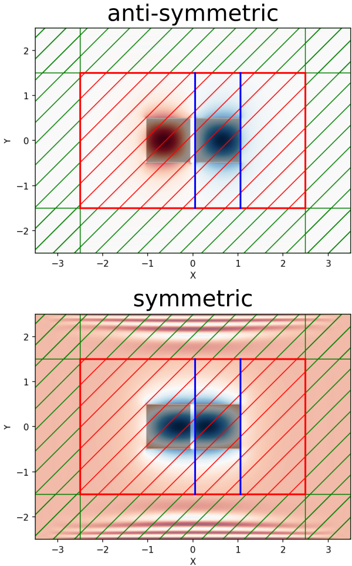

---
# Optical Forces
---

This tutorial demonstrates Meep's ability to compute classical forces via the [Maxwell stress tensor](https://en.wikipedia.org/wiki/Maxwell_stress_tensor). The geometry consists of two identical, parallel, silicon waveguides with square cross section in vacuum. A schematic of the geometry is shown below. Due to the parallel orientation of the waveguides (propagation axis along $z$ and separation in $x$), the two modes can be chosen to be either symmetric or anti-symmetric with respect to an $x$ mirror-symmetry plane between them. As the two waveguides are brought closer and closer together, their modes couple and give rise to a gradient force that is *transverse* to the waveguide axis (i.e., in the $x$ direction). This is different from [radiation pressure](https://en.wikipedia.org/wiki/Radiation_pressure) which involves momentum exchange between photons and is longitudinal in nature (i.e., along the $z$ direction). An interesting phenomena that occurs for this coupled waveguide system is that the force can be tuned to be either attractive or repulsive depending on the relative phase of the two modes. This tutorial will demonstrate this effect.

<center>

</center>

The gradient force $F$ on each waveguide arising from the evanescent coupling of the two waveguide modes can be computed analytically:

$$F=-\frac{1}{\omega}\frac{d\omega}{ds}\Bigg\vert_\vec{k}U$$

where $\omega$ is the mode frequency of the coupled waveguide system, $s$ is the separation distance between the parallel waveguides, $k$ is the conserved wave vector, and $U$ is the total energy of the electromagnetic fields. By convention, negative and positive values correspond to attractive and repulsive forces, respectively. For more details, see [Optics Letters, Vol. 30, pp. 3042-4, 2005](https://www.osapublishing.org/ol/abstract.cfm?uri=ol-30-22-3042). This expression has been shown to be mathematically equivalent to the Maxwell stress tensor in [Optics Express, Vol. 17, pp. 18116-35, 2009](http://www.opticsinfobase.org/oe/abstract.cfm?URI=oe-17-20-18116). We will verify this result in this tutorial. In this particular example, only the fundamental mode with odd mirror-symmetry in $y$ shows the bidirectional force.

It is convenient to [normalize the force](../Python_User_Interface.md#force-spectra) in order to work with [dimensionless quantities](../Introduction.md#units-in-meep). Since the total transmitted power in the waveguide per unit length is $P=v_gU/L$ where $v_g$ is the group velocity, $U$ is the total energy of the electromagnetic fields (same as before), and $L$ is the waveguide length, we focus instead on the force per unit length per unit power $(F/L)(ac/P)$ where $a$ is the waveguide width/height and $c$ is the speed of light. This dimensionless quantity can be computed in a single simulation.

The gradient force $F$ can be computed using two different methods: (1) using MPB, compute the frequency $\omega$ and group velocity $v_g$ for a given mode over a range of separation distances $s$ and then use a centered [finite-difference](https://en.wikipedia.org/wiki/Finite_difference) scheme to evaluate $F$ using the formula from above, and (2) using Meep, directly compute both the gradient force $F$ and the transmitted power $P$ over the same range of separation distances $s$. This tutorial verifies that (1) and (2) produce equivalent results.

The simulation script is in [examples/parallel-wvgs-force.py](https://github.com/NanoComp/meep/blob/master/python/examples/parallel-wvgs-force.py). The notebook is [examples/parallel-wvgs-force.ipynb](https://nbviewer.jupyter.org/github/NanoComp/meep/blob/master/python/examples/parallel-wvgs-force.ipynb).

The main component of the Meep script is the function `parallel_waveguide` which computes the force $F$ and transmitted power $P$ given the waveguide separation distance `s` and relative phase of the waveguide modes `xodd=True/False`. The eigenmode frequency $\omega$ is computed first using `get_eigenmode` in order to specify the frequency of the `add_force` and `add_flux` monitors. (Note that when `match_frequency=False`, `get_eigenmode` ignores the input `frequency` parameter.) An [`EigenModeSource`](../Python_User_Interface.md#eigenmodesource) with `eig_match_freq=False` is then used to launch the guided mode using a pulse (the `frequency` but not the `fwidth` parameter of `GaussianSource` is ignored). Alternatively, a constant-amplitude point/area source can be used to launch the mode but this is less efficient as demonstrated in [Tutorial/Eigenmode Source/Index-Guided Modes in a Ridge Waveguide](Eigenmode_Source.md#index-guided-modes-in-a-ridge-waveguide). The waveguide has width/height of $a=1$ μm and a fixed propagation wavevector of $\pi/a$.

```py
import meep as mp
import numpy as np
import matplotlib.pyplot as plt

resolution = 40   # pixels/μm
    
Si = mp.Medium(index=3.45)

dpml = 1.0
pml_layers = [mp.PML(dpml)]
    
sx = 5
sy = 3
cell = mp.Vector3(sx+2*dpml,sy+2*dpml,0)

a = 1.0     # waveguide width/height

k_point = mp.Vector3(z=0.5)

def parallel_waveguide(s,xodd):
    geometry = [mp.Block(center=mp.Vector3(-0.5*(s+a)),
                         size=mp.Vector3(a,a,mp.inf),
                         material=Si),
                mp.Block(center=mp.Vector3(0.5*(s+a)),
                         size=mp.Vector3(a,a,mp.inf),
                         material=Si)]

    symmetries = [mp.Mirror(mp.X, phase=-1 if xodd else 1),
                  mp.Mirror(mp.Y, phase=-1)]

    sim = mp.Simulation(resolution=resolution,
                        cell_size=cell,
                        geometry=geometry,
                        boundary_layers=pml_layers,
                        symmetries=symmetries,
                        k_point=k_point)

    sim.init_sim()
    EigenmodeData = sim.get_eigenmode(0.22,
                                      mp.Z,
                                      mp.Volume(center=mp.Vector3(), size=mp.Vector3(sx,sy)),
                                      2 if xodd else 1,
                                      k_point,
                                      match_frequency=False,
                                      parity=mp.ODD_Y)

    fcen = EigenmodeData.freq
    print("freq:, {}, {}, {}".format("xodd" if xodd else "xeven", s, fcen))

    sim.reset_meep()

    eig_sources = [mp.EigenModeSource(src=mp.GaussianSource(fcen, fwidth=0.1*fcen),
                                      size=mp.Vector3(sx,sy),
                                      center=mp.Vector3(),
                                      eig_band=2 if xodd else 1,
                                      eig_kpoint=k_point,
                                      eig_match_freq=False,
                                      eig_parity=mp.ODD_Y)]

    sim.change_sources(eig_sources)

    flux_reg = mp.FluxRegion(direction=mp.Z, center=mp.Vector3(), size=mp.Vector3(sx,sy))
    wvg_flux = sim.add_flux(fcen, 0, 1, flux_reg)

    force_reg1 = mp.ForceRegion(mp.Vector3(0.49*s), direction=mp.X, weight=1, size=mp.Vector3(y=sy))
    force_reg2 = mp.ForceRegion(mp.Vector3(0.5*s+1.01*a), direction=mp.X, weight=-1, size=mp.Vector3(y=sy))
    wvg_force = sim.add_force(fcen, 0, 1, force_reg1, force_reg2)

    sim.run(until_after_sources=1500)

    flux = mp.get_fluxes(wvg_flux)[0]
    force = mp.get_forces(wvg_force)[0]
    print("data:, {}, {}, {}, {}, {}".format("xodd" if xodd else "xeven", s, flux, force, -force/flux))

    sim.reset_meep()
    return flux, force
```

There are four important items to note: (1) a single flux surface is used to compute the Poynting flux in $z$ which spans the entire non-PML region of the cell. This is because in the limit of small waveguide separation distance, two separate flux surfaces for each waveguide would overlap and result in overcounting. The total power through a single flux surface need, by symmetry, only be halved in order to determine the value for a single waveguide. (2) Instead of defining a closed, four-sided "box" surrounding the waveguides, the Maxwell stress tensor is computed using just two line monitors oriented in $y$ (to obtain the force in the perpendicular $x$ direction) with `weight` values of `+1`/`-1` to correctly sum the total force. The force monitors are placed in the vacuum region adjacent to the waveguide rather than on its surface so that the fields are [second-order accurate](../Subpixel_Smoothing.md). By symmetry, the force in the $y$ direction is zero and need not be computed. (3) Since the `parity`/`eig_parity` parameter of `get_eigenmode`/`EigenModeSource` can only be specified using the $y$ and/or $z$ directions (but *not* $x$, the waveguide separation axis), the `band`/`eig_band` parameter must be set to `1`/`2` to distinguish modes with even/odd $x$-mirror symmetry.  (4) A 2d `cell_size` in $xy$ combined with a `k_point` containing a non-zero $z$ component results in a [2d simulation (which is the default)](../2d_Cell_Special_kz.md).

Note: the Maxwell stress tensor should generally be computed in vacuum because the photon momentum is not well defined within dielectric media (see [Abraham–Minkowski controversy](https://en.wikipedia.org/wiki/Abraham%E2%80%93Minkowski_controversy)).

In this example, the fields of the guided mode never decay away to zero. [Choosing a runtime](../FAQ.md#checking-convergence) is therefore somewhat arbitrary but requires some care. A sufficiently long runtime is necessary to obtain the [steady-state response](../FAQ.md#how-do-i-compute-the-steady-state-fields). However, an excessively long runtime will lead to large values for the Fourier-transformed fields used to compute both the flux and the Maxwell stress tensor. Large floating-point numbers may contain [roundoff errors](https://en.wikipedia.org/wiki/Round-off_error) and produce inaccurate results.

The simulation is run over the range of separation distances $s$ from 0.05 to 1.00 μm in increments of 0.05 μm. The results are compared with those from MPB. This is shown in the top figure. The two methods show good agreement.

```py
s = np.arange(0.05,1.05,0.05)
fluxes_odd = np.zeros(s.size)
forces_odd = np.zeros(s.size)
fluxes_even = np.zeros(s.size)
forces_even = np.zeros(s.size)

for k in range(len(s)):
    fluxes_odd[k], forces_odd[k] = parallel_waveguide(s[k],True)
    fluxes_even[k], forces_even[k] = parallel_waveguide(s[k],False)

plt.figure(dpi=150)
plt.plot(s,-forces_odd/fluxes_odd,'rs',label='anti-symmetric')
plt.plot(s,-forces_even/fluxes_even,'bo',label='symmetric')
plt.grid(True)
plt.xlabel('waveguide separation s/a')
plt.ylabel('optical force (F/L)(ac/P)')
plt.legend(loc='upper right')
plt.show()
```

The following figure shows the $E_y$ mode profiles at a waveguide separation distance of 0.1 μm. This figure was generated using the [`plot2D`](../Python_User_Interface.md#data-visualization) routine and shows the source and flux monitor (red hatches), force monitors (blue lines), and PMLs (green hatches) surrounding the cell. From the force spectra shown above, at this separation distance the anti-symmetric mode is repulsive whereas the symmetric mode is attractive.

<center>

</center>

The MPB simulation is in [examples/parallel-wvgs-mpb.py](https://github.com/NanoComp/meep/blob/master/python/examples/parallel-wvgs-mpb.py). There are important differences related to the coordinate dimensions between the MPB and Meep scripts. In the MPB script, the 2d cell is defined using the $yz$ plane, the waveguide propagation axis is $x$, and the waveguide separation axis is $y$. As a consequence, the `num_bands` parameter is always `1` since the $y$ parity of the mode can be defined explicitly (i.e., `run_yodd_zodd` vs. `run_yeven_zodd`). This is different from the Meep script since Meep requires that a 2d cell be defined in the $xy$ plane. MPB has no such requirement.

```py
import meep as mp
from meep import mpb
import numpy as np
import matplotlib.pyplot as plt

resolution = 128  # pixels/μm

Si = mp.Medium(index=3.45)

syz = 10
geometry_lattice = mp.Lattice(size=mp.Vector3(0,syz,syz))

k_points = [mp.Vector3(0.5)]

a = 1.0  # waveguide width

def parallel_waveguide(s,yodd):
    geometry = [mp.Block(center=mp.Vector3(0,-0.5*(s+a),0),
                         size=mp.Vector3(mp.inf,a,a),
                         material=Si),
                mp.Block(center=mp.Vector3(0,0.5*(s+a),0),
                         size=mp.Vector3(mp.inf,a,a),
                         material=Si)]

    ms = mpb.ModeSolver(resolution=resolution,
                        k_points=k_points,
                        geometry_lattice=geometry_lattice,
                        geometry=geometry,
                        num_bands=1,
                        tolerance=1e-9)

    if yodd:
        ms.run_yodd_zodd()
    else:
        ms.run_yeven_zodd()

    f = ms.get_freqs()[0]
    vg = ms.compute_group_velocity_component(mp.Vector3(1,0,0))[0]

    return f,vg

ss = np.arange(0.025,1.075,0.05)

f_odd = np.zeros(len(ss))
vg_odd = np.zeros(len(ss))
f_even = np.zeros(len(ss))
vg_even = np.zeros(len(ss))

for j in range(len(ss)):
    f_odd[j], vg_odd[j] = parallel_waveguide(ss[j],True)
    f_even[j], vg_even[j] = parallel_waveguide(ss[j],False)

ds = ss[1]-ss[0]

def compute_force(f,vg):
    f_avg = 0.5*(f[:-1]+f[1:])
    df = f[1:]-f[:-1]
    vg_avg = 0.5*(vg[:-1]+vg[1:])
    return -1/f_avg * df/ds * 1/vg_avg

force_odd = compute_force(f_odd,vg_odd)
force_even = compute_force(f_even,vg_even)

plt.figure(dpi=200)
plt.plot(ss[:-1],force_odd,'b-',label='anti-symmetric')
plt.plot(ss[:-1],force_even,'r-',label='symmetric')
plt.xlabel("waveguide separation s/a")
plt.ylabel("optical force (F/L)(ac/P)")
plt.legend(loc='upper right')
plt.xticks(np.arange(0,1.2,0.2))
plt.yticks(np.arange(-1.5,1.0,0.5))
plt.show()
```
