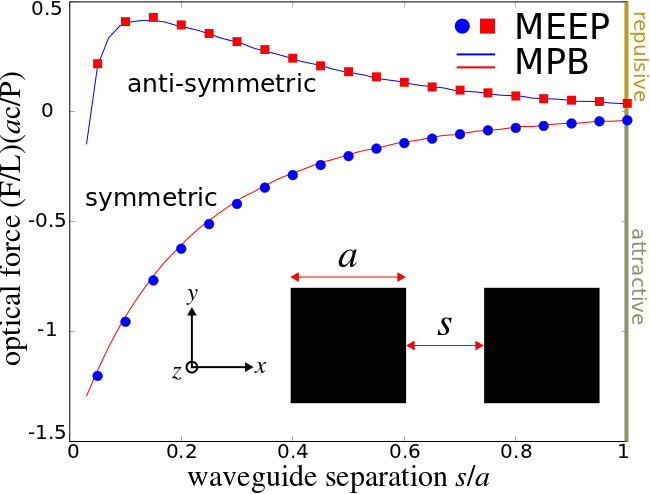

---
# Optical Forces
---

This tutorial demonstrates Meep's ability to compute classical forces via the [Maxwell stress tensor](https://en.wikipedia.org/wiki/Maxwell_stress_tensor) (MST). Also demonstrated is the [eigenmode source](../Python_User_Interface.md#eigenmodesource). The geometry consists of two identical, parallel, silicon waveguides with square cross section in vacuum. A schematic of the geometry is shown below. Due to the parallel orientation of the waveguides, the two modes can be chosen to be either symmetric or anti-symmetric with respect to a mirror-symmetry plane between them. As the two waveguides are brought closer and closer together, their modes increasingly couple and give rise to a gradient force that is *transverse* to the waveguide axis. This is different from [radiation pressure](https://en.wikipedia.org/wiki/Radiation_pressure) which involves momentum exchange between photons and is *longitudinal* in nature. An interesting phenomena that occurs for this coupled system is that the force can be tuned to be either attractive or repulsive depending on the relative phase of the modes. We will demonstrate this effect in this tutorial.

<center>

</center>

The gradient force on each waveguide arising from the evanescent coupling of the two waveguide modes can be computed analytically:

$$F=-\frac{1}{\omega}\frac{d\omega}{ds}\Bigg\vert_\vec{k}U,$$

where ω is the mode frequency of the coupled-waveguide system, $s$ is the separation distance between the parallel waveguides, $k$ is the conserved wave vector and $U$ is the total energy of the electromagnetic fields. By convention, negative and positive values correspond to attractive and repulsive forces, respectively. For more details, see [Optics Letters, Vol. 30, pp. 3042-4, 2005](https://www.osapublishing.org/ol/abstract.cfm?uri=ol-30-22-3042). This expression has been shown to be mathematically equivalent to the MST in [Optics Express, Vol. 17, pp. 18116-35, 2009](http://www.opticsinfobase.org/oe/abstract.cfm?URI=oe-17-20-18116). We will verify this result in this tutorial.

It is convenient to normalize the force in order to work with dimensionless quantities. Since the total power transmitted through the waveguide is $P=v_gU/L$ where $v_g$ is the group velocity, $L$ is the waveguide length, and $U$ is defined as before, we focus instead on the force per unit length per unit power $(F/L)(ac/P)$ where $a$ is the waveguide width and $c$ is the speed of light. This dimensionless quantity enables us to compute both the flux and the force in a single simulation.

We can compute the gradient force using two different methods and verify that they are equivalent: (1) using MPB, we compute the frequency and group velocity for a given mode over a range of separation distances and then use a [finite-difference](https://en.wikipedia.org/wiki/Finite_difference) scheme to numerically evaluate the formula from above, and (2) using Meep, we directly compute both the gradient force and the power transmitted through the waveguide for the guided mode over the same range of separation distances. In this particular example, we consider just the fundamental `ODD_Y` mode which shows the bidirectional force. The range of separation distances is from 0.02 to 1.02 μm in increments of 0.02 μm.

The simulation script is in [examples/parallel-wvgs-force.py](https://github.com/stevengj/meep/blob/master/python/examples/parallel-wvgs-force.py).

The Meep script begins with defining the necessary modules:

```py
import meep as mp
import argparse

def main(args):
```

Next we set up the computational cell. The waveguide cross section is 2d but since we are interested in a guided mode of the structure which requires specifying the axial or out-of-plane wavevector, this will in fact be a 3d calculation.

```py
    resolution = 30   # pixels/μm
    
    Si = mp.Medium(index=3.45)

    dpml = 1.0
    pml_layers = [mp.PML(dpml)]
    
    sx = 5
    sy = 3
    cell = mp.Vector3(sx+2*dpml,sy+2*dpml,0)

    a = 1.0     # waveguide width
    s = args.s  # waveguide separation distance

    geometry = [mp.Block(center=mp.Vector3(-0.5*(s+a)),
                         size=mp.Vector3(a,a,mp.inf),
                         material=Si),
                mp.Block(center=mp.Vector3(0.5*(s+a)),
                         size=mp.Vector3(a,a,mp.inf),
                         material=Si)]
```

Two mirror symmetries can be used to reduce the size of the computational cell by a factor of four:

```py
    xodd = args.xodd
    symmetries = [mp.Mirror(mp.X, phase=-1.0 if xodd else 1.0),
                  mp.Mirror(mp.Y, phase=-1.0)]
```

Next, we set the Bloch-periodic boundary condition for the mode with wavevector π/$a$:

```py
    k_point = mp.Vector3(z=0.5)
```

Since we do not know apriori what the mode frequency is for a given waveguide separation distance, a preliminary run is required to find this out using [`Harminv`](../Python_User_Interface.md#harminv) and a broadband pulsed source. Since the propagating mode never decays away, the runtime is chosen arbitrarily as 200 time units after the pulsed sources have turned off.

```py
    fcen = 0.22
    df = 0.06
    sources = [mp.Source(src=mp.GaussianSource(fcen, fwidth=df),
                         component=mp.Ey,
                         center=mp.Vector3(-0.5*(s+a)),
                         size=mp.Vector3(a,a)),
               mp.Source(src=mp.GaussianSource(fcen, fwidth=df),
                         component=mp.Ey,
                         center=mp.Vector3(0.5*(s+a)),
                         size=mp.Vector3(a,a),
                         amplitude=-1.0 if xodd else 1.0)]

    sim = mp.Simulation(resolution=resolution,
                        cell_size=cell,
                        boundary_layers=pml_layers,
                        geometry=geometry,
                        symmetries=symmetries,
                        k_point=k_point,
                        sources=sources)

    h = mp.Harminv(mp.Ey, mp.Vector3(0.5*(s+a)), fcen, df)

    sim.run(mp.after_sources(h), until_after_sources=200)

    f = h.modes[0].freq
    print("freq:, {}, {}".format(s, f))
```

Once we have determined the mode frequency, we then replace the `Source` with [`EigenModeSource`](../Python_User_Interface.md#eigenmodesource) to perform the main simulation: compute (1) the force on each waveguide due to the mode coupling and (2) the power in the mode. The `EigenModeSource` invokes [MPB](https://mpb.readthedocs.io) to compute the given mode of interest. The mode profile is then imported into Meep for use as the initial source amplitude. This enables a more efficient mode excitation than simply using a point or area source with constant amplitude. For more details on the eigenmode source feature, refer to Section 4.2 ("Incident Fields and Equivalent Currents") in [Chapter 4](http://arxiv.org/abs/arXiv:1301.5366) ("Electromagnetic Wave Source Conditions") of the book [Advances in FDTD Computational Electrodynamics: Photonics and Nanotechnology](https://www.amazon.com/Advances-FDTD-Computational-Electrodynamics-Nanotechnology/dp/1608071707).

```py
    sim.reset_meep()
    
    eig_sources = [mp.EigenModeSource(src=mp.GaussianSource(f, fwidth=df),
                                      size=mp.Vector3(a,a),
                                      center=mp.Vector3(-0.5*(s+a)),
                                      eig_kpoint=k_point,
                                      eig_match_freq=True,
                                      eig_parity=mp.ODD_Y),
                   mp.EigenModeSource(src=mp.GaussianSource(f, fwidth=df),
                                      size=mp.Vector3(a,a),
                                      center=mp.Vector3(0.5*(s+a)),
                                      eig_kpoint=k_point,
                                      eig_match_freq=True,
                                      eig_parity=mp.ODD_Y,
                                      amplitude=-1.0 if xodd else 1.0)]

    sim.change_sources(eig_sources)

    flux_reg = mp.FluxRegion(direction=mp.Z, center=mp.Vector3(), size=mp.Vector3(1.2*(2*a+s),1.2*a))
    wvg_flux = sim.add_flux(f, 0, 1, flux_reg)

    force_reg1 = mp.ForceRegion(mp.Vector3(0.5*s), direction=mp.X, weight=1.0, size=mp.Vector3(y=a))
    force_reg2 = mp.ForceRegion(mp.Vector3(0.5*s+a), direction=mp.X, weight=-1.0, size=mp.Vector3(y=a))
    wvg_force = sim.add_force(f, 0, 1, force_reg1, force_reg2)

    sim.run(until_after_sources=5000)

    sim.display_fluxes(wvg_flux)
    sim.display_forces(wvg_force)

if __name__ == '__main__':
    parser = argparse.ArgumentParser()
    parser.add_argument('-xodd', default=False, action='store_true', help='odd mirror symmetry in X direction? (default: False)')
    parser.add_argument('-s', type=float, default=1.0, help='waveguide separation distance (default: 1.0 um)')
    args = parser.parse_args()
    main(args)
```

There are two important items to note in the script: (1) We have defined a single flux surface to compute the Poynting flux in $z$ which spans an area slightly larger than both waveguides rather than two separate flux surfaces (one for each waveguide). This is because in the limit of small separation, two flux surfaces overlap whereas the total power through a single flux surface need, by symmetry, only be halved in order to determine the value for just one of the two waveguides. (2) Instead of defining a closed, four-sided "box" surrounding the waveguides for computing the MST, we chose instead to compute the MST along just two $y$-oriented lines (to obtain the force in the $x$ direction) with different `weight` values to correctly sum the total force. By symmetry, we need not consider the force in the $y$ direction. Choosing a suitable runtime requires some care. A large runtime is necessary to obtain the steady-state response but this will also lead to large values for the discrete Fourier-transformed fields used to compute both the flux and the MST. These large values may contain [roundoff errors](https://en.wikipedia.org/wiki/Round-off_error).

We run this simulation over the range of separation distances and compare the results to those obtained from MPB. This is shown in the figure above. The two methods show good agreement.

The combined MPB simulation and plotting script is in [examples/parallel-wvgs-mpb.py](https://github.com/stevengj/meep/blob/master/python/examples/parallel-wvgs-mpb.py). Note: since MPB permits symmetries only in the $y$ and $z$ directions, the coordinate axes used in the MPB script to define the waveguide geometry are different than those in the Meep script. In MPB, the propagating axis is $x$ whereas in Meep it is $z$.

```py
import meep as mp
from meep import mpb
import numpy as np
import matplotlib.pyplot as plt

resolution = 128  # pixels/μm

Si = mp.Medium(index=3.45)

syz = 10
geometry_lattice = mp.Lattice(size=mp.Vector3(0,syz,syz))

k_points = [mp.Vector3(0.5)]

num_bands = 1
tolerance = 1e-9

a = 1.0  # waveguide width

def parallel_waveguide(s,yodd):
    geometry = [mp.Block(center=mp.Vector3(0,-0.5*(s+a),0),
                         size=mp.Vector3(mp.inf,a,a),
                         material=Si),
                mp.Block(center=mp.Vector3(0,0.5*(s+a),0),
                         size=mp.Vector3(mp.inf,a,a),
                         material=Si)]

    ms = mpb.ModeSolver(resolution=resolution,
                        k_points=k_points,
                        geometry_lattice=geometry_lattice,
                        geometry=geometry,
                        num_bands=num_bands,
                        tolerance=tolerance)

    if yodd:
        ms.run_yodd_zodd()
    else:
        ms.run_yeven_zodd()

    f = ms.get_freqs()[0]
    vg = ms.compute_group_velocity_component(mp.Vector3(1,0,0))[0]

    return f,vg

ss = np.arange(0.1,1.2,0.2)

f_odd = np.zeros(len(ss))
vg_odd = np.zeros(len(ss))
f_even = np.zeros(len(ss))
vg_even = np.zeros(len(ss))

for j in range(len(ss)):
    f_odd[j], vg_odd[j] = parallel_waveguide(ss[j],True)
    f_even[j], vg_even[j] = parallel_waveguide(ss[j],False)

ds = ss[1]-ss[0]

def compute_force(f,vg):
    f_avg = 0.5*(f[:-1]+f[1:])
    df = f[1:]-f[:-1]
    vg_avg = 0.5*(vg[:-1]+vg[1:])
    return np.multiply(np.multiply(-1/f_avg,df/ds), 1/vg_avg)

force_odd = compute_force(f_odd,vg_odd)
force_even = compute_force(f_even,vg_even)

plt.plot(ss[:-1],force_odd,'b-',label='antisymmetric')
plt.plot(ss[:-1],force_even,'r-',label='symmetric')
plt.xlabel("waveguide separation s/a")
plt.ylabel("optical force (F/L)(ac/P)")
plt.legend(loc='upper right')
plt.xticks(np.arange(0,1.2,0.2))
plt.yticks(np.arange(-1.5,1.0,0.5))
plt.show()
```
