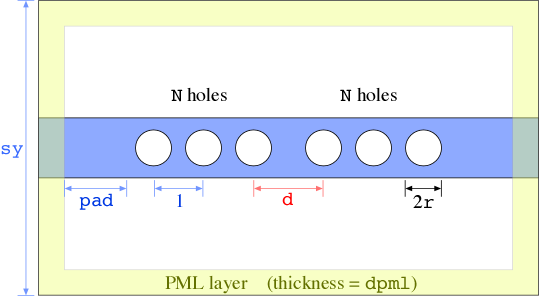
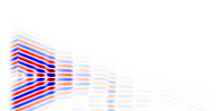
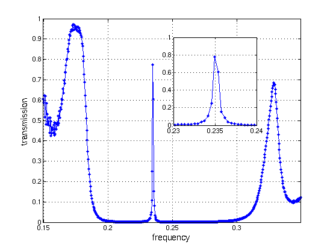
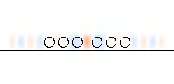
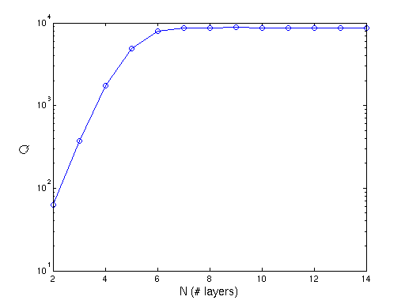
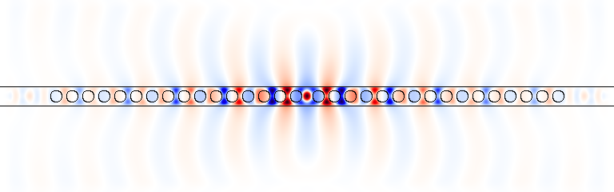
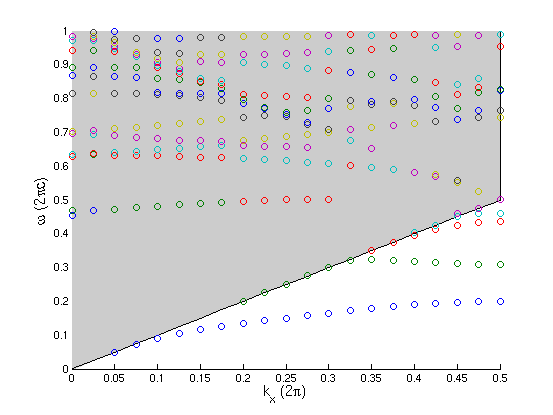
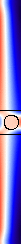

---
# Band Diagram, Resonant Modes, and Transmission of a Waveguide Cavity
---

In this example, we will consider the 2d structure shown below, which is based on a system considered in Chapter 7 of [Photonic Crystals: Molding the Flow of Light (second edition)](http://ab-initio.mit.edu/book). In particular, there are three basic ideas behind this structure, which we briefly summarize.

<center>

</center>

First, by taking a dielectric wavgeuide and perforating it with a periodic sequence of holes, we form a kind of **photonic crystal**: there are still index-guided modes propagating losslessly down the periodic waveguide, but there is also a partial photonic band gap: a range of frequencies in which *no guided modes* exist.

Second, by making a *defect* in the periodic sequence, in this case by separating one pair of holes by a greater amount, we can trap a **resonant cavity mode**: it is localized along the waveguide direction by the band gap, and partially in the transverse direction by index guiding. Because there is no complete gap, however, the mode has some intrinsic radiative losses: even with infinitely many holes/periods, it leaks away slowly into the surrounding air.

Third, by combining several structures in sequence &mdash; ordinary waveguide with no holes, periodic structure, defect, periodic structure, waveguide &mdash; we can make a **filter**. See Chapter 10 of [Photonic Crystals: Molding the Flow of Light (second edition)](http://ab-initio.mit.edu/book). In particular, because there is now a finite number of holes, the resonant mode can now leak into the waveguide as well as to the surrounding air. Then, input light from the waveguide at the resonance frequency undergoes resonant coupling, and is transmitted to the other side with a Lorentzian transmission spectrum. In the limit where the resonant mode couples much more strongly with the waveguide than the air (i.e. if there are not too many holes and the radiative leakage is slow), then in a symmetric structure we should get 100% transmission on resonance, forming a narrow-band filter.

In the following, we will analyze the structure in exactly the opposite order of what we really should do. Really, we should analyze the periodic system first to understand the band gap, then analyze the resonant mode, and finally analyze the transmission spectrum. Since all of those calculations have already been done (see the reference in the book), however, we can jump straight to the transmission spectrum (which is conceptually the easiest computation to understand) and work backwards.

See also [holey-wvg-cavity.py](https://github.com/stevengj/meep/blob/master/python/examples/holey-wvg-cavity.py) and [holey-wvg-bands.py](https://github.com/stevengj/meep/blob/master/python/examples/holey-wvg-bands.py) which contain the commands below.

[TOC]

Transmission Spectrum
---------------------

To calculate the transmission spectrum, much as in the bend example in [Tutorial/Basics](Basics.md), we'll measure the flux spectrum at one end of the waveguide from a source at the other end, normalized by the flux from a case with no holes in the waveguide. First, we'll load the necessary modules which will enable passing parameters from the command line:

```py
import meep as mp
import argparse

def main(args):
```

Next, we'll define some parameters of our structure as in the figure above. All lengths are in units of microns (μm). The periodicity of the photonic crystal is 1 μm.

```py
eps = 13          # dielectric constant of waveguide
w = 1.2           # width of waveguide
r = 0.36          # radius of holes
d = 1.4           # defect spacing (ordinary spacing = 1)
N = args.N        # number of holes on either side of defect

sy = args.sy      # size of cell in y direction (perpendicular to wvg.)
pad = 2           # padding between last hole and PML edge
dpml = 1          # PML thickness

resolution = 20
```

Given these parameters, the size of the cell in the $X$ direction, which we'll denote `sx`, is given by:

```py
sx = 2*(pad + dpml + N) + d - 1  # size of cell in x direction
```

Now, the computational cell is:

```py
cell = mp.Vector3(sx, sy, 0)
```

The `geometry` will consist of a single `Block` for the waveguide, and `2N` cylindrical holes:

```py
blk = mp.Block(size=mp.Vector3(1e20, w, 1e20), material=mp.Medium(epsilon=eps))
geometry = [blk]

for i in range(N):
    geometry.append(mp.Cylinder(r, center=mp.Vector3(d / 2 + i)))
    geometry.append(mp.Cylinder(r, center=mp.Vector3(-(d / 2 + i))))
```

To create the holes, we have used a `for` loop. Note that the geometry objects are combined using the `append` function. As usual, later objects in `geometry` take precedence over earlier objects, so the `Cylinder` objects will punch holes through the `Block`.

The absorbing boundaries surrounding the computational cell are:

```py
pml_layers = [mp.PML(1.0)]
```

Now, we'll define a couple of parameters to determine the frequency range to investigate. We already know from our calculation below that this structure has a $H_z$-polarized band gap for frequencies in the range 0.2 to 0.3, so we'll want to cover this interval.

```py
fcen = args.fcen   # pulse center frequency
df = args.df       # pulse frequency width
```

The source will now be the usual Gaussian pulse centered at `fcen`, located at one edge of the cell just outside the PML, at `x = - 0.5 * sx + dpml`. Ideally, we would excite exactly the fundamental mode of the waveguide, but it is good enough to just excite it with a line source. Moreover, since we are interested in the $P$ polarization (electric field in the plane), we will excite it with a $J_y$ current source (transverse to the propagation direction), which is specified as `Ey`:

```py
src = [mp.Source(mp.GaussianSource(fcen, fwidth=df), mp.Ey,
                 mp.Vector3(-0.5 * sx + dpml), size=mp.Vector3(0, w))]
```

The structure has mirror symmetry planes through the $X$ and $Y$ axes. The source breaks the mirror symmetry through the $Y$ axis, but we still have *odd* mirror symmetry through the $Z$ axis:

```py
sym = [mp.Mirror(mp.Y, phase=-1)]
```

Note that we specify the plane by its normal, the $Y$ direction. See also [Exploiting Symmetry](../Exploiting_Symmetry.md). Putting all these objects together via the `Simulation` object:

```py
sim = mp.Simulation(cell_size=cell,
                    geometry=geometry,
                    boundary_layers=pml_layers,
                    sources=src,
                    symmetries=sym,
                    resolution=resolution)
```

Finally, we need to [compute the flux spectrum](../Introduction.md#transmittancereflectance-spectra) at the other end of the computational cell, after the holes but before the PML:

```py
freg = mp.FluxRegion(center=mp.Vector3(0.5 * sx - dpml - 0.5),
                     size=mp.Vector3(0, 2 * w))

nfreq = 500 # number of frequencies at which to compute flux

# transmitted flux
trans = sim.add_flux(fcen, df, nfreq, freg)
```

Now, we can run the simulation until the sources have finished plus some additional time to allow the fields to propagate through the structure. As in [Tutorial/Basics](Basics.md), we'll use `stop_when_fields_decayed` to increment the time in steps of 50 time units (about 13 periods) until $|E_y|^2$ has decayed by at least 1/1000 at the transmission-flux plane.

```py
vol = mp.Volume(mp.Vector3(0), size=mp.Vector3(sx))

sim.run(mp.at_beginning(mp.output_epsilon),
        mp.during_sources(mp.in_volume(vol, mp.to_appended("hz-slice", mp.at_every(0.4, mp.output_hfield_z)))),
        until_after_sources=mp.stop_when_fields_decayed(50, mp.Ey, mp.Vector3((0.5 * sx) - dpml - 0.5, 0), 1e-3))

sim.display_fluxes(trans)  # print out the flux spectrum
```

Note that we've outputted ε at the beginning &mdash; this is always a good idea, to make sure the structure is what you think it is! We have also outputted the $H_z$ field in a $y=0$ slice, every 0.4 time units (about ten times per period) while the source is on, to a single file with time as the second dimension, just as in [Tutorial/Basics](Basics.md).

Finally, we specify all the command-line parameters with default values via [argparse](https://docs.python.org/3/library/argparse.html):

```py
if __name__ == '__main__':
    parser = argparse.ArgumentParser()
    parser.add_argument('-N', type=int, default=3, help='number of holes on either side of defect')
    parser.add_argument('-sy', type=int, default=6, help='size of cell in y direction (perpendicular to wvg.)')
    parser.add_argument('-fcen', type=float, default=0.25, help='pulse center frequency')
    parser.add_argument('-df', type=float, default=0.2, help='pulse frequency width')
    args = parser.parse_args()
    main(args)
```

Now, we launch the simulation:

```sh
unix% python holey-wvg-cavity.py | tee holey-wvg-cavity.out
```

which takes a few seconds as we need to wait for the cavity mode to decay away. We can plot the dielectric function and $H_z$ field pattern via `h5topng`:

```sh
unix% h5topng holey-wvg-cavity-eps-000000.00.h5
unix% h5topng -Zc dkbluered holey-wvg-cavity-hz-slice.h5
```

<center>



</center>

The $H_z$ slice in which time = vertical is interesting, because we can see the pulse propagating to the right, bouncing off of the holes, and also exciting a resonant mode in the cavity that sits in the center for a long time as it starts slowly leaking to the right.

Of course, the main point of this section is to get the quantitative transmission spectrum. To do this, we need to normalize our flux by running the simulation with no holes:

```sh
unix% python holey-wvg-cavity.py -N 0 | tee holey-wvg-cavity0.out
```

which completes a lot more quickly because there is no resonant mode. We then `grep` for the flux as in [Tutorial/Basics](Basics.md#transmission-spectrum-of-a-waveguide-bend), giving us comma-delimited text which is the frequency and fluxes:

```sh
unix% grep flux1: holey-wvg-cavity.out > flux.dat
unix% grep flux1: holey-wvg-cavity0.out > flux0.dat
```

which we then import into our plotting program, divide the two fluxes, and get:

<center>

</center>

The band gap is clearly visible as the range of very low transmission, and in the middle of the band gap is a sharp peak corresponding to the resonant mode trapped in the defect. The inset enlarges this peak, and shows that we didn't use quite enough frequency points to capture the whole shape although we could fit to a Lorentzian if we wanted. At the edges of the band gaps, the transmission goes up in broad Fabry-Perot resonance peaks which we will examine in more detail below. There is also some high-frequency oscillation visible at the left of the plot, which is a numerical artifact due to our pulse not having enough amplitude in that range.

The narrower the resonance peak (higher $Q$), the harder this sort of direct transmission simulation is to perform &mdash; because of the Fourier uncertainty principle, we need to run for a time inversely related to the frequency resolution we would like to obtain. Fortunately, there is a much better way to study high-$Q$ resonances, as described in the next section. See also [Tutorial/Basics/Modes of a Ring Resonator](Basics.md#modes-of-a-ring-resonator).

Resonant Modes
--------------

To study high-$Q$ (long lifetime) resonant modes, it is much more efficient to excite them directly, placing a source inside the cavity, and analyze the resulting fields to obtain the frequencies and lifetimes of the modes. Here, we do precisely that for the above structure. See also [Tutorial/Basics/Modes of a Ring Resonator](Basics.md#modes-of-a-ring-resonator) and the [Introduction](../Introduction.md#resonant-modes).

The structure is exactly the same as above, and only the sources and analysis are different. Because of that, we use the same [holey-wvg-cavity.py](https://github.com/stevengj/meep/blob/master/python/examples/holey-wvg-cavity.py) input file for *both* calculations, and select between the two with an `if` statement controlled by a `-r` or `--resonant_modes` command-line parameter:

```py
if args.resonant_modes:
   ...new sources and run command...
else:  
   ...sources and run from above, to get spectrum...
```

The new source is still a Gaussian, but is now a point source at the origin:

```py
src = [mp.Source(mp.GaussianSource(fcen, fwidth=df), mp.Hz, mp.Vector3(0))]
```

Moreover, we are now using a *magnetic* current oriented in the $z$ direction ($H_z$). This source matches the symmetry of the $H_z$-polarized resonant mode that we are looking for. If we didn't know in advance what symmetry we were looking for, we would put the source off-center in a non-symmetric location, which would excite *all* modes regardless of symmetry. However, in many cases the symmetry is known, and placing a symmetric source allows us to limit the number of modes we excite and also to exploit the fact that we now have *two* mirror symmetry planes in this problem, saving us a factor of *four* in computation:

```py
sym = [mp.Mirror(mp.Y, phase=-1), mp.Mirror(mp.X, phase=-1)]
```

Here, you may notice a strange thing: we have specified `phase=-1` for both mirror planes corresponding to *odd* symmetry. However, it may seem at first glance that an $H_z$ dipole at the origin has *even* symmetry! The subtlety here is that the magnetic field is a [pseudovector](https://en.wikipedia.org/wiki/pseudovector), and is multiplied by $-1$ under mirror flips, so it is odd when it looks even and vice versa. We aren't just being pedantic here &mdash; if you don't realize the difference between vectors, such as electric fields and currents, and pseudovectors, such as magnetic fields and currents, then you will have endless confusion because the electric and magnetic fields will *seem* to have different symmetry. See also [Exploiting Symmetry](../Exploiting_Symmetry.md).

Finally, we can begin the time stepping:

```py
sim.run(mp.at_beginning(mp.output_epsilon),
        mp.after_sources(mp.Harminv(mp.Hz, mp.Vector3(), fcen, df)),
        until_after_sources=400)

sim.run(mp.at_every(1 / fcen / 20, mp.output_hfield_z), until=1 / fcen)
```

Just as in [Tutorial/Basics/Modes of a Ring Resonator](Basics.md#modes-of-a-ring-resonator), we use the `harminv` command (which calls [Harminv](https://github.com/stevengj/harminv)) to analyze the response at a point (here the $H_z$ field at the origin) for some time after the source has turned off. At the end, we also output the $H_z$ field for one period, to help us visualize the field below.

We can now launch the simulation, setting the `-r` command-line parameter to do the resonant-mode calculation:

```sh
unix% python holey-wvg-cavity.py -r
```

Inspecting the output, we see that it finds a single resonant mode in the gap:

```
harminv0:, frequency, imag. freq., Q, |amp|, amplitude, error
harminv0:, 0.235109393214226, -3.14979827803982e-4, 373.213413146792, 9.44684723593584, 6.69397286173395-6.66585703608155i, 3.35873386748359e-9
```

Because it was a single high-$Q$ mode, this mode should be all that we have left at the end of the simulation:

```sh
unix% h5topng -RZc dkbluered -C holey-wvg-cavity-eps-000000.00.h5 holey-wvg-cavity-hz-*.h5
unix% convert holey-wvg-cavity-hz-*.png holey-wvg-cavity-hz.gif
```

<center>

</center>

The mode has a frequency of 0.235, just as we saw in the transmission spectrum, and a $Q$ of 373 which we could have also found by fitting the transmission spectrum. This lifetime $Q$ includes two independent decay channels: light can decay from the cavity into the waveguide with lifetime $Q_w$, or it can radiate from the cavity into the surrounding air with lifetime $Q_r$, where 

$$\frac{1}{Q} = \frac{1}{Q_w} + \frac{1}{Q_r}$$

See Chapter 10 of [Photonic Crystals: Molding the Flow of Light (second edition)](http://ab-initio.mit.edu/book) for more details. There are a variety of ways to separate out the two decay channels. For example, we can look at the power radiated in different directions. Here, we'll just increase the number `N` of holes and see what happens &mdash; as we increase `N`, $Q_w$ should increase exponentially while $Q_r$ remains roughly fixed, so that $Q$ eventually saturates at $Q_r$.

```sh
unix% python holey-wvg-cavity.py -r -N 4 |grep harminv
unix% python holey-wvg-cavity.py -r -N 5 |grep harminv
...
```

<center>

</center>

The results, shown above, are exactly what we expected: at first, an exponential increase of $Q$ with `N`, and then a saturation at $Q_r \approx 8750$. However, when we look at the Harminv output for larger `N`, something strange happens &mdash; it starts to find *more modes*! For example, at `N=16`, the output is:

```
harminv0:, frequency, imag. freq., Q, |amp|, amplitude, error
harminv0:, 0.235201161007777, -1.34327185513047e-5, 8754.78631184943, 9.83220617825986, 6.83285024080876-7.06996717944934i, 3.03237056700397e-9
harminv0:, 0.328227374843021, -4.6405752015136e-4, 353.649451404175, 0.134284355228178, -0.131856646632894-0.0254187489419837i, 4.11557526694386e-7
```

What is this extra mode at $ω=0.32823$? This is right around the **edge of the band gap** (actually, just above the edge). There are two possibilities. First, it could be a *band edge* state: the propagating states in the periodic waveguide go to zero group velocity as they approach the edge of the gap, corresponding to long-lived resonances in a long but finite crystal. Second, it could be a higher-order resonant mode that for a slightly larger defect will be pulled further into the gap, but is currently very delocalized. In this case, it turns out to be the latter. To see the mode, we will simply run the simulation again with a narrow-band source, and we will also increase the $y$ cell size `sy` because it turns out that the mode is fairly spread out in that direction:

```sh
unix% python holey-wvg-cavity.py -r -sy 12 -fcen 0.328227374843021 -df 0.01 -N 16
```

<center>

</center>

From the image, the field is clearly localized around the defect in the center as opposed to being spread out evenly in the crystal like a band-edge state would be. In the defect, the pattern is higher order than the previous mode. It has an extra pair of nodes in the $y$ direction.

Band Diagram
------------

Finally, we consider a smaller, more abstract calculation that we really should have done first. In particular, we compute the **band diagram** of the infinite periodic waveguide by itself with no defects. The structure is shown below. This is very similar to the types of calculations that [MPB](https://mpb.readthedocs.io) performs, but with a different method that has its own strengths and weaknesses. By analyzing what solutions can propagate in the periodic structure, one gains fundamental insight into the aperiodic structures above.

<center>

</center>

Let us briefly review the problem. In a periodic system of this sort, the eigen-solutions can be expressed in the form of *Bloch modes*: a periodic *Bloch envelope* multiplied by a planewave $\exp[i(\mathbf{k}\cdot\mathbf{x}-ω t)]$, where **k** is the *Bloch wavevector*. We wish to find the *bands* $ω(\mathbf{k})$. In this case, there is only *one* direction of periodicity, so we only have one wavevector component $k_x$. Moreover, the solutions are periodic functions of this wavevector: for a unit-period structure, $k_x$ and $k_x+2\pi$ are redundant. Also, $k_x$ and $-k_x$ are redundant by time-reversal symmetry, so we only need to look for solutions in the *irreducible Brillouin zone* from $k_x=0$ to $k_x=\pi$.

Solving for these eigenmodes is very similar to solving for the resonant modes of a cavity. We put in a pulse and analyze the response via [Harminv](https://github.com/stevengj/harminv) except that our computational cell and boundary conditions are different. In particular, our computational cell is simply the *unit cell* of the periodicity, shown above. The ε function then obeys periodic boundary conditions, but the *fields* obey **Bloch-periodic** boundary conditions: the fields at the right side are $\exp(i k_x \cdot 1)$ times the fields at the left side. For each $k_x$, we will do a *separate* computation to get the frequencies at that $k_x$.

Thus, we will define our computational cell as follows.

```py
# Some parameters to describe the geometry:
eps = 13    # dielectric constant of waveguide
w = 1.2     # width of waveguide
r = 0.36    # radius of holes

# The cell dimensions
sy = 12     # size of cell in y direction (perpendicular to wvg.)
dpml = 1    # PML thickness (y direction only!)
cell = mp.Vector3(1, sy)

b = mp.Block(size=mp.Vector3(1e20, w, 1e20), material=mp.Medium(epsilon=eps))
c = mp.Cylinder(radius=r)

resolution=20
```

Note that our cell is now size `1` in the $x$ direction, and there is no need for any loops to duplicate the geometry. We just have a single air hole in the unit cell. The PML absorbing boundaries have something new:

```py
pml_layers = mp.PML(dpml, direction=mp.Y)
```

Since our structure is periodic, we don't want any absorbing layers in the $x$ direction: adding `direction=mp.Y` just specifies PML layers on the $y$ boundaries.

As before, our source will be a Gaussian pulse from an $H_z$ point source:

```py
fcen = 0.25  # pulse center frequency
df = 1.5     # pulse freq. width: large df = short impulse

s = mp.Source(src=mp.GaussianSource(fcen, fwidth=df), component=mp.Hz,
              center=mp.Vector3(0.1234,0))
```

Notice that we put our source at $(0.1234,0)$. The $x$ coordinate is random, to help ensure that the source will couple to an arbitrary mode, but the $y$ coordinate is 0. This means that we will only be looking at $H_z$-polarized *odd*-symmetry modes (recalling the pseudovector subtlety discussed above). As usually, we will exploit this via:

```py
sym = mp.Mirror(direction=mp.Y, phase=-1)
```

Note that, regardless of the source, we don't have an $X$ symmetry plane because this symmetry is broken by our boundary condition for $0 < k_x < \pi$. Now, there are two ways to proceed. First, we could set the value of $\mathbf{k}$ via the `k_point` variable, and then use `until_after_sources` with `Harminv` just as we did to calculate a resonant mode:

```py
kx = 0.4
sim.k_point = mp.Vector3(kx)

sim.run(mp.at_beginning(mp.output_epsilon),
        mp.after_sources(mp.Harminv(mp.Hz, mp.Vector3(0.1234), fcen, df)),
        until_after_sources=300)

sim.run(mp.at_every(1 / fcen / 20, mp.output_hfield_z), until=1 / fcen)
```

which would give us the frequencies at a single $\mathbf{k} = 0.4 \cdot 2\pi \hat{\mathbf{x}}$. For visualization purposes, we also run for one cycle after the Harminv calculation and output the $H_z$ fields at 20 equally spaced time intervals. Note that, in Meep, $\mathbf{k}$ is specified as a vector in Cartesian coordinates, with units of 2π/distance. This is *different* from [MPB](https://mpb.readthedocs.io), which uses the basis of the reciprocal lattice vectors. However, this only gives us one $\mathbf{k}$. Instead, there is a built-in function which takes as input a time to run after the sources finish, like the 300 above, and a *list* of $\mathbf{k}$ points:

```py
k_interp = 19

sim.run_k_points(k_points=300, mp.interpolate(k_interp, [mp.Vector3(0), mp.Vector3(0.5)]))
```

Here, we have used Meep's built-in `interpolate` function to interpolate a set of 19 $\mathbf{k}$ points between $\mathbf{k} = 0$ and $\mathbf{k} = 0.5 \cdot 2π \hat{\mathbf{x}}$, to cover the irreducible Brillouin zone. This function automatically runs Harminv, using the frequency range and location taken from the Gaussian source in the `sources` list. It also calls `output_epsilon`. The output is not only the usual `harminv:` lines, but it also outputs a series of lines like:

```
freqs:, 14, 0.325, 0.0, 0.0, 0.171671252741341, 0.319717964514696, 0.323470450791478
freqs-im:, 14, 0.325, 0.0, 0.0, -8.74808991364674e-8, 1.82230861728163e-4, 0.00144227925408331
```

where the first numeric column is an index (1, 2, 3, ...), the next three columns are the components of $\mathbf{k}$, and the remaining columns are the real part of ω (for the `freqs:` lines) or the imaginary part of ω (for the `freqs-im:` lines). Now we can just do:

```sh
unix% python holey-wvg-bands.py | tee holey-wvg-bands.out
unix% grep freqs: holey-wvg-bands.out > fre.dat
unix% grep freqs-im: holey-wvg-bands.out > fim.dat
```

Plotting the real parts of ω, where the light cone ω &gt; *ck* is shaded gray,  we find: 

<center>

</center>

The gray shaded region is the **light cone**, $ω > ck_x$, which is the region corresponding to modes that are extended in the air surrounding the waveguide. Below the light cone, we see several discrete *guided bands*, which must have field patterns localized to the vicinity of the waveguide. The imaginary part of ω for bands below the light cone is very small, due to either numerical error or the finite computational cell size. Some tiny portion of the guided mode overlaps the PML. Note the band gap between the first and second guided mode, from about 0.2 to 0.3.

Inside the light cone, we also see several discrete bands. These are **leaky modes**, or resonances, which have some intrinsic lifetime/loss because they couple with radiating states inside the light cone, which is reflected in the imaginary parts of their ω. Twice the imaginary part of ω is the energy loss rate per unit time; for a waveguide, it is more conventional to report loss per unit distance; to get this you would divide the loss per unit time by the *group velocity* $|dω/dk_x|$ = |slope|. Harminv only identifies leaky modes that have a substantial lifetime. The default threshold is a lifetime, or $Q$, of 50 periods.

Computing band diagrams, especially for leaky modes, with a time-domain program like Meep involves several subtleties. For example, the accuracy of Harminv will go down if we specify too large a `df` (too narrow a source), because the increased number of modes makes the signal-processing more ill-conditioned. Sometimes, Harminv will report a spurious mode, which will appear as an isolated dot on the plot. Second, we sometimes have to be careful with modes and especially the imaginary parts to make sure they aren't an artifact of the cell being too small, or the signal-processing error being too large (either because the run is too short or because the bandwidth being searched is too large). Third, currently Meep doesn't attempt to "connect the dots" for the bands &mdash; the frequencies are printed in increasing order, but since modes disappear when their losses become too large this means that a single band may be split across several columns. On the plot, this is visible as single bands composed of differently colored dots.

For example, there seem to be some bands that run right along the edge of the light cone. These are not leaky modes, but are artifacts of the fact that PML boundaries do not absorb well for light that is travelling parallel to the boundary, corresponding to extended modes at the boundary of the light cone. Below, we will see that these modes are not localized to the waveguide.

It is usually a good idea to examine the field patterns for any modes that you are particularly interested in. That is, re-run the simulation with a narrow-bandwidth source, at the particular ω and $\mathbf{k}$ you want, and output the field patterns just as we did for the resonant-cavity modes. We have done that for several modes below:

+ $k_x=0.4$, $ω=0.1896$ guided mode
+ $k_x=0.4$, $ω=0.3175$ guided mode
+ $k_x=0.1$, $ω=0.4811-0.0017i$ leaky mode
+ $k_x=0.3$, $ω=0.8838-0.0018i$ leaky mode
+ $k_x=0.25$, $ω=0.2506$ light-cone (extended) mode

<center>
 &nbsp;&nbsp;&nbsp;&nbsp;&nbsp;  &nbsp;&nbsp;&nbsp;&nbsp;&nbsp;  &nbsp;&nbsp;&nbsp;&nbsp;&nbsp;  &nbsp;&nbsp;&nbsp;&nbsp;&nbsp; 
</center>

-   From the top, the first two pictures show the first two guided bands underneath the light cone at $k_x=0.4$. Note that the second guided band is propagating to the *left*, which is due to its negative slope (note, however, that there is a corresponding right-propagating mode at $k_x=-0.4$). Note that they are strongly (exponentially) localized to the waveguide, as they should be.
-   The next mode is the first leaky mode at $k_x=0.1$. As $k_x$ goes to zero, in fact, this mode actually becomes lossless, a peculiarity of symmetry related to an effect demonstrated in Phys. Rev. B. 63, 125107, 2001. However, at this non-zero $k_x$, the radiation loss is clearly visible.
-   The next mode is one of the many higher-order leaky modes visible in the band diagram; we arbitrarily chose the backwards-propagating mode at $k_x=0.3$, $ω=0.8838-0.0018i$ to plot. As can be seen from the field pattern, this mode has a very short wavelength in the material. This is short enough that it is worth checking how big the error introduced by the finite resolution is. By doubling the resolution to 40 pixels/unit, we found that this mode has shifted to $ω=0.8996-0.0021i$, or about a 2% error at the lower resolution.
-   Finally, we show one of the modes right along the edge of the light cone, at $k_x=0.25$, $ω=0.2506$. This mode is clearly not localized to the waveguide, and is just propagating through the air parallel to the waveguide &mdash; i.e. it is really part of the continuum of extended modes and its discreteness is an artifact of the finite cell and imperfect boundary conditions. For light propagating completely parallel to the boundary, PML is not very effective, so the imaginary part of ω is only -0.0008 for this field.
