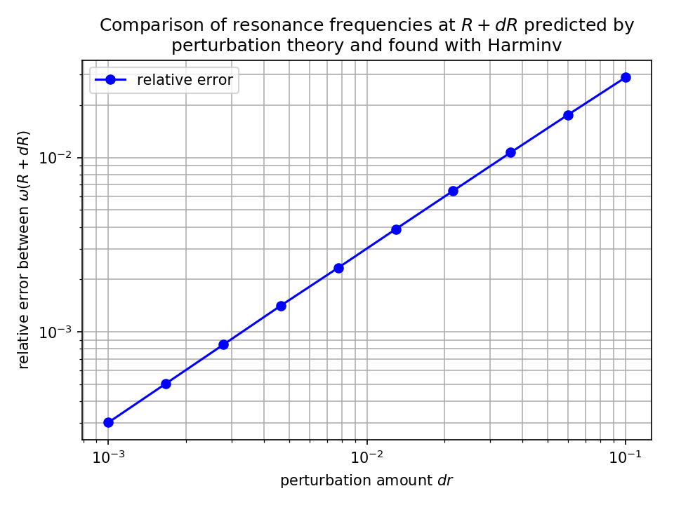
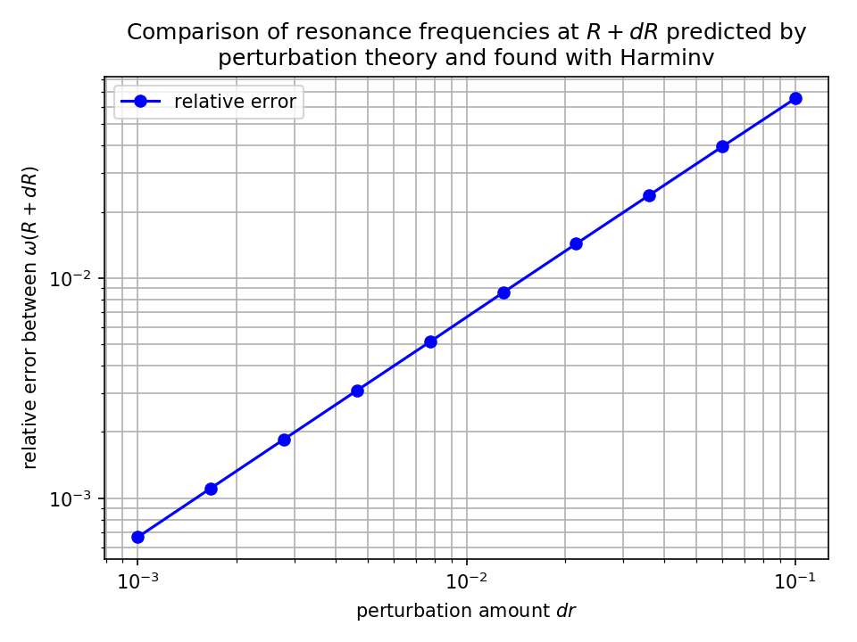

---
# Perturbation theory with resonant modes of a ring resonator.
---

[Perturbation theory](https://en.wikipedia.org/wiki/Perturbation_theory) is a mathematical method commonly used to find 
an approximate solution to a problem by starting with the exact solution of a related problem and then by solving a 
small “perturbation part” that has been added to problem with the known solution. This method is a familiar tool when solving problems in 
quantum mechanics, but can also be beneficial when solving problems in classical electrodynamics, as we will see.

In [Tutorial/Ring Resonator in Cylindrical Coordinates](Ring_Resonator_in_Cylindrical_Coordinates.md) we found the 
resonance modes of a ring resonator in two-dimensional cylindrical coordinates. We will expand this problem using 
perturbation theory to show how performing one simulation can easily allow us to find the resonance states of ring 
resonators with slightly different shapes without performing additional simulations.

[TOC]

The $E_{z}$ Case
-----------------
We begin by defining a cylindrical space and resonator, as performed in [Tutorial/Ring Resonator in Cylindrical 
Coordinates](Ring_Resonator_in_Cylindrical_Coordinates.md). (See [ring_Ez_perturbation_theory.py](https://github.com/NanoComp/meep/blob/master/python/examples/ring_Ez_perturbation_theory.py).)
```python
import meep as mp
import numpy as np
from statistics import mean
import matplotlib.pyplot as plt


def main():
    n = 3.4                 # index of waveguide
    r = 1
    a = r                   # inner radius of ring
    w = 1                   # width of waveguide
    b = a + w               # outer radius of ring
    pad = 4                 # padding between waveguide and edge of PML

    dpml = 2                # thickness of PML
    pml_layers = [mp.PML(dpml)]

    resolution = 100

    sr = b + pad + dpml            # radial size (cell is from 0 to sr)
    dimensions = mp.CYLINDRICAL    # coordinate system is (r,phi,z) instead of (x,y,z)
    cell = mp.Vector3(sr, 0, 0)

    m = 4

    geometry = [mp.Block(center=mp.Vector3(a + (w / 2)),
                         size=mp.Vector3(w, 1e20, 1e20),
                         material=mp.Medium(index=n))]
```
Be sure, as before, to set the `dimensions` parameter to `CYLINDRICAL`. Also note that unlike the previous tutorial, 
`m` has been given a hard value and is no longer a command-line argument. The resolution has also been increased to 100
in order to reduce discretization error. This increase in resolution is only strictly necessary while calculating errors
in the perturbed states, but we increased it throughout the whole script for neatness.

Next, we use Harminv to find a resonant frequency:
```python
    fcen = 0.15         # pulse center frequency
    df = 0.1            # pulse width (in frequency)

    sources = [mp.Source(mp.GaussianSource(fcen, fwidth=df), mp.Ez, mp.Vector3(r+0.1))]

    sim = mp.Simulation(cell_size=cell,
                        geometry=geometry,
                        boundary_layers=pml_layers,
                        resolution=resolution,
                        sources=sources,
                        dimensions=dimensions,
                        m=m)

    h = mp.Harminv(mp.Ez, mp.Vector3(r+0.1), fcen, df)
    sim.run(mp.after_sources(h), until_after_sources=200)

    Q_values = [mode.Q for mode in h.modes]
    max_Q_index = np.argmax(Q_values)
    Harminv_freq_at_R = h.modes[max_Q_index].freq

    sim.reset_meep()
```

We can use the calculated resonant frequency to run the simulation again, this time where our Gaussian pulse is centered
at the resonant frequency and has an extremely narrow band (so that hopefully only one resonant mode is excited).

```python
    fcen = Harminv_freq_at_R
    df = 0.01

    sources = [mp.Source(mp.GaussianSource(fcen, fwidth=df), mp.Ez, mp.Vector3(r + 0.1))]

    sim = mp.Simulation(cell_size=cell,
                        geometry=geometry,
                        boundary_layers=pml_layers,
                        resolution=resolution,
                        sources=sources,
                        dimensions=dimensions,
                        m=m)

    sim.run(until_after_sources=200)
```

Now things get a bit different. To use one simulation to predict perturbed states, we will find 
$\mathrm{d}\omega/\mathrm{d}R$ using Eq. (3) found in [Physical Review E, Volume 65, pp. 066611-1-7, 2002](http://math.mit.edu/~stevenj/papers/JohnsonIb02.pdf)

<center>

}}{2}&space;\frac{\left&space;\langle&space;E^{(0)}&space;\left&space;|&space;\frac{\mathrm{d}&space;\epsilon}{\mathrm{d}&space;R}&space;\right&space;|&space;E^{(0)}&space;\right&space;\rangle}{\left&space;\langle&space;E^{(0)}&space;\left&space;|&space;\epsilon&space;\right&space;|&space;E^{(0)}&space;\right&space;\rangle},)

</center>

where the numerator is Eq. (12) from the same paper

<center>

&space;-&space;\Delta(\epsilon_{12}^{-1})(D_{\perp}^{\ast}&space;-&space;D_{\perp}^{\prime})].)

</center>

We will approximate Eq. (12) by using `Simulation.get_field_point()` at $N$ equally spaced points around the ring's
inner and outer surfaces—the average (multiplied by $2 \pi R$) is a good approximation for that surface integral. Note that 
the surface integral separates the components of the field parallel and perpendicular to the interface. In the case we are investigating 
where the source is $E_{z}$-polarized, only components parallel to the surface are excited, so here we only approximate 
Eq. (12) for $E_{z}$ components

```python
    # section for fields at inner surface
    npts_inner = 100
    angles_inner = 2 * np.pi / npts_inner * np.arange(npts_inner)
    deps_inner = 1 - n ** 2

    # section for fields parallel to interface (only Ez because Ep isn't excited by an Ez source).
    parallel_fields_inner = []
    for angle in angles_inner:
        point = mp.Vector3(a, angle)
        e_z_field = abs(sim.get_field_point(mp.Ez, point))**2
        e_parallel_field = e_z_field
        # fields have to be multiplied by Δε
        e_parallel_field = deps_inner * e_parallel_field
        parallel_fields_inner.append(e_parallel_field)

    # no perpendicular fields are calculated in this instance because none are excited with an Ez source.

    # section for fields at outer surface
    npts_outer = npts_inner
    angles_outer = 2 * np.pi / npts_outer * np.arange(npts_outer)
    deps_outer = n ** 2 - 1

    # section for fields parallel to interface (only Ez because Ep isn't excited by an Ez source).
    parallel_fields_outer = []
    for angle in angles_outer:
        point = mp.Vector3(b, angle)
        e_z_field = abs(sim.get_field_point(mp.Ez, point))**2
        e_parallel_field = e_z_field
        # fields have to be multiplied by Δε
        e_parallel_field = deps_outer * e_parallel_field
        parallel_fields_outer.append(e_parallel_field)

    # no perpendicular fields are calculated in this instance because none are excited with an Ez source.

    numerator_surface_integral = 2 * np.pi * b * mean([mean(parallel_fields_inner), mean(parallel_fields_outer)])
```
 
 The denominator of Eq. (3) will be calculated using `Simulation.electric_energy_in_box()`, which calculates the integral
 of $\textbf{E} \cdot \dfrac{\textbf{D}}{2} = \epsilon \dfrac{\left | \textbf{E} \right | ^{2}}{2}$, which is exactly the integral in the denominator of Eq. (3) divided by 2.
 
 ```python
    denominator_surface_integral = sim.electric_energy_in_box(center=mp.Vector3((b + pad/2) / 2), size=mp.Vector3(b + pad/2))
```

We can finally approximate $\mathrm{d}\omega/\mathrm{d}R$ using perturbation theory:

```python
    perturb_theory_dw_dR = -Harminv_freq_at_R * numerator_surface_integral / (4 * denominator_surface_integral)
```

Our value of $\mathrm{d}\omega/\mathrm{d}R$ can be used to predict values of $\omega$ when the size of the ring resonator
is changed by a perturbation value $\mathrm{d}R$, following

<center>

&space;\approx&space;\omega(R)&plus;\frac{\mathrm{d}&space;\omega}{\mathrm{d}R}\cdot&space;\Delta&space;R.)

</center>

Here we show the results from when we approximated the value of $\omega$ for several values of $\mathrm{d}R \approx \Delta R} 
and then compared the estimated value to what Harminv found in each perturbed state.

 <center>



</center>

It's easy to see here that the relative error in $\omega$ increases following a power rule dependent on $\mathrm{d}R$. 
The fact that the relative error is less than the relative change in the width of the ring resonator does show the 
usefulness of perturbation theory in finding perturbed states without running additional simulations.

 The $H_{z}$ Case
-----------------

In the previous section we investigated the case when only fields parallel to the interface were excited. Now we will 
consider the case when fields that are also perpendicular to the interface are excited. (See [ring_Hz_perturbation_theory.py](https://github.com/NanoComp/meep/blob/master/python/examples/ring_Hz_perturbation_theory.py).)
 To excite these fields, we will simply replace every instance of 

```python
sources = [mp.Source(mp.GaussianSource(fcen, fwidth=df), mp.Ez, mp.Vector3(r+0.1))]
``` 

for

```python
sources = [mp.Source(mp.GaussianSource(fcen, fwidth=df), mp.Hz, mp.Vector3(r+0.1))]
```

The `Hz` ($H_{z}$) field component excites fields in the plane of the resonator in both the radial ($E_{r}$, `meep.Er`)
direction as well as the $\phi$ ($E_{\phi}$, `meep.Ep`) direction. To compensate for this change we will alter our method
of calculating Eq. (12):

```python
    # section for fields at inner surface
    npts_inner = 100
    angles_inner = 2 * np.pi / npts_inner * np.arange(npts_inner)
    deps_inner = 1 - n ** 2
    deps_inv_inner = 1 - 1/(n**2)

    # section for fields parallel to interface (Ez and Ep)
    parallel_fields_inner = []
    for angle in angles_inner:
        point = mp.Vector3(a, angle)
        e_z_field = abs(sim.get_field_point(mp.Ez, point))**2
        e_p_field = abs(sim.get_field_point(mp.Ep, point))**2
        e_parallel_field = e_z_field + e_p_field
        # fields have to be multiplied by Δε
        e_parallel_field = deps_inner * e_parallel_field
        parallel_fields_inner.append(e_parallel_field)

    # section for fields perpendicular to interface (Er)
    perpendicular_fields_inner = []
    for angle in angles_inner:
        point = mp.Vector3(a, angle)
        e_r_field = abs(sim.get_field_point(mp.Er, point))**2
        e_perpendicular_field = e_r_field
        # fields have to be multiplied by Δ(1/ε) and ε**2
        e_perpendicular_field = deps_inv_inner * (abs(sim.get_epsilon_point(point, Harminv_freq_at_R))**2) * e_perpendicular_field
        perpendicular_fields_inner.append(e_perpendicular_field)

    # section for fields at outer surface
    npts_outer = npts_inner
    angles_outer = 2 * np.pi / npts_outer * np.arange(npts_outer)
    deps_outer = n ** 2 - 1
    deps_inv_outer = -1 + 1/(n**2)

    # section for fields parallel to interface (Ez and Ep)    parallel_fields_outer = []
    parallel_fields_outer = []
    for angle in angles_outer:
        point = mp.Vector3(b, angle)
        e_z_field = abs(sim.get_field_point(mp.Ez, point))**2
        e_p_field = abs(sim.get_field_point(mp.Ep, point))**2
        e_parallel_field = e_z_field + e_p_field
        # fields have to be multiplied by Δε
        e_parallel_field = deps_outer * e_parallel_field
        parallel_fields_outer.append(e_parallel_field)

    # section for fields perpendicular to interface (Er)
    perpendicular_fields_outer = []
    for angle in angles_inner:
        point = mp.Vector3(b, angle)
        e_r_field = abs(sim.get_field_point(mp.Er, point))
        e_perpendicular_field = e_r_field**2
        # fields have to be multiplied by Δ(1/ε) and ε**2
        e_perpendicular_field = deps_inv_outer * (abs(sim.get_epsilon_point(point, Harminv_freq_at_R))**2) * e_perpendicular_field
        perpendicular_fields_outer.append(e_perpendicular_field)

    numerator_surface_integral = 2 * np.pi * b * (mean([mean(parallel_fields_inner), mean(parallel_fields_outer)]) - mean([mean(perpendicular_fields_inner), mean(perpendicular_fields_outer)]))
``` 

This change yields similar accuracy in using the perturbation value of $\mathrm{d} \omega / \mathrm{d} R$ to predict 
values of $\omega(R + \mathrm{d}R)$, as we see here:

 <center>



</center>