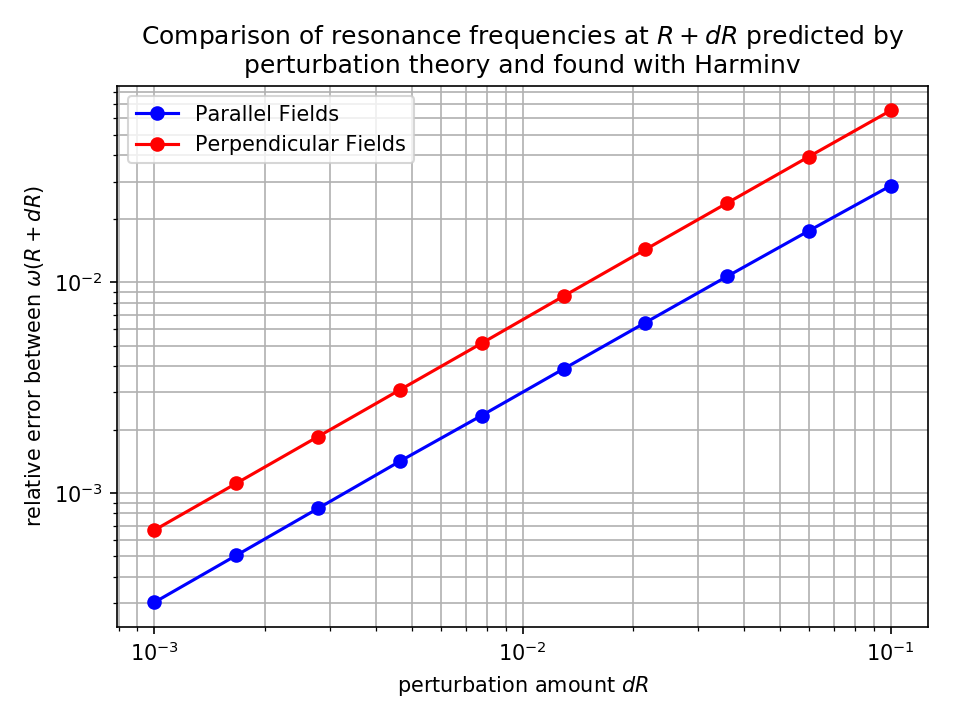

---
# Ring Resonator in Cylindrical Coordinates
---

In [Tutorial/Basics/Modes of a Ring Resonator](Basics.md#modes-of-a-ring-resonator), we computed the modes of a ring resonator by performing a 2d simulation. Here, we will simulate the *same* structure while [exploiting](../Exploiting_Symmetry.md) the fact that the system has *continuous* rotational symmetry, by performing the simulation in [cylindrical coordinates](../Cylindrical_Coordinates.md). See also [ring-cyl.py](https://github.com/NanoComp/meep/blob/master/python/examples/ring-cyl.py).

[TOC]

The Python Script
-----------------

We begin by importing the `meep` and `argparse` library modules:

```py
import meep as mp
import argparse

def main(args):
```

We then define the parameters of the problem with exactly the same values as in the 2d simulation:

```py
n = 3.4     # index of waveguide
w = 1       # width of waveguide
r = 1       # inner radius of ring
pad = 4     # padding between waveguide and edge of PML
dpml = 2    # thickness of PML
```

Now, we'll define the dimensions and size of the computational cell:

```py
sr = r + w + pad + dpml         # radial size (cell is from 0 to sr)
dimensions = mp.CYLINDRICAL
cell = mp.Vector3(sr, 0, 0)
```

The key thing is to set the `dimensions` parameter to `CYLINDRICAL`. This means that all vectors will represent ($r$,φ,$z$) coordinates instead of ($x$,$y$,$z$). The computational cell in the $r$ direction is of size `sr = r + w + pad + dpml`, and runs from `0` to `sr` (by default) rather than from `-sr/2` to `sr/2` as it would for any other dimension. Note that our $z$ size is 0 because it is in 2d. The φ size is also 0, corresponding to the continuous rotational symmetry. A finite φ size might correspond to discrete rotational symmetry, but this is not currently supported.

In particular, in systems with continuous rotational symmetry, by an analogue of Bloch's theorem, the angular dependence of the fields can always be chosen in the form $\exp(i m φ)$ for some integer $m$. Meep uses this fact to treat the angular dependence analytically, with $m$ given by the input variable `m` which we'll set to a command-line argument that is 3 by default.

```py
m = args.m
```

Thus, we are essentially performing a 1d calculation, where Meep must discretize the $r$ direction only. For this reason, it will be much faster than the previous 2d calculation.

The geometry is now specified by a single `Block` object &mdash; remember that this is a block in cylindrical coordinates, so that it really specifies an annular ring:

```py
geometry = [mp.Block(center=mp.Vector3(r + (w / 2)),
                     size=mp.Vector3(w, 1e20, 1e20),
                     material=mp.Medium(index=n))]

pml_layers = [mp.PML(dpml)]
resolution = 10
```

We have added PML layers on "all" sides. Meep, however, notices that the $z$ direction has no thickness and automatically makes it periodic with no PML. Meep also omits PML from the boundary at $r$=0 which is handled by the analytical reflection symmetry.

Now, the remaining inputs are almost exactly the same as in the previous 2d simulation. We'll add a single Gaussian point source in the $z$ direction to excite $E_z$-polarized modes, with some center frequency and width:

```py
fcen = args.fcen  # pulse center frequency
df = args.df      # pulse width (in frequency)
sources = [mp.Source(src=mp.GaussianSource(fcen, fwidth=df),
                     component=mp.Ez,
                     center=mp.Vector3(r + 0.1))]
```

Note that this isn't really a point source, however, because of the cylindrical symmetry &mdash; it is really a ring source with φ dependence $\exp(i m \phi)$. Finally, as before, we run until the source has turned off, plus 200 additional time units during which we use [Harminv](https://github.com/NanoComp/harminv) to analyze the $E_z$ field at a given point to extract the frequencies and decay rates of the modes.

```py
sim = mp.Simulation(cell_size=cell,
                    geometry=geometry,
                    boundary_layers=pml_layers,
                    resolution=resolution,
                    sources=sources,
                    dimensions=dimensions,
                    m=m)

sim.run(mp.after_sources(mp.Harminv(mp.Ez, mp.Vector3(r + 0.1), fcen, df)),
        until_after_sources=200)
```

At the very end, we'll also output one period of the fields to make movies, etcetera. A single field output would be a 1d dataset along the $r$ direction, so to make things more interesting we'll use `to_appended` to append these datasets to a single HDF5 file to get an $r \times t$ 2d dataset. We'll also use `in_volume` to specify a larger output volume than just the computational cell: in particular, we'll output from `-sr` to `sr` in the $r$ direction, where Meep will automatically infer the $-r$ field values from the reflection symmetry.

```py
sim.run(mp.in_volume(mp.Volume(center=mp.Vector3(), size=mp.Vector3(2 * sr)),
                     mp.at_beginning(mp.output_epsilon),
                     mp.to_appended("ez", mp.at_every(1 / fcen / 20, mp.output_efield_z))),
        until=1 / fcen)
```

The last component of the script invovles defining the three command-line arguments and their default values:

```py
if __name__ == '__main__':
   parser = argparse.ArgumentParser()
   parser.add_argument('-fcen', type=float, default=0.15, help='pulse center frequency')
   parser.add_argument('-df', type=float, default=0.1, help='pulse frequency width')
   parser.add_argument('-m', type=int, default=3, help='phi (angular) dependence of the fields given by exp(i m phi)')
   args = parser.parse_args()
   main(args)
```

Results
-------

Now, we are ready to run our simulation. Recall that, in the 2d calculation, we got three modes in this frequency range: one at ω=0.11785 with $Q$=77 and an $m$=3 field pattern, one at ω=0.14687 with $Q$=351 and an $m$=4 field pattern, and one at ω=0.17501 with $Q$=1630 and an $m$=5 field pattern. We should get the *same* modes here with some differences due to the finite resolution, except now that we will have to run *three* calculations, a separate one for each value of $m$. It will still be much faster than before because the simulations are 1d instead of 2d.

In particular, we'll run:

```sh
unix% python ring-cyl.py -m 3 | grep harminv
unix% python ring-cyl.py -m 4 | grep harminv
unix% python ring-cyl.py -m 5 | grep harminv
```

giving the combined output:

```
harminv0:, frequency, imag. freq., Q, |amp|, amplitude, error
harminv0:, 0.11835455441250631, -0.0006907792691647415, 85.66741917111612, 0.02570190626349302, (-0.02402703883357199-0.00912630212448642j), (5.286949731053267e-10+0j)
harminv0:, 0.1475578747705309, -0.0001938438860632441, 380.61008208014414, 0.19361245519715206, (0.1447225471614173+0.12861246887677943j), (5.889273063545974e-11+0j)
harminv0:, 0.1759448592380757, -4.900590034953583e-05, 1795.1395442502285, 0.0452479314013276, (-0.014395016792255884-0.042897072017212545j), (1.6343462235932872e-10+0j)
```

This is indeed very close to the 2d simulations: the frequencies are within 1% of the previous values. The $Q$ values (lifetimes) differ by a larger amount although they are still reasonably close.

Which is more accurate, the 2d or the cylindrical simulation? We can answer this question by increasing the resolutions in both cases and seeing what they converge towards. In particular, let's focus on the $m$=4 mode. In the cylindrical case, if we double the resolution to 20 we get ω=0.14748 and $Q$=384. In the 2d case, if we double the resolution to 20 we get ω=0.14733 and $Q$=321. So, it looks like the frequencies are clearly converging together and that the cylindrical simulation is more accurate (as you might expect since it describes the φ direction analytically). But the $Q$ values seem to be getting *farther* apart &mdash; what's going on?

The problem is twofold. First, there is some signal-processing error in determining $Q$ in the 2d case, as indicated by the "error" column of the `harminv` output which is only 4e-7 for the 2d simulation vs. 6e-11 for the cylindrical case. We can bring this error down by running with a narrower bandwidth source, which excites just one mode and gives a cleaner signal, or by analyzing over a longer time than 200. Doing the former, we find that the 2d value of $Q$ at a resolution of 20 should really be $Q$=343. Second, [PML](../Perfectly_Matched_Layer.md) absorbing layers are really designed to absorb planewaves incident on flat interfaces, but here we have a *cylindrical* PML layer. Because of this, there are larger numerical reflections from the PML in the cylindrical simulation, which we can rectify by pushing the PML out to a larger radius (i.e. using a larger value of `pad`) and/or increasing the PML thickness (increasing `dpml`) so that it turns on more adiabatically. In the cylindrical simulation for `resolution = 20`, if we increase to `dpml = 16`, we get $Q$=343, which is in much better agreement with the 2d calculation and if we increase to `dpml = 32` we get the same $Q$=343, so it seems to be converged.

This illustrates the general principle that you need to check several parameters to ensure that results are converged in time-domain simulations: the resolution, the run time, the PML thickness, etcetera.

Finally, we can get the field images. Since we only are exciting one mode per `m` here anyway, according to `harminv`, we don't really need to use a narrow-band source. We'll do so anyway just to remind you of the general procedure, however, e.g. for the ω=0.118, $m$=3 mode:

```sh
unix% python ring-cyl.py -m 3 -fcen 0.118 -df 0.01
unix% h5topng -S 2 -Zc dkbluered -C ring-cyl-eps-001200.00.h5 ring-cyl-ez.h5
```

Note that, because of the `to_appended` command, the `ring-cyl-ez.h5` file is a 160$\times$18 dataset corresponding to an $r \times t$ slice. Repeating this for all three modes results in the images:

<center>
$E_z$ for ω=0.118 $m$=3 mode:  


$E_z$ for ω=0.148 $m$=4 mode:  


$E_z$ for ω=0.176 $m$=5 mode:  

</center>

Because we are looking only at a φ=0 slice, the visual distinction between $m$ values is much less than with the 2d simulation. What is apparent is that, as the frequency increases, the mode becomes more localized in the waveguide and the radiating field (seen in the $r \times t$ slice as curved waves extending outward) becomes less, as expected.

# Perturbation Theory
---

[Perturbation theory](https://en.wikipedia.org/wiki/Perturbation_theory) is a mathematical method commonly used to find 
an approximate solution to a problem by starting with the exact solution of a related problem and then by solving a 
small “perturbation part” that has been added to problem with the known solution. This method is a familiar tool when solving problems in 
quantum mechanics, but can also be beneficial when solving problems in classical electrodynamics, as we will see.

In [Tutorial/Ring Resonator in Cylindrical Coordinates](Ring_Resonator_in_Cylindrical_Coordinates.md) we found the 
resonance modes of a ring resonator in two-dimensional cylindrical coordinates. We will expand this problem using 
perturbation theory to show how performing one simulation can easily allow us to find the resonance states of ring 
resonators with slightly different shapes without performing additional simulations. See [ring-cyl-perturbation-theory.py](https://github.com/NanoComp/meep/blob/master/python/examples/ring-cyl-perturbation-theory.py).

Parallel Fields
-------------------
We begin by defining a cylindrical space and resonator, as performed in [Tutorial/Ring Resonator in Cylindrical 
Coordinates](Ring_Resonator_in_Cylindrical_Coordinates.md).
```py
import meep as mp
import numpy as np
from statistics import mean
import matplotlib.pyplot as plt


def main():
    n = 3.4                 # index of waveguide
    r = 1
    a = r                   # inner radius of ring
    w = 1                   # width of waveguide
    b = a + w               # outer radius of ring
    pad = 4                 # padding between waveguide and edge of PML

    dpml = 2                # thickness of PML
    pml_layers = [mp.PML(dpml)]

    resolution = 100

    sr = b + pad + dpml            # radial size (cell is from 0 to sr)
    dimensions = mp.CYLINDRICAL    # coordinate system is (r,phi,z) instead of (x,y,z)
    cell = mp.Vector3(sr, 0, 0)

    m = 4

    geometry = [mp.Block(center=mp.Vector3(a + (w / 2)),
                         size=mp.Vector3(w, 1e20, 1e20),
                         material=mp.Medium(index=n))]
```
Be sure, as before, to set the `dimensions` parameter to `CYLINDRICAL`. Also note that unlike the previous tutorial, 
`m` has been given a hard value and is no longer a command-line argument. The resolution has also been increased to 100
in order to reduce discretization error. This increase in resolution is only strictly necessary while calculating errors
in the perturbed states, but we increased it throughout the whole script for neatness.

Next, we use Harminv to find a resonant frequency:
```py
fcen = 0.15         # pulse center frequency
df = 0.1            # pulse width (in frequency)

sources = [mp.Source(mp.GaussianSource(fcen, fwidth=df), mp.Ez, mp.Vector3(r+0.1))]

sim = mp.Simulation(cell_size=cell,
                    geometry=geometry,
                    boundary_layers=pml_layers,
                    resolution=resolution,
                    sources=sources,
                    dimensions=dimensions,
                    m=m)

h = mp.Harminv(mp.Ez, mp.Vector3(r+0.1), fcen, df)
sim.run(mp.after_sources(h), until_after_sources=200)

Q_values = [mode.Q for mode in h.modes]
max_Q_index = np.argmax(Q_values)
Harminv_freq_at_R = h.modes[max_Q_index].freq

sim.reset_meep()
```

We can use the calculated resonant frequency to run the simulation again, this time where our Gaussian pulse is centered
at the resonant frequency and has an extremely narrow band (so that hopefully only one resonant mode is excited).

```py
fcen = Harminv_freq_at_R
df = 0.01

sources = [mp.Source(mp.GaussianSource(fcen, fwidth=df), mp.Ez, mp.Vector3(r + 0.1))]

sim = mp.Simulation(cell_size=cell,
                    geometry=geometry,
                    boundary_layers=pml_layers,
                    resolution=resolution,
                    sources=sources,
                    dimensions=dimensions,
                    m=m)

sim.run(until_after_sources=200)
```

Now things get a bit different. To use one simulation to predict perturbed states, we will find 
$\mathrm{d}\omega/\mathrm{d}R$ using Eq. (30) found in Chapter 2 of [Photonic Crystals: Molding the Flow of Light (second edition)](http://ab-initio.mit.edu/book/photonic-crystals-book.pdf):

<center>

$$ \frac{\mathrm{d} \omega}{\mathrm{d} R} \approx - \frac{\omega}{2} \frac{\int \int (\epsilon_{1} - \epsilon_{2})\left | \textbf{E}_{\parallel}(\textbf{r})) \right |^{2} - (\frac{1}{\epsilon_{1}} - \frac{1}{\epsilon_{2}})\left | \epsilon \textbf{E}_{\perp}(\textbf{r}) \right |^{2}}{\int \mathrm{d}^{3} \textbf{r} \epsilon(\textbf{r}) \left | \textbf{E}(\textbf{r}) \right |^{2}}. $$

</center>

We will approximate the numerator of Eq. (30) by using `Simulation.get_field_point()` at $N$ equally spaced points around the ring's
inner and outer surfaces—the average (multiplied by $2 \pi R$) is a good approximation for that surface integral. Note that 
the surface integral separates the components of the field parallel and perpendicular to the interface. In the case we are investigating 
where the source is $E_{z}$-polarized, only components parallel to the surface are excited, so here we only approximate 
the numerator of Eq. (30) for $E_{z}$ components

```py
# section for fields at inner surface
npts_inner = 100
angles_inner = 2 * np.pi / npts_inner * np.arange(npts_inner)
deps_inner = 1 - n ** 2

# section for fields parallel to interface (only Ez because Ep isn't excited by an 
# Ez source).
parallel_fields_inner = []
for angle in angles_inner:
    point = mp.Vector3(a, angle)
    e_z_field = abs(sim.get_field_point(mp.Ez, point))**2
    e_parallel_field = e_z_field
    # fields have to be multiplied by Δε
    e_parallel_field = deps_inner * e_parallel_field
    parallel_fields_inner.append(e_parallel_field)

# no perpendicular fields are calculated in this instance because none are excited 
# with an Ez source.

# section for fields at outer surface
npts_outer = npts_inner
angles_outer = 2 * np.pi / npts_outer * np.arange(npts_outer)
deps_outer = n ** 2 - 1

# section for fields parallel to interface (only Ez because Ep isn't excited by an 
# Ez source).
parallel_fields_outer = []
for angle in angles_outer:
    point = mp.Vector3(b, angle)
    e_z_field = abs(sim.get_field_point(mp.Ez, point))**2
    e_parallel_field = e_z_field
    # fields have to be multiplied by Δε
    e_parallel_field = deps_outer * e_parallel_field
    parallel_fields_outer.append(e_parallel_field)

# no perpendicular fields are calculated in this instance because none are excited 
# with an Ez source.

numerator_surface_integral = 2 * np.pi * b * mean([mean(parallel_fields_inner), 
                                                   mean(parallel_fields_outer)])
```
 
 The denominator of Eq. (30) will be calculated using `Simulation.electric_energy_in_box()`, which calculates the integral
 of $\textbf{E} \cdot \tfrac{\textbf{D}}{2} = \epsilon \tfrac{\left | \textbf{E} \right | ^{2}}{2}$, which is exactly the integral in the denominator of Eq. (3) divided by 2.
 
```py
denominator_surface_integral = sim.electric_energy_in_box(center=mp.Vector3((b + pad/2) / 2), 
                                                          size=mp.Vector3(b + pad/2))
```

We can finally approximate $\mathrm{d}\omega/\mathrm{d}R$ using perturbation theory:

```py
perturb_theory_dw_dR = -Harminv_freq_at_R * numerator_surface_integral / 
                        (4 * denominator_surface_integral)
```

Our value of $\mathrm{d}\omega/\mathrm{d}R$ can be used to predict values of $\omega$ when the size of the ring resonator
is changed by a perturbation value $\mathrm{d}R$, following

<center>

$$ \omega(R + \mathrm{d}R) \approx \omega(R)+\frac{\mathrm{d} \omega}{\mathrm{d}R}\cdot \Delta R. $$

</center>

 Perpendicular Fields
---------------------

In the previous section we investigated the case when only fields parallel to the interface were excited. Now we will 
consider the case when fields that are also perpendicular to the interface are excited. To excite these fields, we will 
simply replace every instance of 

```py
sources = [mp.Source(mp.GaussianSource(fcen, fwidth=df), mp.Ez, mp.Vector3(r+0.1))]
``` 

for

```py
sources = [mp.Source(mp.GaussianSource(fcen, fwidth=df), mp.Hz, mp.Vector3(r+0.1))]
```

The `Hz` ($H_{z}$) field component excites fields in the plane of the resonator in both the radial ($E_{r}$, `meep.Er`)
direction as well as the $\phi$ ($E_{\phi}$, `meep.Ep`) direction. To compensate for this change we will alter our method
of calculating the numerator of Eq. (30):

```py
# section for fields at inner surface
npts_inner = 100
angles_inner = 2 * np.pi / npts_inner * np.arange(npts_inner)
deps_inner = 1 - n ** 2
deps_inv_inner = 1 - 1/(n**2)

# section for fields parallel to interface (Ez and Ep)
parallel_fields_inner = []
for angle in angles_inner:
    point = mp.Vector3(a, angle)
    e_z_field = abs(sim.get_field_point(mp.Ez, point))**2
    e_p_field = abs(sim.get_field_point(mp.Ep, point))**2
    e_parallel_field = e_z_field + e_p_field
    # fields have to be multiplied by Δε
    e_parallel_field = deps_inner * e_parallel_field
    parallel_fields_inner.append(e_parallel_field)

# section for fields perpendicular to interface (Er)
perpendicular_fields_inner = []
for angle in angles_inner:
    point = mp.Vector3(a, angle)
    e_r_field = abs(sim.get_field_point(mp.Er, point))**2
    e_perpendicular_field = e_r_field
    # fields have to be multiplied by Δ(1/ε) and ε**2
    e_perpendicular_field = deps_inv_inner * (abs(sim.get_epsilon_point(point, Harminv_freq_at_R))**2) * e_perpendicular_field
    perpendicular_fields_inner.append(e_perpendicular_field)

# section for fields at outer surface
npts_outer = npts_inner
angles_outer = 2 * np.pi / npts_outer * np.arange(npts_outer)
deps_outer = n ** 2 - 1
deps_inv_outer = -1 + 1/(n**2)

# section for fields parallel to interface (Ez and Ep)    parallel_fields_outer = []
parallel_fields_outer = []
for angle in angles_outer:
    point = mp.Vector3(b, angle)
    e_z_field = abs(sim.get_field_point(mp.Ez, point))**2
    e_p_field = abs(sim.get_field_point(mp.Ep, point))**2
    e_parallel_field = e_z_field + e_p_field
    # fields have to be multiplied by Δε
    e_parallel_field = deps_outer * e_parallel_field
    parallel_fields_outer.append(e_parallel_field)

# section for fields perpendicular to interface (Er)
perpendicular_fields_outer = []
for angle in angles_inner:
    point = mp.Vector3(b, angle)
    e_r_field = abs(sim.get_field_point(mp.Er, point))
    e_perpendicular_field = e_r_field**2
    # fields have to be multiplied by Δ(1/ε) and ε**2
    e_perpendicular_field = deps_inv_outer * (abs(sim.get_epsilon_point(point, Harminv_freq_at_R))**2) * e_perpendicular_field
    perpendicular_fields_outer.append(e_perpendicular_field)

numerator_surface_integral = 2 * np.pi * b * (mean([mean(parallel_fields_inner), mean(parallel_fields_outer)]) - mean([mean(perpendicular_fields_inner), mean(perpendicular_fields_outer)]))
``` 

Here we show the results from when we approximated the value of $\omega$ for several values of $\mathrm{d}R \approx \Delta R$ 
and then compared the estimated value to what Harminv found in each perturbed state, looking at both the parallel and the perpendicular fields

 <center>



</center>

It's easy to see here that the relative error in $\omega$ increases following a power rule dependent on $\mathrm{d}R$. 
The fact that the relative error is less than the relative change in the width of the ring resonator (even in the case of perependicular fields) shows the 
usefulness of perturbation theory in finding perturbed states without running additional simulations.