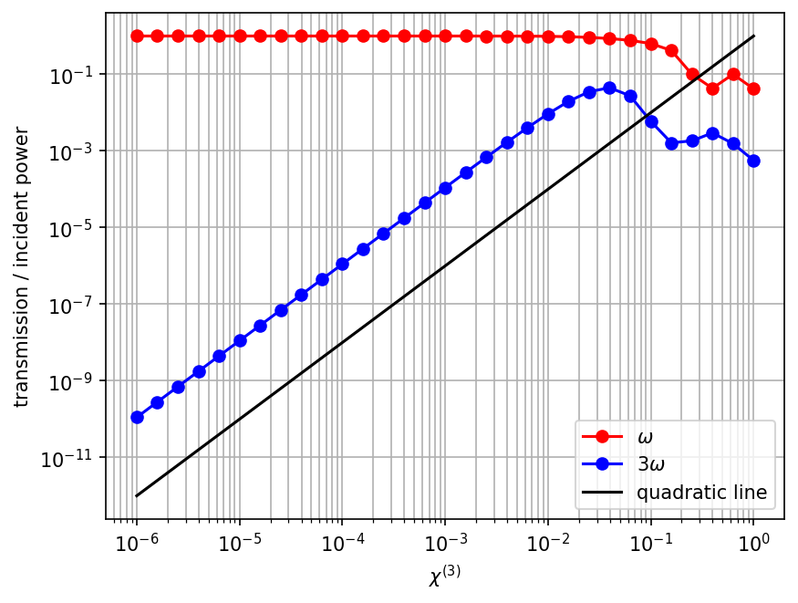

---
# Third Harmonic Generation
---

In this example, we consider wave propagation through a simple 1d *nonlinear* medium with a non-zero Kerr susceptibility χ$^{(3)}$. See also [Materials](../Materials.md#nonlinearity) and [Units and Nonlinearity](../Units_and_Nonlinearity.md). We send in a narrow-band pulse at a frequency ω, and because of the nonlinearity we also get a signal at a frequency 3ω. See also [3rd-harm-1d.py](https://github.com/stevengj/meep/blob/master/python/examples/3rd-harm-1d.py).

Since this is a 1d calculation, we could implement it via a 2d cell of `Vector3(S,0,0)`, specifying periodic boundary conditions in the $y$ direction. However, this is slightly inefficient since the $y$ periodic boundaries are implemented internally via extra "ghost pixels" in the $y$ direction. Instead, Meep has special support for 1d simulations in the $z$ direction. To use this, we must explicitly set `dimensions` to `1`, and in that case we can *only* use $E_x$ (and $D_x$) and $H_y$ field components. This involves no loss of generality because of the symmetry of the problem.

First, we'll load the necessary modules:

```py
import meep as mp
import argparse

def main(args):
```

Next, we'll define some parameters of our simulation:

```py
sz = 100              # size of cell in z direction
fcen = 1 / 3.0        # center frequency of source
df = fcen / 20.0      # frequency width of source
amp = args.amp        # amplitude of source
k = 10**args.logk     # Kerr susceptibility
dpml = 1.0            # PML thickness
```

Now, to define our cell, we'll do:

```py
dimensions = 1
cell = mp.Vector3(0, 0, sz)
pml_layers = mp.PML(dpml)
resolution = 20
```

Note that this will only put PMLs at the $\pm z$ boundaries.

In this case, we're going to fill the entire computational cell with the nonlinear medium, so we don't need to use any objects. We can just use the special `default_material` which is ordinarily vacuum:

```py
default_material = mp.Medium(index=1, chi3=k)
```

Now, our source will be a Gaussian pulse of $J_x$ just next to the $-z$ PML layer. Since this is a nonlinear calculation, we may want to play with the amplitude of the current/field, so we set the `amplitude` property explicitly to our parameter `amp`, above.

```py
sources = mp.Source(mp.GaussianSource(fcen, fwidth=df), component=mp.Ex,
                    center=mp.Vector3(0, 0, -0.5*sz + dpml), amplitude=amp)
```

We'll want the frequency spectrum at the $+z$ end of the computational cell. In a linear problem, we normally look at the spectrum over the same frequency range as our source, because other frequencies are zero. In this case, however, we will look from `fcen/2` to `4*fcen`, to be sure that we can see the third-harmonic frequency.

```py
nfreq = 400
fmin = fcen / 2.0
fmax = fcen * 4

sim = mp.Simulation(cell_size=cell,
                    geometry=[],
                    sources=[sources],
                    boundary_layers=[pml_layers],
                    default_material=default_material,
                    resolution=resolution,
                    dimensions=dimensions)

trans = sim.add_flux(0.5 * (fmin + fmax), fmax - fmin, nfreq,
                     mp.FluxRegion(mp.Vector3(0, 0, 0.5*sz - dpml - 0.5)))
```

Finally, we'll run the sources, plus additional time for the field to decay at the flux plane, and output the flux spectrum:

```py
sim.run(until_after_sources=mp.stop_when_fields_decayed(
        50, mp.Ex, mp.Vector3(0, 0, 0.5*sz - dpml - 0.5), 1e-6))

sim.display_fluxes(trans)
```

In a linear calculation, we normalize the transmission against some reference spectrum, but in this case there is no obvious normalization so we will just plot the raw data for several values of `k` (i.e. of χ$^{(3)}$):

<center>

</center>

For small values of χ$^{(3)}$, we see a peak from our source at ω=1/3 and another peak precisely at the third-harmonic frequency 3ω=1. As the χ$^{(3)}$ gets larger, frequency-mixing *within* the peaks causes them to broaden, and finally for χ$^{(3)}=1$ we start to see a noisy, broad-spectrum transmission due to the phenomenon of **modulation instability**. Notice also that at around $10^{-13}$ the data looks weird; this is probably due to our finite simulation time, imperfect absorbing boundaries, etcetera. We haven't attempted to analyze it in detail for this case.

It is also interesting to have a more detailed look at the dependence of the power at ω and 3ω as a function of χ$^{(3)}$ and the current amplitude. We could, of course, interpolate the flux spectrum above to get the desired frequencies, but it is easier just to add two more flux regions to Meep and request exactly the desired frequency components. That is, we'll add the following before `sim.run`:

```py
trans1 = sim.add_flux(fcen, 0, 1,
                      mp.FluxRegion(mp.Vector3(0, 0, 0.5*sz - dpml - 0.5)))

trans3 = sim.add_flux(3 * fcen, 0, 1,
                      mp.FluxRegion(mp.Vector3(0, 0, 0.5*sz - dpml - 0.5)))
```

We could print these with more `display_fluxes` lines, but it is nice to print these on a single line along with χ$^{(3)}$ and the amplitude, so that we can eventually put them all into one table in our plotting program. To do this, we'll use the lower-level function `get_fluxes(trans1)`, which returns a list of the flux values, and take the first element of the list since there is only one:

```py
print("harmonics:, {}, {}, {}, {}".format(k, amp, mp.get_fluxes(trans1)[0], mp.get_fluxes(trans3)[0]))
```

Notice how we separated everything with commas, and prefixed the line with `"harmonics:"` for easy grepping later.

Finally, we specify all the command-line parameters with default values:

```py
if __name__ == '__main__':
   parser = argparse.ArgumentParser()
   parser.add_argument('-amp', type=float, default=1.0, help='amplitude of source')
   parser.add_argument('-logk', type=float, default=0, help='logarithm of Kerr susceptibility')
   args = parser.parse_args()
   main(args)
```

We want to run this for a bunch of values of χ$^{(3)}$. We could write a loop but it is often more convenient just to use the Unix shell when we want to wrap the *entire* simulation in a loop. In particular, for the [bash shell](https://en.wikipedia.org/wiki/Bash_(Unix_shell)), we'll just do:

```sh
unix% (for logk in `seq -6 0.2 0`; do python 3rd-harm-1d.py -logk ${logk} |grep harmonics:; done) | tee harmonics.dat
```

Notice how we've used the `seq` function to get a sequence of exponents from -6 to 0 in steps of 0.2, and how we've used the exponent as an argument to obtain a logarithmic scale.

If we run the simulation with `-logk -16`, i.e. for a linear medium, we get:

```
harmonics:, 1e-16, 1.0, 225.25726603587043, 5.026979706160964e-16
```

That is, the linear transmission is 225.25726603587043 at ω, so we'll divide by this value and plot the fractional transmission at ω and 3ω as a function of χ$^{(3)}$ on a log-log scale:

<center>

</center>

As can be shown from coupled-mode theory or, equivalently, follows from [Fermi's golden rule](https://en.wikipedia.org/wiki/Fermi's_golden_rule), the third-harmonic power must go as the *square* of χ$^{(3)}$ as long as the nonlinearity is weak (i.e. in the first Born approximation limit, where the ω source is not depleted significantly). This is precisely what we see on the above graph, where the slope of the black line indicates an exact quadratic dependence, for comparison. Once the nonlinearity gets strong enough, however, this approximation is no longer valid and the dependence is complicated.

Finally, we note that increasing the current amplitude by a factor of $F$ or the Kerr susceptibility χ$^{(3)}$ by a factor $F^3$ should generate the *same* third-harmonic power in the *weak* nonlinearity approximation. And indeed, we see:

```sh
unix% python 3rd-harm-1d.py -logk -3 -amp 1.0 |grep harmonics:
harmonics:, 0.001, 1.0, 225.2091048223644, 0.021498041565849526
```

```sh
unix% python 3rd-harm-1d.py -logk -6 -amp 10.0 |grep harmonics:
harmonics:, 1e-06, 10.0, 22525.588597389557, 0.021791784143189268
```

which have third-harmonic powers differing by about 1%.
