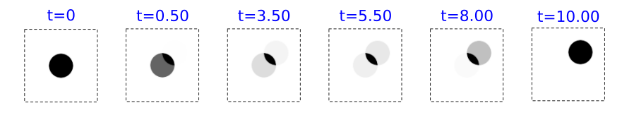
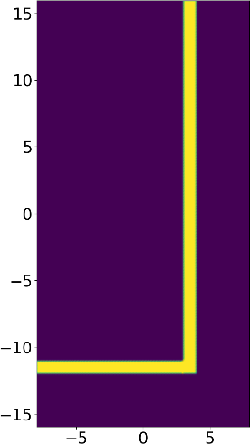

---
# Python User Interface
---

This page is a listing of the functions exposed by the Python interface. For a gentler introduction, see [Tutorial/Basics](Python_Tutorials/Basics.md). Note that this page is not a complete listing of all functions. In particular, because of the [SWIG wrappers](#swig-wrappers), every function in the C++ interface is accessible from the Python module, but not all of these functions are documented or intended for end users. See also the instructions for [parallel Meep](Parallel_Meep.md).

The Python API functions and classes can be found in the `meep` module, which should be installed in your Python system by Meep's `make install` script. If you installed into a nonstandard location (e.g. your home directory), you may need to set the `PYTHONPATH` environment variable as documented in the [Installation](Installation.md) section. You typically import the `meep` module in Python via `import meep as mp`.

[TOC]

The Simulation Class
---------------------

The `Simulation` [class](#classes) contains all the attributes that you can set to control various parameters of the Meep computation. The function signature of the `Simulation` constructor with its default values is listed here for convenience:

```python
class Simulation(object):

    def __init__(self,
                 cell_size,
                 resolution,
                 geometry=[],
                 sources=[],
                 eps_averaging=True,
                 dimensions=3,
                 boundary_layers=[],
                 symmetries=[],
                 verbose=False,
                 force_complex_fields=False,
                 default_material=mp.Medium(),
                 m=0,
                 k_point=False,
                 extra_materials=[],
                 material_function=None,
                 epsilon_func=None,
                 epsilon_input_file='',
                 progress_interval=4,
                 subpixel_tol=1e-4,
                 subpixel_maxeval=100000,
                 ensure_periodicity=True,
                 num_chunks=0,
                 Courant=0.5,
                 accurate_fields_near_cylorigin=False,
                 filename_prefix=None,
                 output_volume=None,
                 output_single_precision=False,
                 load_structure='',
                 geometry_center=mp.Vector3(),
                 force_all_components=False,
                 split_chunks_evenly=True,
                 chunk_layout=None):
```

All `Simulation` attributes are described in further detail below. In brackets after each variable is the type of value that it should hold. The classes, complex datatypes like `GeometricObject`, are described in a later subsection. The basic datatypes, like `integer`, `boolean`, `complex`, and `string` are defined by Python. `Vector3` is a `meep` class.

**`geometry` [ list of `GeometricObject` class ]**
—
Specifies the geometric objects making up the structure being simulated. When objects overlap, later objects in the list take precedence. Defaults to no objects (empty list).

**`geometry_center` [ `Vector3` class ]**
—
Specifies the coordinates of the center of the cell. Defaults to (0, 0, 0), but changing this allows you to shift the coordinate system used in Meep (for example, to put the origin at the corner).

**`sources` [ list of `Source` class ]**
—
Specifies the current sources to be present in the simulation. Defaults to none (empty list).

**`symmetries` [ list of `Symmetry` class ]**
—
Specifies the spatial symmetries (mirror or rotation) to exploit in the simulation. Defaults to none (empty list). The symmetries must be obeyed by *both* the structure and the sources. See also [Exploiting Symmetry](Exploiting_Symmetry.md).

**`boundary_layers` [ list of `PML` class ]**
—
Specifies the [PML](Perfectly_Matched_Layer.md) absorbing boundary layers to use. Defaults to none.

**`cell_size` [ `Vector3` ]**
—
Specifies the size of the cell which is centered on the origin of the coordinate system. Any sizes of 0 imply a reduced-dimensionality calculation. Strictly speaking, the dielectric function is taken to be uniform along that dimension. A 2d calculation is especially optimized. See `dimensions` below. **Note:** because Maxwell's equations are scale invariant, you can use any units of distance you want to specify the cell size: nanometers, microns, centimeters, etc. However, it is usually convenient to pick some characteristic lengthscale of your problem and set that length to 1. See also [Units](Introduction.md#units-in-meep). Required argument (no default).

**`default_material` [`Medium` class ]**
—
Holds the default material that is used for points not in any object of the geometry list. Defaults to `air` (ε=1). This can also be a NumPy array that defines a dielectric function much like `epsilon_input_file` below (see below).

**`material_function` [ function ]**
—
A Python function that takes a `Vector3` and returns a `Medium`. See also [Medium](#medium). Defaults to `None`.

**`epsilon_func` [ function ]**
—
A Python function that takes a `Vector3` and returns the dielectric constant at that point. See also [Medium](#medium). Defaults to `None`.

**`epsilon_input_file` [`string`]**
—
If this string is not empty (the default), then it should be the name of an HDF5 file whose first/only dataset defines a scalar, real-valued, frequency-independent dielectric function over some discrete grid. Alternatively, the dataset name can be specified explicitly if the string is in the form "filename:dataset". This dielectric function is then used in place of the ε property of `default_material` (i.e. where there are no `geometry` objects). The grid of the epsilon file dataset need *not* match the computational grid; it is scaled and/or linearly interpolated as needed to map the file onto the cell. The structure is warped if the proportions of the grids do not match. **Note:** the file contents only override the ε property of the `default_material`, whereas other properties (μ, susceptibilities, nonlinearities, etc.) of `default_material` are still used.

**`dimensions` [`integer`]**
—
Explicitly specifies the dimensionality of the simulation, if the value is less than 3. If the value is 3 (the default), then the dimensions are automatically reduced to 2 if possible when `cell_size` in the $z$ direction is `0`. If `dimensions` is the special value of `CYLINDRICAL`, then cylindrical coordinates are used and the $x$ and $z$ dimensions are interpreted as $r$ and $z$, respectively. If `dimensions` is 1, then the cell must be along the $z$ direction and only $E_x$ and $H_y$ field components are permitted. If `dimensions` is 2, then the cell must be in the $xy$ plane.

**`m` [`number`]**
—
For `CYLINDRICAL` simulations, specifies that the angular $\phi$ dependence of the fields is of the form $e^{im\phi}$ (default is `m=0`). If the simulation cell includes the origin $r=0$, then `m` must be an integer.

**`accurate_fields_near_cylorigin` [`boolean`]**
—
For `CYLINDRICAL` simulations with |*m*| &gt; 1, compute more accurate fields near the origin $r=0$ at the expense of requiring a smaller Courant factor. Empirically, when this option is set to `True`, a Courant factor of roughly $\min[0.5, 1 / (|m| + 0.5)]$ or smaller seems to be needed. Default is `False`, in which case the $D_r$, $D_z$, and $B_r$ fields within |*m*| pixels of the origin are forced to zero, which usually ensures stability with the default Courant factor of 0.5, at the expense of slowing convergence of the fields near $r=0$.

**`resolution` [`number`]**
—
Specifies the computational grid resolution in pixels per distance unit. Required argument. No default.

**`k_point` [`False` or `Vector3`]**
—
If `False` (the default), then the boundaries are perfect metallic (zero electric field). If a `Vector3`, then the boundaries are Bloch-periodic: the fields at one side are $\exp(i\mathbf{k}\cdot\mathbf{R})$ times the fields at the other side, separated by the lattice vector $\mathbf{R}$. A non-zero `Vector3` will produce complex fields. The `k_point` vector is specified in Cartesian coordinates in units of 2π/distance. Note: this is *different* from [MPB](https://mpb.readthedocs.io), equivalent to taking MPB's `k_points` through its function `reciprocal->cartesian`.

**`ensure_periodicity` [`boolean`]**
—
If `True` (the default) *and* if the boundary conditions are periodic (`k_point` is not `False`), then the geometric objects are automatically repeated periodically according to the lattice vectors which define the size of the cell.

**`eps_averaging` [`boolean`]**
—
If `True` (the default), then subpixel averaging is used when initializing the dielectric function. For details, see Section 3 ("Interpolation and the illusion of continuity") of [Computer Physics Communications, Vol. 181, pp. 687-702, 2010](http://ab-initio.mit.edu/~oskooi/papers/Oskooi10.pdf). The input variables `subpixel_maxeval` (default 10<sup>4</sup>) and `subpixel_tol` (default 10<sup>-4</sup>) specify the maximum number of function evaluations and the integration tolerance for subpixel averaging. Increasing/decreasing these, respectively, will cause a more accurate but slower computation of the average ε with diminishing returns for the actual FDTD error.

**`force_complex_fields` [`boolean`]**
—
By default, Meep runs its simulations with purely real fields whenever possible. It uses complex fields which require twice the memory and computation if the `k_point` is non-zero or if `m` is non-zero. However, by setting `force_complex_fields` to `True`, Meep will always use complex fields.


**`force_all_components` [`boolean`]**
—
By default, in a 2d simulation Meep uses only the field components that might excited by your current sources: either the in-plane (E<sub>x</sub>,E<sub>y</sub>,H<sub>z</sub>) or out-of-plane (H<sub>x</sub>,H<sub>y</sub>,E<sub>z</sub>) polarization, depending on the source.  (Both polarizations are excited if you use multiple source polarizations, or if an anisotropic medium is present that couples the two polarizations.)   In rare cases (primarily for combining results of multiple simulations with differing polarizations), you might want to force it to simulate all fields, even those that remain zero throughout the simulation, by setting `force_all_components` to `True`.

**`filename_prefix` [`string`]**
—
A string prepended to all output filenames. If empty (the default), then Meep uses the name of the current Python file, with ".py" replaced by "-" (e.g. `foo.py` uses a `"foo-"` prefix). See also [Output File Names](Python_User_Interface.md#output-file-names).

**`Courant` [`number`]**
—
Specify the Courant factor $S$ which relates the time step size to the spatial discretization: $cΔ t = SΔ x$. Default is 0.5. For numerical stability, the Courant factor must be *at most* $n_\textrm{min}/\sqrt{\textrm{# dimensions}}$, where $n_\textrm{min}$ is the minimum refractive index (usually 1), and in practice $S$ should be slightly smaller.

**`output_volume` [`Volume` class ]**
—
Specifies the default region of space that is output by the HDF5 output functions (below); see also the `Volume` class which manages `meep::volume*` objects. Default is `None`, which means that the whole cell is output. Normally, you should use the `in_volume(...)` function to modify the output volume instead of setting `output_volume` directly.

**`output_single_precision` [`boolean`]**
—
Meep performs its computations in [double precision](https://en.wikipedia.org/wiki/double_precision), and by default its output HDF5 files are in the same format. However, by setting this variable to `True` (default is `False`) you can instead output in [single precision](https://en.wikipedia.org/wiki/single_precision) which saves a factor of two in space.

**`progress_interval` [`number`]**
—
Time interval (seconds) after which Meep prints a progress message. Default is 4 seconds.

**`extra_materials` [ list of `Medium` class ]**
—
By default, Meep turns off support for material dispersion (via susceptibilities or conductivity) or nonlinearities if none of the objects in `geometry` have materials with these properties &mdash; since they are not needed, it is faster to omit their calculation. This doesn't work, however, if you use a `material_function`: materials via a user-specified function of position instead of just geometric objects. If your material function only returns a nonlinear material, for example, Meep won't notice this unless you tell it explicitly via `extra_materials`. `extra_materials` is a list of materials that Meep should look for in the cell in addition to any materials that are specified by geometric objects. You should list any materials other than scalar dielectrics that are returned by `material_function` here.

**`load_structure` [`string`]**
—
If not empty, Meep will load the structure file specified by this string. The file must have been created by `mp.dump_structure`. Defaults to an empty string. See [Load and Dump Structure](#load-and-dump-structure) for more information.

**`chunk_layout` [`string` or `Simulation` instance]**
—
This will cause the `Simulation` to use the chunk layout described by either an h5 file (created by `Simulation.dump_chunk_layout`) or another `Simulation`. See [Load and Dump Structure](#load-and-dump-structure) for more information.

The following require a bit more understanding of the inner workings of Meep to use. See also [SWIG Wrappers](#swig-wrappers).

**`structure` [`meep::structure*`]**
—
Pointer to the current structure being simulated; initialized by `_init_structure` which is called automatically by `init_sim()` which is called automatically by any of the [run functions](#run-functions). The structure initialization is handled by the `Simulation` class, and most users will not need to call `_init_structure`.

**`fields` [`meep::fields*`]**
—
Pointer to the current fields being simulated; initialized by `init_sim()` which is called automatically by any of the [run functions](#run-functions).

**`num_chunks` [`integer`]**
—
Minimum number of "chunks" (subarrays) to divide the structure/fields into (default 0). Actual number is determined by number of processors, PML layers, etcetera. Mainly useful for debugging.

**`split_chunks_evenly` [`boolean`]**
—
When `True` (the default), the work per chunk is not taken into account when splitting chunks up for multiple processors. The cell is simply split up into equal chunks (with the exception of PML regions, which must be on their own chunk). When `False`, Meep attempts to allocate an equal amount of work to each processor, which can increase the performance of parallel simulations.

Predefined Variables
--------------------

These are available directly via the `meep` package.

**`air`, `vacuum` [`Medium` class ]**
—
Two aliases for a predefined material type with a dielectric constant of 1.

**`perfect_electric_conductor` or `metal` [`Medium` class ]**
—
A predefined material type corresponding to a perfect electric conductor at the boundary of which the parallel electric field is zero. Technically, $\varepsilon = -\infty$.

**`perfect_magnetic_conductor` [`Medium` class ]**
—
A predefined material type corresponding to a perfect magnetic conductor at the boundary of which the parallel magnetic field is zero. Technically, $\mu = -\infty$.

**`inf` [`number`]**
—
A big number (10<sup>20</sup>) to use for "infinite" dimensions of objects.

Constants (Enumerated Types)
----------------------------

Several of the functions/classes in Meep ask you to specify e.g. a field component or a direction in the grid. These should be one of the following constants (which are available directly via the `meep` package):

**`direction` constants**
—
Specify a direction in the grid. One of `X`, `Y`, `Z`, `R`, `P` for $x$, $y$, $z$, $r$, $\phi$, respectively.

**`side` constants**
—
Specify particular boundary in some direction (e.g. $+x$ or $-x$). One of `Low` or `High`.

**`boundary_condition` constants**
—
`Periodic`, `Magnetic`, `Metallic`, or `None`.

**`component` constants**
—
Specify a particular field or other component. One of `Ex`, `Ey`, `Ez`, `Er`, `Ep`, `Hx`, `Hy`, `Hz`, `Hy`, `Hp`, `Hz`, `Bx`, `By`, `Bz`, `By`, `Bp`, `Bz`, `Dx`, `Dy`, `Dz`, `Dr`, `Dp`, `Dielectric`, `Permeability`, for $E_x$, $E_y$, $E_z$, $E_r$, $E_\phi$, $H_x$, $H_y$, $H_z$, $H_r$, $H_\phi$, $B_x$, $B_y$, $B_z$, $B_r$, $B_\phi$, $D_x$, $D_y$, $D_z$, $D_r$, $D_\phi$, ε, μ, respectively.

**`derived_component` constants**
—
These are additional components which are not actually stored by Meep but are computed as needed, mainly for use in output functions. One of `Sx`, `Sy`, `Sz`, `Sr`, `Sp`, `EnergyDensity`, `D_EnergyDensity`, `H_EnergyDensity` for $S_x$, $S_y$, $S_z$, $S_r$, $S_\phi$ (components of the Poynting vector $\mathrm{Re}\,\mathbf{E}^* \times \mathbf{H}$), $(\mathbf{E}^* \cdot \mathbf{D} + \mathbf{H}^* \cdot \mathbf{B})/2$, $\mathbf{E}^* \cdot \mathbf{D}/2$, $\mathbf{H}^* \cdot \mathbf{B}/2$, respectively.

Classes
-------

Classes are complex datatypes with various properties which may have default values. Classes can be "subclasses" of other classes. Subclasses inherit all the properties of their superclass and can be used in any place the superclass is expected.

The `meep` package defines several types of classes. The most important of these is the `Simulation` class. Classes which are available directly from the `meep` package are constructed with:

```py
mp.ClassName(prop1=val1, prop2=val2, ...)
```

The most numerous are the geometric object classes which are the same as those used in [MPB](https://mpb.readthedocs.io). You can get a list of the available classes (and constants) in the Python interpreter with:

```py
import meep
[x for x in dir(meep) if x[0].isupper()]
```

More information, including their property types and default values, is available with the standard python `help` function: `help(mp.ClassName)`.

The following are available directly via the `meep` package.

### Medium

This class is used to specify the materials that geometric objects are made of. It represents an electromagnetic medium which is possibly nonlinear and/or dispersive. See also [Materials](Materials.md). To model a perfectly-conducting metal, use the predefined `metal` object, above. To model imperfect conductors, use a dispersive dielectric material. See also the [Predefined Variables](#predefined-variables): `metal`, `perfect_electric_conductor`, and `perfect_magnetic_conductor`.

**`epsilon` [`number`]**
—The frequency-independent isotropic relative permittivity or dielectric constant. Default is 1. You can also use `index=n` as a synonym for `epsilon=n*n`; note that this is not really the refractive index if you also specify μ, since the true index is $\sqrt{\mu\varepsilon}$.

Using `epsilon=ep` is actually a synonym for `epsilon_diag=mp.Vector3(ep, ep, ep)`.

**`epsilon_diag` and `epsilon_offdiag` [`Vector3`]**
—
These properties allow you to specify ε as an arbitrary real-symmetric tensor by giving the diagonal and offdiagonal parts. Specifying `epsilon_diag=Vector3(a, b, c)` and/or `epsilon_offdiag=Vector3(u, v, w)` corresponds to a relative permittivity ε tensor
\\begin{pmatrix} a & u & v \\\\ u & b & w \\\\ v & w & c \\end{pmatrix}

Default is the identity matrix ($a = b = c = 1$ and $u = v = w = 0$).

**`mu` [`number`]**
—
The frequency-independent isotropic relative permeability μ. Default is 1. Using `mu=pm` is actually a synonym for `mu_diag=mp.Vector3(pm, pm, pm)`.

**`mu_diag` and `mu_offdiag` [`Vector3`]**
—
These properties allow you to specify μ as an arbitrary real-symmetric tensor by giving the diagonal and offdiagonal parts exactly as for ε above. Default is the identity matrix.

**`D_conductivity` [`number`]**
—
The frequency-independent electric conductivity $\sigma_D$. Default is 0. You can also specify a diagonal anisotropic conductivity tensor by using the property `D_conductivity_diag` which takes a `Vector3` to give the $\sigma_D$ tensor diagonal. See also [Conductivity](Materials.md#conductivity-and-complex).

**`B_conductivity` [`number`]**
—
The frequency-independent magnetic conductivity $\sigma_B$. Default is 0. You can also specify a diagonal anisotropic conductivity tensor by using the property `B_conductivity_diag` which takes a `Vector3` to give the $\sigma_B$ tensor diagonal. See also [Conductivity](Materials.md#conductivity-and-complex).

**`chi2` [`number`]**
—
The nonlinear (Pockels) susceptibility $\chi^{(2)}$. Default is 0. See also [Nonlinearity](Materials.md#nonlinearity).

**`chi3` [`number`]**
—
The nonlinear (Kerr) susceptibility $\chi^{(3)}$. Default is 0. See also [Nonlinearity](Materials.md#nonlinearity).

**`E_susceptibilities` [ list of `Susceptibility` class ]**
—
List of dispersive susceptibilities (see below) added to the dielectric constant ε in order to model material dispersion. Defaults to none (empty list). See also [Material Dispersion](Materials.md#material-dispersion).

**`H_susceptibilities` [ list of `Susceptibility` class ]**
—
List of dispersive susceptibilities (see below) added to the permeability μ in order to model material dispersion. Defaults to none (empty list). See also [Material Dispersion](Materials.md#material-dispersion).

**`transform(M` [ `Matrix` class ]`)`**
—
Transforms `epsilon`, `mu`, and `sigma` of any [susceptibilities](#susceptibility) by the 3×3 matrix `M`. If `M` is a [rotation matrix](https://en.wikipedia.org/wiki/Rotation_matrix), then the principal axes of the susceptibilities are rotated by `M`.  More generally, the susceptibilities χ are transformed to MχMᵀ/|det M|, which corresponds to [transformation optics](http://math.mit.edu/~stevenj/18.369/coordinate-transform.pdf) for an arbitrary curvilinear coordinate transformation with Jacobian matrix M. The absolute value of the determinant is to prevent inadvertent construction of left-handed materials, which are [problematic in nondispersive media](FAQ.md#why-does-my-simulation-diverge-if-0).

**material functions**

Any function that accepts a `Medium` instance can also accept a user defined Python function. This allows you to specify the material as an arbitrary function of position. The function must have one argument, the position `Vector3`, and return the material at that point, which should be a Python `Medium` instance. This is accomplished by passing a function to the `material_function` keyword argument in the `Simulation` constructor, or the `material` keyword argument in any `GeometricObject` constructor.

Instead of the `material` or `material_function` arguments, you can also use the `epsilon_func` keyword argument to `Simulation` and `GeometricObject`, which takes a function of position that returns the dielectric constant at that point.

**Important:** If your material function returns nonlinear, dispersive (Lorentzian or conducting), or magnetic materials, you should also include a list of these materials in the `extra_materials` input variable (above) to let Meep know that it needs to support these material types in your simulation. For dispersive materials, you need to include a material with the *same* values of γ<sub>*n*</sub> and ω<sub>*n*</sub>, so you can only have a finite number of these, whereas σ<sub>*n*</sub> can vary continuously and a matching σ<sub>*n*</sub> need not be specified in `extra_materials`. For nonlinear or conductivity materials, your `extra_materials` list need not match the actual values of σ or χ returned by your material function, which can vary continuously.

**Complex ε and μ**: you cannot specify a frequency-independent complex ε or μ in Meep where the imaginary part is a frequency-independent loss but there is an alternative. That is because there are only two important physical situations. First, if you only care about the loss in a narrow bandwidth around some frequency, you can set the loss at that frequency via the [conductivity](Materials.md#conductivity-and-complex). Second, if you care about a broad bandwidth, then all physical materials have a frequency-dependent complex ε and/or μ, and you need to specify that frequency dependence by fitting to Lorentzian and/or Drude resonances via the `LorentzianSusceptibility` or `DrudeSusceptibility` classes below.

Dispersive dielectric and magnetic materials, above, are specified via a list of objects that are subclasses of type `Susceptibility`.

### Susceptibility

Parent class for various dispersive susceptibility terms, parameterized by an anisotropic amplitude σ. See [Material Dispersion](Materials.md#material-dispersion).

**`sigma` [`number`]**
—
The scale factor σ. You can also specify an anisotropic σ tensor by using the property `sigma_diag` which takes three numbers or a `Vector3` to give the σ$_n$ tensor diagonal, and `sigma_offdiag` which specifies the offdiagonal elements (defaults to 0). That is, `sigma_diag=mp.Vector3(a, b, c)` and `sigma_offdiag=mp.Vector3(u, v, w)` corresponds to a σ tensor

\\begin{pmatrix} a & u & v \\\\ u & b & w \\\\ v & w & c \\end{pmatrix}

### LorentzianSusceptibility

Specifies a single dispersive susceptibility of Lorentzian (damped harmonic oscillator) form. See [Material Dispersion](Materials.md#material-dispersion), with the parameters (in addition to σ):

**`frequency` [`number`]**
—
The resonance frequency $f_n = \omega_n / 2\pi$.

**`gamma` [`number`]**
—
The resonance loss rate $γ_n / 2\pi$.

Note: multiple objects with identical values for the `frequency` and `gamma` but different `sigma` willl appear as a *single* Lorentzian susceptibility term in the preliminary simulation info output.

### DrudeSusceptibility

Specifies a single dispersive susceptibility of Drude form. See [Material Dispersion](Materials.md#material-dispersion), with the parameters (in addition to σ):

**`frequency` [`number`]**
—
The frequency scale factor $f_n = \omega_n / 2\pi$ which multiplies σ (not a resonance frequency).

**`gamma` [`number`]**
—
The loss rate $γ_n / 2\pi$.

### MultilevelAtom

Specifies a multievel atomic susceptibility for modeling saturable gain and absorption. This is a subclass of `E_susceptibilities` which contains two objects: (1) `transitions`: a list of atomic `Transition`s (defined below), and (2) `initial_populations`: a list of numbers defining the initial population of each atomic level. See [Materials/Saturable Gain and Absorption](Materials.md#saturable-gain-and-absorption).

#### Transition

**`frequency` [`number`]**
—
The radiative transition frequency $f = \omega / 2\pi$.

**`gamma` [`number`]**
—
The loss rate $\gamma = \gamma / 2\pi$.

**`sigma_diag` [`Vector3`]**
—
The per-polarization coupling strength $\sigma$.

**`from_level` [`number`]**
—
The atomic level from which the transition occurs.

**`to_level` [`number`]**
—
The atomic level to which the transition occurs.

**`transition_rate` [`number`]**
—
The non-radiative transition rate $f = \omega / 2\pi$. Default is 0.

**`pumping_rate` [`number`]**
—
The pumping rate $f = \omega / 2\pi$. Default is 0.

### NoisyLorentzianSusceptibility or NoisyDrudeSusceptibility

Specifies a single dispersive susceptibility of Lorentzian (damped harmonic oscillator) or Drude form. See [Material Dispersion](Materials.md#material-dispersion), with the same `sigma`, `frequency`, and `gamma` parameters, but with an additional Gaussian random noise term (uncorrelated in space and time, zero mean) added to the **P** damped-oscillator equation.

**`noise_amp` [`number`]**
—
The noise has root-mean square amplitude σ $\times$ `noise_amp`.

This is a somewhat unusual polarizable medium, a Lorentzian susceptibility with a random noise term added into the damped-oscillator equation at each point. This can be used to directly model thermal radiation in both the [far field](http://journals.aps.org/prl/abstract/10.1103/PhysRevLett.93.213905) and the [near field](http://math.mit.edu/~stevenj/papers/RodriguezIl11.pdf). Note, however that it is more efficient to [compute far-field thermal radiation using Kirchhoff's law](http://www.simpetus.com/projects.html#meep_thermal_radiation) of radiation, which states that emissivity equals absorptivity. Near-field thermal radiation can usually be computed more efficiently using frequency-domain methods, e.g. via [SCUFF-EM](https://github.com/HomerReid/scuff-em), as described e.g. [here](http://doi.org/10.1103/PhysRevB.92.134202) or [here](http://doi.org/10.1103/PhysRevB.88.054305).

### Vector3

Properties:

**`x`, `y`, `z` [`float` or `complex`]**
—
The `x`, `y`, and `z` components of the vector.

**`Vector3(x=0.0, y=0.0, z=0.0)`**
—
Create a new `Vector3` with the given components. All three components default to zero.


```python
v3 = v1 + v2
v3 = v1 - v2
v3 = v1.cross(v2)
```

Return the sum, difference, or cross product of the two vectors.

```python
c = v1 * b
c = b * v1
```

If `b` is a `Vector3`, returns the dot product `v1` and `b`. If `b` is a number, then `v1` is scaled by the number.

```python
v3 = v1.dot(v2)
```

Returns the dot product of *`v1`* and *`v2`*.

```python
v3 = v1.cross(v2)
```

Returns the cross product of *`v1`* and *`v2`*.

```python
v3 = v1.cdot(v2)
```

Returns the conjugated dot product: *v1*\* dot *v2*.

```python
v2 = v1.norm()
```

Returns the length `math.sqrt(abs(v1.dot(v1)))` of the given vector.

```python
v2 = v1.unit()
```

Returns a unit vector in the direction of v1.

```python
v1.close(v2, [tol])
```

Returns whether or not the corresponding components of the two vectors are within *`tol`* of each other. Defaults to 1e-7.

```python
v1 == v2
```

Returns whether or not the two vectors are numerically equal. Beware of using this function after operations that may have some error due to the finite precision of floating-point numbers; use `close` instead.

```python
v2 = v1.rotate(axis, theta)
```

Returns the vector *`v1`* rotated by an angle *`theta`* (in radians) in the right-hand direction around the *`axis`* vector (whose length is ignored). You may find the python functions `math.degrees` and `math.radians` useful to convert angles between degrees and radians.

### GeometricObject

This class, and its descendants, are used to specify the solid geometric objects that form the dielectric structure being simulated. The base class is:

**`GeometricObject`**

Properties:

**`material` [`Medium` class or function ]**
—
The material that the object is made of (usually some sort of dielectric). Uses default `Medium`. If a function is supplied, it must take one argument and return a Python `Medium`.

**`epsilon_func` [ function ]**
—
A function that takes one argument (a `Vector3`) and returns the dielectric constant at that point. Can be used instead of `material`. Default is `None`.

**`center` [`Vector3`]**
—
Center point of the object. Defaults to `(0,0,0)`.

Methods:

**`shift`(vec [`Vector3`])**
—
Shifts the objects `center` by `vec`. This can also be accomplished via the `+` operator: `geometric_obj + Vector3(10,10,10)`.

**`info`(indent_by [integer])**
—
Displays all properties and current values of a `GeometricObject`, indented by `indent_by` spaces (default is 0).

One normally does not create objects of type `GeometricObject` directly, however; instead, you use one of the following subclasses. Recall that subclasses inherit the properties of their superclass, so these subclasses automatically have the `material` and `center` properties and can be specified in a subclass's constructor via keyword arguments.

In a 2d calculation, only the intersections of the objects with the $xy$ plane are considered.

### Sphere

A sphere. Properties:

**`radius` [`number`]**
—
Radius of the sphere. No default value.

### Cylinder

A cylinder, with circular cross-section and finite height. Properties:

**`radius` [`number`]**
—
Radius of the cylinder's cross-section. No default value.

**`height` [`number`]**
—
Length of the cylinder along its axis. No default value.

**`axis` [`Vector3`]**
—
Direction of the cylinder's axis; the length of this vector is ignored. Defaults to `Vector3(x=0, y=0, z=1)`.

### Cone

A cone, or possibly a truncated cone. This is actually a subclass of `Cylinder`, and inherits all of the same properties, with one additional property. The radius of the base of the cone is given by the `radius` property inherited from `cylinder`, while the radius of the tip is given by the new property, `radius2`. The `center` of a cone is halfway between the two circular ends.

**`radius2` [`number`]**
—
Radius of the tip of the cone (i.e. the end of the cone pointed to by the `axis` vector). Defaults to zero (a "sharp" cone).

### Block

A parallelepiped (i.e., a brick, possibly with non-orthogonal axes).

**`size` [`Vector3`]**
—
The lengths of the block edges along each of its three axes. Not really a 3-vector, but it has three components, each of which should be nonzero. No default value.

**`e1`, `e2`, `e3` [`Vector3`]**
—
The directions of the axes of the block; the lengths of these vectors are ignored. Must be linearly independent. They default to the three lattice directions.

### Ellipsoid

An ellipsoid. This is actually a subclass of `Block`, and inherits all the same properties, but defines an ellipsoid inscribed inside the block.

### Prism

Polygonal prism type.

**`vertices` [list of `Vector3`]**
—
The vertices that make up the prism. They must lie in a plane that's perpendicular to the `axis`. Note that infinite lengths are not supported. To simulate infinite geometry, just extend the edge of the prism beyond the cell.

**`height` [`number`]**
—
The prism thickness, extruded in the direction of `axis`. `mp.inf` can be used for infinite height.

**`axis` [`Vector3`]**
—
The axis perpendicular to the prism. Defaults to `Vector3(0,0,1)`.

**`center` [`Vector3`]**
—
If `center` is not specified, then the coordinates of the `vertices` define the *bottom* of the prism with the top of the prism being at the same coordinates shifted by `height*axis`. If `center` is specified, then `center` is the coordinates of the [centroid](https://en.wikipedia.org/wiki/Centroid) of all the vertices (top and bottom) of the resulting 3d prism so that the coordinates of the `vertices` are shifted accordingly.

These are some examples of geometric objects created using the above classes:

```py
# A cylinder of infinite radius and height 0.25 pointing along the x axis,
# centered at the origin:
cyl = mp.Cylinder(center=mp.Vector3(0,0,0), height=0.25, radius=mp.inf,
                  axis=mp.Vector3(1,0,0), material=mp.Medium(index=3.5))
```

```py
# An ellipsoid with its long axis pointing along (1,1,1), centered on
# the origin (the other two axes are orthogonal and have equal semi-axis lengths):
ell = mp.Ellipsoid(center=mp.Vector3(0,0,0), size=mp.Vector3(0.8,0.2,0.2),
                   e1=Vector3(1,1,1), e2=Vector3(0,1,-1), e3=Vector3(-2,1,1),
                   material=mp.Medium(epsilon=13))
```

```py
# A unit cube of material metal with a spherical air hole of radius 0.2 at
# its center, the whole thing centered at (1,2,3):
geometry=[mp.Block(center=Vector3(1,2,3), size=Vector3(1,1,1), material=mp.metal),
          mp.Sphere(center=Vector3(1,2,3), radius=0.2, material=mp.air)]
```

```py
# A hexagonal prism defined by six vertices centered on the origin
# of material crystalline silicon (from the materials library)
vertices = [mp.Vector3(-1,0),
            mp.Vector3(-0.5,math.sqrt(3)/2),
            mp.Vector3(0.5,math.sqrt(3)/2),
            mp.Vector3(1,0),
            mp.Vector3(0.5,-math.sqrt(3)/2),
            mp.Vector3(-0.5,-math.sqrt(3)/2)]

geometry = [mp.Prism(vertices, height=1.5, center=mp.Vector3(), material=cSi)]

```

### 3x3 Matrix

**`Matrix`(c1 [`Vector3`], c2 [`Vector3`], c3 [`Vector3`])**
The `Matrix` class represents a 3x3 matrix with c1, c2 and c3 as its columns.

```
m.transpose()
m.getH() or m.H
m.determinant()
m.inverse()
```

Return the transpose, adjoint (conjugate transpose), determinant, or inverse of the given matrix.

```
m1 + m2
m1 - m2
m1 * m2
```

Return the sum, difference, or product of the given matrices.

```
v * m
m * v
```

Returns the (3-vector) product of the matrix `m` by the vector `v`, with the vector multiplied on the left or the right respectively.

```
s * m
m * s
```

Scales the matrix `m` by the number `s`.

**`meep.get_rotation_matrix`(axis [`Vector3`], theta)**

Like `Vector3.rotate`, except returns the (unitary) rotation matrix that performs the given rotation. i.e., `get_rotation_matrix(axis, theta) * v` produces the same result as `v.rotate(axis, theta)`.

### Symmetry

This class is used for the `symmetries` input variable to specify symmetries which must preserve both the structure *and* the sources. Any number of symmetries can be exploited simultaneously but there is no point in specifying redundant symmetries: the cell can be reduced by at most a factor of 4 in 2d and 8 in 3d. See also [Exploiting Symmetry](Exploiting_Symmetry.md). This is the base class of the specific symmetries below, so normally you don't create it directly. However, it has two properties which are shared by all symmetries:

**`direction` [`direction` constant ]**
—
The direction of the symmetry (the normal to a mirror plane or the axis for a rotational symmetry). e.g. `X`, `Y`, or `Z` (only Cartesian/grid directions are allowed). No default value.

**`phase` [`complex`]**
—
An additional phase to multiply the fields by when operating the symmetry on them. Default is +1, e.g. a phase of -1 for a mirror plane corresponds to an *odd* mirror. Technically, you are essentially specifying the representation of the symmetry group that your fields and sources transform under.

The specific symmetry sub-classes are:

**`Mirror`**
—
A mirror symmetry plane. `direction` is the direction *normal* to the mirror plane.

**`Rotate2`**
—
A 180° (twofold) rotational symmetry (a.k.a. $C_2$). `direction` is the axis of the rotation.

**`Rotate4`**
—
A 90° (fourfold) rotational symmetry (a.k.a. $C_4$). `direction` is the axis of the rotation.

### PML

This class is used for specifying the PML absorbing boundary layers around the cell, if any, via the `boundary_layers` input variable. See also [Perfectly Matched Layers](Perfectly_Matched_Layer.md). `boundary_layers` can be zero or more `PML` objects, with multiple objects allowing you to specify different PML layers on different boundaries. The class represents a single PML layer specification, which sets up one or more PML layers around the boundaries according to the following properties.

**`thickness` [`number`]**
—
The spatial thickness of the PML layer which extends from the boundary towards the *inside* of the cell. The thinner it is, the more numerical reflections become a problem. No default value.

**`direction` [`direction` constant ]**
—
Specify the direction of the boundaries to put the PML layers next to. e.g. if `X`, then specifies PML on the $\pm x$ boundaries (depending on the value of `side`, below). Default is the special value `ALL`, which puts PML layers on the boundaries in all directions.

**`side` [`side` constant ]**
—
Specify which side, `Low` or `High` of the boundary or boundaries to put PML on. e.g. if side is `Low` and direction is `X`, then a PML layer is added to the $-x$ boundary. Default is the special value `ALL`, which puts PML layers on both sides.

**`R_asymptotic` [`number`]**
—
The asymptotic reflection in the limit of infinite resolution or infinite PML thickness, for reflections from air (an upper bound for other media with index &gt; 1). For a finite resolution or thickness, the reflection will be *much larger*, due to the discretization of Maxwell's equation. Default value is 10<sup>−15</sup>, which should suffice for most purposes. You want to set this to be small enough so that waves propagating within the PML are attenuated sufficiently, but making `R_asymptotic` too small will increase the numerical reflection due to discretization.

**`pml_profile` [`function`]**
—
By default, Meep turns on the PML conductivity quadratically within the PML layer &mdash; one doesn't want to turn it on suddenly, because that exacerbates reflections due to the discretization. More generally, with `pml_profile` one can specify an arbitrary PML "profile" function $f(u)$ that determines the shape of the PML absorption profile up to an overall constant factor. *u* goes from 0 to 1 at the start and end of the PML, and the default is $f(u) = u^2$. In some cases where a very thick PML is required, such as in a periodic medium (where there is technically no such thing as a true PML, only a pseudo-PML), it can be advantageous to turn on the PML absorption more smoothly. See [Optics Express, Vol. 16, pp. 11376-92, 2008](http://www.opticsinfobase.org/abstract.cfm?URI=oe-16-15-11376). For example, one can use a cubic profile $f(u) = u^3$ by specifying `pml_profile=lambda u: u*u*u`.

#### `Absorber`

Instead of a `PML` layer, there is an alternative class called `Absorber` which is a **drop-in** replacement for `PML`. For example, you can do `boundary_layers=[mp.Absorber(thickness=2)]` instead of `boundary_layers=[mp.PML(thickness=2)]`. All the parameters are the same as for `PML`, above. You can have a mix of `PML` on some boundaries and `Absorber` on others.

The `Absorber` class does *not* implement a perfectly matched layer (PML), however (except in 1d). Instead, it is simply a scalar electric **and** magnetic conductivity that turns on gradually within the layer according to the `pml_profile` (defaulting to quadratic). Such a scalar conductivity gradient is only reflectionless in the limit as the layer becomes sufficiently thick.

The main reason to use `Absorber` is if you have **a case in which PML fails:**

-   No true PML exists for *periodic* media, and a scalar absorber is computationally less expensive and generally just as good. See [Optics Express, Vol. 16, pp. 11376-92, 2008](http://www.opticsinfobase.org/abstract.cfm?URI=oe-16-15-11376).
-   PML can lead to *divergent* fields for certain waveguides with "backward-wave" modes; this can readily occur in metals with surface plasmons, and a scalar absorber is your only choice. See [Physical Review E, Vol. 79, 065601, 2009](http://math.mit.edu/~stevenj/papers/LohOs09.pdf).
-   PML can fail if you have a waveguide hitting the edge of your cell *at an angle*. See [J. Computational Physics, Vol. 230, pp. 2369-77, 2011](http://math.mit.edu/~stevenj/papers/OskooiJo11.pdf).

### Source

The `Source` class is used to specify the current sources via the `Simulation.sources` attribute. Note that all sources in Meep are separable in time and space, i.e. of the form $\mathbf{J}(\mathbf{x},t) = \mathbf{A}(\mathbf{x}) \cdot f(t)$ for some functions $\mathbf{A}$ and $f$. Non-separable sources can be simulated, however, by modifying the sources after each time step. When real fields are being used (which is the default in many cases; see `Simulation.force_complex_fields`), only the real part of the current source is used.

**Important note**: These are *current* sources (**J** terms in Maxwell's equations), even though they are labelled by electric/magnetic field components. They do *not* specify a particular electric/magnetic field which would be what is called a "hard" source in the FDTD literature. There is no fixed relationship between the current source and the resulting field amplitudes; it depends on the surrounding geometry, as described in the [FAQ](FAQ.md#how-does-the-current-amplitude-relate-to-the-resulting-field-amplitude) and in Section 4.4 ("Currents and Fields: The Local Density of States") in [Chapter 4](http://arxiv.org/abs/arXiv:1301.5366) ("Electromagnetic Wave Source Conditions") of the book [Advances in FDTD Computational Electrodynamics: Photonics and Nanotechnology](https://www.amazon.com/Advances-FDTD-Computational-Electrodynamics-Nanotechnology/dp/1608071707).

Properties:

**`src` [`SourceTime` class ]**
—
Specify the time-dependence of the source (see below). No default.

**`component` [`component` constant ]**
—
Specify the direction and type of the current component: e.g. `mp.Ex`, `mp.Ey`, etcetera for an electric-charge current, and `mp.Hx`, `mp.Hy`, etcetera for a magnetic-charge current. Note that currents pointing in an arbitrary direction are specified simply as multiple current sources with the appropriate amplitudes for each component. No default.

**`center` [`Vector3`]**
—
The location of the center of the current source in the cell. No default.

**`size` [`Vector3`]**
—
The size of the current distribution along each direction of the cell. Default is `(0,0,0)`: a point-dipole source.

**`amplitude` [`complex`]**
—
An overall complex amplitude multiplying the current source. Default is 1.0.

**`amp_func` [`function`]**
—
A Python function of a single argument, that takes a `Vector3` giving a position and returns a complex current amplitude for that point. The position argument is *relative* to the `center` of the current source, so that you can move your current around without changing your function. Default is `None`, meaning that a constant amplitude of 1.0 is used. Note that your amplitude function (if any) is *multiplied* by the `amplitude` property, so both properties can be used simultaneously.

**`amp_func_file` [`string`]**
—
String of the form `path_to_h5_file.h5:dataset`. The `.h5` extension is optional. Meep will read the HDF5 file and create an amplitude function that interpolates into the grid specified by the file. Meep expects the data to be split into real and imaginary parts, so in the above example it will look for `dataset.re` and `dataset.im` in the file `path_to_h5_file.h5`. Defaults to the empty string.

**`amp_data` [`numpy.ndarray with dtype=numpy.complex128`]**
—
Like `amp_func_file` above, but instead of interpolating into an HDF5 file, interpolates into a complex NumPy array. The array should be three dimensions. For a 2d simulation, just pass 1 for the third dimension, e.g., `arr = np.zeros((N, M, 1), dtype=np.complex128)`. Defaults to `None`.

As described in Section 4.2 ("Incident Fields and Equivalent Currents") in [Chapter 4](http://arxiv.org/abs/arXiv:1301.5366) ("Electromagnetic Wave Source Conditions") of the book [Advances in FDTD Computational Electrodynamics: Photonics and Nanotechnology](https://www.amazon.com/Advances-FDTD-Computational-Electrodynamics-Nanotechnology/dp/1608071707), it is also possible to supply a source that is designed to couple exclusively into a single waveguide mode (or other mode of some cross section or periodic region) at a single frequency, and which couples primarily into that mode as long as the bandwidth is not too broad. This is possible if you have [MPB](https://mpb.readthedocs.io) installed: Meep will call MPB to compute the field profile of the desired mode, and uses the field profile to produce an equivalent current source. Note: this feature does *not* work in cylindrical coordinates. To do this, instead of a `source` you should use an `EigenModeSource`:

### EigenModeSource

This is a subclass of `Source` and has **all of the properties** of `Source` above. However, you normally do not specify a `component`. Instead of `component`, the current source components and amplitude profile are computed by calling MPB to compute the modes, $\mathbf{u}_{n,\mathbf{k}}(\mathbf{r}) e^{i \mathbf{k} \cdot \mathbf{r}}$, of the dielectric profile in the region given by the `size` and `center` of the source, with the modes computed as if the *source region were repeated periodically in all directions*. If an `amplitude` and/or `amp_func` are supplied, they are *multiplied* by this current profile. The desired eigenmode and other features are specified by the following properties:

**`eig_band` [`integer`]**
—
The index *n* (1,2,3,...) of the desired band ω<sub>*n*</sub>(**k**) to compute in MPB where 1 denotes the lowest-frequency band at a given **k** point, and so on.

**`direction` [`mp.X`, `mp.Y`, or `mp.Z;` default `mp.AUTOMATIC`], `eig_match_freq` [`boolean;` default `True`], `eig_kpoint` [`Vector3`]**
—
By default (if `eig_match_freq` is `True`), Meep tries to find a mode with the same frequency ω<sub>*n*</sub>(**k**) as the `src` property (above), by scanning **k** vectors in the given `direction` using MPB's `find_k` functionality. Alternatively, if `eig_kpoint` is supplied, it is used as an initial guess for **k**. By default, `direction` is the direction normal to the source region, assuming `size` is $d$–1 dimensional in a $d$-dimensional simulation (e.g. a plane in 3d). If `direction` is set to `mp.NO_DIRECTION`, then `eig_kpoint` is not only initial guess and the search direction of the **k** vectors, but is also taken to be the direction of the waveguide, allowing you to [launch modes in oblique waveguides](Python_Tutorials/Eigenmode_Source.md) (not perpendicular to the source plane).  If `eig_match_freq` is `False`, then the specific **k** vector of the desired mode is specified with  `eig_kpoint` (in Meep units of 2π/(unit length)). By default, the **k** components in the plane of the source region are zero.  However, if the source region spans the *entire* cell in some directions, and the cell has Bloch-periodic boundary conditions via the `k_point` parameter, then the mode's **k** components in those directions will match `k_point` so that the mode satisfies the Meep boundary conditions, regardless of `eig_kpoint`. Note that once **k** is either found by MPB, or specified by `eig_kpoint`, the field profile used to create the current sources corresponds to the Bloch mode, $\mathbf{u}_{n,\mathbf{k}}(\mathbf{r})$, multiplied by the appropriate exponential factor, $e^{i \mathbf{k} \cdot \mathbf{r}}$.

**`eig_parity` [`mp.NO_PARITY` (default), `mp.EVEN_Z`, `mp.ODD_Z`, `mp.EVEN_Y`, `mp.ODD_Y`]**
—
The parity (= polarization in 2d) of the mode to calculate, assuming the structure has $z$ and/or $y$ mirror symmetry *in the source region*, with respect to the `center` of the source region.  (In particular, it does not matter if your simulation as a whole has that symmetry, only the cross section where you are introducing the source.) If the structure has both $y$ and $z$ mirror symmetry, you can combine more than one of these, e.g. `EVEN_Z + ODD_Y`. Default is `NO_PARITY`, in which case MPB computes all of the bands which will still be even or odd if the structure has mirror symmetry, of course. This is especially useful in 2d simulations to restrict yourself to a desired polarization.

**`eig_resolution` [`integer`, defaults to same as Meep resolution ]**
—
The spatial resolution to use in MPB for the eigenmode calculations. This defaults to the same resolution as Meep, but you can use a higher resolution in which case the structure is linearly interpolated from the Meep pixels.

**`eig_tolerance` [`number`, defaults to 10<sup>–7</sup> ]**
—
The tolerance to use in the MPB eigensolver. MPB terminates when the eigenvalues stop changing to less than this fractional tolerance.

**`component` [as above, but defaults to `ALL_COMPONENTS`]**
—
Once the MPB modes are computed, equivalent electric and magnetic sources are created within Meep. By default, these sources include magnetic and electric currents in *all* transverse directions within the source region, corresponding to the mode fields as described in Section 4.2 ("Incident Fields and Equivalent Currents") in [Chapter 4](http://arxiv.org/abs/arXiv:1301.5366) ("Electromagnetic Wave Source Conditions") of the book [Advances in FDTD Computational Electrodynamics: Photonics and Nanotechnology](https://www.amazon.com/Advances-FDTD-Computational-Electrodynamics-Nanotechnology/dp/1608071707). If you specify a `component` property, however, you can include only one component of these currents if you wish. Most users won't need this feature.

**`eig_lattice_size` [`Vector3`], `eig_lattice_center` [`Vector3`]**
—
Normally, the MPB computational unit cell is the same as the source volume given by the `size` and `center` parameters. However, occasionally you want the unit cell to be larger than the source volume. For example, to create an eigenmode source in a periodic medium, you need to pass MPB the entire unit cell of the periodic medium, but once the mode is computed then the actual current sources need only lie on a cross section of that medium. To accomplish this, you can specify the optional `eig_lattice_size` and `eig_lattice_center`, which define a volume (which must enclose `size` and `center`) that is used for the unit cell in MPB with the dielectric function ε taken from the corresponding region in the Meep simulation.

Note that Meep's MPB interface only supports dispersionless non-magnetic materials but it does support anisotropic ε. Any nonlinearities, magnetic responses μ, conductivities σ, or dispersive polarizations in your materials will be *ignored* when computing the eigenmode source. PML will also be ignored.

The `src_time` object (`Source.src`), which specifies the time dependence of the source, can be one of the following three classes.

### ContinuousSource

A continuous-wave source proportional to $\exp(-i\omega t)$, possibly with a smooth (exponential/tanh) turn-on/turn-off.

**`frequency` [`number`]**
—
The frequency *f* in units of $c$/distance or ω in units of 2π$c$/distance. See [Units](Introduction.md#units-in-meep). No default value. You can instead specify `wavelength=x` or `period=x`, which are both a synonym for `frequency=1/x`; i.e. 1/ω in these units is the vacuum wavelength or the temporal period.

**`start_time` [`number`]**
—
The starting time for the source. Default is 0 (turn on at $t=0$).

**`end_time` [`number`]**
—
The end time for the source. Default is 10<sup>20</sup> (never turn off).

**`width` [`number`]**
—
Roughly, the temporal width of the smoothing (technically, the inverse of the exponential rate at which the current turns off and on). Default is 0 (no smoothing). You can instead specify `fwidth=x`, which is a synonym for `width=1/x` (i.e. the frequency width is proportional to the inverse of the temporal width).

**`cutoff` [`number`]**
—
How many `width`s the current decays for before we cut it off and set it to zero. Default is 3.0. A larger value of `cutoff` will reduce the amount of high-frequency components that are introduced by the start/stop of the source, but will of course lead to longer simulation times.

**`is_integrated` [`boolean`]**
—
If `True`, the source is the integral of the current (the [dipole moment](https://en.wikipedia.org/wiki/Electric_dipole_moment)) which oscillates but does not increase for a sinusoidal current. In practice, there is little difference between integrated and non-integrated sources. Default is `False`.

### GaussianSource

A Gaussian-pulse source roughly proportional to $\exp(-i\omega t - (t-t_0)^2/2w^2)$. Technically, the "Gaussian" sources in Meep are the (discrete-time) derivative of a Gaussian, i.e. they are $(-i\omega)^{-1} \frac{\partial}{\partial t} \exp(-i\omega t - (t-t_0)^2/2w^2)$, but the difference between this and a true Gaussian is usually irrelevant.

**`frequency` [`number`]**
—
The center frequency $f$ in units of $c$/distance (or ω in units of 2π$c$/distance). See [Units](Introduction.md#units-in-meep). No default value. You can instead specify `wavelength=x` or `period=x`, which are both a synonym for `frequency=1/x`; i.e. 1/ω in these units is the vacuum wavelength or the temporal period.

**`width` [`number`]**
—
The width $w$ used in the Gaussian. No default value. You can instead specify `fwidth=x`, which is a synonym for `width=1/x` (i.e. the frequency width is proportional to the inverse of the temporal width).

**`start_time` [`number`]**
—
The starting time for the source; default is 0 (turn on at $t=0$). This is not the time of the peak. See below.

**`cutoff` [`number`]**
—
How many `width`s the current decays for before we cut it off and set it to zero &mdash; this applies for both turn-on and turn-off of the pulse. Default is 5.0. A larger value of `cutoff` will reduce the amount of high-frequency components that are introduced by the start/stop of the source, but will of course lead to longer simulation times. The peak of the Gaussian is reached at the time $t_0$=`start_time + cutoff*width`.

**`is_integrated` [`boolean`]**
—
If `True`, the source is the integral of the current (the [dipole moment](https://en.wikipedia.org/wiki/Electric_dipole_moment)) which is guaranteed to be zero after the current turns off. In practice, there is little difference between integrated and non-integrated sources. Default is `False`.

### CustomSource

A user-specified source function $f(t)$. You can also specify start/end times at which point your current is set to zero whether or not your function is actually zero. These are optional, but you must specify an `end_time` explicitly if you want `run` functions like `until_after_sources` to work, since they need to know when your source turns off.

**`src_func` [`function`]**
—
The function $f(t)$ specifying the time-dependence of the source. It should take one argument (the time in Meep units) and return a complex number.

**`start_time` [`number`]**
—
The starting time for the source. Default is -10<sup>20</sup>: turn on at $t=-\infty$. Note, however, that the simulation normally starts at $t=0$ with zero fields as the initial condition, so there is implicitly a sharp turn-on at $t=0$ whether you specify it or not.

**`end_time` [`number`]**
—
The end time for the source. Default is 10<sup>20</sup> (never turn off).

**`is_integrated` [`boolean`]**
—
If `True`, the source is the integral of the current (the [dipole moment](https://en.wikipedia.org/wiki/Electric_dipole_moment)) which is guaranteed to be zero after the current turns off. In practice, there is little difference between integrated and non-integrated sources. Default is `False`.

<a name="fluxregion"></a>

### FluxRegion

A `FluxRegion` object is used with [`add_flux`](#flux-spectra) to specify a region in which Meep should accumulate the appropriate Fourier-transformed fields in order to compute a flux spectrum. It represents a region (volume, plane, line, or point) in which to compute the integral of the Poynting vector of the Fourier-transformed fields. `ModeRegion` is an alias for `FluxRegion` for use with `add_mode_monitor`.

Properties:

**`center` [`Vector3`]**
—The center of the flux region (no default).

**`size` [`Vector3`]**
—The size of the flux region along each of the coordinate axes. Default is `(0,0,0)`; a single point.

**`direction` [`direction` constant ]**
—The direction in which to compute the flux (e.g. `mp.X`, `mp.Y`, etcetera). Default is `AUTOMATIC`, in which the direction is determined by taking the normal direction if the flux region is a plane (or a line, in 2d). If the normal direction is ambiguous (e.g. for a point or volume), then you *must* specify the `direction` explicitly (not doing so will lead to an error).

**`weight` [`complex`]**
—A weight factor to multiply the flux by when it is computed. Default is 1.0.

**`volume` [`Volume`]**
—A `meep.Volume` can be used to specify the flux region instead of a center and a size.

Note that the flux is always computed in the *positive* coordinate direction, although this can effectively be flipped by using a `weight` of -1.0. This is useful, for example, if you want to compute the outward flux through a box, so that the sides of the box add instead of subtract.

<a name="Volume"></a>

### Volume

Many Meep functions require you to specify a volume in space, corresponding to the C++ type `meep::volume`. This class creates such a volume object, given the `center` and `size` properties (just like e.g. a `Block` object). If the `size` is not specified, it defaults to `(0,0,0)`, i.e. a single point. Any method that accepts such a volume also accepts `center` and `size` keyword arguments. If these are specified instead of the volume, the library will construct a volume for you.

**`meep.get_center_and_size(vol)`**
—
Utility function that takes a `meep::volume` `vol` and returns the center and size of the volume as a tuple of `Vector3`.

Miscellaneous Functions
-----------------------

### Output File Names

The output filenames used by Meep, e.g. for HDF5 files, are automatically prefixed by the input variable `filename_prefix`. If `filename_prefix` is `None` (the default), however, then Meep constructs a default prefix based on the current Python filename with `".py"` replaced by `"-"`: e.g. `test.py` implies a prefix of `"test-"`. You can get this prefix by running:

**`Simulation.get_filename_prefix()`**
—
Return the current prefix string that is prepended, by default, to all file names.

If you don't want to use any prefix, then you should set `filename_prefix` to the empty string `''`.

In addition to the filename prefix, you can also specify that all the output files be written into a newly-created directory (if it does not yet exist). This is done by running:

**`Simulation.use_output_directory([dirname])`**
—
Put output in a subdirectory, which is created if necessary. If the optional argument dirname is specified, that is the name of the directory. Otherwise, the directory name is the current Python file name with `".py"` replaced by `"-out"`: e.g. `test.py` implies a directory of `"test-out"`.


### Simulation Time

**`Simulation.meep_time()`**
—
Return the current simulation time in simulation time units (e.g. during a run function). This is not the wall-clock time.

Occasionally, e.g. for termination conditions of the form *time* &lt; *T*?, it is desirable to round the time to single precision in order to avoid small differences in roundoff error from making your results different by one timestep from machine to machine (a difference much bigger than roundoff error); in this case you can call `Simulation.round_time()` instead, which returns the time rounded to single precision.

### Field Computations

Meep supports a large number of functions to perform computations on the fields. Most of them are accessed via the lower-level C++/SWIG interface. Some of them are based on the following simpler, higher-level versions. They are accessible as methods of a `Simulation` instance.

**`set_boundary(side, direction, condition)`**
—
Sets the condition of the boundary on the specified side in the specified direction. See the [Constants (Enumerated Types)](#constants-enumerated-types) section for valid `side`, `direction`, and `boundary_condition` values.

**`phase_in_material(newstructure, phasetime)`**
—
`newstructure` should be the `structure` field of another `Simulation` object with the same cell size and resolution.   Over the next time period `phasetime` (in the current simulation's time units), the current structure (ε, μ, and conductivity) will be gradually changed to `newstructure`. In particular, at each timestep it linearly interpolates between the old structure and the new structure. After `phasetime` has elapsed, the structure will remain equal to `newstructure`. This is demonstrated in the following image for two [Cylinder](#cylinder) objects (the simulation script is in [examples/phase_in_material.py](https://github.com/NanoComp/meep/blob/master/python/examples/phase_in_material.py)).

<center>

</center>

**`get_field_point(c, pt)`**
—
Given a `component` or `derived_component` constant `c` and a `Vector3` `pt`, returns the value of that component at that point.

**`get_epsilon_point(pt)`**
—
Equivalent to `get_field_point(mp.Dielectric, pt)`.

**`initialize_field(c, func)`**
—
Initialize the component `c` fields using the function `func` which has a single argument, a `Vector3` giving a position and returns a complex number for the value of the field at that point.

**`add_dft_fields(cs, freq_min, freq_max, nfreq, where=None, center=None, size=None)`**
—
Given a list of field components `cs`, compute the Fourier transform of these fields for `nfreq` equally spaced frequencies covering the frequency range `freq_min` to `freq_max` over the `Volume` specified by `where` (default to the entire cell). The volume can also be specified via the `center` and `size` arguments.

**`flux_in_box(dir, box=None, center=None, size=None)`**
—
Given a `direction` constant, and a `mp.Volume`, returns the flux (the integral of $\Re [\mathbf{E}^* \times \mathbf{H}]$) in that volume. Most commonly, you specify a volume that is a plane or a line, and a direction perpendicular to it, e.g. `flux_in_box(d=mp.X,mp.Volume(center=mp.Vector3(0,0,0),size=mp.Vector3(0,1,1)))`. If the `center` and `size` arguments are provided instead of `box`, Meep will construct the appropriate volume for you.

**`electric_energy_in_box(box=None, center=None, size=None)`**
—
Given a `mp.Volume`, returns the integral of the electric-field energy $\mathbf{E}^* \cdot \mathbf{D}/2$ in the given volume. If the volume has zero size along a dimension, a lower-dimensional integral is used. If the `center` and `size` arguments are provided instead of `box`, Meep will construct the appropriate volume for you.

**`magnetic_energy_in_box(box=None, center=None, size=None)`**
—
Given a `mp.Volume`, returns the integral of the magnetic-field energy $\mathbf{H}^* \cdot \mathbf{B}/2$ in the given volume. If the volume has zero size along a dimension, a lower-dimensional integral is used. If the `center` and `size` arguments are provided instead of `box`, Meep will construct the appropriate volume for you.

**`field_energy_in_box(box=None, center=None, size=None)`**
—
Given a `mp.Volume`, returns the integral of the electric- and magnetic-field energy $\mathbf{E}^* \cdot \mathbf{D}/2 + \mathbf{H}^* \cdot \mathbf{B}/2$ in the given volume. If the volume has zero size along a dimension, a lower-dimensional integral is used. If the `center` and `size` arguments are provided instead of `box`, Meep will construct the appropriate volume for you.

**`modal_volume_in_box(box=None, center=None, size=None)`**
—
Given a `mp.Volume`, returns the instantaneous modal volume according to the Purcell-effect definition: integral (ε|E|<sup>2</sup>) / maximum (ε|E|<sup>2</sup>). If no volume argument is provided, the entire cell is used by default. If the `center` and `size` arguments are provided instead of `box`, Meep will construct the appropriate volume for you.

Note that if you are at a fixed frequency and you use complex fields (via Bloch-periodic boundary conditions or `fields_complex=True`), then one half of the flux or energy integrals above corresponds to the time average of the flux or energy for a simulation with real fields.

Often, you want the integration box to be the entire cell. A useful function to return this box, which you can then use for the `box` arguments above, is `Simulation.total_volume()`.

One versatile feature is that you can supply an arbitrary function $f(\mathbf{x},c_1,c_2,\ldots)$ of position $\mathbf{x}$ and various field components $c_1,\ldots$ and ask Meep to integrate it over a given volume, find its maximum, or output it (via `output_field_function`, described later). This is done via the functions:

**`integrate_field_function(cs, func, where=None, center=None, size=None)`**
—
Returns the integral of the complex-valued function `func` over the `Volume` specified by `where` (defaults to entire cell) for the `meep::fields` contained in the `Simulation` instance that calls this method. `func` is a function of position (a `Vector3`, its first argument) and zero or more field components specified by `cs`: a list of `component` constants. `func` can be real- or complex-valued. The volume can optionally be specified via the `center` and `size` arguments.

If any dimension of `where` is zero, that dimension is not integrated over. In this way you can specify 1d, 2d, or 3d integrals.

**`max_abs_field_function(cs, func, where=None, center=None, size=None)`**
—
As `integrate_field_function`, but returns the maximum absolute value of `func` in the volume `where` instead of its integral.

The integration is performed by summing over the grid points with a simple trapezoidal rule, and the maximum is similarly over the grid points. See [Field Functions](Field_Functions.md) for examples of how to call `integrate_field_function` and `max_abs_field_function`. See [Synchronizing the Magnetic and Electric Fields](Synchronizing_the_Magnetic_and_Electric_Fields.md) if you want to do computations combining the electric and magnetic fields. The volume can optionally be specified via the `center` and `size` arguments.

Occasionally, one wants to compute an integral that combines fields from two separate simulations (e.g. for nonlinear coupled-mode calculations). This functionality is supported in Meep, as long as the two simulations have the *same* cell, the same resolution, the same boundary conditions and symmetries (if any), and the same PML layers (if any).

**`integrate2_field_function(fields2, cs1, cs2, func, where=None, center=None, size=None)`**
—Similar to `integrate_field_function`, but takes additional parameters `fields2` and `cs2`. `fields2` is a `meep::fields*` object similar to the global `fields` variable (see below) specifying the fields from another simulation. `cs1` is a list of components to integrate with from the `meep::fields` instance in `Simulation.fields`, as for `integrate_field_function`, while `cs2` is a list of components to integrate from `fields2`. Similar to `integrate_field_function`, `func` is a function that returns an number given arguments consisting of: the position vector, followed by the values of the components specified by `cs1` (in order), followed by the values of the components specified by `cs2` (in order). The volume can optionally be specified via the `center` and `size` arguments.

To get two fields in memory at once for `integrate2_field_function`, the easiest way is to run one simulation within a given Python file, then save the results in another fields variable, then run a second simulation. This would look something like:

```py
...set up and run first simulation...
fields2 = sim.fields # save the fields in a variable
sim.fields = None    # prevent the fields from getting deallocated by reset-meep
sim.reset_meep()
...set up and run second simulation...
```

It is also possible to timestep both fields simultaneously (e.g. doing one timestep of one simulation then one timestep of another simulation, and so on, but this requires you to call much lower-level functions like `fields_step()`.

### Reloading Parameters

Once the fields/simulation have been initialized, you can change the values of various parameters by using the following functions (which are attributes of the `Simulation` class):

**`reset_meep()`**
—
Reset all of Meep's parameters, deleting the fields, structures, etcetera, from memory as if you had not run any computations.

**`restart_fields()`**
—
Restart the fields at time zero, with zero fields. Does *not* reset the Fourier transforms of the flux planes, which continue to be accumulated.

**`change_k_point(k)`**
—
Change the `k_point` (the Bloch periodicity).

**`change_sources(new_sources)`**
—
Change the list of sources in `Simulation.sources` to `new_sources`, and changes the sources used for the current simulation. `new_sources` must be a list of `Source` objects.

**`set_materials(geometry=None, default_material=None)`**
—
This can be called in a step function, and is useful for changing the geometry or default material as a function of time.

### Flux Spectra

Given a bunch of [`FluxRegion`](#fluxregion) objects, you can tell Meep to accumulate the Fourier transforms of the fields in those regions in order to compute flux spectra. See also the [Introduction](Introduction.md#transmittancereflectance-spectra) and [Tutorial/Basics](Python_Tutorials/Basics.md#transmittance-spectrum-of-a-waveguide-bend). These are attributes of the `Simulation` class. The most important function is:

**`add_flux(fcen, df, nfreq, FluxRegions...)`**
—
Add a bunch of `FluxRegion`s to the current simulation (initializing the fields if they have not yet been initialized), telling Meep to accumulate the appropriate field Fourier transforms for `nfreq` equally spaced frequencies covering the frequency range `fcen-df/2` to `fcen+df/2`. Return a *flux object*, which you can pass to the functions below to get the flux spectrum, etcetera.

As described in the tutorial, you normally use `add_flux` via statements like:

**`transmission = sim.add_flux(...)`**
—
to store the flux object in a variable. `add_flux` initializes the fields if necessary, just like calling `run`, so you should only call it *after* initializing your `Simulation` object which includes specifying `geometry`, `sources`, `boundary_layers`, etcetera. You can create as many flux objects as you want, e.g. to look at powers flowing in different regions or in different frequency ranges. Note, however, that Meep has to store (and update at every time step) a number of Fourier components equal to the number of grid points intersecting the flux region multiplied by the number of electric and magnetic field components required to get the Poynting vector multiplied by `nfreq`, so this can get quite expensive (in both memory and time) if you want a lot of frequency points over large regions of space.

Once you have called `add_flux`, the Fourier transforms of the fields are accumulated automatically during time-stepping by the [run functions](#run-functions). At any time, you can ask for Meep to print out the current flux spectrum via:

**`display_fluxes(fluxes...)`**
—
Given a number of flux objects, this displays a comma-separated table of frequencies and flux spectra, prefixed by "flux1:" or similar (where the number is incremented after each run). All of the fluxes should be for the same `fcen`/`df`/`nfreq`. The first column are the frequencies, and subsequent columns are the flux spectra.

You might have to do something lower-level if you have multiple flux regions corresponding to *different* frequency ranges, or have other special needs. `display_fluxes(f1, f2, f3)` is actually equivalent to `display_csv("flux", get_flux_freqs(f1), get_fluxes(f1), get_fluxes(f2), get_fluxes(f3))`, where `display_csv` takes a bunch of lists of numbers and prints them as a comma-separated table, and we are calling two lower-level functions:

**`get_flux_freqs(flux)`**
—
Given a flux object, returns a list of the frequencies that it is computing the spectrum for.

**`get_fluxes(flux)`**
—
Given a flux object, returns a list of the current flux spectrum that it has accumulated.

As described in [Tutorial/Basics](Python_Tutorials/Basics.md#angular-reflectance-spectrum-of-a-planar-interface), for a reflection spectrum you often want to save the Fourier-transformed fields from a "normalization" run and then load them into another run to be subtracted. This can be done via:

**`save_flux(filename, flux)`**
—
Save the Fourier-transformed fields corresponding to the given flux object in an HDF5 file of the given `filename` without the ".h5" suffix (the current filename-prefix is prepended automatically).

**`load_flux(filename, flux)`**
—
Load the Fourier-transformed fields into the given flux object (replacing any values currently there) from an HDF5 file of the given `filename` without the ".h5" suffix (the current filename-prefix is prepended automatically). You must load from a file that was saved by `save_flux` in a simulation of the same dimensions (for both the cell and the flux regions) with the same number of processors.

**`load_minus_flux(filename, flux)`**
—
As `load_flux`, but negates the Fourier-transformed fields after they are loaded. This means that they will be *subtracted* from any future field Fourier transforms that are accumulated.

Sometimes it is more convenient to keep the Fourier-transformed fields in memory rather than writing them to a file and immediately loading them back again. To that end, the `Simulation` class exposes the following three methods:

**`get_flux_data(flux)`**
—
Get the Fourier-transformed fields corresponding to the given flux object as a `FluxData`, which is just a named tuple of NumPy arrays. Note that this object is only useful for passing to `load_flux_data` below and should be considered opaque.

**`load_flux_data(flux, fdata)`**
—
Load the Fourier-transformed fields into the given flux object (replacing any values currently there) from the `FluxData` object `fdata`. You must load from an object that was created by `get_flux_data` in a simulation of the same dimensions (for both the cell and the flux regions) with the same number of processors.

**`load_minus_flux_data(flux, fdata)`**
—
As `load_flux_data`, but negates the Fourier-transformed fields after they are loaded. This means that they will be *subtracted* from any future field Fourier transforms that are accumulated.

**`save_mode`**
**`load_mode`**
**`load_minus_mode`**
**`get_mode_data`**
**`load_mode_data`**
**`load_minus_mode_data`**
—
Aliases for the corresponding "flux" methods.

**`scale_flux_fields(s, flux)`**
—
Scale the Fourier-transformed fields in `flux` by the complex number `s`. e.g. `load_minus_flux` is equivalent to `load_flux` followed by `scale_flux_fields` with `s=-1`.

### Mode Decomposition

Given a structure, Meep can decompose the Fourier-transformed fields into a superposition of its harmonic modes. For a theoretical background, see [Mode Decomposition](Mode_Decomposition.md).

**`get_eigenmode_coefficients(flux, bands, eig_parity=mp.NO_PARITY, eig_vol=None, eig_resolution=0, eig_tolerance=1e-12, kpoint_func=None, verbose=False)`**
—
Given a flux object and list of band indices, return a `namedtuple` with the following fields:

+ `alpha`: the complex eigenmode coefficients as a 3d NumPy array of size (`len(bands)`, `flux.Nfreq`, `2`). The last/third dimension refers to modes propagating in the forward (+) or backward (-) directions.
+ `vgrp`: the group velocity as a NumPy array.
+ `kpoints`: a list of `mp.Vector3`s of the `kpoint` used in the mode calculation.
+ `kdom`: a list of `mp.Vector3`s of the mode's dominant wavevector.

The flux object must be created using `add_mode_monitor` (an alias for `add_flux`). `eig_vol` is the volume passed to [MPB](https://mpb.readthedocs.io) for the eigenmode calculation (based on interpolating the discretized materials from the Yee grid); in most cases this will simply be the volume over which the frequency-domain fields are tabulated, which is the default (i.e. `flux.where`). `eig_parity` should be one of [`mp.NO_PARITY` (default), `mp.EVEN_Z`, `mp.ODD_Z`, `mp.EVEN_Y`, `mp.ODD_Y`]. It is the parity (= polarization in 2d) of the mode to calculate, assuming the structure has $z$ and/or $y$ mirror symmetry *in the source region*, just as for `EigenmodeSource` above. If the structure has both $y$ and $z$ mirror symmetry, you can combine more than one of these, e.g. `EVEN_Z+ODD_Y`. Default is `NO_PARITY`, in which case MPB computes all of the bands which will still be even or odd if the structure has mirror symmetry, of course. This is especially useful in 2d simulations to restrict yourself to a desired polarization. `eig_resolution` is the spatial resolution to use in MPB for the eigenmode calculations. This defaults to the same resolution as Meep, but you can use a higher resolution in which case the structure is linearly interpolated from the Meep pixels. `eig_tolerance` is the tolerance to use in the MPB eigensolver. MPB terminates when the eigenvalues stop changing to less than this fractional tolerance. Defaults to `1e-12`.  (Note that this is the tolerance for the frequency eigenvalue ω; the tolerance for the mode profile is effectively the square root of this.) For examples, see [Tutorial/Mode Decomposition](Python_Tutorials/Mode_Decomposition.md).

Technically, MPB computes `ωₙ(k)` and then inverts it with Newton's method to find the wavevector `k` normal to `eig_vol` and mode for a given frequency; in rare cases (primarily waveguides with *nonmonotonic* dispersion relations, which doesn't usually happen in simple dielectric waveguides), MPB may need you to supply an initial "guess" for `k` in order for this Newton iteration to converge.  You can supply this initial guess with `kpoint_func`, which is a function `kpoint_func(f, n)` that supplies a rough initial guess for the `k` of band number `n` at frequency `f = ω/2π`.  (By default, the **k** components in the plane of the `eig_vol` region are zero.  However, if this region spans the *entire* cell in some directions, and the cell has Bloch-periodic boundary conditions via the `k_point` parameter, then the mode's **k** components in those directions will match `k_point` so that the mode satisfies the Meep boundary conditions, regardless of `kpoint_func`.)

**Note:** for planewaves in homogeneous media, the `kpoints` may *not* necessarily be equivalent to the actual wavevector of the mode. This quantity is given by `kdom`.

**`add_mode_monitor(fcen, df, nfreq, ModeRegions...)`**
—
Similar to `add_flux`, but for use with `get_eigenmode_coefficients`.

`add_mode_monitor` works properly with arbitrary symmetries, but may be suboptimal because the Fourier-transformed region does not exploit the symmetry.  As an optimization, if you have a mirror plane that bisects the mode monitor, you can instead use `add_flux` to gain a factor of two, but in that case you *must* also pass the corresponding `eig_parity` to `get_eigenmode_coefficients` in order to only compute eigenmodes with the corresponding mirror symmetry.

**`get_eigenmode(freq, direction, where, band_num, kpoint, eig_vol=None, match_frequency=True, parity=mp.NO_PARITY, resolution=0, eigensolver_tol=1e-12, verbose=False)`**
—
The parameters of this routine are the same as that of `get_eigenmode_coefficients` or `EigenModeSource`, but this function returns an object that can be used to inspect the computed mode.  In particular, it returns an `EigenmodeData` instance with the following fields:

+ `band_num`: same as the `band_num` parameter
+ `freq`: the computed frequency, same as the `freq` input parameter if `match_frequency=True`
+ `group_velocity`: the group velocity of the mode in `direction`
+ `k`: the Bloch wavevector of the mode in `direction`
+ `kdom`: the dominant planewave of mode `band_num`
+ `amplitude(point, component)`: the (complex) value of the given E or H field `component` (`Ex`, `Hy`, etcetera) at a particular `point` (a `Vector3`) in space (interpreted with Bloch-periodic boundary conditions if you give a point outside the original `eig_vol`).

**`get_eigenmode_freqs(flux)`**
—
Given a flux object, returns a list of the frequencies that it is computing the spectrum for.

### Force Spectra

Very similar to flux spectra, you can also compute **force spectra**: forces on an object as a function of frequency, computed by Fourier transforming the fields and integrating the vacuum [Maxwell stress tensor](https://en.wikipedia.org/wiki/Maxwell_stress_tensor):

$$\sigma_{ij} = E_i^*E_j + H_i^*H_j - \frac{1}{2} δ_{ij} \left( |\mathbf{E}|^2 + |\mathbf{H}|^2 \right)$$

over a surface $S$ via $\mathbf{F} = \int_S \sigma d\mathbf{A}$. We recommend that you normally **only evaluate the stress tensor over a surface lying in vacuum**, as the interpretation and definition of the stress tensor in arbitrary media is often problematic (the subject of extensive and controversial literature). It is fine if the surface *encloses* an object made of arbitrary materials, as long as the surface itself is in vacuum.

See also [Tutorial/Optical Forces](Python_Tutorials/Optical_Forces.md).

Most commonly, you will want to **normalize** the force spectrum in some way, just as for flux spectra. Most simply, you could divide two different force spectra to compute the ratio of forces on two objects. Often, you will divide a force spectrum by a flux spectrum, to divide the force $F$ by the incident power $P$ on an object, in order to compute the useful dimensionless ratio $Fc$/$P$ where $c=1$ in Meep units. For example, it is a simple exercise to show that the force $F$ on a perfectly reflecting mirror with normal-incident power $P$ satisfies $Fc$/$P=2$, and for a perfectly absorbing (black) surface $Fc$/$P=1$.

The usage is similar to the flux spectra: you define a set of `ForceRegion` objects telling Meep where it should compute the Fourier-transformed fields and stress tensors, and call `add_force` to add these regions to the current simulation over a specified frequency bandwidth, and then use `display_forces` to display the force spectra at the end. There are also `save_force`, `load_force`, and `load_minus_force` functions that you can use to subtract the fields from two simulation, e.g. in order to compute just the force from scattered fields, similar to the flux spectra. These types and functions are defined as follows:

**`ForceRegion`**

A region (volume, plane, line, or point) in which to compute the integral of the stress tensor of the Fourier-transformed fields. Its properties are:

**`center` [ `Vector3` ]**
—
The center of the force region (no default).

**`size` [ `Vector3` ]**
—
The size of the force region along each of the coordinate axes. Default is `(0,0,0)` (a single point).

**`direction` [ `direction constant` ]**
—
The direction of the force that you wish to compute (e.g. `X`, `Y`, etcetera). Unlike `FluxRegion`, you must specify this explicitly, because there is not generally any relationship between the direction of the force and the orientation of the force region.

**`weight` [ `complex` ]**
—
A weight factor to multiply the force by when it is computed. Default is 1.0.

**`volume` [`Volume`]**
—
A `meep.Volume` can be used to specify the force region instead of a center and a size.

In most circumstances, you should define a set of `ForceRegion`s whose union is a closed surface lying in vacuum and enclosing the object that is experiencing the force.

**`Simulation.add_force(fcen, df, nfreq, ForceRegions...)`**
—
Add a bunch of `ForceRegion`s to the current simulation (initializing the fields if they have not yet been initialized), telling Meep to accumulate the appropriate field Fourier transforms for `nfreq` equally spaced frequencies covering the frequency range `fcen-df/2` to `fcen+df/2`. Return a *force object*, which you can pass to the functions below to get the force spectrum, etcetera.

As for flux regions, you normally use `add_force` via statements like:

```py
Fx = sim.add_force(...)
```

to store the flux object in a variable. `add_force` initializes the fields if necessary, just like calling `run`, so you should only call it *after* initializing your `Simulation` object which includes specifying `geometry`, `sources`, `boundary_layers`, etcetera. You can create as many force objects as you want, e.g. to look at forces on different objects, in different directions, or in different frequency ranges. Note, however, that Meep has to store (and update at every time step) a number of Fourier components equal to the number of grid points intersecting the force region, multiplied by the number of electric and magnetic field components required to get the stress vector, multiplied by `nfreq`, so this can get quite expensive (in both memory and time) if you want a lot of frequency points over large regions of space.

Once you have called `add_force`, the Fourier transforms of the fields are accumulated automatically during time-stepping by the `run` functions. At any time, you can ask for Meep to print out the current force spectrum via:

**`display_forces(forces...)`**
—
Given a number of force objects, this displays a comma-separated table of frequencies and force spectra, prefixed by "force1:" or similar (where the number is incremented after each run). All of the forces should be for the same `fcen`/`df`/`nfreq`. The first column are the frequencies, and subsequent columns are the force spectra.

You might have to do something lower-level if you have multiple force regions corresponding to *different* frequency ranges, or have other special needs. `display_forces(f1, f2, f3)` is actually equivalent to `display_csv("force", get_force_freqs(f1), get_forces(f1), get_forces(f2), get_forces(f3))`, where `display_csv` takes a bunch of lists of numbers and prints them as a comma-separated table, and we are calling two lower-level functions:

**`get_force_freqs(force)`**
—
Given a force object, returns a list of the frequencies that it is computing the spectrum for.

**`get_forces(flux)`**
—
Given a force object, returns a list of the current force spectrum that it has accumulated.

As described in [Tutorial/Basics](Python_Tutorials/Basics.md), to compute the force from scattered fields often want to save the Fourier-transformed fields from a "normalization" run and then load them into another run to be subtracted. This can be done via:

**`save_force(filename, force)`**
—
Save the Fourier-transformed fields corresponding to the given force object in an HDF5 file of the given `filename` without the ".h5" suffix (the current filename-prefix is prepended automatically).

**`load_force(filename, force)`**
—
Load the Fourier-transformed fields into the given force object (replacing any values currently there) from an HDF5 file of the given `filename` without the ".h5" suffix (the current filename-prefix is prepended automatically). You must load from a file that was saved by `save_force` in a simulation of the same dimensions for both the cell and the force regions with the same number of processors.

**`load_minus_force(filename, force)`**
—
As `load_force`, but negates the Fourier-transformed fields after they are loaded. This means that they will be *subtracted* from any future field Fourier transforms that are accumulated.

To keep the fields in memory and avoid writing to and reading from a file, use the following three methods:

**`get_force_data(force)`**
—
Get the Fourier-transformed fields corresponding to the given force object as a `ForceData`, which is just a named tuple of NumPy arrays. Note that this object is only useful for passing to `load_force_data` below and should be considered opaque.

**`load_force_data(force, fdata)`**
—
Load the Fourier-transformed fields into the given force object (replacing any values currently there) from the `ForceData` object `fdata`. You must load from an object that was created by `get_force_data` in a simulation of the same dimensions (for both the cell and the flux regions) with the same number of processors.

**`load_minus_force_data(filename, force)`**
—
As `load_force_data`, but negates the Fourier-transformed fields after they are loaded. This means that they will be *subtracted* from any future field Fourier transforms that are accumulated.

### LDOS spectra

Meep can also calculate the LDOS (local density of states) spectrum, as described in [Tutorial/Local Density of States](Python_Tutorials/Local_Density_of_States.md). To do this, you simply pass the following step function to your `run` command:

**`Ldos(fcen, df, nfreq)`**
—
Create an LDOS object with frequency bandwidth `df` centered at `fcen`, at `nfreq` frequency points. This can be passed to the `dft_ldos` step function below, and has the properties `freq_min`, `nfreq` and `dfreq`.

**`freqs()`**
—
Method of `Ldos` that returns a list of the frequencies that this `Ldos` instance is computing the spectrum for.

**`dft_ldos(fcen=None, df=None, nfreq=None, ldos=None)`**
—
Compute the power spectrum of the sources (usually a single point dipole source), normalized to correspond to the LDOS, in a frequency bandwidth `df` centered at `fcen`, at `nfreq` frequency points. One can also pass in an `ldos` created with `DftLdos` as `dft_ldos(ldos=my_ldos)`.

The resulting spectrum is outputted as comma-delimited text, prefixed by `ldos:,`, and is also stored in the `ldos_data` variable of the `Simulation` object after the `run` is complete.

Analytically, the per-polarization LDOS is exactly proportional to the power radiated by an $\ell$-oriented point-dipole current, $p(t)$, at a given position in space. For a more mathematical treatment of the theory behind the LDOS, we refer you to the relevant discussion in Section 4.4 ("Currents and Fields: The Local Density of States") in [Chapter 4](http://arxiv.org/abs/arXiv:1301.5366) ("Electromagnetic Wave Source Conditions") of the book [Advances in FDTD Computational Electrodynamics: Photonics and Nanotechnology](https://www.amazon.com/Advances-FDTD-Computational-Electrodynamics-Nanotechnology/dp/1608071707), but for now we simply give the definition:

$$\operatorname{LDOS}_{\ell}(\vec{x}_0,\omega)=-\frac{2}{\pi}\varepsilon(\vec{x}_0)\frac{\operatorname{Re}[\hat{E}_{\ell}(\vec{x}_0,\omega)\hat{p}(\omega)^*]}{|\hat{p}(\omega)|^2}$$

where the $|\hat{p}(\omega)|^2$ normalization is necessary for obtaining the power exerted by a unit-amplitude dipole (assuming linear materials), and hats denote Fourier transforms. It is this quantity that is computed by the `dft_ldos` command for a single dipole source. For a volumetric source, the numerator and denominator are both integrated over the current volume, but "LDOS" computation is less meaningful in this case.

### Near-to-Far-Field Spectra

Meep can compute a near-to-far-field transformation in the frequency domain as described in [Tutorial/Near-to-Far Field Spectra](Python_Tutorials/Near_to_Far_Field_Spectra.md): given the fields on a "near" bounding surface inside the cell, it can compute the fields arbitrarily far away using an analytical transformation, assuming that the "near" surface and the "far" region lie in a single homogeneous non-periodic 2d or 3d region. That is, in a simulation *surrounded by PML* that absorbs outgoing waves, the near-to-far-field feature can compute the fields outside the cell as if the outgoing waves had not been absorbed (i.e. in the fictitious infinite open volume). Moreover, this operation is performed on the Fourier-transformed fields: like the flux and force spectra above, you specify a set of desired frequencies, Meep accumulates the Fourier transforms, and then Meep computes the fields at *each frequency* for the desired far-field points.

This is based on the principle of equivalence: given the Fourier-transformed tangential fields on the "near" surface, Meep computes equivalent currents and convolves them with the analytical Green's functions in order to compute the fields at any desired point in the "far" region. For details, see Section 4.2.1 ("The Principle of Equivalence") in [Chapter 4](http://arxiv.org/abs/arXiv:1301.5366) ("Electromagnetic Wave Source Conditions") of the book [Advances in FDTD Computational Electrodynamics: Photonics and Nanotechnology](https://www.amazon.com/Advances-FDTD-Computational-Electrodynamics-Nanotechnology/dp/1608071707).

There are three steps to using the near-to-far-field feature: first, define the "near" surface(s) as a set of surfaces capturing *all* outgoing radiation in the desired direction(s); second, run the simulation, typically with a pulsed source, to allow Meep to accumulate the Fourier transforms on the near surface(s); third, tell Meep to compute the far fields at any desired points (optionally saving the far fields from a grid of points to an HDF5 file). To define the near surfaces, use:

**`add_near2far(fcen, df, nfreq, Near2FarRegions...)`**
—
Add a bunch of `Near2FarRegion`s to the current simulation (initializing the fields if they have not yet been initialized), telling Meep to accumulate the appropriate field Fourier transforms for `nfreq` equally-spaced frequencies covering the frequency range `fcen-df/2` to `fcen+df/2`. Return a `near2far` object, which you can pass to the functions below to get the far fields.

Each `Near2FarRegion` is identical to `FluxRegion` except for the name: in 3d, these give a set of planes (**important:** all these "near surfaces" must lie in a single *homogeneous* material with *isotropic* ε and μ &mdash; and they should *not* lie in the PML regions) surrounding the source(s) of outgoing radiation that you want to capture and convert to a far field. Ideally, these should form a closed surface, but in practice it is sufficient for the `Near2FarRegion`s to capture all of the radiation in the direction of the far-field points. **Important:** as for flux computations, each `Near2FarRegion` should be assigned a `weight` of &#177;1 indicating the direction of the outward normal relative to the +coordinate direction. So, for example, if you have six regions defining the six faces of a cube, i.e. the faces in the +x, -x, +y, -y, +z, and -z directions, then they should have weights +1, -1, +1, -1, +1, and -1 respectively. Note that, neglecting discretization errors, all near-field surfaces that enclose the same outgoing fields are equivalent and will yield the same far fields with a discretization-induced difference that vanishes with increasing resolution etc.

After the simulation run is complete, you can compute the far fields. This is usually for a pulsed source so that the fields have decayed away and the Fourier transforms have finished accumulating.

**`get_farfield(near2far, x)`**
—
Given a `Vector3` point `x` which can lie anywhere outside the near-field surface, including outside the cell and a `near2far` object, returns the computed (Fourier-transformed) "far" fields at `x` as list of length 6`nfreq`, consisting of fields (E<sub>x</sub><sup>1</sup>,E<sub>y</sub><sup>1</sup>,E<sub>z</sub><sup>1</sup>,H<sub>x</sub><sup>1</sup>,H<sub>y</sub><sup>1</sup>,H<sub>z</sub><sup>1</sup>,E<sub>x</sub><sup>2</sup>,E<sub>y</sub><sup>2</sup>,E<sub>z</sub><sup>2</sup>,H<sub>x</sub><sup>2</sup>,H<sub>y</sub><sup>2</sup>,H<sub>z</sub><sup>2</sup>,...) for the frequencies 1,2,…,`nfreq`.

**`get_near2far_freqs(near2far)`**
—
Given a `near2far` object, returns a list of the frequencies that it is computing the spectrum for.

**`output_farfields(near2far, fname, resolution, where=None, center=None, size=None)`**
—
Given an HDF5 file name `fname` (does *not* include the `.h5` suffix), a `Volume` given by `where` (may be 0d, 1d, 2d, or 3d), and a `resolution` (in grid points / distance unit), outputs the far fields in `where` (which may lie *outside* the cell) in a grid with the given resolution (which may differ from the FDTD grid resolution) to the HDF5 file as a set of twelve array datasets `ex.r`, `ex.i`, ..., `hz.r`, `hz.i`, giving the real and imaginary parts of the Fourier-transformed $E$ and $H$ fields on this grid. Each dataset is an nx&#215;ny&#215;nz&#215;nfreq 4d array of space&#215;frequency although dimensions that =1 are omitted. The volume can optionally be specified via `center` and `size`.

Note that far fields have the same units and scaling as the *Fourier transforms* of the fields, and hence cannot be directly compared to time-domain fields. In practice, it is easiest to use the far fields in computations where overall scaling (units) cancel out or are irrelevant, e.g. to compute the fraction of the far fields in one region vs. another region.

For a scattered-field computation, you often want to separate the scattered and incident fields. Just as is described in [Tutorial/Basics](Python_Tutorials/Basics.md) for flux computations, you can do this by saving the Fourier-transformed incident from a "normalization" run and then load them into another run to be subtracted. This can be done via:

**`save_near2far(filename, near2far)`**
—
Save the Fourier-transformed fields corresponding to the given `near2far` object in an HDF5 file of the given `filename` (without the ".h5" suffix). The current filename-prefix is prepended automatically.

**`load_near2far(filename, near2far)`**
—
Load the Fourier-transformed fields into the given `near2far` object (replacing any values currently there) from an HDF5 file of the given `filename` without the ".h5" suffix (the current filename-prefix is prepended automatically). You must load from a file that was saved by `save_near2far` in a simulation of *the same dimensions* for both the cell and the near2far regions with the same number of processors.

**`load_minus_near2far(filename, near2far)`**
—
As `load_near2far`, but negates the Fourier-transformed fields after they are loaded. This means that they will be *subtracted* from any future field Fourier transforms that are accumulated.

To keep the fields in memory and avoid writing to and reading from a file, use the following three methods:

**`get_near2far_data(near2far)`**
—
Get the Fourier-transformed fields corresponding to the given `near2far` object as a `NearToFarData`, which is just a named tuple of NumPy arrays. Note that this object is only useful for passing to `load_near2far_data` below and should be considered opaque.

**`load_near2far_data(near2far, n2fdata)`**
—
Load the Fourier-transformed fields into the `near2far` object (replacing any values currently there) from the `NearToFarData` object `n2fdata`. You must load from an object that was created by `get_near2far_data` in a simulation of the same dimensions (for both the cell and the flux regions) with the same number of processors.

**`load_minus_near2far_data(near2far, n2fdata)`**
—
As `load_near2far_data`, but negates the Fourier-transformed fields after they are loaded. This means that they will be *subtracted* from any future field Fourier transforms that are accumulated.

**`scale_near2far_fields(s, near2far)`**
—
Scale the Fourier-transformed fields in `near2far` by the complex number `s`. e.g. `load_minus_near2far` is equivalent to `load_near2far` followed by `scale_near2far_fields` with `s=-1`.

**`flux(direction, where, resolution)`**
—
Given a `Volume` `where` (may be 0d, 1d, 2d, or 3d) and a `resolution` (in grid points / distance unit), compute the far fields in `where` (which may lie *outside* the cell) in a grid with the given resolution (which may differ from the FDTD solution) and return its Poynting flux in `direction` as a Numpy array. The dataset is a 1d array of nfreq dimensions.

### Load and Dump Structure

These functions dump the raw ε and μ data to disk and load it back for doing multiple simulations with the same materials but different sources etc. The only prerequisite is that the dump/load simulations have the same [chunks](Chunks_and_Symmetry.md#chunks-and-symmetry) (i.e. the same grid, number of processors, symmetries, and PML). When using `split_chunks_evenly=False`, you must also dump the original chunk layout using `dump_chunk_layout` and load it into the new `Simulation` using the `chunk_layout` parameter. Currently only stores dispersive and non-dispersive ε and μ but not nonlinearities. Note that loading data from a file in this way overwrites any `geometry` data passed to the `Simulation` constructor.

**`Simulation.dump_structure(fname)`**
—
Dumps the structure to the file `fname`.

**`Simulation.load_structure(fname)`**
—
Loads a structure from the file `fname`. A file name to load can also be passed to the `Simulation` constructor via the `load_structure` keyword argument.

**`Simulation.dump_chunk_layout(fname)`**
—
Dumps the chunk layout to file `fname`.

To load a chunk layout into a `Simulation`, use the `chunk_layout` argument to the constructor, passing either a file obtained from `dump_chunk_layout` or another `Simulation` instance. Note that when using `split_chunks_evenly=False` this parameter is required when saving and loading flux spectra, force spectra, or near-to-far spectra so that the two runs have the same chunk layout. Just pass the `Simulation` object from the first run to the second run:

```python
# Split chunks based on amount of work instead of size
sim1 = mp.Simulation(..., split_chunks_evenly=False)
norm_flux = sim1.add_flux(...)
sim1.run(...)
sim1.save_flux(...)

# Make sure the second run uses the same chunk layout as the first
sim2 = mp.Simulation(..., chunk_layout=sim1)
flux = sim2.add_flux(...)
sim2.load_minus_flux(...)
sim2.run(...)
```

### Frequency-Domain Solver

Meep contains a frequency-domain solver that computes the fields produced in a geometry in response to a [continuous-wave (CW) source](https://en.wikipedia.org/wiki/Continuous_wave). This is based on an [iterative linear solver](https://en.wikipedia.org/wiki/Iterative_method) instead of time-stepping. For details, see Section 5.3 ("Frequency-domain solver") of [Computer Physics Communications, Vol. 181, pp. 687-702, 2010](http://ab-initio.mit.edu/~oskooi/papers/Oskooi10.pdf). Benchmarking results have shown that in many instances, such as cavities (e.g., ring resonators) with long-lived resonant modes, this solver converges much faster than simply running an equivalent time-domain simulation with a CW source, time-stepping until all transient effects from the source turn-on have disappeared, especially if the fields are desired to a very high accuracy. To use it, simply define a `ContinuousSrc` with the desired frequency and [initialize the fields and geometry](#initializing-the-structure-and-fields) via `init_sim()`:

```py
sim = mp.Simulation(...)
sim.init_sim()
sim.solve_cw(tol, maxiters, L)
```

The first two parameters to the frequency-domain solver are the tolerance `tol` for the iterative solver (10<sup>−8</sup>, by default) and a maximum number of iterations `maxiters` (10<sup>4</sup>, by default). Finally, there is a parameter $L$ that determines a tradeoff between memory and work per step and convergence rate of the iterative algorithm, biconjugate gradient stabilized ([BiCGSTAB-L](https://en.wikipedia.org/wiki/Biconjugate_gradient_stabilized_method)), that is used; larger values of $L$ will often lead to faster convergence at the expense of more memory and more work per iteration. Default is $L=2$, and normally a value ≥ 2 should be used.

The frequency-domain solver supports arbitrary geometries, PML, boundary conditions, symmetries, parallelism, conductors, and arbitrary nondispersive materials. Lorentz-Drude dispersive materials are not currently supported in the frequency-domain solver, but since you are solving at a known fixed frequency rather than timestepping, you should be able to pick conductivities etcetera in order to obtain any desired complex ε and μ at that frequency.

The frequency-domain solver requires you to use complex-valued fields, via `force_complex_fields=True`.

After `solve_cw` completes, it should be as if you had just run the simulation for an infinite time with the source at that frequency. You can call the various field-output functions and so on as usual at this point.

### GDSII Support

This feature is only available if Meep is built with [libGDSII](Build_From_Source.md#libgdsii).

**`mp.get_GDSII_prisms(material, gdsii_filename, layer)`**
—
Returns a list of `GeometricObject`s with `material` (`mp.Medium`) on layer number `layer` of a GDSII file `gdsii_filename`.

**`mp.GDSII_vol(fname, layer, zmin, zmax)`**
—
Returns a `mp.Volume` read from a GDSII file `fname` on layer number `layer` with `zmin` and `zmax`. This function is useful for creating a `FluxRegion` from a GDSII file as follows

```python
fr = mp.FluxRegion(volume=mp.GDSII_vol(fname, layer, zmin, zmax))
```

### Data Visualization

**`Simulation.visualize_chunks()`**
—
Displays an interactive image of how the cell is divided into chunks. Each rectangular region is a chunk, and each color represents a different processor. Requires [matplotlib](https://matplotlib.org).

Run and Step Functions
----------------------

The actual work in Meep is performed by *run* functions, which time-step the simulation for a given amount of time or until a given condition is satisfied. These are attributes of the `Simulation` class.

The run functions, in turn, can be modified by use of *step functions*: these are called at every time step and can perform any arbitrary computation on the fields, do outputs and I/O, or even modify the simulation. The step functions can be transformed by many *modifier functions*, like *at_beginning*, *during_sources*, etcetera which cause them to only be called at certain times, etcetera, instead of at every time step.

A common point of confusion is described in [The Run Function Is Not A Loop](The_Run_Function_Is_Not_A_Loop.md). Read this article if you want to make Meep do some customized action on each time step, as many users make the same mistake. What you really want to in that case is to write a step function, as described below.

### Run Functions

**`run(step_functions..., until=condition/time)`**
—
Run the simulation until a certain time or condition, calling the given step functions (if any) at each timestep. The keyword argument `until` is *either* a number, in which case it is an additional time (in Meep units) to run for, *or* it is a function (of no arguments) which returns `True` when the simulation should stop.

**`run(step_functions..., until_after_sources=condition/time)`**
—
Run the simulation until all sources have turned off, calling the given step functions (if any) at each timestep. The keyword argument `until_after_sources` is either a number, in which case it is an *additional* time (in Meep units) to run for after the sources are off, *or* it is a function (of no arguments). In the latter case, the simulation runs until the sources are off *and* `condition` returns `True`.

In particular, a useful value for `until_after_sources` or `until` is often `stop_when_field_decayed`, which is demonstrated in [Tutorial/Basics](Python_Tutorials/Basics.md#transmittance-spectrum-of-a-waveguide-bend):

**`stop_when_fields_decayed(dT, c, pt, decay_by)`**
—
Return a `condition` function, suitable for passing to `until`/`until_after_sources`, that examines the component `c` (e.g. `Ex`, etc.) at the point `pt` (a `Vector3`) and keeps running until its absolute value *squared* has decayed by at least `decay_by` from its maximum previous value. In particular, it keeps incrementing the run time by `dT` (in Meep units) and checks the maximum value over that time period &mdash; in this way, it won't be fooled just because the field happens to go through 0 at some instant.

Note that, if you make `decay_by` very small, you may need to increase the `cutoff` property of your source(s), to decrease the amplitude of the small high-frequency components that are excited when the source turns off. High frequencies near the [Nyquist frequency](https://en.wikipedia.org/wiki/Nyquist_frequency) of the grid have slow group velocities and are absorbed poorly by [PML](Perfectly_Matched_Layer.md).

Finally, another run function, useful for computing ω(**k**) band diagrams, is:

**`run_k_points(T, k_points)`**
—
Given a list of `Vector3`, `k_points` of *k* vectors, runs a simulation for each *k* point (i.e. specifying Bloch-periodic boundary conditions) and extracts the eigen-frequencies, and returns a list of the complex frequencies. In particular, you should have specified one or more Gaussian sources. It will run the simulation until the sources are turned off plus an additional $T$ time units. It will run [Harminv](#harminv) at the same point/component as the first Gaussian source and look for modes in the union of the frequency ranges for all sources. Returns a list of lists of frequencies (one list of frequencies for each *k*). Also prints out a comma-delimited list of frequencies, prefixed by `freqs:`, and their imaginary parts, prefixed by `freqs-im:`. See [Tutorial/Resonant Modes and Transmission in a Waveguide Cavity](Python_Tutorials/Resonant_Modes_and_Transmission_in_a_Waveguide_Cavity.md).

**`run_k_point(t, k_point)`**
—
Lower level function called by `run_k_points` above that runs a simulation for a single *k* point `k_point` and returns a `Harminv` instance. Useful when you need to access more `Harminv` data than just the frequencies.

### Predefined Step Functions

Several useful step functions are predefined by Meep. These are available directly via the `meep` package but require a `Simulation` instance as an argument.

#### Output Functions

The most common step function is an output function, which outputs some field component to an [HDF5](https://en.wikipedia.org/wiki/HDF5) file. Normally, you will want to modify this by one of the `at_*` functions, below, as outputting a field at *every* time step can get quite time- and storage-consuming.

Note that although the various field components are stored at different places in the [Yee lattice](Yee_Lattice.md), when they are outputted they are all linearly interpolated to the same grid: to the points at the *centers* of the Yee cells, i.e. $(i+0.5,j+0.5,k+0.5)\cdotΔ$ in 3d.

<a name="output_epsilon"></a>
**`output_epsilon()`**
—
Output the dielectric function (relative permittivity) ε. Note that this only outputs the frequency-independent part of ε (the $\omega\to\infty$ limit).

**`output_mu()`**
—
Output the relative permeability function μ. Note that this only outputs the frequency-independent part of μ (the $\omega\to\infty$ limit).

**`output_dft(dft_fields, fname, where=None, center=None, size=None)`**
—
Output the Fourier-transformed fields in `dft_fields` (created by `add_dft_fields`) to an HDF5 file with name `fname` (does *not* include the `.h5` suffix). The `Volume` `where` defaults to the entire cell. The volume can also be specified via the `center` and `size` arguments.

**`output_poynting()`**
—
Output the Poynting flux $\mathrm{Re}\{\mathbf{E}^*\times\mathbf{H}\}$. Note that you might want to wrap this step function in `synchronized_magnetic` to compute it more accurately. See [Synchronizing the Magnetic and Electric Fields](Synchronizing_the_Magnetic_and_Electric_Fields.md).

**`output_hpwr()`**
—
Output the magnetic-field energy density $\mathbf{H}^* \cdot \mathbf{B} / 2$

**`output_dpwr()`**
—
Output the electric-field energy density $\mathbf{E}^* \cdot \mathbf{D} / 2$

**`output_tot_pwr()`**
—
Output the total electric and magnetic energy density. Note that you might want to wrap this step function in `synchronized_magnetic` to compute it more accurately. See [Synchronizing the Magnetic and Electric Fields](Synchronizing_the_Magnetic_and_Electric_Fields.md).

**`output_Xfield_x(), output_Xfield_y(), output_Xfield_z(), output_Xfield_r(), output_Xfield_p()`**
—
Output the $x$, $y$, $z$, $r$, or $\phi$ component respectively, of the field *X*, where *X* is either `h`, `b`, `e`, `d`, or `s` for the magnetic, electric, displacement, or Poynting field, respectively. If the field is complex, outputs two datasets, e.g. `ex.r` and `ex.i`, within the same HDF5 file for the real and imaginary parts, respectively. Note that for outputting the Poynting field, you might want to wrap the step function in `synchronized_magnetic` to compute it more accurately. See [Synchronizing the Magnetic and Electric Fields](Synchronizing_the_Magnetic_and_Electric_Fields.md).

**`output_Xfield()`**
—
Outputs *all* the components of the field *X*, where *X* is either `h`, `b`, `e`, `d`, or `s` as above, to an HDF5 file. That is, the different components are stored as different datasets within the *same* file.

**`output_png(component, h5topng_options)`**
—
Output the given field component (e.g. `Ex`, etc.) as a [PNG](https://en.wikipedia.org/wiki/PNG) image, by first outputting the HDF5 file, then converting to PNG via [h5topng](https://github.com/NanoComp/h5utils/blob/master/README.md), then deleting the HDF5 file. The second argument is a string giving options to pass to h5topng (e.g. `"-Zc bluered"`). See also [Tutorial/Basics](Python_Tutorials/Basics.md#output-tips-and-tricks).

It is often useful to use the h5topng `-C` or `-A` options to overlay the dielectric function when outputting fields. To do this, you need to know the name of the dielectric-function `.h5` file which must have been previously output by `output_epsilon`. To make this easier, a built-in shell variable `$EPS` is provided which refers to the last-output dielectric-function `.h5` file. So, for example `output_png(mp.Ez,"-C $EPS")` will output the $E_z$ field and overlay the dielectric contours.

By default, `output_png` deletes the `.h5` file when it is done. To preserve the `.h5` file requires `output_png(component, h5topng_options, rm_h5=False)`.

More generally, it is possible to output an arbitrary function of position and zero or more field components, similar to the `integrate_field_function` described above. This is done by:

**`output_field_function(name, cs, func, real_only=False)`**
—
Output the field function `func` to an HDF5 file in the datasets named `name*.r` and `name*.i` for the real and imaginary parts. Similar to `integrate_field_function`, `func` is a function of position (a `Vector3`) and the field components corresponding to `cs`: a list of `component` constants. If `real_only` is True, only outputs the real part of `func`.

See also [Field Functions](Field_Functions.md), and [Synchronizing the Magnetic and Electric Fields](Synchronizing_the_Magnetic_and_Electric_Fields.md) if you want to do computations combining the electric and magnetic fields.

#### Array Slices

The output functions described above write the data for the fields and materials for the entire cell to an HDF5 file. This is useful for post-processing as you can later read in the HDF5 file to obtain field/material data as a NumPy array. However, in some cases it is convenient to bypass the disk altogether to obtain the data *directly* in the form of a NumPy array without writing/reading HDF5 files. Additionally, you may want the field/material data on just a subregion (or slice) of the entire volume. This functionality is provided by the `get_array` method which takes as input a subregion of the cell and the field/material component. The method returns a NumPy array containing values of the field/material at the current simulation time.

```python
 get_array(vol=None, center=None, size=None, component=mp.Ez, cmplx=False, arr=None)
```

with the following input parameters:

+ `vol`: `Volume`; the orthogonal subregion/slice of the computational volume. The return value of `get_array` has the same dimensions as the `Volume`'s `size` attribute. If `None` (default), then a `size` and `center` must be specified.

+ `center`, `size` : `Vector3`; if both are specified, the library will construct an appropriate `Volume`. This is a convenience feature and alternative to supplying a `Volume`.

+ `component`: field/material component (i.e., `mp.Ex`, `mp.Hy`, `mp.Sz`, `mp.Dielectric`, etc). Defaults to `mp.Ez`.

+ `cmplx`: `boolean`; if `True`, return complex-valued data otherwise return real-valued data (default).

+ `arr`: optional field to pass a pre-allocated NumPy array of the correct size, which will be overwritten with the field/material data instead of allocating a new array.  Normally, this will be the array returned from a previous call to `get_array` for a similar slice, allowing one to re-use `arr` (e.g., when fetching the same slice repeatedly at different times).

For convenience, the following wrappers for `get_array` over the entire cell are available: `get_epsilon()`, `get_mu()`, `get_hpwr()`, `get_dpwr()`, `get_tot_pwr()`, `get_Xfield()`, `get_Xfield_x()`, `get_Xfield_y()`, `get_Xfield_z()`, `get_Xfield_r()`, `get_Xfield_p()` where `X` is one of `h`, `b`, `e`, `d`, or `s`. The routines `get_Xfield_*` all return complex arrays.

**`get_dft_array(dft_obj, component, num_freq)`**
—
Returns the Fourier-transformed fields as a NumPy array.

+ `dft_obj`: a `dft_flux`, `dft_force`, `dft_fields`, or `dft_near2far` object obtained from calling the appropriate `add` function (e.g., `mp.add_flux`).

+ `component`: a field component (e.g., `mp.Ez`)

+ `num_freq`: the index of the frequency: an integer in the range `0...nfreq-1`, where `nfreq` is the number of frequencies stored in `dft_obj,` as set by the `nfreq` parameter to `add_dft_fields`, `add_dft_flux`, etc.

#### Array Metadata

**`get_array_metadata(vol=None, center=None, size=None, collapse=False)`**
**`get_dft_array_metadata(dft_cell=None, vol=None, center=None, size=None)`**

These routines provide geometric information useful for interpreting the arrays returned by `get_array` or `get_dft_array` for the spatial region defined by `vol` or `center/size`. In both cases, the return value is a tuple `(x,y,z,w)`, where

+ `x,y,z` are 1d NumPy arrays storing the $x,y,z$ coordinates of the points in the grid slice
+ `w` is an array of the same dimensions as the array returned by `get_array`/`get_dft_array`, whose entries are the weights in a cubature rule for integrating over the spatial region (with the points in the cubature rule being just the grid points contained in the region). Thus, if $Q(\mathbf{x})$ is some spatially-varying quantity whose value at the $n$th grid point is $Q_n$, the integral of $Q$ over the region may be approximated by the sum:

$$ \int_{\mathcal V} Q(\mathbf{x})d\mathbf{x} \approx \sum_{n} w_n Q_n.$$

This is a 1-, 2-, or 3-dimensional integral depending on the number of dimensions in which $\mathcal{V}$ has zero extent. If the $\{Q_n\}$ samples are stored in an array `Q` of the same dimensions as `w`, then evaluating the sum on the RHS is just one line: `np.sum(w*Q).`

For `get_dft_array_metadata`, if the `dft_cell` argument is provided then all other arguments (`vol`, `center`, and `size`) are ignored. If no arguments are provided, then the entire cell is used.

Here are some examples of how array metadata can be used:

**Labeling Axes in Plots of Grid Quantities**

```python
# using the geometry from the bend-flux tutorial example
import matplotlib
import matplotlib.pyplot as plt
import numpy as np

eps_array=sim.get_epsilon()
(x,y,z,w)=sim.get_array_metadata()
plt.clf()
plt.pcolormesh(x,y,np.transpose(eps_array), shading='gouraud')
plt.axes().set_aspect('equal')
plt.show()
```


**Computing Quantities Defined by Integrals of Field-Dependent Functions Over Grid Regions**

+ energy stored in the $\mathbf{E}$-field in a region $\mathcal{V}$:
      $$ \mathcal{E}=
         \frac{1}{2}\int_{\mathcal V} \epsilon |\mathbf{E}|^2\,dV
      $$

+ Poynting flux through a surface $\mathcal{S}$:
      $$\mathcal{S}=\frac{1}{2}\text{Re }\int_{\mathcal S}
        \Big(\mathbf{E}^*\times \mathbf{H}\Big)\times d\mathbf{A}
      $$

```python
  import numpy as np

  # E-field modal volume in box from time-domain fields
  box            = mp.Volume(center=box_center, size=box_size)
  (Ex,Ey,Ez)     = [sim.get_array(vol=box, component=c, cmplx=True) for c in [mp.Ex, mp.Ey, mp.Ez]]
  eps            = sim.get_array(vol=box, component=mp.Dielectric)
  (x,y,z,w)      = sim.get_array_metadata(vol=box)
  energy_density = np.real(eps*(np.conj(Ex)*Ex + np.conj(Ey)*Ey + np.conj(Ez)*Ez)) # array
  energy         = np.sum(w*energy_density)                                        # scalar

  # x-directed Poynting flux through monitor from frequency-domain fields
  monitor        = mp.FluxRegion(center=mon_center, size=mon_size)
  dft_cell       = sim.add_flux(freq, freq, 1, monitor)
  sim.run(...)    # timestep until DFTs converged
  (Ey,Ez,Hy,Hz)  = [sim.get_dft_array(dft_cell,c,0) for c in [mp.Ey, mp.Ez, mp.Hy, mp.Hz]]
  (x,y,z,w)      = sim.get_dft_array_metadata(dft_cell=dft_cell)
  flux_density   = np.real( np.conj(Ey)*Hz - np.conj(Ez)*Hy )    # array
  flux           = np.sum(w*flux_density)                        # scalar
```

**Question:** What is the difference between `get_array_metadata` and `get_dft_array_metadata`? Also, what is the `collapse` parameter to `get_array_metadata`?

**Answer** (tl;dr version):

+ Use `get_array_metadata` for arrays of time-domain field components (as returned by `get_array`).
+ Use `get_dft_array_metadata` for arrays of frequency-domain field components (as returned by `get_dft_array`).
+ Ignore the `collapse` parameter to `get_array_metadata.`

**Answer** (full version): **Collapsing empty dimensions in array slices**

One complication of array slicing is that the array returned by `get_array` may have nonzero thickness (i.e. more than one point) in dimensions for which the region in question has zero extent. Thus, upon requesting an array slice for a vertical line with `size=mp.Vector3(0,3,0)`, we would expect to get back just a one-dimensional array of field values, but in fact `get_array` may return a $2\times N$ array. This occurs when the coordinate of the empty dimension falls between points of the computational grid; in this case, the field values at both of the two nearest grid points are needed to determine values at the intermediate point by interpolation, and the field array returned by `get_array` (as well as the `w` array returned by `get_array_metadata`) will have size 2 in the corresponding dimension to store field values and weights for both nearest-neighbor points. For many purposes it is convenient to *collapse* these dimensions by performing the interpolation to reduce e.g. a $2\times N$ array to a one-dimensional array of length $N$, and Meep adopts the following somewhat arbitrary convention regarding when this is done:

+ in arrays of time-domain field components (as returned by `get_array`), empty dimensions *are not* collapsed;
+ in arrays of frequency-domain field components (as returned by `get_dft_array`), empty dimensions *are* collapsed.

The `collapse` flag to `get_array_metadata` may be set to `True` to specify that the metadata are to be computed for an array with empty dimensions collapsed &mdash; in other words, for an array of frequency-domain field components. The default is `collapse=False`, in which case `get_array_metadata` returns metadata appropriate for an array of time-domain field components

The routine `get_dft_array_metadata` is equivalent to `get_array_metadata` with `collapse=True`. `get_dft_array_metadata` also accepts the convenience parameter `dft_cell` as an alternative to `vol` or `center/size`; set `dft_cell` to a `dft_flux` or `dft_fields` object to define the region covered by the array.

#### Source Slices

**`get_source_slice(component, vol=None, center=None, size=None)`**

Return an array of complex values of the [source](#source) amplitude for `component` over the given `vol` or `center`/`size`. The array has the same dimensions as that returned by [`get_array`](#array-slices).

#### Harminv

The following step function collects field data from a given point and runs [Harminv](https://github.com/NanoComp/harminv) on that data to extract the frequencies, decay rates, and other information.

**`Harminv(c, pt, fcen, df, [maxbands])`**
—
`Harminv` is implemented as a class whose constructor returns a step function that collects data from the field component `c` (e.g. E<sub>x</sub>, etc.) at the given point `pt` (a `Vector3`). Then, at the end of the run, it uses Harminv to look for modes in the given frequency range (center `fcen` and width `df`), printing the results to standard output (prefixed by `harminv:`) as comma-delimited text, and also storing them to the variable `Harminv.modes`. The optional argument `maxbands` is the maximum number of modes to search for. Defaults to 100.

**Important:** normally, you should only use Harminv to analyze data *after the sources are off*. Wrapping it in `after_sources(mp.Harminv(...))` is sufficient.

In particular, Harminv takes the time series $f(t)$ corresponding to the given field component as a function of time and decomposes it (within the specified bandwidth) as:

$$f(t) = \sum_n a_n e^{-i\omega_n t}$$

The results are stored in the list `Harminv.modes`, which is a list of tuples holding the frequency, amplitude, and error of the modes. Given one of these tuples (e.g., `first_mode = harminv_instance.modes[0]`), you can extract its various components:

**`freq`**
—
The complex frequency ω (in the usual Meep 2πc units).

**`freq.real`**
—
The real part of the frequency ω.

**`freq.decay`**
—
The imaginary part of the frequency ω.

**`Q`**
—
The dimensionless lifetime, or quality factor defined as $-\mathrm{Re}\,\omega / 2 \mathrm{Im}\,\omega$.

**`amp`**
—
The complex amplitude $a$.

**`err`**
—
A crude measure of the error in the frequency (both real and imaginary)...if the error is much larger than the imaginary part, for example, then you can't trust the $Q$ to be accurate. **Note**: this error is only the uncertainty in the signal processing, and tells you nothing about the errors from finite resolution, finite cell size, and so on.

For example, `[m.freq for m in harminv_instance.modes]` gives a list of the real parts of the frequencies. Be sure to save a reference to the `Harminv` instance if you wish to use the results after the simulation:

```py
sim = mp.Simulation(...)
h = mp.Harminv(...)
sim.run(mp.after_sources(h))
# do something with h.modes
```

### Step-Function Modifiers

Rather than writing a brand-new step function every time we want to do something a bit different, the following "modifier" functions take a bunch of step functions and produce *new* step functions with modified behavior.
See also [Tutorial/Basics](Python_Tutorials/Basics.md) for examples.

#### Miscellaneous Step-Function Modifiers

**`combine_step_funcs(step_functions...)`**
—
Given zero or more step functions, return a new step function that on each step calls all of the passed step functions.

**`synchronized_magnetic(step_functions...)`**
—
Given zero or more step functions, return a new step function that on each step calls all of the passed step functions with the magnetic field synchronized in time with the electric field. See [Synchronizing the Magnetic and Electric Fields](Synchronizing_the_Magnetic_and_Electric_Fields.md).

#### Controlling When a Step Function Executes

**`when_true(condition, step_functions...)`**
—
Given zero or more step functions and a condition function `condition` (a function of no arguments), evaluate the step functions whenever `condition` returns `True`.

**`when_false(condition, step_functions...)`**
—
Given zero or more step functions and a condition function `condition` (a function of no arguments), evaluate the step functions whenever `condition` returns `False`.

**`at_every(dT, step_functions...)`**
—
Given zero or more step functions, evaluates them at every time interval of $dT$ units (rounded up to the next time step).

**`after_time(T, step_functions...)`**
—
Given zero or more step functions, evaluates them only for times after a $T$ time units have elapsed from the start of the run.

**`before_time(T, step_functions...)`**
—
Given zero or more step functions, evaluates them only for times before a $T$ time units have elapsed from the start of the run.

**`at_time(T, step_functions...)`**
—
Given zero or more step functions, evaluates them only once, after a $T$ time units have elapsed from the start of the run.

**`after_sources(step_functions...)`**
—
Given zero or more step functions, evaluates them only for times after all of the sources have turned off.

**`after_sources_and_time(T, step_functions...)`**
—
Given zero or more step functions, evaluates them only for times after all of the sources have turned off, plus an additional $T$ time units have elapsed.

**`during_sources(step_functions...)`**
—
Given zero or more step functions, evaluates them only for times *before* all of the sources have turned off.

**`at_beginning(step_functions...)`**
—
Given zero or more step functions, evaluates them only once, at the beginning of the run.

**`at_end(step_functions...)`**
—
Given zero or more step functions, evaluates them only once, at the end of the run.

#### Modifying HDF5 Output

**`in_volume(v, step_functions...)`**
—
Given zero or more step functions, modifies any output functions among them to only output a subset (or a superset) of the cell, corresponding to the `meep::volume* v` (created by the `Volume` function).

**`in_point(pt, step_functions...)`**
—
Given zero or more step functions, modifies any output functions among them to only output a single *point* of data, at `pt` (a `Vector3`).

**`to_appended(filename, step_functions...)`**
—
Given zero or more step functions, modifies any output functions among them to *append* their data to datasets in a single newly-created file named `filename` (plus an `.h5` suffix and the current filename prefix). They append by adding an *extra dimension* to their datasets, corresponding to time.

**`with_prefix(prefix, step_functions...)`**
—
Given zero or more step functions, modifies any output functions among them to prepend the string `prefix` to the file names (much like `filename_prefix`, above).

### Writing Your Own Step Functions

A step function can take two forms. The simplest is just a function with one argument (the simulation instance), which is called at every time step unless modified by one of the modifier functions above. e.g.

```py
def my_step(sim):
       print("Hello world!")
```

If one then does `sim.run(my_step, until=100)`, Meep will run for 100 time units and print "Hello world!" at every time step.

This suffices for most purposes. However, sometimes you need a step function that opens a file, or accumulates some computation, and you need to clean up (e.g. close the file or print the results) at the end of the run. For this case, you can write a step function of two arguments: the second argument will either be `step` when it is called during time-stepping, or `finish` when it is called at the end of the run:

```py
def my_step(sim, todo):
    if todo == 'step':
       # do something
    elif todo == 'finish':
       # do something else

    # access simulation attributes
    sim.fields ...etc.
```

Low-Level Functions
-------------------

By default, Meep initializes C++ objects like `meep::structure` and `meep::fields` in the `Simulation` object based on attributes like `sources` and `geometry`. Theses objects are then accessible via `simulation_instance.structure` and `simulation_instance.fields`. Given these, you can then call essentially any function in the C++ interface, because all of the C++ functions are automatically made accessible to Python by the wrapper-generator program [SWIG](https://en.wikipedia.org/wiki/SWIG).

### Initializing the Structure and Fields

The `structure` and `fields` variables are automatically initialized when any of the run functions is called, or by various other functions such as `add_flux`. To initialize them separately, you can call `Simulation.init_sim()` manually, or `Simulation._init_structure(k_point)` to just initialize the structure.

If you want to time step more than one field simultaneously, the easiest way is probably to do something like:

```py
sim = Simulation(cell_size, resolution).init_sim()
my_fields = sim.fields
sim.fields = None
sim.reset_meep()
```

and then change the geometry etc. and re-run `sim.init_sim()`. Then you'll have two field objects in memory.

### SWIG Wrappers

If you look at a function in the C++ interface, then there are a few simple rules to infer the name of the corresponding Python function.

-   First, all functions in the `meep::` namespace are available in the Meep Python module from the top-level `meep` package.
-   Second, any method of a class is accessible via the standard Python class interface. For example, `meep::fields::step`, which is the function that performs a time-step, is exposed to Python as `fields_instance.step()` where a fields instance is usually accessible from Simulation.fields.
-   C++ constructors are called using the normal Python class instantiation. E.g., `fields = mp.fields(...)` returns a new `meep::fields` object. Calling destructors is not necessary because objects are automatically garbage collected.

Some argument type conversion is performed automatically, e.g. types like complex numbers are converted to `complex<double>`, etcetera. `Vector3` vectors are converted to `meep::vec`, but to do this we need to know the dimensionality of the problem in C++. The problem dimensions are automatically initialized by `Simulation._init_structure`, but if you want to pass vector arguments to C++ before that time you should call `Simulation.require_dimensions()`, which infers the dimensions from the `cell_size`, `k_point`, and `dimensions` variables.
