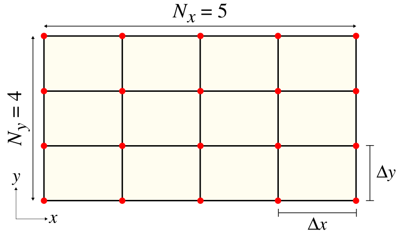

---
# Python User Interface
---

This page is a listing of the functions exposed by the Python interface. For a gentler introduction, see [Tutorial/Basics](Python_Tutorials/Basics.md). Note that this page is not a complete listing of all functions. In particular, because of the [SWIG wrappers](#swig-wrappers), every function in the C++ interface is accessible from the Python module, but not all of these functions are documented or intended for end users. See also the instructions for [Parallel Meep](Parallel_Meep.md).

The Python API functions and classes can be found in the `meep` module, which should be installed in your Python system by Meep's `make install` script. If you installed into a nonstandard location (e.g. your home directory), you may need to set the `PYTHONPATH` environment variable as documented in [Building From Source](Build_From_Source.md#building-from-source). You typically import the `meep` module in Python via `import meep as mp`.

[TOC]


Predefined Variables
--------------------

These are available directly via the `meep` package.

**`air`, `vacuum` [`Medium` class ]**
—
Two aliases for a predefined material type with a dielectric constant of 1.

**`perfect_electric_conductor` or `metal` [`Medium` class ]**
—
A predefined material type corresponding to a perfect electric conductor at the boundary of which the parallel electric field is zero. Technically, $\varepsilon = -\infty$.

**`perfect_magnetic_conductor` [`Medium` class ]**
—
A predefined material type corresponding to a perfect magnetic conductor at the boundary of which the parallel magnetic field is zero. Technically, $\mu = -\infty$.

**`inf` [`number`]**
—
A big number (10<sup>20</sup>) to use for "infinite" dimensions of objects.

Constants (Enumerated Types)
----------------------------

Several of the functions/classes in Meep ask you to specify e.g. a field component or a direction in the grid. These should be one of the following constants (which are available directly via the `meep` package):

**`direction` constants**
—
Specify a direction in the grid. One of `X`, `Y`, `Z`, `R`, `P` for $x$, $y$, $z$, $r$, $\phi$, respectively.

**`side` constants**
—
Specify particular boundary in the positive `High` (e.g., +`X`) or negative `Low` (e.g., -`X`) direction.

**`boundary_condition` constants**
—
`Metallic` (i.e., zero electric field) or `Magnetic` (i.e., zero magnetic field).

**`component` constants**
—
Specify a particular field or other component. One of `Ex`, `Ey`, `Ez`, `Er`, `Ep`, `Hx`, `Hy`, `Hz`, `Hy`, `Hp`, `Hz`, `Bx`, `By`, `Bz`, `By`, `Bp`, `Bz`, `Dx`, `Dy`, `Dz`, `Dr`, `Dp`, `Dielectric`, `Permeability`, for $E_x$, $E_y$, $E_z$, $E_r$, $E_\phi$, $H_x$, $H_y$, $H_z$, $H_r$, $H_\phi$, $B_x$, $B_y$, $B_z$, $B_r$, $B_\phi$, $D_x$, $D_y$, $D_z$, $D_r$, $D_\phi$, ε, μ, respectively.

**`derived_component` constants**
—
These are additional components which are not actually stored by Meep but are computed as needed, mainly for use in output functions. One of `Sx`, `Sy`, `Sz`, `Sr`, `Sp`, `EnergyDensity`, `D_EnergyDensity`, `H_EnergyDensity` for $S_x$, $S_y$, $S_z$, $S_r$, $S_\phi$ (components of the Poynting vector $\mathrm{Re}\,\mathbf{E}^* \times \mathbf{H}$), $(\mathbf{E}^* \cdot \mathbf{D} + \mathbf{H}^* \cdot \mathbf{B})/2$, $\mathbf{E}^* \cdot \mathbf{D}/2$, $\mathbf{H}^* \cdot \mathbf{B}/2$, respectively.


The Simulation Class
---------------------

The `Simulation` class is the primary abstraction of the high-level interface. Minimally, a simulation script amounts to passing the desired keyword arguments to the `Simulation` constructor and calling the `run` method on the resulting instance.


---
<a id="Simulation"></a>

### Simulation

```python
class Simulation(object):
```

<div class="class_docstring" markdown="1">

The `Simulation` [class](#classes) contains all the attributes that you can set to
control various parameters of the Meep computation.

</div>


   
<a id="Simulation.__init__"></a>

<div class="class_members" markdown="1">

```python
def __init__(self,
             cell_size: Union[meep.geom.Vector3, Tuple[float, ...], NoneType] = None,
             resolution: float = None,
             geometry: Optional[List[meep.geom.GeometricObject]] = None,
             sources: Optional[List[meep.source.Source]] = None,
             eps_averaging: bool = True,
             dimensions: int = 3,
             boundary_layers: Optional[List[meep.simulation.PML]] = None,
             symmetries: Optional[List[meep.simulation.Symmetry]] = None,
             force_complex_fields: bool = False,
             default_material: meep.geom.Medium = Medium(),
             m: float = 0,
             k_point: Union[meep.geom.Vector3, Tuple[float, ...], bool] = False,
             kz_2d: str = 'complex',
             extra_materials: Optional[List[meep.geom.Medium]] = None,
             material_function: Optional[Callable[[Union[meep.geom.Vector3, Tuple[float, ...]]], meep.geom.Medium]] = None,
             epsilon_func: Optional[Callable[[Union[meep.geom.Vector3, Tuple[float, ...]]], float]] = None,
             epsilon_input_file: str = '',
             progress_interval: float = 4,
             subpixel_tol: float = 0.0001,
             subpixel_maxeval: int = 100000,
             loop_tile_base_db: int = 0,
             loop_tile_base_eh: int = 0,
             ensure_periodicity: bool = True,
             num_chunks: int = 0,
             Courant: float = 0.5,
             accurate_fields_near_cylorigin: bool = False,
             filename_prefix: Optional[str] = None,
             output_volume: Optional[meep.simulation.Volume] = None,
             output_single_precision: bool = False,
             geometry_center: Union[meep.geom.Vector3, Tuple[float, ...]] = Vector3<0.0, 0.0, 0.0>,
             force_all_components: bool = False,
             split_chunks_evenly: bool = True,
             chunk_layout=None,
             collect_stats: bool = False):
```

<div class="method_docstring" markdown="1">

All `Simulation` attributes are described in further detail below. In brackets
after each variable is the type of value that it should hold. The classes, complex
datatypes like `GeometricObject`, are described in a later subsection. The basic
datatypes, like `integer`, `boolean`, `complex`, and `string` are defined by
Python. `Vector3` is a `meep` class.

+ **`geometry` [ list of `GeometricObject` class ]** — Specifies the geometric
  objects making up the structure being simulated. When objects overlap, later
  objects in the list take precedence. Defaults to no objects (empty list).

+ **`geometry_center` [ `Vector3` class ]** — Specifies the coordinates of the
  center of the cell. Defaults to (0, 0, 0), but changing this allows you to shift
  the coordinate system used in Meep (for example, to put the origin at the
  corner).  Passing `geometry_center=c` is equivalent to adding the `c` vector to
  the coordinates of every other object in the simulation, i.e. `c` becomes the
  new origin that other objects are defined with respect to.

+ **`sources` [ list of `Source` class ]** — Specifies the current sources to be
  present in the simulation. Defaults to none (empty list).

+ **`symmetries` [ list of `Symmetry` class ]** — Specifies the spatial symmetries
  (mirror or rotation) to exploit in the simulation. Defaults to none (empty
  list). The symmetries must be obeyed by *both* the structure and the sources.
  See also [Exploiting Symmetry](Exploiting_Symmetry.md).

+ **`boundary_layers` [ list of `PML` class ]** — Specifies the
  [PML](Perfectly_Matched_Layer.md) absorbing boundary layers to use. Defaults to
  none (empty list).

+ **`cell_size` [ `Vector3` ]** — Specifies the size of the cell which is centered
  on the origin of the coordinate system. Any sizes of 0 imply a
  reduced-dimensionality calculation. Strictly speaking, the dielectric function
  is taken to be uniform along that dimension. A 2d calculation is especially
  optimized. See `dimensions` below. **Note:** because Maxwell's equations are
  scale invariant, you can use any units of distance you want to specify the cell
  size: nanometers, microns, centimeters, etc. However, it is usually convenient
  to pick some characteristic lengthscale of your problem and set that length to 1.
  See also [Units](Introduction.md#units-in-meep). Required argument (no default).

+ **`default_material` [`Medium` class ]** — Holds the default material that is
  used for points not in any object of the geometry list. Defaults to `air` (ε=1).
  This can also be a NumPy array that defines a dielectric function much like
  `epsilon_input_file` below (see below). If you want to use a material function
  as the default material, use the `material_function` keyword argument (below).

+ **`material_function` [ function ]** — A Python function that takes a `Vector3`
  and returns a `Medium`. See also [Material Function](#medium).
  Defaults to `None`.

+ **`epsilon_func` [ function ]** — A Python function that takes a `Vector3` and
  returns the dielectric constant at that point. See also [Material
  Function](#medium). Defaults to `None`.

+ **`epsilon_input_file` [`string`]** — If this string is not empty (the default),
  then it should be the name of an HDF5 file whose first/only dataset defines a
  scalar, real-valued, frequency-independent dielectric function over some
  discrete grid. Alternatively, the dataset name can be specified explicitly if
  the string is in the form "filename:dataset". This dielectric function is then
  used in place of the ε property of `default_material` (i.e. where there are no
  `geometry` objects). The grid of the epsilon file dataset need *not* match the
  computational grid; it is scaled and/or linearly interpolated as needed to map
  the file onto the cell. The structure is warped if the proportions of the grids
  do not match. **Note:** the file contents only override the ε property of the
  `default_material`, whereas other properties (μ, susceptibilities,
  nonlinearities, etc.) of `default_material` are still used.

+ **`dimensions` [`integer`]** — Explicitly specifies the dimensionality of the
  simulation, if the value is less than 3. If the value is 3 (the default), then
  the dimensions are automatically reduced to 2 if possible when `cell_size` in
  the $z$ direction is `0`. If `dimensions` is the special value of `CYLINDRICAL`,
  then cylindrical coordinates are used and the $x$ and $z$ dimensions are
  interpreted as $r$ and $z$, respectively. If `dimensions` is 1, then the cell
  must be along the $z$ direction and only $E_x$ and $H_y$ field components are
  permitted. If `dimensions` is 2, then the cell must be in the $xy$ plane.

+ **`m` [`number`]** — For `CYLINDRICAL` simulations, specifies that the angular
  $\phi$ dependence of the fields is of the form $e^{im\phi}$ (default is `m=0`).
  If the simulation cell includes the origin $r=0$, then `m` must be an integer.

+ **`accurate_fields_near_cylorigin` [`boolean`]** — For `CYLINDRICAL` simulations
  with |*m*| &gt; 1, compute more accurate fields near the origin $r=0$ at the
  expense of requiring a smaller Courant factor. Empirically, when this option is
  set to `True`, a Courant factor of roughly $\min[0.5, 1 / (|m| + 0.5)]$ or
  smaller seems to be needed. Default is `False`, in which case the $D_r$, $D_z$,
  and $B_r$ fields within |*m*| pixels of the origin are forced to zero, which
  usually ensures stability with the default Courant factor of 0.5, at the expense
  of slowing convergence of the fields near $r=0$.

+ **`resolution` [`number`]** — Specifies the computational grid resolution in
  pixels per distance unit. Required argument. No default.

+ **`k_point` [`False` or `Vector3`]** — If `False` (the default), then the
  boundaries are perfect metallic (zero electric field). If a `Vector3`, then the
  boundaries are Bloch-periodic: the fields at one side are
  $\exp(i\mathbf{k}\cdot\mathbf{R})$ times the fields at the other side, separated
  by the lattice vector $\mathbf{R}$. A non-zero `Vector3` will produce complex
  fields. The `k_point` vector is specified in Cartesian coordinates in units of
  2π/distance. Note: this is *different* from [MPB](https://mpb.readthedocs.io),
  equivalent to taking MPB's `k_points` through its function
  `reciprocal->cartesian`.

+ **`kz_2d` [`"complex"`, `"real/imag"`, or `"3d"`]** — A 2d cell (i.e.,
  `dimensions=2`) combined with a `k_point` that has a *non-zero* component in $z$
  would normally result in a 3d simulation with complex fields. However, by
  default (`kz_2d="complex"`), Meep will use a 2d computational cell in which
  $k_z$ is incorporated as an additional term in Maxwell's equations, which still
  results in complex fields but greatly improved performance. Setting `kz_2d="3d"`
  will instead use a 3d cell that is one pixel thick (with Bloch-periodic boundary
  conditions), which is considerably more expensive. The third possibility,
  `kz_2d="real/imag"`, saves an additional factor of two by storing some field
  components as purely real and some as purely imaginary in a "real" field, but
  this option requires some care to use. See [2d Cell with Out-of-Plane
  Wavevector](2d_Cell_Special_kz.md).

+ **`ensure_periodicity` [`boolean`]** — If `True` (the default) *and* if the
  boundary conditions are periodic (`k_point` is not `False`), then the geometric
  objects are automatically repeated periodically according to the lattice vectors
  which define the size of the cell.

+ **`eps_averaging` [`boolean`]** — If `True` (the default), then [subpixel
  averaging](Subpixel_Smoothing.md) is used when initializing the dielectric
  function. For simulations involving a [material function](#medium),
  `eps_averaging` is `False` (the default) and must be
  [enabled](Subpixel_Smoothing.md#enabling-averaging-for-material-function) in
  which case the input variables `subpixel_maxeval` (default 10<sup>4</sup>) and
  `subpixel_tol` (default 10<sup>-4</sup>) specify the maximum number of function
  evaluations and the integration tolerance for the adaptive numerical
  integration. Increasing/decreasing these, respectively, will cause a more
  accurate but slower computation of the average ε with diminishing returns for
  the actual FDTD error. Disabling subpixel averaging will lead to [staircasing
  effects and irregular
  convergence](Subpixel_Smoothing.md#what-happens-when-subpixel-smoothing-is-disabled).

+ **`force_complex_fields` [`boolean`]** — By default, Meep runs its simulations
  with purely real fields whenever possible. It uses complex fields which require
  twice the memory and computation if the `k_point` is non-zero or if `m` is
  non-zero. However, by setting `force_complex_fields` to `True`, Meep will always
  use complex fields.

+ **`force_all_components` [`boolean`]** — By default, in a 2d simulation Meep
  uses only the field components that might excited by your current sources:
  either the in-plane $(E_x,E_y,H_z)$ or out-of-plane $(H_x,H_y,E_z)$ polarization,
  depending on the source.  (Both polarizations are excited if you use multiple source
  polarizations, or if an anisotropic medium is present that couples the two
  polarizations.)   In rare cases (primarily for combining results of multiple
  simulations with differing polarizations), you might want to force it to
  simulate all fields, even those that remain zero throughout the simulation, by
  setting `force_all_components` to `True`.

+ **`filename_prefix` [`string`]** — A string prepended to all output filenames
  (e.g., for HDF5 files). If `None` (the default), then Meep constructs a default
  prefix based on the current Python filename ".py" replaced by "-" (e.g. `foo.py`
  uses a `"foo-"` prefix). You can get this prefix by calling `get_filename_prefix`.

+ **`Courant` [`number`]** — Specify the
  [Courant factor](https://en.wikipedia.org/wiki/Courant%E2%80%93Friedrichs%E2%80%93Lewy_condition)
  $S$ which relates the time step size to the spatial discretization: $cΔ t = SΔ x$.
  Default is 0.5. For numerical stability, the Courant factor must be *at
  most* $n_\textrm{min}/\sqrt{\textrm{# dimensions}}$, where $n_\textrm{min}$ is
  the minimum refractive index (usually 1), and in practice $S$ should be slightly
  smaller.

+ **`loop_tile_base_db`, `loop_tile_base_eh` [`number`]** — To improve the [memory locality](https://en.wikipedia.org/wiki/Locality_of_reference)
  of the field updates, Meep has an experimental feature to "tile" the loops over the Yee grid
  voxels. The splitting of the update loops for step-curl and update-eh into tiles or subdomains
  involves a recursive-bisection method in which the base case for the number of voxels is
  specified using these two parameters, respectively. The default value is 0 or no tiling;
  a typical nonzero value to try would be 10000.

+ **`output_volume` [`Volume` class ]** — Specifies the default region of space
  that is output by the HDF5 output functions (below); see also the `Volume` class
  which manages `meep::volume*` objects. Default is `None`, which means that the
  whole cell is output. Normally, you should use the `in_volume(...)` function to
  modify the output volume instead of setting `output_volume` directly.

+ **`output_single_precision` [`boolean`]** — Meep performs its computations in
  [double-precision floating point](Build_From_Source.md#floating-point-precision-of-the-fields-and-materials-arrays),
  and by default its output HDF5 files are in the same format. However, by setting
  this variable to `True` (default is `False`) you can instead output in single
  precision which saves a factor of two in space.

+ **`progress_interval` [`number`]** — Time interval (seconds) after which Meep
  prints a progress message. Default is 4 seconds.

+ **`extra_materials` [ list of `Medium` class ]** — By default, Meep turns off
  support for material dispersion ([susceptibilities](#susceptibility) or
  [conductivity](Materials.md#conductivity-and-complex)) or nonlinearities if none
  of the objects in `geometry` have materials with these properties &mdash; since
  they are not needed, it is faster to omit their calculation. This doesn't work,
  however, if you use a `material_function`: materials via a user-specified
  function of position instead of just geometric objects. If your material
  function only returns a nonlinear material, for example, Meep won't notice this
  unless you tell it explicitly via `extra_materials`. `extra_materials` is a list
  of materials that Meep should look for in the cell in addition to any materials
  that are specified by geometric objects. You should list any materials other
  than scalar dielectrics that are returned by `material_function` here.

+ **`chunk_layout` [`string` or `Simulation` instance or `BinaryPartition` class]** —
  This will cause the `Simulation` to use the chunk layout described by either
  (1) an `.h5` file (created using `Simulation.dump_chunk_layout`), (2) another
  `Simulation` instance, or (3) a [`BinaryPartition`](#binarypartition) class object.
  For more information, see [Load and Dump Structure](#load-and-dump-structure) and
  [Parallel Meep/User-Specified Cell Partition](Parallel_Meep.md#user-specified-cell-partition).

The following require a bit more understanding of the inner workings of Meep to
use. See also [SWIG Wrappers](#swig-wrappers).

+ **`structure` [`meep::structure*`]** — Pointer to the current structure being
  simulated; initialized by `_init_structure` which is called automatically by
  `init_sim()` which is called automatically by any of the [run
  functions](#run-functions). The structure initialization is handled by the
  `Simulation` class, and most users will not need to call `_init_structure`.

+ **`fields` [`meep::fields*`]** — Pointer to the current fields being simulated;
  initialized by `init_sim()` which is called automatically by any of the [run
  functions](#run-functions).

+ **`num_chunks` [`integer`]** — Minimum number of "chunks" (subregions) to divide
  the structure/fields into. Overrides the default value determined by
  the number of processors, PML layers, etcetera. Mainly useful for debugging.

+ **`split_chunks_evenly` [`boolean`]** — When `True` (the default), the work per
  [chunk](Chunks_and_Symmetry.md) is not taken into account when splitting chunks
  up for multiple processors. The cell is simply split up into equal chunks (with
  the exception of PML regions, which must be on their own chunk). When `False`,
  Meep attempts to allocate an equal amount of work to each processor, which can
  increase the performance of [parallel simulations](Parallel_Meep.md).

</div>

</div>
   
<a id="Simulation.run"></a>

<div class="class_members" markdown="1">

```python
def run(self, *step_funcs, **kwargs):
def run(step_functions..., until=condition/time):
def run(step_functions..., until_after_sources=condition/time):
```

<div class="method_docstring" markdown="1">

`run(step_functions..., until=condition/time)`

Run the simulation until a certain time or condition, calling the given step
functions (if any) at each timestep. The keyword argument `until` is *either* a
number, in which case it is an additional time (in Meep units) to run for, *or* it
is a function (of no arguments) which returns `True` when the simulation should
stop. `until` can also be a list of stopping conditions which may include a number
of additional functions.

`run(step_functions..., until_after_sources=condition/time)`

Run the simulation until all sources have turned off, calling the given step
functions (if any) at each timestep. The keyword argument `until_after_sources` is
either a number, in which case it is an *additional* time (in Meep units) to run
for after the sources are off, *or* it is a function (of no arguments). In the
latter case, the simulation runs until the sources are off *and* `condition`
returns `True`. Like `until` above, `until_after_sources` can take a list of
stopping conditions.

</div>

</div>


### Output File Names

The output filenames used by Meep, e.g. for HDF5 files, are automatically prefixed by the
input variable `filename_prefix`. If `filename_prefix` is `None` (the default), however,
then Meep constructs a default prefix based on the current Python filename with `".py"`
replaced by `"-"`: e.g. `test.py` implies a prefix of `"test-"`. You can get this prefix,
or set the output folder, with these methods of the `Simulation` class:


<a id="Simulation.get_filename_prefix"></a>

<div class="class_members" markdown="1">

```python
def get_filename_prefix(self):
```

<div class="method_docstring" markdown="1">

Return the current prefix string that is prepended, by default, to all file names.

If you don't want to use any prefix, then you should set `filename_prefix` to the
empty string `''`.

In addition to the filename prefix, you can also specify that all the output files
be written into a newly-created directory (if it does not yet exist). This is done
by calling `Simulation.use_output_directory([dirname])`

</div>

</div>

<a id="Simulation.use_output_directory"></a>

<div class="class_members" markdown="1">

```python
def use_output_directory(self, dname=''):
```

<div class="method_docstring" markdown="1">

Output all files into a subdirectory, which is created if necessary. If the optional
argument `dname` is specified, that is the name of the directory. If `dname`
is omitted and `filename_prefix` is `None`, the directory name is the current Python
filename with `".py"` replaced by `"-out"`: e.g. `test.py` implies a directory of
`"test-out"`. If `dname` is omitted and `filename_prefix` has been set, the directory
name is set to `filename_prefix` + "-out" and `filename_prefix` is then reset to `None`.

</div>

</div>


### Simulation Time

The `Simulation` class provides the following time-related methods:


<a id="Simulation.meep_time"></a>

<div class="class_members" markdown="1">

```python
def meep_time(self):
```

<div class="method_docstring" markdown="1">

Return the current simulation time in simulation time units (e.g. during a run
function). This is not the wall-clock time.

Occasionally, e.g. for termination conditions of the form $time < T?$, it is
desirable to round the time to single precision in order to avoid small
differences in roundoff error from making your results different by one timestep
from machine to machine (a difference much bigger than roundoff error); in this
case you can call `Simulation.round_time()` instead, which returns the time
rounded to single precision.

</div>

</div>

<a id="Simulation.print_times"></a>

<div class="class_members" markdown="1">

```python
def print_times(self):
```

<div class="method_docstring" markdown="1">

Call after running a simulation to print the times spent on various types of work.
Example output:

```
Field time usage:
        connecting chunks: 0.0156826 s +/- 0.002525 s
            time stepping: 0.996411 s +/- 0.232147 s
       copying boundaries: 0.148588 s +/- 0.0390397 s
    all-all communication: 1.39423 s +/- 0.581098 s
        1-1 communication: 0.136174 s +/- 0.0107685 s
     Fourier transforming: 0.0321625 s +/- 0.0614168 s
          MPB mode solver: 0.348019 s +/- 0.370068 s
          everything else: 0.207387 s +/- 0.0164821 s
```

</div>

</div>

<a id="Simulation.time_spent_on"></a>

<div class="class_members" markdown="1">

```python
def time_spent_on(self, time_sink):
```

<div class="method_docstring" markdown="1">

Return a list of times spent by each process for a type of work `time_sink` which
is the same as for `mean_time_spent_on`.

</div>

</div>

<a id="Simulation.mean_time_spent_on"></a>

<div class="class_members" markdown="1">

```python
def mean_time_spent_on(self, time_sink):
```

<div class="method_docstring" markdown="1">

Return the mean time spent by all processes for a type of work `time_sink` which
can be one of the following integer constants: `0`: "time stepping", `1`: "connecting chunks",
`2`: "copying boundaries", `3`: "all-all communication", `4`: "1-1 communication",
`5`: "outputting fields", `6`: "Fourier transforming", `7`: "MPB mode solver",
`8`: "near-to-far-field transform", `9`: "updating B field", `10`: "updating H field",
`11`: "updating D field", `12`: "updating E field", `13`: "boundary stepping B",
`14`: "boundary stepping WH", `15`: "boundary stepping PH", `16`: "boundary stepping H",
`17`: "boundary stepping D", `18`: "boundary stepping WE", `19`: "boundary stepping PE",
`20`: "boundary stepping E", `21`: "everything else".

</div>

</div>

<a id="Simulation.output_times"></a>

<div class="class_members" markdown="1">

```python
def output_times(self, fname):
```

<div class="method_docstring" markdown="1">

Call after running a simulation to output to a file with filename `fname` the
times spent on various types of work as CSV (comma separated values) with headers
for each column and one row per process.

</div>

</div>

### Field Computations

Meep supports a large number of functions to perform computations on the fields. Most of them are accessed via the lower-level C++/SWIG interface. Some of them are based on the following simpler, higher-level versions. They are accessible as methods of a `Simulation` instance.


<a id="Simulation.set_boundary"></a>

<div class="class_members" markdown="1">

```python
def set_boundary(self, side, direction, condition):
```

<div class="method_docstring" markdown="1">

Sets the condition of the boundary on the specified side in the specified
direction. See the [Constants (Enumerated Types)](#constants-enumerated-types)
section for valid `side`, `direction`, and `boundary_condition` values.

</div>

</div>

<a id="Simulation.phase_in_material"></a>

<div class="class_members" markdown="1">

```python
def phase_in_material(self, structure, time):
```

<div class="method_docstring" markdown="1">

`newstructure` should be the `structure` field of another
`Simulation` object with the same cell size and resolution.
Over the next time period `phasetime` (in the current
simulation's time units), the current structure
($\varepsilon$, $\mu$, and conductivity $\sigma_D$) will be
gradually changed to `newstructure`. In particular, at each
timestep it linearly interpolates between the old structure
and the new structure. After `phasetime` has elapsed, the
structure will remain equal to `newstructure`. This is
demonstrated in the following image for two
[Cylinder](#cylinder) objects (the simulation script is in
[examples/phase_in_material.py](https://github.com/NanoComp/meep/blob/master/python/examples/phase_in_material.py)).


</div>

</div>

<a id="Simulation.get_field_point"></a>

<div class="class_members" markdown="1">

```python
def get_field_point(self, c, pt):
```

<div class="method_docstring" markdown="1">

Given a `component` or `derived_component` constant `c` and a `Vector3` `pt`,
returns the value of that component at that point.

</div>

</div>

<a id="Simulation.get_epsilon_point"></a>

<div class="class_members" markdown="1">

```python
def get_epsilon_point(self, pt, frequency=0):
```

<div class="method_docstring" markdown="1">

Given a frequency `frequency` and a `Vector3` `pt`, returns the average eigenvalue
of the permittivity tensor at that location and frequency. If `frequency` is
non-zero, the result is complex valued; otherwise it is the real,
frequency-independent part of $\varepsilon$ (the $\omega\to\infty$ limit).

</div>

</div>

<a id="Simulation.get_mu_point"></a>

<div class="class_members" markdown="1">

```python
def get_mu_point(self, pt, frequency=0):
```

<div class="method_docstring" markdown="1">

Given a frequency `frequency` and a `Vector3` `pt`, returns the average eigenvalue
of the permeability tensor at that location and frequency. If `frequency` is
non-zero, the result is complex valued; otherwise it is the real,
frequency-independent part of $\mu$ (the $\omega\to\infty$ limit).

</div>

</div>

<a id="Simulation.get_epsilon_grid"></a>

<div class="class_members" markdown="1">

```python
def get_epsilon_grid(self,
                     xtics=None,
                     ytics=None,
                     ztics=None,
                     frequency=0):
```

<div class="method_docstring" markdown="1">

Given three 1d NumPy arrays (`xtics`,`ytics`,`ztics`) which define the coordinates of a Cartesian
grid anywhere within the cell volume, compute the trace of the $\varepsilon(f)$ tensor at frequency
$f$ (in Meep units) from the `geometry` exactly at each grid point. `frequency` defaults to 0 which is
the instantaneous $\varepsilon$. (For [`MaterialGrid`](#materialgrid)s, the $\varepsilon$ at each
grid point is computed using bilinear interpolation from the nearest `MaterialGrid` points and possibly
also projected to form a level set.) Note that this is different from `get_epsilon_point` which computes
$\varepsilon$ by bilinearly interpolating from the nearest Yee grid points. This function is useful for
sampling the material geometry to any arbitrary resolution. The return value is a NumPy array with shape
equivalent to `numpy.meshgrid(xtics,ytics,ztics)`. Empty dimensions are collapsed.

</div>

</div>

<a id="Simulation.initialize_field"></a>

<div class="class_members" markdown="1">

```python
def initialize_field(self, cmpnt, amp_func):
```

<div class="method_docstring" markdown="1">

Initialize the component `c` fields using the function `func` which has a single
argument, a `Vector3` giving a position and returns a complex number for the value
of the field at that point.

</div>

</div>

<a id="Simulation.add_dft_fields"></a>

<div class="class_members" markdown="1">

```python
def add_dft_fields(self, *args, **kwargs):
def add_dft_fields(cs, fcen, df, nfreq, freq, where=None, center=None, size=None, yee_grid=False, decimation_factor=0):
```

<div class="method_docstring" markdown="1">


Given a list of field components `cs`, compute the Fourier transform of these
fields for `nfreq` equally spaced frequencies covering the frequency range
`fcen-df/2` to `fcen+df/2` or an array/list `freq` for arbitrarily spaced
frequencies over the `Volume` specified by `where` (default to the entire cell).
The volume can also be specified via the `center` and `size` arguments. The
default routine interpolates the Fourier-transformed fields at the center of each
voxel within the specified volume. Alternatively, the exact Fourier-transformed
fields evaluated at each corresponding Yee grid point is available by setting
`yee_grid` to `True`. To reduce the memory-bandwidth burden of accumulating
DFT fields, an integer `decimation_factor` can be specified for updating the DFT
fields at every `decimation_factor` timesteps. If `decimation_factor` is 0 (the default),
this value is automatically determined from the
[Nyquist rate](https://en.wikipedia.org/wiki/Nyquist_rate) of the bandwidth-limited
sources and this DFT monitor. It can be turned off by setting it to 1. Use this feature
with care, as the decimated timeseries may be corrupted by
[aliasing](https://en.wikipedia.org/wiki/Aliasing) of high frequencies.

</div>

</div>

<a id="Simulation.flux_in_box"></a>

<div class="class_members" markdown="1">

```python
def flux_in_box(self, d, box=None, center=None, size=None):
```

<div class="method_docstring" markdown="1">

Given a `direction` constant, and a `mp.Volume`, returns the flux (the integral of
$\Re [\mathbf{E}^* \times \mathbf{H}]$) in that volume. Most commonly, you specify
a volume that is a plane or a line, and a direction perpendicular to it, e.g.

`flux_in_box(d=mp.X,mp.Volume(center=mp.Vector3(0,0,0),size=mp.Vector3(0,1,1)))`

If the `center` and `size` arguments are provided instead of `box`, Meep will
construct the appropriate volume for you.

</div>

</div>

<a id="Simulation.electric_energy_in_box"></a>

<div class="class_members" markdown="1">

```python
def electric_energy_in_box(self, box=None, center=None, size=None):
```

<div class="method_docstring" markdown="1">

Given a `mp.Volume`, returns the integral of the electric-field energy
$\mathbf{E}^* \cdot \mathbf{D}/2$ in the given volume. If the volume has zero size
along a dimension, a lower-dimensional integral is used. If the `center` and
`size` arguments are provided instead of `box`, Meep will construct the
appropriate volume for you. Note: in cylindrical coordinates $(r,\phi,z)$, the
integrand is
[multiplied](https://en.wikipedia.org/wiki/Cylindrical_coordinate_system#Line_and_volume_elements)
by the circumference $2\pi r$, or equivalently the integral is over an annular
volume.

</div>

</div>

<a id="Simulation.magnetic_energy_in_box"></a>

<div class="class_members" markdown="1">

```python
def magnetic_energy_in_box(self, box=None, center=None, size=None):
```

<div class="method_docstring" markdown="1">

Given a `mp.Volume`, returns the integral of the magnetic-field energy
$\mathbf{H}^* \cdot \mathbf{B}/2$ in the given volume. If the volume has zero size
along a dimension, a lower-dimensional integral is used. If the `center` and
`size` arguments are provided instead of `box`, Meep will construct the
appropriate volume for you. Note: in cylindrical coordinates $(r,\phi,z)$, the
integrand is
[multiplied](https://en.wikipedia.org/wiki/Cylindrical_coordinate_system#Line_and_volume_elements)
by the circumference $2\pi r$, or equivalently the integral is over an annular
volume.

</div>

</div>

<a id="Simulation.field_energy_in_box"></a>

<div class="class_members" markdown="1">

```python
def field_energy_in_box(self, box=None, center=None, size=None):
```

<div class="method_docstring" markdown="1">

Given a `mp.Volume`, returns the integral of the electric- and magnetic-field
energy $\mathbf{E}^* \cdot \mathbf{D}/2 + \mathbf{H}^* \cdot \mathbf{B}/2$ in the
given volume. If the volume has zero size along a dimension, a lower-dimensional
integral is used. If the `center` and `size` arguments are provided instead of
`box`, Meep will construct the appropriate volume for you. Note: in cylindrical
coordinates $(r,\phi,z)$, the integrand is
[multiplied](https://en.wikipedia.org/wiki/Cylindrical_coordinate_system#Line_and_volume_elements)
by the circumference $2\pi r$, or equivalently the integral is over an annular
volume.

</div>

</div>

<a id="Simulation.modal_volume_in_box"></a>

<div class="class_members" markdown="1">

```python
def modal_volume_in_box(self, box=None, center=None, size=None):
```

<div class="method_docstring" markdown="1">

Given a `mp.Volume`, returns the instantaneous modal volume
according to the Purcell-effect definition:
$\left(\int\varepsilon|\mathbf{E}|^2\right)/\left(\max{\varepsilon|\mathbf{E}|^2}\right)$.
If no volume argument is provided, the entire cell is used by
default. If the `center` and `size` arguments are provided
instead of `box`, Meep will construct the appropriate volume
for you.

Note that if you are at a fixed frequency and you use complex fields (via
Bloch-periodic boundary conditions or `fields_complex=True`), then one half of the
flux or energy integrals above corresponds to the time average of the flux or
energy for a simulation with real fields.

Often, you want the integration box to be the entire cell. A useful function to
return this box, which you can then use for the `box` arguments above, is
`Simulation.total_volume()`.

One versatile feature is that you can supply an arbitrary function
$f(\mathbf{x},c_1,c_2,\ldots)$ of position $\mathbf{x}$ and various field
components $c_1,\ldots$ and ask Meep to integrate it over a given volume, find its
maximum, or output it (via `output_field_function`, described later). This is done
via the functions:

</div>

</div>

<a id="Simulation.integrate_field_function"></a>

<div class="class_members" markdown="1">

```python
def integrate_field_function(self,
                             cs,
                             func,
                             where=None,
                             center=None,
                             size=None):
```

<div class="method_docstring" markdown="1">

Returns the integral of the complex-valued function `func` over the `Volume`
specified by `where` (defaults to entire cell) for the `meep::fields` contained in
the `Simulation` instance that calls this method. `func` is a function of position
(a `Vector3`, its first argument) and zero or more field components specified by
`cs`: a list of `component` constants. `func` can be real- or complex-valued. The
volume can optionally be specified via the `center` and `size` arguments.

If any dimension of `where` is zero, that dimension is not integrated over. In
this way you can specify 1d, 2d, or 3d integrals.

Note: in cylindrical coordinates $(r,\phi,z)$, the integrand is
[multiplied](https://en.wikipedia.org/wiki/Cylindrical_coordinate_system#Line_and_volume_elements)
by the circumference $2\pi r$, or equivalently the integral is over an annular
volume.

</div>

</div>

<a id="Simulation.max_abs_field_function"></a>

<div class="class_members" markdown="1">

```python
def max_abs_field_function(self,
                           cs,
                           func,
                           where=None,
                           center=None,
                           size=None):
```

<div class="method_docstring" markdown="1">

As `integrate_field_function`, but returns the maximum absolute value of `func` in
the volume `where` instead of its integral.

The integration is performed by summing over the grid points with a simple
trapezoidal rule, and the maximum is similarly over the grid points. See [Field
Functions](Field_Functions.md) for examples of how to call
`integrate_field_function` and `max_abs_field_function`. See [Synchronizing the
Magnetic and Electric Fields](Synchronizing_the_Magnetic_and_Electric_Fields.md)
if you want to do computations combining the electric and magnetic fields. The
volume can optionally be specified via the `center` and `size` arguments.

Occasionally, one wants to compute an integral that combines fields from two
separate simulations (e.g. for nonlinear coupled-mode calculations). This
functionality is supported in Meep, as long as the two simulations have the *same*
cell, the same resolution, the same boundary conditions and symmetries (if any),
and the same PML layers (if any).

</div>

</div>

<a id="Simulation.integrate2_field_function"></a>

<div class="class_members" markdown="1">

```python
def integrate2_field_function(self,
                              fields2,
                              cs1,
                              cs2,
                              func,
                              where=None,
                              center=None,
                              size=None):
```

<div class="method_docstring" markdown="1">

Similar to `integrate_field_function`, but takes additional parameters `fields2`
and `cs2`. `fields2` is a `meep::fields*` object similar to the global `fields`
variable (see below) specifying the fields from another simulation. `cs1` is a
list of components to integrate with from the `meep::fields` instance in
`Simulation.fields`, as for `integrate_field_function`, while `cs2` is a list of
components to integrate from `fields2`. Similar to `integrate_field_function`,
`func` is a function that returns an number given arguments consisting of: the
position vector, followed by the values of the components specified by `cs1` (in
order), followed by the values of the components specified by `cs2` (in order).
The volume can optionally be specified via the `center` and `size` arguments.

To get two fields in memory at once for `integrate2_field_function`, the easiest
way is to run one simulation within a given Python file, then save the results in
another fields variable, then run a second simulation. This would look something
like:

```py
...set up and run first simulation...
fields2 = sim.fields # save the fields in a variable
sim.fields = None    # prevent the fields from getting deallocated by reset-meep
sim.reset_meep()
...set up and run second simulation...
```

It is also possible to timestep both fields simultaneously (e.g. doing one
timestep of one simulation then one timestep of another simulation, and so on, but
this requires you to call much lower-level functions like `fields_step()`.

</div>

</div>


### Reloading Parameters

Once the fields/simulation have been initialized, you can change the values of various parameters by using the following functions (which are members of the `Simulation` class):


<a id="Simulation.reset_meep"></a>

<div class="class_members" markdown="1">

```python
def reset_meep(self):
```

<div class="method_docstring" markdown="1">

Reset all of Meep's parameters, deleting the fields, structures, etcetera, from
memory as if you had not run any computations. If the `num_chunks` or `chunk_layout`
attributes have been modified internally, they are reset to their original
values passed in at instantiation.

</div>

</div>

<a id="Simulation.restart_fields"></a>

<div class="class_members" markdown="1">

```python
def restart_fields(self):
```

<div class="method_docstring" markdown="1">

Restart the fields at time zero, with zero fields. Does *not* reset the Fourier
transforms of the flux planes, which continue to be accumulated.

</div>

</div>

<a id="Simulation.change_k_point"></a>

<div class="class_members" markdown="1">

```python
def change_k_point(self, k):
```

<div class="method_docstring" markdown="1">

Change the `k_point` (the Bloch periodicity).

</div>

</div>

<a id="Simulation.change_sources"></a>

<div class="class_members" markdown="1">

```python
def change_sources(self, new_sources):
```

<div class="method_docstring" markdown="1">

Change the list of sources in `Simulation.sources` to `new_sources`, and changes
the sources used for the current simulation. `new_sources` must be a list of
`Source` objects.

</div>

</div>

<a id="Simulation.set_materials"></a>

<div class="class_members" markdown="1">

```python
def set_materials(self, geometry=None, default_material=None):
```

<div class="method_docstring" markdown="1">

This can be called in a step function, and is useful for changing the geometry or
default material as a function of time.

</div>

</div>


### Flux Spectra

Given a bunch of [`FluxRegion`](#fluxregion) objects, you can tell Meep to accumulate the Fourier transforms of the fields in those regions in order to compute the Poynting flux spectra. (Note: as a matter of convention, the "intensity" of the electromagnetic fields refers to the Poynting flux, *not* to the [energy density](#energy-density-spectra).) See also [Introduction/Transmittance/Reflectance Spectra](Introduction.md#transmittancereflectance-spectra) and [Tutorial/Basics/Transmittance Spectrum of a Waveguide Bend](Python_Tutorials/Basics.md#transmittance-spectrum-of-a-waveguide-bend). These are attributes of the `Simulation` class. The most important function is:


<a id="Simulation.add_flux"></a>

<div class="class_members" markdown="1">

```python
def add_flux(self, *args, **kwargs):
def add_flux(fcen, df, nfreq, freq, FluxRegions, decimation_factor=0):
```

<div class="method_docstring" markdown="1">


Add a bunch of `FluxRegion`s to the current simulation (initializing the fields if
they have not yet been initialized), telling Meep to accumulate the appropriate
field Fourier transforms for `nfreq` equally spaced frequencies covering the
frequency range `fcen-df/2` to `fcen+df/2` or an array/list `freq` for arbitrarily
spaced frequencies. Return a *flux object*, which you can pass to the functions
below to get the flux spectrum, etcetera. To reduce the memory-bandwidth burden of
accumulating DFT fields, an integer `decimation_factor` can be specified for updating the DFT
fields at every `decimation_factor` timesteps. If `decimation_factor` is 0 (the default),
this value is automatically determined from the
[Nyquist rate](https://en.wikipedia.org/wiki/Nyquist_rate) of the bandwidth-limited
sources and this DFT monitor. It can be turned off by setting it to 1. Use this feature
with care, as the decimated timeseries may be corrupted by
[aliasing](https://en.wikipedia.org/wiki/Aliasing) of high frequencies. The choice
of decimation factor should take into account the properties of all sources
in the simulation as well as the frequency range of the DFT field monitor.

</div>

</div>

As described in the tutorial, you normally use `add_flux` via statements like:

```python
transmission = sim.add_flux(...)
```

to store the flux object in a variable.  You can create as many flux objects as you want, e.g. to look at powers flowing in different regions or in different frequency ranges. Note, however, that Meep has to store (and update at every time step) a number of Fourier components equal to the number of grid points intersecting the flux region multiplied by the number of electric and magnetic field components required to get the Poynting vector multiplied by `nfreq`, so this can get quite expensive (in both memory and time) if you want a lot of frequency points over large regions of space.

Once you have called `add_flux`, the Fourier transforms of the fields are accumulated automatically during time-stepping by the [run functions](#run-functions). At any time, you can ask for Meep to print out the current flux spectrum via the `display_fluxes` method.


<a id="Simulation.display_fluxes"></a>

<div class="class_members" markdown="1">

```python
def display_fluxes(self, *fluxes):
```

<div class="method_docstring" markdown="1">

Given a number of flux objects, this displays a comma-separated table of
frequencies and flux spectra, prefixed by "flux1:" or similar (where the number is
incremented after each run). All of the fluxes should be for the same
`fcen`/`df`/`nfreq` or `freq`. The first column are the frequencies, and
subsequent columns are the flux spectra.

</div>

</div>

You might have to do something lower-level if you have multiple flux regions corresponding to *different* frequency ranges, or have other special needs. `display_fluxes(f1, f2, f3)` is actually equivalent to `meep.display_csv("flux", meep.get_flux_freqs(f1), meep.get_fluxes(f1), meep.get_fluxes(f2), meep.get_fluxes(f3))`, where `display_csv` takes a bunch of lists of numbers and prints them as a comma-separated table; this involves calling two lower-level functions:


<a id="get_flux_freqs"></a>

```python
def get_flux_freqs(f):
```

<div class="function_docstring" markdown="1">

Given a flux object, returns a list of the frequencies that it is computing the
spectrum for.

</div>

<a id="get_fluxes"></a>

```python
def get_fluxes(f):
```

<div class="function_docstring" markdown="1">

Given a flux object, returns a list of the current flux spectrum that it has
accumulated.

</div>

As described in [Introduction/Transmittance/Reflectance Spectra](Introduction.md#transmittancereflectance-spectra) and [Tutorial/Basics/Transmittance Spectrum of a Waveguide Bend](Python_Tutorials/Basics.md#transmittance-spectrum-of-a-waveguide-bend), for a reflection spectrum you often want to save the Fourier-transformed fields from a "normalization" run and then load them into another run to be subtracted. This can be done via:


<a id="Simulation.save_flux"></a>

<div class="class_members" markdown="1">

```python
def save_flux(self, fname, flux):
```

<div class="method_docstring" markdown="1">

Save the Fourier-transformed fields corresponding to the given flux object in an
HDF5 file of the given `filename` without the `.h5` suffix (the current
filename-prefix is prepended automatically).

</div>

</div>

<a id="Simulation.load_flux"></a>

<div class="class_members" markdown="1">

```python
def load_flux(self, fname, flux):
```

<div class="method_docstring" markdown="1">

Load the Fourier-transformed fields into the given flux object (replacing any
values currently there) from an HDF5 file of the given `filename` without the
`.h5` suffix (the current filename-prefix is prepended automatically). You must
load from a file that was saved by `save_flux` in a simulation of the same
dimensions (for both the cell and the flux regions) with the same number of
processors and chunk layout.

</div>

</div>

<a id="Simulation.load_minus_flux"></a>

<div class="class_members" markdown="1">

```python
def load_minus_flux(self, fname, flux):
```

<div class="method_docstring" markdown="1">

As `load_flux`, but negates the Fourier-transformed fields after they are loaded.
This means that they will be *subtracted* from any future field Fourier transforms
that are accumulated.

</div>

</div>

Sometimes it is more convenient to keep the Fourier-transformed fields in memory rather than writing them to a file and immediately loading them back again. To that end, the `Simulation` class exposes the following three methods:


<a id="Simulation.get_flux_data"></a>

<div class="class_members" markdown="1">

```python
def get_flux_data(self, flux):
```

<div class="method_docstring" markdown="1">

Get the Fourier-transformed fields corresponding to the given flux object as a
`FluxData`, which is just a named tuple of NumPy arrays. Note that this object is
only useful for passing to `load_flux_data` below and should be considered opaque.

</div>

</div>

<a id="Simulation.load_flux_data"></a>

<div class="class_members" markdown="1">

```python
def load_flux_data(self, flux, fdata):
```

<div class="method_docstring" markdown="1">

Load the Fourier-transformed fields into the given flux object (replacing any
values currently there) from the `FluxData` object `fdata`. You must load from an
object that was created by `get_flux_data` in a simulation of the same dimensions
(for both the cell and the flux regions) with the same number of processors and
chunk layout.

</div>

</div>

<a id="Simulation.load_minus_flux_data"></a>

<div class="class_members" markdown="1">

```python
def load_minus_flux_data(self, flux, fdata):
```

<div class="method_docstring" markdown="1">

As `load_flux_data`, but negates the Fourier-transformed fields after they are
loaded. This means that they will be *subtracted* from any future field Fourier
transforms that are accumulated.

</div>

</div>


The `Simulation` class also provides some aliases for the corresponding "flux" methods.

* **`save_mode`**
* **`load_mode`**
* **`load_minus_mode`**
* **`get_mode_data`**
* **`load_mode_data`**
* **`load_minus_mode_data`**


### Mode Decomposition

Given a structure, Meep can decompose the Fourier-transformed fields into a superposition of its harmonic modes. For a theoretical background, see [Features/Mode Decomposition](Mode_Decomposition.md).


<a id="Simulation.get_eigenmode_coefficients"></a>

<div class="class_members" markdown="1">

```python
def get_eigenmode_coefficients(self,
                               flux,
                               bands,
                               eig_parity=mp.NO_PARITY,
                               eig_vol=None,
                               eig_resolution=0,
                               eig_tolerance=1e-12,
                               kpoint_func=None,
                               direction=mp.AUTOMATIC):
```

<div class="method_docstring" markdown="1">

Given a flux object and list of band indices `bands` or `DiffractedPlanewave`, return a `namedtuple` with the
following fields:

+ `alpha`: the complex eigenmode coefficients as a 3d NumPy array of size
  (`len(bands)`, `flux.nfreqs`, `2`). The last/third dimension refers to modes
  propagating in the forward (+) or backward (-) directions defined relative to
  the mode's dominant wavevector.
+ `vgrp`: the group velocity as a NumPy array.
+ `kpoints`: a list of `mp.Vector3`s of the `kpoint` used in the mode calculation.
+ `kdom`: a list of `mp.Vector3`s of the mode's dominant wavevector.
+ `cscale`: a NumPy array of each mode's scaling coefficient. Useful for adjoint
  calculations.

</div>

</div>

The flux object should be created using `add_mode_monitor`.  (You could also use `add_flux`, but with `add_flux` you need to be more careful about symmetries that bisect the flux plane: the `add_flux` object should only be used with `get_eigenmode_coefficients` for modes of the same symmetry, e.g. constrained via `eig_parity`.  On the other hand, the performance of `add_flux` planes benefits more from symmetry.) `eig_vol` is the volume passed to [MPB](https://mpb.readthedocs.io) for the eigenmode calculation (based on interpolating the discretized materials from the Yee grid); in most cases this will simply be the volume over which the frequency-domain fields are tabulated, which is the default (i.e. `flux.where`). `eig_parity` should be one of [`mp.NO_PARITY` (default), `mp.EVEN_Z`, `mp.ODD_Z`, `mp.EVEN_Y`, `mp.ODD_Y`]. It is the parity (= polarization in 2d) of the mode to calculate, assuming the structure has $z$ and/or $y$ mirror symmetry *in the source region*, just as for `EigenModeSource` above. If the structure has both $y$ and $z$ mirror symmetry, you can combine more than one of these, e.g. `EVEN_Z+ODD_Y`. Default is `NO_PARITY`, in which case MPB computes all of the bands which will still be even or odd if the structure has mirror symmetry, of course. This is especially useful in 2d simulations to restrict yourself to a desired polarization. `eig_resolution` is the spatial resolution to use in MPB for the eigenmode calculations. This defaults to twice the Meep `resolution` in which case the structure is linearly interpolated from the Meep pixels. `eig_tolerance` is the tolerance to use in the MPB eigensolver. MPB terminates when the eigenvalues stop changing to less than this fractional tolerance. Defaults to `1e-12`.  (Note that this is the tolerance for the frequency eigenvalue $\omega$; the tolerance for the mode profile is effectively the square root of this.) For examples, see [Tutorial/Mode Decomposition](Python_Tutorials/Mode_Decomposition.md).

Technically, MPB computes $\omega_n(\mathbf{k})$ and then inverts it with Newton's method to find the wavevector $\mathbf{k}$ normal to `eig_vol` and mode for a given frequency; in rare cases (primarily waveguides with *nonmonotonic* dispersion relations, which doesn't usually happen in simple dielectric waveguides), MPB may need you to supply an initial "guess" for $\mathbf{k}$ in order for this Newton iteration to converge.  You can supply this initial guess with `kpoint_func`, which is a function `kpoint_func(f, n)` that supplies a rough initial guess for the $\mathbf{k}$ of band number $n$ at frequency $f=\omega/2\pi$. (By default, the $\mathbf{k}$ components in the plane of the `eig_vol` region are zero.  However, if this region spans the *entire* cell in some directions, and the cell has Bloch-periodic boundary conditions via the `k_point` parameter, then the mode's $\mathbf{k}$ components in those directions will match `k_point` so that the mode satisfies the Meep boundary conditions, regardless of `kpoint_func`.) If `direction` is set to `mp.NO_DIRECTION`, then `kpoint_func` is not only the initial guess and the search direction of the $\mathbf{k}$ vectors, but is also taken to be the direction of the waveguide, allowing you to [detect modes in oblique waveguides](Python_Tutorials/Eigenmode_Source.md#oblique-waveguides) (not perpendicular to the flux plane).

**Note:** for planewaves in homogeneous media, the `kpoints` may *not* necessarily be equivalent to the actual wavevector of the mode. This quantity is given by `kdom`.

Note that Meep's MPB interface only supports dispersionless non-magnetic materials but it does support anisotropic $\varepsilon$. Any nonlinearities, magnetic responses $\mu$ conductivities $\sigma$, or dispersive polarizations in your materials will be *ignored* when computing the mode decomposition. PML will also be ignored.


<a id="Simulation.add_mode_monitor"></a>

<div class="class_members" markdown="1">

```python
def add_mode_monitor(self, *args, **kwargs):
def add_mode_monitor(fcen, df, nfreq, freq, ModeRegions, decimation_factor=0):
```

<div class="method_docstring" markdown="1">


Similar to `add_flux`, but for use with `get_eigenmode_coefficients`.

</div>

</div>

`add_mode_monitor` works properly with arbitrary symmetries, but may be suboptimal because the Fourier-transformed region does not exploit the symmetry.  As an optimization, if you have a mirror plane that bisects the mode monitor, you can instead use `add_flux` to gain a factor of two, but in that case you *must* also pass the corresponding `eig_parity` to `get_eigenmode_coefficients` in order to only compute eigenmodes with the corresponding mirror symmetry.


<a id="Simulation.get_eigenmode"></a>

<div class="class_members" markdown="1">

```python
def get_eigenmode(self,
                  frequency,
                  direction,
                  where,
                  band_num,
                  kpoint,
                  eig_vol=None,
                  match_frequency=True,
                  parity=mp.NO_PARITY,
                  resolution=0,
                  eigensolver_tol=1e-12):
```

<div class="method_docstring" markdown="1">

The parameters of this routine are the same as that of
`get_eigenmode_coefficients` or `EigenModeSource`, but this function returns an
object that can be used to inspect the computed mode.  In particular, it returns
an `EigenmodeData` instance with the following fields:

+ `band_num`: same as a single element of the `bands` parameter
+ `freq`: the computed frequency, same as the `frequency` input parameter if
  `match_frequency=True`
+ `group_velocity`: the group velocity of the mode in `direction`
+ `k`: the Bloch wavevector of the mode in `direction`
+ `kdom`: the dominant planewave of mode `band_num`
+ `amplitude(point, component)`: the (complex) value of the given $\mathbf{E}$ or $\mathbf{H}$ field
  `component` (`Ex`, `Hy`, etcetera) at a particular `point` (a `Vector3`) in
  space (interpreted with Bloch-periodic boundary conditions if you give a point
  outside the original `eig_vol`).

If `match_frequency=False` or `kpoint` is not zero in the given `direction`, the
`frequency` input parameter is ignored.

</div>

</div>

The following top-level function is also available:


<a id="get_eigenmode_freqs"></a>

```python
def get_eigenmode_freqs(f):
```

<div class="function_docstring" markdown="1">

Given a flux object, returns a list of the frequencies that it is computing the
spectrum for.

</div>

---
<a id="DiffractedPlanewave"></a>

### DiffractedPlanewave

```python
class DiffractedPlanewave(object):
```

<div class="class_docstring" markdown="1">

For mode decomposition or eigenmode source, specify a diffracted planewave in homogeneous media. Should be passed as the `bands` argument of `get_eigenmode_coefficients`, `band_num` of `get_eigenmode`, or `eig_band` of `EigenModeSource`.

</div>


<a id="DiffractedPlanewave.__init__"></a>

<div class="class_members" markdown="1">

```python
def __init__(self, g=None, axis=None, s=None, p=None):
```

<div class="method_docstring" markdown="1">

Construct a `DiffractedPlanewave`.

+ **`g` [ list of 3 `integer`s ]** — The diffraction order $(m_x,m_y,m_z)$ corresponding to the wavevector $(k_x+2\pi m_x/\Lambda_x,k_y+2\pi m_y/\Lambda_y,k_z+2\pi m_z/\Lambda_z)$. The diffraction order $m_{x,y,z}$ should be non-zero only in the $d$-1 periodic directions of a $d$ dimensional cell of size $(\Lambda_x,\Lambda_y,\Lambda_z)$ (e.g., a plane in 3d) in which the mode monitor or source extends the entire length of the cell.

+ **`axis` [ `Vector3` ]** — The plane of incidence for each planewave (used to define the $\mathcal{S}$ and $\mathcal{P}$ polarizations below) is defined to be the plane that contains the `axis` vector and the planewave's wavevector. If `None`, `axis` defaults to the first direction that lies in the plane of the monitor or source (e.g., $y$ direction for a $yz$ plane in 3d, either $x$ or $y$ in 2d).

+ **`s` [ `complex` ]** — The complex amplitude of the $\mathcal{S}$ polarziation (i.e., electric field perpendicular to the plane of incidence).

+ **`p` [ `complex` ]** — The complex amplitude of the $\mathcal{P}$ polarziation (i.e., electric field parallel to the plane of incidence).

</div>

</div>

### Energy Density Spectra

Very similar to flux spectra, you can also compute **energy density spectra**: the energy density of the electromagnetic fields as a function of frequency, computed by Fourier transforming the fields and integrating the energy density:

$$ \frac{1}{2}ε|\mathbf{E}|^2 + \frac{1}{2}μ|\mathbf{H}|^2 $$

The usage is similar to the flux spectra: you define a set of [`EnergyRegion`](#EnergyRegion) objects telling Meep where it should compute the Fourier-transformed fields and energy densities, and call `add_energy` to add these regions to the current simulation over a specified frequency bandwidth, and then use `display_electric_energy`, `display_magnetic_energy`, or `display_total_energy` to display the energy density spectra at the end. There are also `save_energy`, `load_energy`, and `load_minus_energy` functions that you can use to subtract the fields from two simulation, e.g. in order to compute just the energy from scattered fields, similar to the flux spectra. The function used to add an [`EnergyRegion`](#EnergyRegion) is as follows:


<a id="Simulation.add_energy"></a>

<div class="class_members" markdown="1">

```python
def add_energy(self, *args, **kwargs):
def add_energy(fcen, df, nfreq, freq, EnergyRegions, decimation_factor=0):
```

<div class="method_docstring" markdown="1">


Add a bunch of `EnergyRegion`s to the current simulation (initializing the fields
if they have not yet been initialized), telling Meep to accumulate the appropriate
field Fourier transforms for `nfreq` equally spaced frequencies covering the
frequency range `fcen-df/2` to `fcen+df/2` or an array/list `freq` for arbitrarily
spaced frequencies. Return an *energy object*, which you can pass to the functions
below to get the energy spectrum, etcetera. To reduce the memory-bandwidth burden of
accumulating DFT fields, an integer `decimation_factor` can be specified for updating the DFT
fields at every `decimation_factor` timesteps. If `decimation_factor` is 0 (the default),
this value is automatically determined from the
[Nyquist rate](https://en.wikipedia.org/wiki/Nyquist_rate) of the bandwidth-limited
sources and this DFT monitor. It can be turned off by setting it to 1. Use this feature
with care, as the decimated timeseries may be corrupted by
[aliasing](https://en.wikipedia.org/wiki/Aliasing) of high frequencies.

</div>

</div>

As for flux regions, you normally use `add_energy` via statements like:

```py
En = sim.add_energy(...)
```

to store the energy object in a variable.  You can create as many energy objects as you want, e.g. to look at the energy densities in different objects or in different frequency ranges. Note, however, that Meep has to store (and update at every time step) a number of Fourier components equal to the number of grid points intersecting the energy region multiplied by `nfreq`, so this can get quite expensive (in both memory and time) if you want a lot of frequency points over large regions of space.

Once you have called `add_energy`, the Fourier transforms of the fields are accumulated automatically during time-stepping by the `run` functions. At any time, you can ask for Meep to print out the current energy density spectrum via:


<a id="Simulation.display_electric_energy"></a>

<div class="class_members" markdown="1">

```python
def display_electric_energy(self, *energys):
```

<div class="method_docstring" markdown="1">

Given a number of energy objects, this displays a comma-separated table of
frequencies and energy density spectra for the electric fields prefixed by
"electric_energy1:" or similar (where the number is incremented after each run).
All of the energy should be for the same `fcen`/`df`/`nfreq` or `freq`. The first
column are the frequencies, and subsequent columns are the energy density spectra.

</div>

</div>

<a id="Simulation.display_magnetic_energy"></a>

<div class="class_members" markdown="1">

```python
def display_magnetic_energy(self, *energys):
```

<div class="method_docstring" markdown="1">

Given a number of energy objects, this displays a comma-separated table of
frequencies and energy density spectra for the magnetic fields prefixed by
"magnetic_energy1:" or similar (where the number is incremented after each run).
All of the energy should be for the same `fcen`/`df`/`nfreq` or `freq`. The first
column are the frequencies, and subsequent columns are the energy density spectra.

</div>

</div>

<a id="Simulation.display_total_energy"></a>

<div class="class_members" markdown="1">

```python
def display_total_energy(self, *energys):
```

<div class="method_docstring" markdown="1">

Given a number of energy objects, this displays a comma-separated table of
frequencies and energy density spectra for the total fields "total_energy1:" or
similar (where the number is incremented after each run). All of the energy should
be for the same `fcen`/`df`/`nfreq` or `freq`. The first column are the
frequencies, and subsequent columns are the energy density spectra.

</div>

</div>


You might have to do something lower-level if you have multiple energy regions corresponding to *different* frequency ranges, or have other special needs. `display_electric_energy(e1, e2, e3)` is actually equivalent to `meep.display_csv("electric_energy", meep.get_energy_freqs(e1), meep.get_electric_energy(e1), meep.get_electric_energy(e2), meep.get_electric_energy(e3))`, where `display_csv` takes a bunch of lists of numbers and prints them as a comma-separated table; this involves calling lower-level functions:


<a id="get_energy_freqs"></a>

```python
def get_energy_freqs(f):
```

<div class="function_docstring" markdown="1">

Given an energy object, returns a list of the frequencies that it is computing the
spectrum for.

</div>

<a id="get_electric_energy"></a>

```python
def get_electric_energy(f):
```

<div class="function_docstring" markdown="1">

Given an energy object, returns a list of the current energy density spectrum for the
electric fields that it has accumulated.

</div>

<a id="get_magnetic_energy"></a>

```python
def get_magnetic_energy(f):
```

<div class="function_docstring" markdown="1">

Given an energy object, returns a list of the current energy density spectrum for the
magnetic fields that it has accumulated.

</div>

<a id="get_total_energy"></a>

```python
def get_total_energy(f):
```

<div class="function_docstring" markdown="1">

Given an energy object, returns a list of the current energy density spectrum for the
total fields that it has accumulated.

</div>

As described in [Introduction/Transmittance/Reflectance Spectra](Introduction.md#transmittancereflectance-spectra) and [Tutorial/Basics/Transmittance Spectrum of a Waveguide Bend](Python_Tutorials/Basics.md#transmittance-spectrum-of-a-waveguide-bend) for flux computations, to compute the energy density from the scattered fields you often want to save the Fourier-transformed fields from a "normalization" run and then load them into another run to be subtracted. This can be done via:


<a id="Simulation.save_energy"></a>

<div class="class_members" markdown="1">

```python
def save_energy(self, fname, energy):
```

<div class="method_docstring" markdown="1">

Save the Fourier-transformed fields corresponding to the given energy object in an
HDF5 file of the given `filename` without the `.h5` suffix (the current
filename-prefix is prepended automatically).

</div>

</div>

<a id="Simulation.load_energy"></a>

<div class="class_members" markdown="1">

```python
def load_energy(self, fname, energy):
```

<div class="method_docstring" markdown="1">

Load the Fourier-transformed fields into the given energy object (replacing any
values currently there) from an HDF5 file of the given `filename` without the
`.h5` suffix (the current filename-prefix is prepended automatically). You must
load from a file that was saved by `save_energy` in a simulation of the same
dimensions for both the cell and the energy regions with the same number of
processors and chunk layout.

</div>

</div>

<a id="Simulation.load_minus_energy"></a>

<div class="class_members" markdown="1">

```python
def load_minus_energy(self, fname, energy):
```

<div class="method_docstring" markdown="1">

As `load_energy`, but negates the Fourier-transformed fields after they are
loaded. This means that they will be *subtracted* from any future field Fourier
transforms that are accumulated.

</div>

</div>


### Force Spectra

Very similar to flux spectra, you can also compute **force spectra**: forces on an object as a function of frequency, computed by Fourier transforming the fields and integrating the vacuum [Maxwell stress tensor](https://en.wikipedia.org/wiki/Maxwell_stress_tensor):

$$\sigma_{ij} = E_i^*E_j + H_i^*H_j - \frac{1}{2} δ_{ij} \left( |\mathbf{E}|^2 + |\mathbf{H}|^2 \right)$$

over a surface $S$ via $\mathbf{F} = \int_S \sigma d\mathbf{A}$. You should normally **only evaluate the stress tensor over a surface lying in vacuum**, as the interpretation and definition of the stress tensor in arbitrary media is often problematic (the subject of extensive and controversial literature). It is fine if the surface *encloses* an object made of arbitrary materials, as long as the surface itself is in vacuum.

See also [Tutorial/Optical Forces](Python_Tutorials/Optical_Forces.md).

Most commonly, you will want to **normalize** the force spectrum in some way, just as for flux spectra. Most simply, you could divide two different force spectra to compute the ratio of forces on two objects. Often, you will divide a force spectrum by a flux spectrum, to divide the force $F$ by the incident power $P$ on an object, in order to compute the useful dimensionless ratio $Fc$/$P$ where $c=1$ in Meep units. For example, it is a simple exercise to show that the force $F$ on a perfectly reflecting mirror with normal-incident power $P$ satisfies $Fc$/$P=2$, and for a perfectly absorbing (black) surface $Fc$/$P=1$.

The usage is similar to the [flux spectra](Python_Tutorials/Basics.md#transmittance-spectrum-of-a-waveguide-bend): you define a set of [`ForceRegion`](#ForceRegion) objects telling Meep where it should compute the Fourier-transformed fields and stress tensors, and call `add_force` to add these regions to the current simulation over a specified frequency bandwidth, and then use `display_forces` to display the force spectra at the end. There are also `save_force`, `load_force`, and `load_minus_force` functions that you can use to subtract the fields from two simulation, e.g. in order to compute just the force from scattered fields, similar to the flux spectra. The function used to add a [`ForceRegion`](#ForceRegion) object is defined as follows:


<a id="Simulation.add_force"></a>

<div class="class_members" markdown="1">

```python
def add_force(self, *args, **kwargs):
def add_force(fcen, df, nfreq, freq, ForceRegions, decimation_factor=0):
```

<div class="method_docstring" markdown="1">


Add a bunch of `ForceRegion`s to the current simulation (initializing the fields
if they have not yet been initialized), telling Meep to accumulate the appropriate
field Fourier transforms for `nfreq` equally spaced frequencies covering the
frequency range `fcen-df/2` to `fcen+df/2` or an array/list `freq` for arbitrarily
spaced frequencies. Return a `force`object, which you can pass to the functions
below to get the force spectrum, etcetera. To reduce the memory-bandwidth burden of
accumulating DFT fields, an integer `decimation_factor` can be specified for updating the DFT
fields at every `decimation_factor` timesteps. If `decimation_factor` is 0 (the default),
this value is automatically determined from the
[Nyquist rate](https://en.wikipedia.org/wiki/Nyquist_rate) of the bandwidth-limited
sources and this DFT monitor. It can be turned off by setting it to 1. Use this feature
with care, as the decimated timeseries may be corrupted by
[aliasing](https://en.wikipedia.org/wiki/Aliasing) of high frequencies.

</div>

</div>

As for flux regions, you normally use `add_force` via statements like:

```py
Fx = sim.add_force(...)
```

to store the force object in a variable.  You can create as many force objects as you want, e.g. to look at forces on different objects, in different directions, or in different frequency ranges. Note, however, that Meep has to store (and update at every time step) a number of Fourier components equal to the number of grid points intersecting the force region, multiplied by the number of electric and magnetic field components required to get the stress vector, multiplied by `nfreq`, so this can get quite expensive (in both memory and time) if you want a lot of frequency points over large regions of space.

Once you have called `add_force`, the Fourier transforms of the fields are accumulated automatically during time-stepping by the `run` functions. At any time, you can ask for Meep to print out the current force spectrum via:


<a id="Simulation.display_forces"></a>

<div class="class_members" markdown="1">

```python
def display_forces(self, *forces):
```

<div class="method_docstring" markdown="1">

Given a number of force objects, this displays a comma-separated table of
frequencies and force spectra, prefixed by "force1:" or similar (where the number
is incremented after each run). All of the forces should be for the same
`fcen`/`df`/`nfreq` or `freq`. The first column are the frequencies, and
subsequent columns are the force spectra.

</div>

</div>

You might have to do something lower-level if you have multiple force regions corresponding to *different* frequency ranges, or have other special needs. `display_forces(f1, f2, f3)` is actually equivalent to `meep.display_csv("force", meep.get_force_freqs(f1), meep.get_forces(f1), meep.get_forces(f2), meep.get_forces(f3))`, where `display_csv` takes a bunch of lists of numbers and prints them as a comma-separated table; this involves calling two lower-level functions:


<a id="get_force_freqs"></a>

```python
def get_force_freqs(f):
```

<div class="function_docstring" markdown="1">

Given a force object, returns a list of the frequencies that it is computing the
spectrum for.

</div>

<a id="get_forces"></a>

```python
def get_forces(f):
```

<div class="function_docstring" markdown="1">

Given a force object, returns a list of the current force spectrum that it has
accumulated.

</div>


As described in [Introduction/Transmittance/Reflectance Spectra](Introduction.md#transmittancereflectance-spectra) and [Tutorial/Basics/Transmittance Spectrum of a Waveguide Bend](Python_Tutorials/Basics.md#transmittance-spectrum-of-a-waveguide-bend) for flux computations, to compute the force from the scattered fields often requires saving the Fourier-transformed fields from a "normalization" run and then loading them into another run to be subtracted. This can be done via these `Simulation` methods:


<a id="Simulation.save_force"></a>

<div class="class_members" markdown="1">

```python
def save_force(self, fname, force):
```

<div class="method_docstring" markdown="1">

Save the Fourier-transformed fields corresponding to the given force object in an
HDF5 file of the given `filename` without the `.h5` suffix (the current
filename-prefix is prepended automatically).

</div>

</div>

<a id="Simulation.load_force"></a>

<div class="class_members" markdown="1">

```python
def load_force(self, fname, force):
```

<div class="method_docstring" markdown="1">

Load the Fourier-transformed fields into the given force object (replacing any
values currently there) from an HDF5 file of the given `filename` without the
`.h5` suffix (the current filename-prefix is prepended automatically). You must
load from a file that was saved by `save_force` in a simulation of the same
dimensions for both the cell and the force regions with the same number of
processors and chunk layout.

</div>

</div>

<a id="Simulation.load_minus_force"></a>

<div class="class_members" markdown="1">

```python
def load_minus_force(self, fname, force):
```

<div class="method_docstring" markdown="1">

As `load_force`, but negates the Fourier-transformed fields after they are loaded.
This means that they will be *subtracted* from any future field Fourier transforms
that are accumulated.

</div>

</div>

To keep the fields in memory and avoid writing to and reading from a file, use the following three `Simulation` methods:


<a id="Simulation.get_force_data"></a>

<div class="class_members" markdown="1">

```python
def get_force_data(self, force):
```

<div class="method_docstring" markdown="1">

Get the Fourier-transformed fields corresponding to the given force object as a
`ForceData`, which is just a named tuple of NumPy arrays. Note that this object is
only useful for passing to `load_force_data` below and should be considered
opaque.

</div>

</div>

<a id="Simulation.load_force_data"></a>

<div class="class_members" markdown="1">

```python
def load_force_data(self, force, fdata):
```

<div class="method_docstring" markdown="1">

Load the Fourier-transformed fields into the given force object (replacing any
values currently there) from the `ForceData` object `fdata`. You must load from an
object that was created by `get_force_data` in a simulation of the same dimensions
(for both the cell and the flux regions) with the same number of processors and
chunk layout.

</div>

</div>

<a id="Simulation.load_minus_force_data"></a>

<div class="class_members" markdown="1">

```python
def load_minus_force_data(self, force, fdata):
```

<div class="method_docstring" markdown="1">

As `load_force_data`, but negates the Fourier-transformed fields after they are
loaded. This means that they will be *subtracted* from any future field Fourier
transforms that are accumulated.

</div>

</div>

### LDOS spectra

Meep can also calculate the LDOS (local density of states) spectrum, as described in [Tutorial/Local Density of States](Python_Tutorials/Local_Density_of_States.md). To do this, you simply pass the following step function to your `run` command:


<a id="Ldos"></a>

```python
def Ldos(*args):
def Ldos(fcen, df, nfreq, freq):
```

<div class="function_docstring" markdown="1">


Create an LDOS object with either frequency bandwidth `df` centered at `fcen` and
`nfreq` equally spaced frequency points or an array/list `freq` for arbitrarily spaced
frequencies. This can be passed to the `dft_ldos` step function below as a keyword
argument.

</div>

<a id="get_ldos_freqs"></a>

```python
def get_ldos_freqs(l):
```

<div class="function_docstring" markdown="1">

Given an LDOS object, returns a list of the frequencies that it is computing the
spectrum for.

</div>

<a id="dft_ldos"></a>

```python
def dft_ldos(*args, **kwargs):
def dft_ldos(fcen=None, df=None, nfreq=None, freq=None, ldos=None):
```

<div class="function_docstring" markdown="1">


Compute the power spectrum of the sources (usually a single point dipole source),
normalized to correspond to the LDOS, in either a frequency bandwidth `df` centered at
`fcen` and `nfreq` equally spaced frequency points or an array/list `freq` for
arbitrarily spaced frequencies. One can also pass in an `Ldos` object as
`dft_ldos(ldos=my_Ldos)`.

The resulting spectrum is outputted as comma-delimited text, prefixed by `ldos:,`, and
is also stored in the `ldos_data` variable of the `Simulation` object after the `run`
is complete.

</div>


Analytically, the per-polarization LDOS is exactly proportional to the power radiated by an $\ell$-oriented point-dipole current, $p(t)$, at a given position in space. For a more mathematical treatment of the theory behind the LDOS, refer to the relevant discussion in Section 4.4 ("Currents and Fields: The Local Density of States") in [Chapter 4](http://arxiv.org/abs/arXiv:1301.5366) ("Electromagnetic Wave Source Conditions") of the book [Advances in FDTD Computational Electrodynamics: Photonics and Nanotechnology](https://www.amazon.com/Advances-FDTD-Computational-Electrodynamics-Nanotechnology/dp/1608071707), but for now it is defined as:

$$\operatorname{LDOS}_{\ell}(\vec{x}_0,\omega)=-\frac{2}{\pi}\varepsilon(\vec{x}_0)\frac{\operatorname{Re}[\hat{E}_{\ell}(\vec{x}_0,\omega)\hat{p}(\omega)^*]}{|\hat{p}(\omega)|^2}$$

where the $|\hat{p}(\omega)|^2$ normalization is necessary for obtaining the power exerted by a unit-amplitude dipole (assuming linear materials), and hats denote Fourier transforms. It is this quantity that is computed by the `dft_ldos` command for a single dipole source. For a volumetric source, the numerator and denominator are both integrated over the current volume, but "LDOS" computation is less meaningful in this case.

### Near-to-Far-Field Spectra

Meep can compute a near-to-far-field transformation in the frequency domain as described in [Tutorial/Near-to-Far Field Spectra](Python_Tutorials/Near_to_Far_Field_Spectra.md): given the fields on a "near" bounding surface inside the cell, it can compute the fields arbitrarily far away using an analytical transformation, assuming that the "near" surface and the "far" region lie in a single homogeneous non-periodic 2d, 3d, or cylindrical region. That is, in a simulation *surrounded by PML* that absorbs outgoing waves, the near-to-far-field feature can compute the fields outside the cell as if the outgoing waves had not been absorbed (i.e. in the fictitious infinite open volume). Moreover, this operation is performed on the Fourier-transformed fields: like the flux and force spectra above, you specify a set of desired frequencies, Meep accumulates the Fourier transforms, and then Meep computes the fields at *each frequency* for the desired far-field points.

This is based on the principle of equivalence: given the Fourier-transformed tangential fields on the "near" surface, Meep computes equivalent currents and convolves them with the analytical Green's functions in order to compute the fields at any desired point in the "far" region. For details, see Section 4.2.1 ("The Principle of Equivalence") in [Chapter 4](http://arxiv.org/abs/arXiv:1301.5366) ("Electromagnetic Wave Source Conditions") of the book [Advances in FDTD Computational Electrodynamics: Photonics and Nanotechnology](https://www.amazon.com/Advances-FDTD-Computational-Electrodynamics-Nanotechnology/dp/1608071707). Since the "far" fields are computed using the full Green's functions, they should be able to be computed *anywhere* outside of the near-field surface monitor. The only limiting factor should be discretization errors but for any given distannce, the "far" fields should converge to the actual DFT fields at that location with resolution (assuming the distance separation is >> resolution).

There are three steps to using the near-to-far-field feature: first, define the "near" surface(s) as a set of surfaces capturing *all* outgoing radiation in the desired direction(s); second, run the simulation, typically with a pulsed source, to allow Meep to accumulate the Fourier transforms on the near surface(s); third, tell Meep to compute the far fields at any desired points (optionally saving the far fields from a grid of points to an HDF5 file). To define the near surfaces, use this `Simulation` method:


<a id="Simulation.add_near2far"></a>

<div class="class_members" markdown="1">

```python
def add_near2far(self, *args, **kwargs):
def add_near2far(fcen, df, nfreq, freq, Near2FarRegions, nperiods=1, decimation_factor=0):
```

<div class="method_docstring" markdown="1">


Add a bunch of `Near2FarRegion`s to the current simulation (initializing the
fields if they have not yet been initialized), telling Meep to accumulate the
appropriate field Fourier transforms for `nfreq` equally spaced frequencies
covering the frequency range `fcen-df/2` to `fcen+df/2` or an array/list `freq`
for arbitrarily spaced frequencies. Return a `near2far` object, which you can pass
to the functions below to get the far fields. To reduce the memory-bandwidth burden of
accumulating DFT fields, an integer `decimation_factor` can be specified for updating the DFT
fields at every `decimation_factor` timesteps. If `decimation_factor` is 0 (the default),
this value is automatically determined from the
[Nyquist rate](https://en.wikipedia.org/wiki/Nyquist_rate) of the bandwidth-limited
sources and this DFT monitor. It can be turned off by setting it to 1. Use this feature
with care, as the decimated timeseries may be corrupted by
[aliasing](https://en.wikipedia.org/wiki/Aliasing) of high frequencies.

</div>

</div>

Each `Near2FarRegion` is identical to `FluxRegion` except for the name: in 3d, these give a set of planes (**important:** all these "near surfaces" must lie in a single *homogeneous* material with *isotropic* ε and μ &mdash; and they should *not* lie in the PML regions) surrounding the source(s) of outgoing radiation that you want to capture and convert to a far field. Ideally, these should form a closed surface, but in practice it is sufficient for the `Near2FarRegion`s to capture all of the radiation in the direction of the far-field points. **Important:** as for flux computations, each `Near2FarRegion` should be assigned a `weight` of &#177;1 indicating the direction of the outward normal relative to the +coordinate direction. So, for example, if you have six regions defining the six faces of a cube, i.e. the faces in the $+x$, $-x$, $+y$, $-y$, $+z$, and $-z$ directions, then they should have weights +1, -1, +1, -1, +1, and -1 respectively. Note that, neglecting discretization errors, all near-field surfaces that enclose the same outgoing fields are equivalent and will yield the same far fields with a discretization-induced difference that vanishes with increasing resolution etc.

After the simulation run is complete, you can compute the far fields. This is usually for a pulsed source so that the fields have decayed away and the Fourier transforms have finished accumulating.

If you have Bloch-periodic boundary conditions, then the corresponding near-to-far transformation actually needs to perform a "lattice sum" of infinitely many periodic copies of the near fields.  This doesn't happen by default, which means the default `near2far` calculation may not be what you want for periodic boundary conditions.  However, if the `Near2FarRegion` spans the entire cell along the periodic directions, you can turn on an approximate lattice sum by passing `nperiods > 1`.  In particular, it then sums `2*nperiods+1` Bloch-periodic copies of the near fields whenever a far field is requested.  You can repeatedly double `nperiods` until the answer converges to your satisfaction; in general, if the far field is at a distance $d$, and the period is $a$, then you want `nperiods` to be much larger than $d/a$.  (Future versions of Meep may use fancier techniques like [Ewald summation](https://en.wikipedia.org/wiki/Ewald_summation) to compute the lattice sum more rapidly at large distances.)


<a id="Simulation.get_farfield"></a>

<div class="class_members" markdown="1">

```python
def get_farfield(self, near2far, x):
```

<div class="method_docstring" markdown="1">

Given a `Vector3` point `x` which can lie anywhere outside the near-field surface,
including outside the cell and a `near2far` object, returns the computed
(Fourier-transformed) "far" fields at `x` as list of length 6`nfreq`, consisting
of fields $(E_x^1,E_y^1,E_z^1,H_x^1,H_y^1,H_z^1,E_x^2,E_y^2,E_z^2,H_x^2,H_y^2,H_z^2,...)$
in Cartesian coordinates and
$(E_r^1,E_\phi^1,E_z^1,H_r^1,H_\phi^1,H_z^1,E_r^2,E_\phi^2,E_z^2,H_r^2,H_\phi^2,H_z^2,...)$
in cylindrical coordinates for the frequencies 1,2,...,`nfreq`.

</div>

</div>

<a id="Simulation.output_farfields"></a>

<div class="class_members" markdown="1">

```python
def output_farfields(self,
                     near2far,
                     fname,
                     resolution,
                     where=None,
                     center=None,
                     size=None):
```

<div class="method_docstring" markdown="1">

Given an HDF5 file name `fname` (does *not* include the `.h5` suffix), a `Volume`
given by `where` (may be 0d, 1d, 2d, or 3d), and a `resolution` (in grid points /
distance unit), outputs the far fields in `where` (which may lie *outside* the
cell) in a grid with the given resolution (which may differ from the FDTD grid
resolution) to the HDF5 file as a set of twelve array datasets `ex.r`, `ex.i`,
..., `hz.r`, `hz.i`, giving the real and imaginary parts of the
Fourier-transformed $\mathbf{E}$ and $\mathbf{H}$ fields on this grid. Each dataset
is an $n_x \times n_y \times n_z \times nfreq$ 4d array of $space \times frequency$
although dimensions that are equal to one are omitted. The volume can optionally be
specified via `center` and `size`.

</div>

</div>

<a id="Simulation.get_farfields"></a>

<div class="class_members" markdown="1">

```python
def get_farfields(self,
                  near2far,
                  resolution,
                  where=None,
                  center=None,
                  size=None):
```

<div class="method_docstring" markdown="1">

Like `output_farfields` but returns a dictionary of NumPy arrays instead of
writing to a file. The dictionary keys are `Ex`, `Ey`, `Ez`, `Hx`, `Hy`, `Hz`.
Each array has the same shape as described in `output_farfields`.

Note that far fields have the same units and scaling as the *Fourier transforms*
of the fields, and hence cannot be directly compared to time-domain fields. In
practice, it is easiest to use the far fields in computations where overall
scaling (units) cancel out or are irrelevant, e.g. to compute the fraction of the
far fields in one region vs. another region.

</div>

</div>

This lower-level function is also available:


<a id="get_near2far_freqs"></a>

```python
def get_near2far_freqs(f):
```

<div class="function_docstring" markdown="1">

Given a `near2far` object, returns a list of the frequencies that it is computing the
spectrum for.

</div>


(Multi-frequency `get_farfields` and `output_farfields` can be accelerated by
[compiling Meep](Build_From_Source.md#meep) with `--with-openmp` and using the
`OMP_NUM_THREADS` environment variable to specify multiple threads.)

For a scattered-field computation, you often want to separate the scattered and incident fields. As described in [Introduction/Transmittance/Reflectance Spectra](Introduction.md#transmittancereflectance-spectra) and [Tutorial/Basics/Transmittance Spectrum of a Waveguide Bend](Scheme_Tutorials/Basics.md#transmittance-spectrum-of-a-waveguide-bend) for flux computations, you can do this by saving the Fourier-transformed incident from a "normalization" run and then load them into another run to be subtracted. This can be done via these `Simulation` methods:


<a id="Simulation.save_near2far"></a>

<div class="class_members" markdown="1">

```python
def save_near2far(self, fname, near2far):
```

<div class="method_docstring" markdown="1">

Save the Fourier-transformed fields corresponding to the given `near2far` object
in an HDF5 file of the given `filename` (without the `.h5` suffix). The current
filename-prefix is prepended automatically.

</div>

</div>

<a id="Simulation.load_near2far"></a>

<div class="class_members" markdown="1">

```python
def load_near2far(self, fname, near2far):
```

<div class="method_docstring" markdown="1">

Load the Fourier-transformed fields into the given `near2far` object (replacing
any values currently there) from an HDF5 file of the given `filename` without the
`.h5` suffix (the current filename-prefix is prepended automatically). You must
load from a file that was saved by `save_near2far` in a simulation of *the same
dimensions* for both the cell and the near2far regions with the same number of
processors and chunk layout.

</div>

</div>

<a id="Simulation.load_minus_near2far"></a>

<div class="class_members" markdown="1">

```python
def load_minus_near2far(self, fname, near2far):
```

<div class="method_docstring" markdown="1">

As `load_near2far`, but negates the Fourier-transformed fields after they are
loaded. This means that they will be *subtracted* from any future field Fourier
transforms that are accumulated.

</div>

</div>


To keep the fields in memory and avoid writing to and reading from a file, use the following three methods:


<a id="Simulation.get_near2far_data"></a>

<div class="class_members" markdown="1">

```python
def get_near2far_data(self, near2far):
```

<div class="method_docstring" markdown="1">

Get the Fourier-transformed fields corresponding to the given `near2far` object as
a `NearToFarData`, which is just a named tuple of NumPy arrays. Note that this
object is only useful for passing to `load_near2far_data` below and should be
considered opaque.

</div>

</div>

<a id="Simulation.load_near2far_data"></a>

<div class="class_members" markdown="1">

```python
def load_near2far_data(self, near2far, n2fdata):
```

<div class="method_docstring" markdown="1">

Load the Fourier-transformed fields into the `near2far` object (replacing any
values currently there) from the `NearToFarData` object `n2fdata`. You must load
from an object that was created by `get_near2far_data` in a simulation of the same
dimensions (for both the cell and the flux regions) with the same number of
processors and chunk layout.

</div>

</div>

<a id="Simulation.load_minus_near2far_data"></a>

<div class="class_members" markdown="1">

```python
def load_minus_near2far_data(self, near2far, n2fdata):
```

<div class="method_docstring" markdown="1">

As `load_near2far_data`, but negates the Fourier-transformed fields after they are
loaded. This means that they will be *subtracted* from any future field Fourier
transforms that are accumulated.

</div>

</div>

See also this lower-level function:


<a id="scale_near2far_fields"></a>

```python
def scale_near2far_fields(s, near2far):
```

<div class="function_docstring" markdown="1">

Scale the Fourier-transformed fields in `near2far` by the complex number `s`. e.g.
`load_minus_near2far` is equivalent to `load_near2far` followed by
`scale_near2far_fields` with `s=-1`.

</div>

And this [`DftNear2Far`](#DftNear2Far) method:


<a id="DftNear2Far.flux"></a>

<div class="class_members" markdown="1">

```python
def flux(self, direction, where, resolution):
```

<div class="method_docstring" markdown="1">

Given a `Volume` `where` (may be 0d, 1d, 2d, or 3d) and a `resolution` (in grid
points / distance unit), compute the far fields in `where` (which may lie
*outside* the cell) in a grid with the given resolution (which may differ from the
FDTD solution) and return its Poynting flux in `direction` as a list. The dataset
is a 1d array of `nfreq` dimensions.

</div>

</div>


### Load and Dump Simulation State

These functions add support for saving and restoring parts of the
`Simulation` state.

For all functions listed below, when dumping/loading state to/from a distributed filesystem
(using say, parallel HDF5) and running in an MPI environment, setting
`single_parallel_file=True` (the default) will result in all
processes writing/reading to/from the same/single file after computing their respective offsets into this file.
When set to `False`, each process writes/reads data for the chunks it owns
to/from a separate, process unique file.

#### Load and Dump Structure

These functions dump the raw ε and μ data to disk and load it back for doing multiple simulations with the same materials but different sources etc. The only prerequisite is that the dump/load simulations have the same [chunks](Chunks_and_Symmetry.md) (i.e. the same grid, number of processors, symmetries, and PML). When using `split_chunks_evenly=False`, you must also dump the original chunk layout using `dump_chunk_layout` and load it into the new `Simulation` using the `chunk_layout` parameter. Currently only stores dispersive and non-dispersive $\varepsilon$ and $\mu$ but not nonlinearities. Note that loading data from a file in this way overwrites any `geometry` data passed to the `Simulation` constructor.


<a id="Simulation.dump_structure"></a>

<div class="class_members" markdown="1">

```python
def dump_structure(self, fname, single_parallel_file=True):
```

<div class="method_docstring" markdown="1">

Dumps the structure to the file `fname`.

</div>

</div>

<a id="Simulation.load_structure"></a>

<div class="class_members" markdown="1">

```python
def load_structure(self, fname, single_parallel_file=True):
```

<div class="method_docstring" markdown="1">

Loads a structure from the file `fname`.

</div>

</div>

#### Load and Dump Chunk Layout


<a id="Simulation.dump_chunk_layout"></a>

<div class="class_members" markdown="1">

```python
def dump_chunk_layout(self, fname):
```

<div class="method_docstring" markdown="1">

Dumps the chunk layout to file `fname`.

</div>

</div>

To load a chunk layout into a `Simulation`, use the `chunk_layout` argument to the constructor, passing either a file obtained from `dump_chunk_layout` or another `Simulation` instance. Note that when using `split_chunks_evenly=False` this parameter is required when saving and loading flux spectra, force spectra, or near-to-far spectra so that the two runs have the same chunk layout. Just pass the `Simulation` object from the first run to the second run:

```python
# Split chunks based on amount of work instead of size
sim1 = mp.Simulation(..., split_chunks_evenly=False)
norm_flux = sim1.add_flux(...)
sim1.run(...)
sim1.save_flux(...)

# Make sure the second run uses the same chunk layout as the first
sim2 = mp.Simulation(..., chunk_layout=sim1)
flux = sim2.add_flux(...)
sim2.load_minus_flux(...)
sim2.run(...)
```

#### Load and Dump Fields

These functions can be used to dump (and later load) the time-domain fields, auxiliary
fields for PMLs, polarization fields (for dispersive materials), and the DFT fields
at a certain timestamp. The timestamp at which the dump happens is also saved so that
the simulation can continue from where it was saved. The one pre-requisite of this
feature is that it needs the `Simulation` object to have been setup *exactly* the
same as the one it was dumped from.


<a id="Simulation.dump_fields"></a>

<div class="class_members" markdown="1">

```python
def dump_fields(self, fname, single_parallel_file=True):
```

<div class="method_docstring" markdown="1">

Dumps the fields to the file `fname`.

</div>

</div>

<a id="Simulation.load_fields"></a>

<div class="class_members" markdown="1">

```python
def load_fields(self, fname, single_parallel_file=True):
```

<div class="method_docstring" markdown="1">

Loads a fields from the file `fname`.

</div>

</div>

#### Checkpoint and Restore

The above dump/load related functions can be used to implement a
checkpoint/restore *like* feature. The caveat of this feature is that
it does *not* store all the state required to re-create the `Simulation` object
itself. Instead, it expects the user to create and set up the new `Simulation`
object to be *exactly* the same as the one the state was dumped from.


<a id="Simulation.dump"></a>

<div class="class_members" markdown="1">

```python
def dump(self,
         dirname,
         dump_structure=True,
         dump_fields=True,
         single_parallel_file=True):
```

<div class="method_docstring" markdown="1">

Dumps simulation state.

</div>

</div>

<a id="Simulation.load"></a>

<div class="class_members" markdown="1">

```python
def load(self,
         dirname,
         load_structure=True,
         load_fields=True,
         single_parallel_file=True):
```

<div class="method_docstring" markdown="1">

Loads simulation state.

This should called right after the Simulation object has been created
but before 'init_sim' is called.

</div>

</div>

Example usage:

```python
# Setup, run and dump the simulation.
sim1 = mp.Simulation(...)
sim1.run(..., until=xx)
sim1.dump(dirname, dump_structure=True, dump_fields=True, ...)

...

# Later in the same or a new process/run
sim2 = mp.Simulation(<same setup as sim1>)
sim2.load(dirname, load_structure=True, load_fields=True, ...)
sim2.run(...)  # continues from t=xx
```

### Frequency-Domain Solver

Meep contains a frequency-domain solver that computes the fields produced in a geometry in response to a [continuous-wave (CW) source](https://en.wikipedia.org/wiki/Continuous_wave). This is based on an [iterative linear solver](https://en.wikipedia.org/wiki/Iterative_method) instead of time-stepping. For details, see Section 5.3 ("Frequency-domain solver") of [Computer Physics Communications, Vol. 181, pp. 687-702 (2010)](http://ab-initio.mit.edu/~oskooi/papers/Oskooi10.pdf). Benchmarking results have shown that in many instances, such as cavities (e.g., [ring resonators](Python_Tutorials/Frequency_Domain_Solver.md)) with long-lived resonant modes, this solver converges much faster than simply running an equivalent time-domain simulation with a CW source (using the default `width` of zero for no transient turn-on), time-stepping until all transient effects from the source turn-on have disappeared, especially if the fields are desired to a very high accuracy.

To use the frequency-domain solver, simply define a `ContinuousSource` with the desired frequency and [initialize the fields and geometry](#initializing-the-structure-and-fields) via `init_sim()`:

```py
sim = mp.Simulation(...)
sim.init_sim()
sim.solve_cw(tol, maxiters, L)
```

The first two parameters to the frequency-domain solver are the tolerance `tol` for the iterative solver (10<sup>−8</sup>, by default) and a maximum number of iterations `maxiters` (10<sup>4</sup>, by default). Finally, there is a parameter $L$ that determines a tradeoff between memory and work per step and convergence rate of the iterative algorithm, biconjugate gradient stabilized ([BiCGSTAB-L](https://en.wikipedia.org/wiki/Biconjugate_gradient_stabilized_method)), that is used; larger values of $L$ will often lead to faster convergence at the expense of more memory and more work per iteration. Default is $L=2$, and normally a value ≥ 2 should be used.

The frequency-domain solver supports arbitrary geometries, PML, boundary conditions, symmetries, parallelism, conductors, and arbitrary nondispersive materials. Lorentz-Drude dispersive materials are not currently supported in the frequency-domain solver, but since you are solving at a known fixed frequency rather than timestepping, you should be able to pick conductivities etcetera in order to obtain any desired complex ε and μ at that frequency.

The frequency-domain solver requires you to use complex-valued fields, via `force_complex_fields=True`.

After `solve_cw` completes, it should be as if you had just run the simulation for an infinite time with the source at that frequency. You can call the various field-output functions and so on as usual at this point. For examples, see [Tutorial/Frequency Domain Solver](Python_Tutorials/Frequency_Domain_Solver.md) and [Tutorial/Mode Decomposition/Reflectance and Transmittance Spectra for Planewave at Oblique Incidence](Python_Tutorials/Mode_Decomposition.md#reflectance-and-transmittance-spectra-for-planewave-at-oblique-incidence).

**Note:** The convergence of the iterative solver can sometimes encounter difficulties. For example, increasing the diameter of a ring resonator relative to the wavelength increases the [condition number](https://en.wikipedia.org/wiki/Condition_number), which worsens the convergence of iterative solvers. The general way to improve this is to implement a more sophisticated iterative solver that employs [preconditioners](https://en.wikipedia.org/wiki/Preconditioner). Preconditioning wave equations (Helmholtz-like equations) is notoriously difficult to do well, but some possible strategies are discussed in [Issue #548](https://github.com/NanoComp/meep/issues/548). In the meantime, a simpler way improving convergence (at the expense of computational cost) is to increase the $L$ parameter and the number of iterations.

### Frequency-Domain Eigensolver

Building on the frequency-domain solver above, Meep also includes a frequency-domain eigensolver that computes resonant frequencies and modes in the frequency domain.  The usage is very similar to `solve_cw`:

```py
sim = mp.Simulation(...)
sim.init_sim()
eigfreq = sim.solve_eigfreq(tol, maxiters, guessfreq, cwtol, cwmaxiters, L)
```

The `solve_eig` routine performs repeated calls to `solve_cw` in a way that converges to the resonant mode whose frequency is *closest* to the source frequency.  The complex resonant-mode frequency is returned, and the mode Q can be computed from `eigfreq.real / (-2*eigfreq.imag)`.  Upon return, the fields should be the corresponding resonant mode (with an arbitrary scaling).

The resonant mode is converged to a relative error of roughly `tol`, which defaults to `1e-7`. A maximum of `maxiters` (defaults to `100`) calls to `solve_cw` are performed.  The tolerance for each `solve_cw` call is `cwtol` (defaults to `tol*1e-3`) and the maximum iterations is `cwmaxiters` (10<sup>4</sup>, by default); the `L` parameter (defaults to `10`) is also passed through to `solve_cw`.

The closer the input frequency is to the resonant-mode frequency, the faster `solve_eig` should converge. Instead of using the source frequency, you can instead pass a `guessfreq` argument to `solve_eigfreq` specifying an input frequency (which may even be complex).

Technically, `solve_eig` is using a [shift-and-invert power iteration](https://en.wikipedia.org/wiki/Inverse_iteration) to compute the resonant mode, as reviewed in [Frequency-Domain Eigensolver](Eigensolver_Math.md).

As for `solve_cw` above, you are required to set `force_complex_fields=True` to use `solve_eigfreq`.

### GDSII Support

This feature is only available if Meep is built with [libGDSII](Build_From_Source.md#libgdsii). It so, then the following functions are available:


<a id="GDSII_layers"></a>

```python
def GDSII_layers(fname):
```

<div class="function_docstring" markdown="1">

Returns a list of integer-valued layer indices for the layers present in
the specified GDSII file.

```python
mp.GDSII_layers('python/examples/coupler.gds')
Out[2]: [0, 1, 2, 3, 4, 5, 31, 32]
```

</div>

<a id="GDSII_prisms"></a>

```python
def GDSII_prisms(material, fname, layer=-1, zmin=0.0, zmax=0.0):
```

<div class="function_docstring" markdown="1">

Returns a list of `GeometricObject`s with `material` (`mp.Medium`) on layer number
`layer` of a GDSII file `fname` with `zmin` and `zmax` (default 0).

</div>

<a id="GDSII_vol"></a>

```python
def GDSII_vol(fname, layer, zmin, zmax):
```

<div class="function_docstring" markdown="1">

Returns a `mp.Volume` read from a GDSII file `fname` on layer number `layer` with
`zmin` and `zmax` (default 0). This function is useful for creating a `FluxRegion`
from a GDSII file as follows:

```python
fr = mp.FluxRegion(volume=mp.GDSII_vol(fname, layer, zmin, zmax))
```

</div>


### Data Visualization

This module provides basic visualization functionality for the simulation domain. The intent of the module is to provide functions that can be called with *no customization options whatsoever* and will do useful relevant things by default, but which can also be customized in cases where you *do* want to take the time to spruce up the output. The `Simulation` class provides the following methods:


<a id="Simulation.plot2D"></a>

<div class="class_members" markdown="1">

```python
def plot2D(self,
           ax=None,
           output_plane=None,
           fields=None,
           labels=False,
           eps_parameters=None,
           boundary_parameters=None,
           source_parameters=None,
           monitor_parameters=None,
           field_parameters=None,
           frequency=None,
           plot_eps_flag=True,
           plot_sources_flag=True,
           plot_monitors_flag=True,
           plot_boundaries_flag=True,
           **kwargs):
```

<div class="method_docstring" markdown="1">

Plots a 2D cross section of the simulation domain using `matplotlib`. The plot
includes the geometry, boundary layers, sources, and monitors. Fields can also be
superimposed on a 2D slice. Requires [matplotlib](https://matplotlib.org). Calling
this function would look something like:

```py
sim = mp.Simulation(...)
sim.run(...)
field_func = lambda x: 20*np.log10(np.abs(x))
import matplotlib.pyplot as plt
sim.plot2D(fields=mp.Ez,
           field_parameters={'alpha':0.8, 'cmap':'RdBu', 'interpolation':'none', 'post_process':field_func},
           boundary_parameters={'hatch':'o', 'linewidth':1.5, 'facecolor':'y', 'edgecolor':'b', 'alpha':0.3})
plt.show()
plt.savefig('sim_domain.png')
```
If you just want to quickly visualize the simulation domain without the fields (i.e., when
setting up your simulation), there is no need to invoke the `run` function prior to calling
`plot2D`. Just define the `Simulation` object followed by any DFT monitors and then
invoke `plot2D`.

Note: When running a [parallel simulation](Parallel_Meep.md), the `plot2D` function expects
to be called on all processes, but only generates a plot on the master process.

**Parameters:**

* `ax`: a `matplotlib` axis object. `plot2D()` will add plot objects, like lines,
  patches, and scatter plots, to this object. If no `ax` is supplied, then the
  routine will create a new figure and grab its axis.
* `output_plane`: a `Volume` object that specifies the plane over which to plot.
  Must be 2D and a subset of the grid volume (i.e., it should not extend beyond
  the cell).
* `fields`: the field component (`mp.Ex`, `mp.Ey`, `mp.Ez`, `mp.Hx`, `mp.Hy`,
  `mp.Hz`) to superimpose over the simulation geometry. Default is `None`, where
  no fields are superimposed.
* `labels`: if `True`, then labels will appear over each of the simulation
  elements.
* `eps_parameters`: a `dict` of optional plotting parameters that override the
  default parameters for the geometry.
    - `interpolation='spline36'`: interpolation algorithm used to upsample the pixels.
    - `cmap='binary'`: the color map of the geometry
    - `alpha=1.0`: transparency of geometry
    - `contour=False`: if `True`, plot a contour of the geometry rather than its image
    - `contour_linewidth=1`: line width of the contour lines if `contour=True`
    - `frequency=None`: for materials with a [frequency-dependent
      permittivity](Materials.md#material-dispersion) $\varepsilon(f)$, specifies the
      frequency $f$ (in Meep units) of the real part of the permittivity to use in the
      plot. Defaults to the `frequency` parameter of the [Source](#source) object.
    - `resolution=None`: the resolution of the $\varepsilon$ grid. Defaults to the
      `resolution` of the `Simulation` object.
* `boundary_parameters`: a `dict` of optional plotting parameters that override
  the default parameters for the boundary layers.
    - `alpha=1.0`: transparency of boundary layers
    - `facecolor='g'`: color of polygon face
    - `edgecolor='g'`: color of outline stroke
    - `linewidth=1`: line width of outline stroke
    - `hatch='\'`: hatching pattern
* `source_parameters`: a `dict` of optional plotting parameters that override the
  default parameters for the sources.
    - `color='r'`: color of line and pt sources
    - `alpha=1.0`: transparency of source
    - `facecolor='none'`: color of polygon face for planar sources
    - `edgecolor='r'`: color of outline stroke for planar sources
    - `linewidth=1`: line width of outline stroke
    - `hatch='\'`: hatching pattern
    - `label_color='r'`: color of source labels
    - `label_alpha=0.3`: transparency of source label box
    - `offset=20`: distance from source center and label box
* `monitor_parameters`: a `dict` of optional plotting parameters that override the
  default parameters for the monitors.
    - `color='g'`: color of line and point monitors
    - `alpha=1.0`: transparency of monitors
    - `facecolor='none'`: color of polygon face for planar monitors
    - `edgecolor='r'`: color of outline stroke for planar monitors
    - `linewidth=1`: line width of outline stroke
    - `hatch='\'`: hatching pattern
    - `label_color='g'`: color of source labels
    - `label_alpha=0.3`: transparency of monitor label box
    - `offset=20`: distance from monitor center and label box
* `field_parameters`: a `dict` of optional plotting parameters that override the
  default parameters for the fields.
    - `interpolation='spline36'`: interpolation function used to upsample field pixels
    - `cmap='RdBu'`: color map for field pixels
    - `alpha=0.6`: transparency of fields
    - `post_process=np.real`: post processing function to apply to fields (must be
      a function object)

</div>

</div>

<a id="Simulation.plot3D"></a>

<div class="class_members" markdown="1">

```python
def plot3D(self):
```

<div class="method_docstring" markdown="1">

Uses Mayavi to render a 3D simulation domain. The simulation object must be 3D.
Can also be embedded in Jupyter notebooks.

</div>

</div>

<a id="Simulation.visualize_chunks"></a>

<div class="class_members" markdown="1">

```python
def visualize_chunks(self):
```

<div class="method_docstring" markdown="1">

Displays an interactive image of how the cell is divided into chunks. Each
rectangular region is a chunk, and each color represents a different processor.
Requires [matplotlib](https://matplotlib.org).

</div>

</div>

An animated visualization is also possible via the [Animate2D](#Animate2D) class.

<a id="run-functions"></a>

### Run and Step Functions

The actual work in Meep is performed by `run` functions, which time-step the simulation for a given amount of time or until a given condition is satisfied. These are attributes of the `Simulation` class.

The run functions, in turn, can be modified by use of [step functions](#predefined-step-functions): these are called at every time step and can perform any arbitrary computation on the fields, do outputs and I/O, or even modify the simulation. The step functions can be transformed by many [modifier functions](#step-function-modifiers), like `at_beginning`, `during_sources`, etcetera which cause them to only be called at certain times, etcetera, instead of at every time step.

A common point of confusion is described in [The Run Function Is Not A Loop](The_Run_Function_Is_Not_A_Loop.md). Read this article if you want to make Meep do some customized action on each time step, as many users make the same mistake. What you really want to in that case is to write a step function, as described below.


<a id="Simulation.run"></a>

<div class="class_members" markdown="1">

```python
def run(self, *step_funcs, **kwargs):
def run(step_functions..., until=condition/time):
def run(step_functions..., until_after_sources=condition/time):
```

<div class="method_docstring" markdown="1">

`run(step_functions..., until=condition/time)`

Run the simulation until a certain time or condition, calling the given step
functions (if any) at each timestep. The keyword argument `until` is *either* a
number, in which case it is an additional time (in Meep units) to run for, *or* it
is a function (of no arguments) which returns `True` when the simulation should
stop. `until` can also be a list of stopping conditions which may include a number
of additional functions.

`run(step_functions..., until_after_sources=condition/time)`

Run the simulation until all sources have turned off, calling the given step
functions (if any) at each timestep. The keyword argument `until_after_sources` is
either a number, in which case it is an *additional* time (in Meep units) to run
for after the sources are off, *or* it is a function (of no arguments). In the
latter case, the simulation runs until the sources are off *and* `condition`
returns `True`. Like `until` above, `until_after_sources` can take a list of
stopping conditions.

</div>

</div>

In particular, a useful value for `until_after_sources` or `until` is often `stop_when_fields_decayed`, which is demonstrated in [Tutorial/Basics](Python_Tutorials/Basics.md#transmittance-spectrum-of-a-waveguide-bend). These top-level functions are available:


<a id="stop_when_fields_decayed"></a>

```python
def stop_when_fields_decayed(dt=None, c=None, pt=None, decay_by=None):
```

<div class="function_docstring" markdown="1">

Return a `condition` function, suitable for passing to `Simulation.run` as the `until`
or `until_after_sources` parameter, that examines the component `c` (e.g. `meep.Ex`, etc.)
at the point `pt` (a `Vector3`) and keeps running until its absolute value *squared*
has decayed by at least `decay_by` from its maximum previous value. In particular, it
keeps incrementing the run time by `dt` (in Meep units) and checks the maximum value
over that time period &mdash; in this way, it won't be fooled just because the field
happens to go through zero at some instant.

Note that, if you make `decay_by` very small, you may need to increase the `cutoff`
property of your source(s), to decrease the amplitude of the small high-frequency
components that are excited when the source turns off. High frequencies near the
[Nyquist frequency](https://en.wikipedia.org/wiki/Nyquist_frequency) of the grid have
slow group velocities and are absorbed poorly by [PML](Perfectly_Matched_Layer.md).

</div>

<a id="stop_when_energy_decayed"></a>

```python
def stop_when_energy_decayed(dt=None, decay_by=None):
```

<div class="function_docstring" markdown="1">

Return a `condition` function, suitable for passing to `Simulation.run` as the `until`
or `until_after_sources` parameter, that examines the field energy over the entire
cell volume at every `dt` time units and keeps incrementing the run time by `dt`  until
its absolute value has decayed by at least `decay_by` from its maximum recorded value.

Note that, if you make `decay_by` very small, you may need to increase the `cutoff`
property of your source(s), to decrease the amplitude of the small high-frequency
field components that are excited when the source turns off. High frequencies near the
[Nyquist frequency](https://en.wikipedia.org/wiki/Nyquist_frequency) of the grid have
slow group velocities and are absorbed poorly by [PML](Perfectly_Matched_Layer.md).

</div>

<a id="stop_when_dft_decayed"></a>

```python
def stop_when_dft_decayed(tol=1e-11,
                      minimum_run_time=0,
                      maximum_run_time=None):
```

<div class="function_docstring" markdown="1">

Return a `condition` function, suitable for passing to `Simulation.run` as the `until`
or `until_after_sources` parameter, that checks the `Simulation`'s DFT objects every $t$
timesteps, and stops the simulation once all the field components and frequencies of *every*
DFT object have decayed by at least some tolerance `tol` (default is 1e-11). The time interval
$t$ is determined automatically based on the frequency content in the DFT monitors.
There are two optional parameters: a minimum run time `minimum_run_time` (default: 0) or a
maximum run time `maximum_run_time` (no default).

</div>

<a id="stop_after_walltime"></a>

```python
def stop_after_walltime(t):
```

<div class="function_docstring" markdown="1">

Return a `condition` function, suitable for passing to `Simulation.run` as the `until`
parameter. Stops the simulation after `t` seconds of wall time have passed.

</div>

<a id="stop_on_interrupt"></a>

```python
def stop_on_interrupt():
```

<div class="function_docstring" markdown="1">

Return a `condition` function, suitable for passing to `Simulation.run` as the `until`
parameter. Instead of terminating when receiving a SIGINT or SIGTERM signal from the
system, the simulation will abort time stepping and continue executing any code that
follows the `run` function (e.g., outputting fields).

</div>

Finally, another run function, useful for computing $\omega(\mathbf{k})$ band diagrams, is available via these `Simulation` methods:


<a id="Simulation.run_k_points"></a>

<div class="class_members" markdown="1">

```python
def run_k_points(self, t, k_points):
```

<div class="method_docstring" markdown="1">

Given a list of `Vector3`, `k_points` of *k* vectors, runs a simulation for each
*k* point (i.e. specifying Bloch-periodic boundary conditions) and extracts the
eigen-frequencies, and returns a list of the complex frequencies. In particular,
you should have specified one or more Gaussian sources. It will run the simulation
until the sources are turned off plus an additional $t$ time units. It will run
[Harminv](#harminv) at the same point/component as the first Gaussian source and
look for modes in the union of the frequency ranges for all sources. Returns a
list of lists of frequencies (one list of frequencies for each *k*). Also prints
out a comma-delimited list of frequencies, prefixed by `freqs:`, and their
imaginary parts, prefixed by `freqs-im:`. See [Tutorial/Resonant Modes and
Transmission in a Waveguide
Cavity](Python_Tutorials/Resonant_Modes_and_Transmission_in_a_Waveguide_Cavity.md).

</div>

</div>

<a id="Simulation.run_k_point"></a>

<div class="class_members" markdown="1">

```python
def run_k_point(self, t, k):
```

<div class="method_docstring" markdown="1">

Lower level function called by `run_k_points` that runs a simulation for a single
*k* point `k_point` and returns a `Harminv` instance. Useful when you need to
access more `Harminv` data than just the frequencies.

</div>

</div>


### Predefined Step Functions

Several useful step functions are predefined by Meep. These are available directly via the `meep` package but require a `Simulation` instance as an argument.

#### Output Functions

The most common step function is an output function, which outputs some field component to an [HDF5](https://en.wikipedia.org/wiki/HDF5) file. Normally, you will want to modify this by one of the `at_*` functions, below, as outputting a field at *every* time step can get quite time- and storage-consuming.

Note that although the various field components are stored at different places in the [Yee lattice](Yee_Lattice.md), when they are outputted they are all linearly interpolated to the same grid: to the points at the *centers* of the Yee cells, i.e. $(i+0.5,j+0.5,k+0.5)\cdotΔ$ in 3d.


<a id="Simulation.output_dft"></a>

<div class="class_members" markdown="1">

```python
def output_dft(self, dft_fields, fname):
```

<div class="method_docstring" markdown="1">

Output the Fourier-transformed fields in `dft_fields` (created by
`add_dft_fields`) to an HDF5 file with name `fname` (does *not* include the `.h5`
suffix).

</div>

</div>


<a id="output_epsilon"></a>

```python
def output_epsilon(sim=None, *step_func_args, **kwargs):
```

<div class="function_docstring" markdown="1">

Given a frequency `frequency`, (provided as a keyword argument) output $\varepsilon$ (relative
permittivity); for an anisotropic $\varepsilon$ tensor the output is the [harmonic
mean](https://en.wikipedia.org/wiki/Harmonic_mean) of the $\varepsilon$ eigenvalues. If
`frequency` is non-zero, the output is complex; otherwise it is the real,
frequency-independent part of $\varepsilon$ (the $\omega\to\infty$ limit).
When called as part of a [step function](Python_User_Interface.md#controlling-when-a-step-function-executes),
the `sim` argument specifying the `Simulation` object can be omitted, e.g.,
`sim.run(mp.at_beginning(mp.output_epsilon(frequency=1/0.7)),until=10)`.

</div>

<a id="output_mu"></a>

```python
def output_mu(sim=None, *step_func_args, **kwargs):
```

<div class="function_docstring" markdown="1">

Given a frequency `frequency`, (provided as a keyword argument) output $\mu$ (relative
permeability); for an anisotropic $\mu$ tensor the output is the [harmonic
mean](https://en.wikipedia.org/wiki/Harmonic_mean) of the $\mu$ eigenvalues. If
`frequency` is non-zero, the output is complex; otherwise it is the real,
frequency-independent part of $\mu$ (the $\omega\to\infty$ limit).
When called as part of a [step function](Python_User_Interface.md#controlling-when-a-step-function-executes),
the `sim` argument specifying the `Simulation` object can be omitted, e.g.,
`sim.run(mp.at_beginning(mp.output_mu(frequency=1/0.7)),until=10)`.

</div>

<a id="output_poynting"></a>

```python
def output_poynting(sim):
```

<div class="function_docstring" markdown="1">

Output the Poynting flux $\Re [\mathbf{E}^* \times \mathbf{H}]$. Note that you
might want to wrap this step function in `synchronized_magnetic` to compute it more
accurately. See [Synchronizing the Magnetic and Electric
Fields](Synchronizing_the_Magnetic_and_Electric_Fields.md).

</div>

<a id="output_hpwr"></a>

```python
def output_hpwr(sim):
```

<div class="function_docstring" markdown="1">

Output the magnetic-field energy density $\mathbf{H}^* \cdot \mathbf{B} / 2$

</div>

<a id="output_dpwr"></a>

```python
def output_dpwr(sim):
```

<div class="function_docstring" markdown="1">

Output the electric-field energy density $\mathbf{E}^* \cdot \mathbf{D} / 2$

</div>

<a id="output_tot_pwr"></a>

```python
def output_tot_pwr(sim):
```

<div class="function_docstring" markdown="1">

Output the total electric and magnetic energy density. Note that you might want to
wrap this step function in `synchronized_magnetic` to compute it more accurately. See
[Synchronizing the Magnetic and Electric
Fields](Synchronizing_the_Magnetic_and_Electric_Fields.md).

</div>

<a id="output_png"></a>

```python
def output_png(compnt, options, rm_h5=True):
```

<div class="function_docstring" markdown="1">

Output the given field component (e.g. `Ex`, etc.) as a
[PNG](https://en.wikipedia.org/wiki/PNG) image, by first outputting the HDF5 file,
then converting to PNG via
[h5topng](https://github.com/NanoComp/h5utils/blob/master/README.md), then deleting
the HDF5 file. The second argument is a string giving options to pass to h5topng (e.g.
`"-Zc bluered"`). See also [Tutorial/Basics/Output Tips and
Tricks](Python_Tutorials/Basics.md#output-tips-and-tricks).

It is often useful to use the h5topng `-C` or `-A` options to overlay the dielectric
function when outputting fields. To do this, you need to know the name of the
dielectric-function `.h5` file which must have been previously output by
`output_epsilon`. To make this easier, a built-in shell variable `$EPS` is provided
which refers to the last-output dielectric-function `.h5` file. So, for example
`output_png(mp.Ez,"-C $EPS")` will output the $E_z$ field and overlay the dielectric
contours.

By default, `output_png` deletes the `.h5` file when it is done. To preserve the `.h5`
file requires `output_png(component, h5topng_options, rm_h5=False)`.

</div>


<a id="output_hfield"></a>

```python
def output_hfield(sim):
```

<div class="function_docstring" markdown="1">

Outputs *all* the components of the field *h*, (magnetic) to an HDF5 file. That is,
the different components are stored as different datasets within the *same* file.

</div>

<a id="output_hfield_x"></a>

```python
def output_hfield_x(sim):
```

<div class="function_docstring" markdown="1">

Output the $x$ component of the field *h* (magnetic). If the field is complex, outputs
two datasets, e.g. `ex.r` and `ex.i`, within the same HDF5 file for the real and
imaginary parts, respectively.

</div>

<a id="output_hfield_y"></a>

```python
def output_hfield_y(sim):
```

<div class="function_docstring" markdown="1">

Output the $y$ component of the field *h* (magnetic). If the field is complex, outputs
two datasets, e.g. `ex.r` and `ex.i`, within the same HDF5 file for the real and
imaginary parts, respectively.

</div>

<a id="output_hfield_z"></a>

```python
def output_hfield_z(sim):
```

<div class="function_docstring" markdown="1">

Output the $z$ component of the field *h* (magnetic). If the field is complex, outputs
two datasets, e.g. `ex.r` and `ex.i`, within the same HDF5 file for the real and
imaginary parts, respectively.

</div>

<a id="output_hfield_r"></a>

```python
def output_hfield_r(sim):
```

<div class="function_docstring" markdown="1">

Output the $r$ component of the field *h* (magnetic). If the field is complex, outputs
two datasets, e.g. `ex.r` and `ex.i`, within the same HDF5 file for the real and
imaginary parts, respectively.

</div>

<a id="output_hfield_p"></a>

```python
def output_hfield_p(sim):
```

<div class="function_docstring" markdown="1">

Output the $\phi$ component of the field *h* (magnetic). If the field is complex,
outputs two datasets, e.g. `ex.r` and `ex.i`, within the same HDF5 file for the real
and imaginary parts, respectively.

</div>


<a id="output_bfield"></a>

```python
def output_bfield(sim):
```

<div class="function_docstring" markdown="1">

Outputs *all* the components of the field *b*, (magnetic) to an HDF5 file. That is,
the different components are stored as different datasets within the *same* file.

</div>

<a id="output_bfield_x"></a>

```python
def output_bfield_x(sim):
```

<div class="function_docstring" markdown="1">

Output the $x$ component of the field *b* (magnetic). If the field is complex, outputs
two datasets, e.g. `ex.r` and `ex.i`, within the same HDF5 file for the real and
imaginary parts, respectively.

</div>

<a id="output_bfield_y"></a>

```python
def output_bfield_y(sim):
```

<div class="function_docstring" markdown="1">

Output the $y$ component of the field *b* (magnetic). If the field is complex, outputs
two datasets, e.g. `ex.r` and `ex.i`, within the same HDF5 file for the real and
imaginary parts, respectively.

</div>

<a id="output_bfield_z"></a>

```python
def output_bfield_z(sim):
```

<div class="function_docstring" markdown="1">

Output the $z$ component of the field *b* (magnetic). If the field is complex, outputs
two datasets, e.g. `ex.r` and `ex.i`, within the same HDF5 file for the real and
imaginary parts, respectively.

</div>

<a id="output_bfield_r"></a>

```python
def output_bfield_r(sim):
```

<div class="function_docstring" markdown="1">

Output the $r$ component of the field *b* (magnetic). If the field is complex, outputs
two datasets, e.g. `ex.r` and `ex.i`, within the same HDF5 file for the real and
imaginary parts, respectively.

</div>

<a id="output_bfield_p"></a>

```python
def output_bfield_p(sim):
```

<div class="function_docstring" markdown="1">

Output the $\phi$ component of the field *b* (magnetic). If the field is complex,
outputs two datasets, e.g. `ex.r` and `ex.i`, within the same HDF5 file for the real
and imaginary parts, respectively. Note that for outputting the Poynting flux, you
might want to wrap the step function in `synchronized_magnetic` to compute it more
accurately. See [Synchronizing the Magnetic and Electric
Fields](Synchronizing_the_Magnetic_and_Electric_Fields.md).

</div>


<a id="output_efield"></a>

```python
def output_efield(sim):
```

<div class="function_docstring" markdown="1">

Outputs *all* the components of the field *e*, (electric) to an HDF5 file. That is,
the different components are stored as different datasets within the *same* file.

</div>

<a id="output_efield_x"></a>

```python
def output_efield_x(sim):
```

<div class="function_docstring" markdown="1">

Output the $x$ component of the field *e* (electric). If the field is complex, outputs
two datasets, e.g. `ex.r` and `ex.i`, within the same HDF5 file for the real and
imaginary parts, respectively.

</div>

<a id="output_efield_y"></a>

```python
def output_efield_y(sim):
```

<div class="function_docstring" markdown="1">

Output the $y$ component of the field *e* (electric). If the field is complex, outputs
two datasets, e.g. `ex.r` and `ex.i`, within the same HDF5 file for the real and
imaginary parts, respectively.

</div>

<a id="output_efield_z"></a>

```python
def output_efield_z(sim):
```

<div class="function_docstring" markdown="1">

Output the $z$ component of the field *e* (electric). If the field is complex, outputs
two datasets, e.g. `ex.r` and `ex.i`, within the same HDF5 file for the real and
imaginary parts, respectively.

</div>

<a id="output_efield_r"></a>

```python
def output_efield_r(sim):
```

<div class="function_docstring" markdown="1">

Output the $r$ component of the field *e* (electric). If the field is complex, outputs
two datasets, e.g. `ex.r` and `ex.i`, within the same HDF5 file for the real and
imaginary parts, respectively.

</div>

<a id="output_efield_p"></a>

```python
def output_efield_p(sim):
```

<div class="function_docstring" markdown="1">

Output the $\phi$ component of the field *e* (electric). If the field is complex,
outputs two datasets, e.g. `ex.r` and `ex.i`, within the same HDF5 file for the real
and imaginary parts, respectively. Note that for outputting the Poynting flux, you
might want to wrap the step function in `synchronized_magnetic` to compute it more
accurately. See [Synchronizing the Magnetic and Electric
Fields](Synchronizing_the_Magnetic_and_Electric_Fields.md).

</div>


<a id="output_dfield"></a>

```python
def output_dfield(sim):
```

<div class="function_docstring" markdown="1">

Outputs *all* the components of the field *d*, (displacement) to an HDF5 file. That
is, the different components are stored as different datasets within the *same* file.

</div>

<a id="output_dfield_x"></a>

```python
def output_dfield_x(sim):
```

<div class="function_docstring" markdown="1">

Output the $x$ component of the field *d* (displacement). If the field is complex,
outputs two datasets, e.g. `ex.r` and `ex.i`, within the same HDF5 file for the real
and imaginary parts, respectively.

</div>

<a id="output_dfield_y"></a>

```python
def output_dfield_y(sim):
```

<div class="function_docstring" markdown="1">

Output the $y$ component of the field *d* (displacement). If the field is complex,
outputs two datasets, e.g. `ex.r` and `ex.i`, within the same HDF5 file for the real
and imaginary parts, respectively.

</div>

<a id="output_dfield_z"></a>

```python
def output_dfield_z(sim):
```

<div class="function_docstring" markdown="1">

Output the $z$ component of the field *d* (displacement). If the field is complex,
outputs two datasets, e.g. `ex.r` and `ex.i`, within the same HDF5 file for the real
and imaginary parts, respectively.

</div>

<a id="output_dfield_r"></a>

```python
def output_dfield_r(sim):
```

<div class="function_docstring" markdown="1">

Output the $r$ component of the field *d* (displacement). If the field is complex,
outputs two datasets, e.g. `ex.r` and `ex.i`, within the same HDF5 file for the real
and imaginary parts, respectively.

</div>

<a id="output_dfield_p"></a>

```python
def output_dfield_p(sim):
```

<div class="function_docstring" markdown="1">

Output the $\phi$ component of the field *d* (displacement). If the field is complex,
outputs two datasets, e.g. `ex.r` and `ex.i`, within the same HDF5 file for the real
and imaginary parts, respectively. Note that for outputting the Poynting flux, you
might want to wrap the step function in `synchronized_magnetic` to compute it more
accurately. See [Synchronizing the Magnetic and Electric
Fields](Synchronizing_the_Magnetic_and_Electric_Fields.md).

</div>


<a id="output_sfield"></a>

```python
def output_sfield(sim):
```

<div class="function_docstring" markdown="1">

Outputs *all* the components of the field *s*, (poynting flux) to an HDF5 file. That
is, the different components are stored as different datasets within the *same* file.
Note that you might want to wrap this step function in `synchronized_magnetic` to
compute it more accurately. See [Synchronizing the Magnetic and Electric
Fields](Synchronizing_the_Magnetic_and_Electric_Fields.md).

</div>

<a id="output_sfield_x"></a>

```python
def output_sfield_x(sim):
```

<div class="function_docstring" markdown="1">

Output the $x$ component of the field *s* (poynting flux). If the field is complex,
outputs two datasets, e.g. `ex.r` and `ex.i`, within the same HDF5 file for the real
and imaginary parts, respectively.

</div>

<a id="output_sfield_y"></a>

```python
def output_sfield_y(sim):
```

<div class="function_docstring" markdown="1">

Output the $y$ component of the field *s* (poynting flux). If the field is complex,
outputs two datasets, e.g. `ex.r` and `ex.i`, within the same HDF5 file for the real
and imaginary parts, respectively.

</div>

<a id="output_sfield_z"></a>

```python
def output_sfield_z(sim):
```

<div class="function_docstring" markdown="1">

Output the $z$ component of the field *s* (poynting flux). If the field is complex,
outputs two datasets, e.g. `ex.r` and `ex.i`, within the same HDF5 file for the real
and imaginary parts, respectively.

</div>

<a id="output_sfield_r"></a>

```python
def output_sfield_r(sim):
```

<div class="function_docstring" markdown="1">

Output the $r$ component of the field *s* (poynting flux). If the field is complex,
outputs two datasets, e.g. `ex.r` and `ex.i`, within the same HDF5 file for the real
and imaginary parts, respectively.

</div>

<a id="output_sfield_p"></a>

```python
def output_sfield_p(sim):
```

<div class="function_docstring" markdown="1">

Output the $\phi$ component of the field *s* (poynting flux). If the field is complex,
outputs two datasets, e.g. `ex.r` and `ex.i`, within the same HDF5 file for the real
and imaginary parts, respectively. Note that for outputting the Poynting flux, you
might want to wrap the step function in `synchronized_magnetic` to compute it more
accurately. See [Synchronizing the Magnetic and Electric
Fields](Synchronizing_the_Magnetic_and_Electric_Fields.md).

</div>


More generally, it is possible to output an arbitrary function of position and zero or more field components, similar to the `Simulation.integrate_field_function` method, described above. This is done by:


<a id="Simulation.output_field_function"></a>

<div class="class_members" markdown="1">

```python
def output_field_function(self,
                          name,
                          cs,
                          func,
                          real_only=False,
                          h5file=None):
```

<div class="method_docstring" markdown="1">

Output the field function `func` to an HDF5 file in the datasets named `name*.r`
and `name*.i` for the real and imaginary parts. Similar to
`integrate_field_function`, `func` is a function of position (a `Vector3`) and the
field components corresponding to `cs`: a list of `component` constants. If
`real_only` is True, only outputs the real part of `func`.

</div>

</div>

See also [Field Functions](Field_Functions.md), and [Synchronizing the Magnetic and Electric Fields](Synchronizing_the_Magnetic_and_Electric_Fields.md) if you want to do computations combining the electric and magnetic fields.


#### Array Slices

The output functions described above write the data for the fields and materials for the entire cell to an HDF5 file. This is useful for post-processing large datasets which may not fit into memory as you can later read in the HDF5 file to obtain field/material data as a NumPy array. However, in some cases it is convenient to bypass the disk altogether to obtain the data *directly* in the form of a NumPy array without writing/reading HDF5 files. Additionally, you may want the field/material data on just a subregion (or slice) of the entire volume. This functionality is provided by the `get_array` method which takes as input a subregion of the cell and the field/material component. The method returns a NumPy array containing values of the field/material at the current simulation time.


<a id="Simulation.get_array"></a>

<div class="class_members" markdown="1">

```python
def get_array(self,
              component=None,
              vol=None,
              center=None,
              size=None,
              cmplx=None,
              arr=None,
              frequency=0,
              snap=False):
```

<div class="method_docstring" markdown="1">

Takes as input a subregion of the cell and the field/material component. The
method returns a NumPy array containing values of the field/material at the
current simulation time.

**Parameters:**

+ `vol`: `Volume`; the orthogonal subregion/slice of the computational volume. The
  return value of `get_array` has the same dimensions as the `Volume`'s `size`
  attribute. If `None` (default), then a `size` and `center` must be specified.

+ `center`, `size` : `Vector3`; if both are specified, the library will construct
  an appropriate `Volume`. This is a convenience feature and alternative to
  supplying a `Volume`.

+ `component`: field/material component (i.e., `mp.Ex`, `mp.Hy`, `mp.Sz`,
  `mp.Dielectric`, etc). Defaults to `None`.

+ `cmplx`: `boolean`; if `True`, return complex-valued data otherwise return
  real-valued data (default).

+ `arr`: optional parameter to pass a pre-allocated NumPy array of the correct size and
  type (either `numpy.float32` or `numpy.float64` depending on the [floating-point precision
  of the fields and materials](Build_From_Source.md#floating-point-precision-of-the-fields-and-materials-arrays))
  which will be overwritten with the field/material data instead of allocating a
  new array.  Normally, this will be the array returned from a previous call to
  `get_array` for a similar slice, allowing one to re-use `arr` (e.g., when
  fetching the same slice repeatedly at different times).

+ `frequency`: optional frequency point over which the average eigenvalue of the
  $\varepsilon$ and $\mu$ tensors are evaluated. Defaults to 0 which is the
  instantaneous $\varepsilon$.

+ `snap`: By default, the elements of the grid slice are obtained using a bilinear
  interpolation of the nearest Yee grid points. Empty dimensions of the grid slice
  are "collapsed" into a single element. However, if `snap` is set to `True`, this
  interpolation behavior is disabled and the grid slice is instead "snapped"
  everywhere to the nearest grid point. (Empty slice dimensions are still of size
  one.) This feature is mainly useful for comparing results with the
  [`output_` routines](#output-functions) (e.g., `output_epsilon`, `output_efield_z`, etc.).

For convenience, the following wrappers for `get_array` over the entire cell are
available: `get_epsilon()`, `get_mu()`, `get_hpwr()`, `get_dpwr()`,
`get_tot_pwr()`, `get_Xfield()`, `get_Xfield_x()`, `get_Xfield_y()`,
`get_Xfield_z()`, `get_Xfield_r()`, `get_Xfield_p()` where `X` is one of `h`, `b`,
`e`, `d`, or `s`. The routines `get_Xfield_*` all return an array type consistent
with the fields (real or complex). The routines `get_epsilon()` and `get_mu()`
accept the optional argument `frequency` (defaults to 0) and all routines accept
`snap` (defaults to `False`).

**Note on array-slice dimensions:** The routines `get_epsilon`, `get_Xfield_z`,
etc. use as default `size=meep.Simulation.fields.total_volume()` which for
simulations involving Bloch-periodic boundaries (via `k_point`) will result in
arrays that have slightly *different* dimensions than e.g.
`get_array(center=meep.Vector3(), size=cell_size, component=meep.Dielectric`, etc.
(i.e., the slice spans the entire cell volume `cell_size`). Neither of these
approaches is "wrong", they are just slightly different methods of fetching the
boundaries. The key point is that if you pass the same value for the `size`
parameter, or use the default, the slicing routines always give you the same-size
array for all components. You should *not* try to predict the exact size of these
arrays; rather, you should simply rely on Meep's output.

</div>

</div>

<a id="Simulation.get_dft_array"></a>

<div class="class_members" markdown="1">

```python
def get_dft_array(self, dft_obj, component, num_freq):
```

<div class="method_docstring" markdown="1">

Returns the Fourier-transformed fields as a NumPy array. The type is either `numpy.complex64`
or `numpy.complex128` depending on the [floating-point precision of the fields](Build_From_Source.md#floating-point-precision-of-the-fields-and-materials-arrays).

**Parameters:**

+ `dft_obj`: a `dft_flux`, `dft_force`, `dft_fields`, or `dft_near2far` object
  obtained from calling the appropriate `add` function (e.g., `mp.add_flux`).

+ `component`: a field component (e.g., `mp.Ez`).

+ `num_freq`: the index of the frequency. An integer in the range `0...nfreq-1`,
  where `nfreq` is the number of frequencies stored in `dft_obj` as set by the
  `nfreq` parameter to `add_dft_fields`, `add_flux`, etc.

</div>

</div>


#### Array Metadata


<a id="Simulation.get_array_metadata"></a>

<div class="class_members" markdown="1">

```python
def get_array_metadata(self,
                       vol=None,
                       center=None,
                       size=None,
                       dft_cell=None,
                       return_pw=False):
```

<div class="method_docstring" markdown="1">

This routine provides geometric information useful for interpreting the arrays
returned by `get_array` or `get_dft_array` for the spatial region defined by `vol`
or `center`/`size`. In both cases, the return value is a tuple `(x,y,z,w)`, where:

+ `x,y,z` are 1d NumPy arrays storing the $x,y,z$ coordinates of the points in the
  grid slice
+ `w` is a NumPy array of the same dimensions as the array returned by
  `get_array`/`get_dft_array`, whose entries are the weights in a cubature rule
  for integrating over the spatial region (with the points in the cubature rule
  being just the grid points contained in the region). Thus, if $Q(\mathbf{x})$ is
  some spatially-varying quantity whose value at the $n$th grid point is $Q_n$,
  the integral of $Q$ over the region may be approximated by the sum:

$$ \int_{\mathcal V} Q(\mathbf{x})d\mathbf{x} \approx \sum_{n} w_n Q_n.$$

This is a 1-, 2-, or 3-dimensional integral depending on the number of dimensions
in which $\mathcal{V}$ has zero extent. If the $Q_n$ samples are stored in an
array `Q` of the same dimensions as `w`, then evaluating the sum on the RHS is
just one line: `np.sum(w*Q).`

A convenience parameter `dft_cell` is provided as an alternative to `vol` or
`center`/`size`. Set `dft_cell` to a `dft_flux` or `dft_fields` object to define the
region covered by the array. If the `dft_cell` argument is provided then all other
arguments related to the spatial region (`vol`, `center`, and `size`) are ignored.
If no arguments are provided, then the entire cell is used.

For empty dimensions of the grid slice `get_array_metadata` will collapse
the *two* elements corresponding to the nearest Yee grid points into a *single*
element using linear interpolation.

If `return_pw=True`, the return value is a 2-tuple `(p,w)` where `p` (points) is a
list of `mp.Vector3`s with the same dimensions as `w` (weights). Otherwise, by
default the return value is a 4-tuple `(x,y,z,w)`.

</div>

</div>

The following are some examples of how array metadata can be used.

**Labeling Axes in Plots of Grid Quantities**

```python
# using the geometry from the bend-flux tutorial example
import matplotlib.pyplot as plt
import numpy as np

eps_array=sim.get_epsilon()
(x,y,z,w)=sim.get_array_metadata()
plt.figure()
ax = plt.subplot(111)
plt.pcolormesh(x,y,np.transpose(eps_array),shading='gouraud')
ax.set_aspect('equal')
plt.show()
```


**Computing Quantities Defined by Integrals of Field-Dependent Functions Over Grid Regions**

+ energy stored in the $\mathbf{E}$-field in a region $\mathcal{V}$:
      $$ \mathcal{E}=
         \frac{1}{2}\int_{\mathcal V} \epsilon |\mathbf{E}|^2\,dV
      $$

+ Poynting flux through a surface $\mathcal{S}$:
      $$\mathcal{S}=\frac{1}{2}\text{Re }\int_{\mathcal S}
        \Big(\mathbf{E}^*\times \mathbf{H}\Big)\times d\mathbf{A}
      $$

```python
  import numpy as np

  # E-field modal volume in box from time-domain fields
  box            = mp.Volume(center=box_center, size=box_size)
  (Ex,Ey,Ez)     = [sim.get_array(vol=box, component=c, cmplx=True) for c in [mp.Ex, mp.Ey, mp.Ez]]
  eps            = sim.get_array(vol=box, component=mp.Dielectric)
  (x,y,z,w)      = sim.get_array_metadata(vol=box)
  energy_density = np.real(eps*(np.conj(Ex)*Ex + np.conj(Ey)*Ey + np.conj(Ez)*Ez)) # array
  energy         = np.sum(w*energy_density)                                        # scalar

  # x-directed Poynting flux through monitor from frequency-domain fields
  monitor        = mp.FluxRegion(center=mon_center, size=mon_size)
  dft_cell       = sim.add_flux(freq, 0, 1, monitor)
  sim.run(...)    # timestep until DFTs converged
  (Ey,Ez,Hy,Hz)  = [sim.get_dft_array(dft_cell,c,0) for c in [mp.Ey, mp.Ez, mp.Hy, mp.Hz]]
  (x,y,z,w)      = sim.get_array_metadata(dft=dft_cell)
  flux_density   = np.real( np.conj(Ey)*Hz - np.conj(Ez)*Hy )    # array
  flux           = np.sum(w*flux_density)                        # scalar
```

#### Source Slices


<a id="Simulation.get_source"></a>

<div class="class_members" markdown="1">

```python
def get_source(self,
               component,
               vol=None,
               center=None,
               size=None):
```

<div class="method_docstring" markdown="1">

Return an array of complex values of the [source](#source) amplitude for
`component` over the given `vol` or `center`/`size`. The array has the same
dimensions as that returned by [`get_array`](#array-slices).
Not supported for [cylindrical coordinates](Python_Tutorials/Cylindrical_Coordinates.md).

</div>

</div>


#### Harminv Step Function

The following step function collects field data from a given point and runs [Harminv](https://github.com/NanoComp/harminv) on that data to extract the frequencies, decay rates, and other information.

* [Harminv class](#Harminv)


### Step-Function Modifiers

Rather than writing a brand-new step function every time something a bit different is required, the following "modifier" functions take a bunch of step functions and produce *new* step functions with modified behavior. See also [Tutorial/Basics](Python_Tutorials/Basics.md) for examples.


#### Miscellaneous Step-Function Modifiers


<a id="combine_step_funcs"></a>

```python
def combine_step_funcs(*step_funcs):
```

<div class="function_docstring" markdown="1">

Given zero or more step functions, return a new step function that on each step calls
all of the passed step functions.

</div>

<a id="synchronized_magnetic"></a>

```python
def synchronized_magnetic(*step_funcs):
```

<div class="function_docstring" markdown="1">

Given zero or more step functions, return a new step function that on each step calls
all of the passed step functions with the magnetic field synchronized in time with the
electric field. See [Synchronizing the Magnetic and Electric
Fields](Synchronizing_the_Magnetic_and_Electric_Fields.md).

</div>


#### Controlling When a Step Function Executes


<a id="when_true"></a>

```python
def when_true(cond, *step_funcs):
```

<div class="function_docstring" markdown="1">

Given zero or more step functions and a condition function `condition` (a function of
no arguments), evaluate the step functions whenever `condition` returns `True`.

</div>

<a id="when_false"></a>

```python
def when_false(cond, *step_funcs):
```

<div class="function_docstring" markdown="1">

Given zero or more step functions and a condition function `condition` (a function of
no arguments), evaluate the step functions whenever `condition` returns `False`.

</div>

<a id="at_every"></a>

```python
def at_every(dt, *step_funcs):
```

<div class="function_docstring" markdown="1">

Given zero or more step functions, evaluates them at every time interval of $dT$ units
(rounded up to the next time step).

</div>

<a id="after_time"></a>

```python
def after_time(t, *step_funcs):
```

<div class="function_docstring" markdown="1">

Given zero or more step functions, evaluates them only for times after a $T$ time
units have elapsed from the start of the run.

</div>

<a id="before_time"></a>

```python
def before_time(t, *step_funcs):
```

<div class="function_docstring" markdown="1">

Given zero or more step functions, evaluates them only for times before a $T$ time
units have elapsed from the start of the run.

</div>

<a id="at_time"></a>

```python
def at_time(t, *step_funcs):
```

<div class="function_docstring" markdown="1">

Given zero or more step functions, evaluates them only once, after a $T$ time units
have elapsed from the start of the run.

</div>

<a id="after_sources"></a>

```python
def after_sources(*step_funcs):
```

<div class="function_docstring" markdown="1">

Given zero or more step functions, evaluates them only for times after all of the
sources have turned off.

</div>

<a id="after_sources_and_time"></a>

```python
def after_sources_and_time(t, *step_funcs):
```

<div class="function_docstring" markdown="1">

Given zero or more step functions, evaluates them only for times after all of the
sources have turned off, plus an additional $T$ time units have elapsed.

</div>

<a id="during_sources"></a>

```python
def during_sources(*step_funcs):
```

<div class="function_docstring" markdown="1">

Given zero or more step functions, evaluates them only for times *before* all of the
sources have turned off.

</div>

<a id="at_beginning"></a>

```python
def at_beginning(*step_funcs):
```

<div class="function_docstring" markdown="1">

Given zero or more step functions, evaluates them only once, at the beginning of the
run.

</div>

<a id="at_end"></a>

```python
def at_end(*step_funcs):
```

<div class="function_docstring" markdown="1">

Given zero or more step functions, evaluates them only once, at the end of the run.

</div>


#### Modifying HDF5 Output


<a id="in_volume"></a>

```python
def in_volume(v, *step_funcs):
```

<div class="function_docstring" markdown="1">

Given zero or more step functions, modifies any output functions among them to only
output a subset (or a superset) of the cell, corresponding to the `meep::volume* v`
(created by the `Volume` function).

</div>

<a id="in_point"></a>

```python
def in_point(pt, *step_funcs):
```

<div class="function_docstring" markdown="1">

Given zero or more step functions, modifies any output functions among them to only
output a single *point* of data, at `pt` (a `Vector3`).

</div>

<a id="to_appended"></a>

```python
def to_appended(fname, *step_funcs):
```

<div class="function_docstring" markdown="1">

Given zero or more step functions, modifies any output functions among them to
*append* their data to datasets in a single newly-created file named `filename` (plus
an `.h5` suffix and the current filename prefix). They append by adding an *extra
dimension* to their datasets, corresponding to time.

</div>

<a id="with_prefix"></a>

```python
def with_prefix(pre, *step_funcs):
```

<div class="function_docstring" markdown="1">

Given zero or more step functions, modifies any output functions among them to prepend
the string `prefix` to the file names (much like `filename_prefix`, above).

</div>

### Writing Your Own Step Functions

A step function can take two forms. The simplest is just a function with one argument (the simulation instance), which is called at every time step unless modified by one of the modifier functions above. e.g.

```py
def my_step(sim):
    print("Hello world!")
```

If one then does `sim.run(my_step, until=100)`, Meep will run for 100 time units and print "Hello world!" at every time step.

This suffices for most purposes. However, sometimes you need a step function that opens a file, or accumulates some computation, and you need to clean up (e.g. close the file or print the results) at the end of the run. For this case, you can write a step function of two arguments: the second argument will either be `step` when it is called during time-stepping, or `finish` when it is called at the end of the run:

```py
def my_step(sim, todo):
    if todo == 'step':
       # do something
    elif todo == 'finish':
       # do something else

    # access simulation attributes
    sim.fields ...etc.
```

Low-Level Functions
-------------------

By default, Meep initializes C++ objects like `meep::structure` and `meep::fields` in the `Simulation` object based on attributes like `sources` and `geometry`. Theses objects are then accessible via `simulation_instance.structure` and `simulation_instance.fields`. Given these, you can then call essentially any function in the C++ interface, because all of the C++ functions are automatically made accessible to Python by the wrapper-generator program [SWIG](https://en.wikipedia.org/wiki/SWIG).

### Initializing the Structure and Fields

The `structure` and `fields` variables are automatically initialized when any of the run functions is called, or by various other functions such as `add_flux`. To initialize them separately, you can call `Simulation.init_sim()` manually, or `Simulation._init_structure(k_point)` to just initialize the structure.

If you want to time step more than one field simultaneously, the easiest way is probably to do something like:

```py
sim = Simulation(cell_size, resolution).init_sim()
my_fields = sim.fields
sim.fields = None
sim.reset_meep()
```

and then change the geometry etc. and re-run `sim.init_sim()`. Then you'll have two field objects in memory.

### SWIG Wrappers

If you look at a function in the C++ interface, then there are a few simple rules to infer the name of the corresponding Python function.

-   First, all functions in the `meep::` namespace are available in the Meep Python module from the top-level `meep` package.
-   Second, any method of a class is accessible via the standard Python class interface. For example, `meep::fields::step`, which is the function that performs a time-step, is exposed to Python as `fields_instance.step()` where a fields instance is usually accessible from Simulation.fields.
-   C++ constructors are called using the normal Python class instantiation. E.g., `fields = mp.fields(...)` returns a new `meep::fields` object. Calling destructors is not necessary because objects are automatically garbage collected.

Some argument type conversion is performed automatically, e.g. types like complex numbers are converted to `complex<double>`, etcetera. `Vector3` vectors are converted to `meep::vec`, but to do this it is necessary to know the dimensionality of the problem in C++. The problem dimensions are automatically initialized by `Simulation._init_structure`, but if you want to pass vector arguments to C++ before that time you should call `Simulation.require_dimensions()`, which infers the dimensions from the `cell_size`, `k_point`, and `dimensions` variables.


<a id="classes"></a>

Class Reference
---------------

Classes are complex datatypes with various properties which may have default values. Classes can be "subclasses" of other classes. Subclasses inherit all the properties of their superclass and can be used in any place the superclass is expected.

The `meep` package defines several types of classes. The most important of these is the `Simulation` class. Classes which are available directly from the `meep` package are constructed with:

```py
mp.ClassName(prop1=val1, prop2=val2, ...)
```

The most numerous are the geometric object classes which are the same as those used in [MPB](https://mpb.readthedocs.io). You can get a list of the available classes (and constants) in the Python interpreter with:

```py
import meep
[x for x in dir(meep) if x[0].isupper()]
```

More information, including their property types and default values, is available with the standard python `help` function: `help(mp.ClassName)`.

The following classes are available directly via the `meep` package.


---
<a id="Medium"></a>

### Medium

```python
class Medium(object):
```

<div class="class_docstring" markdown="1">

This class is used to specify the materials that geometric objects are made of. It
represents an electromagnetic medium which is possibly nonlinear and/or dispersive.
See also [Materials](Materials.md). To model a perfectly-conducting metal, use the
predefined `metal` object, above. To model imperfect conductors, use a dispersive
dielectric material. See also the [Predefined Variables](#predefined-variables):
`metal`, `perfect_electric_conductor`, and `perfect_magnetic_conductor`.

**Material Function**

Any function that accepts a `Medium` instance can also accept a user-defined Python
function. This allows you to specify the material as an arbitrary function of
position. The function must have one argument, the position `Vector3`, and return the
material at that point, which should be a Python `Medium` instance. This is
accomplished by passing a function to the `material_function` keyword argument in the
`Simulation` constructor, or the `material` keyword argument in any `GeometricObject`
constructor. For an example, see [Subpixel Smoothing/Enabling Averaging for Material
Function](Subpixel_Smoothing.md#enabling-averaging-for-material-function).

Instead of the `material` or `material_function` arguments, you can also use the
`epsilon_func` keyword argument to `Simulation` and `GeometricObject`, which takes a
function of position that returns the dielectric constant at that point.

**Important:** If your material function returns nonlinear, dispersive (Lorentzian or
conducting), or magnetic materials, you should also include a list of these materials
in the `extra_materials` input variable (above) to let Meep know that it needs to
support these material types in your simulation. For dispersive materials, you need to
include a material with the *same* values of $\gamma_n$ and $\omega_n$, so
you can only have a finite number of these, whereas $\sigma_n$ can vary
continuously and a matching $\sigma_n$ need not be specified in
`extra_materials`. For nonlinear or conductivity materials, your `extra_materials`
list need not match the actual values of $\sigma$ or $\chi$ returned by your material function,
which can vary continuously.

**Complex $\varepsilon$ and $\mu$**: you cannot specify a
frequency-independent complex $\varepsilon$ or $\mu$ in Meep where
the imaginary part is a frequency-independent loss but there is an
alternative.  That is because there are only two important
physical situations. First, if you only care about the loss in a
narrow bandwidth around some frequency, you can set the loss at
that frequency via the
[conductivity](Materials.md#conductivity-and-complex).  Second, if
you care about a broad bandwidth, then all physical materials have
a frequency-dependent complex $\varepsilon$ and/or $\mu$, and you
need to specify that frequency dependence by fitting to Lorentzian
and/or Drude resonances via the `LorentzianSusceptibility` or
`DrudeSusceptibility` classes below.

Dispersive dielectric and magnetic materials, above, are specified via a list of
objects that are subclasses of type `Susceptibility`.

</div>


<a id="Medium.__init__"></a>

<div class="class_members" markdown="1">

```python
def __init__(self,
             epsilon_diag=Vector3<1.0, 1.0, 1.0>,
             epsilon_offdiag=Vector3<0.0, 0.0, 0.0>,
             mu_diag=Vector3<1.0, 1.0, 1.0>,
             mu_offdiag=Vector3<0.0, 0.0, 0.0>,
             E_susceptibilities=None,
             H_susceptibilities=None,
             E_chi2_diag=Vector3<0.0, 0.0, 0.0>,
             E_chi3_diag=Vector3<0.0, 0.0, 0.0>,
             H_chi2_diag=Vector3<0.0, 0.0, 0.0>,
             H_chi3_diag=Vector3<0.0, 0.0, 0.0>,
             D_conductivity_diag=Vector3<0.0, 0.0, 0.0>,
             D_conductivity_offdiag=Vector3<0.0, 0.0, 0.0>,
             B_conductivity_diag=Vector3<0.0, 0.0, 0.0>,
             B_conductivity_offdiag=Vector3<0.0, 0.0, 0.0>,
             epsilon=None,
             index=None,
             mu=None,
             chi2=None,
             chi3=None,
             D_conductivity=None,
             B_conductivity=None,
             E_chi2=None,
             E_chi3=None,
             H_chi2=None,
             H_chi3=None,
             valid_freq_range=FreqRange(min=-1e+20, max=1e+20)):
```

<div class="method_docstring" markdown="1">

Creates a `Medium` object.

+ **`epsilon` [`number`]** The frequency-independent isotropic relative
  permittivity or dielectric constant. Default is 1. You can also use `index=n` as
  a synonym for `epsilon=n*n`; note that this is not really the refractive index
  if you also specify μ, since the true index is $\sqrt{\mu\varepsilon}$. Using
  `epsilon=ep` is actually a synonym for `epsilon_diag=mp.Vector3(ep, ep, ep)`.

+ **`epsilon_diag` and `epsilon_offdiag` [`Vector3`]** — These properties allow
  you to specify ε as an arbitrary real-symmetric tensor by giving the diagonal
  and offdiagonal parts. Specifying `epsilon_diag=Vector3(a, b, c)` and/or
  `epsilon_offdiag=Vector3(u, v, w)` corresponds to a relative permittivity ε
  tensor \begin{pmatrix} a & u & v \\ u & b & w \\ v & w & c \end{pmatrix}
  Default is the identity matrix ($a = b = c = 1$ and $u = v = w = 0$).

+ **`mu` [`number`]** — The frequency-independent isotropic relative permeability
  μ. Default is 1. Using `mu=pm` is actually a synonym for `mu_diag=mp.Vector3(pm,
  pm, pm)`.

+ **`mu_diag` and `mu_offdiag` [`Vector3`]** — These properties allow you to
  specify μ as an arbitrary real-symmetric tensor by giving the diagonal and
  offdiagonal parts exactly as for ε above. Default is the identity matrix.

+ **`D_conductivity` [`number`]** — The frequency-independent electric
  conductivity $\sigma_D$. Default is 0. You can also specify a diagonal
  anisotropic conductivity tensor by using the property `D_conductivity_diag`
  which takes a `Vector3` to give the $\sigma_D$ tensor diagonal. See also
  [Conductivity](Materials.md#conductivity-and-complex).

+ **`B_conductivity` [`number`]** — The frequency-independent magnetic
  conductivity $\sigma_B$. Default is 0. You can also specify a diagonal
  anisotropic conductivity tensor by using the property `B_conductivity_diag`
  which takes a `Vector3` to give the $\sigma_B$ tensor diagonal. See also
  [Conductivity](Materials.md#conductivity-and-complex).

+ **`chi2` [`number`]** — The nonlinear electric
  [Pockels](https://en.wikipedia.org/wiki/Pockels_effect) susceptibility
  $\chi^{(2)}$ (quadratic nonlinearity). Default is 0. See also [Nonlinearity](Materials.md#nonlinearity).
  This is equivalent to setting `E_chi2`; alternatively, an analogous magnetic
  nonlinearity can be specified using `H_chi2`. These are isotropic nonlinearities,
  but *diagonal* anisotropic polarizations of the form $\chi_i^{(2)} E_i^2$ can
  be specified with `E_chi2_diag` (which defaults to `[E_chi2,E_chi2,E_chi2]`).

+ **`chi3` [`number`]** — The nonlinear electric
  [Kerr](https://en.wikipedia.org/wiki/Kerr_effect) susceptibility $\chi^{(3)}$
  (cubic nonlinearity). Default is 0. See also [Nonlinearity](Materials.md#nonlinearity).
  This is equivalent to setting `E_chi3`; alternatively, an analogous magnetic nonlinearity
  can be specified using `H_chi3`. These are isotropic nonlinearities, but *diagonal*
  anisotropic polarizations of the form $\chi_i^{(3)} |E|^2 E_i$ can be specified with
  `E_chi3_diag` (which defaults to `[E_chi3,E_chi3,E_chi3]`).

+ **`E_susceptibilities` [ list of `Susceptibility` class ]** — List of dispersive
  susceptibilities (see below) added to the dielectric constant ε in order to
  model material dispersion. Defaults to none (empty list). See also [Material
  Dispersion](Materials.md#material-dispersion).

+ **`H_susceptibilities` [ list of `Susceptibility` class ]** — List of dispersive
  susceptibilities (see below) added to the permeability μ in order to model
  material dispersion. Defaults to none (empty list). See also [Material
  Dispersion](Materials.md#material-dispersion).

</div>

</div>

<a id="Medium.__repr__"></a>

<div class="class_members" markdown="1">

```python
def __repr__(self):
```

<div class="method_docstring" markdown="1">

Return repr(self).

</div>

</div>

<a id="Medium.epsilon"></a>

<div class="class_members" markdown="1">

```python
def epsilon(self, freq):
```

<div class="method_docstring" markdown="1">

Returns the medium's permittivity tensor as a 3x3 Numpy array at the specified
frequency `freq` which can be either a scalar, list, or Numpy array. In the case
of a list/array of N frequency points, a Numpy array of size Nx3x3 is returned.

</div>

</div>

<a id="Medium.mu"></a>

<div class="class_members" markdown="1">

```python
def mu(self, freq):
```

<div class="method_docstring" markdown="1">

Returns the medium's permeability tensor as a 3x3 Numpy array at the specified
frequency `freq` which can be either a scalar, list, or Numpy array. In the case
of a list/array of N frequency points, a Numpy array of size Nx3x3 is returned.

</div>

</div>

<a id="Medium.transform"></a>

<div class="class_members" markdown="1">

```python
def transform(self, m):
```

<div class="method_docstring" markdown="1">

Transforms `epsilon`, `mu`, and `sigma` of any [susceptibilities](#susceptibility)
by the 3×3 matrix `m`. If `m` is a [rotation
matrix](https://en.wikipedia.org/wiki/Rotation_matrix), then the principal axes of
the susceptibilities are rotated by `m`.  More generally, the susceptibilities χ
are transformed to MχMᵀ/|det M|, which corresponds to [transformation
optics](http://math.mit.edu/~stevenj/18.369/coordinate-transform.pdf) for an
arbitrary curvilinear coordinate transformation with Jacobian matrix M. The
absolute value of the determinant is to prevent inadvertent construction of
left-handed materials, which are [problematic in nondispersive
media](FAQ.md#why-does-my-simulation-diverge-if-0).

</div>

</div>

---
<a id="MaterialGrid"></a>

### MaterialGrid

```python
class MaterialGrid(object):
```

<div class="class_docstring" markdown="1">

This class is used to specify materials on a rectilinear grid. A class object is passed
as the `material` argument of a [`Block`](#block) geometric object or the `default_material`
argument of the [`Simulation`](#Simulation) constructor (similar to a [material function](#medium)).

</div>


<a id="MaterialGrid.__init__"></a>

<div class="class_members" markdown="1">

```python
def __init__(self,
             grid_size,
             medium1,
             medium2,
             weights=None,
             grid_type='U_DEFAULT',
             do_averaging=False,
             beta=0,
             eta=0.5,
             damping=0):
```

<div class="method_docstring" markdown="1">

Creates a `MaterialGrid` object.

The input are two materials `medium1` and `medium2` along with a weight function $u(x)$ which
is defined on a rectilinear grid by the NumPy array `weights` of size `grid_size` (a 3-tuple or
`Vector3` of integers $N_x$,$N_y$,$N_z$). The resolution of the grid may be nonuniform depending
on the `size` property of the `Block` object as shown in the following example for a 2d `MaterialGrid`
with $N_x=5$ and $N_y=4$. $N_z=0$ implies that the `MaterialGrid` is extruded in the $z$ direction.
The grid points are defined at the corners of the voxels.



Elements of the `weights` array must be in the range [0,1] where 0 is `medium1` and 1 is `medium2`.
The `weights` array is used to define a linear interpolation from `medium1` to `medium2`.
Two material types are supported: (1) frequency-independent isotropic $\varepsilon$ (`epsilon_diag`
and `epsilon_offdiag` are interpolated) and (2) `LorentzianSusceptibility` (`sigma` and `sigma_offdiag`
are interpolated). `medium1` and `medium2` must both be the same type. The materials are
[bilinearly interpolated](https://en.wikipedia.org/wiki/Bilinear_interpolation) from the rectilinear
grid to Meep's [Yee grid](Yee_Lattice.md).

For improving accuracy, [subpixel smoothing](Subpixel_Smoothing.md) can be enabled by specifying
`do_averaging=True`. If you want to use a material grid to define a (nearly) discontinuous,
piecewise-constant material that is *either* `medium1` or `medium2` almost everywhere, you can
optionally enable a (smoothed) *projection* feature by setting the parameter `beta` to a
positive value. When the projection feature is enabled, the weights $u(x)$ can be thought of as a
[level-set function](https://en.wikipedia.org/wiki/Level-set_method) defining an interface at
$u(x)=\eta$ with a smoothing factor $\beta$ where $\beta=+\infty$ gives an unsmoothed,
discontinuous interface. The projection operator is $(\tanh(\beta\times\eta)
+\tanh(\beta\times(u-\eta)))/(\tanh(\beta\times\eta)+\tanh(\beta\times(1-\eta)))$
involving the parameters `beta` ($\beta$: bias or "smoothness" of the turn on) and `eta`
($\eta$: offset for erosion/dilation). The level set provides a general approach for defining
a *discontinuous* function from otherwise continuously varying (via the bilinear interpolation)
grid values. Subpixel smoothing is fast and accurate because it exploits an analytic formulation
for level-set functions.

A nonzero `damping` term creates an artificial conductivity $\sigma = u(1-u)*$`damping`, which acts as
dissipation loss that penalizes intermediate pixel values of non-binarized structures. The value of
`damping` should be proportional to $2\pi$ times the typical frequency of the problem.

It is possible to overlap any number of different `MaterialGrid`s. This can be useful for defining
grids which are symmetric (e.g., mirror, rotation). One way to set this up is by overlapping a
given `MaterialGrid` object with a symmetrized copy of itself. In the case of spatially overlapping
`MaterialGrid` objects (with no intervening objects), any overlapping points are computed using the
method `grid_type` which is one of `"U_MIN"` (minimum of the overlapping grid values), `"U_PROD"`
(product), `"U_MEAN"` (mean), `"U_DEFAULT"` (topmost material grid). In general, these `"U_*"` options
allow you to combine any material grids that overlap in space with no intervening objects.

</div>

</div>

<a id="MaterialGrid.update_weights"></a>

<div class="class_members" markdown="1">

```python
def update_weights(self, x):
```

<div class="method_docstring" markdown="1">

Reset the `weights` to `x`.

</div>

</div>

---
<a id="Susceptibility"></a>

### Susceptibility

```python
class Susceptibility(object):
```

<div class="class_docstring" markdown="1">

Parent class for various dispersive susceptibility terms, parameterized by an
anisotropic amplitude $\sigma$. See [Material Dispersion](Materials.md#material-dispersion).

</div>


<a id="Susceptibility.__init__"></a>

<div class="class_members" markdown="1">

```python
def __init__(self,
             sigma_diag=Vector3<0.0, 0.0, 0.0>,
             sigma_offdiag=Vector3<0.0, 0.0, 0.0>,
             sigma=None):
```

<div class="method_docstring" markdown="1">

+ **`sigma` [`number`]** — The scale factor $\sigma$.

You can also specify an anisotropic $\sigma$ tensor by using the property `sigma_diag`
which takes three numbers or a `Vector3` to give the $\sigma_n$ tensor diagonal, and
`sigma_offdiag` which specifies the offdiagonal elements (defaults to 0). That is,
`sigma_diag=mp.Vector3(a, b, c)` and `sigma_offdiag=mp.Vector3(u, v, w)`
corresponds to a $\sigma$ tensor

\begin{pmatrix} a & u & v \\ u & b & w \\ v & w & c \end{pmatrix}

</div>

</div>

---
<a id="LorentzianSusceptibility"></a>

### LorentzianSusceptibility

```python
class LorentzianSusceptibility(Susceptibility):
```

<div class="class_docstring" markdown="1">

Specifies a single dispersive susceptibility of Lorentzian (damped harmonic
oscillator) form. See [Material Dispersion](Materials.md#material-dispersion), with
the parameters (in addition to $\sigma$):

</div>


<a id="LorentzianSusceptibility.__init__"></a>

<div class="class_members" markdown="1">

```python
def __init__(self, frequency=0.0, gamma=0.0, **kwargs):
```

<div class="method_docstring" markdown="1">

+ **`frequency` [`number`]** — The resonance frequency $f_n = \omega_n / 2\pi$.

+ **`gamma` [`number`]** — The resonance loss rate $\gamma_n / 2\pi$.

Note: multiple objects with identical values for the `frequency` and `gamma` but
different `sigma` will appear as a *single* Lorentzian susceptibility term in the
preliminary simulation info output.

</div>

</div>

---
<a id="DrudeSusceptibility"></a>

### DrudeSusceptibility

```python
class DrudeSusceptibility(Susceptibility):
```

<div class="class_docstring" markdown="1">

Specifies a single dispersive susceptibility of Drude form. See [Material
Dispersion](Materials.md#material-dispersion), with the parameters (in addition to $\sigma$):

</div>


<a id="DrudeSusceptibility.__init__"></a>

<div class="class_members" markdown="1">

```python
def __init__(self, frequency=0.0, gamma=0.0, **kwargs):
```

<div class="method_docstring" markdown="1">

+ **`frequency` [`number`]** — The frequency scale factor $f_n = \omega_n / 2\pi$
  which multiplies $\sigma$ (not a resonance frequency).

+ **`gamma` [`number`]** — The loss rate $\gamma_n / 2\pi$.

</div>

</div>

---
<a id="MultilevelAtom"></a>

### MultilevelAtom

```python
class MultilevelAtom(Susceptibility):
```

<div class="class_docstring" markdown="1">

Specifies a multievel atomic susceptibility for modeling saturable gain and
absorption. This is a subclass of `E_susceptibilities` which contains two objects: (1)
`transitions`: a list of atomic `Transition`s (defined below), and (2)
`initial_populations`: a list of numbers defining the initial population of each
atomic level. See [Materials/Saturable Gain and
Absorption](Materials.md#saturable-gain-and-absorption).

</div>


<a id="MultilevelAtom.__init__"></a>

<div class="class_members" markdown="1">

```python
def __init__(self,
             initial_populations=None,
             transitions=None,
             **kwargs):
```

<div class="method_docstring" markdown="1">

+ **`sigma` [`number`]** — The scale factor $\sigma$.

You can also specify an anisotropic $\sigma$ tensor by using the property `sigma_diag`
which takes three numbers or a `Vector3` to give the $\sigma_n$ tensor diagonal, and
`sigma_offdiag` which specifies the offdiagonal elements (defaults to 0). That is,
`sigma_diag=mp.Vector3(a, b, c)` and `sigma_offdiag=mp.Vector3(u, v, w)`
corresponds to a $\sigma$ tensor

\begin{pmatrix} a & u & v \\ u & b & w \\ v & w & c \end{pmatrix}

</div>

</div>

---
<a id="Transition"></a>

### Transition

```python
class Transition(object):
```

<div class="class_docstring" markdown="1">


</div>


<a id="Transition.__init__"></a>

<div class="class_members" markdown="1">

```python
def __init__(self,
             from_level,
             to_level,
             transition_rate=0,
             frequency=0,
             sigma_diag=Vector3<1.0, 1.0, 1.0>,
             gamma=0,
             pumping_rate=0):
```

<div class="method_docstring" markdown="1">

Construct a `Transition`.

+ **`frequency` [`number`]** — The radiative transition frequency $f = \omega / 2\pi$.

+ **`gamma` [`number`]** — The loss rate $\gamma = \gamma / 2\pi$.

+ **`sigma_diag` [`Vector3`]** — The per-polarization coupling strength $\sigma$.

+ **`from_level` [`number`]** — The atomic level from which the transition occurs.

+ **`to_level` [`number`]** — The atomic level to which the transition occurs.

+ **`transition_rate` [`number`]** — The non-radiative transition rate
  $f = \omega / 2\pi$. Default is 0.

+ **`pumping_rate` [`number`]** — The pumping rate $f = \omega / 2\pi$. Default is 0.

</div>

</div>

---
<a id="NoisyLorentzianSusceptibility"></a>

### NoisyLorentzianSusceptibility

```python
class NoisyLorentzianSusceptibility(LorentzianSusceptibility):
```

<div class="class_docstring" markdown="1">

Specifies a single dispersive susceptibility of Lorentzian (damped harmonic
oscillator) or Drude form. See [Material
Dispersion](Materials.md#material-dispersion), with the same `sigma`, `frequency`, and
`gamma` parameters, but with an additional Gaussian random noise term (uncorrelated in
space and time, zero mean) added to the **P** damped-oscillator equation.

</div>


<a id="NoisyLorentzianSusceptibility.__init__"></a>

<div class="class_members" markdown="1">

```python
def __init__(self, noise_amp=0.0, **kwargs):
```

<div class="method_docstring" markdown="1">

+ **`noise_amp` [`number`]** — The noise has root-mean square amplitude σ $\times$
  `noise_amp`.

This is a somewhat unusual polarizable medium, a Lorentzian susceptibility with a
random noise term added into the damped-oscillator equation at each point. This
can be used to directly model thermal radiation in both the [far
field](http://journals.aps.org/prl/abstract/10.1103/PhysRevLett.93.213905) and the
[near field](http://math.mit.edu/~stevenj/papers/RodriguezIl11.pdf). Note, however
that it is more efficient to [compute far-field thermal radiation using
Kirchhoff's law](http://www.simpetus.com/projects.html#meep_thermal_radiation) of
radiation, which states that emissivity equals absorptivity. Near-field thermal
radiation can usually be computed more efficiently using frequency-domain methods,
e.g. via [SCUFF-EM](https://github.com/HomerReid/scuff-em), as described e.g.
[here](http://doi.org/10.1103/PhysRevB.92.134202) or
[here](http://doi.org/10.1103/PhysRevB.88.054305).

</div>

</div>

---
<a id="NoisyDrudeSusceptibility"></a>

### NoisyDrudeSusceptibility

```python
class NoisyDrudeSusceptibility(DrudeSusceptibility):
```

<div class="class_docstring" markdown="1">

Specifies a single dispersive susceptibility of Lorentzian (damped harmonic
oscillator) or Drude form. See [Material
Dispersion](Materials.md#material-dispersion), with the same `sigma`, `frequency`, and
`gamma` parameters, but with an additional Gaussian random noise term (uncorrelated in
space and time, zero mean) added to the **P** damped-oscillator equation.

</div>


<a id="NoisyDrudeSusceptibility.__init__"></a>

<div class="class_members" markdown="1">

```python
def __init__(self, noise_amp=0.0, **kwargs):
```

<div class="method_docstring" markdown="1">

+ **`noise_amp` [`number`]** — The noise has root-mean square amplitude σ $\times$
  `noise_amp`.

This is a somewhat unusual polarizable medium, a Lorentzian susceptibility with a
random noise term added into the damped-oscillator equation at each point. This
can be used to directly model thermal radiation in both the [far
field](http://journals.aps.org/prl/abstract/10.1103/PhysRevLett.93.213905) and the
[near field](http://math.mit.edu/~stevenj/papers/RodriguezIl11.pdf). Note, however
that it is more efficient to [compute far-field thermal radiation using
Kirchhoff's law](http://www.simpetus.com/projects.html#meep_thermal_radiation) of
radiation, which states that emissivity equals absorptivity. Near-field thermal
radiation can usually be computed more efficiently using frequency-domain methods,
e.g. via [SCUFF-EM](https://github.com/HomerReid/scuff-em), as described e.g.
[here](http://doi.org/10.1103/PhysRevB.92.134202) or
[here](http://doi.org/10.1103/PhysRevB.88.054305).

</div>

</div>

---
<a id="GyrotropicLorentzianSusceptibility"></a>

### GyrotropicLorentzianSusceptibility

```python
class GyrotropicLorentzianSusceptibility(LorentzianSusceptibility):
```

<div class="class_docstring" markdown="1">

(**Experimental feature**) Specifies a single dispersive [gyrotropic
susceptibility](Materials.md#gyrotropic-media) of [Lorentzian (damped harmonic
oscillator) or Drude form](Materials.md#gyrotropic-drude-lorentz-model). Its
parameters are `sigma`, `frequency`, and `gamma`, which have the [usual
meanings](#susceptibility), and an additional 3-vector `bias`:

</div>


<a id="GyrotropicLorentzianSusceptibility.__init__"></a>

<div class="class_members" markdown="1">

```python
def __init__(self, bias=Vector3<0.0, 0.0, 0.0>, **kwargs):
```

<div class="method_docstring" markdown="1">

+ **`bias` [`Vector3`]** — The gyrotropy vector.  Its direction determines the
orientation of the gyrotropic response, and the magnitude is the precession
frequency $|\mathbf{b}_n|/2\pi$.

</div>

</div>

---
<a id="GyrotropicDrudeSusceptibility"></a>

### GyrotropicDrudeSusceptibility

```python
class GyrotropicDrudeSusceptibility(DrudeSusceptibility):
```

<div class="class_docstring" markdown="1">

(**Experimental feature**) Specifies a single dispersive [gyrotropic
susceptibility](Materials.md#gyrotropic-media) of [Lorentzian (damped harmonic
oscillator) or Drude form](Materials.md#gyrotropic-drude-lorentz-model). Its
parameters are `sigma`, `frequency`, and `gamma`, which have the [usual
meanings](#susceptibility), and an additional 3-vector `bias`:

</div>


<a id="GyrotropicDrudeSusceptibility.__init__"></a>

<div class="class_members" markdown="1">

```python
def __init__(self, bias=Vector3<0.0, 0.0, 0.0>, **kwargs):
```

<div class="method_docstring" markdown="1">

+ **`bias` [`Vector3`]** — The gyrotropy vector.  Its direction determines the
orientation of the gyrotropic response, and the magnitude is the precession
frequency $|\mathbf{b}_n|/2\pi$.

</div>

</div>

---
<a id="GyrotropicSaturatedSusceptibility"></a>

### GyrotropicSaturatedSusceptibility

```python
class GyrotropicSaturatedSusceptibility(Susceptibility):
```

<div class="class_docstring" markdown="1">

(**Experimental feature**) Specifies a single dispersive [gyrotropic
susceptibility](Materials.md#gyrotropic-media) governed by a [linearized
Landau-Lifshitz-Gilbert
equation](Materials.md#gyrotropic-saturated-dipole-linearized-landau-lifshitz-gilbert-model).
This class takes parameters `sigma`, `frequency`, and `gamma`, whose meanings are
different from the Lorentzian and Drude case. It also takes a 3-vector `bias`
parameter and an `alpha` parameter:

</div>


<a id="GyrotropicSaturatedSusceptibility.__init__"></a>

<div class="class_members" markdown="1">

```python
def __init__(self,
             bias=Vector3<0.0, 0.0, 0.0>,
             frequency=0.0,
             gamma=0.0,
             alpha=0.0,
             **kwargs):
```

<div class="method_docstring" markdown="1">

+ **`sigma` [`number`]** — The coupling factor $\sigma_n / 2\pi$ between the
  polarization and the driving field. In [magnetic
  ferrites](https://en.wikipedia.org/wiki/Ferrite_(magnet)), this is the Larmor
  precession frequency at the saturation field.

+ **`frequency` [`number`]** — The [Larmor
  precession](https://en.wikipedia.org/wiki/Larmor_precession) frequency,
  $f_n = \omega_n / 2\pi$.

+ **`gamma` [`number`]** — The loss rate $\gamma_n / 2\pi$ in the off-diagonal
  response.

+ **`alpha` [`number`]** — The loss factor $\alpha_n$ in the diagonal response.
  Note that this parameter is dimensionless and contains no 2π factor.

+ **`bias` [`Vector3`]** — Vector specifying the orientation of the gyrotropic
  response. Unlike the similarly-named `bias` parameter for the [gyrotropic
  Lorentzian/Drude
  susceptibilities](#gyrotropiclorentziansusceptibility-or-gyrotropicdrudesusceptibility),
  the magnitude is ignored; instead, the relevant precession frequencies are
  determined by the `sigma` and `frequency` parameters.

</div>

</div>

---
<a id="Vector3"></a>

### Vector3

```python
class Vector3(object):
```

<div class="class_docstring" markdown="1">

Properties:

**`x`, `y`, `z` [`float` or `complex`]** — The `x`, `y`, and `z` components of the
vector. Generally, functions that take a `Vector3` as an argument will accept an
iterable (e.g., a tuple or list) and automatically convert to a `Vector3`.

</div>


<a id="Vector3.__add__"></a>

<div class="class_members" markdown="1">

```python
def __add__(self, other):
```

<div class="method_docstring" markdown="1">

Return the sum of the two vectors.

```python
v3 = v1 + v2
```

</div>

</div>

<a id="Vector3.__eq__"></a>

<div class="class_members" markdown="1">

```python
def __eq__(self, other):
```

<div class="method_docstring" markdown="1">

Returns whether or not the two vectors are numerically equal. Beware of using this
function after operations that may have some error due to the finite precision of
floating-point numbers; use `close` instead.

```python
v1 == v2
```

</div>

</div>

<a id="Vector3.__init__"></a>

<div class="class_members" markdown="1">

```python
def __init__(self, x=0.0, y=0.0, z=0.0):
```

<div class="method_docstring" markdown="1">

Create a new `Vector3` with the given components. All three components default to
zero. This can also be represented simply as `(x,y,z)` or `[x,y,z]`.

</div>

</div>

<a id="Vector3.__mul__"></a>

<div class="class_members" markdown="1">

```python
def __mul__(self, other):
```

<div class="method_docstring" markdown="1">

If `other` is a `Vector3`, returns the dot product of `v1` and `other`. If `other`
is a number, then `v1` is scaled by the number.

```python
c = v1 * other
```

</div>

</div>

<a id="Vector3.__ne__"></a>

<div class="class_members" markdown="1">

```python
def __ne__(self, other):
```

<div class="method_docstring" markdown="1">

Returns whether or not the two vectors are numerically unequal. Beware of using
this function after operations that may have some error due to the finite
precision of floating-point numbers; use `close` instead.

```python
v1 != v2
```

</div>

</div>

<a id="Vector3.__repr__"></a>

<div class="class_members" markdown="1">

```python
def __repr__(self):
```

<div class="method_docstring" markdown="1">

Return repr(self).

</div>

</div>

<a id="Vector3.__rmul__"></a>

<div class="class_members" markdown="1">

```python
def __rmul__(self, other):
```

<div class="method_docstring" markdown="1">

If `other` is a `Vector3`, returns the dot product of `v1` and `other`. If `other`
is a number, then `v1` is scaled by the number.

```python
c = other * v1
```

</div>

</div>

<a id="Vector3.__sub__"></a>

<div class="class_members" markdown="1">

```python
def __sub__(self, other):
```

<div class="method_docstring" markdown="1">

Return the difference of the two vectors.

```python
v3 = v1 - v2
```

</div>

</div>

<a id="Vector3.cdot"></a>

<div class="class_members" markdown="1">

```python
def cdot(self, v):
```

<div class="method_docstring" markdown="1">

Returns the conjugated dot product: `conj(self)` dot `v`.

</div>

</div>

<a id="Vector3.close"></a>

<div class="class_members" markdown="1">

```python
def close(self, v, tol=1e-07):
```

<div class="method_docstring" markdown="1">

Returns whether or not the corresponding components of the `self` and `v` vectors
are within `tol` of each other. Defaults to 1e-7.

```python
v1.close(v2, [tol])
```

</div>

</div>

<a id="Vector3.cross"></a>

<div class="class_members" markdown="1">

```python
def cross(self, v):
```

<div class="method_docstring" markdown="1">

Return the cross product of `self` and `v`.

```python
v3 = v1.cross(v2)
```

</div>

</div>

<a id="Vector3.dot"></a>

<div class="class_members" markdown="1">

```python
def dot(self, v):
```

<div class="method_docstring" markdown="1">

Returns the dot product of *`self`* and *`v`*.

```python
v3 = v1.dot(v2)
```

</div>

</div>

<a id="Vector3.norm"></a>

<div class="class_members" markdown="1">

```python
def norm(self):
```

<div class="method_docstring" markdown="1">

Returns the length `math.sqrt(abs(self.dot(self)))` of the given vector.

```python
v2 = v1.norm()
```

</div>

</div>

<a id="Vector3.rotate"></a>

<div class="class_members" markdown="1">

```python
def rotate(self, axis, theta):
```

<div class="method_docstring" markdown="1">

Returns the vector rotated by an angle *`theta`* (in radians) in the right-hand
direction around the *`axis`* vector (whose length is ignored). You may find the
python functions `math.degrees` and `math.radians` useful to convert angles
between degrees and radians.

```python
v2 = v1.rotate(axis, theta)
```

</div>

</div>

<a id="Vector3.unit"></a>

<div class="class_members" markdown="1">

```python
def unit(self):
```

<div class="method_docstring" markdown="1">

Returns a unit vector in the direction of the vector.

```python
v2 = v1.unit()
```

</div>

</div>

---
<a id="GeometricObject"></a>

### GeometricObject

```python
class GeometricObject(object):
```

<div class="class_docstring" markdown="1">

This class, and its descendants, are used to specify the solid geometric objects that
form the dielectric structure being simulated.

In a 2d calculation, only the intersections of the objects with the $xy$ plane are
considered.

**Geometry Utilities**

See the [MPB documentation](https://mpb.readthedocs.io/en/latest/Python_User_Interface/#geometry-utilities)
for utility functions to help manipulate geometric objects.

**Examples**

These are some examples of geometric objects created using some `GeometricObject`
subclasses:

```python
# A cylinder of infinite radius and height 0.25 pointing along the x axis,
# centered at the origin:
cyl = mp.Cylinder(center=mp.Vector3(0,0,0), height=0.25, radius=mp.inf,
                axis=mp.Vector3(1,0,0), material=mp.Medium(index=3.5))
```

```python
# An ellipsoid with its long axis pointing along (1,1,1), centered on
# the origin (the other two axes are orthogonal and have equal semi-axis lengths):
ell = mp.Ellipsoid(center=mp.Vector3(0,0,0), size=mp.Vector3(0.8,0.2,0.2),
                e1=Vector3(1,1,1), e2=Vector3(0,1,-1), e3=Vector3(-2,1,1),
                material=mp.Medium(epsilon=13))
```

```python
# A unit cube of material metal with a spherical air hole of radius 0.2 at
# its center, the whole thing centered at (1,2,3):
geometry=[mp.Block(center=Vector3(1,2,3), size=Vector3(1,1,1), material=mp.metal),
        mp.Sphere(center=Vector3(1,2,3), radius=0.2, material=mp.air)]
```

```python
# A hexagonal prism defined by six vertices centered on the origin
# of material crystalline silicon (from the materials library)
vertices = [mp.Vector3(-1,0),
            mp.Vector3(-0.5,math.sqrt(3)/2),
            mp.Vector3(0.5,math.sqrt(3)/2),
            mp.Vector3(1,0),
            mp.Vector3(0.5,-math.sqrt(3)/2),
            mp.Vector3(-0.5,-math.sqrt(3)/2)]

geometry = [mp.Prism(vertices, height=1.5, center=mp.Vector3(), material=cSi)]
```

</div>


<a id="GeometricObject.__init__"></a>

<div class="class_members" markdown="1">

```python
def __init__(self,
             material=Medium(),
             center=Vector3<0.0, 0.0, 0.0>,
             epsilon_func=None):
```

<div class="method_docstring" markdown="1">

Construct a `GeometricObject`.

+ **`material` [`Medium` class or function ]** — The material that the object is
  made of (usually some sort of dielectric). Uses default `Medium`. If a function
  is supplied, it must take one argument and return a Python `Medium`.

+ **`epsilon_func` [ function ]** — A function that takes one argument (a
  `Vector3`) and returns the dielectric constant at that point. Can be used
  instead of `material`. Default is `None`.

+ **`center` [`Vector3`]** — Center point of the object. Defaults to `(0,0,0)`.

One normally does not create objects of type `GeometricObject` directly, however;
instead, you use one of the following subclasses. Recall that subclasses inherit
the properties of their superclass, so these subclasses automatically have the
`material` and `center` properties and can be specified in a subclass's
constructor via keyword arguments.

</div>

</div>

<a id="GeometricObject.info"></a>

<div class="class_members" markdown="1">

```python
def info(self, indent_by=0):
```

<div class="method_docstring" markdown="1">

Displays all properties and current values of a `GeometricObject`, indented by
`indent_by` spaces (default is 0).

</div>

</div>

<a id="GeometricObject.shift"></a>

<div class="class_members" markdown="1">

```python
def shift(self, vec):
```

<div class="method_docstring" markdown="1">

Shifts the object's `center` by `vec` (`Vector3`), returning a new object.
This can also be accomplished via the `+` operator:

```python
geometric_obj + Vector3(10,10,10)
```

Using `+=` will shift the object in place.

</div>

</div>

---
<a id="Sphere"></a>

### Sphere

```python
class Sphere(GeometricObject):
```

<div class="class_docstring" markdown="1">

Represents a sphere.

**Properties:**

+ **`radius` [`number`]** — Radius of the sphere. No default value.

</div>


<a id="Sphere.__init__"></a>

<div class="class_members" markdown="1">

```python
def __init__(self, radius, **kwargs):
```

<div class="method_docstring" markdown="1">

Constructs a `Sphere`

</div>

</div>

---
<a id="Cylinder"></a>

### Cylinder

```python
class Cylinder(GeometricObject):
```

<div class="class_docstring" markdown="1">

A cylinder, with circular cross-section and finite height.

**Properties:**

+ **`radius` [`number`]** — Radius of the cylinder's cross-section. No default value.

+ **`height` [`number`]** — Length of the cylinder along its axis. No default value.

+ **`axis` [`Vector3`]** — Direction of the cylinder's axis; the length of this vector
  is ignored. Defaults to `Vector3(x=0, y=0, z=1)`.

</div>


<a id="Cylinder.__init__"></a>

<div class="class_members" markdown="1">

```python
def __init__(self,
             radius,
             axis=Vector3<0.0, 0.0, 1.0>,
             height=1e+20,
             **kwargs):
```

<div class="method_docstring" markdown="1">

Constructs a `Cylinder`.

</div>

</div>

---
<a id="Wedge"></a>

### Wedge

```python
class Wedge(Cylinder):
```

<div class="class_docstring" markdown="1">

Represents a cylindrical wedge.

</div>


<a id="Wedge.__init__"></a>

<div class="class_members" markdown="1">

```python
def __init__(self,
             radius,
             wedge_angle=6.283185307179586,
             wedge_start=Vector3<1.0, 0.0, 0.0>,
             **kwargs):
```

<div class="method_docstring" markdown="1">

Constructs a `Wedge`.

</div>

</div>

---
<a id="Cone"></a>

### Cone

```python
class Cone(Cylinder):
```

<div class="class_docstring" markdown="1">

A cone, or possibly a truncated cone. This is actually a subclass of `Cylinder`, and
inherits all of the same properties, with one additional property. The radius of the
base of the cone is given by the `radius` property inherited from `Cylinder`, while
the radius of the tip is given by the new property, `radius2`. The `center` of a cone
is halfway between the two circular ends.

</div>


<a id="Cone.__init__"></a>

<div class="class_members" markdown="1">

```python
def __init__(self, radius, radius2=0, **kwargs):
```

<div class="method_docstring" markdown="1">

Construct a `Cone`.

**`radius2` [`number`]**
—
Radius of the tip of the cone (i.e. the end of the cone pointed to by the `axis` vector). Defaults to zero (a "sharp" cone).

</div>

</div>

---
<a id="Block"></a>

### Block

```python
class Block(GeometricObject):
```

<div class="class_docstring" markdown="1">

A parallelepiped (i.e., a brick, possibly with non-orthogonal axes).

</div>


<a id="Block.__init__"></a>

<div class="class_members" markdown="1">

```python
def __init__(self,
             size,
             e1=Vector3<1.0, 0.0, 0.0>,
             e2=Vector3<0.0, 1.0, 0.0>,
             e3=Vector3<0.0, 0.0, 1.0>,
             **kwargs):
```

<div class="method_docstring" markdown="1">

Construct a `Block`.

+ **`size` [`Vector3`]** — The lengths of the block edges along each of its three
  axes. Not really a 3-vector, but it has three components, each of which should
  be nonzero. No default value.

+ **`e1`, `e2`, `e3` [`Vector3`]** — The directions of the axes of the block; the
  lengths of these vectors are ignored. Must be linearly independent. They default
  to the three lattice directions.

</div>

</div>

---
<a id="Ellipsoid"></a>

### Ellipsoid

```python
class Ellipsoid(Block):
```

<div class="class_docstring" markdown="1">

An ellipsoid. This is actually a subclass of `Block`, and inherits all the same
properties, but defines an ellipsoid inscribed inside the block.

</div>


<a id="Ellipsoid.__init__"></a>

<div class="class_members" markdown="1">

```python
def __init__(self, **kwargs):
```

<div class="method_docstring" markdown="1">

Construct an `Ellipsoid`.

</div>

</div>

---
<a id="Prism"></a>

### Prism

```python
class Prism(GeometricObject):
```

<div class="class_docstring" markdown="1">

Polygonal prism type.

</div>


<a id="Prism.__init__"></a>

<div class="class_members" markdown="1">

```python
def __init__(self,
             vertices,
             height,
             axis=Vector3<0.0, 0.0, 1.0>,
             center=None,
             sidewall_angle=0,
             **kwargs):
```

<div class="method_docstring" markdown="1">

Construct a `Prism`.

+ **`vertices` [list of `Vector3`]** — The vertices that make up the prism. They
  must lie in a plane that's perpendicular to the `axis`. Note that infinite
  lengths are not supported. To simulate infinite geometry, just extend the edge
  of the prism beyond the cell.

+ **`height` [`number`]** — The prism thickness, extruded in the direction of
  `axis`. `mp.inf` can be used for infinite height. No default value.

+ **`axis` [`Vector3`]** — The axis perpendicular to the prism. Defaults to
  `Vector3(0,0,1)`.

+ **`center` [`Vector3`]** — If `center` is not specified, then the coordinates of
  the `vertices` define the *bottom* of the prism with the top of the prism being
  at the same coordinates shifted by `height*axis`. If `center` is specified, then
  `center` is the coordinates of the
  [centroid](https://en.wikipedia.org/wiki/Centroid) of all the vertices (top and
  bottom) of the resulting 3d prism so that the coordinates of the `vertices` are
  shifted accordingly.

+ **`sidewall_angle` [`number`]** — The sidewall angle of the prism in units of
  radians. Default is 0.

</div>

</div>

---
<a id="Matrix"></a>

### Matrix

```python
class Matrix(object):
```

<div class="class_docstring" markdown="1">

The `Matrix` class represents a 3x3 matrix with c1, c2, and c3 as its columns.

```python
m.transpose()
m.getH() or m.H
m.determinant()
m.inverse()
```

Return the transpose, adjoint (conjugate transpose), determinant, or inverse of the
given matrix.

```python
m1 + m2
m1 - m2
m1 * m2
```

Return the sum, difference, or product of the given matrices.

```python
v * m
m * v
```

Returns the `Vector3` product of the matrix `m` by the vector `v`, with the vector
multiplied on the left or the right respectively.

```python
s * m
m * s
```

Scales the matrix `m` by the number `s`.

</div>


<a id="Matrix.__init__"></a>

<div class="class_members" markdown="1">

```python
def __init__(self,
             c1=Vector3<0.0, 0.0, 0.0>,
             c2=Vector3<0.0, 0.0, 0.0>,
             c3=Vector3<0.0, 0.0, 0.0>,
             diag=Vector3<0.0, 0.0, 0.0>,
             offdiag=Vector3<0.0, 0.0, 0.0>):
```

<div class="method_docstring" markdown="1">

Constructs a `Matrix`.

</div>

</div>

<a id="Matrix.__repr__"></a>

<div class="class_members" markdown="1">

```python
def __repr__(self):
```

<div class="method_docstring" markdown="1">

Return repr(self).

</div>

</div>

**Related function:**

<a id="get_rotation_matrix"></a>

```python
def get_rotation_matrix(axis, theta):
```

<div class="function_docstring" markdown="1">

Like `Vector3.rotate`, except returns the (unitary) rotation matrix that performs the
given rotation. i.e., `get_rotation_matrix(axis, theta) * v` produces the same result
as `v.rotate(axis, theta)`.

+ `axis` [`Vector3`] — The vector around which the rotation is applied in the right-hand direction.

+ `theta` [`number`] — The rotation angle (in radians).

</div>


---
<a id="Symmetry"></a>

### Symmetry

```python
class Symmetry(object):
```

<div class="class_docstring" markdown="1">

This class is used for the `symmetries` input variable to specify symmetries which
must preserve both the structure *and* the sources. Any number of symmetries can be
exploited simultaneously but there is no point in specifying redundant symmetries: the
cell can be reduced by at most a factor of 4 in 2d and 8 in 3d. See also [Exploiting
Symmetry](Exploiting_Symmetry.md). This is the base class of the specific symmetries
below, so normally you don't create it directly. However, it has two properties which
are shared by all symmetries:

The specific symmetry sub-classes are:

**`Mirror`** — A mirror symmetry plane. `direction` is the direction *normal* to the
mirror plane.

**`Rotate2`** — A 180° (twofold) rotational symmetry (a.k.a. $C_2$). `direction` is
the axis of the rotation.

**`Rotate4`** — A 90° (fourfold) rotational symmetry (a.k.a. $C_4$). `direction` is
the axis of the rotation.

</div>


<a id="Symmetry.__init__"></a>

<div class="class_members" markdown="1">

```python
def __init__(self, direction, phase=1):
```

<div class="method_docstring" markdown="1">

Construct a `Symmetry`.

+ **`direction` [`direction` constant ]** — The direction of the symmetry (the
  normal to a mirror plane or the axis for a rotational symmetry). e.g. `X`, `Y`,
  or `Z` (only Cartesian/grid directions are allowed). No default value.

+ **`phase` [`complex`]** — An additional phase to multiply the fields by when
  operating the symmetry on them. Default is +1, e.g. a phase of -1 for a mirror
  plane corresponds to an *odd* mirror. Technically, you are essentially
  specifying the representation of the symmetry group that your fields and sources
  transform under.

</div>

</div>

---
<a id="Rotate2"></a>

### Rotate2

```python
class Rotate2(Symmetry):
```

<div class="class_docstring" markdown="1">

A 180° (twofold) rotational symmetry (a.k.a. $C_2$). `direction` is the axis of the
rotation.

</div>


---
<a id="Rotate4"></a>

### Rotate4

```python
class Rotate4(Symmetry):
```

<div class="class_docstring" markdown="1">

A 90° (fourfold) rotational symmetry (a.k.a. $C_4$). `direction` is the axis of the
rotation.

</div>


---
<a id="Mirror"></a>

### Mirror

```python
class Mirror(Symmetry):
```

<div class="class_docstring" markdown="1">

A mirror symmetry plane. `direction` is the direction *normal* to the mirror plane.

</div>


---
<a id="Identity"></a>

### Identity

```python
class Identity(Symmetry):
```

<div class="class_docstring" markdown="1">


</div>


---
<a id="PML"></a>

### PML

```python
class PML(object):
```

<div class="class_docstring" markdown="1">

This class is used for specifying the PML absorbing boundary layers around the cell,
if any, via the `boundary_layers` input variable. See also [Perfectly Matched
Layers](Perfectly_Matched_Layer.md). `boundary_layers` can be zero or more `PML`
objects, with multiple objects allowing you to specify different PML layers on
different boundaries. The class represents a single PML layer specification, which
sets up one or more PML layers around the boundaries according to the following
properties.

</div>


<a id="PML.__init__"></a>

<div class="class_members" markdown="1">

```python
def __init__(self,
             thickness,
             direction=mp.ALL,
             side=mp.ALL,
             R_asymptotic=1e-15,
             mean_stretch=1.0,
             pml_profile=DefaultPMLProfile):
```

<div class="method_docstring" markdown="1">

+ **`thickness` [`number`]** — The spatial thickness of the PML layer which
  extends from the boundary towards the *inside* of the cell. The thinner it is,
  the more numerical reflections become a problem. No default value.

+ **`direction` [`direction` constant ]** — Specify the direction of the
  boundaries to put the PML layers next to. e.g. if `X`, then specifies PML on the
  $\pm x$ boundaries (depending on the value of `side`, below). Default is the
  special value `ALL`, which puts PML layers on the boundaries in all directions.

+ **`side` [`side` constant ]** — Specify which side, `Low` or `High` of the
  boundary or boundaries to put PML on. e.g. if side is `Low` and direction is
  `meep.X`, then a PML layer is added to the $-x$ boundary. Default is the special
  value `meep.ALL`, which puts PML layers on both sides.

+ **`R_asymptotic` [`number`]** — The asymptotic reflection in the limit of
  infinite resolution or infinite PML thickness, for reflections from air (an
  upper bound for other media with index &gt; 1). For a finite resolution or
  thickness, the reflection will be *much larger*, due to the discretization of
  Maxwell's equation. Default value is 10<sup>−15</sup>, which should suffice for
  most purposes. You want to set this to be small enough so that waves propagating
  within the PML are attenuated sufficiently, but making `R_asymptotic` too small
  will increase the numerical reflection due to discretization.

+ **`pml_profile` [`function`]** — By default, Meep turns on the PML conductivity
  quadratically within the PML layer &mdash; one doesn't want to turn it on
  suddenly, because that exacerbates reflections due to the discretization. More
  generally, with `pml_profile` one can specify an arbitrary PML "profile"
  function $f(u)$ that determines the shape of the PML absorption profile up to an
  overall constant factor. *u* goes from 0 to 1 at the start and end of the PML,
  and the default is $f(u) = u^2$. In some cases where a very thick PML is
  required, such as in a periodic medium (where there is technically no such thing
  as a true PML, only a pseudo-PML), it can be advantageous to turn on the PML
  absorption more smoothly. See [Optics Express, Vol. 16, pp. 11376-92
  (2008)](http://www.opticsinfobase.org/abstract.cfm?URI=oe-16-15-11376). For
  example, one can use a cubic profile $f(u) = u^3$ by specifying
  `pml_profile=lambda u: u*u*u`.

</div>

</div>

---
<a id="Absorber"></a>

### Absorber

```python
class Absorber(PML):
```

<div class="class_docstring" markdown="1">

Instead of a `PML` layer, there is an alternative class called `Absorber` which is a
**drop-in** replacement for `PML`. For example, you can do
`boundary_layers=[mp.Absorber(thickness=2)]` instead of
`boundary_layers=[mp.PML(thickness=2)]`. All the parameters are the same as for `PML`,
above. You can have a mix of `PML` on some boundaries and `Absorber` on others.

The `Absorber` class does *not* implement a perfectly matched layer (PML), however
(except in 1d). Instead, it is simply a scalar electric **and** magnetic conductivity
that turns on gradually within the layer according to the `pml_profile` (defaulting to
quadratic). Such a scalar conductivity gradient is only reflectionless in the limit as
the layer becomes sufficiently thick.

The main reason to use `Absorber` is if you have **a case in which PML fails:**

-   No true PML exists for *periodic* media, and a scalar absorber is computationally
    less expensive and generally just as good. See [Optics Express, Vol. 16, pp.
    11376-92 (2008)](http://www.opticsinfobase.org/abstract.cfm?URI=oe-16-15-11376).
-   PML can lead to *divergent* fields for certain waveguides with "backward-wave"
    modes; this can readily occur in metals with surface plasmons, and a scalar
    absorber is your only choice. See [Physical Review E, Vol. 79, 065601
    (2009)](http://math.mit.edu/~stevenj/papers/LohOs09.pdf).
-   PML can fail if you have a waveguide hitting the edge of your cell *at an angle*.
    See [J. Computational Physics, Vol. 230, pp. 2369-77
    (2011)](http://math.mit.edu/~stevenj/papers/OskooiJo11.pdf).

</div>


---
<a id="Source"></a>

### Source

```python
class Source(object):
```

<div class="class_docstring" markdown="1">

The `Source` class is used to specify the current sources via the `Simulation.sources`
attribute. Note that all sources in Meep are separable in time and space, i.e. of the
form $\mathbf{J}(\mathbf{x},t) = \mathbf{A}(\mathbf{x}) \cdot f(t)$ for some functions
$\mathbf{A}$ and $f$. Non-separable sources can be simulated, however, by modifying
the sources after each time step. When real fields are being used (which is the
default in many cases; see `Simulation.force_complex_fields`), only the real part of
the current source is used.

**Important note**: These are *current* sources (**J** terms in Maxwell's equations),
even though they are labelled by electric/magnetic field components. They do *not*
specify a particular electric/magnetic field which would be what is called a "hard"
source in the FDTD literature. There is no fixed relationship between the current
source and the resulting field amplitudes; it depends on the surrounding geometry, as
described in the
[FAQ](FAQ.md#how-does-the-current-amplitude-relate-to-the-resulting-field-amplitude)
and in Section 4.4 ("Currents and Fields: The Local Density of States") in [Chapter
4](http://arxiv.org/abs/arXiv:1301.5366) ("Electromagnetic Wave Source Conditions") of
the book [Advances in FDTD Computational Electrodynamics: Photonics and
Nanotechnology](https://www.amazon.com/Advances-FDTD-Computational-Electrodynamics-Nanotechnology/dp/1608071707).

</div>


<a id="Source.__init__"></a>

<div class="class_members" markdown="1">

```python
def __init__(self,
             src,
             component,
             center=None,
             volume=None,
             size=Vector3<0.0, 0.0, 0.0>,
             amplitude=1.0,
             amp_func=None,
             amp_func_file='',
             amp_data=None):
```

<div class="method_docstring" markdown="1">

Construct a `Source`.

+ **`src` [`SourceTime` class ]** — Specify the time-dependence of the source (see
  below). No default.

+ **`component` [`component` constant ]** — Specify the direction and type of the
  current component: e.g. `mp.Ex`, `mp.Ey`, etcetera for an electric-charge
  current, and `mp.Hx`, `mp.Hy`, etcetera for a magnetic-charge current. Note that
  currents pointing in an arbitrary direction are specified simply as multiple
  current sources with the appropriate amplitudes for each component. No default.

+ **`center` [`Vector3`]** — The location of the center of the current source in
  the cell. No default.

+ **`size` [`Vector3`]** — The size of the current distribution along each
  direction of the cell. Default is `(0,0,0)`: a point-dipole source.

+ **`volume` [`Volume`]** — A `meep.Volume` can be used to specify the source
  region instead of a `center` and a `size`.

+ **`amplitude` [`complex`]** — An overall complex amplitude multiplying the
  current source. Default is 1.0. Note that specifying a complex `amplitude`
  imparts a phase shift to the real part of the overall current and thus
  does *not* require using complex fields for the entire simulation
  (via `force_complex_fields=True`).

+ **`amp_func` [`function`]** — A Python function of a single argument, that takes
  a `Vector3` giving a position and returns a complex current amplitude for that
  point. The position argument is *relative* to the `center` of the current
  source, so that you can move your current around without changing your function.
  Default is `None`, meaning that a constant amplitude of 1.0 is used. Note that
  your amplitude function (if any) is *multiplied* by the `amplitude` property, so
  both properties can be used simultaneously.

+ **`amp_func_file` [`string`]** — String of the form
  `path_to_h5_file.h5:dataset`. The `.h5` extension is optional. Meep will read
  the HDF5 file and create an amplitude function that interpolates into the grid
  specified by the file. Meep expects the data to be split into real and imaginary
  parts, so in the above example it will look for `dataset.re` and `dataset.im` in
  the file `path_to_h5_file.h5`. Defaults to the empty string.

+ **`amp_data` [`numpy.ndarray with dtype=numpy.complex128`]** — Like
  `amp_func_file` above, but instead of interpolating into an HDF5 file,
  interpolates into a complex NumPy array. The array should be three dimensions.
  For a 2d simulation, just pass 1 for the third dimension, e.g., `arr =
  np.zeros((N, M, 1), dtype=np.complex128)`. Defaults to `None`.

As described in Section 4.2 ("Incident Fields and Equivalent Currents") in
[Chapter 4](http://arxiv.org/abs/arXiv:1301.5366) ("Electromagnetic Wave Source
Conditions") of the book [Advances in FDTD Computational Electrodynamics:
Photonics and Nanotechnology](https://www.amazon.com/Advances-FDTD-Computational-Electrodynamics-Nanotechnology/dp/1608071707),
it is also possible to supply a source that is designed to couple exclusively into
a single waveguide mode (or other mode of some cross section or periodic region)
at a single frequency, and which couples primarily into that mode as long as the
bandwidth is not too broad. This is possible if you have
[MPB](https://mpb.readthedocs.io) installed: Meep will call MPB to compute the
field profile of the desired mode, and use the field profile to produce an
equivalent current source. The mode-launcher feature does *not* work in
cylindrical coordinates. To use the mode launcher, instead of a `source` you
should use an `EigenModeSource`.

</div>

</div>

---
<a id="SourceTime"></a>

### SourceTime

```python
class SourceTime(object):
```

<div class="class_docstring" markdown="1">

This is the parent for classes describing the time dependence of sources; it should
not be instantiated directly.

</div>


---
<a id="EigenModeSource"></a>

### EigenModeSource

```python
class EigenModeSource(Source):
```

<div class="class_docstring" markdown="1">

This is a subclass of `Source` and has **all of the properties** of `Source` above.
However, you normally do not specify a `component`. Instead of `component`, the
current source components and amplitude profile are computed by calling MPB to compute
the modes, $\mathbf{u}_{n,\mathbf{k}}(\mathbf{r}) e^{i \mathbf{k} \cdot \mathbf{r}}$,
of the dielectric profile in the region given by the `size` and `center` of the
source, with the modes computed as if the *source region were repeated periodically in
all directions*. If an `amplitude` and/or `amp_func` are supplied, they are
*multiplied* by this current profile. The desired eigenmode and other features are
specified by the properties shown in `__init__`.

Eigenmode sources are normalized so that in the case of a time-harmonic simulation
with all sources and fields having monochromatic time dependence $e^{-i 2\pi f_m t}$
where $f_m$ is the frequency of the eigenmode, the total time-average power of the
fields — the integral of the normal Poynting vector over the entire cross-sectional
line or plane — is equal to 1. This convention has two use cases:

+ For [frequency-domain
  calculations](Python_User_Interface.md#frequency-domain-solver) involving a
  `ContinuousSource` time dependence, the time-average power of the fields is 1.

+ For time-domain calculations involving a time dependence $W(t)$ which is typically a
  [Gaussian](#gaussiansource), the amplitude of the fields at frequency $f$ will be
  multiplied by $\widetilde W(f)$, the Fourier transform of $W(t)$, while
  field-bilinear quantities like the [Poynting flux](#flux-spectra) and [energy
  density](#energy-density-spectra) are multiplied by $|\widetilde W(f)|^2$. For the
  particular case of a Gaussian time dependence, the Fourier transform at $f$ can be
  obtained via the `fourier_transform` class method.

In either case, the `eig_power` method returns the total power at frequency `f`.
However, for a user-defined [`CustomSource`](#customsource), `eig_power` will *not*
include the $|\widetilde W(f)|^2$ factor since Meep does not know the Fourier
transform of your source function $W(t)$. You will have to multiply by this yourself
if you need it.

**Note:** Due to discretization effects, the normalization of eigenmode sources to
yield unit power transmission is only approximate: at any finite resolution, the power
of the fields as measured using [DFT flux](#flux-spectra) monitors will not precisely
match that of calling `eig_power` but will rather include discretization errors that
decrease with resolution.  Generally, the most reliable procedure is to normalize your
calculations by the power computed in a separate normalization run at the same
resolution, as shown in several of the tutorial examples.

Note that Meep's MPB interface only supports dispersionless non-magnetic materials but
it does support anisotropic $\varepsilon$. Any nonlinearities, magnetic responses $\mu$,
conductivities $\sigma$, or dispersive polarizations in your materials will be *ignored* when
computing the eigenmode source. PML will also be ignored.

The `SourceTime` object (`Source.src`), which specifies the time dependence of the
source, can be one of `ContinuousSource`, `GaussianSource` or `CustomSource`.

</div>


<a id="EigenModeSource.__init__"></a>

<div class="class_members" markdown="1">

```python
def __init__(self,
             src,
             center=None,
             volume=None,
             eig_lattice_size=None,
             eig_lattice_center=None,
             component=mp.ALL_COMPONENTS,
             direction=mp.AUTOMATIC,
             eig_band=1,
             eig_kpoint=Vector3<0.0, 0.0, 0.0>,
             eig_match_freq=True,
             eig_parity=mp.NO_PARITY,
             eig_resolution=0,
             eig_tolerance=1e-12,
             **kwargs):
```

<div class="method_docstring" markdown="1">

Construct an `EigenModeSource`.

+ **`eig_band` [`integer` or `DiffractedPlanewave` class]** — Either the index $n$
  (1,2,3,...) of the desired band $\omega_n(\mathbf{k})$ to compute in MPB where
  1 denotes the lowest-frequency band at a given $\mathbf{k}$ point, and so on,
  or alternatively a diffracted planewave in homogeneous media.

+ **`direction` [`mp.X`, `mp.Y`, or `mp.Z;` default `mp.AUTOMATIC`],
  `eig_match_freq` [`boolean;` default `True`], `eig_kpoint` [`Vector3`]** — By
  default (if `eig_match_freq` is `True`), Meep tries to find a mode with the same
  frequency $\omega_n(\mathbf{k})$ as the `src` property (above), by scanning
  $\mathbf{k}$ vectors in the given `direction` using MPB's `find_k` functionality.
  Alternatively, if `eig_kpoint` is supplied, it is used as an initial guess for
  $\mathbf{k}$. By default, `direction` is the direction normal to the source region,
  assuming `size` is $d$–1 dimensional in a $d$-dimensional simulation (e.g. a
  plane in 3d). If `direction` is set to `mp.NO_DIRECTION`, then `eig_kpoint` is
  not only the initial guess and the search direction of the $\mathbf{k}$ vectors, but is
  also taken to be the direction of the waveguide, allowing you to [launch modes
  in oblique ridge waveguides](Python_Tutorials/Eigenmode_Source.md#oblique-waveguides)
  (not perpendicular to the source plane).  If `eig_match_freq` is `False`, then the
  $\mathbf{k}$ vector of the desired mode is specified with  `eig_kpoint` (in Meep units
  of 2π/(unit length)). Also, the eigenmode frequency computed by MPB overwrites
  the `frequency` parameter of the `src` property for a `GaussianSource` and
  `ContinuousSource` but not `CustomSource` (the `width` or any other parameter of
  `src` is unchanged). By default, the $\mathbf{k}$ components in the plane of the source
  region are zero.  However, if the source region spans the *entire* cell in some
  directions, and the cell has Bloch-periodic boundary conditions via the
  `k_point` parameter, then the mode's $\mathbf{k}$ components in those directions will
  match `k_point` so that the mode satisfies the Meep boundary conditions,
  regardless of `eig_kpoint`. Note that once $\mathbf{k}$ is either found by MPB, or
  specified by `eig_kpoint`, the field profile used to create the current sources
  corresponds to the [Bloch mode](https://en.wikipedia.org/wiki/Bloch_wave),
  $\mathbf{u}_{n,\mathbf{k}}(\mathbf{r})$, multiplied by the appropriate
  exponential factor, $e^{i \mathbf{k} \cdot \mathbf{r}}$.

+ **`eig_parity` [`mp.NO_PARITY` (default), `mp.EVEN_Z`, `mp.ODD_Z`, `mp.EVEN_Y`,
  `mp.ODD_Y`]** — The parity (= polarization in 2d) of the mode to calculate,
  assuming the structure has $z$ and/or $y$ mirror symmetry *in the source
  region*, with respect to the `center` of the source region.  (In particular, it
  does not matter if your simulation as a whole has that symmetry, only the cross
  section where you are introducing the source.) If the structure has both $y$ and
  $z$ mirror symmetry, you can combine more than one of these, e.g. `EVEN_Z + ODD_Y`.
  Default is `NO_PARITY`, in which case MPB computes all of the bands
  which will still be even or odd if the structure has mirror symmetry, of course.
  This is especially useful in 2d simulations to restrict yourself to a desired
  polarization.

+ **`eig_resolution` [`integer`, defaults to `2*resolution` ]** — The spatial
  resolution to use in MPB for the eigenmode calculations. This defaults to twice
  the Meep `resolution` in which case the structure is linearly interpolated from
  the Meep pixels.

+ **`eig_tolerance` [`number`, defaults to 10<sup>–12</sup> ]** — The tolerance to
  use in the MPB eigensolver. MPB terminates when the eigenvalues stop changing to
  less than this fractional tolerance.

+ **`component` [as above, but defaults to `ALL_COMPONENTS`]** — Once the MPB
  modes are computed, equivalent electric and magnetic sources are created within
  Meep. By default, these sources include magnetic and electric currents in *all*
  transverse directions within the source region, corresponding to the mode fields
  as described in Section 4.2 ("Incident Fields and Equivalent Currents") in
  [Chapter 4](http://arxiv.org/abs/arXiv:1301.5366) ("Electromagnetic Wave Source
  Conditions") of the book [Advances in FDTD Computational Electrodynamics:
  Photonics and Nanotechnology](https://www.amazon.com/Advances-FDTD-Computational-Electrodynamics-Nanotechnology/dp/1608071707).
  If you specify a `component` property, however, you can include only one
  component of these currents if you wish. Most users won't need this feature.

+ **`eig_lattice_size` [`Vector3`], `eig_lattice_center` [`Vector3`]** — Normally,
  the MPB computational unit cell is the same as the source volume given by the
  `size` and `center` parameters. However, occasionally you want the unit cell to
  be larger than the source volume. For example, to create an eigenmode source in
  a periodic medium, you need to pass MPB the entire unit cell of the periodic
  medium, but once the mode is computed then the actual current sources need only
  lie on a cross section of that medium. To accomplish this, you can specify the
  optional `eig_lattice_size` and `eig_lattice_center`, which define a volume
  (which must enclose `size` and `center`) that is used for the unit cell in MPB
  with the dielectric function ε taken from the corresponding region in the Meep
  simulation.

</div>

</div>

<a id="EigenModeSource.eig_power"></a>

<div class="class_members" markdown="1">

```python
def eig_power(self, freq):
```

<div class="method_docstring" markdown="1">

Returns the total power of the fields from the eigenmode source at frequency `freq`.

</div>

</div>

---
<a id="GaussianBeamSource"></a>

### GaussianBeamSource

```python
class GaussianBeamSource(Source):
```

<div class="class_docstring" markdown="1">

This is a subclass of `Source` and has **all of the properties** of `Source` above. However, the `component` parameter of the `Source` object is ignored. The [Gaussian beam](https://en.wikipedia.org/wiki/Gaussian_beam) is a transverse electromagnetic mode for which the source region must be a *line* (in 2d) or *plane* (in 3d). For a beam polarized in the $x$ direction with propagation along $+z$, the electric field is defined by $\mathbf{E}(r,z)=E_0\hat{x}\frac{w_0}{w(z)}\exp\left(\frac{-r^2}{w(z)^2}\right)\exp\left(-i\left(kz + k\frac{r^2}{2R(z)}\right)\right)$ where $r$ is the radial distance from the center axis of the beam, $z$ is the axial distance from the beam's focus (or "waist"), $k=2\pi n/\lambda$ is the wavenumber (for a free-space wavelength $\lambda$ and refractive index $n$ of the homogeneous, lossless medium in which the beam propagates), $E_0$ is the electric field amplitude at the origin, $w(z)$ is the radius at which the field amplitude decays by $1/e$ of its axial values, $w_0$ is the beam waist radius, and $R(z)$ is the radius of curvature of the beam's wavefront at $z$. The only independent parameters that need to be specified are $w_0$, $E_0$, $k$, and the location of the beam focus (i.e., the origin: $r=z=0$).

(In 3d, we use a ["complex point-source" method](https://doi.org/10.1364/JOSAA.16.001381) to define a source that generates an exact Gaussian-beam solution.  In 2d, we currently use the simple approximation of taking a cross-section of the 3d beam.  In both cases, the beam is most accurate near the source's center frequency.)

The `SourceTime` object (`Source.src`), which specifies the time dependence of the source, should normally be a narrow-band `ContinuousSource` or `GaussianSource`.  (For a `CustomSource`, the beam frequency is determined by the source's `center_frequency` parameter.)

</div>


<a id="GaussianBeamSource.__init__"></a>

<div class="class_members" markdown="1">

```python
def __init__(self,
             src,
             center=None,
             volume=None,
             component=mp.ALL_COMPONENTS,
             beam_x0=Vector3<0.0, 0.0, 0.0>,
             beam_kdir=Vector3<0.0, 0.0, 0.0>,
             beam_w0=None,
             beam_E0=Vector3<0.0, 0.0, 0.0>,
             **kwargs):
```

<div class="method_docstring" markdown="1">

Construct a `GaussianBeamSource`.

+ **`beam_x0` [`Vector3`]** — The location of the beam focus *relative* to the center of the source. The beam focus does *not* need to lie within the source region (i.e., the beam focus can be anywhere, inside or outside the cell, independent of the position of the source).

+ **`beam_kdir` [`Vector3`]** — The propagation direction of the beam. The length is *ignored*. The wavelength of the beam is determined by the center frequency of the `Source.src` object and the refractive index (real part only) at the center of the source region.

+ **`beam_w0` [`number`]** — The beam waist radius.

+ **`beam_E0` [`Vector3`]** — The polarization vector of the beam. Elements can be complex valued (i.e., for circular polarization). The polarization vector must be *parallel* to the source region in order to generate a transverse mode.

</div>

</div>

---
<a id="ContinuousSource"></a>

### ContinuousSource

```python
class ContinuousSource(SourceTime):
```

<div class="class_docstring" markdown="1">

A continuous-wave (CW) source is proportional to $\exp(-i\omega t)$, possibly with a
smooth (exponential/tanh) turn-on/turn-off. In practice, the CW source [never produces
an exact single-frequency
response](FAQ.md#why-doesnt-the-continuous-wave-cw-source-produce-an-exact-single-frequency-response).

</div>


<a id="ContinuousSource.__init__"></a>

<div class="class_members" markdown="1">

```python
def __init__(self,
             frequency=None,
             start_time=0,
             end_time=1e+20,
             width=0,
             fwidth=inf,
             cutoff=3.0,
             wavelength=None,
             is_integrated=False,
             **kwargs):
```

<div class="method_docstring" markdown="1">

Construct a `ContinuousSource`.

+ **`frequency` [`number`]** — The frequency *f* in units of $c$/distance or ω in
  units of 2π$c$/distance. See [Units](Introduction.md#units-in-meep). No default
  value. You can instead specify `wavelength=x` or `period=x`, which are both a
  synonym for `frequency=1/x`; i.e. 1/ω in these units is the vacuum wavelength or
  the temporal period.

+ **`start_time` [`number`]** — The starting time for the source. Default is 0
  (turn on at $t=0$).

+ **`end_time` [`number`]** — The end time for the source. Default is
  10<sup>20</sup> (never turn off).

+ **`width` [`number`]** — Roughly, the temporal width of the smoothing
  (technically, the inverse of the exponential rate at which the current turns off
  and on). Default is 0 (no smoothing). You can instead specify `fwidth=x`, which
  is a synonym for `width=1/x` (i.e. the frequency width is proportional to the
  inverse of the temporal width).

+ **`slowness` [`number`]** — Controls how far into the exponential tail of the
  tanh function the source turns on. Default is 3.0. A larger value means that the
  source turns on more gradually at the beginning.

+ **`is_integrated` [`boolean`]** — If `True`, the source is the integral of the
  current (the [dipole
  moment](https://en.wikipedia.org/wiki/Electric_dipole_moment)) which oscillates
  but does not increase for a sinusoidal current. In practice, there is little
  difference between integrated and non-integrated sources *except* for
  [planewaves extending into
  PML](Perfectly_Matched_Layer.md#planewave-sources-extending-into-pml). Default
  is `False`.

</div>

</div>

---
<a id="GaussianSource"></a>

### GaussianSource

```python
class GaussianSource(SourceTime):
```

<div class="class_docstring" markdown="1">

A Gaussian-pulse source roughly proportional to $\exp(-i\omega t - (t-t_0)^2/2w^2)$.
Technically, the "Gaussian" sources in Meep are the (discrete-time) derivative of a
Gaussian, i.e. they are $(-i\omega)^{-1} \frac{\partial}{\partial t} \exp(-i\omega t -
(t-t_0)^2/2w^2)$, but the difference between this and a true Gaussian is usually
irrelevant.

</div>


<a id="GaussianSource.__init__"></a>

<div class="class_members" markdown="1">

```python
def __init__(self,
             frequency=None,
             width=0,
             fwidth=inf,
             start_time=0,
             cutoff=5.0,
             is_integrated=False,
             wavelength=None,
             **kwargs):
```

<div class="method_docstring" markdown="1">

Construct a `GaussianSource`.

+ **`frequency` [`number`]** — The center frequency $f$ in units of $c$/distance
  (or $\omega$ in units of $2\pi c$/distance). See [Units](Introduction.md#units-in-meep).
  No default value. You can instead specify `wavelength=x` or `period=x`, which
  are both a synonym for `frequency=1/x`; i.e. $1/\omega$ in these units is the vacuum
  wavelength or the temporal period.

+ **`width` [`number`]** — The width $w$ used in the Gaussian. No default value.
  You can instead specify `fwidth=x`, which is a synonym for `width=1/x` (i.e. the
  frequency width is proportional to the inverse of the temporal width).

+ **`start_time` [`number`]** — The starting time for the source; default is 0
  (turn on at $t=0$). This is not the time of the peak. See below.

+ **`cutoff` [`number`]** — How many `width`s the current decays for before it is
  cut off and set to zero &mdash; this applies for both turn-on and turn-off of
  the pulse. Default is 5.0. A larger value of `cutoff` will reduce the amount of
  high-frequency components that are introduced by the start/stop of the source,
  but will of course lead to longer simulation times. The peak of the Gaussian is
  reached at the time $t_0$=`start_time + cutoff*width`.

+ **`is_integrated` [`boolean`]** — If `True`, the source is the integral of the
  current (the [dipole moment](https://en.wikipedia.org/wiki/Electric_dipole_moment))
  which is guaranteed to be zero after the current turns off. In practice, there
  is little difference between integrated and non-integrated sources *except* for
  [planewaves extending into PML](Perfectly_Matched_Layer.md#planewave-sources-extending-into-pml).
  Default is `False`.

+ **`fourier_transform(f)`** — Returns the Fourier transform of the current
  evaluated at frequency $f$ ($\omega=2\pi f$) given by:
  $$
  \widetilde G(\omega) \equiv \frac{1}{\sqrt{2\pi}}
  \int e^{i\omega t}G(t)\,dt \equiv
  \frac{1}{\Delta f}
  e^{i\omega t_0 -\frac{(\omega-\omega_0)^2}{2\Delta f^2}}
  $$
  where $G(t)$ is the current (not the dipole moment). In this formula, $\Delta f$
  is the `fwidth` of the source, $\omega_0$ is $2\pi$ times its `frequency,` and
  $t_0$ is the peak time discussed above. Note that this does not include any
  `amplitude` or `amp_func` factor that you specified for the source.

</div>

</div>

---
<a id="CustomSource"></a>

### CustomSource

```python
class CustomSource(SourceTime):
```

<div class="class_docstring" markdown="1">

A user-specified source function $f(t)$. You can also specify start/end times at which
point your current is set to zero whether or not your function is actually zero. These
are optional, but you must specify an `end_time` explicitly if you want `run`
functions like `until_after_sources` to work, since they need to know when your source
turns off. To use a custom source within an `EigenModeSource`, you must specify the
`center_frequency` parameter, since Meep does not know the frequency content of the
`CustomSource`. The resultant eigenmode is calculated at this frequency only. For a
demonstration of a [linear-chirped pulse](FAQ.md#how-do-i-create-a-chirped-pulse), see
[`examples/chirped_pulse.py`](https://github.com/NanoComp/meep/blob/master/python/examples/chirped_pulse.py).

</div>


<a id="CustomSource.__init__"></a>

<div class="class_members" markdown="1">

```python
def __init__(self,
             src_func,
             start_time=-1e+20,
             end_time=1e+20,
             is_integrated=False,
             center_frequency=0,
             fwidth=0,
             **kwargs):
```

<div class="method_docstring" markdown="1">

Construct a `CustomSource`.

+ **`src_func` [`function`]** — The function $f(t)$ specifying the time-dependence
  of the source. It should take one argument (the time in Meep units) and return a
  complex number.

+ **`start_time` [`number`]** — The starting time for the source. Default is
  -10<sup>20</sup>: turn on at $t=-\infty$. Note, however, that the simulation
  normally starts at $t=0$ with zero fields as the initial condition, so there is
  implicitly a sharp turn-on at $t=0$ whether you specify it or not.

+ **`end_time` [`number`]** — The end time for the source. Default is
  10<sup>20</sup> (never turn off).

+ **`is_integrated` [`boolean`]** — If `True`, the source is the integral of the
  current (the [dipole
  moment](https://en.wikipedia.org/wiki/Electric_dipole_moment)) which is
  guaranteed to be zero after the current turns off. In practice, there is little
  difference between integrated and non-integrated sources *except* for
  [planewaves extending into
  PML](Perfectly_Matched_Layer.md#planewave-sources-extending-into-pml). Default
  is `False`.

+ **`center_frequency` [`number`]** — Optional center frequency so that the
  `CustomSource` can be used within an `EigenModeSource`. Defaults to 0.

+ **`fwidth` [`number`]** — Optional bandwidth in frequency units.
  Default is 0. For bandwidth-limited sources, this parameter is used to
  automatically determine the decimation factor of the time-series updates
  of the DFT fields monitors (if any).

</div>

</div>

---
<a id="FluxRegion"></a>

### FluxRegion

```python
class FluxRegion(object):
```

<div class="class_docstring" markdown="1">

A `FluxRegion` object is used with [`add_flux`](#flux-spectra) to specify a region in
which Meep should accumulate the appropriate Fourier-transformed fields in order to
compute a flux spectrum. It represents a region (volume, plane, line, or point) in
which to compute the integral of the Poynting vector of the Fourier-transformed
fields. `ModeRegion` is an alias for `FluxRegion` for use with `add_mode_monitor`.

Note that the flux is always computed in the *positive* coordinate direction, although
this can effectively be flipped by using a `weight` of -1.0. This is useful, for
example, if you want to compute the outward flux through a box, so that the sides of
the box add instead of subtract.

</div>


<a id="FluxRegion.__init__"></a>

<div class="class_members" markdown="1">

```python
def __init__(self,
             center=None,
             size=Vector3<0.0, 0.0, 0.0>,
             direction=mp.AUTOMATIC,
             weight=1.0,
             volume=None):
```

<div class="method_docstring" markdown="1">

Construct a `FluxRegion` object.

+ **`center` [`Vector3`]** — The center of the flux region (no default).

+ **`size` [`Vector3`]** — The size of the flux region along each of the coordinate
  axes. Default is `(0,0,0)`; a single point.

+ **`direction` [`direction` constant ]** — The direction in which to compute the
  flux (e.g. `mp.X`, `mp.Y`, etcetera). Default is `AUTOMATIC`, in which the
  direction is determined by taking the normal direction if the flux region is a
  plane (or a line, in 2d). If the normal direction is ambiguous (e.g. for a point
  or volume), then you *must* specify the `direction` explicitly (not doing so
  will lead to an error).

+ **`weight` [`complex`]** — A weight factor to multiply the flux by when it is
  computed. Default is 1.0.

+ **`volume` [`Volume`]** — A `meep.Volume` can be used to specify the flux region
  instead of a `center` and a `size`.

</div>

</div>

---
<a id="EnergyRegion"></a>

### EnergyRegion

```python
class EnergyRegion(FluxRegion):
```

<div class="class_docstring" markdown="1">

A region (volume, plane, line, or point) in which to compute the integral of the
energy density of the Fourier-transformed fields. Its properties are:

+ **`center` [`Vector3`]** — The center of the energy region (no default).

+ **`size` [`Vector3`]** — The size of the energy region along each of the coordinate
  axes. Default is (0,0,0): a single point.

+ **`weight` [`complex`]** — A weight factor to multiply the energy density by when it
  is computed. Default is 1.0.

</div>


---
<a id="ForceRegion"></a>

### ForceRegion

```python
class ForceRegion(FluxRegion):
```

<div class="class_docstring" markdown="1">

A region (volume, plane, line, or point) in which to compute the integral of the
stress tensor of the Fourier-transformed fields. Its properties are:

+ **`center` [ `Vector3` ]** — The center of the force region (no default).

+ **`size` [ `Vector3` ]** — The size of the force region along each of the coordinate
  axes. Default is `(0,0,0)` (a single point).

+ **`direction` [ `direction constant` ]** — The direction of the force that you wish
  to compute (e.g. `X`, `Y`, etcetera). Unlike `FluxRegion`, you must specify this
  explicitly, because there is not generally any relationship between the direction of
  the force and the orientation of the force region.

+ **`weight` [ `complex` ]** — A weight factor to multiply the force by when it is
  computed. Default is 1.0.

+ **`volume` [`Volume`]** — A `meep.Volume` can be used to specify the force region
  instead of a `center` and a `size`.

In most circumstances, you should define a set of `ForceRegion`s whose union is a
closed surface lying in vacuum and enclosing the object that is experiencing the
force.

</div>


---
<a id="Volume"></a>

### Volume

```python
class Volume(object):
```

<div class="class_docstring" markdown="1">

Many Meep functions require you to specify a volume in space, corresponding to the C++
type `meep::volume`. This class creates such a volume object, given the `center` and
`size` properties (just like e.g. a `Block` object). If the `size` is not specified,
it defaults to `(0,0,0)`, i.e. a single point. Any method that accepts such a volume
also accepts `center` and `size` keyword arguments. If these are specified instead of
the volume, the library will construct a volume for you. Alternatively, you can
specify a list of `Vector3` vertices using the `vertices` parameter. The `center` and
`size` will automatically be computed from this list.

</div>


<a id="Volume.__init__"></a>

<div class="class_members" markdown="1">

```python
def __init__(self,
             center=Vector3<0.0, 0.0, 0.0>,
             size=Vector3<0.0, 0.0, 0.0>,
             dims=2,
             is_cylindrical=False,
             vertices=[]):
```

<div class="method_docstring" markdown="1">

Construct a Volume.

</div>

</div>

** Related function:**

<a id="get_center_and_size"></a>

```python
def get_center_and_size(vol):
```

<div class="function_docstring" markdown="1">

Utility function that takes a `meep::volume` `vol` and returns the center and size of
the volume as a tuple of `Vector3`.

</div>

---
<a id="Animate2D"></a>

### Animate2D

```python
class Animate2D(object):
```

<div class="class_docstring" markdown="1">

A class used to record the fields during timestepping (i.e., a [`run`](#run-functions)
function). The object is initialized prior to timestepping by specifying the
simulation object and the field component. The object can then be passed to any
[step-function modifier](#step-function-modifiers). For example, one can record the
$E_z$ fields at every one time unit using:

```py
animate = mp.Animate2D(sim,
                       fields=mp.Ez,
                       realtime=True,
                       field_parameters={'alpha':0.8, 'cmap':'RdBu', 'interpolation':'none'},
                       boundary_parameters={'hatch':'o', 'linewidth':1.5, 'facecolor':'y', 'edgecolor':'b', 'alpha':0.3})

sim.run(mp.at_every(1,animate),until=25)
```

By default, the object saves each frame as a PNG image into memory (not disk). This is
typically more memory efficient than storing the actual fields. If the user sets the
`normalize` argument, then the object will save the actual field information as a
NumPy array to be normalized for post processing. The fields of a figure can also be
updated in realtime by setting the `realtime` flag. This does not work for
IPython/Jupyter notebooks, however.

Once the simulation is run, the animation can be output as an interactive JSHTML
object, an mp4, or a GIF.

Multiple `Animate2D` objects can be initialized and passed to the run function to
track different volume locations (using `mp.in_volume`) or field components.

</div>


<a id="Animate2D.__call__"></a>

<div class="class_members" markdown="1">

```python
def __call__(self, sim, todo):
```

<div class="method_docstring" markdown="1">

Call self as a function.

</div>

</div>

<a id="Animate2D.__init__"></a>

<div class="class_members" markdown="1">

```python
def __init__(self,
             sim,
             fields,
             f=None,
             realtime=False,
             normalize=False,
             plot_modifiers=None,
             **customization_args):
```

<div class="method_docstring" markdown="1">

Construct an `Animate2D` object.

+ **`sim`** — Simulation object.

+ **`fields`** — Field component to record at each time instant.

+ **`f=None`** — Optional `matplotlib` figure object that the routine will update
  on each call. If not supplied, then a new one will be created upon
  initialization.

+ **`realtime=False`** — Whether or not to update a figure window in realtime as
  the simulation progresses. Disabled by default. Not compatible with
  IPython/Jupyter notebooks.

+ **`normalize=False`** — Records fields at each time step in memory in a NumPy
  array and then normalizes the result by dividing by the maximum field value at a
  single point in the cell over all the time snapshots.

+ **`plot_modifiers=None`** — A list of functions that can modify the figure's
  `axis` object. Each function modifier accepts a single argument, an `axis`
  object, and must return that same axis object. The following modifier changes
  the `xlabel`:

```py
  def mod1(ax):
      ax.set_xlabel('Testing')
      return ax

  plot_modifiers = [mod1]
```

+ **`**customization_args`** — Customization keyword arguments passed to
  `plot2D()` (i.e. `labels`, `eps_parameters`, `boundary_parameters`, etc.)

</div>

</div>

<a id="Animate2D.to_gif"></a>

<div class="class_members" markdown="1">

```python
def to_gif(self, fps, filename):
```

<div class="method_docstring" markdown="1">

Generates and outputs a GIF file of the animation with the filename, `filename`,
and the frame rate, `fps`. Note that GIFs are significantly larger than mp4 videos
since they don't use any compression. Artifacts are also common because the GIF
format only supports 256 colors from a _predefined_ color palette. Requires
`ffmpeg`.

</div>

</div>

<a id="Animate2D.to_jshtml"></a>

<div class="class_members" markdown="1">

```python
def to_jshtml(self, fps):
```

<div class="method_docstring" markdown="1">

Outputs an interactable JSHTML animation object that is embeddable in Jupyter
notebooks. The object is packaged with controls to manipulate the video's
playback. User must specify a frame rate `fps` in frames per second.

</div>

</div>

<a id="Animate2D.to_mp4"></a>

<div class="class_members" markdown="1">

```python
def to_mp4(self, fps, filename):
```

<div class="method_docstring" markdown="1">

Generates and outputs an mp4 video file of the animation with the filename,
`filename`, and the frame rate, `fps`. Default encoding is h264 with yuv420p
format. Requires `ffmpeg`.

</div>

</div>

---
<a id="Harminv"></a>

### Harminv

```python
class Harminv(object):
```

<div class="class_docstring" markdown="1">

Harminv is implemented as a class with a [`__call__`](#Harminv.__call__) method,
which allows it to be used as a step function that collects field data from a given
point and runs [Harminv](https://github.com/NanoComp/harminv) on that data to extract
the frequencies, decay rates, and other information.

See [`__init__`](#Harminv.__init__) for details about constructing a `Harminv`.

**Important:** normally, you should only use Harminv to analyze data *after the
sources are off*. Wrapping it in `after_sources(mp.Harminv(...))` is sufficient.

In particular, Harminv takes the time series $f(t)$ corresponding to the given field
component as a function of time and decomposes it (within the specified bandwidth) as:

$$f(t) = \sum_n a_n e^{-i\omega_n t}$$

The results are stored in the list `Harminv.modes`, which is a list of tuples holding
the frequency, amplitude, and error of the modes. Given one of these tuples (e.g.,
`first_mode = harminv_instance.modes[0]`), you can extract its various components:

+ **`freq`** — The real part of frequency ω (in the usual Meep 2πc units).

+ **`decay`** — The imaginary part of the frequency ω.

+ **`Q`** — The dimensionless lifetime, or quality factor defined as
  $-\mathrm{Re}\,\omega / 2 \mathrm{Im}\,\omega$.

+ **`amp`** — The complex amplitude $a$.

+ **`err`** — A crude measure of the error in the frequency (both real and imaginary).
  If the error is much larger than the imaginary part, for example, then you can't
  trust the $Q$ to be accurate. Note: this error is only the uncertainty in the signal
  processing, and tells you nothing about the errors from finite resolution, finite
  cell size, and so on.

For example, `[m.freq for m in harminv_instance.modes]` gives a list of the real parts
of the frequencies. Be sure to save a reference to the `Harminv` instance if you wish
to use the results after the simulation:

```py
sim = mp.Simulation(...)
h = mp.Harminv(...)
sim.run(mp.after_sources(h))
# do something with h.modes
```

</div>


<a id="Harminv.__call__"></a>

<div class="class_members" markdown="1">

```python
def __call__(self, sim, todo):
```

<div class="method_docstring" markdown="1">

Allows a Haminv instance to be used as a step function.

</div>

</div>

<a id="Harminv.__init__"></a>

<div class="class_members" markdown="1">

```python
def __init__(self, c, pt, fcen, df, mxbands=None):
```

<div class="method_docstring" markdown="1">

Construct a Harminv object.

A `Harminv` is a step function that collects data from the field component `c`
(e.g. $E_x$, etc.) at the given point `pt` (a `Vector3`). Then, at the end
of the run, it uses Harminv to look for modes in the given frequency range (center
`fcen` and width `df`), printing the results to standard output (prefixed by
`harminv:`) as comma-delimited text, and also storing them to the variable
`Harminv.modes`. The optional argument `mxbands` is the maximum number of modes to
search for. Defaults to 100.

</div>

</div>

---
<a id="Verbosity"></a>

### Verbosity

```python
class Verbosity(object):
```

<div class="class_docstring" markdown="1">

A class to help make accessing and setting the global verbosity level a bit
more pythonic. It manages one or more verbosity flags that are located in
the C/C++ libraries used by Meep.

The verbosity levels are:

* 0: minimal output
* 1: a little
* 2: a lot
* 3: debugging

An instance of `Verbosity` is created when meep is imported, and is
accessible as `meep.verbosity`. The `meep.mpb` package also has a verbosity
flag in its C library, and it can also be managed via the `Verbosity` class
after `meep.mpb` is imported.

Note that this class is a Singleton, meaning that each call to create a new
`Verbosity` actually gives you the same instance. The new C `verbosity`
flag will be added to a list of verbosity flags managed by this class.

The `Verbosity` instance can be used as a global verbosity controller, and
assignments to any instance of `Verbosity` will set the global verbosity
level for all library components. For example, this:

```python
meep.verbosity(2)
# or meep.verbosity.set(2) if you prefer being more explicit
```

will set all of the managed verbosity flags to level 2.

Each managed verbosity flag can also be accessed individually if desired.
Each time a new C/C++ library verbosity flag is added to this Python class a
new property is added which can be used to access that individual flag.
Currently the properties that are available are named simply `meep` and
`mpb`. This means that you can set two different verbosity levels like this:

```python
verbosity = meep.verbosity # not required, it's just to save some typing
verbosity.meep = 2
verbosity.mpb = 1
```

</div>


<a id="Verbosity.__init__"></a>

<div class="class_members" markdown="1">

```python
def __init__(self, cvar=None, name=None, initial_level=1):
```

<div class="method_docstring" markdown="1">

See `add_verbosity_var()`

</div>

</div>

<a id="Verbosity.__call__"></a>

<div class="class_members" markdown="1">

```python
def __call__(self, level):
```

<div class="method_docstring" markdown="1">

Convenience for setting the verbosity level. This lets you set the
global level by calling the instance like a function. For example, if
`verbosity` is an instance of this class, then its value can be changed
like this:

```
verbosity(0)
```

</div>

</div>

<a id="Verbosity.add_verbosity_var"></a>

<div class="class_members" markdown="1">

```python
def add_verbosity_var(self, cvar=None, name=None, initial_level=1):
```

<div class="method_docstring" markdown="1">

Add a new verbosity flag to be managed. `cvar` should be some object
that has a `verbosity` attribute, such as `meep.cvar` or `mpb.cvar`.

</div>

</div>

<a id="Verbosity.get"></a>

<div class="class_members" markdown="1">

```python
def get(self):
```

<div class="method_docstring" markdown="1">

Returns the current global verbosity level.

</div>

</div>

<a id="Verbosity.set"></a>

<div class="class_members" markdown="1">

```python
def set(self, level):
```

<div class="method_docstring" markdown="1">

Validates the range, and sets the global verbosity level. Returns the
former value.

</div>

</div>

---
<a id="BinaryPartition"></a>

### BinaryPartition

```python
class BinaryPartition(object):
```

<div class="class_docstring" markdown="1">

Binary tree class used for specifying a cell partition of arbitrary sized chunks for use as the
`chunk_layout` parameter of the `Simulation` class object.

</div>


<a id="BinaryPartition.__init__"></a>

<div class="class_members" markdown="1">

```python
def __init__(self,
             data=None,
             split_dir=None,
             split_pos=None,
             left=None,
             right=None,
             proc_id=None):
```

<div class="method_docstring" markdown="1">

The constructor accepts three separate groups of arguments: (1) `data`: a list of lists where each
list entry is either (a) a node defined as `[ (split_dir,split_pos), left, right ]` for which `split_dir`
and `split_pos` define the splitting direction (i.e., `mp.X`, `mp.Y`, `mp.Z`) and position (e.g., `3.5`,
`-4.2`, etc.) and `left` and `right` are the two branches (themselves `BinaryPartition` objects)
or (b) a leaf with integer value for the process ID `proc_id` in the range between 0 and number of processes
- 1 (inclusive), (2) a node defined using `split_dir`, `split_pos`, `left`, and `right`, or (3) a leaf with
`proc_id`. Note that the same process ID can be assigned to as many chunks as you want, which means that one
process timesteps multiple chunks. If you use fewer MPI processes, then the process ID is taken modulo the number
of processes.

</div>

</div>

<a id="BinaryPartition.print"></a>

<div class="class_members" markdown="1">

```python
def print(self):
```

<div class="method_docstring" markdown="1">

Pretty-prints the tree structure of the BinaryPartition object.

</div>

</div>

Miscellaneous Functions Reference
---------------------------------


<a id="interpolate"></a>

```python
def interpolate(n, nums):
```

<div class="function_docstring" markdown="1">

Given a list of numbers or `Vector3`s as `nums`, linearly interpolates between them to
add `n` new evenly-spaced values between each pair of consecutive values in the
original list.

</div>

#### Flux functions


<a id="get_flux_freqs"></a>

```python
def get_flux_freqs(f):
```

<div class="function_docstring" markdown="1">

Given a flux object, returns a list of the frequencies that it is computing the
spectrum for.

</div>


<a id="get_fluxes"></a>

```python
def get_fluxes(f):
```

<div class="function_docstring" markdown="1">

Given a flux object, returns a list of the current flux spectrum that it has
accumulated.

</div>


<a id="scale_flux_fields"></a>

```python
def scale_flux_fields(s, flux):
```

<div class="function_docstring" markdown="1">

Scale the Fourier-transformed fields in `flux` by the complex number `s`. e.g.
`load_minus_flux` is equivalent to `load_flux` followed by `scale_flux_fields` with
`s=-1`.

</div>


<a id="get_eigenmode_freqs"></a>

```python
def get_eigenmode_freqs(f):
```

<div class="function_docstring" markdown="1">

Given a flux object, returns a list of the frequencies that it is computing the
spectrum for.

</div>


#### Energy Functions


<a id="get_energy_freqs"></a>

```python
def get_energy_freqs(f):
```

<div class="function_docstring" markdown="1">

Given an energy object, returns a list of the frequencies that it is computing the
spectrum for.

</div>

<a id="get_electric_energy"></a>

```python
def get_electric_energy(f):
```

<div class="function_docstring" markdown="1">

Given an energy object, returns a list of the current energy density spectrum for the
electric fields that it has accumulated.

</div>

<a id="get_magnetic_energy"></a>

```python
def get_magnetic_energy(f):
```

<div class="function_docstring" markdown="1">

Given an energy object, returns a list of the current energy density spectrum for the
magnetic fields that it has accumulated.

</div>

<a id="get_total_energy"></a>

```python
def get_total_energy(f):
```

<div class="function_docstring" markdown="1">

Given an energy object, returns a list of the current energy density spectrum for the
total fields that it has accumulated.

</div>


#### Force Functions


<a id="get_force_freqs"></a>

```python
def get_force_freqs(f):
```

<div class="function_docstring" markdown="1">

Given a force object, returns a list of the frequencies that it is computing the
spectrum for.

</div>

<a id="get_forces"></a>

```python
def get_forces(f):
```

<div class="function_docstring" markdown="1">

Given a force object, returns a list of the current force spectrum that it has
accumulated.

</div>


#### LDOS Functions


<a id="Ldos"></a>

```python
def Ldos(*args):
def Ldos(fcen, df, nfreq, freq):
```

<div class="function_docstring" markdown="1">


Create an LDOS object with either frequency bandwidth `df` centered at `fcen` and
`nfreq` equally spaced frequency points or an array/list `freq` for arbitrarily spaced
frequencies. This can be passed to the `dft_ldos` step function below as a keyword
argument.

</div>

<a id="get_ldos_freqs"></a>

```python
def get_ldos_freqs(l):
```

<div class="function_docstring" markdown="1">

Given an LDOS object, returns a list of the frequencies that it is computing the
spectrum for.

</div>

<a id="dft_ldos"></a>

```python
def dft_ldos(*args, **kwargs):
def dft_ldos(fcen=None, df=None, nfreq=None, freq=None, ldos=None):
```

<div class="function_docstring" markdown="1">


Compute the power spectrum of the sources (usually a single point dipole source),
normalized to correspond to the LDOS, in either a frequency bandwidth `df` centered at
`fcen` and `nfreq` equally spaced frequency points or an array/list `freq` for
arbitrarily spaced frequencies. One can also pass in an `Ldos` object as
`dft_ldos(ldos=my_Ldos)`.

The resulting spectrum is outputted as comma-delimited text, prefixed by `ldos:,`, and
is also stored in the `ldos_data` variable of the `Simulation` object after the `run`
is complete.

</div>


#### Near2Far Functions


<a id="get_near2far_freqs"></a>

```python
def get_near2far_freqs(f):
```

<div class="function_docstring" markdown="1">

Given a `near2far` object, returns a list of the frequencies that it is computing the
spectrum for.

</div>

<a id="scale_near2far_fields"></a>

```python
def scale_near2far_fields(s, near2far):
```

<div class="function_docstring" markdown="1">

Scale the Fourier-transformed fields in `near2far` by the complex number `s`. e.g.
`load_minus_near2far` is equivalent to `load_near2far` followed by
`scale_near2far_fields` with `s=-1`.

</div>


#### GDSII Functions


<a id="GDSII_layers"></a>

```python
def GDSII_layers(fname):
```

<div class="function_docstring" markdown="1">

Returns a list of integer-valued layer indices for the layers present in
the specified GDSII file.

```python
mp.GDSII_layers('python/examples/coupler.gds')
Out[2]: [0, 1, 2, 3, 4, 5, 31, 32]
```

</div>

<a id="GDSII_prisms"></a>

```python
def GDSII_prisms(material, fname, layer=-1, zmin=0.0, zmax=0.0):
```

<div class="function_docstring" markdown="1">

Returns a list of `GeometricObject`s with `material` (`mp.Medium`) on layer number
`layer` of a GDSII file `fname` with `zmin` and `zmax` (default 0).

</div>

<a id="GDSII_vol"></a>

```python
def GDSII_vol(fname, layer, zmin, zmax):
```

<div class="function_docstring" markdown="1">

Returns a `mp.Volume` read from a GDSII file `fname` on layer number `layer` with
`zmin` and `zmax` (default 0). This function is useful for creating a `FluxRegion`
from a GDSII file as follows:

```python
fr = mp.FluxRegion(volume=mp.GDSII_vol(fname, layer, zmin, zmax))
```

</div>


#### Run and Step Functions


<a id="stop_when_fields_decayed"></a>

```python
def stop_when_fields_decayed(dt=None, c=None, pt=None, decay_by=None):
```

<div class="function_docstring" markdown="1">

Return a `condition` function, suitable for passing to `Simulation.run` as the `until`
or `until_after_sources` parameter, that examines the component `c` (e.g. `meep.Ex`, etc.)
at the point `pt` (a `Vector3`) and keeps running until its absolute value *squared*
has decayed by at least `decay_by` from its maximum previous value. In particular, it
keeps incrementing the run time by `dt` (in Meep units) and checks the maximum value
over that time period &mdash; in this way, it won't be fooled just because the field
happens to go through zero at some instant.

Note that, if you make `decay_by` very small, you may need to increase the `cutoff`
property of your source(s), to decrease the amplitude of the small high-frequency
components that are excited when the source turns off. High frequencies near the
[Nyquist frequency](https://en.wikipedia.org/wiki/Nyquist_frequency) of the grid have
slow group velocities and are absorbed poorly by [PML](Perfectly_Matched_Layer.md).

</div>

<a id="stop_after_walltime"></a>

```python
def stop_after_walltime(t):
```

<div class="function_docstring" markdown="1">

Return a `condition` function, suitable for passing to `Simulation.run` as the `until`
parameter. Stops the simulation after `t` seconds of wall time have passed.

</div>

<a id="stop_on_interrupt"></a>

```python
def stop_on_interrupt():
```

<div class="function_docstring" markdown="1">

Return a `condition` function, suitable for passing to `Simulation.run` as the `until`
parameter. Instead of terminating when receiving a SIGINT or SIGTERM signal from the
system, the simulation will abort time stepping and continue executing any code that
follows the `run` function (e.g., outputting fields).

</div>


#### Output Functions


<a id="output_epsilon"></a>

```python
def output_epsilon(sim=None, *step_func_args, **kwargs):
```

<div class="function_docstring" markdown="1">

Given a frequency `frequency`, (provided as a keyword argument) output $\varepsilon$ (relative
permittivity); for an anisotropic $\varepsilon$ tensor the output is the [harmonic
mean](https://en.wikipedia.org/wiki/Harmonic_mean) of the $\varepsilon$ eigenvalues. If
`frequency` is non-zero, the output is complex; otherwise it is the real,
frequency-independent part of $\varepsilon$ (the $\omega\to\infty$ limit).
When called as part of a [step function](Python_User_Interface.md#controlling-when-a-step-function-executes),
the `sim` argument specifying the `Simulation` object can be omitted, e.g.,
`sim.run(mp.at_beginning(mp.output_epsilon(frequency=1/0.7)),until=10)`.

</div>

<a id="output_mu"></a>

```python
def output_mu(sim=None, *step_func_args, **kwargs):
```

<div class="function_docstring" markdown="1">

Given a frequency `frequency`, (provided as a keyword argument) output $\mu$ (relative
permeability); for an anisotropic $\mu$ tensor the output is the [harmonic
mean](https://en.wikipedia.org/wiki/Harmonic_mean) of the $\mu$ eigenvalues. If
`frequency` is non-zero, the output is complex; otherwise it is the real,
frequency-independent part of $\mu$ (the $\omega\to\infty$ limit).
When called as part of a [step function](Python_User_Interface.md#controlling-when-a-step-function-executes),
the `sim` argument specifying the `Simulation` object can be omitted, e.g.,
`sim.run(mp.at_beginning(mp.output_mu(frequency=1/0.7)),until=10)`.

</div>

<a id="output_poynting"></a>

```python
def output_poynting(sim):
```

<div class="function_docstring" markdown="1">

Output the Poynting flux $\Re [\mathbf{E}^* \times \mathbf{H}]$. Note that you
might want to wrap this step function in `synchronized_magnetic` to compute it more
accurately. See [Synchronizing the Magnetic and Electric
Fields](Synchronizing_the_Magnetic_and_Electric_Fields.md).

</div>

<a id="output_hpwr"></a>

```python
def output_hpwr(sim):
```

<div class="function_docstring" markdown="1">

Output the magnetic-field energy density $\mathbf{H}^* \cdot \mathbf{B} / 2$

</div>

<a id="output_dpwr"></a>

```python
def output_dpwr(sim):
```

<div class="function_docstring" markdown="1">

Output the electric-field energy density $\mathbf{E}^* \cdot \mathbf{D} / 2$

</div>

<a id="output_tot_pwr"></a>

```python
def output_tot_pwr(sim):
```

<div class="function_docstring" markdown="1">

Output the total electric and magnetic energy density. Note that you might want to
wrap this step function in `synchronized_magnetic` to compute it more accurately. See
[Synchronizing the Magnetic and Electric
Fields](Synchronizing_the_Magnetic_and_Electric_Fields.md).

</div>

<a id="output_png"></a>

```python
def output_png(compnt, options, rm_h5=True):
```

<div class="function_docstring" markdown="1">

Output the given field component (e.g. `Ex`, etc.) as a
[PNG](https://en.wikipedia.org/wiki/PNG) image, by first outputting the HDF5 file,
then converting to PNG via
[h5topng](https://github.com/NanoComp/h5utils/blob/master/README.md), then deleting
the HDF5 file. The second argument is a string giving options to pass to h5topng (e.g.
`"-Zc bluered"`). See also [Tutorial/Basics/Output Tips and
Tricks](Python_Tutorials/Basics.md#output-tips-and-tricks).

It is often useful to use the h5topng `-C` or `-A` options to overlay the dielectric
function when outputting fields. To do this, you need to know the name of the
dielectric-function `.h5` file which must have been previously output by
`output_epsilon`. To make this easier, a built-in shell variable `$EPS` is provided
which refers to the last-output dielectric-function `.h5` file. So, for example
`output_png(mp.Ez,"-C $EPS")` will output the $E_z$ field and overlay the dielectric
contours.

By default, `output_png` deletes the `.h5` file when it is done. To preserve the `.h5`
file requires `output_png(component, h5topng_options, rm_h5=False)`.

</div>


<a id="output_hfield"></a>

```python
def output_hfield(sim):
```

<div class="function_docstring" markdown="1">

Outputs *all* the components of the field *h*, (magnetic) to an HDF5 file. That is,
the different components are stored as different datasets within the *same* file.

</div>

<a id="output_hfield_x"></a>

```python
def output_hfield_x(sim):
```

<div class="function_docstring" markdown="1">

Output the $x$ component of the field *h* (magnetic). If the field is complex, outputs
two datasets, e.g. `ex.r` and `ex.i`, within the same HDF5 file for the real and
imaginary parts, respectively.

</div>

<a id="output_hfield_y"></a>

```python
def output_hfield_y(sim):
```

<div class="function_docstring" markdown="1">

Output the $y$ component of the field *h* (magnetic). If the field is complex, outputs
two datasets, e.g. `ex.r` and `ex.i`, within the same HDF5 file for the real and
imaginary parts, respectively.

</div>

<a id="output_hfield_z"></a>

```python
def output_hfield_z(sim):
```

<div class="function_docstring" markdown="1">

Output the $z$ component of the field *h* (magnetic). If the field is complex, outputs
two datasets, e.g. `ex.r` and `ex.i`, within the same HDF5 file for the real and
imaginary parts, respectively.

</div>

<a id="output_hfield_r"></a>

```python
def output_hfield_r(sim):
```

<div class="function_docstring" markdown="1">

Output the $r$ component of the field *h* (magnetic). If the field is complex, outputs
two datasets, e.g. `ex.r` and `ex.i`, within the same HDF5 file for the real and
imaginary parts, respectively.

</div>

<a id="output_hfield_p"></a>

```python
def output_hfield_p(sim):
```

<div class="function_docstring" markdown="1">

Output the $\phi$ component of the field *h* (magnetic). If the field is complex,
outputs two datasets, e.g. `ex.r` and `ex.i`, within the same HDF5 file for the real
and imaginary parts, respectively.

</div>


<a id="output_bfield"></a>

```python
def output_bfield(sim):
```

<div class="function_docstring" markdown="1">

Outputs *all* the components of the field *b*, (magnetic) to an HDF5 file. That is,
the different components are stored as different datasets within the *same* file.

</div>

<a id="output_bfield_x"></a>

```python
def output_bfield_x(sim):
```

<div class="function_docstring" markdown="1">

Output the $x$ component of the field *b* (magnetic). If the field is complex, outputs
two datasets, e.g. `ex.r` and `ex.i`, within the same HDF5 file for the real and
imaginary parts, respectively.

</div>

<a id="output_bfield_y"></a>

```python
def output_bfield_y(sim):
```

<div class="function_docstring" markdown="1">

Output the $y$ component of the field *b* (magnetic). If the field is complex, outputs
two datasets, e.g. `ex.r` and `ex.i`, within the same HDF5 file for the real and
imaginary parts, respectively.

</div>

<a id="output_bfield_z"></a>

```python
def output_bfield_z(sim):
```

<div class="function_docstring" markdown="1">

Output the $z$ component of the field *b* (magnetic). If the field is complex, outputs
two datasets, e.g. `ex.r` and `ex.i`, within the same HDF5 file for the real and
imaginary parts, respectively.

</div>

<a id="output_bfield_r"></a>

```python
def output_bfield_r(sim):
```

<div class="function_docstring" markdown="1">

Output the $r$ component of the field *b* (magnetic). If the field is complex, outputs
two datasets, e.g. `ex.r` and `ex.i`, within the same HDF5 file for the real and
imaginary parts, respectively.

</div>

<a id="output_bfield_p"></a>

```python
def output_bfield_p(sim):
```

<div class="function_docstring" markdown="1">

Output the $\phi$ component of the field *b* (magnetic). If the field is complex,
outputs two datasets, e.g. `ex.r` and `ex.i`, within the same HDF5 file for the real
and imaginary parts, respectively. Note that for outputting the Poynting flux, you
might want to wrap the step function in `synchronized_magnetic` to compute it more
accurately. See [Synchronizing the Magnetic and Electric
Fields](Synchronizing_the_Magnetic_and_Electric_Fields.md).

</div>


<a id="output_efield"></a>

```python
def output_efield(sim):
```

<div class="function_docstring" markdown="1">

Outputs *all* the components of the field *e*, (electric) to an HDF5 file. That is,
the different components are stored as different datasets within the *same* file.

</div>

<a id="output_efield_x"></a>

```python
def output_efield_x(sim):
```

<div class="function_docstring" markdown="1">

Output the $x$ component of the field *e* (electric). If the field is complex, outputs
two datasets, e.g. `ex.r` and `ex.i`, within the same HDF5 file for the real and
imaginary parts, respectively.

</div>

<a id="output_efield_y"></a>

```python
def output_efield_y(sim):
```

<div class="function_docstring" markdown="1">

Output the $y$ component of the field *e* (electric). If the field is complex, outputs
two datasets, e.g. `ex.r` and `ex.i`, within the same HDF5 file for the real and
imaginary parts, respectively.

</div>

<a id="output_efield_z"></a>

```python
def output_efield_z(sim):
```

<div class="function_docstring" markdown="1">

Output the $z$ component of the field *e* (electric). If the field is complex, outputs
two datasets, e.g. `ex.r` and `ex.i`, within the same HDF5 file for the real and
imaginary parts, respectively.

</div>

<a id="output_efield_r"></a>

```python
def output_efield_r(sim):
```

<div class="function_docstring" markdown="1">

Output the $r$ component of the field *e* (electric). If the field is complex, outputs
two datasets, e.g. `ex.r` and `ex.i`, within the same HDF5 file for the real and
imaginary parts, respectively.

</div>

<a id="output_efield_p"></a>

```python
def output_efield_p(sim):
```

<div class="function_docstring" markdown="1">

Output the $\phi$ component of the field *e* (electric). If the field is complex,
outputs two datasets, e.g. `ex.r` and `ex.i`, within the same HDF5 file for the real
and imaginary parts, respectively. Note that for outputting the Poynting flux, you
might want to wrap the step function in `synchronized_magnetic` to compute it more
accurately. See [Synchronizing the Magnetic and Electric
Fields](Synchronizing_the_Magnetic_and_Electric_Fields.md).

</div>


<a id="output_dfield"></a>

```python
def output_dfield(sim):
```

<div class="function_docstring" markdown="1">

Outputs *all* the components of the field *d*, (displacement) to an HDF5 file. That
is, the different components are stored as different datasets within the *same* file.

</div>

<a id="output_dfield_x"></a>

```python
def output_dfield_x(sim):
```

<div class="function_docstring" markdown="1">

Output the $x$ component of the field *d* (displacement). If the field is complex,
outputs two datasets, e.g. `ex.r` and `ex.i`, within the same HDF5 file for the real
and imaginary parts, respectively.

</div>

<a id="output_dfield_y"></a>

```python
def output_dfield_y(sim):
```

<div class="function_docstring" markdown="1">

Output the $y$ component of the field *d* (displacement). If the field is complex,
outputs two datasets, e.g. `ex.r` and `ex.i`, within the same HDF5 file for the real
and imaginary parts, respectively.

</div>

<a id="output_dfield_z"></a>

```python
def output_dfield_z(sim):
```

<div class="function_docstring" markdown="1">

Output the $z$ component of the field *d* (displacement). If the field is complex,
outputs two datasets, e.g. `ex.r` and `ex.i`, within the same HDF5 file for the real
and imaginary parts, respectively.

</div>

<a id="output_dfield_r"></a>

```python
def output_dfield_r(sim):
```

<div class="function_docstring" markdown="1">

Output the $r$ component of the field *d* (displacement). If the field is complex,
outputs two datasets, e.g. `ex.r` and `ex.i`, within the same HDF5 file for the real
and imaginary parts, respectively.

</div>

<a id="output_dfield_p"></a>

```python
def output_dfield_p(sim):
```

<div class="function_docstring" markdown="1">

Output the $\phi$ component of the field *d* (displacement). If the field is complex,
outputs two datasets, e.g. `ex.r` and `ex.i`, within the same HDF5 file for the real
and imaginary parts, respectively. Note that for outputting the Poynting flux, you
might want to wrap the step function in `synchronized_magnetic` to compute it more
accurately. See [Synchronizing the Magnetic and Electric
Fields](Synchronizing_the_Magnetic_and_Electric_Fields.md).

</div>


<a id="output_sfield"></a>

```python
def output_sfield(sim):
```

<div class="function_docstring" markdown="1">

Outputs *all* the components of the field *s*, (poynting flux) to an HDF5 file. That
is, the different components are stored as different datasets within the *same* file.
Note that you might want to wrap this step function in `synchronized_magnetic` to
compute it more accurately. See [Synchronizing the Magnetic and Electric
Fields](Synchronizing_the_Magnetic_and_Electric_Fields.md).

</div>

<a id="output_sfield_x"></a>

```python
def output_sfield_x(sim):
```

<div class="function_docstring" markdown="1">

Output the $x$ component of the field *s* (poynting flux). If the field is complex,
outputs two datasets, e.g. `ex.r` and `ex.i`, within the same HDF5 file for the real
and imaginary parts, respectively.

</div>

<a id="output_sfield_y"></a>

```python
def output_sfield_y(sim):
```

<div class="function_docstring" markdown="1">

Output the $y$ component of the field *s* (poynting flux). If the field is complex,
outputs two datasets, e.g. `ex.r` and `ex.i`, within the same HDF5 file for the real
and imaginary parts, respectively.

</div>

<a id="output_sfield_z"></a>

```python
def output_sfield_z(sim):
```

<div class="function_docstring" markdown="1">

Output the $z$ component of the field *s* (poynting flux). If the field is complex,
outputs two datasets, e.g. `ex.r` and `ex.i`, within the same HDF5 file for the real
and imaginary parts, respectively.

</div>

<a id="output_sfield_r"></a>

```python
def output_sfield_r(sim):
```

<div class="function_docstring" markdown="1">

Output the $r$ component of the field *s* (poynting flux). If the field is complex,
outputs two datasets, e.g. `ex.r` and `ex.i`, within the same HDF5 file for the real
and imaginary parts, respectively.

</div>

<a id="output_sfield_p"></a>

```python
def output_sfield_p(sim):
```

<div class="function_docstring" markdown="1">

Output the $\phi$ component of the field *s* (poynting flux). If the field is complex,
outputs two datasets, e.g. `ex.r` and `ex.i`, within the same HDF5 file for the real
and imaginary parts, respectively. Note that for outputting the Poynting flux, you
might want to wrap the step function in `synchronized_magnetic` to compute it more
accurately. See [Synchronizing the Magnetic and Electric
Fields](Synchronizing_the_Magnetic_and_Electric_Fields.md).

</div>
