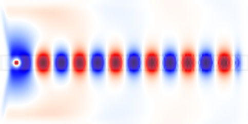
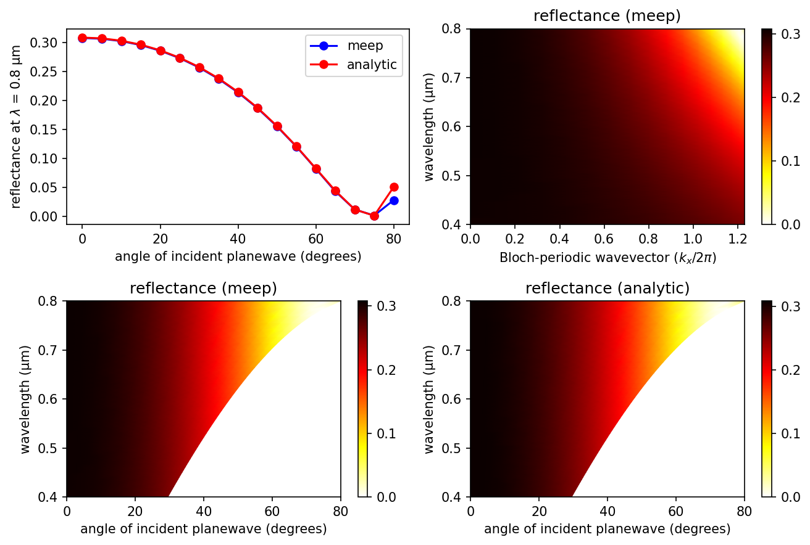
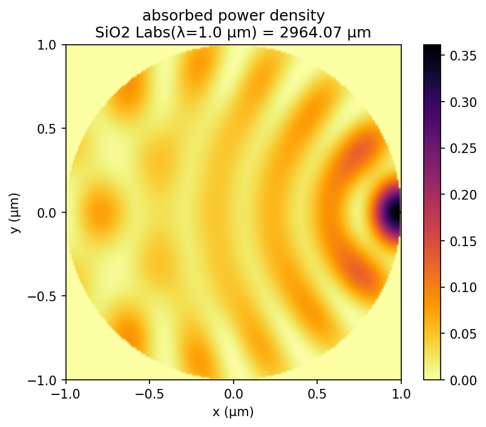

---
# Scheme Tutorial
---

We will review several examples using the Scheme interface that demonstrate the process of computing fields, transmittance/reflectance spectra, and resonant modes. The examples are mainly 1d or 2d simulations, simply because they are quicker than 3d and they illustrate most of the essential features. For more advanced functionality involving 3d simulations with a focus on technology applications, see this [projects page](http://www.simpetus.com/projects_scheme.html).

In order to convert the [HDF5](https://en.wikipedia.org/wiki/HDF5) output files of Meep into images of the fields, this tutorial uses the [h5utils](https://github.com/NanoComp/h5utils/blob/master/README.md) package. You could also use any other package (i.e., [Octave](https://www.gnu.org/software/octave/) or [Matlab](http://www.mathworks.com/access/helpdesk/help/techdoc/ref/hdf5read.html)) that supports reading HDF5 files.

[TOC]

The Scheme Script File
----------------------

The use of Meep revolves around the script (or control) file, abbreviated "ctl" and typically called something like `foo.ctl`. The script file specifies the geometry, the current sources, the outputs computed, and everything else specific to your calculation. Rather than a flat, inflexible file format, however, the script file is actually written in a scripting language. This means that it can be everything from a simple sequence of commands setting the geometry, etcetera, to a full-fledged program with user input, loops, and anything else that you might need.

Don't worry, though &mdash; simple things are simple and you don't need to be an experienced programmer. You will appreciate the flexibility that a scripting language gives you: e.g., you can input things in any order, without regard for whitespace, insert comments where you please, omit things when reasonable defaults are available, etc.

The script file is actually implemented on top of the [libctl](https://libctl.readthedocs.io) library, a set of utilities that are in turn built on top of the Scheme language. Thus, there are three sources of possible commands and syntax for a script file:

-   [Scheme](https://en.wikipedia.org/wiki/Scheme_programming_language): a programming language developed at MIT. The syntax is particularly simple: all statements are of the form `(function arguments...)`. We run Scheme under the [Guile](https://en.wikipedia.org/wiki/GNU_Guile) interpreter which is designed to be plugged into programs as a scripting and extension language. You don't need to know much Scheme for a basic script file, but it is always there if you need it. For more details, see [Guile and Scheme Information](../Guile_and_Scheme_Information.md).
-   [libctl](https://libctl.readthedocs.io/): a library built on top of Guile to simplify protocols for scientific computation. libctl sets the basic tone of the interface and defines a number of useful functions (such as multi-variable optimization, numeric integration, and so on). See the [libctl documentation](https://libctl.readthedocs.io).
-   Meep itself, which defines all the interface features that are specific to FDTD calculations. This manual is primarily focused on documenting these features.

At this point, please take a moment to leaf through the libctl tutorial to get a feel for the basic style of the interface, before we get to the Meep-specific stuff below. [MPB](http://mpb.readthedocs.io) has a similar interface.

Let's continue with our tutorial. The Meep program is normally invoked by running something like the following at the Unix command line:

```sh
 unix% meep foo.ctl >& foo.out
```

which reads `foo.ctl` and executes it, saving the output to the file `foo.out`. However, if you invoke `meep` with no arguments, you are dropped into an interactive mode in which you can type commands and see their results immediately. You can paste in the commands from the tutorial as you follow it and see what they do.

Fields in a Waveguide
---------------------

For our first example, let's examine the field pattern excited by a localized [CW](https://en.wikipedia.org/wiki/Continuous_wave) source in a waveguide &mdash; first straight, then bent. The waveguide will have frequency-independent ε=12 and width 1 μm. The unit length in this example is 1 μm. See also [Units](../Introduction.md#units-in-meep).

### A Straight Waveguide

The simulation script is in [examples/straight-waveguide.ctl](https://github.com/NanoComp/meep/blob/master/scheme/examples/straight-waveguide.ctl).

Before we define the structure, however, we have to define the computational cell. We're going to put a source at one end and watch it propagate down the waveguide in the *x* direction, so let's use a cell of length 16 μm in the *x* direction to give it some distance to propagate. In the *y* direction, we just need enough room so that the boundaries don't affect the waveguide mode; let's give it a size of 8 μm. We specify these sizes via the `geometry-lattice` variable:

```scm
(set! geometry-lattice (make lattice (size 16 8 no-size)))
```

The name `geometry-lattice` comes from [MPB](http://mpb.readthedocs.io), where it can be used to define a more general periodic lattice. Although Meep supports periodic structures, it is less general than MPB in that affine grids are not supported. `set!` is a Scheme command to set the value of an input variable. The last `no-size` parameter indicates that the cell has no size in the *z* direction, i.e. it is two-dimensional.

We can add the waveguide. Most commonly, the structure is specified by a `list` of [`geometric-object`s](../Scheme_User_Interface.md#geometric-object), stored in the `geometry` variable.

```scm
(set! geometry (list
                (make block (center 0 0) (size infinity 1 infinity)
                      (material (make medium (epsilon 12))))))
```

The waveguide is specified by a *block* (parallelepiped) of size $\infty \times 1 \times \infty$, with ε=12, centered at (0,0) which is the center of the cell. By default, any place where there are no objects there is air (ε=1), although this can be changed by setting the `default-material` variable. The resulting structure is shown below.

<center></center>

We have the structure and need to specify the current sources using the [`sources`](../Scheme_User_Interface.md#source) object. The simplest thing is to add a single point source $J_z$:

```scm
(set! sources (list
               (make source
                 (src (make continuous-src (frequency 0.15)))
                 (component Ez)
                 (center -7 0))))
```

We gave the source a frequency of 0.15, and specified a `continuous-src` which is just a fixed-frequency sinusoid $\exp(-i \omega t)$ that by default is turned on at $t$=0. Recall that, in [Meep units](../Introduction.md#units-in-meep), frequency is specified in units of 2πc, which is equivalent to the inverse of the vacuum wavelength. Thus, 0.15 corresponds to a vacuum wavelength of about 1/0.15=6.67 μm, or a wavelength of about 2 μm in the ε=12 material &mdash; thus, our waveguide is half a wavelength wide, which should hopefully make it single mode. In fact, the cutoff for single-mode behavior in this waveguide is analytically solvable, and corresponds to a frequency of 1/2√11 or roughly 0.15076. Note also that to specify a J<sub>z</sub>, we specify a component $Ez$ (e.g. if we wanted a magnetic current, we would specify `Hx`, `Hy`, or `Hz`). The current is located at (-7,0), which is 1 μm to the right of the left edge of the cell &mdash; we always want to leave a little space between sources and the cell boundaries, to keep the boundary conditions from interfering with them.

As for boundary conditions, we want to add absorbing boundaries around our cell. Absorbing boundaries in Meep are handled by [perfectly matched layers](../Perfectly_Matched_Layer.md) (PML) &mdash; which aren't really a boundary condition at all, but rather a fictitious absorbing material added around the edges of the cell. To add an absorbing layer of thickness 1 μm around all sides of the cell, we do:

```scm
(set! pml-layers (list (make pml (thickness 1.0))))
```

`pml-layers` is a list of [`pml`](../Scheme_User_Interface.md#pml) objects &mdash; you may have more than one `pml` object if you want PML layers only on certain sides of the cell, e.g. `(make pml (thickness 1.0) (direction X) (side High))` specifies a PML layer on only the $+x$ side. We note an important point: **the PML layer is *inside* the cell**, overlapping whatever objects you have there. So, in this case our PML overlaps our waveguide, which is what we want so that it will properly absorb waveguide modes. The finite thickness of the PML is important to reduce numerical reflections. For more information, see [Perfectly Matched Layer](../Perfectly_Matched_Layer.md).

Meep will discretize this structure in space and time, and that is specified by a single variable, `resolution`, that gives the number of pixels per distance unit. We'll set this resolution to 10 pixels/μm, which corresponds to around 67 pixels/wavelength, or around 20 pixels/wavelength in the high-index material. In general, at least 8 pixels/wavelength in the highest dielectric is a good idea. This will give us a 160×80 cell.

```scm
(set! resolution 10)
```

We are ready to run the simulation. We do this by calling the `run-until` function. The first argument to `run-until` is the time to run for, and the subsequent arguments specify fields to output or other kinds of analyses at each time step:

```scm
(run-until 200
           (at-beginning output-epsilon)
           (at-end output-efield-z))
```

We are outputting the dielectric function $\epsilon$ and the electric-field component $E_z$, but have wrapped the output functions which would otherwise run at *every* time step in `at-beginning` and `at-end`, which do just what they say. There are several other such functions to modify the output behavior &mdash; and you can, of course, write your own, and in fact you can do any computation or output you want at any time during the time evolution and even modify the simulation while it is running.

It should complete in a few seconds. If you are running interactively, the two output files will be called `eps-000000.00.h5` and `ez-000200.00.h5` (notice that the file names include the time at which they were output). If we were running a `tutorial.ctl` file, then the outputs will be `tutorial-eps-000000.00.h5` and `tutorial-ez-000200.00.h5`. In any case, we can analyze and visualize these files with a wide variety of packages that support the [HDF5](https://en.wikipedia.org/wiki/HDF5) format, including our own [h5utils](https://github.com/NanoComp/h5utils/blob/master/README.md), and in particular the `h5topng` program to convert them to [PNG](https://en.wikipedia.org/wiki/PNG) images.

```sh
unix% h5topng -S3 eps-000000.00.h5
```

This will create `eps-000000.00.png`, where the `-S3` increases the image scale by 3 so that it is around 450 pixels wide, in this case. In fact, precisely this command is what created the dielectric image above. Much more interesting, however, are the fields:

```sh
unix% h5topng -S3 -Zc dkbluered -a yarg -A eps-000000.00.h5 ez-000200.00.h5
```

Briefly, the `-Zc dkbluered` makes the color scale go from dark blue (negative) to white (zero) to dark red (positive), and the `-a/-A` options overlay the dielectric function as light gray contours. This results in the image:  

<center></center>

We see that the the source has excited the waveguide mode, but has also excited radiating fields propagating away from the waveguide. At the boundaries, the field quickly goes to zero due to the PML layers. If we look carefully, we see something else &mdash; the image is "speckled" towards the right side. This is because, by turning on the current abruptly at $t=0$, we have excited high-frequency components (very high order modes), and we have not waited long enough for them to die away; we'll eliminate these in the next section by turning on the source more smoothly.

### A 90° Bend

We'll start a new simulation where we look at the fields in a *bent* waveguide, and we'll do a couple of other things differently as well. The simulation script is in [examples/bent-waveguide.ctl](https://github.com/NanoComp/meep/blob/master/scheme/examples/bent-waveguide.ctl). If you are running Meep interactively, you will want to get rid of the old structure and fields so that Meep will re-initialize them:

```scm
(reset-meep)
```

Then let's set up the bent waveguide, in a slightly bigger cell, via:

```scm
(set! geometry-lattice (make lattice (size 16 16 no-size)))

(set! geometry (list
                (make block (center -2 -3.5) (size 12 1 infinity)
                      (material (make medium (epsilon 12))))
                (make block (center 3.5 2) (size 1 12 infinity)
                      (material (make medium (epsilon 12))))))

(set! pml-layers (list (make pml (thickness 1.0))))

(set! resolution 10)
```

Note that we have *two* blocks, both off-center to produce the bent waveguide structure pictured at right. As illustrated in the figure, the origin (0,0) of the coordinate system is at the center of the cell, with positive $y$ being downwards in `h5topng`, and thus the block of size 12$\times$1 is centered at (-2,-3.5). Also shown in green is the source plane at $x=-7$ which is shifted to $y=-3.5$ so that it is still inside the waveguide.

<center></center>

There are a couple of items to note. First, a point source does not couple very efficiently to the waveguide mode, so we'll expand this into a line source the same width as the waveguide by adding a `size` property to the source. An eigenmode source can also be used which is described in [Tutorial/Optical Forces](Optical_Forces.md). Second, instead of turning the source on suddenly at t=0 which excites many other frequencies because of the discontinuity, we will ramp it on slowly. Meep uses a hyperbolic tangent (tanh) turn-on function over a time proportional to the `width` of 20 time units which is a little over three periods. Finally, just for variety, we'll specify the vacuum `wavelength` instead of the `frequency`; again, we'll use a wavelength such that the waveguide is half a wavelength wide.

```scm
(set! sources (list
               (make source
                 (src (make continuous-src (wavelength (* 2 (sqrt 11))) (width 20)))
                 (component Ez)
                 (center -7 -3.5)
                 (size 0 1))))
```

Finally, we'll run the simulation. Instead of running `output-efield-z` only at the *end* of the simulation, however, we'll run it at every 0.6 time units (about 10 times per period) via `(at-every 0.6 output-efield-z)`. By itself, this would output a separate file for every different output time, but instead we'll use another feature of Meep to output to a *single* three-dimensional HDF5 file, where the third dimension is time:

```scm
(run-until 200
           (at-beginning output-epsilon)
           (to-appended "ez" (at-every 0.6 output-efield-z)))
```

`"ez"` determines the name of the output file, which will be called `ez.h5` if you are running interactively or will be prefixed with the name of the file name for a script file (e.g. `tutorial-ez.h5` for `tutorial.ctl`). If we run `h5ls` on this file (a standard utility, included with HDF5, that lists the contents of the HDF5 file), we get:

```sh
unix% h5ls ez.h5 
ez                       Dataset {161, 161, 330/Inf}
```

That is, the file contains a single dataset `ez` that is a 160$\times$160$\times$333 array, where the last dimension is time. This is rather a large file, 66MB; later, we'll see ways to reduce this size if we only want images. We have a number of choices of how to output the fields. To output a single time slice, we can use the same `h5topng` command as before, but with an additional `-t` option to specify the time index: e.g. `h5topng -t 332` will output the last time slice, similar to before. Instead, let's create an animation of the fields as a function of time. First, we have to create images for *all* of the time slices:

```sh
unix% h5topng -t 0:332 -R -Zc dkbluered -a yarg -A eps-000000.00.h5 ez.h5
```

This is similar to the command before, with two new options: `-t 0:332` outputs images for *all* time indices from 0 to 332, i.e. all of the times, and the the `-R` flag tells h5topng to use a consistent color scale for every image instead of scaling each image independently. Then, we have to convert these images into an animation in some format. For this, we'll use the free [ImageMagick](https://en.wikipedia.org/wiki/ImageMagick) `convert` program and there are other tools that work as well.

```sh
unix% convert ez.t*.png ez.gif
```

We are using an animated GIF format for the output. This results in the following animation:

<center></center>

<center></center>

<center></center>

It is clear that the transmission around the bend is rather low for this frequency and structure &mdash; both large reflection and large radiation loss are clearly visible. Moreover, since we are operating just barely below the cutoff for single-mode behavior, we are able to excite a second *leaky* mode after the waveguide bend, whose second-order mode pattern (superimposed with the fundamental mode) is apparent in the animation. At right, we show a field snapshot from a simulation with a larger cell along the $y$ direction, in which you can see that the second-order leaky mode decays away, leaving us with the fundamental mode propagating downward.

Instead of doing an animation, another interesting possibility is to make an image from a $x \times t$ slice. Here is the $y=-3.5$ slice, which gives us an image of the fields in the first waveguide branch as a function of time.

```sh
unix% h5topng -0y -35 -Zc dkbluered ez.h5
```

The `-0y -35` specifies the $y=-3.5$ slice, where we have multiplied by 10 (our resolution) to get the pixel coordinate.

#### Output Tips and Tricks

Above, we outputted the full 2d data slice at every 0.6 time units, resulting in a 69MB file. This is not large but you can imagine how big the output file would get if we were doing a 3d simulation, or even a larger 2d simulation &mdash; one can easily generate gigabytes of files, which is not only wasteful but is also slow. Instead, it is possible to output more efficiently if you know what you want to look at.

To create the movie above, all we really need are the *images* corresponding to each time. Images can be stored much more efficiently than raw arrays of numbers &mdash; to exploit this fact, Meep allows you to **output PNG images instead of HDF5 files**. In particular, instead of `output-efield-z` as above, we can use `(output-png Ez "-Zc dkbluered")`, where Ez is the component to output and the `"-Zc dkbluered"` are options for `h5topng` which is the program that is actually used to create the image files. That is:

```scm
(run-until 200 (at-every 0.6 (output-png Ez "-Zc bluered")))
```

will output a PNG file file every 0.6 time units, which can then be combined with `convert` as above to create a movie. The movie will be similar to the one before, but not identical because of how the color scale is determined. Before, we used the `-R` option to make h5topng use a *uniform* color scale for all images, based on the minimum/maximum field values over `all` time steps. That is not possible because we output an image before knowing the field values at future time steps. Thus, what `output-png` does is to set its color scale based on the minimum/maximum field values from all *past* times &mdash; therefore, the color scale will slowly "ramp up" as the source turns on.

The above command outputs zillions of PNG files, and it is somewhat annoying to have them clutter up our directory. Instead, we can use the following command before `run-until`:

```scm
(use-output-directory)
```

This will put *all* of the output files (.h5, .png, etcetera) into a newly-created subdirectory, called by default `filename-out/` if our script file is `filename.ctl`.

What if we want to output an $x \times t$ slice, as above? To do this, we only really wanted the values at $y=-3.5$, and therefore we can exploit another powerful Meep output feature &mdash; Meep allows us to output only **a subset of the cell**. This is done using the `in-volume` function, which similar to `at-every` and `to-appended` is another function that modifies the behavior of other output functions. In particular, we can do:

```scm
 (run-until 200 
   (to-appended "ez-slice" 
     (at-every 0.6 
       (in-volume (volume (center 0 -3.5) (size 16 0))
         output-efield-z))))
```

The first argument to `in-volume` is a volume, specified by `(volume (center ...) (size ...))`, which applies to all of the nested output functions. Note that `to-appended`, `at-every`, and `in-volume` are cumulative regardless of what order you put them in. This creates the output file `ez-slice.h5` which contains a dataset of size 160x333 corresponding to the desired $x \times t$ slice.

Transmittance Spectrum of a Waveguide Bend
------------------------------------------

We have computed the field patterns for light propagating around a waveguide bend. While this can be visually informative, the results are not quantitatively satisfying. We'd like to know exactly how much power makes it around the bend ([transmittance](https://en.wikipedia.org/wiki/Transmittance)), how much is reflected ([reflectance](https://en.wikipedia.org/wiki/Reflectance)), and how much is radiated away (scattered loss). How can we do this?

The basic principles are described in [Introduction/Transmittance/Reflectance Spectra](../Introduction.md#transmittancereflectance-spectra). The computation involves keeping track of the fields and their Fourier transform in a certain region, and from this computing the flux of electromagnetic energy as a function of ω. Moreover, we'll get an entire spectrum of the transmittance in a single run, by Fourier-transforming the response to a short pulse. However, in order to normalize the transmitted flux by the incident power to obtain the transmittance, we'll have to do *two* runs, one with and one without the bend (i.e., a straight waveguide).

The simulation script is in [examples/bend-flux.ctl](https://github.com/NanoComp/meep/blob/master/scheme/examples/bend-flux.ctl).

Above, we hard-coded all of the parameters like the cell size, the waveguide width, etcetera. For serious work, however, this is inefficient &mdash; we often want to explore many different values of such parameters. For example, we may want to change the size of the cell, so we'll define it as:

```scm
(define-param sx 16) ; size of cell in X direction                              
(define-param sy 32) ; size of cell in Y direction                              
(set! geometry-lattice (make lattice (size sx sy no-size)))
```

Notice that a semicolon "`;`" begins a comment, which is ignored by Meep. `define-param` is a [libctl](https://libctl.readthedocs.io) feature to define variables that can be overridden from the command line. We could do `meep sx=17 bend-flux.ctl` to change the $x$ size to 17, without editing the script file, for example. We'll also define a couple of parameters to set the width of the waveguide and the "padding" between it and the edge of the cell:

```scm
(define-param pad 4) ; padding distance between waveguide and cell edge         
(define-param w 1)   ; width of waveguide    
```

In order to define the waveguide positions, we will have to use arithmetic. For example, the $y$ center of the horizontal waveguide will be given by `-0.5*(sy-w-2*pad)`. At least, that is what the expression would look like in C; in Scheme, the syntax for 1+2 is `(+ 1 2)`, and so on, so we will define the horizontal and vertical waveguide centers as:

```scm
(define wvg-xcen (*  0.5 (- sx w (* 2 pad)))) ; x center of vert. wvg
(define wvg-ycen (* -0.5 (- sy w (* 2 pad)))) ; y center of horiz. wvg
```

We proceed to define the geometry, as before. This time, however, we really want *two* geometries: the bend, and also a straight waveguide for normalization. We could do this with two separate script files, but that is annoying. Instead, we'll define a parameter `no-bend?` which is `true` for the straight-waveguide case and `false` for the bend.

```scm
(define-param no-bend? false) ; if true, have straight waveguide, not bend      
```


We define the geometry via two cases, with an if statement &mdash; the Scheme syntax is `(if predicate? if-true if-false)`.

```scm
(set! geometry
      (if no-bend?
          (list
           (make block
             (center 0 wvg-ycen)
             (size infinity w infinity)
             (material (make medium (epsilon 12)))))
          (list
           (make block
             (center (* -0.5 pad) wvg-ycen)
             (size (- sx pad) w infinity)
             (material (make medium (epsilon 12))))
           (make block
             (center wvg-xcen (* 0.5 pad))
             (size w (- sy pad) infinity)
             (material (make medium (epsilon 12)))))))
```


Thus, if `no-bend?` is `true` we make a single block for a straight waveguide, and otherwise we make two blocks for a bent waveguide.

The source is a `gaussian-src` instead of a `continuous-src`, parameterized by a center frequency and a frequency width (the width of the Gaussian spectrum), which we'll define via `define-param` as usual.

```scm
(define-param fcen 0.15) ; pulse center frequency                               
(define-param df 0.1)    ; pulse width (in frequency)                             
(set! sources (list
               (make source
                 (src (make gaussian-src (frequency fcen) (fwidth df)))
                 (component Ez)
                 (center (+ 1 (* -0.5 sx)) wvg-ycen)
                 (size 0 w))))
```

Notice how we're using our parameters like `wvg-ycen` and `w`: if we change the dimensions, everything will shift automatically. The boundary conditions and resolution are set as before, except that we'll use `set-param!` so that we can override the resolution from the command line.:

```scm
(set! pml-layers (list (make pml (thickness 1.0))))
(set-param! resolution 10)
```

Finally, we have to specify where we want Meep to compute the flux spectra, and at what frequencies. This must be done *after* specifying the geometry, sources, resolution, etcetera, because all of the field parameters are initialized when flux planes are created. As described in [Introduction/Transmittance/Reflectance Spectra](../Introduction.md#transmittancereflectance-spectra), the flux is the integral of the Poynting vector over the specified [`flux-region`](../Scheme_User_Interface.md#flux-region). It only integrates one component of the Poynting vector and the `direction` property specifies which component. In this example, since the `flux-region` is a line, the `direction` is its normal by default which therefore does not need to be explicitly defined.

```scm
(define-param nfreq 100) ; number of frequencies at which to compute flux             
(define trans ; transmitted flux                                                
      (add-flux fcen df nfreq
                (if no-bend?
                    (make flux-region
                     (center (- (/ sx 2) 1.5) wvg-ycen) (size 0 (* w 2)))
                    (make flux-region
                     (center wvg-xcen (- (/ sy 2) 1.5)) (size (* w 2) 0)))))
(define refl ; reflected flux                                                   
      (add-flux fcen df nfreq
                 (make flux-region 
                   (center (+ (* -0.5 sx) 1.5) wvg-ycen) (size 0 (* w 2)))))
```

We compute the fluxes through a line segment twice the width of the waveguide, located at the beginning or end of the waveguide. Note that the flux lines are separated by 1 μm from the boundary of the cell, so that they do not lie within the absorbing PML regions. Again, there are two cases: the transmitted flux is either computed at the right or the bottom of the cell, depending on whether the waveguide is straight or bent.

The fluxes will be computed for `nfreq=100` frequencies centered on `fcen`, from `fcen-df/2` to `fcen+df/2`. That is, we only compute fluxes for frequencies within our pulse bandwidth. This is important because, far outside the pulse bandwidth, the spectral power is so low that numerical errors make the computed fluxes useless.

As described in [Introduction/Transmittance/Reflectance Spectra](../Introduction.md#transmittancereflectance-spectra), computing the reflection spectra requires some care because we need to separate the incident and reflected fields. We do this in Meep by saving the Fourier-transformed fields from the normalization run (`no-bend?=true`), and loading them, *negated*, *before* the other runs. The latter subtracts the Fourier-transformed incident fields from the Fourier transforms of the scattered fields. Logically, we might subtract these after the run, but it turns out to be more convenient to subtract the incident fields first and then accumulate the Fourier transform. All of this is accomplished with two commands, `save-flux` (after the normalization run) and `load-minus-flux` (before the other runs). We can call them as follows:

```scm
(if (not no-bend?) (load-minus-flux "refl-flux" refl))
(run-sources+ 500 (at-beginning output-epsilon))
(if no-bend? (save-flux "refl-flux" refl))
```

This uses a file called `refl-flux.h5`, or actually `bend-flux-refl-flux.h5` (the script file name is used as a prefix) to store/load the Fourier transformed fields in the flux planes. The `(run-sources+ 500)` runs the simulation until the Gaussian source has turned off (which is done automatically once it has decayed for a few standard deviations), plus an additional 500 time units.

Why do we keep running after the source has turned off? Because we must give the pulse time to propagate completely across the cell. Moreover, the time required is a bit tricky to predict when you have complex structures, because there might be resonant phenomena that allow the source to bounce around for a long time. Therefore, it is convenient to specify the run time in a different way: instead of using a fixed time, we require that the |E<sub>z</sub>|<sup>2</sup> at the end of the waveguide must have decayed by a given amount (e.g. 1/1000) from its peak value. We can do this via:

```scm
(run-sources+ 
 (stop-when-fields-decayed 50 Ez
   (if no-bend? (vector3 (- (/ sx 2) 1.5) wvg-ycen)
                (vector3 wvg-xcen (- (/ sy 2) 1.5)))
   1e-3))
```

`stop-when-fields-decayed` takes four arguments: `(stop-when-fields-decayed dT component pt decay-by)`. What it does is, after the sources have turned off, it keeps running for an additional `dT` time units every time the given |component|<sup>2</sup> at the given point has not decayed by at least `decay-by` from its peak value for all times within the previous `dT`. In this case, `dT=50`, the component is E<sub>z</sub>, the point is at the center of the flux plane at the end of the waveguide, and `decay-by=0.001`. So, it keeps running for an additional 50 time units until the square amplitude has decayed by 1/1000 from its peak. This should be sufficient to ensure that the Fourier transforms have converged.

Finally, we have to output the flux values:

```scm
(display-fluxes trans refl)
```

This prints a series of outputs like:

```
flux1:, 0.1, 7.91772317108475e-7, -3.16449591437196e-7
flux1:, 0.101010101010101, 1.18410865137737e-6, -4.85527604203706e-7
flux1:, 0.102020202020202, 1.77218779386503e-6, -7.37944901819701e-7
flux1:, 0.103030303030303, 2.63090852112034e-6, -1.11118350510327e-6
flux1:, ...
```

This is comma-delimited data, which can easily be imported into any spreadsheet or plotting program (e.g. Octave/Matlab): the first column is the frequency, the second is the transmitted power, and the third is the reflected power.

We need to run the simulation *twice*, once with `no-bend?=true` and once with `no-bend?=false` (the default):

```sh
unix% meep no-bend?=true bend-flux.ctl | tee bend0.out
unix% meep bend-flux.ctl | tee bend.out
```

The `tee` command is a useful Unix command that saves the output to a file *and* displays it on the screen, so that we can see what is going on as it runs. Then, we should pull out the `flux1` lines into a separate file to import them into our plotting program:

```sh
unix% grep flux1: bend0.out > bend0.dat
unix% grep flux1: bend.out > bend.dat
```

We import them to Octave/Matlab (using its `dlmread` command), and plot the results:

<center></center>

What are we plotting here? The transmittance is the transmitted flux (second column of `bend.dat`) divided by the incident flux (second column of `bend0.dat`), to give us the *fraction* of power transmitted. The reflectance is the reflected flux (third column of `bend.dat`) divided by the incident flux (second column of `bend0.dat`). We also have to multiply by -1 because all fluxes in Meep are computed in the positive-coordinate direction by default, and we want the flux in the $-x$ direction. Finally, the scattered loss is simply $1-transmittance-reflectance$.

We should also check whether our data is converged. We can do this by increasing the resolution and cell size and seeing by how much the numbers change. In this case, we'll try doubling the cell size:

```sh
unix% meep sx=32 sy=64 no-bend?=true bend-flux.ctl |tee bend0-big.out
unix% meep sx=32 sy=64 bend-flux.ctl |tee bend-big.out
```

Again, we must run both simulations in order to get the normalization right. The results are included in the plot above as dotted lines &mdash; you can see that the numbers have changed slightly for transmittance and loss, probably stemming from interference between light radiated directly from the source and light propagating around the waveguide.

Angular Reflectance Spectrum of a Planar Interface
--------------------------------------------------

We turn to a similar but slightly different example for which there exists an analytic solution via the [Fresnel equations](https://en.wikipedia.org/wiki/Fresnel_equations): computing the broadband reflectance spectrum of a planar air-dielectric interface for an incident planewave over a range of angles. Similar to the previous example, we will need to run two simulations: (1) an empty cell with air/vacuum (n=1) everywhere to obtain the incident flux, and (2) with the dielectric (n=3.5) interface to obtain the reflected flux. For each angle of the incident planewave, a separate simulation is necessary.

A 1d cell must be used since a higher-dimensional cell will introduce [artificial modes due to band folding](../FAQ.md#why-are-there-strange-peaks-in-my-reflectancetransmittance-spectrum-when-modeling-planar-or-periodic-structures). We will use a Gaussian source spanning visible wavelengths of 0.4 to 0.8 μm. Unlike a [continuous-wave](../Scheme_User_Interface.md#source) (CW) source, a pulsed source turns off. This enables a termination condition of when there are no fields remaining in the cell (due to absorption by the PMLs) via the [run function](../Scheme_User_Interface.md#run-functions) `stop-when-fields-decayed`, similar to the previous example.

Creating an oblique planewave source typically requires specifying two parameters: (1) for periodic structures, the Bloch-periodic wavevector $\vec{k}$ via [`k_point`](../FAQ.md#how-does-k_point-define-the-phase-relation-between-adjacent-unit-cells), and (2) the source amplitude function `amp_func` for setting the $e^{i\vec{k} \cdot \vec{r}}$ spatial dependence ($\vec{r}$ is the position vector). Since we have a 1d cell and the source is at a single point, it is not necessary to specify the source amplitude (see this [2d example](https://github.com/NanoComp/meep/blob/master/python/examples/pw-source.py) for how this is done). The magnitude of the Bloch-periodic wavevector is specified according to the dispersion relation formula for a planewave in homogeneous media with index $n$: $\omega=c|\vec{k}|/n$. As the source in this example is incident from air, $|\vec{k}|=\sqrt{k_x^2+k_z^2}$ is simply equal to the frequency $\omega$. Note that specifying $\vec{k}$ corresponds to a single frequency. Any broadband source is therefore incident at a specified angle for only a *single* frequency. This is described in more detail in Section 4.5 ("Efficient Frequency-Angle Coverage") in [Chapter 4](https://arxiv.org/abs/1301.5366) ("Electromagnetic Wave Source Conditions") of the book [Advances in FDTD Computational Electrodynamics: Photonics and Nanotechnology](https://www.amazon.com/Advances-FDTD-Computational-Electrodynamics-Nanotechnology/dp/1608071707). In this example, $\omega$ is set to the minimum frequency of the pulse to produce propagating fields at all pulse frequencies. In general, any pulse frequencies which are *less* than any non-zero component of $|\vec{k}|$ will result in *evanescent* fields (which are essentially irrelevant in most practical applications).

In this example, the plane of incidence which contains $\vec{k}$ and the surface normal vector is chosen to be $xz$. The source angle $\theta$ is defined in degrees in the counterclockwise (CCW) direction around the $y$ axis with 0 degrees along the $+z$ axis. In Meep, a 1d cell is defined along the $z$ direction. When $\vec{k}$ is not set, only the $E_x$ and $H_y$ field components are permitted. A non-zero $\vec{k}$ results in a 3d simulation where all field components are included and are complex valued (note that the fields are real, by default). A current source with $E_x$ polarization lies within the plane of incidence and corresponds to the convention of $\mathcal{P}$-polarization. In order to model the $\mathcal{S}$-polarization, we must use an $E_y$ source. This example involves just the $\mathcal{P}$-polarization.

The simulation script is [examples/refl-angular.ctl](https://github.com/NanoComp/meep/blob/master/scheme/examples/refl-angular.ctl)

```scm
(set-param! resolution 200)         ; pixels/um

(define-param dpml 1)               ; PML thickness
(define-param sz 10)                ; size of cell (without PMLs)
(set! sz (+ sz (* 2 dpml)))
(set! pml-layers (list (make pml (thickness dpml))))

(set! geometry-lattice (make lattice (size no-size no-size sz)))

(define-param wvl-min 0.4)          ; minimum wavelength of source
(define-param wvl-max 0.8)          ; maximum wavelength of source
(define fmin (/ wvl-max))           ; minimum frequency of source
(define fmax (/ wvl-min))           ; maximum frequency of source
(define fcen (* 0.5 (+ fmin fmax))) ; center frequency of source
(define df (- fmax fmin))           ; frequency width of source
(define-param nfreq 50)             ; number of frequency bins

; rotation angle (in degrees) of source: CCW around Y axis, 0 degrees along +Z axis 
(define-param theta 0)
(define theta-r (deg->rad theta))

; if source is at normal incidence, force number of dimensions to be 1
(set! dimensions (if (= theta-r 0) 1 3))

; plane of incidence is xz
(set! k-point (vector3* fmin (vector3 (sin theta-r) 0 (cos theta-r))))

(set! sources (list (make source (src (make gaussian-src (frequency fcen) (fwidth df)))
                                 (component Ex) (center 0 0 (+ (* -0.5 sz) dpml)))))

(define-param empty? true)

; add a block with n=3.5 for the air-dielectric interface
(if (not empty?)
    (set! geometry (list (make block (size infinity infinity (* 0.5 sz)) (center 0 0 (* 0.25 sz)) (material (make medium (index 3.5)))))))

(define refl (add-flux fcen df nfreq (make flux-region (center 0 0 (* -0.25 sz)))))

(if (not empty?) (load-minus-flux "refl-flux" refl))

(run-sources+ (stop-when-fields-decayed 50 Ex (vector3 0 0 (+ (* -0.5 sz) dpml)) 1e-9))

(if empty? (save-flux "refl-flux" refl))

(display-fluxes refl)
```

The simulation script above computes and prints to standard output the reflectance at each frequency. Also included in the output is the wavevector component $k_x$ and the corresponding angle for the ($k_x$, ω) pair. For those frequencies not equal to the minimum frequency of the source, this is *not* the same as the specified angle of the incident planewave, but rather sin<sup>-1</sup>(k<sub>x</sub>/ω).

The following Bash shell script runs the simulation for the angular range of 0$^\circ$ to 80$^\circ$ in increments of 5$^\circ$. For each run, the script pipes the output to one file and extracts the reflectance data to a different file.

```sh
#!/bin/bash

for i in `seq 0 5 80`; do
    meep empty?=true theta=${i} refl-angular.ctl |tee -a flux0_t${i}.out;
    grep flux1: flux0_t${i}.out |cut -d , -f2- > flux0_t${i}.dat
    meep empty?=false theta=${i} refl-angular.ctl |tee -a flux_t${i}.out;
    grep flux1: flux_t${i}.out |cut -d , -f2- > flux_t${i}.dat
done
```

Two-dimensional plots of the angular reflectance spectrum based on the simulated data and the analytic [Fresnel equations](https://en.wikipedia.org/wiki/Fresnel_equations) are generated using the Octave/Matlab script below. The plots are shown in the accompanying figure with four insets. The top left inset shows the simulated and analytic reflectance spectra at a wavelength of 0.6 μm. The top right inset shows the simulated reflectance spectrum as a function of the wavelength λ and wavevector $k_x$: $R(\lambda, k_x)$. The lower left inset is a transformation of $R(\lambda, k_x)$ into $R(\lambda, \theta)$. Note how the range of angles depends on the wavelength. For a particular angle, the reflectance is a constant for all wavelengths due to the dispersionless dielectric. The lower right inset is the analytic reflectance spectrum computed using the Fresnel equations. There is agreement between the simulated and analytic results. The [Brewster's angle](https://en.wikipedia.org/wiki/Brewster%27s_angle), where the transmittance is 1 and the reflectance 0, is tan<sup>-1</sup>(3.5/1)=74.1°. This is also verified by the simulated results.

In order to generate results for the missing portion of the reflectance spectrum (i.e., the white region), we will need to rerun the simulations for different wavelength spectra.

```matlab
theta_in = [0:5:80];
Rmeep = [];
for j = 1:length(theta_in)
  f0 = dlmread(sprintf("flux0_t%d.dat",theta_in(j)),',');
  f = dlmread(sprintf("flux_t%d.dat",theta_in(j)),',');
  Rmeep = [Rmeep -f(:,2)./f0(:,2)];
endfor

freqs = f(:,1);
% convert frequency to wavelength
wvl = 1./freqs;
% create a 2d matrix for the wavelength by repeating the column vector for each angle
wvls = repmat(wvl,1,length(theta_in));

wvl_min = 0.4;
wvl_max = 0.8;
fcen = (1/wvl_min+1/wvl_max)/2;
kx = fcen*sind(theta_in);
kxs = repmat(kx,length(wvl),1);
thetas = asind(kxs./freqs);

figure;
pcolor(kxs,wvls,Rmeep);
shading interp; c = colormap("hot"); colormap(c); colorbar;
eval(sprintf("axis([%0.2g %0.2g %0.2g %0.2g])",kx(1),kx(end),min(wvl),max(wvl)));
eval(sprintf("set(gca, 'xtick', [%0.2g:0.2:%0.2g])",kx(1),kx(end)));
eval(sprintf("set(gca, 'ytick', [%0.1g:0.1:%0.1g])",wvl(end),wvl(1)));
xlabel("wavevector of Bloch-Periodic boundary condition (k_x/2π)");
ylabel("wavelength (μm)");
title("reflectance (meep)");

figure;
pcolor(thetas,wvls,Rmeep);
shading interp; c = colormap("hot"); colormap(c); colorbar;
eval(sprintf("axis([%0.2g %0.2g %0.2g %0.2g])",min(min(thetas)),max(max(thetas)),min(wvl),max(wvl)));
eval(sprintf("set(gca, 'xtick', [%d:20:%d])",min(min(thetas)),max(max(thetas))));
eval(sprintf("set(gca, 'ytick', [%0.1g:0.1:%0.1g])",wvl(end),wvl(1)));
xlabel("angle of incident planewave (degrees)");
ylabel("wavelength (μm)");
title("reflectance (meep)");

n1 = 1;
n2 = 3.5;

% compute angle of refracted planewave in medium n2
% for incident planewave in medium n1 at angle theta_in
theta_out = @(theta_in) asin(n1*sin(theta_in)/n2);

% compute Fresnel reflectance for P-polarization in medium n2
% for incident planewave in medium n1 at angle theta_in
R_fresnel = @(theta_in) abs((n1*cos(theta_out(theta_in))-n2*cos(theta_in))./(n1*cos(theta_out(theta_in))+n2*cos(theta_in))).^2;

Ranalytic = R_fresnel(thetas*pi/180);

figure;
pcolor(thetas,wvls,Ranalytic);
shading interp; c = colormap("hot"); colormap(c); colorbar;
eval(sprintf("axis([%0.2g %0.2g %0.2g %0.2g])",min(min(thetas)),max(max(thetas)),min(wvl),max(wvl)));
eval(sprintf("set(gca, 'xtick', [%d:20:%d])",min(min(thetas)),max(max(thetas))));
eval(sprintf("set(gca, 'ytick', [%0.1g:0.1:%0.1g])",wvl(end),wvl(1)));
xlabel("angle of incident planewave (degrees)");
ylabel("wavelength (μm)");
title("reflectance (analytic)");
```

<center></center>

Mie Scattering of a Lossless Dielectric Sphere
----------------------------------------------

A common reference calculation in computational electromagnetics for which an analytical solution is known is [Mie scattering](https://en.wikipedia.org/wiki/Mie_scattering) which involves computing the [scattering efficiency](http://www.thermopedia.com/content/956/) of a single, homogeneous sphere given an incident planewave. The scattered power of any object (absorbing or non) can be computed by surrounding it with a *closed* [DFT flux](../Scheme_User_Interface.md#flux-spectra) box (its size and orientation are irrelevant because of Poynting's theorem) and performing two simulations: (1) a normalization run involving an empty cell to save the incident fields from the source and (2) the scattering run with the object but first subtracting the incident fields in order to obtain just the scattered fields. This approach has already been described in [Transmittance Spectrum of a Waveguide Bend](#transmittance-spectrum-of-a-waveguide-bend).

The scattering cross section ($\sigma_{scat}$) is the scattered power in all directions divided by the incident intensity. The scattering efficiency, a dimensionless quantity, is the ratio of the scattering cross section to the cross sectional area of the sphere. In this demonstration, the sphere is a lossless dielectric with wavelength-independent refractive index of 2.0. This way, [subpixel smoothing](../Subpixel_Smoothing.md) can improve accuracy at low resolutions which is important for reducing the size of this 3d simulation. The source is an $E_z$-polarized, planewave pulse (its `size` parameter fills the *entire* cell in 2d) spanning the broadband wavelength spectrum of 10% to 50% the circumference of the sphere. There is one subtlety: since the [planewave source extends into the PML](../Perfectly_Matched_Layer.md#planewave-sources-extending-into-pml) which surrounds the cell on all sides, `(is-integrated? true)` must be specified in the source object definition. A `k-point` of zero specifying periodic boundary conditions is necessary in order for the source to be infinitely extended. Also, given the [symmetry of the fields and the structure](../Exploiting_Symmetry.md), two mirror symmery planes can be used to reduce the cell size by a factor of four. The simulation results are validated by comparing with the analytic theory obtained from the [PyMieScatt](https://pymiescatt.readthedocs.io/en/latest/) module.

A schematic of the 2d cross section at $z = 0$ of the 3d cell is shown below.

<center></center>

The simulation script is in [examples/mie-scattering.ctl](https://github.com/NanoComp/meep/blob/master/scheme/examples/mie-scattering.ctl). As an estimate of runtime, the [parallel simulation](../Parallel_Meep.md) on a machine with three Intel Xeon 4.20 GHz cores takes less than five minutes.

```scm
(define-param r 1.0) ;; radius of sphere

(define wvl-min (/ (* 2 pi r) 10))
(define wvl-max (/ (* 2 pi r) 2))

(define frq-min (/ wvl-max))
(define frq-max (/ wvl-min))
(define frq-cen (* 0.5 (+ frq-min frq-max)))
(define dfrq (- frq-max frq-min))
(define nfrq 100)

;; at least 8 pixels per smallest wavelength, i.e. (floor (/ 8 wvl-min))
(set-param! resolution 25)

(define dpml (* 0.5 wvl-max))
(define dair (* 0.5 wvl-max))

(define boundary-layers (list (make pml (thickness dpml))))
(set! pml-layers boundary-layers)

(define symm (list (make mirror-sym (direction Y))
                   (make mirror-sym (direction Z) (phase -1))))
(set! symmetries symm)

(define s (* 2 (+ dpml dair r)))
(define cell (make lattice (size s s s)))
(set! geometry-lattice cell)

;; (is-integrated? true) necessary for any planewave source extending into PML
(define pw-src (make source
                 (src (make gaussian-src (frequency frq-cen) (fwidth dfrq) (is-integrated? true)))
                 (center (+ (* -0.5 s) dpml) 0 0)
                 (size 0 s s)
                 (component Ez)))
(set! sources (list pw-src))

(set! k-point (vector3 0))

(define box-x1 (add-flux frq-cen dfrq nfrq
                         (make flux-region (center (- r) 0 0) (size 0 (* 2 r) (* 2 r)))))
(define box-x2 (add-flux frq-cen dfrq nfrq
                         (make flux-region (center (+ r) 0 0) (size 0 (* 2 r) (* 2 r)))))
(define box-y1 (add-flux frq-cen dfrq nfrq
                         (make flux-region (center 0 (- r) 0) (size (* 2 r) 0 (* 2 r)))))
(define box-y2 (add-flux frq-cen dfrq nfrq
                         (make flux-region (center 0 (+ r) 0) (size (* 2 r) 0 (* 2 r)))))
(define box-z1 (add-flux frq-cen dfrq nfrq
                         (make flux-region (center 0 0 (- r)) (size (* 2 r) (* 2 r) 0))))
(define box-z2 (add-flux frq-cen dfrq nfrq
                         (make flux-region (center 0 0 (+ r)) (size (* 2 r) (* 2 r) 0))))

(run-sources+ 10)

(display-fluxes box-x1)

(save-flux "box-x1-flux" box-x1)
(save-flux "box-x2-flux" box-x2)
(save-flux "box-y1-flux" box-y1)
(save-flux "box-y2-flux" box-y2)
(save-flux "box-z1-flux" box-z1)
(save-flux "box-z2-flux" box-z2)

(reset-meep)

(define nsphere 2.0)
(set! geometry (list
                (make sphere
                  (material (make medium (index nsphere)))
                  (radius r)
                  (center 0))))

(set! geometry-lattice cell)

(set! pml-layers boundary-layers)

(set! symmetries symm)

(set! sources (list pw-src))

(set! k-point (vector3 0))

(define box-x1 (add-flux frq-cen dfrq nfrq
                         (make flux-region (center (- r) 0 0) (size 0 (* 2 r) (* 2 r)))))
(define box-x2 (add-flux frq-cen dfrq nfrq
                         (make flux-region (center (+ r) 0 0) (size 0 (* 2 r) (* 2 r)))))
(define box-y1 (add-flux frq-cen dfrq nfrq
                         (make flux-region (center 0 (- r) 0) (size (* 2 r) 0 (* 2 r)))))
(define box-y2 (add-flux frq-cen dfrq nfrq
                         (make flux-region (center 0 (+ r) 0) (size (* 2 r) 0 (* 2 r)))))
(define box-z1 (add-flux frq-cen dfrq nfrq
                         (make flux-region (center 0 0 (- r)) (size (* 2 r) (* 2 r) 0))))
(define box-z2 (add-flux frq-cen dfrq nfrq
                         (make flux-region (center 0 0 (+ r)) (size (* 2 r) (* 2 r) 0))))

(load-minus-flux "box-x1-flux" box-x1)
(load-minus-flux "box-x2-flux" box-x2)
(load-minus-flux "box-y1-flux" box-y1)
(load-minus-flux "box-y2-flux" box-y2)
(load-minus-flux "box-z1-flux" box-z1)
(load-minus-flux "box-z2-flux" box-z2)

(run-sources+ 100)

(display-fluxes box-x1 box-x2 box-y1 box-y2 box-z1 box-z2)
```

The following Bash shell script runs the parallel simulation. The script pipes the output to a file and extracts the input and scattering flux data to separate files.
```sh
#!/bin/bash

mpirun -n 3 meep mie-scattering.ctl |tee mie.out

grep flux1: mie.out |cut -d, -f2- > input.dat
grep flux2: mie.out |cut -d, -f2- > scatt.dat
```

The scattering efficiency is computed from the simulation data and plotted using the following Matlab/Octave script.
```matlab
input = dlmread('input.dat',',');
scatt = dlmread('scatt.dat',',');

r = 1.0;

freqs = input(:,1);
scatt_flux = scatt(:,2) - scatt(:,3) + scatt(:,4) - scatt(:,5) + scatt(:,6) - scatt(:,7);
intensity = input(:,2)/(2*r)^2;
scatt_cross_section = scatt_flux./intensity;
scatt_eff_meep = scatt_cross_section*-1/(pi*r^2);

loglog(2*pi*r*freqs,scatt_eff_meep,'bo-');
xlabel('(sphere circumference)/wavelength, 2πr/\lambda');
ylabel('scattering efficiency, \sigma/\pir^2');
title("Mie Scattering of a Lossless Dielectric Sphere");
set(gca, "xminorgrid", "on");
set(gca, "yminorgrid", "on");
set(gca, "xlim", [1 10]);
```

The incident intensity (`intensity`) is the flux in one of the six monitor planes (the one closest to and facing the planewave source propagating in the $x$ direction) divided by its area. This is why the six sides of the flux box are defined separately. (Otherwise, the entire box could have been defined as a single flux object with different weights ±1 for each side.) The scattered power is multiplied by -1 since it is the *outgoing* power (a positive quantity) rather than the incoming power as defined by the orientation of the flux box. Note that because of the linear $E_z$ polarization of the source, the flux through the $y$ and $z$ planes will *not* be the same. A circularly-polarized source would have produced equal flux in these two monitor planes. The runtime of the scattering run is chosen to be sufficiently long to ensure that the Fourier-transformed fields have [converged](../FAQ.md#checking-convergence).

Results are shown below. Overall, the Meep results agree well with the analytic theory.

<center></center>

Finally, for the case of a *lossy* dielectric material (i.e. complex refractive index) with non-zero absorption, the procedure to obtain the scattering efficiency is the same. The absorption efficiency is the ratio of the absorption cross section ($\sigma_{abs}$) to the cross sectional area of the sphere. The absorption cross section is the total absorbed power divided by the incident intensity. The absorbed power is simply flux into the same box as for the scattered power, but *without* subtracting the incident field (and with the opposite sign, since absorption is flux *into* the box and scattering is flux *out of* the box): omit the `load-minus-flux` calls. The extinction cross section ($\sigma_{ext}$) is simply the sum of the scattering and absorption cross sections: $\sigma_{scat}+\sigma_{abs}$.


### Differential/Radar Cross Section

As an extension of the [Mie scattering example](#mie-scattering-of-a-lossless-dielectric-sphere) which involved computing the *scattering* cross section ($\sigma_{scat}$), we will compute the *differential* cross section (DCS, $\sigma_{diff}$) which is proportional to the [radar cross section](https://en.wikipedia.org/wiki/Radar_cross-section). Computing $\sigma_{diff}$ in a given direction involves three steps: (1) solve for the [near fields](../Scheme_User_Interface.md#near-to-far-field-spectra) on a closed box surrounding the object, (2) from the near fields, compute the far fields at a single point a large distance away (i.e., $R$ ≫  object diameter), and (3) calculate the Poynting flux of the far fields in the outward direction: $F = \hat{r}\cdot\Re[E^* \times H]$. The differential cross section in that direction is $R^2F$ divided by the incident intensity. The radar cross section (RCS) is simply $\sigma_{diff}$ in the "backwards" direction (i.e., backscattering) multiplied by 4π.

The scattering cross section can be obtained by integrating the differential cross section over all [spherical angles](https://en.wikipedia.org/wiki/Spherical_coordinate_system):

<center>

$$ \sigma_{scatt} = \int_0^{2\pi} d\phi \int_0^{\pi} \sigma_{diff}(\phi,\theta)\sin(\theta)d\theta $$

</center>

(In fact, this relationship is essentially the reason for the DCS definition: while the scattering cross section is *total* scattered power divided by incident intensity, the DCS is power *per [solid angle](https://en.wikipedia.org/wiki/Solid_angle)*, such that integrating it over spherical angles gives the total cross section.  That's why we compute DCS using the flux density in a given direction multiplied by $R^2$: in the limit $R \to \infty$, this gives the outward flux through an infinitesimal patch of an infinite sphere, divided by the solid angle of the patch.   The RCS is similar, but the scattering cross section is the *average* of the RCS over all angles rather than the integral, which gives an additional factor of 4π.)

In this demonstration, we will verify this expression for the lossless dielectric sphere at a single wavelength by comparing with the analytic theory via PyMieScatt.

The simulation script is in [examples/differential-cross-section.ctl](https://github.com/NanoComp/meep/blob/master/scheme/examples/differential-cross-section.ctl).

```scm
(define-param r 1.0) ;; radius of sphere

(define-param frq-cen 1.0)

(set-param! resolution 20) ;; pixels/um

(define dpml 0.5)
(define dair 1.5) ;; at least 0.5/frq_cen padding between source and near-field monitor

(define boundary-layers (list (make pml (thickness dpml))))
(set! pml-layers boundary-layers)

(define s (* 2 (+ dpml dair r)))
(define cell (make lattice (size s s s)))
(set! geometry-lattice cell)

;; circularly-polarized source with propagation axis along x
;; (is-integrated? true) necessary for any planewave source extending into PML
(define circ-pol-src (list
                      (make source
                       (src (make gaussian-src (frequency frq-cen) (fwidth (* 0.2 frq-cen)) (is-integrated? true)))
                       (center (+ (* -0.5 s) dpml) 0 0)
                       (size 0 s s)
                       (component Ez))
                      (make source
                       (src (make gaussian-src (frequency frq-cen) (fwidth (* 0.2 frq-cen)) (is-integrated? true)))
                       (center (+ (* -0.5 s) dpml) 0 0)
                       (size 0 s s)
                       (component Ey)
                       (amplitude 0+1i))))

(set! sources circ-pol-src)

(set! k-point (vector3 0))

(define box-flux (add-flux frq-cen 0 1
                  (make flux-region (center (- (* 2 r)) 0 0) (size 0 (* 4 r) (* 4 r)))))

(define nearfield-box (add-near2far frq-cen 0 1
                       (make near2far-region (center (- (* 2 r)) 0 0) (size 0 (* 4 r) (* 4 r)) (weight +1))
                       (make near2far-region (center (+ (* 2 r)) 0 0) (size 0 (* 4 r) (* 4 r)) (weight -1))
                       (make near2far-region (center 0 (- (* 2 r)) 0) (size (* 4 r) 0 (* 4 r)) (weight +1))
                       (make near2far-region (center 0 (+ (* 2 r)) 0) (size (* 4 r) 0 (* 4 r)) (weight -1))
                       (make near2far-region (center 0 0 (- (* 2 r))) (size (* 4 r) (* 4 r) 0) (weight +1))
                       (make near2far-region (center 0 0 (+ (* 2 r))) (size (* 4 r) (* 4 r) 0) (weight -1))))

(run-sources+ 10)

(display-fluxes box-flux)

(save-near2far "nearfield-box-n2f" nearfield-box)

(reset-meep)

(define nsphere 2.0)
(set! geometry (list
                (make sphere
                  (material (make medium (index nsphere)))
                  (radius r)
                  (center 0))))

(set! geometry-lattice cell)

(set! pml-layers boundary-layers)

(set! sources circ-pol-src)

(set! k-point (vector3 0))

(define nearfield-box (add-near2far frq-cen 0 1
                       (make near2far-region (center (- (* 2 r)) 0 0) (size 0 (* 4 r) (* 4 r)) (weight +1))
                       (make near2far-region (center (+ (* 2 r)) 0 0) (size 0 (* 4 r) (* 4 r)) (weight -1))
                       (make near2far-region (center 0 (- (* 2 r)) 0) (size (* 4 r) 0 (* 4 r)) (weight +1))
                       (make near2far-region (center 0 (+ (* 2 r)) 0) (size (* 4 r) 0 (* 4 r)) (weight -1))
                       (make near2far-region (center 0 0 (- (* 2 r))) (size (* 4 r) (* 4 r) 0) (weight +1))
                       (make near2far-region (center 0 0 (+ (* 2 r))) (size (* 4 r) (* 4 r) 0) (weight -1))))

(load-minus-near2far "nearfield-box-n2f" nearfield-box)

(run-sources+ 100)

(define-param npts 100)           ;; number of points in [0,pi) range of polar angles to sample far fields along semi-circle

(define-param ff-r (* 10000 r))

(map (lambda (n)
       (let ((ff (get-farfield nearfield-box (vector3* ff-r (vector3 (cos (* pi (/ n npts))) 0 (sin (* pi (/ n npts))))))))
        (print "farfield:, " n ", " (* pi (/ n npts)))
        (map (lambda (m)
              (print ", " (list-ref ff m)))
         (arith-sequence 0 1 6))
        (print "\n")))
 (arith-sequence 0 1 npts))
```

The script is similar to the previous Mie scattering example with the main difference being the replacement of the `add-flux` with `add-near2far` objects. Instead of a linearly-polarized planewave, the source is circularly-polarized so that $\sigma_{diff}$ is invariant with the rotation angle $\phi$ around the axis of the incident direction (i.e., $x$). This way, the far fields need only be sampled with the polar angle $\theta$. A circularly-polarized planewave can be generated by overlapping two linearly-polarized planewaves ($E_y$ and $E_z$) which are 90° out of phase via specifying an `amplitude` of `0+1i` for one of the two sources. Note, however, that there is no need to use complex fields (by specifying `(set! force-complex-fields true)`) which would double the floating-point memory consumption since only the real part of the source amplitude is used by default. The circularly-polarized source breaks the mirror symmetry which increases the size of the simulation. The size of the near-field monitor box surrounding the sphere is doubled so that it lies *entirely within* the homogeneous air region (a requirement of the `near2far` feature). After the near fields have been obtained for λ = 1 μm, the far fields are computed for 100 points along a semi-circle with radius 10,000X that of the dielectric sphere. (Note: any such large radius would give the same $\sigma_{scat}$ to within discretization error.) Finally, the scattered cross section is computed by numerically integrating the expression from above using the radial Poynting flux values.

The following Bash shell script runs the parallel simulation. The script pipes the output to a file and extracts the input and far-field data to separate files.

```
#!/bin/bash

mpirun -n 3 meep differential-cross-section.ctl |tee dcs.out

grep flux1: dcs.out |cut -d, -f2- > input.dat
grep farfield: dcs.out |cut -d, -f2- > farfields.dat
```

The differential and scattering cross section are computed from the simulation data using the following Matlab/Octave script.

```matlab

f = dlmread('input.dat');
d = dlmread('farfields.dat');

Ex = conj(d(:,3));
Ey = conj(d(:,4));
Ez = conj(d(:,5));

Hx = d(:,6);
Hy = d(:,7);
Hz = d(:,8);

Px = real(Ey.*Hz-Ez.*Hy);
Py = real(Ez.*Hx-Ex.*Hz);
Pz = real(Ex.*Hy-Ey.*Hx);
Pr = sqrt(Px.^2+Py.^2+Pz.^2);

r = 1.0;
ff_r = 10000*r;

npts = size(d,1);
angles = pi/npts * [0:npts-1];

intensity = f(:,2)/(4*r)^2;
diff_cross_section = ff_r^2 * Pr / intensity;
scatt_cross_section_meep = 2*pi * (diff_cross_section' * sin(angles)') * pi/npts;

disp(sprintf("scatt:, %0.16f",scatt_cross_section_meep));
```

The Meep results agree well with the analytic theory of `8.3429545590438750`.

For `resolution` of 20, the error between the simulated and analytic result is 2.2%.
```
scatt:, 8.1554468258454094
```

For `resolution` of 25, the error decreases (as expected) to 1.5%.
```
scatt:, 8.2215436693775636
```

Absorbed Power Density Map of a Lossy Cylinder
----------------------------------------------

The `dft-flux` routines (`add-flux`) described in the previous examples compute the *total* power in a given region (`flux-region`). It is also possible to compute the *local* (i.e., position-dependent) absorbed power density in a dispersive (lossy) material. This quantity is useful for obtaining a spatial map of the photon absorption. The absorbed power density is defined as $$\mathrm{Re}\, \left[ {\mathbf{E}^* \cdot \frac{d\mathbf{P}}{dt}} \right]$$ where $\mathbf{P}$ is the total polarization field. In the Fourier (frequency) domain with time-harmonic fields, this expression is $$\mathrm{Re}\, \left[ {\mathbf{E}^* \cdot (-i \omega \mathbf{P})} \right] = \omega\, \mathrm{Im}\, \left[ {\mathbf{E}^* \cdot \mathbf{P}} \right]$$ where $\mathbf{E}^* \cdot \mathbf{P}$ denotes the dot product of the complex conjugate of $\mathbf{E}$ with $\mathbf{P}$. However, since $\mathbf{D}=\mathbf{E}+\mathbf{P}$, this is equivalent to $$ \omega\, \mathrm{Im}\, \left[ {\mathbf{E}^* \cdot (\mathbf{D}-\mathbf{E})} \right] = \omega\, \mathrm{Im}\, \left[ {\mathbf{E}^* \cdot \mathbf{D}} \right]$$ since $\mathbf{E}^* \cdot \mathbf{E} = |\mathbf{E}|^2$ is purely real. Calculating this quantity involves two steps: (1) compute the Fourier-transformed $\mathbf{E}$ and $\mathbf{D}$ fields in a region via the `dft-fields` feature and (2) in post processing, compute $\omega\, \mathrm{Im}\, \left[ {\mathbf{E}^* \cdot \mathbf{D}} \right]$. This approach only works when the complex permittivity is specified using the [Drude-Lorentzian susceptibility](../Scheme_User_Interface.md#susceptibility). [Conductivity](../Materials.md#conductivity-and-complex) is not supported.

This tutorial example involves computing the absorbed power density for a two-dimensional cylinder (radius: 1 μm) of silicon dioxide (SiO<sub>2</sub>, from the [materials library](../Materials.md#materials-library)) at a wavelength of 1 μm given an incident $E_z$-polarized planewave. (The [attenuation length](https://en.wikipedia.org/wiki/Refractive_index#Complex_refractive_index) of SiO<sub>2</sub> at this wavelength is $\lambda/\mathrm{Im}\, \sqrt{\varepsilon}$ = ~3000 μm.) We will also verify that the total power absorbed by the cylinder obtained by integrating the absorbed power density over the entire cylinder is equivalent to the same quantity computed using the alternative method involving a closed, four-sided `dft-flux` box (Poynting's theorem).

The simulation script is in [examples/absorbed-power-density.ctl](https://github.com/NanoComp/meep/blob/master/scheme/examples/absorbed-power-density.ctl).

```scm
(set-param! resolution 100) ;; pixels/um

(define-param dpml 1.0)
(set! pml-layers (list (make pml (thickness dpml))))

(define-param r 1.0)    ;; radius of cylinder
(define-param dair 2.0) ;; air padding thickness

(define s (* 2 (+ dpml dair r)))
(set! geometry-lattice (make lattice (size s s no-size)))

(define-param wvl 1.0)
(define fcen (/ wvl))

;; (is-integrated? true) necessary for any planewave source extending into PML
(set! sources (list (make source
                      (src (make gaussian-src (frequency fcen) (fwidth (* 0.1 fcen)) (is-integrated? true)))
                      (center (+ (* -0.5 s) dpml) 0)
                      (size 0 s)
                      (component Ez))))

(set! symmetries (list (make mirror-sym (direction Y))))

(set! geometry (list (make cylinder
                       (material SiO2)
                       (center 0 0)
                       (radius r)
                       (height infinity))))

(set! k-point (vector3 0 0 0))

(define dft-fields (add-dft-fields (list Dz Ez) fcen fcen 1 #:yee-grid true (volume (center 0 0 0) (size (* 2 r) (* 2 r)))))

(define flux-box (add-flux fcen 0 1
                           (make flux-region (center (- r) 0) (size 0 (* 2 r)) (weight +1))
                           (make flux-region (center (+ r) 0) (size 0 (* 2 r)) (weight -1))
                           (make flux-region (center 0 (+ r)) (size (* 2 r) 0) (weight -1))
                           (make flux-region (center 0 (- r)) (size (* 2 r) 0) (weight +1))))

(run-sources+ 100)

(output-dft dft-fields "dft-fields-cylinder")

(display-fluxes flux-box)
```

There is one important item to note: in order to eliminate discretization artifacts when computing the $\mathbf{E}^* \cdot \mathbf{D}$ dot-product, the `add-dft-fields` definition includes `#:yee-grid true` which ensures that the $E_z$ and $D_z$ fields are computed on the Yee grid rather than interpolated to the centered grid. The DFT fields are output to an HDF5 file (`dft-fields-cylinder.h5`) at the end of the simulation.

A schematic of the simulation layout shows the line source (red), PMLs (green hatch region), `dft-flux` box (solid blue contour line), and `dft-fields` surface (blue hatch region).

<center>

</center>

The spatial map of the absorbed power density is generated from the DFT fields in `dft-fields-cylinder.h5` using the Octave/Matlab script below. The figures shows that most of the absorption occurs in a small region near the back surface of the cylinder (i.e., on the opposite side of the incident planewave).

```matlab
load('dft-fields-cylinder.h5');
Dz = dz_0_r + 1j*dz_0_i;
Ez = ez_0_r + 1j*ez_0_i;

wvl = 1.0;
fcen = 1/wvl;

absorbed_power_density = 2*pi*fcen*imag(conj(Ez).*Dz);

resolution = 100;
dxy = 1/resolution^2;
absorbed_power = sum(sum(absorbed_power_density)) * dxy;
disp(sprintf("flux:, %0.16f (dft-fields)",absorbed_power));

r = 1.0;
x = linspace(-r,r,size(Dz,1));
y = linspace(-r,r,size(Dz,1));

pcolor(x,y,absorbed_power_density);
colormap(flipud(colormap("summer")));
shading interp;
colorbar;

axis equal;
axis tight;
xlabel("x (um)");
ylabel("y (um)");
title("absorbed power density");

print -dpng 'power_density_map.png';
```

<center>

</center>

Finally, the two values for the total absorbed power are nearly equivalent: 0.13120421825956843 (`dft-fields`) vs. 0.13249534167200672 (`dft-flux`). The relative error between the two methods is ~1.0%.

*Note on units:* The absorbed power density computed in this tutorial example has units of (Meep power)/(unit length)<sup>2</sup> where (unit length) is 1 μm. To convert this quantity to a physical power for a given input power, you would multiply by (acutal power)/(Meep power flux) where (actual power) is the known physical input power and (Meep power flux) is the corresponding power meausured in Meep. For example, if you plan to have an incident planewave with a power of (actual power) = 1 mW incident on the cylinder cross-section, then you would first compute (Meep power flux) in a separate normalization run with just vacuum, measuring the DFT flux on a line segement corresponding to the cylinder diameter.

Modes of a Ring Resonator
-------------------------

As described in [Introduction/Resonant Modes](../Introduction.md#resonant-modes), another common task for FDTD simulation is to find the resonant modes &mdash; frequencies and decay rates &mdash; of some cavity structure. You might want to read that again to recall the basic simulation strategy. We will show how this works for a **ring resonator**, which is simply a waveguide bent into a circle. This script can be also found in [examples/ring.ctl](https://github.com/NanoComp/meep/blob/master/scheme/examples/ring.ctl). In fact, since this structure has cylindrical symmetry, we can simulate it much more efficiently [by using cylindrical coordinates](Cylindrical_Coordinates.md#modes-of-a-ring-resonator), but for illustration here we'll just use an ordinary 2d simulation.

As before, we'll define some parameters to describe the geometry, so that we can easily change the structure:

```scm
(define-param n 3.4)                     ; index of waveguide
(define-param w 1)                       ; width of waveguide
(define-param r 1)                       ; inner radius of ring
(define-param pad 4)                     ; padding between waveguide and edge of PML
(define-param dpml 2)                    ; thickness of PML
(define sxy (* 2 (+ r w pad dpml)))      ; cell size
(set! geometry-lattice (make lattice (size sxy sxy no-size)))
```

How do we make a circular waveguide? So far, we've only seen `block` objects, but Meep also lets you specify cylinders, spheres, ellipsoids, and cones, as well as user-specified dielectric functions. In this case, we'll use two `cylinder` objects, one inside the other:

```scm
(set! geometry (list
                (make cylinder (center 0 0) (height infinity)
                      (radius (+ r w)) (material (make medium (index n))))
                (make cylinder (center 0 0) (height infinity)
                      (radius r) (material air))))
(set! pml-layers (list (make pml (thickness dpml))))
(set-param! resolution 10)
```

Later objects in the `geometry` list take precedence over (lie "on top of") earlier objects, so the second `air` (ε=1) cylinder cuts a circular hole out of the larger cylinder, leaving a ring of width w.

We don't know the frequency of the mode(s) ahead of time, so we'll just hit the structure with a broad Gaussian pulse to excite all of the E<sub>z</sub>-polarized modes in a chosen bandwidth:

```scm
(define-param fcen 0.15)   ; pulse center frequency
(define-param df 0.1)      ; pulse frequency width
(set! sources (list
               (make source
                 (src (make gaussian-src (frequency fcen) (fwidth df)))
                 (component Ez) (center (+ r 0.1) 0))))
```

Finally, we are ready to run the simulation. The basic idea is to run until the sources are finished, and then to run for some additional period of time. In that additional period, we'll perform some signal processing on the fields at some point with [Harminv](https://github.com/NanoComp/harminv/blob/master/README.md) to identify the frequencies and decay rates of the modes that were excited:

```scm
(run-sources+ 300
              (at-beginning output-epsilon)
              (after-sources (harminv Ez (vector3 (+ r 0.1)) fcen df)))
```

The signal processing is performed by the `harminv` function, which takes four arguments: the field component E<sub>z</sub> and position ($r$+0.1,0) to analyze, and a frequency range given by a center frequency and bandwidth (same as the source pulse). Note that we wrap `harminv` in `(after-sources ...)`, since we only want to analyze the frequencies in the source-free system (the presence of a source will distort the analysis). At the end of the run, `harminv` prints a series of lines (beginning with `harminv0:`, to make it easy to `grep` for) listing the frequencies it found:

```
harminv0:, frequency, imag. freq., Q, |amp|, amplitude, error
harminv0:, 0.118101575043663, -7.31885828253851e-4, 80.683059081382, 0.00341388964904578, -0.00305022905294175-0.00153321402956404i, 1.02581433904604e-5
harminv0:, 0.147162555528154, -2.32636643253225e-4, 316.29272471914, 0.0286457663908165, 0.0193127882016469-0.0211564681361413i, 7.32532621851082e-7
harminv0:, 0.175246750722663, -5.22349801171605e-5, 1677.48461212767, 0.00721133215656089, -8.12770506086109e-4-0.00716538314235085i, 1.82066436470489e-7
```

There are six columns (in addition to the label), comma-delimited for easy import into other programs. The meaning of these columns is as follows. [Harminv](https://github.com/NanoComp/harminv) analyzes the fields $f(t)$ at the given point, and expresses this as a sum of modes (in the specified bandwidth):

$$f(t) = \sum_n a_n e^{-i \omega_n t}$$

for complex amplitudes $a_n$ and complex frequencies ω$_n$. The six columns relate to these quantities. The first column is the *real* part of ω$_n$, expressed in our usual 2πc units, and the second column is the *imaginary* part &mdash; a negative imaginary part corresponds to an exponential decay. This decay rate, for a cavity, is more often expressed as a dimensionless "lifetime" $Q$, defined by:

$$Q = \frac{\mathrm{Re}\,\omega}{-2 \mathrm{Im}\,\omega}.$$

$Q$ is the number of optical periods for the energy to decay by $\exp(-2\pi)$, and 1/$Q$ is the fractional bandwidth at half-maximum of the resonance peak in Fourier domain. This $Q$ is the third column of the output. The fourth and fifth columns are the absolute value $|a_n|$ and complex amplitudes $a_n$. The last column is a crude measure of the error in the frequency (both real and imaginary). If the error is much larger than the imaginary part, for example, then you can't trust the $Q$ to be accurate. Note: this error is only the *uncertainty in the signal processing*, and tells you nothing about the errors from finite resolution, finite cell size, and so on.

An interesting question is how long should we run the simulation, after the sources are turned off, in order to analyze the frequencies. With traditional Fourier analysis, the time would be proportional to the frequency resolution required, but with `harminv` the time is much shorter. For example, there are three modes. The last has a $Q$ of 1677, which means that the mode decays for about 2000 periods or about 2000/0.175 = 10<sup>4</sup> time units. We have only analyzed it for about 300 time units, however, and the estimated uncertainty in the frequency is 10<sup>-7</sup> (with an actual error of about 10<sup>-6</sup>, from below). In general, you need to increase the run time to get more accuracy, and to find very high $Q$ values, but not by much. In some cases, modes with $Q$ of around 10<sup>9</sup> can be found with only 200 periods.

In this case, we found three modes in the specified bandwidth, at frequencies of 0.118, 0.147, and 0.175, with corresponding $Q$ values of 81, 316, and 1677. As was shown by [Marcatilli in 1969](https://ieeexplore.ieee.org/document/6769758/), the $Q$ of a ring resonator increases *exponentially* with the product of ω and ring radius. Suppose that we want to actually see the field patterns of these modes. No problem: we just re-run the simulation with a *narrow*-band source around each mode and output the field at the end.

In particular, to output the field at the end we might add an `(at-end output-efield-z)` argument to our `run-sources+` function, but this is problematic: we might be unlucky and output at a time when the E<sub>z</sub> field is almost zero (i.e. when all of the energy is in the magnetic field), in which case the picture will be deceptive. Instead, at the end of the run we'll output 20 field snapshots over a whole period 1/`fcen` by appending the command:

```scm
(run-until (/ 1 fcen) (at-every (/ 1 fcen 20) output-efield-z))
```

We can get our modes just by running e.g.:

```sh
unix% meep fcen=0.118 df=0.01 ring.ctl
```

After each one of these commands, we'll convert the fields into PNG images and thence into an animated GIF (as with the bend movie, above), via:

```sh
unix% h5topng -RZc dkbluered -C ring-eps-000000.00.h5 ring-ez-*.h5
unix% convert ring-ez-*.png ring-ez-0.118.gif
```

The resulting animations for (from left to right) 0.118, 0.147, and 0.175, are below, in which you can clearly see the radiating fields that produce the losses:

<center>


</center>

Each of these modes is, of course, doubly-degenerate according to the representations of the $C_{\infty\mathrm{v}}$ symmetry group. The other mode is simply a slight rotation of this mode to make it *odd* through the $x$ axis, whereas we excited only the *even* modes due to our source symmetry. Equivalently, one can form clockwise and counter-clockwise propagating modes by taking linear combinations of the even/odd modes, corresponding to an angular $\phi$ dependence $e^{\pm i m\phi}$ for m=3, 4, and 5 in this case.

You may have noticed, by the way, that when you run with the narrow-bandwidth source, `harminv` gives you slightly different frequency and $Q$ estimates, with a much smaller error estimate &mdash; this is not too strange, since by exciting a single mode you generate a cleaner signal that can be analyzed more accurately. For example, the narrow-bandwidth source for the ω=0.175 mode gives:

```
harminv0:, 0.175247426698716, -5.20844416909221e-5, 1682.33949533974, 0.185515412838043, 0.127625313330642-0.13463932485617i, 7.35320734698267e-12
```

which differs by about 10<sup>-6</sup> from the earlier estimate; the difference in $Q$ is, of course, larger because a small absolute error in ω gives a larger relative error in the small imaginary frequency.

For a demonstration of how to compute the gradient of the resonant frequency with respect to the ring radius, see [Tutorial/Cylindrical Coordinates/Sensitivity Analysis via Perturbation Theory](Cylindrical_Coordinates.md#sensitivity-analysis-via-perturbation-theory).

### Exploiting Symmetry

In this case, because we have a mirror symmetry plane (the $x$ axis) that preserves *both* the structure *and* the sources, we can **exploit this mirror symmetry to speed up the computation**. See also [Exploiting Symmetry](../Exploiting_Symmetry.md). In particular, everything about the input file is the same except that we add a single line, right after we specify the `sources`:

```scm
(set! symmetries (list (make mirror-sym (direction Y))))
```

This tells Meep to exploit a mirror-symmetry plane through the origin perpendicular to the $y$ direction. Meep does *not check* whether your system really has this symmetry — you should only specify symmetries that really preserve your structure and your sources.

Everything else about your simulation is the same: you can still get the fields at any point, the output file still covers the whole ring, and the harminv outputs are exactly the same. Internally, however, Meep is only doing computations with half of the structure, and the simulation is around twice as fast.

In general, the symmetry of the sources may require some phase. For example, if our source was in the $y$ direction instead of the $z$ direction, then the source would be *odd* under mirror flips through the $x$ axis. We would specify this by `(make mirror-sym (direction Y) (phase -1))`. See [Scheme Interface](../Scheme_User_Interface.md#symmetry) for more symmetry possibilities.

In this case, we actually have a lot more symmetry that we could potentially exploit, if we are willing to restrict the symmetry of our source/fields to a particular angular momentum (i.e. angular dependence $e^{im\phi}$). See also [Tutorial/Cylindrical Coordinates/Modes of a Ring Resonator](Cylindrical_Coordinates.md#modes-of-a-ring-resonator) for how to solve for modes of this cylindrical geometry much more efficiently.

Visualizing 3d Structures
-------------------------

The previous examples were based on a 1d or 2d cell in which the structures and fields can be visualized using [h5topng](https://github.com/NanoComp/h5utils/blob/master/doc/h5topng-man.md) of the [h5utils](https://github.com/NanoComp/h5utils) package. In order to visualize 3d structures, you can use [Mayavi](https://docs.enthought.com/mayavi/mayavi/). The following example, which includes a simulation script and shell commands, involves a sphere with index 3.5 perforated by a conical hole. There are no other simulation parameters specified. The permittivity data is written to an HDF5 file using [`output-epsilon`](../Scheme_User_Interface.md#output-functions). The HDF5 data is then converted to [VTK](https://en.wikipedia.org/wiki/VTK) using [h5tovtk](https://github.com/NanoComp/h5utils/blob/master/doc/h5tovtk-man.md). VTK data can be visualized using Mayavi or Paraview via the `IsoSurface` module.

```scm
(set-param! resolution 50)

(set! geometry-lattice (make lattice (size 3 3 3)))

(set! geometry (list (make sphere (radius 1) (material (make medium (index 3.5))) (center 0 0 0))
                     (make cone (radius 0.8) (radius2 0.1) (height 2) (material air) (center 0 0 0))))

(init-fields)

(output-epsilon)

(exit)
```

```sh
#!/bin/bash

meep sphere-cone.ctl;

h5tovtk -o epsilon.vtk structure_demo-eps-000000.00.h5;

mayavi2 -d epsilon.vtk -m IsoSurface &> /dev/null &

```

<center>

</center>


Editors and ctl
---------------

It is useful to have [emacs](https://en.wikipedia.org/wiki/Emacs) use its `scheme-mode` for editing script files, so that hitting tab indents nicely, and so on. `emacs` does this automatically for files ending with ".scm"; to do it for files ending with ".ctl" as well, add the following lines to your `~/.emacs` file:

```scm
 (push '("\\.ctl\\'" . scheme-mode) auto-mode-alist)
```

or if your `emacs` version is 24.3 or earlier and you have other ".ctl" files which are not Scheme:

```scm
 (if (assoc "\\.ctl" auto-mode-alist)
      nil
         (add-to-list 'auto-mode-alist '("\\.ctl\\'" . scheme-mode))))
```

Incidentally, `emacs` scripts are written in "elisp," a language closely related to Scheme.

If you don't use emacs (or derivatives such as Aquamacs), it would be good to find another editor that supports a Scheme mode.  For example, [jEdit](http://www.jedit.org) is a free/open-source cross-platform editor with Scheme-syntax support.  Another option is [gedit](http://projects.gnome.org/gedit/). There is also a [syntax highlighting feature for Meep/MPB](http://github.com/hessammehr/meepmpb-highlight).
