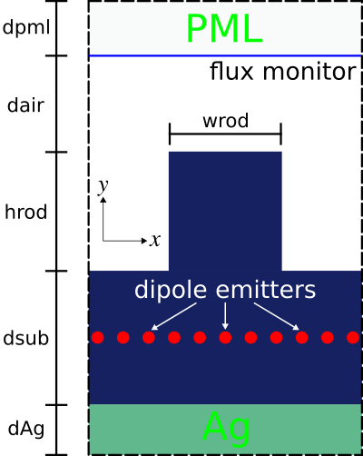

---
# Custom Source
---

This tutorial demonstrates using a custom source to define a source with an arbitrary time profile.

[TOC]

Stochastic Dipole Emission in Light Emitting Diodes
---------------------------------------------------

In addition to the two source time profiles of a [continuous wave](../Scheme_User_Interface.md#continuous-src) (CW) and finite-bandwidth [pulse](../Scheme_User_Interface.md#gaussian-src), Meep supports a [custom source](../Scheme_User_Interface.md#custom-src) for defining an arbitrary time profile. This feature can be used to model **spatially incoherent** random (i.e., [white noise](https://en.wikipedia.org/wiki/White_noise)) dipole emission in a [light-emitting diode](https://en.wikipedia.org/wiki/Light-emitting_diode) (LED), spontaneously recombining excitonic emission in an [organic light-emitting diode](https://en.wikipedia.org/wiki/OLED) (OLED), as well as near-field heat transfer.   Such incoherent emission processes are very different from *coherent* emission by a single collection of sources with a fixed phase relation, and more complicated modeling techniques are required.

This tutorial example involves computing the radiated [flux](../Introduction.md#transmittancereflectance-spectra) from $N=10$ dipole emitters of a 2d LED-like periodic structure with a thin (1d) light-emitting layer. A schematic of the unit cell geometry and simulation layout is shown below. A silver (Ag) back reflector is used to direct nearly all the flux upwards into the $+y$ direction. PML is used to terminate the air region at the top of the cell. (Note: PML is not necessary at the bottom of the cell due to the Ag layer which is effectively a lossless mirror with [skin depth](https://en.wikipedia.org/wiki/Skin_effect) of a few nanometers at a wavelength of 1 μm.) The emitting layer is placed within a lossless dielectric substrate with wavelength-independent refractive index of 3.45.

<center>

</center>

One can take two different approaches to computing the radiated flux based on the type of emitter: (1) random or (2) deterministic. In Method 1 (brute-force Monte Carlo), each emitter is a white-noise dipole: every timestep for every dipole is an independent random number. A single run involves all $N$ dipoles which are modeled using a `custom-src`. The stochastic results for the radiated flux are averaged over multiple trials/iterations via [Monte Carlo sampling](https://en.wikipedia.org/wiki/Monte_Carlo_method). Method 2 exploits the property of [linear time-invariance](https://en.wikipedia.org/wiki/Linear_time-invariant_system) of the materials/geometry and involves a sequence of $N$ separate runs each with a single deterministic dipole (i.e., pulse time profile, `gaussian-src`) at different positions in the emitting layer. Because dipoles at different positions are uncorrelated, the radiated flux from the ensemble is simply the average of all the individual iterations. The two approaches converge towards identical results, but Method 1 is more computationally expensive than Method 2 due to the much larger number of trials/iterations ($\gg  N$) required to attain low noise variance.   (Even more sophisticated deterministic methods exist to reduce the number of separate simulations, especially at high resolutions; for example, replacing the point-dipole sources with a [rapidly converging set of smooth basis functions](https://journals.aps.org/pra/abstract/10.1103/PhysRevA.81.012119), or fancier methods that exploit [trace-estimation methods](http://doi.org/10.1103/PhysRevB.92.134202) and/or transform volumetric sources to [surface sources](http://doi.org/10.1103/PhysRevB.88.054305).)

*Note regarding normalization:* To directly compare the results for the radiated flux from the two methods, one might scale the spectrum from Method 2 in post processing to correct for the difference in spectrum between a Gaussian pulse and white noise. However, it is usually more convenient to *nondimensionalize* the results (for both methods) by dividing the flux spectrum for the textured surface with a reference spectrum computed by the *same method*, for example emission from a flat surface or in a homogeneous medium. This way, the details of the source spectra cancel automatically, and the nondimensionalized results can be compared as-is without any tricky scaling calculations.  This kind of nondimensionalized comparison is useful to determine the *emission enhancement* (or suppression) of one structure relative to another as well as the *light-extraction efficiency* (the ratio of the radiated flux to the total flux emitted by the dipoles).  In order to compute the *absolute* (not relative) light emission by a particular structure, using either Method 1 or Method 2, one would need to rescale the output ([thanks to linearity](http://doi.org/10.1103/PhysRevLett.107.114302)) to convert the input spectrum (from white noise or Gaussian) to the actual emission spectrum (e.g. determined from the gain spectrum of a light-emitting diode).

The simulation script is in [examples/stochastic-emitter.ctl](https://github.com/NanoComp/meep/blob/master/scheme/examples/stochastic-emitter.ctl).

```scm
(set-param! resolution 50)     ;; resolution (pixels/um)

(define-param nr 20)           ;; number of random trials (method 1)
(define-param nd 10)           ;; number of dipoles
(define-param nf 500)          ;; number of frequencies
(define-param textured? false) ;; flat (default) or textured surface
(define-param method 1)        ;; type of method (1 or 2)

(define dpml 1.0)
(define dair 1.0)
(define hrod 0.7)
(define wrod 0.5)
(define dsub 5.0)
(define dAg 0.5)

(define sx 1.1)
(define sy (+ dpml dair hrod dsub dAg))
(set! geometry-lattice (make lattice (size sx sy no-size)))

(set! pml-layers (list (make pml (direction Y) (thickness dpml) (side High))))

(define fcen 1.0)
(define df 0.2)
(define run-time (* 2 (/ nf df)))

(set! geometry (list (make block
                       (material (make medium (index 3.45)))
                       (center 0 (- (* 0.5 sy) dpml dair hrod (* 0.5 dsub)))
                       (size infinity dsub infinity))
                     (make block
                       (material Ag)
                       (center 0 (+ (* -0.5 sy) (* 0.5 dAg)))
                       (size infinity dAg infinity))))

(if textured?
    (set! geometry (append geometry (list (make block
                                            (material (make medium (index 3.45)))
                                            (center 0 (- (* 0.5 sy) dpml dair (* 0.5 hrod)))
                                            (size wrod hrod infinity))))))

(set! k-point (vector3 0 0 0))

(define (compute-flux . args)
  (let ((m (get-keyword-value args #:m 1))
        (n (get-keyword-value args #:n 0)))
    (reset-meep)
    (if (= m 1)
        ;; method 1
        (map (lambda (nn)
               (set! sources (append sources (list (make source
                                                     (src (make custom-src (src-func (lambda (t) (random:normal)))))
                                                     (component Ez)
                                                     (center (* sx (+ -0.5 (/ nn nd))) (+ (* -0.5 sy) dAg (* 0.5 dsub))))))))
             (arith-sequence 0 1 nd))
        ;; method 2
        (set! sources (list (make source
                              (src (make gaussian-src (frequency fcen) (fwidth df)))
                              (component Ez)
                              (center (* sx (+ -0.5 (/ n nd))) (+ (* -0.5 sy) dAg (* 0.5 dsub)))))))
    (set! geometry-lattice geometry-lattice)
    (set! pml-layers pml-layers)
    (set! geometry geometry)
    (let ((flux-mon (add-flux fcen df nf (make flux-region (center 0 (- (* 0.5 sy) dpml)) (size sx 0)))))
      (run-until run-time)
      (display-fluxes flux-mon))))

(if (= method 1)
    (map (lambda (t)
           (compute-flux #:m 1))
         (arith-sequence 0 1 nr))
    (map (lambda (d)
           (compute-flux #:m 2 #:n d))
         (arith-sequence 0 1 nd)))
```

There are five items to note in this script. (1) The frequency discretization of the flux spectrum must be sufficiently fine to resolve noisy features. In this example, the frequency range is 0.9 to 1.1 with spacing of 0.0004. (2) The runtime must be long enough for the DFT spectrum to resolve these oscillations. Due to the Fourier Uncertainty Principle, the runtime should be at least ~1/frequency resolution. Here, we found that a larger runtime of 2/frequency resolution was sufficient to [converge](../FAQ.md#checking-convergence) to the desired accuracy.  Technically, what we are doing is [spectral density estimation](https://en.wikipedia.org/wiki/Spectral_density_estimation) of the [periodogram](https://en.wikipedia.org/wiki/Periodogram) by an ensemble average with a [rectangular window](https://en.wikipedia.org/wiki/Window_function#Rectangular_window), but many variations on this general idea exist.  (3) The material properties for Ag are imported from the [materials library](../Materials.md#materials-library). (4) At the end of each run, the flux spectra is printed to standard output. This data is used to plot the results in post processing. (5) For Method 1, independent random numbers can be used for the white-noise dipole emitters in the trial runs for the two cases of a flat and textured surface, since all that matters is that they average to the same power spectrum.

Results for Methods 1 and 2 for the two cases of a flat and textured surface are generated using the following shell script:
```
#!/bin/bash

# Method 1: flat surface
meep method=1 resolution=50 nf=500 nd=10 nr=500 stochastic-emitter.ctl > method1-flat.out
grep flux method1-flat.out |cut -d, -f2- > method1-flat.dat

# Method 1: textured surface
meep method=1 resolution=50 nf=500 nd=10 nr=500 textured?=true stochastic-emitter.ctl > method1-textured
grep flux method1-textured.out |cut -d, -f2- > method1-textured.dat

# Method 2: flat surface
meep method=2 resolution=50 nf=500 nd=10 stochastic-emitter.ctl > method2-flat.out
grep flux method2-flat.out |cut -d, -f2- > method2-flat.dat

# Method 2: textured surface
meep method=2 resolution=50 nf=500 nd=10 textured?=true stochastic-emitter.ctl > method2-textured
grep flux method2-textured.out |cut -d, -f2- > method2-textured.dat
```

Afterwards, the four data files containing all the flux spectra are used to plot the normalized flux for each method using Octave/Matlab.
```matlab
nfreq = 500;
ntrial = 500;
ndipole = 10

method1_f0 = dlmread('method1-flat.dat',',');
method1_f1 = dlmread('method1-textured.dat',',');

method1_freqs = method1_f0(1:nfreq,1);
method1_f0_flux = reshape(method1_f0(:,2),nfreq,ntrial);
method1_f1_flux = reshape(method1_f1(:,2),nfreq,ntrial);

method1_f0_mean = mean(method1_f0_flux,2);
method1_f1_mean = mean(method1_f1_flux,2);

method2_f0 = dlmread('method2-flat.dat',',');
method2_f1 = dlmread('method2-textured.dat',',');

method2_freqs = method2_f0(1:nfreq,1);
method2_f0_flux = reshape(method2_f0(:,2),nfreq,ndipole);
method2_f1_flux = reshape(method2_f1(:,2),nfreq,ndipole);

method2_f0_mean = mean(method2_f0_flux,2);
method2_f1_mean = mean(method2_f1_flux,2);

semilogy(method1_freqs,method1_f1_mean./method1_f0_mean,'b-');
hold on;
semilogy(method2_freqs,method2_f1_mean./method2_f0_mean,'r-');
xlabel('frequency');
ylabel('normalized flux');
legend('Method 1','Method 2');
```

Results for Method 1 for three different numbers of trials/iterations (10, 50, and 500) are shown in the following three figures. Each trial/iteration involves two runs: one each for the flat and textured surface. As the number of trials/iterations is increased, the "noisiness" in the plot is gradually reduced. However, the total runtime increases significantly.

<center>

</center>

The next figure shows a comparison of the normalized radiated flux for Method 1 (500 trials) and 2 (20 runs; 10 runs each for the flat and textured surface). The results show good agreement over the entire bandwidth spectrum. The Method 1 (labeled "Monte Carlo") results required almost *four days* whereas the Method 2 (labeled "Deterministic") results were obtained in 24 minutes. In general, deterministic approaches tend to be more efficient than brute-force Monte Carlo.

<center>

</center>

One situation in which you may need to perform brute-force Monte Carlo simulations is that of nonlinear or time-varying media, because the equivalence between random and deterministic simulations above relied on linearity and time-invariance.   However, in such media one also cannot directly employ white-noise sources, but you must instead input the noise with the correct spectrum for your desired emission process.   For example, to [model thermal emission in a nonlinear medium](http://doi.org/10.1103/PhysRevB.91.115406) one must have a noise spectrum consistent with the [fluctuation-dissipation theorem](https://en.wikipedia.org/wiki/Fluctuation-dissipation_theorem), which can be achieved using the `noisy-lorentzian-susceptibility` feature in Meep.

*Note regarding convergence properties of Method 2:* In this demonstration, the number of point dipoles used in Method 2 is one per pixel. However, because this example is a unit-cell calculation involving *periodic* boundaries, the number of point dipoles (equivalent to the number of simulations) that are actually necessary to obtain results with sufficient accuracy can be significantly reduced. For smooth periodic functions, it is well known that a [trapezoidal rule](https://en.wikipedia.org/wiki/Trapezoidal_rule) converges quite fast — generally even faster than a cosine-series expansion and comparable to a cosine+sine Fourier series. See these [tutorial notes](http://math.mit.edu/~stevenj/trap-iap-2011.pdf) for the mathematical details. In this example, placing one dipole at every fifth pixel for a total of 15 rather than 75 simulations produces nearly equivalent results for the flux spectrum. More generally, an alternative approach for Method 2 would be to sample a set of dipole points and repeatedly double the sampling density until it converges. Sampling every grid point is usually not necessary.

*Note regarding polarization:* The previous demonstration involved a single-polarization source. For random polarizations, three separate simulations (for $\mathcal{J}_x$, $\mathcal{J}_y$, and $\mathcal{J}_z$) are required. Since the different polarizations are uncorrelated, the results (i.e., the flux spectrum) from each set of single-polarization simulations (which, in general, will have different convergence properties) are then summed in post processing. If the emitters involve *anisotropic* polarizability then the polarizations are correlated. However, in this case choosing the polarizations to correspond to the three principal axes will again make them uncorrelated.