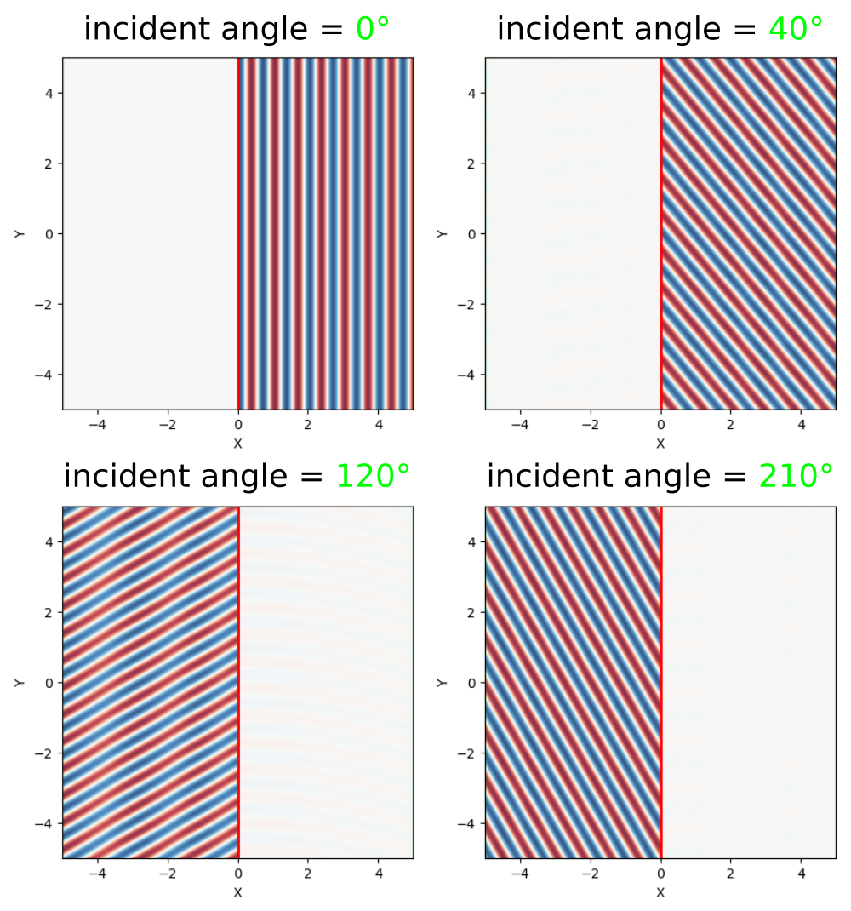

---
# Eigenmode Source
---

This tutorial demonstrates using the [`eigenmode-source`](../Scheme_User_Interface.md#eigenmode-source) to launch a single eigenmode propagating in a single direction. Examples are provided for two kinds of eigenmodes in lossless, dielectric media: (1) localized (i.e., guided) and (2) non-localized (i.e., radiative planewave).

[TOC]

Index-Guided Modes in a Ridge Waveguide
---------------------------------------

The first structure, shown in the schematic below, is a 2d ridge waveguide with ε=12, width $a$=1 μm, and out-of-plane electric field E<sub>z</sub>. The dispersion relation ω(k) for index-guided modes with *even* mirror symmetry in the y-direction is computed using [MPB](https://mpb.readthedocs.io/en/latest/) and shown as blue lines. The light cone which denotes radiative modes is the section in solid green. Using this waveguide configuration, we will investigate two different frequency regimes: (1) single mode (normalized frequency of 0.15) and (2) multi mode (normalized frequency of 0.35), both shown as dotted horizontal lines in the figures. We will use the eigenmode source to excite a specific mode in each case &mdash; labeled **A** and **B** in the band diagram &mdash; and compare the results to using a constant-amplitude source for straight and rotated waveguides. Finally, we will demonstrate that a single monitor plane in the y-direction is sufficient for computing the total Poynting flux in a waveguide with any arbitrary orientation.

<center>

</center>

The simulation script is in [examples/oblique-source.ctl](https://github.com/NanoComp/meep/blob/master/scheme/examples/oblique-source.ctl).

The simulation consists of two parts: (1) computing the Poynting flux and (2) plotting the field profile. The field profile is generated by setting the flag `compute-flux=false`. For the single-mode case, a constant-amplitude current source (`eig-src=false`) excites both the waveguide mode and radiating fields in *both* directions (i.e., forwards and backwards). This is shown in the main inset of the first of two figures above. The `eigenmode-source` excites only the *forward-going* waveguide mode **A** as shown in the smaller inset. Exciting this mode requires setting `eig-src=true`, `fsrc=0.15`, `kx=0.4`, and `bnum=1`. Note that `eigenmode-source` is a line centered at the origin extending the length of the entire cell. The constant-amplitude source is a line that is slightly larger than the waveguide width. The parameter `rot-angle` specifies the rotation angle of the waveguide axis and is initially 0° (i.e., straight or horizontal orientation). This enables `eig-parity` to include `EVEN-Y` in addition to `ODD-Z` and the cell to include an overall mirror symmetry plane in the y-direction.

For the multi-mode case, a constant-amplitude current source excites a superposition of the two waveguide modes in addition to the radiating field. This is shown in the main inset of the second figure above. The `eigenmode-source` excites only a given mode: **A** (`fsrc=0.35`, `kx=0.4`, `bnum=2`) or **B** (`fsrc=0.35`, `kx=1.2`, `bnum=1`) as shown in the smaller insets.

```scm
(set-param! resolution 50) ; pixels/μm

(set! geometry-lattice (make lattice (size 14 14 no-size)))

(set! pml-layers (list (make pml (thickness 2))))

; rotation angle (in degrees) of waveguide, counter clockwise (CCW) around z-axis
(define-param rot-angle 20)
(set! rot-angle (deg->rad rot-angle))

(set! geometry (list (make block
                       (center 0 0 0)
                       (size infinity 1 infinity)
                       (e1 (rotate-vector3 (vector3 0 0 1) rot-angle (vector3 1 0 0)))
                       (e2 (rotate-vector3 (vector3 0 0 1) rot-angle (vector3 0 1 0)))
                       (material (make medium (epsilon 12))))))

(define-param fsrc 0.15) ; frequency of eigenmode or constant-amplitude source
(define-param kx 0.4)    ; initial guess for wavevector in x-direction of eigenmode
(define-param bnum 1)    ; band number of eigenmode

(define kpoint (rotate-vector3 (vector3 0 0 1) rot-angle (vector3 kx 0 0)))

(define-param compute-flux? true) ; compute flux (true) or output the field profile (false)

(define-param eig-src? true)      ; eigenmode (true) or constant-amplitude (false) source

(set! sources (list
               (if eig-src?
                   (make eigenmode-source
                     (src (if compute-flux? (make gaussian-src (frequency fsrc) (fwidth (* 0.2 fsrc))) (make continuous-src (frequency fsrc))))
                     (center 0 0 0)
                     (size 0 14 0)
                     (direction (if (= rot-angle 0) AUTOMATIC NO-DIRECTION))
                     (eig-kpoint kpoint)
                     (eig-band bnum)
                     (eig-parity (if (= rot-angle 0) (+ EVEN-Y ODD-Z) ODD-Z))
                     (eig-match-freq? true))
                   (make source
                     (src (if compute-flux? (make gaussian-src (frequency fsrc) (fwidth (* 0.2 fsrc))) (make continuous-src (frequency fsrc))))
                     (center 0 0 0)
                     (size 0 2 0)
                     (component Ez)))))

(if (= rot-angle 0)
    (set! symmetries (list (make mirror-sym (direction Y)))))

(if compute-flux?
    (let ((tran (add-flux fsrc 0 1 (make flux-region (center 5 0 0) (size 0 14 0)))))
      (run-sources+ 50)
      (display-fluxes tran)
      (let ((res (get-eigenmode-coefficients tran
                                             (list 1)
                                             #:eig-parity (if (= rot-angle 0) (+ ODD-Z EVEN-Y) ODD-Z)
                                             #:direction NO-DIRECTION
                                             #:kpoint-func (lambda (f n) kpoint))))
        (print "mode-coeff-flux:, " (sqr (magnitude (array-ref (list-ref res 0) 0 0 0))) "\n")))
    (run-until 100 (in-volume (volume (center 0 0 0) (size 10 10 0))
                              (at-beginning output-epsilon)
                              (at-end output-efield-z))))
```

Note that in `eigenmode-source`, the `direction` property must be set to `NO-DIRECTION` for a non-zero `eig-kpoint` which specifies the waveguide axis.

Additionally, we can demonstrate the eigenmode source for a rotated waveguide. The results are shown in the two figures below for the single- and multi-mode case. There is one subtlety: for mode **A** in the multi-mode case, the `bnum` parameter is set to 3 rather than 2. This is because a non-zero rotation angle breaks the symmetry in the y-direction which therefore precludes the use of `EVEN-Y` in `eig-parity`. Without any parity specified for the y-direction, the second band corresponds to *odd* modes. This is why we must select the third band which contains even modes. An oblique waveguide also leads to a breakdown in the [PML](../Perfectly_Matched_Layer.md). A simple workaround for mitigating the PML artifacts is to increase its length which is why the `thickness` has been doubled from 1 to 2.

<center>

</center>

There are numerical dispersion artifacts due to the FDTD spatial and temporal discretizations which create negligible backward-propagating waves by the eigenmode current source, carrying approximately 10<sup>-5</sup> of the power of the desired forward-propagating mode. These artifacts can be seen as residues in the field profiles.

<center>

</center>

Finally, we demonstrate that the total power in a waveguide with *arbitrary* orientation — computed using two equivalent methods via `get_fluxes` and [mode decomposition](../Mode_Decomposition.md) — can be computed by a single flux plane oriented along the y direction: thanks to [Poynting's theorem](https://en.wikipedia.org/wiki/Poynting%27s_theorem), the flux through any plane crossing a lossless waveguide is the same, regardless of whether the plane is oriented perpendicular to the waveguide. Furthermore, the eigenmode source is normalized in such a way as to produce the same power regardless of the waveguide orientation — in consequence, the flux values for mode **A** of the single-mode case for rotation angles of 0°, 20°, and 40° are 1111.280794, 1109.565028, and 1108.759159, within 0.2% (discretization error) of one another.

Planewaves in Homogeneous Media
-------------------------------

The eigenmode source can also be used to launch [planewaves](https://en.wikipedia.org/wiki/Plane_wave) in homogeneous media. The dispersion relation for a planewave is ω=|$\vec{k}$|/$n$ where ω is the angular frequency of the planewave and $\vec{k}$ its wavevector; $n$ is the refractive index of the homogeneous medium. This example demonstrates launching planewaves in a uniform medium with $n$ of 1.5 at three rotation angles: 0°, 20°, and 40°. Bloch-periodic boundaries via the `k-point` are used and specified by the wavevector $\vec{k}$. PML boundaries are used only along the x-direction.

The simulation script is in [examples/oblique-planewave.ctl](https://github.com/NanoComp/meep/blob/master/scheme/examples/oblique-planewave.ctl).

```scm
(set-param! resolution 50) ; pixels/μm

(set! geometry-lattice (make lattice (size 14 10 no-size)))

(set! pml-layers (list (make pml (thickness 2) (direction X))))

; rotation angle (in degrees) of planewave, counter clockwise (CCW) around z-axis
(define-param rot-angle 0)
(set! rot-angle (deg->rad rot-angle))

(define-param fsrc 1.0) ; frequency of planewave (wavelength = 1/fsrc)

(define-param n 1.5) ; refractive index of homogeneous material
(set! default-material (make medium (index n)))

(define k (rotate-vector3 (vector3 0 0 1) rot-angle (vector3 (* fsrc n) 0 0)))
(set! k-point k)

(if (= rot-angle 0)
    (set! symmetries (list (make mirror-sym (direction Y)))))

(set! sources (list
               (make eigenmode-source
                 (src (make continuous-src (frequency fsrc)))
                 (center 0 0 0)
                 (size 0 10 0)
                 (direction (if (= rot-angle 0) AUTOMATIC NO-DIRECTION))
                 (eig-kpoint k)
                 (eig-band 1)
                 (eig-parity (if (= rot-angle 0) (+ EVEN-Y ODD-Z) ODD-Z))
                 (eig-match-freq? true))))

(run-until 100 (in-volume (volume (center 0 0 0) (size 10 10 0))
                          (at-end output-efield-z)))
```

Note that this example involves a `continuous-source` for the time profile. For a pulsed source, the oblique planewave is incident at a given angle for only a *single* frequency component of the source. This is a fundamental feature of FDTD simulations and not of Meep per se. Thus, to simulate an incident planewave at multiple angles for a given frequency ω, you will need to do separate simulations involving different values of $\vec{k}$ (`k-point`) since each set of ($\vec{k}$,ω) specifying the Bloch-periodic boundaries and the frequency of the source will produce a different angle of the planewave. For more details, refer to Section 4.5 ("Efficient Frequency-Angle Coverage") in [Chapter 4](https://arxiv.org/abs/1301.5366) ("Electromagnetic Wave Source Conditions") of [Advances in FDTD Computational Electrodynamics: Photonics and Nanotechnology](https://www.amazon.com/Advances-FDTD-Computational-Electrodynamics-Nanotechnology/dp/1608071707).

Shown below are the steady-state field profiles generated by the planewave for the three rotation angles. Residues of the backward-propagating waves due to the discretization are slightly visible.

<center>

</center>