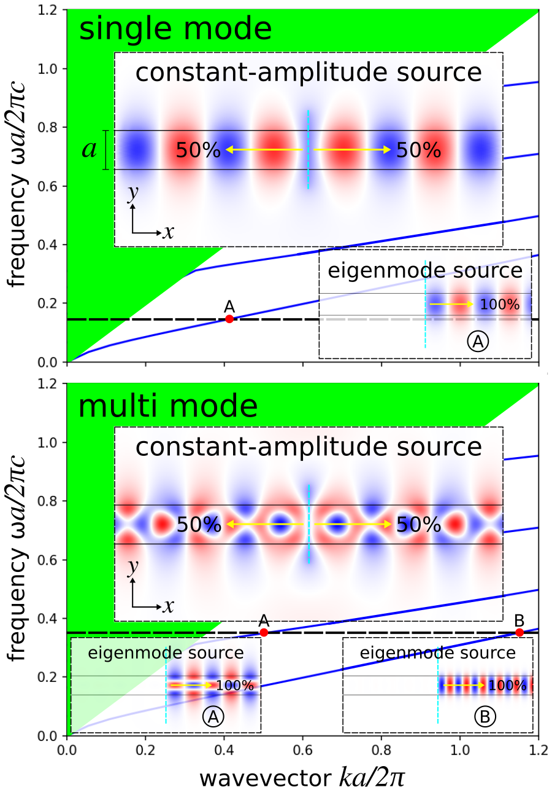
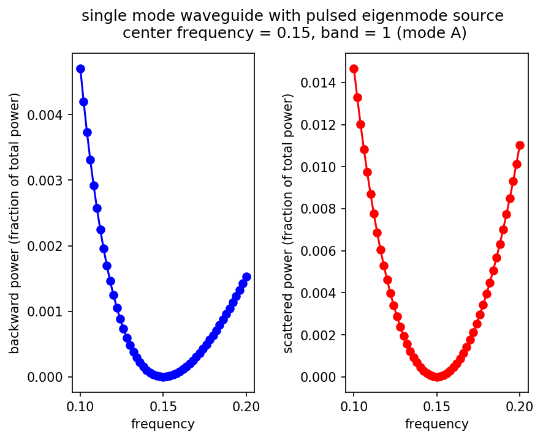

---
# Eigenmode Source
---

This tutorial demonstrates using the [`eigenmode-source`](../Scheme_User_Interface.md#eigenmode-source) to launch a single eigenmode propagating in a single direction. Examples are provided for two kinds of eigenmodes in lossless, dielectric media: (1) localized (i.e., guided) and (2) non-localized (i.e., radiative planewave).

[TOC]

Index-Guided Modes in a Ridge Waveguide
---------------------------------------

The first structure, shown in the schematic below, is a 2d ridge waveguide with ε=12, width $a$=1 μm, and out-of-plane electric field E<sub>z</sub>. The dispersion relation ω(k) for index-guided modes with *even* mirror symmetry in the $y$-direction is computed using [MPB](https://mpb.readthedocs.io/en/latest/) and shown as blue lines. The light cone which denotes radiative modes is the section in solid green. Using this waveguide configuration, we will investigate two different frequency regimes: (1) single mode (normalized frequency of 0.15) and (2) multi mode (normalized frequency of 0.35), both shown as dotted horizontal lines in the figures. We will use the eigenmode source to excite a specific mode in each case &mdash; labeled **A** and **B** in the band diagram &mdash; and compare the results to using a constant-amplitude source for straight and rotated waveguides. Finally, we will demonstrate that a single monitor plane in the $y$-direction is sufficient for computing the total Poynting flux in a waveguide with any arbitrary orientation.

<center>

</center>

The simulation script is in [examples/oblique-source.ctl](https://github.com/NanoComp/meep/blob/master/scheme/examples/oblique-source.ctl).

The simulation consists of two parts: (1) computing the Poynting flux and (2) plotting the field profile. The field profile is generated by setting the flag `compute-flux=false`. For the single-mode case, a constant-amplitude current source (`eig-src=false`) excites both the waveguide mode and radiating fields in *both* directions (i.e., forwards and backwards). This is shown in the main inset of the first of two figures above. The `eigenmode-source` excites only the *forward-going* waveguide mode **A** as shown in the smaller inset. Launching this mode requires setting `eig-src=true`, `fsrc=0.15`, and `bnum=1`. Note that the length of the `EigenModeSource` must be large enough that it captures the entire guided mode (i.e., the fields should decay to roughly zero at the edges). The line source does *not* need to span the entire length of the cell but should be slightly larger than the waveguide width. The parameter `rot-angle` specifies the rotation angle of the waveguide axis and is initially 0° (i.e., straight or horizontal orientation). This enables `eig-parity` to include `EVEN-Y` in addition to `ODD-Z` and the cell to include an overall mirror symmetry plane in the $y$-direction.

For the multi-mode case, a constant-amplitude current source excites a superposition of the two waveguide modes in addition to the radiating field. This is shown in the main inset of the second figure above. The `eigenmode-source` excites only a given mode: **A** (`fsrc=0.35`, `bnum=2`) or **B** (`fsrc=0.35`, `bnum=1`) as shown in the smaller insets.

```scm
(set-param! resolution 50) ; pixels/μm

(set! geometry-lattice (make lattice (size 14 14 no-size)))

(set! pml-layers (list (make pml (thickness 2))))

; rotation angle (in degrees) of waveguide, counter clockwise (CCW) around z-axis
(define-param rot-angle 20)
(set! rot-angle (deg->rad rot-angle))

; width of waveguide
(define-param w 1.0)

(set! geometry (list (make block
                       (center 0 0 0)
                       (size infinity w infinity)
                       (e1 (rotate-vector3 (vector3 0 0 1) rot-angle (vector3 1 0 0)))
                       (e2 (rotate-vector3 (vector3 0 0 1) rot-angle (vector3 0 1 0)))
                       (material (make medium (epsilon 12))))))

(define-param fsrc 0.15) ; frequency of eigenmode or constant-amplitude source
(define-param bnum 1)    ; band number of eigenmode

(define kpoint (rotate-vector3 (vector3 0 0 1) rot-angle (vector3 1 0 0)))

(define-param compute-flux? true) ; compute flux (true) or output the field profile (false)

(define-param eig-src? true)      ; eigenmode (true) or constant-amplitude (false) source

(set! sources (list
               (if eig-src?
                   (make eigenmode-source
                     (src (if compute-flux? (make gaussian-src (frequency fsrc) (fwidth (* 0.2 fsrc))) (make continuous-src (frequency fsrc))))
                     (center 0 0 0)
                     (size 0 (* 3 w) 0)
                     (direction (if (= rot-angle 0) AUTOMATIC NO-DIRECTION))
                     (eig-kpoint kpoint)
                     (eig-band bnum)
                     (eig-parity (if (= rot-angle 0) (+ EVEN-Y ODD-Z) ODD-Z))
                     (eig-match-freq? true))
                   (make source
                     (src (if compute-flux? (make gaussian-src (frequency fsrc) (fwidth (* 0.2 fsrc))) (make continuous-src (frequency fsrc))))
                     (center 0 0 0)
                     (size 0 (* 3 w) 0)
                     (component Ez)))))

(if (= rot-angle 0)
    (set! symmetries (list (make mirror-sym (direction Y)))))

(if compute-flux?
    (let ((tran (add-flux fsrc 0 1 (make flux-region (center 5 0 0) (size 0 14 0)))))
      (run-sources+ 50)
      (display-fluxes tran)
      (let ((res (get-eigenmode-coefficients tran
                                             (list 1)
                                             #:eig-parity (if (= rot-angle 0) (+ ODD-Z EVEN-Y) ODD-Z)
                                             #:direction NO-DIRECTION
                                             #:kpoint-func (lambda (f n) kpoint))))
        (print "mode-coeff-flux:, " (sqr (magnitude (array-ref (list-ref res 0) 0 0 0))) "\n")))
    (run-until 100 (in-volume (volume (center 0 0 0) (size 10 10 0))
                              (at-beginning output-epsilon)
                              (at-end output-efield-z))))
```

Note that in `eigenmode-source`, the `direction` property must be set to `NO-DIRECTION` whenever `eig-kpoint` specifies the waveguide axis.

### What Happens When the Source Time Profile is a Pulse?

The eigenmode source launches a fixed spatial mode profile specified by either its frequency (`eig-match-freq?` is `true`) or wavevector (`eig-match-freq?` is `false`) multiplied by the time profile.  When the time profile of the source has a finite bandwidth, e.g. a [Gaussian pulse](../Scheme_User_Interface.md#gaussian-src) (which is typical for calculations involving [Fourier-transformed fields](../FAQ.md#for-calculations-involving-fourier-transformed-fields-why-should-the-source-be-a-pulse-rather-than-a-continuous-wave) such as [mode coefficients or S-parameters](Mode_Decomposition.md)), then the frequency-dependence (dispersion) of the true modal pattern means that the eigenmode source does not match the desired mode exactly over the whole bandwidth. This is described in Section 4.2.2 of the review article [Electromagnetic Wave Source Conditions](https://arxiv.org/abs/1301.5366). A more accurate mode profile may be obtained by adding multiple narrow-band eigenmode sources at the same position at several frequencies across the bandwidth, but this has the disadvantage that the runtime increases as you add more frequency points due to the narrower source bandwidths. However, a *single* broadband eigenmode source is often sufficient for most practical applications (excepting cases with extreme modal dispersion, e.g. near a cutoff frequency).

This can be demonstrated by computing the error in a broadband eigenmode source via the backward-propagating and scattered power (i.e., any fields which are not forward-propagating waveguide modes) for the single and multi mode ridge waveguide.

```scm
(set-param! resolution 50) ; pixels/μm

(define-param sxy 10)
(set! geometry-lattice (make lattice (size sxy sxy no-size)))

(define-param dpml 1)
(set! pml-layers (list (make pml (thickness dpml))))

(define-param w 1.0) ; width of waveguide

(set! geometry (list (make block
                       (center 0 0 0)
                       (size infinity w infinity)
                       (material (make medium (epsilon 12))))))

(define-param fsrc 0.15) ; frequency of eigenmode source
(define-param bnum 1)    ; band number of eigenmode

(define df 0.1)          ; frequency width
(define nfreq 51)        ; number of frequencies

(set! sources (list
               (make eigenmode-source
                 (src (make gaussian-src (frequency fsrc) (fwidth df)))
                 (center 0 0 0)
                 (size 0 sxy 0)
                 (eig-parity (+ EVEN-Y ODD-Z))
                 (eig-band bnum)
                 (eig-match-freq? true))))

(set! symmetries (list (make mirror-sym (direction Y))))

(define flux-mon-tp (add-flux fsrc df nfreq (make flux-region (center 0 (- (* +0.5 sxy) dpml)) (size (- sxy (* 2 dpml)) 0) (weight +1))))
(define flux-mon-bt (add-flux fsrc df nfreq (make flux-region (center 0 (+ (* -0.5 sxy) dpml)) (size (- sxy (* 2 dpml)) 0) (weight -1))))
(define flux-mon-rt (add-flux fsrc df nfreq (make flux-region (center (- (* +0.5 sxy) dpml) 0) (size 0 (- sxy (* 2 dpml))) (weight +1))))
(define flux-mon-lt (add-flux fsrc df nfreq (make flux-region (center (+ (* -0.5 sxy) dpml) 0) (size 0 (- sxy (* 2 dpml))) (weight -1))))

(run-sources+ 50)

(display-fluxes flux-mon-tp flux-mon-bt flux-mon-rt flux-mon-lt)

(define res (get-eigenmode-coefficients flux-mon-rt (list bnum) #:eig-parity (+ EVEN-Y ODD-Z)))
(define coeffs (list-ref res 0))
(define freqs (get-flux-freqs flux-mon-rt))

(map (lambda (nf)
       (let ((guided-power (sqr (magnitude (array-ref coeffs 0 nf 0)))))
         (print "guided:, " (number->string (list-ref freqs nf)) ", " (number->string guided-power) "\n")))
     (arith-sequence 0 1 nfreq))
```

Results are generated using the following shell script and plotted in Octave/Matlab for the single mode waveguide with one eigenmode **A** (band 1) using a center frequency of `0.15` and multi mode waveguide with two eigenmodes **A** (higher-order mode, band 2) and **B** (fundamental mode, band 1), all with a center frequency of `0.35`.

```sh
$ meep fsrc=0.15 bnum=1 eigsource-pulse.ctl |tee singlemode-A.out
$ grep flux1: singlemode-A.out |cut -d, -f2- > singlemode-A-flux.dat
$ grep guided: singlemode-A.out |cut -d, -f2- > singlemode-A-guided.dat

$ meep fsrc=0.35 bnum=2 eigsource-pulse.ctl |tee multimode-A.out
$ grep flux1: multimode-A.out |cut -d, -f2- > multimode-A-flux.dat
$ grep guided: multimode-A.out |cut -d, -f2- > multimode-A-guided.dat

$ meep fsrc=0.35 bnum=1 eigsource-pulse.ctl |tee multimode-B.out
$ grep flux1: multimode-B.out |cut -d, -f2- > multimode-B-flux.dat
$ grep guided: multimode-B.out |cut -d, -f2- > multimode-B-guided.dat
```

```matlab
fl = dlmread('multimode-B-flux.dat',',');
gp = dlmread('multimode-B-guided.dat',',');

freqs = fl(:,1);
flux_total = sum(fl(:,2:5),2);
back = fl(:,5) ./ flux_total;
scat = (flux_total - gp(:,2)) ./ flux_total;

subplot(1,2,1);
plot(freqs,back,'bo-');
xlabel('frequency');
ylabel('backward power (fraction of total power)');
axis tight;

subplot(1,2,2);
plot(freqs,scat,'ro-');
xlabel('frequency');
ylabel('scattered power (fraction of total power)');
axis tight;
```

<center>

</center>

<center>

</center>

<center>

</center>

These results demonstrate that in all cases the error is nearly 0 at the center frequency and increases roughly quadratically away from the center frequency. The error tends to be smallest for single-mode waveguides because a localized source excitation couples most strongly into guided modes. Note that in this case the maximum error is ~1% for a source bandwidth that is 67% of its center frequency.  For the multi-mode waveguide, a much larger scattering loss is obtained for the higher-order mode **A** at frequencies below the center frequency, but this is simply because that mode ceases to be guided around a frequency `≈ 0.3`, and the mode pattern changes dramatically as this cutoff is approached.

Another thing to keep in mind is that, even if the modes are imperfectly launched (some power leaks into radiation or into the backward direction), the correct result involving the Poynting flux can still be obtained by the standard procedure of normalizing against a separate straight-waveguide run (and subtracting off fields before computing reflected fluxes), as explained in [Introduction](../Introduction.md#transmittancereflectance-spectra). More accurate mode launching may be required for multi-mode waveguide systems, however, as power coupled into an undesired *guided* mode will not typically decay away.

### Oblique Waveguides

The eigenmode source can also be used to launch modes in an oblique/rotated waveguide. The results are shown in the two figures below for the single- and multi-mode case. There is one subtlety: for mode **A** in the multi-mode case, the `bnum` parameter is set to 3 rather than 2. This is because a non-zero rotation angle breaks the symmetry in the $y$-direction which therefore precludes the use of `EVEN-Y` in `eig-parity`. Without any parity specified for the $y$-direction, the second band corresponds to *odd* modes. This is why we must select the third band which contains even modes.

Note that an oblique waveguide leads to a breakdown in the [PML](../Perfectly_Matched_Layer.md#breakdown-of-pml-in-inhomogeneous-media). A simple workaround for mitigating the PML reflection artifacts in this case is to double the `thickness` from 1 to 2.

<center>

</center>

There are numerical dispersion artifacts due to the FDTD spatial and temporal discretizations which create negligible backward-propagating waves by the eigenmode current source, carrying approximately 10<sup>-5</sup> of the power of the desired forward-propagating mode. These artifacts can be seen as residues in the field profiles.

<center>

</center>

We demonstrate that the total power in a waveguide with *arbitrary* orientation — computed using two equivalent methods via `get_fluxes` and [mode decomposition](../Mode_Decomposition.md) — can be computed by a single flux plane oriented along the $y$ direction: thanks to [Poynting's theorem](https://en.wikipedia.org/wiki/Poynting%27s_theorem), the flux through any plane crossing a lossless waveguide is the same, regardless of whether the plane is oriented perpendicular to the waveguide. Furthermore, the eigenmode source is normalized in such a way as to produce the same power regardless of the waveguide orientation — in consequence, the flux values for mode **A** of the single-mode case for rotation angles of 0°, 20°, and 40° are 1111.280794, 1109.565028, and 1108.759159, within 0.2% (discretization error) of one another.

Finally, we demonstrate that as long as the line source intersects the waveguide *and* `eig-kpoint` is not nearly parallel to the direction of the line source, the mode can be properly launched. As shown in the field profiles below for the single-mode waveguide, there does not seem to be any noticeable distortion in the launched mode as the waveguide approaches glancing incidence to the source plane up to 80°, where the total power in the forward-propagating mode is 97%. Note that the line source spans the entire length of the cell extending into the PML region (not shown). In this example where the cell length is 10 μm (or 10X the width of the waveguide), the maximum rotation angle is ~84°, where the power drops to 59% and backward-propagating fields are clearly visible.

<center>

</center>

Increasing the size of the cell improves results at the expense of a larger simulation. The field profiles shown below are for a cell where the length has been doubled to 20 μm. The waveguide power at 84° increases from 59% to 80%. However, as the waveguide mode approaches glancing incidence, sensitivity to discretization errors increases because the mode varies rapidly with frequency on a glancing-angle cross-section, and you will eventually need to increase the resolution as well as the cell size. For waveguide angles much beyond 45° you probably want to simply change the orientation of the line source by 90°.

<center>

</center>

Planewaves in Homogeneous Media
-------------------------------

The eigenmode source can also be used to launch [planewaves](https://en.wikipedia.org/wiki/Plane_wave) in homogeneous media. The dispersion relation for a planewave is ω=|$\vec{k}$|/$n$ where ω is the angular frequency of the planewave and $\vec{k}$ its wavevector; $n$ is the refractive index of the homogeneous medium ($c=1$ in Meep units). This example demonstrates launching planewaves in a uniform medium with $n=1.5$ at three rotation angles: 0°, 20°, and 40°. Bloch-periodic boundaries via the `k-point` are used and specified by the wavevector $\vec{k}$. PML boundaries are used only along the $x$-direction.

The simulation script is in [examples/oblique-planewave.ctl](https://github.com/NanoComp/meep/blob/master/scheme/examples/oblique-planewave.ctl).

```scm
(set-param! resolution 50) ; pixels/μm

(set! geometry-lattice (make lattice (size 14 10 no-size)))

(set! pml-layers (list (make pml (thickness 2) (direction X))))

; rotation angle (in degrees) of planewave, counter clockwise (CCW) around z-axis
(define-param rot-angle 0)
(set! rot-angle (deg->rad rot-angle))

(define-param fsrc 1.0) ; frequency of planewave (wavelength = 1/fsrc)

(define-param n 1.5) ; refractive index of homogeneous material
(set! default-material (make medium (index n)))

(define k (rotate-vector3 (vector3 0 0 1) rot-angle (vector3 (* fsrc n) 0 0)))
(set! k-point k)

(if (= rot-angle 0)
    (set! symmetries (list (make mirror-sym (direction Y)))))

(set! sources (list
               (make eigenmode-source
                 (src (make continuous-src (frequency fsrc)))
                 (center 0 0 0)
                 (size 0 10 0)
                 (direction (if (= rot-angle 0) AUTOMATIC NO-DIRECTION))
                 (eig-kpoint k)
                 (eig-band 1)
                 (eig-parity (if (= rot-angle 0) (+ EVEN-Y ODD-Z) ODD-Z))
                 (eig-match-freq? true))))

(run-until 100 (in-volume (volume (center 0 0 0) (size 10 10 0))
                          (at-end output-efield-z)))
```

Note that the line source spans the *entire* length of the cell. (Planewave sources extending into the PML region must include `(is-integrated true)`.) This example involves a continuous-wave (CW) time profile. For a pulse profile, the oblique planewave is incident at a given angle for only a *single* frequency component of the source; see [Tutorial/Basics/Angular Reflectance Spectrum of a Planar Interface](../Scheme_Tutorials/Basics.md#angular-reflectance-spectrum-of-a-planar-interface). This is a fundamental feature of FDTD simulations and not of Meep per se. To simulate an incident planewave at multiple angles for a given frequency ω, you will need to do separate simulations involving different values of $\vec{k}$ (`k-point`) since each set of ($\vec{k}$,ω) specifying the Bloch-periodic boundaries and the frequency of the source will produce a different angle of the planewave. For more details, refer to Section 4.5 ("Efficient Frequency-Angle Coverage") in [Chapter 4](https://arxiv.org/abs/1301.5366) ("Electromagnetic Wave Source Conditions") of [Advances in FDTD Computational Electrodynamics: Photonics and Nanotechnology](https://www.amazon.com/Advances-FDTD-Computational-Electrodynamics-Nanotechnology/dp/1608071707).

Shown below are the steady-state field profiles generated by the planewave for the three rotation angles. Residues of the backward-propagating waves due to the discretization are slightly visible.

<center>

</center>
