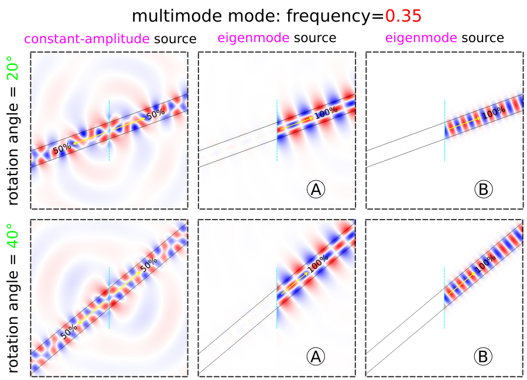

---
# Eigenmode Source
---

This example demonstrates using the [`eigenmode-source`](../Scheme_User_Interface.md#eigenmode-source) to couple exclusively to a single waveguide mode. The structure, shown in the schematic below, is a 2d dielectric waveguide with ε=12, width $a$=1 μm, and out-of-plane electric field E<sub>z</sub>. The dispersion relation ω(k) for index-guided modes with *even* mirror symmetry in the y-direction is computed using [MPB](https://mpb.readthedocs.io/en/latest/) and shown in blue. The light cone which denotes radiative modes is the green section. Using this waveguide configuration, we will investigate two different frequency regimes: (1) single mode (normalized frequency of 0.15) and (2) multi mode (normalized frequency of 0.35), both shown as dotted lines in the figure. We will use the eigenmode source to excite a specific mode in each case &mdash; labeled **A** and **B** in the band diagram &mdash; and compare the results to using a constant-amplitude source for straight and rotated waveguides. Finally, we will demonstrate that a monitor plane in the y-direction is sufficient for computing the Poynting flux in a waveguide with arbitrary orientation.

<center>

</center>

The simulation script is in [examples/oblique-source.py](https://github.com/NanoComp/meep/blob/master/scheme/examples/oblique-source.ctl).

The field profiles are generated via `compute-flux=false`. For the single-mode case, a constant-amplitude current source (`eig-src=false`) excites both the waveguide mode and radiating fields in both directions. This is shown in the main inset of the figure above. The `eigenmode-source` excites only the right-going waveguide mode **A** as shown in the smaller inset. Exciting this mode requires setting `eig-src=true`, `fsrc=0.15`, `kx=0.4`, and `bnum=1`. Note that `eigenmode-source` is a line centered at the origin extending the length of the entire cell. The constant-amplitude source is a line that is slightly larger than the waveguide width. The parameter `rot-angle` specifies the rotation angle of the waveguide axis and is initially 0 (i.e., straight or horizontal orientation). This enables `eig-parity` to include `EVEN-Y` in addition to `ODD-Z` and the cell to include a mirror symmetry plane in the y-direction.

For the multi-mode case, a constant-amplitude current source excites a superposition of the two waveguide modes in addition to the radiating field. This is again shown in the main inset of the figure above. The `eigenmode-source` excites only a given mode: **A** (`fsrc=0.35`, `kx=0.4`, `bnum=2`) or **B** (`fsrc=0.35`, `kx=1.2`, `bnum=1`) as shown in the smaller insets.

```scm
(set-param! resolution 50) ; pixels/μm

(set! geometry-lattice (make lattice (size 14 14 no-size)))

(set! pml-layers (list (make pml (thickness 2))))

(define-param rot-angle 0) ; rotation angle (in degrees) of waveguide, CCW around z-axis
(set! rot-angle (deg->rad rot-angle))

(set! geometry (list (make block
                       (center 0 0 0)
                       (size infinity 1 infinity)
                       (e1 (rotate-vector3 (vector3 0 0 1) rot-angle (vector3 1 0 0)))
                       (e2 (rotate-vector3 (vector3 0 0 1) rot-angle (vector3 0 1 0)))
                       (material (make medium (epsilon 12))))))

(define-param fsrc 0.15) ; frequency of eigenmode or constant-amplitude source
(define-param kx 0.4)    ; initial guess for wavevector in x-direction of eigenmode
(define-param bnum 1)    ; band number of eigenmode

(define-param compute-flux? true) ; compute flux (true) or output the field profile (false)

(define-param eig-src? true)      ; eigenmode (true) or constant-amplitude (false) source

(set! sources (list
               (if eig-src?
                   (make eigenmode-source
                     (src (if compute-flux? (make gaussian-src (frequency fsrc) (fwidth (* 0.2 fsrc))) (make continuous-src (frequency fsrc))))
                     (center 0 0 0)
                     (size 0 14 0)
                     (direction (if (= rot-angle 0) AUTOMATIC NO-DIRECTION))
                     (eig-kpoint (rotate-vector3 (vector3 0 0 1) rot-angle (vector3 kx 0 0)))
                     (eig-band bnum)
                     (eig-parity (if (= rot-angle 0) (+ EVEN-Y ODD-Z) ODD-Z))
                     (eig-match-freq? true))
                   (make source
                     (src (if compute-flux? (make gaussian-src (frequency fsrc) (fwidth (* 0.2 fsrc))) (make continuous-src (frequency fsrc))))
                     (center 0 0 0)
                     (size 0 2 0)
                     (component Ez)))))

(if (= rot-angle 0)
    (set! symmetries (list (make mirror-sym (direction Y)))))

(if compute-flux?
    (let ((tran (add-flux fsrc 0 1 (make flux-region (center 5 0 0) (size 0 14 0)))))
      (run-sources+ 50)
      (display-fluxes tran))
    (run-until 100 (in-volume (volume (center 0 0 0) (size 10 10 0))
                              (at-beginning output-epsilon)
                              (at-end output-efield-z))))
```

Note that in the eigenmode source, `direction` must be set to `NO-DIRECTION` for a non-zero `eig-kpoint` which specifies the waveguide axis.

Additionally, we can demonstrate the eigenmode source for a rotated waveguide. The results are shown in the two figures below for the single- and multi-mode case. There is one subtlety: for mode **A** in the multi-mode case, the `bnum` parameter is set to 3 rather than 2. This is because a non-zero rotation angle breaks the symmetry in the y-direction which therefore precludes the use of `EVEN-Y` in `eig-parity`. Without any parity specified for the y-direction, the second band corresponds to *odd* modes. This is why we must select the third band which contains even modes. An oblique waveguide also leads to a breakdown in the [PML](../Perfectly_Matched_Layer.md). A simple workaround for mitigating reflections from the boundary layers is to increase its length: the PML length has been doubled from 1 to 2.

<center>

</center>

There are numerical dispersion artifacts due to the FDTD spatial and temporal discretizations which create negligible backwards (leftward-propagating) wave artifacts by the eigenmode current source, carrying approximately 10<sup>-5</sup> of the power of the desired rightward-propagating mode. These can be seen as artifacts in the field profiles.

<center>

</center>

Finally, we demonstrate that the power flux through a waveguide with an *arbitrary* orientation can be computed by a single flux plane oriented along the y direction: thanks to Poynting's theorem, the flux through any plane crossing a lossless waveguide is the same, regardless of whether the plane is oriented perpendicular to the waveguide.  Furthermore, the eigenmode source is normalized in such a way as to produce the same power regardless of the waveguide orientation — in consequence, the flux values for mode **A** of the single-mode case for rotation angles of 0°, 20°, and 40° are 77.000266, 76.879339, and 76.817850, within 0.2% (discretization error) of one another.
